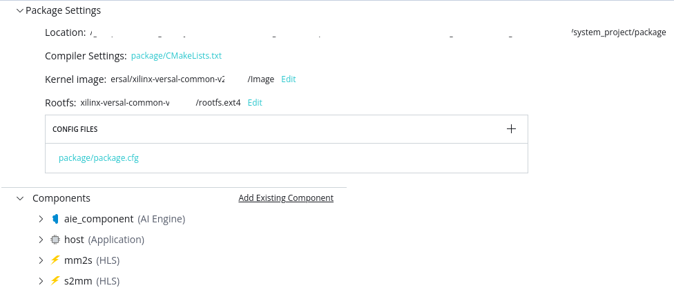

<table class="sphinxhide" width="100%">
 <tr width="100%">
    <td align="center"><h1>AI Engine Development</h1>
    <a href="https://www.xilinx.com/products/design-tools/vitis.html">See Vitis™ Development Environment on xilinx.com</br></a>
    <a href="https://www.xilinx.com/products/design-tools/vitis/vitis-ai.html">See Vitis™ AI Development Environment on xilinx.com</a>
    </td>
 </tr>
</table>

# Porting a Command Line Project to the Vitis IDE Project

This section walks you through the flow of porting your command line project to the Vitis IDE project. One advantage of porting the design from command line to the IDE project is to use the debug capabilities of the GUI-based project both at an AI Engine level and at a system level.

* Before beginning this section of tutorial, it is expected that you have run the steps to set the environment variables as described in [Introduction](./README.md#Introduction).
* Clone the GIT repository, and navigate to the `09-debug-walkthrough` tutorial directory.

## Step 1: Launch Vitis Unified IDE

**IMPORTANT:** The following steps assume you have configured the environment as described in the [*Introduction*](./README.md) of the tutorial. 

To begin the tutorial, you must create a workspace for your design and launch the new Vitis unified IDE. Use the following command sequence to change directory to the current tutorial, make a workspace folder, and launch the IDE: 


```
cd <tutorial_path>/09-debug-walkthrough/
mkdir peakDetect
vitis -w peakDetect
```

## Step 2: Create an AI Engine Component

As shown in the figure above, this tutorial contains three AI Engine kernels: Interpolator, Polar_clip, and Classifier. Start by creating the AIE component that will contain the graph and kernels. Run the following steps:

1.  From the main menu select **File > New Component > AI Engine**

This opens the Create AI Engine Component wizard on the *Name and Location* page. 

2.  Enter the `Component name` as aie_component (default), enter the `Component location` as the workspace (default), and click **Next**. 

This opens the *Add Source Files* page. 

3.  Select `Import Sources > Add Folder` and navigate to `<tutorial_path>/09-debug-walkthrough/cmd_src/aie` and click **OK**. Repeat the process to add the `data/` directory also.

4. Under `Select top-level file` confirm that `graph.cpp` has been selected and click **Next**. 

The tool automatically selects the top-level graph from imported files. You just need to make sure it has chosen correctly. Clicking **Next** opens the *Select Part* page.  

5.  Select the `xilinx_vck190_base_20XXX0_1` platform and click **Next** to open the *Summary* page. 

6.  Review the *Summary* page and click **Finish** to create the defined AI Engine component. 

This results in the aie_component `vitis-comp.json` file being opened. This is the file associated with the component in the Vitis unified IDE as shown in the following image. The tab at the top will display `vitis-comp.json`, but it is the aie_component you just created. 


7. Select the `aiecompiler.cfg` link and open the config file. It contains `include` statements for the added `aie` source code folder. 
8. Add a new line `include=<path to/WorkspaceDirectory>/aie/kernels`. 

The `[aie]` section contains configuration commands such as the `xchess` statement. Refer to [*v++ Mode AI Engine*](https://docs.xilinx.com/r/en-US/ug1553-vitis-ide/v-Mode-AI-Engine) for more information on these configuration commands. 

In the Vitis Components explorer, expand the `aie_component` and examine the included sub-folders: Settings, Includes, Sources... Notice the `aie` folder you imported into the Sources folder. 

## Step 3: Create HLS Components

The AIE graph application you are working on requires two PL kernels to load data onto the device. These are the `mm2s` and `s2mm` kernels. You will create separate HLS components using the following steps: 

1.  From the main menu select **File > New Component > HLS**

This opens the Create HLS Component wizard on the *Name and Location* page. 

2.  Enter the `Component name` as mm2s, enter the `Component location` as the workspace (default), and click **Next**. 

This opens the *Configuration File* page. The configuration file contains commands for building and running the HLS component as described in [*v++ Mode HLS*](https://docs.xilinx.com/r/en-US/ug1553-vitis-ide/v-Mode-HLS). You can specify a new empty file, an existing config file, or generate a config file from an existing HLS project as described in [*Creating an HLS Component*](https://docs.xilinx.com/r/en-US/ug1553-vitis-ide/Creating-an-HLS-Component).

3.  Select `Empty File` and click **Next**. 

This opens the *Source Files* page.  


5.  Select the Add Files icon to open a file browser, navigate to `<tutorial_path>/09-debug-walkthrough/cmd_src/pl_kernels/mm2s.cpp` and select **OK**. Under the Top Function browse and select the `mm2s` function and click **Next**. Note that there are no testbenches for these kernels. 


6.  On the *Select Part* page select the `xilinx_vck190_base_20xxx0_1` platform and click **Next** to open the Settings page. 

7.  On the *Settings* page select the `Vitis Kernel Flow`. Under the Clock settings specify `8ns` for the Period, and `12%` for the Uncertainty to override the default values. Click **Next** to open the *Summary* page. Review the *Summary* page and click **Finish** to create the defined HLS component. 


 
Repeat the prior steps to create the `s2mm` HLS component.

In the `vitis-comp.json` for either the `mm2s` or `s2mm` HLS components, select the Config File link to open the `hls_config.cfg` file for the specific component. Examine the contents of the config file. It currently contains the part (defined by the platform), flow target, source cpp file and other options that you defined when creating the HLS component. Notice that most of the options fall under the `[hls]` header. 

## Step 4: Create the Application Component

The Application component is an application that runs on the processor, Arm or x86, that loads and runs the device binary (`.xclbin`) which you will build later. The Vitis unified IDE automatically detects whether the Application component uses XRT native API or OpenCL and compiles the code as needed. Create the Application component using the following steps: 

1.  From the main menu select **File > New Component > Application**

This opens the Create Application Component wizard on the *Name and Location* page. 

2.  Enter the `Component name` as host, enter the `Component location` as the workspace (default), and click **Next**. 

This opens the *Select Platform* page. 

3.  On the *Select Platform* page select the `xilinx_vck190_base_20xxx0_1` platform and click **Next** to open the *Select Domain* page. 

On the *Select Domain* page you will select from the available processor domains and OS. In this case there is only one choice. 

4.  Select the xrt domain and click **Next** to open the *Sysroot* page. 

On the *Sysroot* page you will provide a path to the sysroot as part of the common images for the selected platform. You can find more information on this at [*Installing Embedded Platforms*](https://docs.xilinx.com/r/en-US/ug1393-vitis-application-acceleration/Installing-Embedded-Platforms?tocId=9o7rpHmLluJkAdxzCI_2yA).

Enter the path to the Sysroot for the selected platform and click **Next** to open the *Summary* page. 

5.  Review the *Summary* page and click **Finish** to create the defined Application component. 
 
The Application component `vitis-comp.json` file is opened in the center editor, and the component is added to the Component Explorer. When creating the Application component you do not specify source files so you must add the required source files after the component is created. 


In the Vitis Components Explorer view expand the `host` component, right-click the `Sources` folder and **Import Source > Files** to import the following source files:

```
<tutorial_path>/09-debug-walkthrough/cmd_src/sw/host.cpp
<tutorial_path>/09-debug-walkthrough/cmd_src/sw/data.h
```

**NOTE:** If your design uses the ADF API to control the AI Engine then you must also import the `aie_control_xrt.cpp` file into your Application component Sources folder. Refer to [*Host Programming on Linux*](https://docs.xilinx.com/r/en-US/ug1076-ai-engine-environment/Host-Programming-on-Linux) for more information. This design uses the XRT native API and so does not require it.

## Step 5: Create the System Project

The System project is where the different components that you have built so far are integrated into a single system as described in [*Creating a System Project for Heterogeneous Computing*](https://docs.xilinx.com/r/en-US/ug1553-vitis-ide/Creating-a-System-Project-for-Heterogeneous-Computing). The AI Engine component, the HLS components, and the Application component are integrated into the system project using the following steps. 

1.  From the main menu select **File > New Component > System Project**

This opens the Create System Project wizard on the *Name and Location* page. 

2.  Enter the `Component name` as system_project (default), enter the `Component location` as the workspace (default), and click **Next**. 

This opens the *Select Platform* page. 

3.  On the Select Part page select the `xilinx_vck190_base_20xxx0_1` platform and click **Next** to open the Embedded Component Paths page. 

The Embedded Component Paths page lets you specify the path to the Sysroot, RootFS, and Image for the embedded processor platform as described at [*Installing Embedded Platforms*](https://docs.xilinx.com/r/en-US/ug1393-vitis-application-acceleration/Installing-Embedded-Platforms?tocId=9o7rpHmLluJkAdxzCI_2yA). Enter the following choices and click **Next** to proceed: 

```
Kernel Image: <path-to-common-files>/Image
Root FS: <path-to-common-files>/rootfs.ext4
Sysroot: <path-to-common-files>/sysroots/cortexa72-cortexa53-xilinx-linux
```
**TIP:** You can enable the `Update Workspace Preference` checkbox to add the settings to any component or project that uses the specified platform as explained in [*Embedded Component Paths*](https://docs.xilinx.com/r/en-US/ug1553-vitis-ide/Embedded-Component-Paths).

6.  Review the Summary page and click **Finish** to create the defined System project. 
 
The System project `vitis-sys.json` file is opened in the center editor, and the project is added to the Vitis Components Explorer.  

After creating the System project, you need to configure it. You must define which of the components in the current workspace should be added to the System. In this case, all the components are to be added. 


Under the Hardware Linker Settings in the open `vitis-sys.json` file, start by selecting the `+` command next to the Binary Containers. This lets you add a binary container when one doesn't exist. Accept the default name `binary_container_1` and select both the HLS components that are displayed: `mm2s` and `s2mm`. This creates the binary container for the System project and lets you add HLS components at the same time. 

Expand the Binary Container and scroll down to the AIE Graphs and select `+` to select and add the `aie_component`. 

Select the `hw_link/binary_container_1-link.cfg` to edit the configuration file containing commands that determine how the hw_link process will run and the how device binary will be generated. The Config File Editor opens and displays the V++ Linker Settings. Look through the settings to see what is available. In the lower half of the Config File Editor is a *Kernels Data* section that lets you specify the number of CUs for each kernels, or the naming convention applied. You can also enable profiling options for when the device is run. 

Select the **Source Editor** command to see the text form of the Config File Editor. 

The design features a number of PL kernels as well as the AI Engine graph. You need to tell the linker how to connect the AI Engine array to PL and vice versa. You will need to replace the current lines in the config file:

```ini
[connectivity]
nk=mm2s:1:mm2s_1
nk=s2mm:1:s2mm_1
```

With the following lines:
```ini
[connectivity]
nk=mm2s:1:mm2s_1
nk=s2mm:2:s2mm_1.s2mm_2
sc=mm2s.s:ai_engine_0.inx
sc=ai_engine_0.data_shuffle:s2mm_1.s
sc=ai_engine_0.upscale_out:s2mm_2.s
```

| Option/Flag | Description |
| --- | --- |
| `nk` | Specifies the number of instantiations of the kernel as described in [*Creating Multiple Instances of a Kernel*](https://docs.xilinx.com/r/en-US/ug1393-vitis-application-acceleration/Creating-Multiple-Instances-of-a-Kernel). |
| `stream_connect/sc` | Specifies the connections to be made between streaming outputs and inputs as described in [*Specifying Streaming Connections*](https://docs.xilinx.com/r/en-US/ug1393-vitis-application-acceleration/Specifying-Streaming-Connections).|

**NOTE:** For `ai_engine_0` the streaming input and output names are provided in the `graph.h`, for example:

```in = adf::input_plio::create("DataIn1", adf::plio_32_bits,"data/input.txt");```

Close the Config File Editor and return to the System project. 

Click the link for the Package Settings config file, `package/package.cfg`. The packaging process creates the packaged SD card directory and contains everything needed to boot Linux and run your generated application and device binary.



Examine the file, scroll down to the AI Engine settings. Select the checkbox for **Do Not Enable Cores** to prevent the AI Engine from starting before the Application begins. Switch to the text view of the `package.cfg` file and ensure it has the `defer_aie_run=true` statement in it. 

Close the `package.cfg` file when you are finished. 

Finally, you can add the host application to the System project. Select the **Add Existing Component** link under the Component heading. Select the Application component to add. Add the `host` application. 

The System project is now fully defined. 

1. From the main menu select **File > New Component > AI Engine**

   This opens the Create AI Engine Component wizard on the *Name and Location* page.

2. Enter the `Component name` as aie_component (default), enter the `Component location` as the workspace (default), and click **Next**.

   This opens the *Add Source Files* page.

3. Select `Import Sources > Add Folder` and navigate to `<tutorial_path>/09-debug-walkthrough/cmd_src/aie` and click **OK**. Repeat the process to add the `data/` directory also.

4. Under `Select top-level file` confirm that `graph.cpp` has been selected and click **Next**.

   The tool automatically selects the top-level graph from imported files. You just need to make sure it has chosen correctly. Clicking **Next** opens the *Select Part* page.  

5. Select the `xilinx_vck190_base_20XXX0_1` platform and click **Next** to open the *Summary* page.

6. Review the *Summary* page and click **Finish** to create the defined AI Engine component.

   This results in the aie_component `vitis-comp.json` file being opened. This is the file associated with the component in the Vitis unified IDE as shown in the following image. The tab at the top will display `vitis-comp.json`, but it is the aie_component you just created.

   

7. Select the `aiecompiler.cfg` link and open the config file. It contains `include` statements for the added `aie` source code folder.
8. Add a new line `include=<path to/WorkspaceDirectory>/aie/kernels`.

The `[aie]` section contains configuration commands such as the `xchess` statement. Refer to [*v++ Mode AI Engine*](https://docs.xilinx.com/r/en-US/ug1553-vitis-ide/v-Mode-AI-Engine) for more information on these configuration commands.

In the Vitis Components explorer, expand the `aie_component` and examine the included sub-folders: Settings, Includes, Sources, and so forth. Notice the `aie` folder you imported into the Sources folder.

## Support

GitHub issues will be used for tracking requests and bugs. For questions, go to [support.xilinx.com](https://support.xilinx.com/).

<p class="sphinxhide" align="center"><sub>Copyright © 2020–2023 Advanced Micro Devices, Inc</sub></p>

<p class="sphinxhide" align="center"><sup><a href="https://www.amd.com/en/corporate/copyright">Terms and Conditions</a></sup></p>
