<table class="sphinxhide" width="100%">
 <tr width="100%">
    <td align="center"><h1>AI Engine Development</h1>
    <a href="https://www.xilinx.com/products/design-tools/vitis.html">See Vitis™ Development Environment on xilinx.com</br></a>
    <a href="https://www.xilinx.com/products/design-tools/vitis/vitis-ai.html">See Vitis™ AI Development Environment on xilinx.com</a>
    </td>
 </tr>
</table>

## Hardware-Emulation Debug Walkthrough

## Introduction

To simulate the entire system, including the AI Engine graph and programmable logic (PL) along with the XRT-based host application to control the AI Engine and PL, for a specific board and platform, you must use the hardware emulation flow. This flow includes the SystemC model of the AI Engine, transaction-level SystemC models for the NoC, double-data rate (DDR) memory, PL kernels (RTL), and processing system (PS) (running on the Quick Emulator (QEMU). This can be used in analyzing the data which helps you gauge the efficiency of the kernels, the stall and active times associated with each AI Engine, and pinpoint the AI Engine kernel whose performance might not be optimal.

The following are some of the features of the hardware emulation that are covered in this section of the tutorial:

## Features

<table style="width:100%">

<tr>
<td>
<a href="./README.md#Build-for-Hardware-Emulation-using-Vitis-IDE">Build for Hardware Emulation Using the Vitis IDE</a>
</td>
<td>
Explains how to create a system project and build for hardware emulation and run.
</td>
</tr>

<tr>
<td>
<a href="./README.md#Debug-PL-kernels-using-the-Vivado-Logic-Simulator">Debug PL Kernels Using the Vivado Logic Simulator</a>
</td>
<td>
Explains how to use the AMD Vivado&trade; XSIM to debug the PL kernels.
</td>
</tr>

<tr>
<td>
<a href="./README.md#Performance-of-the-AI-Engine-using-hardware-emulation-results">Performance of the AI Engine Using the Hardware Emulation Results</a>
</td>
<td>
This section profiles the system for hardware emulation and compares the throughput of the AI Engine design in hardware emulation with the throughput in the AI Engine simulation.
</td>
</tr>

<tr>
<td>
<a href="./README.md#Command-line-project-source-code-debug-with-Vitis-IDE">Command Line project Source Code Debug with the Vitis IDE</a>
</td>
<td>
This section helps you debug your command line project by using the features of the Vitis IDE debugger without porting your system design to the IDE.
</td>
</tr>

</table>

# Section 1

## Build for Hardware Emulation Using the Vitis IDE

Before getting into this section, it is expected that you created an AI Engine application in the Vitis IDE and ran x86simulation [Build and Simulate in the Vitis IDE](../AIE_Simulation/README.md#Build-and-simulate-in-Vitis-IDE).

Create a system project manually using the steps mentioned in [Port a Command Line Project to the Vitis IDE System Project](../CreateIDESystemProj.md) and download the Vitis IDE exported project ([Download Vitis IDE project](../README.md#Download-Vitis-IDE-project)).

Besides referring to the link provided above to create a system project, make sure to follow the following points to avoid unnecessary issues during the emulation process:

* While creating a HW-link project, the Vitis IDE tool, by default, creates a `binary_container_1-link.cfg` file under the `{$PROJECT}/Emulation-HW/` directory that contains the connectivity as follows:

    ```
    [connectivity]
    nk=mm2s:1:mm2s_1
    nk=s2mm:2:s2mm_1.s2mm_2
    ```

    If you are porting a command line project to the Vitis IDE environment, make sure to remove the above connectivity statements that start with `nk` in your `system.cfg` file and add as a source to your HW-Link project.

* As the AI Engine graph is being loaded by the host PS application, you can defer the running of the graph after the graph has been loaded using the `xrt::graph` API. By default, the AMD platform management controller (PMC) loads and runs the graph. However, the v++ `--package.defer_aie_run` option will let you defer the graph run until after the graph has been loaded using the `xrt::graph` API.
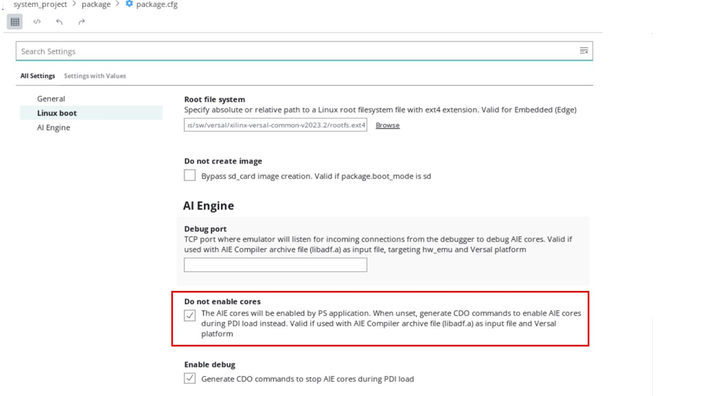

1. To build the system project, right-click the **PeakDetect_System** and select **Build Project**. The top-level project uses an incremental build approach that recognizes the state of the subprojects and only rebuilds projects that need to be updated.
2. Once the build completes, right-click the **PeakDetect_System**, select **Run As** -> **Run Configurations**, add the environment variables as follows, and hit **Apply** -> **Run**:
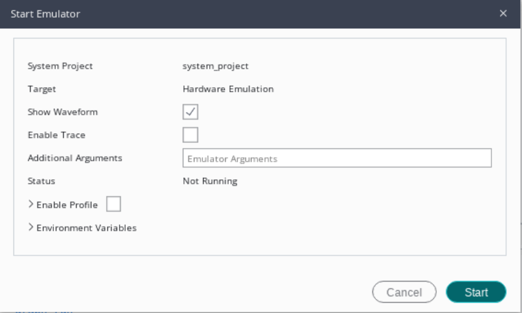

3. In the **Launch on Emulator** window, click the **Start Emulator and Run** button. This starts the QEMU emulation environment and boots Linux. The Emulation console shows a transcript of the QEMU launch and Linux boot process.

    Alternatively, you can also start emulation by selecting the **Vitis -> Start/Stop Emulator** option. One advantage with this is, you can specify the emulator arguments. For example, you can specify options for the AI Engine simulator and run the graph application manually after the Linux boot:

    `-aie-sim-options ${FULL_PATH}/aiesimulator_output/aiesim_options.txt`
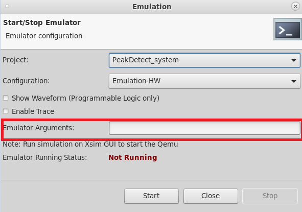

4. You can observe the Linux boot and application run message in the console as follows:
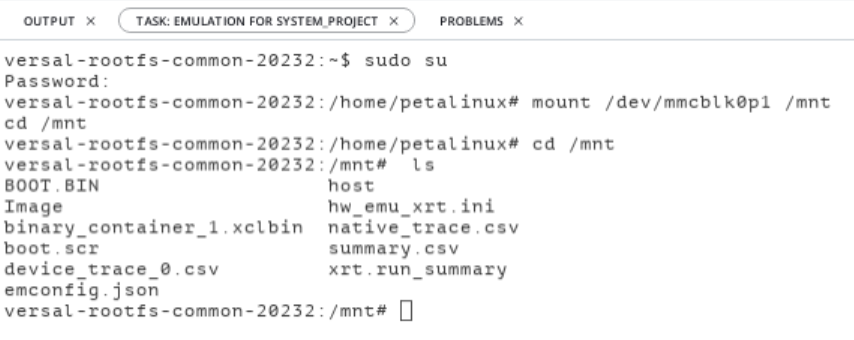

5. You can stop emulation by clicking the **Vitis -> Start/Stop Emulator** option, and hit **Stop**.

# Section 2

## Debug PL Kernels Using the Vivado Logic Simulator

This section walks you through debugging PL kernels in the Vivado logic simulator.

1. In the Vitis IDE, launch the hardware emulation using **Vitis** -> **Start/Stop Emulator**.
2. Enable the **Show Waveform** option, and select **Start**.
3. This invokes the Vivado XSIM in standalone mode. Parallelly, you can observe the messages in the Vitis IDE **Emulation Console**.
4. Hit the **Run** button in the Vivado XSIM GUI taskbar, and observe the Linux bootup in the Vitis IDE **Emulation Console**.
5. Once the boot completes in the Vitis IDE, run the application using **Run Configurations** -> **Launch HW Emulator** on the system project.
6. Observe the data coming up in the XSIM and parallelly, the **Emulation Console** messages gets updated in Vitis IDE GUI.
7. After processing all the data, you can see the following messages in the Vivado XSIM Tcl Console:

    ```
    Info: (I804) /IEEE_Std_1666/deprecated: the notify() function is deprecated use sc_event::notify()
    // Interrupt Monitor : interrupt for ap_done detected @ "117153000"
    // Interrupt Monitor : interrupt for ap_ready detected @ "117153000"
    // Interrupt Monitor : interrupt for ap_done detected @ "118292000"
    // Interrupt Monitor : interrupt for ap_ready detected @ "118292000"
    // Interrupt Monitor : interrupt for ap_done detected @ "118478000"
    // Interrupt Monitor : interrupt for ap_ready detected @ "118478000"
    $stop called at time : 157304 ns
    run: Time (s): cpu = 00:00:36 ; elapsed = 00:03:57 . Memory (MB): peak = 13910.660 ; gain = 135.137 ; free physical = 23585 ; free virtual = 54027

    ```

    You can also notice the following messages in the Vitis IDE **Emulation Console**.

    ```
    XAIEFAL: INFO: Resource group Avail is created.
    XAIEFAL: INFO: Resource group Static is created.
    XAIEFAL: INFO: Resource group Generic is created.
    Input memory virtual addr 0x0xffff7fb56000x
    Output memory virtual addr 0x0xffff7fb55000x
    Output memory virtual addr 0x0xffff7fb54000x
    run mm2s
    run s2mm
    graph run
    graph end
    After MM2S wait
    After S2MM_1 wait
    After S2MM_2 wait
    TEST PASSED
    ```

8. Now observe the waveform in the Vivado XSIM GUI. The system contains one `mm2s` compute unit and two `s2mm` compute units. You can notice them in the waveform viewer as follows:

    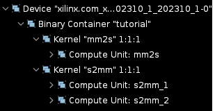

9. You can form a group of signals by right-clicking anywhere in the **Name** column, and select **New Group**. Add all the MM2S and S2MM-related signals to this group by dragging them correspondingly.
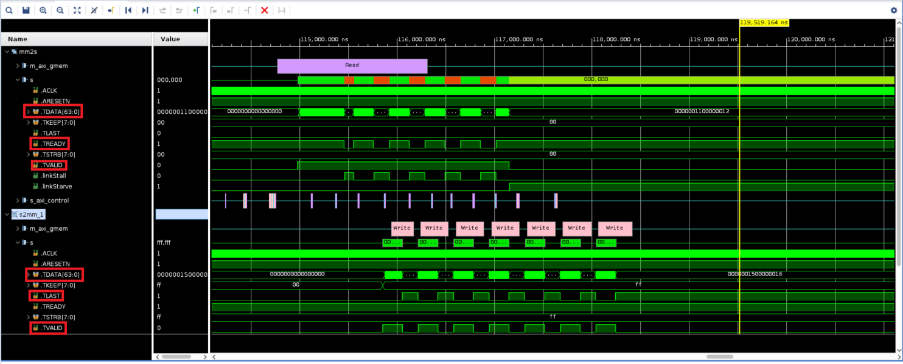

10. Zoom into the waveform window to locate the transactions clearly.
11. The `m_axi_gmem` is the transaction level signal which indicates the `Read` transaction in `mm2s` and `write` transaction in `s2mm`.
12. The `TDATA` in `mm2s` shows the data that is being read into the AI Engine module. To correlate with the number of iterations (seven), you specified in the graph, observe the `TREADY` signal which goes high when the AI Engine module is ready to read and the `TVALID` signal goes high for all the Read transactions.
13. Similarly you can notice in `s2mm_1` the `TVALID` is high indicating the valid data and the `TLAST` goes high at the end of every iteration, goes low during start of next iteration.

This way you should be able to identify whether a data is being sent/received, to/from the AI Engine module correctly or not.

# Section 3

## Performance of the AI Engine Using the Hardware Emulation Results

This section walks you through profiling the AI Engine as part of running the hardware emulation and calculate the throughput of the design considering the system as a whole, i.e., when the MM2S module is transferring data to the AI Engine, the AI Engine computes the output and transferrs the data to the S2MM module. Also note, in this case, the PS is controlling both the PL and AI Engine. Compare the throughput of the design with the AI Engine as a standalone module(aiesimulation results).

1. In the Vitis IDE, go to **Vitis** -> **Start/Stop Emulation**.
2. Add the `-aie-sim-options {PROJECT_PATH}/Emulation-AIE/aiesimulator_output/aiesim_options.txt` in the **Emulator Arguments** option, and click **Start**.
3. Now the hardware emulation launches and starts the QEMU emulation environment. The Emulation console shows a transcript of the QEMU launch and Linux boot process.
4. Once the boot completes in the Vitis IDE, run the application using **Run Configurations** -> **Launch HW Emulator** on the system project.
5. This runs the application and shows **TEST PASSED** in the output console.
6. Duble-click the `default.aierun_summary` file from the `{PROJECT_PATH}/PeakDetect_system/Emulation-HW/package/sim/behav_waveform/xsim/` path. This opens the summary file in the Vitis Analyzer.
7. As you observe, it carry forwards the aiesimulator options specified in `aiesimulator_output/aiesim_options` and provides the results.

### Calculating the Kernel Latency

From the Profile information in the Vitis Analyzer, analyze the function time of the kernels as explained in [Section 9](../AIE_Simulation/README.md#Design-performance-debug) in the AIE simulation.

For example, compare the function time of the `data_shuffle` kernel with the standalone AIE simulation result, and calculate the kernel latency.


From the trace information, you can calculate the kernel latency as follows:

1. Click the `Trace` in the AI Engine simulation run summary, and navigate to the any function to calculate the latency. For example, consider the `data_shuffle` function.
2. You can notice the function `data_shuffle` ran for seven iterations. Zoom into the period of one iteration (between two `main()` function calls as follows), add a marker, and drag it to the end of the kernel function as follows:
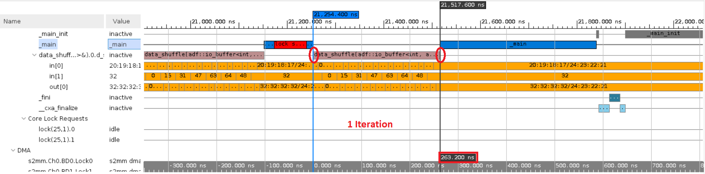

    Notice the difference of `263.2 ns` as highlighted above. This is the time the kernel took to complete one iteration.

    If you click the AI Engine Simulation Summary, you can notice the AI Engine Frequency as 1250 MHz, i.e., 0.8 ns, i.e., one cycle = 0.8 ns. Now, the data_shuffle function took 263.2 ns for one iteration, i.e., 263.2 / 0.8 ~= 329 cycles.

    Compare this with the latency you got during the `aiesimulation` where the AI Engine is a standalone module; see [Section-9](../AIE_Simulation/README.md#Design-performance-debug) in AIE Simulation.

#### Calculating the Graph Throughput Using the Graph Output

1. From the trace information in the run_summary in the Vitis Analyzer, navigate to the output port for which you want to calculate the throughput (Upscale kernel in this case). Add a marker at the start of the first output sample as highlighted below. Then click on the **Go** button to the last time icon and observe the cursor moves to the end of the last iteration. Now, click the previous transition icon to go the start of the last iteration. Add one more marker at the end, and observe the time difference as `2244.8 ns`.


2. The number of bytes transferred is, `128` samples * `4` Bytes * `7` iterations = `3584` tes. Throughput = `3584/2244 * e-9 ~= 1.5 GBPS`.

    Compare the throughput with the one you got during `aiesimulation` where the AI Engine is a standalone module; see [Section 9](../AIE_Simulation/README.md#Calculating-Graph-throughput-using-Graph-output) in AIE Simulation.

# Section 4

## Command Line Project Source Code Debug with the Vitis IDE

This section uses the command line flow to build for hardware emulation.

Before starting this tutorial:

* It is expected that you cloned the git repository, and the design files are ready to build.
* It is expected that you have run the steps to set the environment variables as described in [Introduction](../README.md#Introduction).

1. Navigate to the tutorial directory, `cmd_src/`, and open the Makefile.
2. To be able to debug the project, it is required to add the `--pakcage.enable_aie_debug` option in the packaging step as follows:

    ```
    package: guard-PLATFORM_REPO_PATHS guard-IMAGE guard-ROOTFS
        cd ./sw
        v++ -p -t ${TARGET} \
            -f ${BASE_PLATFORM} \
            --package.rootfs=${ROOTFS} \
            --package.image_format=ext4 \
            --package.boot_mode=sd \
            --package.kernel_image=${IMAGE} \
            --package.defer_aie_run \
            --package.sd_file embedded_exec.sh --package.enable_aie_debug \
            --package.sd_file host.exe ../tutorial.xsa ../libadf.a
    ```

3. Do `make all TARGET=hw_emu`.

    This step:

    * Compiles the AI Engine kernels and generates `libadf.a`.
    * Compiles the PL kernels `s2mm`,`mm2s` and generates `.xo`.
    * Hardware linking step to link AI Engine kernels and PL kernels using the `system.cfg` file. This generates the `.xsa` file.
    * Compiles the host application and generates the executable file `host.exe`.<
    * Packages `libadf.a`,`.xsa`, and `host.exe` files.

4. To debug the source code in the Vitis IDE, you need three Linux terminals.
5. From Terminal 1, set the tool path properly, and issue the command to launch the hardware emulator and boot up PetaLinux:

    ```
    ./launch_hw_emu.sh -add-env ENABLE_RDWR_DEBUG=true -add-env RDWR_DEBUG_PORT=10100 -pid-file emulation.pid -no-reboot -forward-port 1440 1534
    ```

    **Command Option Explanation**

    * `-add-env RDWR_DEBUG_PORT=${aie_mem_sock_port}`: Defines the port for communicating with the AI Engine domain. In the previous example, it is 10100.
    * `-forward-port ${linux_tcf_agent_port} 1534`: Defines the port for the Linux TCF agent. In the previous example, it is 1440, which is the default.

    >**NOTE:**
    >
    >* `launch_hw_emu.sh` is generated properly when the project under debug is built and packaged with the hardware emulator correctly.
    >* The previous command takes a few minutes to complete due to both the hardware emulator and PetaLinux are required to boot up properly.
    >* Wait until both the hardware server and PetaLinux boot up *BEFORE* moving to the next steps.

6. From Terminal 2, set up the tool path properly, and issue the following command to launch the XRT server:

    ```
    xrt_server -I30000 -S -s tcp::4352
    ```

    **Command Line Options Explanation:**

    * `-I30000`: Defines an idle timeout in seconds, in which the server will quit if there is no response.
    * `-S`: Specifies the print server properties in JSON format to stdout.
    * `-s tcp::${xrt_server_port}`: Defines the agent listening protocol and port. It is 4352 in the example but can be any free port.

7. From Terminal 3, navigate to the `sw/` directory where the `host.exe` and `a.xclbin` got generated, and issue the following command to launch the Vitis IDE after setting the tool path properly:

    ```
    vitis -debug -flow embedded_accel -target hw_emu -exe ./host.exe -program-args a.xclbin -port 1440
    ```

    **Command Line Options Explanation**

    * `vitis -debug`: Launches the Vitis IDE in standalone debug mode.
    * `-flow embedded_accel`: Specifies the embedded processor application acceleration flow.
    * `-target hw_emu`: Indicates the target build being debugged.
    * `-exe ./host.exe`: Indicates the PS application to run and debug.
    * `-program-args a.xclbin`: Refers to the location of the xclbin file to be loaded as an argument to the executable.
    * `-port 1440`: Specifies the ${linux_tcf_agent_port} as discussed previously.

8. The above command invokes the Vitis IDE in debug mode as follows waiting in the `main` function in `host.cpp`:
   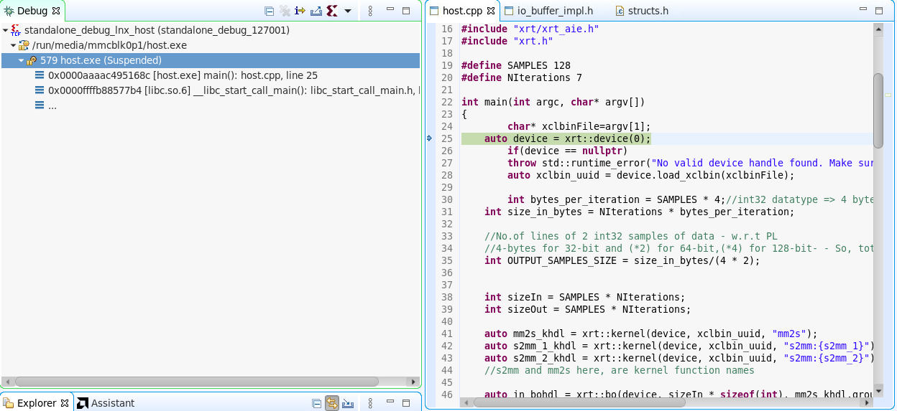

9. Open the debug configurations as follows:

   

   * Create a new Debug configuration by double-clicking the **Single Application Debug**.
   * Add the Debug type name, **aie_application_debug**, and **Debug Type** as **Attach to running target**.

        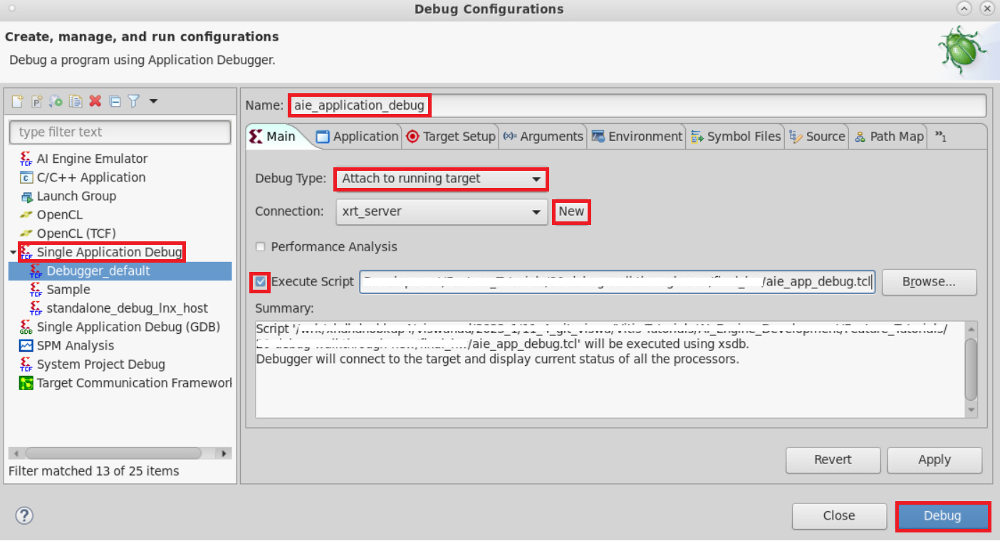

   * Create a new target connection with the **Target Name**, **Host**, and **Port** details as follows, and hit **OK**:
    
   * Now, again in the **Debug Configurations** window, set up the execute script.(`aie_app_debug_em.tcl`. Check the following **NOTE**) for the newly created debug type by clicking the `Browse` button as highlighted above.

      >**NOTE:** The script, **aie_app_debug_em.tcl**, is provided in this tutorial (under the `HW_Emulation/directory`) and needs to be updated to match your environment settings. For example, the `${PROJECT_PATH}` variable should be the `Work/` folder inside this lab, and similarly the `${XILINX_VITIS_PATH}/` variable should be pointing to your Vitis installation path.

10. Click **Debug** in the **Debug Configurations** window, wait for the **aie_application_debug(xrt_server)** to load in stack trace, and click the **Continue/Resume** button to run the `<Process ID>host.exe (Suspended)` thread.
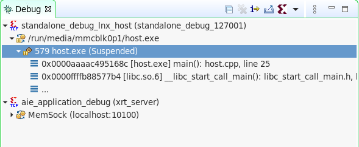

11. This executes the host code before the AI Engine graph execution and waits at the automatic breakpoint in the AI Engine core `main()` function as follows:
    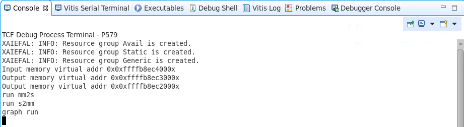

    You can try adding add breakpoints in the host code and observe the values in the **Variable** window by doing **step-in** or **step-over**.

    

12. Click each AI Engine core and do **Step-over** to enter the compiler-generated AI Engine source code which in turn calls the actual user source code.

    

    You can add the breakpoints in this source file, and observe the intermediate values. Once done, you can just hit the **Continue** button to run the complete core.

    

13. Similarly, you can select all other cores to debug, and click **Continue**.
14. Once all cores are done running, you can see all the AI Engine cores in the **Disabled** state and **Test Passed** in the Console. Now select the `<Process ID>host.exe (Signal 10; User-defined signal 1)` thread, and hit **Continue**. This completes the execution of the host code, and you can terminate the debug and disconnect.

## Support

GitHub issues will be used for tracking requests and bugs. For questions, go to [support.xilinx.com](https://support.xilinx.com/).

<p class="sphinxhide" align="center"><sub>Copyright © 2020–2023 Advanced Micro Devices, Inc</sub></p>

<p class="sphinxhide" align="center"><sup><a href="https://www.amd.com/en/corporate/copyright">Terms and Conditions</a></sup></p>
