<table class="sphinxhide" width="100%">
 <tr width="100%">
    <td align="center"><h1>AI Engine Development</h1>
    <a href="https://www.xilinx.com/products/design-tools/vitis.html">See Vitis™ Development Environment on xilinx.com</br></a>
    <a href="https://www.xilinx.com/products/design-tools/vitis/vitis-ai.html">See Vitis™ AI Development Environment on xilinx.com</a>
    </td>
 </tr>
</table>

## Hardware-Emulation Debug Walkthrough

## Introduction

To simulate the entire system, including the AI Engine graph and programmable logic (PL) along with the XRT-based host application to control the AI Engine and PL, for a specific board and platform, you must use the hardware emulation flow. This flow includes the SystemC model of the AI Engine, transaction-level SystemC models for the NoC, double-data rate (DDR) memory, PL kernels (RTL), and processing system (PS) (running on the Quick Emulator (QEMU)). This can be used in analyzing the data which helps you gauge the efficiency of the kernels, the stall and active times associated with each AI Engine, and pinpoint the AI Engine kernel whose performance might not be optimal.

The following are some of the features of the hardware emulation that are covered in this section of the tutorial:

## Features

<table style="width:100%">

<tr>
<td>
<a href="./README.md#Build-for-Hardware-Emulation-Using-the-Vitis-IDE">Build for Hardware Emulation Using the Vitis IDE</a>
</td>
<td>
Explains how to create a system project and build for hardware emulation and run.
</td>
</tr>

<tr>
<td>
<a href="./README.md#Debug-PL-kernels-using-the-Vivado-Logic-Simulator">Debug PL Kernels Using the Vivado Logic Simulator</a>
</td>
<td>
Explains how to use the AMD Vivado&trade; XSIM to debug the PL kernels.
</td>
</tr>

<tr>
<td>
<a href="./README.md#Performance-of-the-AI-Engine-Using-the-Hardware-Emulation-Results">Performance of the AI Engine Using the Hardware Emulation Results</a>
</td>
<td>
This section profiles the system for hardware emulation and compares the throughput of the AI Engine design in hardware emulation with the throughput in the AI Engine simulation.
</td>
</tr>

<tr>
<td>
<a href="./README.md#Command-Line-Project-Source-Code-Debug-with-the-Vitis-Unified-IDE ">Command Line Project Source Code Debug with the Vitis Unified IDE</a>
</td>
<td>
This section helps you debug your command line project by using the features of the AMD Vitis&trade; IDE debugger without porting your system design to the IDE.
</td>
</tr>

</table>

# Section 1

## Build for Hardware Emulation Using the Vitis IDE

Before getting into this section, it is expected that you created an AI Engine application in the Vitis IDE and ran AIEsimulation [Build and Simulate in the Vitis IDE](../AIE_Simulation/README.md#Build-and-simulate-in-Vitis-IDE).

Create a system project manually using the steps mentioned in [Port a Command Line Project to the Vitis IDE System Project](../CreateIDESystemProj.md) and download the Vitis IDE exported project ([Download Vitis IDE project](../README.md#Download-Vitis-IDE-project)).

Besides referring to the link provided above to create a system project, make sure to follow the following points to avoid unnecessary issues during the emulation process:

* While creating a HW-link project, the Vitis IDE tool, by default, creates a `binary_container_1-link.cfg` file under the `{$PROJECT}/system_project/hw_link/` directory that contains the connectivity as follows:

    ```
    [connectivity]
    nk=mm2s:1:mm2s_1
    nk=s2mm:2:s2mm_1.s2mm_2
    sc=mm2s_1.s:ai_engine_0.inx
    sc=ai_engine_0.data_shuffle:s2mm_1.s
    sc=ai_engine_0.upscale_out:s2mm_2.s
    ```

    If you are porting a command line project to the Vitis IDE environment, make sure to replace the above connectivity statements that start with `nk` in your `system.cfg` file and add as a source to your HW-Link project.

* As the AI Engine graph is being loaded by the host PS application, you can defer the running of the graph after the graph has been loaded using the `xrt::graph` API. By default, the AMD platform management controller (PMC) loads and runs the graph. However, the v++ `--package.defer_aie_run` option will let you defer the graph run until after the graph has been loaded using the `xrt::graph` API.


1. Steps to build the system project: Go to the Flow Navigator -> [system_project] component (Section: HARDWARE EMULATION): 

    a. Select **Build Binary Container** from `LINK-binary_container_1`. Select the checck box to build the components added in the binary container.

    b. Select **Build Package** from `PACKAGE`.
    
2. After packaging, everything is set to run emulation. In the Flow Navigator -> [system_project] component -> select **Start Emulator** -> show waveform -> start :


3. Select the **Run for Time(10us)** in the XSIM GUI taskbar, observe the Linux bootup in the Vitis IDE `TASK: EMULATION FOR SYSTEM_PROJECT`. 


5. You can stop emulation by clicking In the Flow Navigator -> [system_project] component -> select **Stop Emulator**.
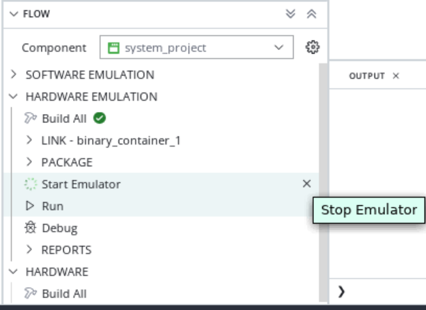

# Section 2

## Debug PL Kernels Using the Vivado Logic Simulator

This section walks you through debugging PL kernels in the Vivado logic simulator.

1. In the Vitis IDE, launch the hardware emulation using **Vitis** -> **Start/Stop Emulator**.
2. Enable the **Show Waveform** option, and select **Start**.
3. This invokes the Vivado XSIM in standalone mode. Parallelly, you can observe the messages in the Vitis IDE **Emulation Console**.
4. Hit the **Run** button in the Vivado XSIM GUI taskbar, and observe the Linux bootup in the Vitis IDE **Emulation Console**.
5. Observe the data coming up in the XSIM and parallelly, the **Emulation Console** messages gets updated in Vitis IDE GUI.
6. After processing all the data, you can see the following messages in the Vivado XSIM Tcl Console:

    ```
    Info: (I804) /IEEE_Std_1666/deprecated: the notify() function is deprecated use sc_event::notify()
    // Interrupt Monitor : interrupt for ap_done detected @ "117153000"
    // Interrupt Monitor : interrupt for ap_ready detected @ "117153000"
    // Interrupt Monitor : interrupt for ap_done detected @ "118292000"
    // Interrupt Monitor : interrupt for ap_ready detected @ "118292000"
    // Interrupt Monitor : interrupt for ap_done detected @ "118478000"
    // Interrupt Monitor : interrupt for ap_ready detected @ "118478000"
    $stop called at time : 157304 ns
    run: Time (s): cpu = 00:00:36 ; elapsed = 00:03:57 . Memory (MB): peak = 13910.660 ; gain = 135.137 ; free physical = 23585 ; free virtual = 54027

    ```

    You can also notice the following messages in the Vitis IDE **DEBUG CONSOLE**.

    ```
    XAIEFAL: INFO: Resource group Avail is created.
    XAIEFAL: INFO: Resource group Static is created.
    XAIEFAL: INFO: Resource group Generic is created.
    Input memory virtual addr 0x0xffff7fb56000x
    Output memory virtual addr 0x0xffff7fb55000x
    Output memory virtual addr 0x0xffff7fb54000x
    run mm2s
    run s2mm
    graph run
    graph end
    After MM2S wait
    After S2MM_1 wait
    After S2MM_2 wait
    TEST PASSED
    ```

8. Now observe the waveform in the Vivado XSIM GUI. The system contains one `mm2s` compute unit and two `s2mm` compute units. You can notice them in the waveform viewer as follows:

    
9. You can form a group of signals by right-clicking anywhere in the **Name** column, and select **New Group**. Add all the MM2S and S2MM-related signals to this group by dragging them correspondingly.

10. Zoom into the waveform window to locate the transactions clearly.
11. The `m_axi_gmem` is the transaction level signal which indicates the `Read` transaction in `mm2s` and `write` transaction in `s2mm`.
12. The `TDATA` in `mm2s` shows the data that is being read into the AI Engine module. To correlate with the number of iterations (seven), you specified in the graph, observe the `TREADY` signal which goes high when the AI Engine module is ready to read, and the `TVALID` signal goes high for all the Read transactions.
13. Similarly you can notice in `s2mm_1` the `TVALID` is high indicating the valid data and the `TLAST` goes high at the end of every iteration, goes low during start of next iteration.

    This way you should be able to identify whether a data is being sent/received, to/from the AI Engine module correctly or not.

# Section 3

## Performance of the AI Engine Using the Hardware Emulation Results

This section walks you through profiling the AI Engine as part of running the hardware emulation and calculate the throughput of the design considering the system as a whole, i.e., when the MM2S module is transferring data to the AI Engine, the AI Engine computes the output and transferrs the data to the S2MM module. Also note, in this case, the PS is controlling both the PL and AI Engine. Compare the throughput of the design with the AI Engine as a standalone module(aiesimulation results).

1. In the Vitis IDE, go to Flow Navigator -> [system_project] component -> **Vitis** -> **Start Emulation**.
2. Add the `-aie-sim-options {PROJECT_PATH}/aie_component/build/hw/aiesimulator_output/aiesim_options.txt` in the **Emulator Arguments** option, and click **Start**.
3. Now the hardware emulation launches and starts the QEMU emulation environment. The Emulation console shows a transcript of the QEMU launch and Linux boot process.
4. Once the boot completes in the Vitis IDE, run the application using **Run** on the system project.
5. This runs the application and shows **TEST PASSED** in the output console.
6. Duble-click the System_Project -> HARDWARE EMULATION -> Reports -> Summary file. This opens the summary file `{PROJECT_PATH}/system_project/build/hw_emu/system_project_hw_emu/xrt.run_summary` path in the Vitis Analyzer.
7. As you observe, it carry forwards the aiesimulator options specified in `aiesimulator_output/aiesim_options` and provides the results.

### Calculating the Kernel Latency

From the Profile information in the Vitis Analyzer, analyze the function time of the kernels as explained in [Section 9](../AIE_Simulation/README.md#Design-performance-debug) in the AIE simulation.

For example, compare the function time of the `data_shuffle` kernel with the standalone AIE simulation result, and calculate the kernel latency.
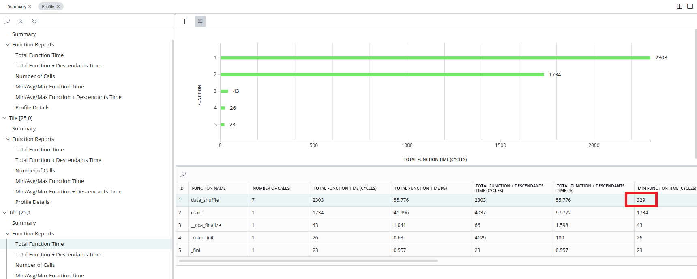

From the trace information, you can calculate the kernel latency as follows:

1. Click the `Trace` in the AI Engine simulation run summary, and navigate to the any function to calculate the latency. For example, consider the `data_shuffle` function.
2. You can notice the function `data_shuffle` ran for seven iterations. Zoom into the period of one iteration (between two `main()` function calls as follows), add a marker, and drag it to the end of the kernel function as follows:
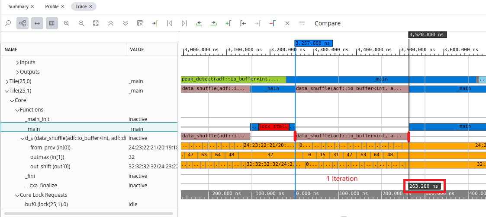

    Notice the difference of `263.2 ns` as highlighted above. This is the time the kernel took to complete one iteration.

    If you click the AI Engine Simulation Summary, you can notice the AI Engine Frequency as 1250 MHz, i.e., 0.8 ns, i.e., one cycle = 0.8 ns. Now, the data_shuffle function took 263.2 ns for one iteration, i.e., 263.2 / 0.8 ~= 329 cycles.

    Compare this with the latency you got during the `aiesimulation` where the AI Engine is a standalone module; see [Section-9](../AIE_Simulation/README.md#Design-performance-debug) in AIE Simulation.

#### Calculating the Graph Throughput Using the Graph Output

Ensure the `Enable Trace` is checked in Run settings (Flow Navigator -> aie_component). If it is not checked, you must check and select the `Run`.
Steps to run the Trace from Vitis IDE, Go to Flow Navigator -> Select AI Engine Component -> Select AIE Simulator/ Hardware -> Go to Reports -> Select Trace.

1. From the trace information in the run_summary in the Vitis Analyzer, navigate to the output port for which you want to calculate the throughput (Upscale kernel in this case). Add a marker at the start of the first output sample as highlighted below. Then click the **Go** button to the last time icon, and observe the cursor moves to the end of the last iteration. Now, click the previous transition icon to go the start of the last iteration. Add one more marker at the end, and observe the time difference as `2254.4 ns`.
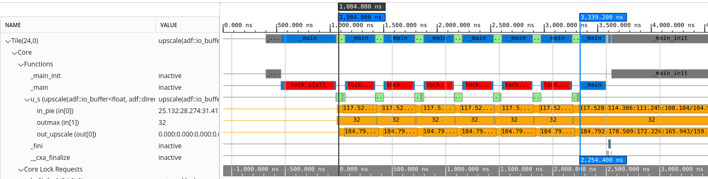
2. The number of bytes transferred is, `128` samples * `4` Bytes * `7` iterations = `3584` tes. Throughput = `3584/2254 * e-9 ~= 1.6 GBPS`.

    Compare the throughput with the one you got during `aiesimulation` where the AI Engine is a standalone module; see [Section 9](../AIE_Simulation/README.md#Calculating-Graph-throughput-using-Graph-output) in AIE Simulation.

# Section 4

## Command Line Project Source Code Debug with the Vitis Unified IDE 

This section uses the command line flow to build for hardware emulation.

Before starting this tutorial:

* It is expected that you cloned the git repository, and the design files are ready to build.
* It is expected that you have run the steps to set the environment variables as described in [Introduction](../README.md#Introduction).

1. Navigate to the tutorial directory, `cmd_src/`, and open the Makefile.
2. To be able to debug the project, it is required to add the `--pakcage.enable_aie_debug` option in the packaging step as follows:

    ```
    package: guard-PLATFORM_REPO_PATHS guard-IMAGE guard-ROOTFS
        cd ./sw
        v++ -p -t ${TARGET} \
            -f ${BASE_PLATFORM} \
            --package.rootfs=${ROOTFS} \
            --package.image_format=ext4 \
            --package.boot_mode=sd \
            --package.kernel_image=${IMAGE} \
            --package.defer_aie_run \
            --package.sd_file embedded_exec.sh --package.enable_aie_debug \
            --package.sd_file host.exe ../tutorial.xsa ../libadf.a
    ```

3. Open the workspace in Vitis IDE: {project_path}/cmd_src and select `Open Explorer View`
   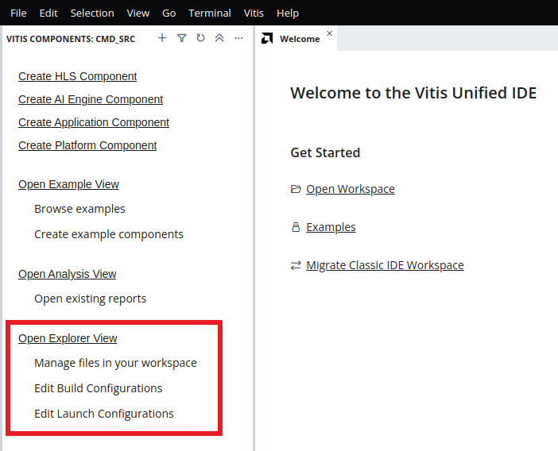 

4. Right click in the `CMD_SRC` section in EXPLORER and select `Edit Build Configuration`
   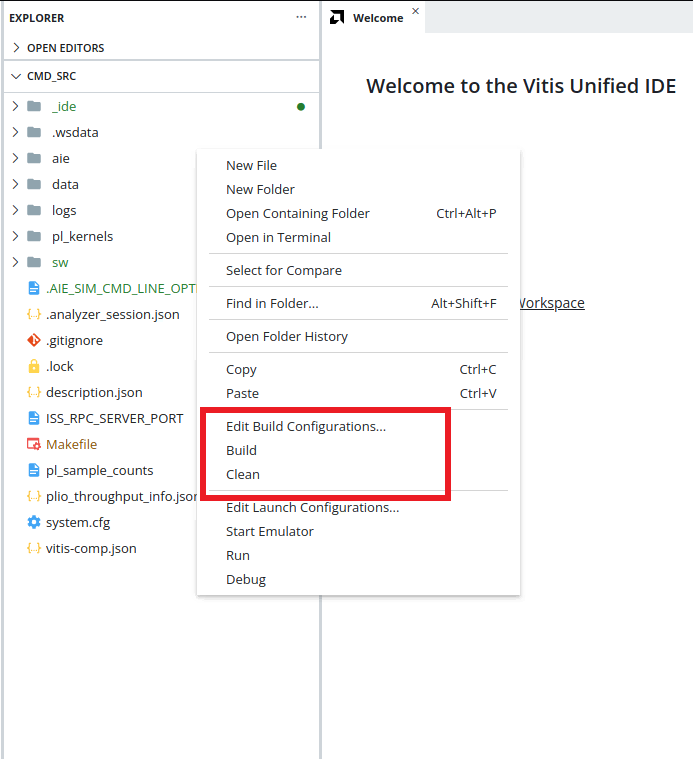 
   
   Give the make command to build the system and clean the generated outputs in the `Build command` and `Clean command` respectively.
   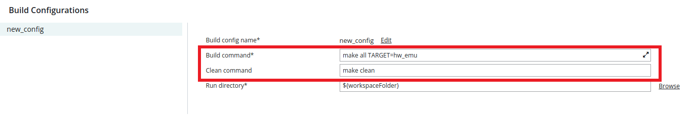 
   
   Right click in the `CMD_SRC` section in EXPLORER and select `Build`.
   
   Build Step does the following:
   
    * Compiles the AI Engine kernels and generates `libadf.a`.
    * Compiles the PL kernels `s2mm`,`mm2s` and generates `.xo`.
    * Hardware linking step to link AI Engine kernels and PL kernels using the `system.cfg` file. This generates the `.xsa` file.
    * Compiles the host application and generates the executable file `host.exe`.
    * Packages `libadf.a`,`.xsa`, and `host.exe` files.
   
   Below message indicates that the emulation package is created and build is successfully done.
   ```
   COMPLETE: emulation package created.
   Build Finished successfully
   ```
5. To launch the emulation: Right click in the `CMD_SRC` section in EXPLORER and select `Edit Launch Configurations`
   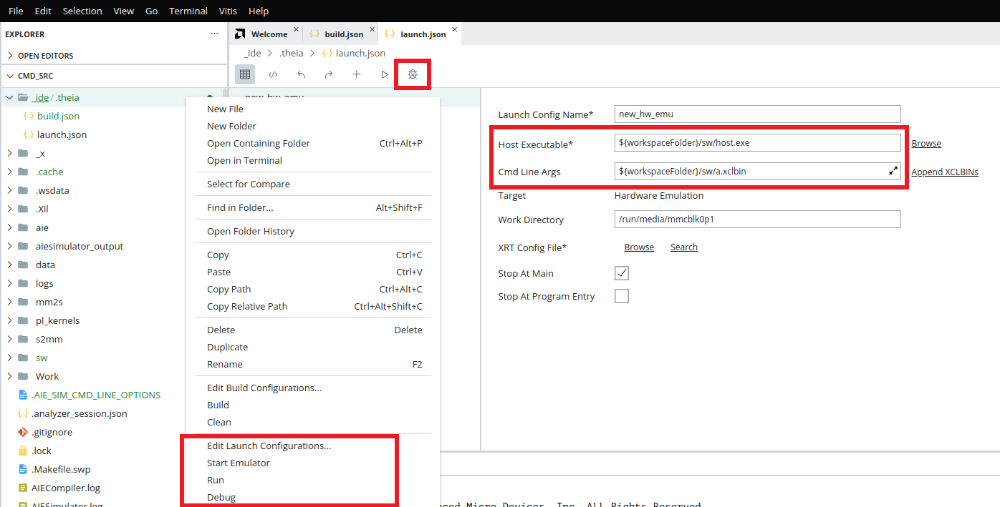 
   
   Select the host.exe and a.xclbin paths correctly. Start the Emulator by right clicking in the `CMD_SRC` and select `Start Emulator`.
   Run the script `embedded_exec.sh` from /mnt as shown below. Check the log to confirm the progress.
   
   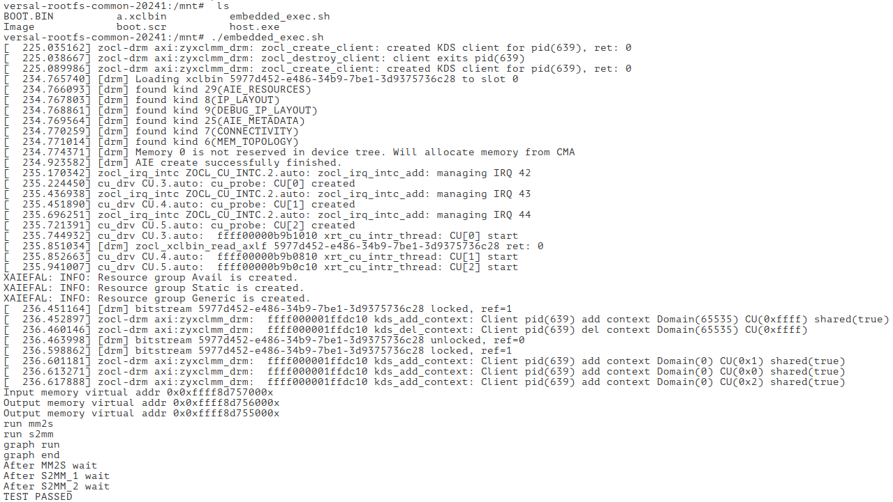 
   
   Test Result: `TEST PASSED` indicates that launch emulation result. Close the emulation.
      
6. Steps to debug the host.cpp in Vitis IDE: 
   
   a. Start the Emulator as shown in step 5 and wait for emulation to finish.
   
   b. click `Debug` icon in launch.json. This invokes the Vitis IDE in debug mode as follows waiting in the `main` function in `host.cpp`:
   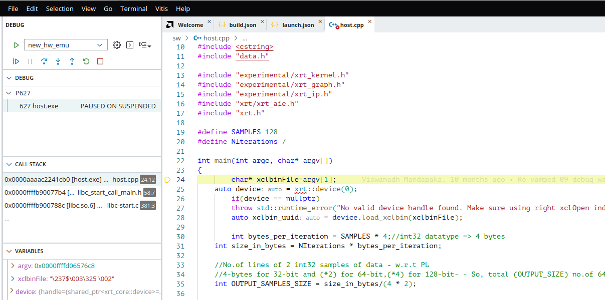
   
   You can add breakpoints in the host code and observe the values in the **Variable** window by doing **step-in** or **step-over**.

    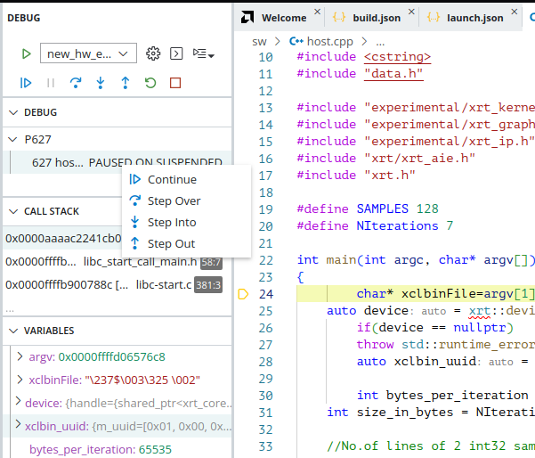
    
### Refer to Chapter 52: `Debugging the System Project and AI Engine` in UG1393 for more details to debug AI Engine.


## Support

GitHub issues will be used for tracking requests and bugs. For questions, go to [support.xilinx.com](https://support.xilinx.com/).

<p class="sphinxhide" align="center"><sub>Copyright © 2020–2023 Advanced Micro Devices, Inc</sub></p>

<p class="sphinxhide" align="center"><sup><a href="https://www.amd.com/en/corporate/copyright">Terms and Conditions</a></sup></p>


