<table class="sphinxhide" style="width:100%;">
  <tr>
    <td align="center">
      <picture>
        <source media="(prefers-color-scheme: dark)" srcset="https://raw.githubusercontent.com/Xilinx/Image-Collateral/main/logo-white-text.png">
        
      </picture>
      <h1>AMD Vitis™ AI Engine Tutorials</h1>
      <a href="https://www.amd.com/en/products/software/adaptive-socs-and-fpgas/vitis.html">See Vitis™ Development Environment on amd.com</a>
        </br>
      <a href="https://www.amd.com/en/products/software/vitis-ai.html">See Vitis™ AI Development Environment on amd.com</a>
    </td>
  </tr>
</table>

# Hardware-Emulation Debug Walkthrough

## Introduction

To simulate the entire system, including the AI Engine graph and programmable logic (PL), and an XRT-based host application to control the AI Engine and PL, for a specific board and platform, use the hardware emulation flow. This flow includes the SystemC model of the AI Engine, transaction-level SystemC models for the NoC, double-data rate (DDR) memory, PL kernels (RTL), and processing system (PS) (running on the Quick Emulator (QEMU)). Use this flow to analyze data that helps you gauge the efficiency of the kernels, the stall and active times for each AI Engine, and identify the AI Engine kernel with suboptimal performance.

The following hardware emulation features are covered in this section:

## Features

<table style="width:100%">

<tr>
<td>
<a href="./README.md#Build-for-Hardware-Emulation-Using-the-Vitis-IDE">Build for Hardware Emulation Using the Vitis IDE</a>
</td>
<td>
Explains how to create a system project and build for hardware emulation and run.
</td>
</tr>

<tr>
<td>
<a href="./README.md#Debug-PL-kernels-using-the-Vivado-Logic-Simulator">Debug PL Kernels Using the Vivado Logic Simulator</a>
</td>
<td>
Explains how to use the AMD Vivado&trade; XSIM to debug the PL kernels.
</td>
</tr>

<tr>
<td>
<a href="./README.md#Performance-of-the-AI-Engine-Using-the-Hardware-Emulation-Results">Performance of the AI Engine Using the Hardware Emulation Results</a>
</td>
<td>
Profiles the system for hardware emulation and compares AI Engine throughput with AI Engine simulation.
</td>
</tr>

<tr>
<td>
<a href="./README.md#Command-Line-Project-Source-Code-Debug-with-the-Vitis-Unified-IDE ">Command Line Project Source Code Debug with the Vitis Unified IDE</a>
</td>
<td>
Shows how to debug a command-line project using the features of the AMD Vitis&trade; IDE debugger without porting the system design to the IDE.
</td>
</tr>

</table>

# Section 1

## Build for Hardware Emulation Using the Vitis IDE

Before starting this section, make sure that you created an AI Engine application in the Vitis IDE and ran AIEsimulation [Build and Simulate in the Vitis IDE](../AIE_Simulation/README.md#Build-and-simulate-in-Vitis-IDE).

Create a system project manually using the steps in [Port a Command Line Project to the Vitis IDE System Project](../CreateIDESystemProj.md) and download the Vitis IDE exported project ([Download Vitis IDE project](../README.md#Download-Vitis-IDE-project)).

In addition to system project steps above, follow these points to avoid issues during the emulation process:

* When creating a HW-link project, the Vitis IDE tool, by default, creates a `binary_container_1-link.cfg` file under the `{$PROJECT}/system_project/hw_link/` directory with the following connectivity:

    ```
    [connectivity]
    nk=mm2s:1:mm2s_1
    nk=s2mm:2:s2mm_1.s2mm_2
    sc=mm2s_1.s:ai_engine_0.inx
    sc=ai_engine_0.data_shuffle:s2mm_1.s
    sc=ai_engine_0.upscale_out:s2mm_2.s
    ```

    If you port a command-line project to the Vitis IDE environment, replace the above connectivity statements that start with `nk` in your `system.cfg` file and add it as a source to your HW-Link project.

* Because the host PS application loads the AI Engine graph, you can defer the running the graph after the graph is loaded using the `xrt::graph` API. By default, the AMD platform management controller (PMC) loads and runs the graph. However, use the v++ `--package.defer_aie_run` option to defer the graph run until it is loaded using the `xrt::graph` API.

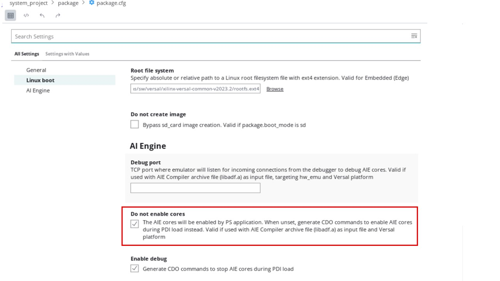

1. Steps to build the system project: Go to the **Flow Navigator -> [system_project] component (Section: HARDWARE EMULATION)**: 

    a. Select **Build Binary Container** from `LINK-binary_container_1`. Select the check box to build the components added in the binary container.

    b. Select **Build Package** from `PACKAGE`.
    
2. After packaging, start emulation. In **Flow Navigator -> [system_project] component** -> select **Start Emulator -> show waveform -> start** :

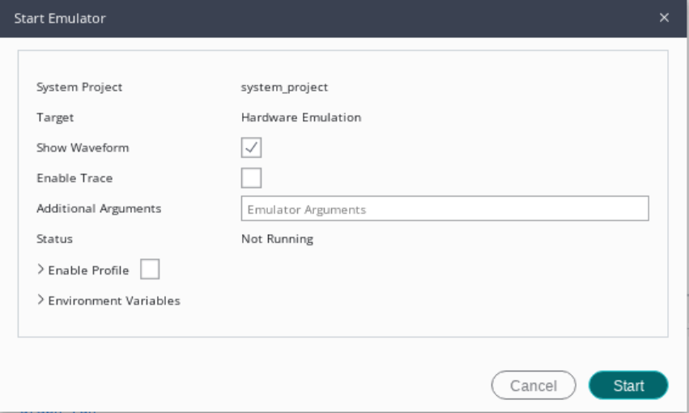

1. Select the **Run for Time(10us)** in the XSIM GUI taskbar. Observe Linux bootup in the Vitis IDE `TASK: EMULATION FOR SYSTEM_PROJECT`. 


1. To stop emulation: In **Flow Navigator -> [system_project] component ->** select **Stop Emulator**.
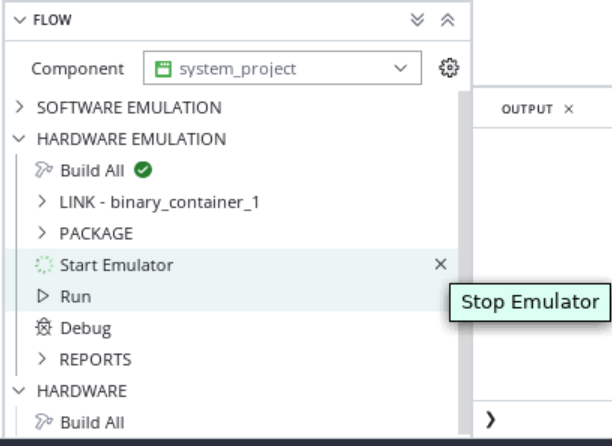

# Section 2

## Debug PL Kernels Using the Vivado Logic Simulator

This section shows you how to debug PL kernels in the Vivado logic simulator.

1. In the Vitis IDE, launch hardware emulation using **Vitis** -> **Start/Stop Emulator**.
2. Enable **Show Waveform**, and select **Start**.
3. Vivado XSIM starts in standalone mode. Parallelly, observe messages in the Vitis IDE **Emulation Console**.
4. Click **Run** in the Vivado XSIM GUI taskbar. Observe Linux bootup in the Vitis IDE **Emulation Console**.
5. Observe data in XSIM while **Emulation Console** messages update in the Vitis IDE GUI.
6. After processing completes, the Vivado XSIM Tcl Console shows the following messages:

    ```
    Info: (I804) /IEEE_Std_1666/deprecated: the notify() function is deprecated use sc_event::notify()
    // Interrupt Monitor : interrupt for ap_done detected @ "117153000"
    // Interrupt Monitor : interrupt for ap_ready detected @ "117153000"
    // Interrupt Monitor : interrupt for ap_done detected @ "118292000"
    // Interrupt Monitor : interrupt for ap_ready detected @ "118292000"
    // Interrupt Monitor : interrupt for ap_done detected @ "118478000"
    // Interrupt Monitor : interrupt for ap_ready detected @ "118478000"
    $stop called at time : 157304 ns
    run: Time (s): cpu = 00:00:36 ; elapsed = 00:03:57 . Memory (MB): peak = 13910.660 ; gain = 135.137 ; free physical = 23585 ; free virtual = 54027

    ```

   The following messages appear in the Vitis IDE **DEBUG CONSOLE**.

    ```
    XAIEFAL: INFO: Resource group Avail is created.
    XAIEFAL: INFO: Resource group Static is created.
    XAIEFAL: INFO: Resource group Generic is created.
    Input memory virtual addr 0x0xffff7fb56000x
    Output memory virtual addr 0x0xffff7fb55000x
    Output memory virtual addr 0x0xffff7fb54000x
    run mm2s
    run s2mm
    graph run
    graph end
    After MM2S wait
    After S2MM_1 wait
    After S2MM_2 wait
    TEST PASSED
    ```

7. Observe the waveform in the Vivado XSIM GUI. The system contains one `mm2s` compute unit and two `s2mm` compute units. You can see them in the waveform viewer as follows:

    
8. To group signals, right-click anywhere in the **Name** column, and select **New Group**. Add all the MM2S and S2MM-related signals to this group by dragging them correspondingly.
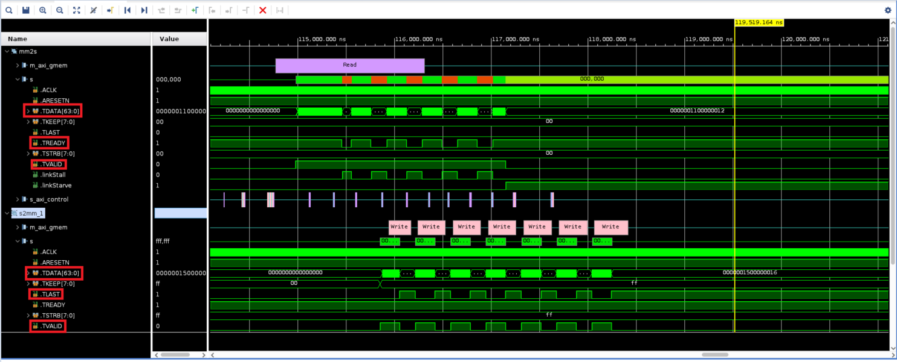
1. Zoom into the waveform window to locate transactions.
2.  The `m_axi_gmem` is the transaction level signal, which indicates the `Read` transaction in `mm2s` and `write` transaction in `s2mm`.
3.  The `TDATA` in `mm2s` shows the data read into the AI Engine module. To correlate with the number of iterations (seven) specified in the graph, observe `TREADY` going high when the AI Engine module is ready to read, and `TVALID` going high for all read transactions.
4.  Similarly, in `s2mm_1`, the `TVALID` indicates valid data. `TLAST` goes high at the end of each iteration and goes low at the start of the next iteration.

    Use this method to verify correct data movement to and from the AI Engine.

# Section 3

## Performance of the AI Engine Using the Hardware Emulation Results

This section shows profiling the AI Engine as part of running the hardware emulation and calculate throughput of the design considering the system as a whole. When the MM2S module transfers data to the AI Engine, the AI Engine computes the output and transfers data to the S2MM module. In this case, the PS controls both the PL and AI Engine. Compare the design throughput with the AI Engine as a standalone module(aiesimulation results).

1. In the Vitis IDE, go to Flow Navigator -> [system_project] component -> **Vitis** -> **Start Emulation**.
2. Add the `-aie-sim-options {PROJECT_PATH}/aie_component/build/hw/aiesimulator_output/aiesim_options.txt` in the **Emulator Arguments** option, and click **Start**.
3. The hardware emulation launches and starts the QEMU emulation environment. The Emulation console shows a transcript of the QEMU launch and Linux boot process.
4. Once the boot completes in the Vitis IDE, run the application using **Run** on the system project.
5. This runs the application and shows **TEST PASSED** in the output console.
6. Double-click the **System_Project -> HARDWARE EMULATION -> Reports -> Summary file**. This opens the summary file `{PROJECT_PATH}/system_project/build/hw_emu/system_project_hw_emu/xrt.run_summary` path in the Vitis Analyzer.
7. As you observe, it carries forward the aiesimulator options specified in `aiesimulator_output/aiesim_options` and provides the results.

### Calculating the Kernel Latency

From the Profile information in the Vitis Analyzer, analyze the function time of the kernels as explained in [Section 9](../AIE_Simulation/README.md#Design-performance-debug) in the AIE simulation.

For example, compare the function time of the `data_shuffle` kernel with the standalone AIE simulation result to calculate the kernel latency.
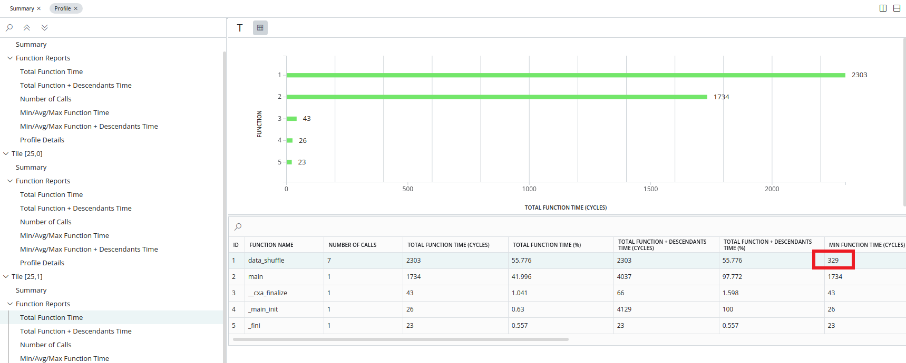

From the trace information, calculate the kernel latency as follows:

1. Click `Trace` in the AI Engine simulation run summary, and navigate to any function to calculate latency. For example, consider the `data_shuffle` function.
2. Tthe function `data_shuffle` ran for seven iterations. Zoom into one iteration (between two `main()` function calls as follows), add a marker, and drag it to the end of the kernel function as follows:
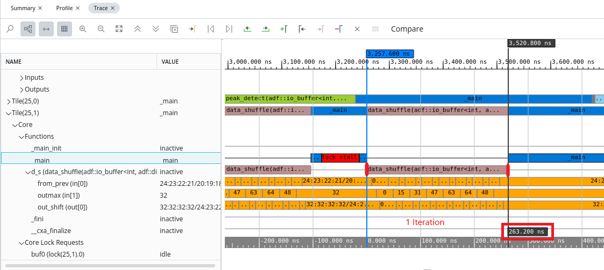

    Notice the difference of `263.2 ns` as highlighted above. This is the time the kernel took to complete one iteration.

    In the AI Engine Simulation Summary, the AI Engine Frequency is 1250 MHz, that is, 0.8 ns, that is, one cycle = 0.8 ns. Now, the data_shuffle function took 263.2 ns for one iteration, that is, 263.2 / 0.8 ~= 329 cycles.

    Compare this with the latency from `aiesimulation` where the AI Engine is a standalone module. See [Section-9](../AIE_Simulation/README.md#Design-performance-debug) in AIE Simulation.

#### Calculating the Graph Throughput Using the Graph Output

Make sure the `Enable Trace` is selected in Run settings (Flow Navigator -> aie_component). If it is not selected, check and select the `Run`.
To run the Trace from Vitis IDE, Go to **Flow Navigator -> Select AI Engine Component ->** Select **AIE Simulator/ Hardware** -> Go to **Reports** -> **Select Trace**.

1. From the trace information in the run_summary in the Vitis Analyzer, navigate to the output port for throughput calculation (Upscale kernel in this case). Add a marker at the start of the first output sample as highlighted below. Then click the **Go** button to the last time icon, and observe the cursor moves to the end of the last iteration. Click the previous transition icon to go the start of the last iteration. Add one more marker at the end, and observe the time difference as `2254.4 ns`.
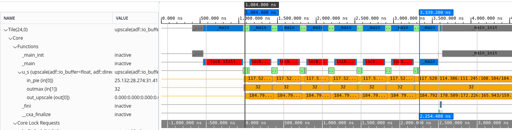
1. The number of bytes transferred is, `128` samples * `4` Bytes * `7` iterations = `3584` tes. Throughput = `3584/2254 * e-9 ~= 1.6 GBPS`.

    Compare this throughput with the `aiesimulation` result where the AI Engine is a standalone module. See [Section 9](../AIE_Simulation/README.md#Calculating-Graph-throughput-using-Graph-output) in AIE Simulation.

# Section 4

## Command Line Project Source Code Debug with the Vitis Unified IDE 

This section uses the command-line flow to build for hardware emulation.

Before starting this tutorial:

* Make sure that you cloned the git repository and the design files are ready to build.
* Make sure that you set the environment variables as described in [Introduction](../README.md#Introduction).

1. Navigate to the tutorial directory, `cmd_src/`, and open the Makefile.
2. To debug the project, add the `--pakcage.enable_aie_debug` option in the packaging step as follows:

    ```
    package: guard-PLATFORM_REPO_PATHS guard-IMAGE guard-ROOTFS
        cd ./sw
        v++ -p -t ${TARGET} \
            -f ${BASE_PLATFORM} \
            --package.rootfs=${ROOTFS} \
            --package.image_format=ext4 \
            --package.boot_mode=sd \
            --package.kernel_image=${IMAGE} \
            --package.defer_aie_run \
            --package.sd_file embedded_exec.sh --package.enable_aie_debug \
            --package.sd_file host.exe ../tutorial.xsa ../libadf.a
    ```

3. Open the workspace in Vitis IDE: {project_path}/cmd_src, and select `Set Workspace`
   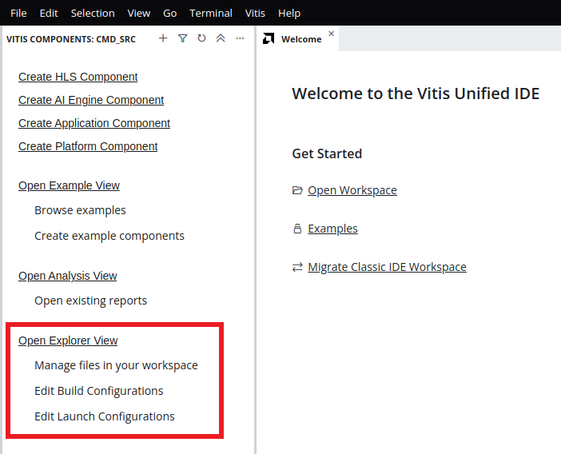 

4. Right click in the `CMD_SRC` section in EXPLORER, and select `Edit Build Configuration`
   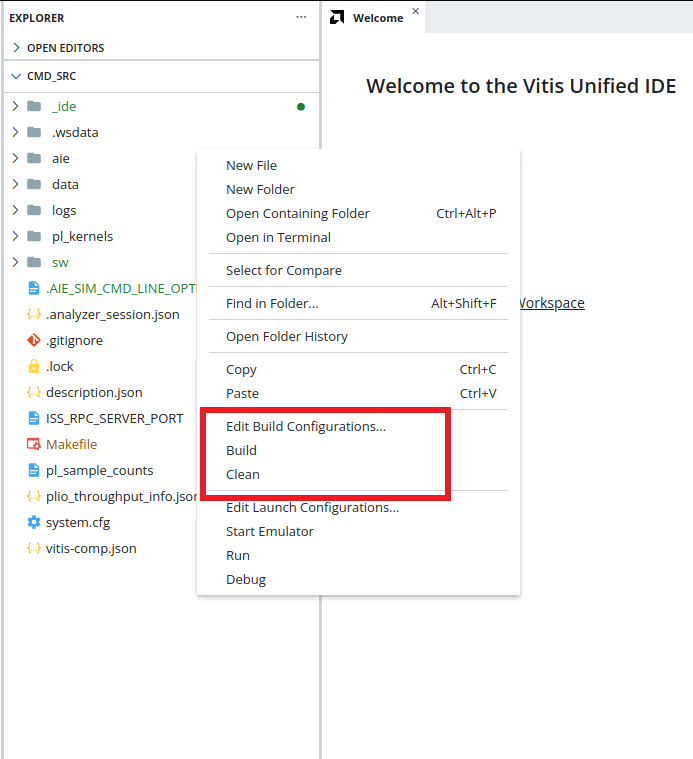 
   
   Enter the make command to build the system and clean the generated outputs in the `Build command` and `Clean command`, respectively.
   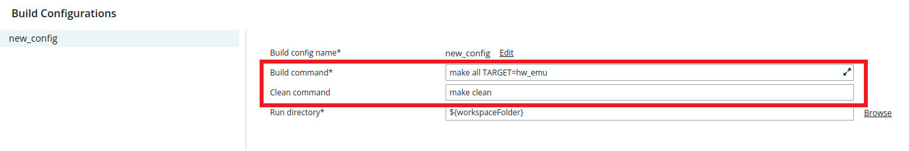 
   
   Right click in the `CMD_SRC` section in EXPLORER, and select `Build`.
   
   The build step performs the following:
   
    * Compiles the AI Engine kernels and generates `libadf.a`.
    * Compiles the PL kernels `s2mm`,`mm2s` and generates `.xo`.
    * Hardware linking step to link AI Engine kernels and PL kernels using the `system.cfg` file. This generates the `.xsa` file.
    * Compiles the host application and generates the executable file `host.exe`.
    * Packages `libadf.a`,`.xsa`, and `host.exe` files.
   
   The following message indicates that the emulation package is created and the build completed successfully.
   ```
   COMPLETE: emulation package created.
   Build Finished successfully
   ```
5. To launch emulation: Right click in the `CMD_SRC` section in EXPLORER, and select `Edit Launch Configurations`
   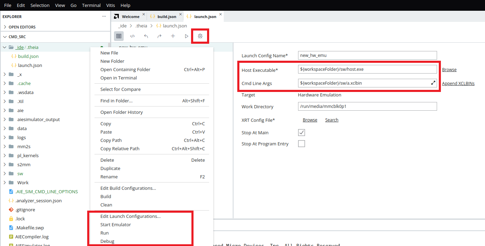 
   
   Select the `host.exe` and `a.xclbin` paths correctly. Start the Emulator by right-clicking in the `CMD_SRC` and selecting `Start Emulator`.
   Run the script `embedded_exec.sh` from /mnt as shown below. Check the log to confirm progress.
   
   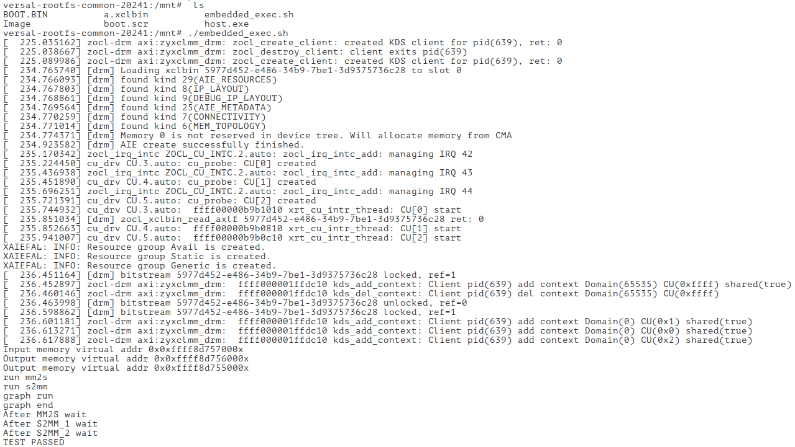 
   
   Test Result: `TEST PASSED` indicates that launch emulation result. Close the emulation.
      
6. Steps to debug `host.cpp` in Vitis IDE: 
   
   a. Start the Emulator as shown in step 5, and wait for emulation to finish.
   
   b. Click the `Debug` icon in `launch.json`. The Vitis IDE enters debug mode as follows and waits in the `main` function in `host.cpp`:
   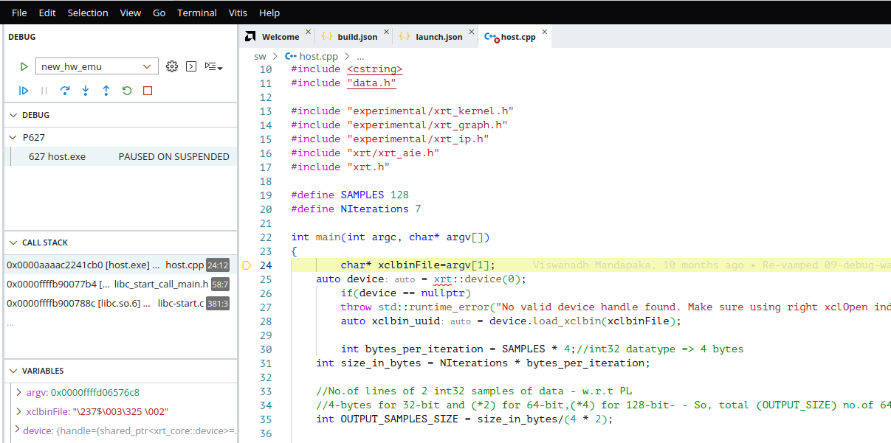
   
   You can add breakpoints in the host code and observe the values in the **Variable** window by doing **step-in** or **step-over**.

    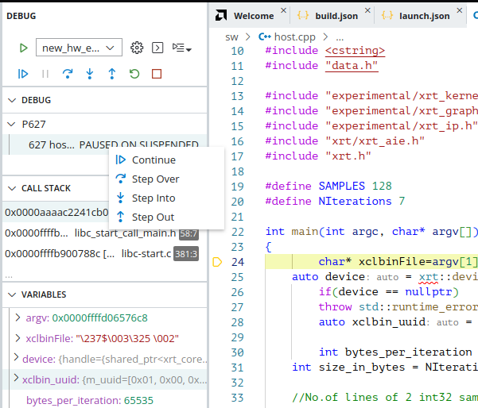
    
 Refer to Debugging the System Project and AI Engine in [Vitis Unified Software Platform Documentation: Application Acceleration Development (UG1393)](https://docs.amd.com/access/sources/ud/document?Doc_Version=2024.2%20English&url=ug1393-vitis-application-acceleration) for more details to debug AI Engine.


## Support

GitHub issues will be used for tracking requests and bugs. For questions, go to [support.xilinx.com](https://support.xilinx.com/).

<p class="sphinxhide" align="center"><sub>Copyright © 2020–2026 Advanced Micro Devices, Inc.</sub></p>

<p class="sphinxhide" align="center"><sup><a href="https://www.amd.com/en/corporate/copyright">Terms and Conditions</a></sup></p>


