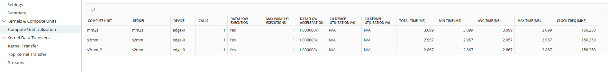
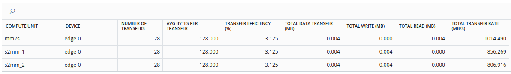
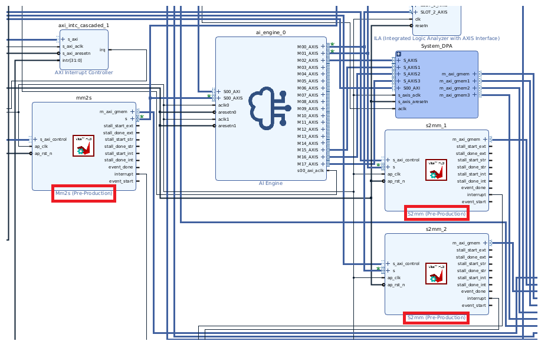
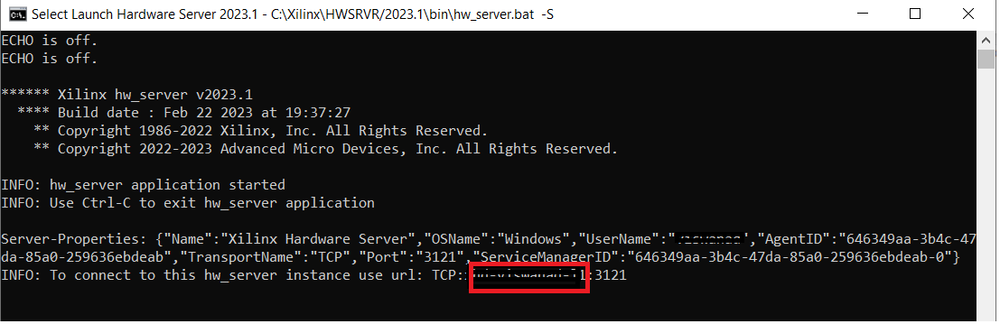
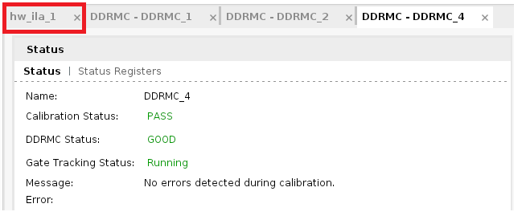
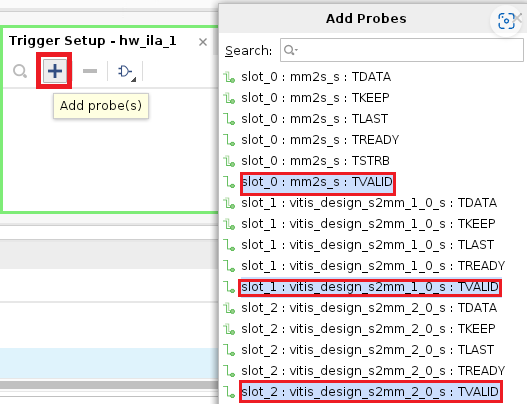
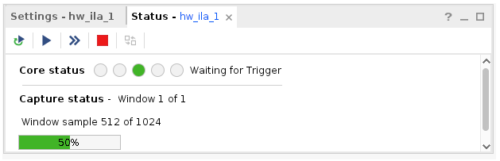
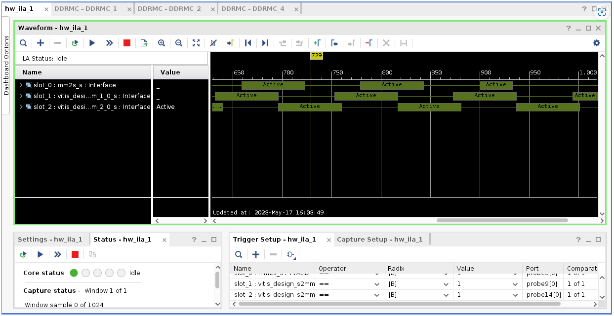
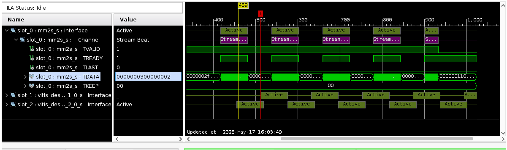

<table class="sphinxhide" width="100%">
 <tr width="100%">
    <td align="center"><h1>AI Engine Development</h1>
    <a href="https://www.xilinx.com/products/design-tools/vitis.html">See Vitis™ Development Environment on xilinx.com</br></a>
    <a href="https://www.xilinx.com/products/design-tools/vitis/vitis-ai.html">See Vitis™ AI Development Environment on xilinx.com</a>
    </td>
 </tr>
</table>

# PL Kernel Analysis

The goal of this stage is to determine the exact programmable logic (PL) kernel causing a throughput drop by adding the PL profile monitors and debugging AI Engine with the integrated logic analyzer (ILA).

## Features

<table style="width:100%">

<tr>
<td>
<a href="./Stage_3.md#Profiling-Using-PL-Profile-Monitors">Profiling Using the PL Profile Monitors</a>
</td>
<td>
Explains how to insert a PL profile monitors in the `v++link` command. This helps identify specific PL kernels(s) causing a performance drop.
</td>
</tr>

<tr>
<td>
<a href="./Stage_3.md#Inserting-ILAs-to-Monitor-Specific-AXI-Interfaces">Inserting ILA(s) to Monitor Specific AXI Interfaces</a>
</td>
<td>
Explains how to insert one or more ILAs to monitor specific PL AXI interfaces to help identify exactly where and when a throughput drop occurs. Also helps in identifying whether data is sent correctly to the AI Engine from the PL components and received correctly from the AI Engine to the PL.
</td>
</tr>

 </table>

### Getting the Design Files Ready

Clone the git repository, and get the design files to walk through this section of the tutorial. Navigate to the `cmd_src/` directory.

## Profiling Using PL Profile Monitors

In this section, you will walk through the process of insering PL profile monitors to identify specific PL kernels that causes the potential drop in performance.

This is a three step process:

* Add the PL profile monitors in the V++ link command, and generate the SD card image.
* Prepare the `xrt.ini` file, and run the design on hardware.
* Observe the output in the Vitis Analyzer, and analyze the performance.

1. Open the `Makefile` from `cmd_src/` directory.
2. Locate the `VPP_LINK_FLAGS`, and add `--profile.data all:all:all` as follows:

   ```
   VPP_LINK_FLAGS := -l -t $(TARGET) --platform $(BASE_PLATFORM) $(KERNEL_XO) $(GRAPH_O) --profile.data all:all:all --save-temps -g --config $(CONFIG_FILE) -o $(PFM).xsa
   ```

   The `--profile.data:<arg>` option enables the monitoring of data ports through the monitor IP that are added into the design. In this example, `<arg>` is set to `all:all:all`, i.e, assign the data profile to all CUs; *you can find names from `system.cfg` file as `s2mm_1`,`s2mm_2` and `mm2s`* and interfaces of all kernels, *s2mm and mm2s*.

3. Do `make all TARGET=hw`, and a hardware image `sd_card.img` gets generated inside the `sw/` directory.

4. Flash the `sd_card.img` file to the SD card. You can follow step 3 in [Running the Design on Hardware](../Stage-1#Running-the-design-on-hardware) section.

5. Create a `xrt.ini` file with content as follows:

   ```
   [Debug]
   device_trace = fine

   [profile]
   data=all:all:all
   ```

   Here:

      * The `[Debug]` switch key option is used to enable profiling of the application during runtime.
      * The `[profile]` section head contains the `data=all:all:all` to monitor data on all kernels and CUs.

6. In the console, run the application by:

   ```
   cd /run/media/mmcblk0p1
   ./host.exe a.xclbin
   ```

   Observe the `TEST PASSED`.

7. Observe the files, `xrt.run_summary`,`summary.csv`, and `device_trace_*.csv`. Copy back the files to the local workspace, and open the `xrt.run_summary` file in the Vitis Analyzer using the following command:

   ```
   vitis_analyzer xrt.run_summary
   ```

8. Once the Vitis Analyzer opens, click the `Profile Summary` in the left side pane, and navigate to the **Compute Unit Utilization**. Observe the compute units and kernels. Also note the time and clock frequency as follows.


9. You can get the data transfer for each compute unit and total Read/write in megabytes by navigating to **Kernel Data Transfers** -> **Top Kernel Transfer** as follows:


10. From the **Kernel Data Transfers** -> **Kernel Transfer** tab, you can get the transfer rate, througput utilization (%), and latency details.

## Inserting ILAs to Monitor Specific AXI Interfaces

Adding ChipScope helps debugging the AIE PL interfaces in the design running on hardware, including checking for AXI protocol violations, hardware kernel issues, data integrity, and performance issues of the design. To debug using ILAs, the design is required to enable the ILA in hardware build.

### Enable ILA in the Design

The v++ `--debug` opiton is used to enable the ILA IP core and insert in the design. This needs to be specified during the linking stage in the design cycle.

1. Open the `Makefile`, locate the `VPP_LINK_FLAGS`, and add the following options to the existing ones:

   ```
   --debug.chipscope s2mm_1:s --debug.chipscope s2mm_2:s --debug.chipscope mm2s:s
   ```

   Notice here the `s2mm_1:s`,`s2mm_2:s`, and `mm2s:s`. The syntax is `<Compute Unit name>:<Interface name>`.

   Make sure the compute unit name matches with the one specified in the `system.cfg` file. In this exercise, monitor the stream _output from `mm2s` module going to theAI Engine, going to `s2mm` module_.

   >**NOTE:** V++ allows multiple `--debug.chipscope` lines to meet design debug needs.

2. Build the design. Especially, if you have already compiled the AI Engine design and PL modules, it is required to run the linking step in the `Makefile` and repackage to generate the SD card image.

   ```
   make clean
   make all
   ```

3. Inspect the ILA insertion by opening AMD Vivado&trade;, and click **Open Block Design** in **IP INTEGRATOR**.

   ```
   vivado _x/link/vivado/vpl/prj/prj.xpr`
   ```

   

4. Flash the SD card with the ILA-enabled design, plug in the flashed SD card on to the `VCK190` SD card slot, and boot up the board.

#### Set Up the Connection in Vivado

1. Run the hardware server from the computer that connects to the target board. To do so, launch the hardware server from the computer that has a JTAG connection to the VCK190 board.


2. Launch Vivado by issuing the command, `vivado`.
3. Set up the Vivado Hardware Manager by clicking **Flow** -> **Hardware Manager**, and click  **Open target**.
4. Select **Open New Target**, and click **Next**.
5. Add the `Host Name` as you see in step 5, and click **Next**.
6. After a successful connection to your host, you can verify the hardware devices `arm_dap_0`,`xcvc1902_1`, and click **Next**.
7. Click **Finish**.
8. Under the **Hardware Device Properties** window, click the ellipsis (...) to select the generated probe file from `${PROJECT_PATH}/tutorial.ltx`.
9. After the hardware device got refreshed, you can observe the following messages in the Tcl console:

   ```
   Processed interface mm2s_s_ila1_slot0
   Processed interface vitis_design_s2mm_1_0_s_ila1_slot1
   Processed interface vitis_design_s2mm_2_0_s_ila1_slot2
   ```

10. Click the `hw_ila_1` as follows:


11. Select the `+` button from the **Trigger Setup - hw_ila_1** window, and select the `TVALID` signal probes, and click **OK**.


12. Once the probes are added, select `1 (logical one)` from the dropdown in the `Value` column for all three probes. This is required to capture the signals when `TVALID` is high.
13. Observe the **Core status** as `IDLE` in the **Settings-hw_ila_1** window. Now, select the `>(Play)` button at the top to capture the configured signals, and observe the status changes to `Waiting for Trigger` as follows:


14. Wait for the ILA to be ready to capture signals, and run the application on the `VCK190` board.

      ```
      ./host.exe a.xclbin
      ```

15. Expect to see the following result:

   After completing above steps, you are able to see the captured-related AXI signals and data are shown in a waveform with timing information from Vivado.

#### Examine the Captured Results

   

1. Expand the `slot_0 : mm2s_s : Interface`. The `mm2s_s : TVALID` shows `1`, which indicates a valid data is available at the time marker pointed. Moving the time marker across the timeline, changes the AXI protocol values indicating value changes at that particular time.

   This is the method to determine when/what valid data is sent/received.

   >**NOTE:** The default buffer size allocated while creating a BD design in Vivado might not be sufficient enough to capture the data of all iterations. For more information on viewing ILA probe data, refer to the [Viewing ILA Probe Data in the Waveform Viewer](https://docs.xilinx.com/r/en-US/ug908-vivado-programming-debugging/Viewing-ILA-Probe-Data-in-the-Waveform-Viewer) in *Vivado Design Suite User Guide: Programming and Debugging* (UG908).

## Support

GitHub issues will be used for tracking requests and bugs. For questions, go to [support.xilinx.com](https://support.xilinx.com/).

<p class="sphinxhide" align="center"><sub>Copyright © 2020–2023 Advanced Micro Devices, Inc</sub></p>

<p class="sphinxhide" align="center"><sup><a href="https://www.amd.com/en/corporate/copyright">Terms and Conditions</a></sup></p>
