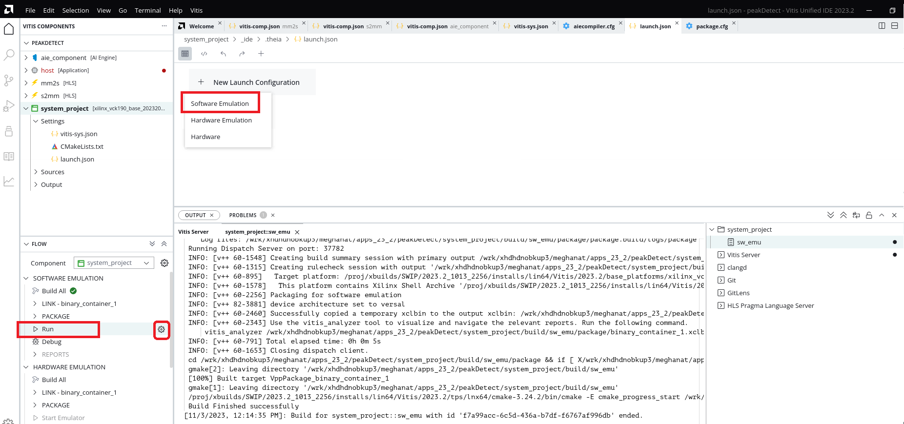
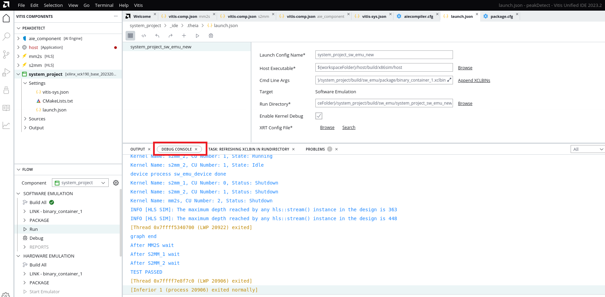
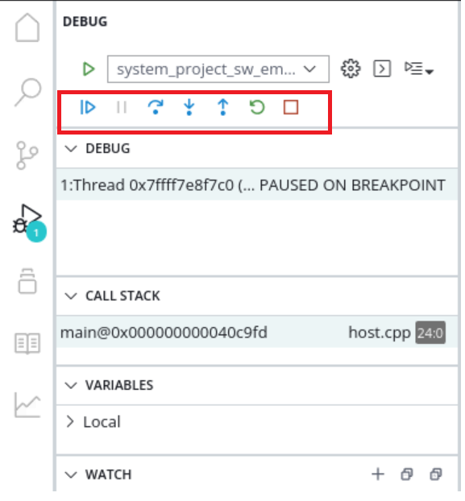
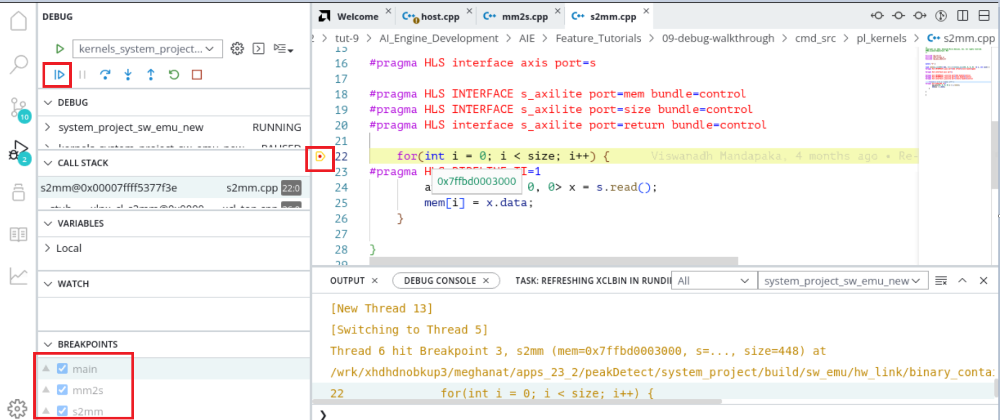
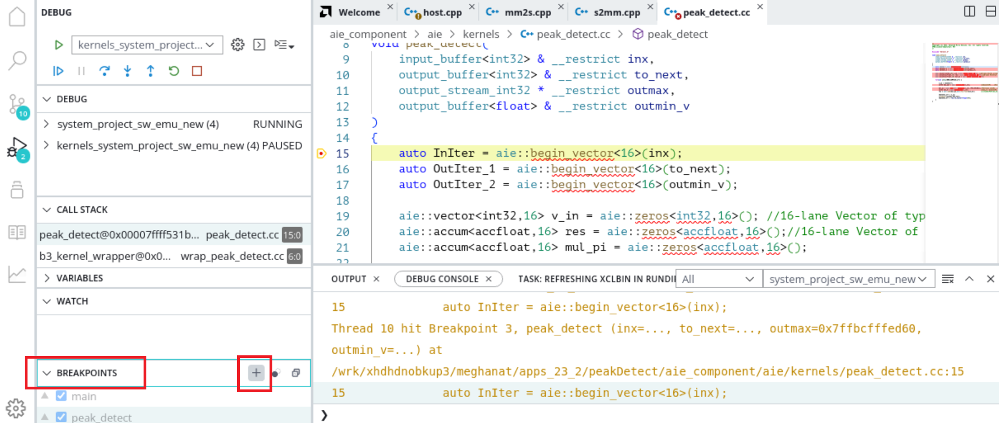
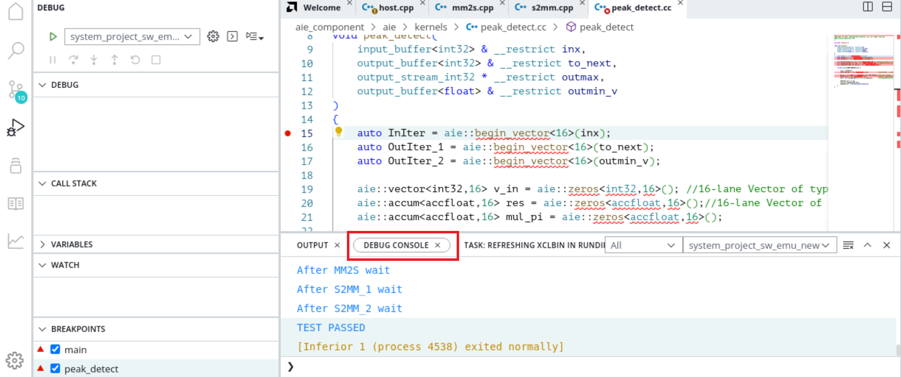

<table class="sphinxhide" width="100%">
 <tr width="100%">
    <td align="center"><h1>AI Engine Development</h1>
    <a href="https://www.xilinx.com/products/design-tools/vitis.html">See Vitis™ Development Environment on xilinx.com </a>
    <a href="https://www.xilinx.com/products/design-tools/vitis/vitis-ai.html">See Vitis™ AI Development Environment on xilinx.com</a>
    </td>
 </tr>
</table>

## Software-Emulation Debug Walkthrough

## Introduction

Generally, software emulation is the first step to building and testing the system in a functional process through the custom host code you create rather than the simulator test host code.

Software emulation for a system with an AI Engine can be useful in:

* Checking initial system behavior with a limited known data set
* Functional integration and debugging of the processing system (PS), programmable logic (PL), and ADF graph using the GNU debugger (GDB)
* Testing the system with the external traffic generator using Python or C++
* Running system with C-based models for register-transfer level (RTL) kernels
* Applying AI Engine simulation options through the x86 options file in `Work/options`

## Features

The following are some of the software emulation features this section covers.

<table style="width:100%">

<tr>
<td>
<a href="./README.md#Build-for-Software-Emulation-using-Vitis-IDE">Build for Software Emulation Using the Vitis IDE</a>
</td>
<td>
Explains how to create system project, build for sofware emulation, and run.
</td>
</tr> 

<tr>
<td>
<a href="./README.md#Using-Vitis-IDE-for-software-emulation-debug">Using the Vitis IDE for Software Emulation Debug</a>
</td>
<td>
Explains how to debug for software emulation using the Vitis IDE.
</td>
</tr> 
</table>

# Section 1

## Build for Software Emulation Using the Vitis IDE

Before getting into this section, you must follow the GCC requirements to build the Software Application from [here.](https://docs.xilinx.com/r/en-US/ug1393-vitis-application-acceleration/Building-the-Software-Application)

Also it is expected that you created an AI Engine application in the Vitis IDE and ran x86simulation [Build and Simulate in Vitis IDE](../X86_Simulation/README.md#Build-and-simulate-in-Vitis-IDE).

Create a system project manually using the steps mentioned in [Port Command Line Project to the Vitis IDE System Project](../CreateIDESystemProj.md)

1. To build the system project, click **system_project** and go to Flow Navigator pane and select **SW EMULATION**. Click **Build All** for SW Emulation. The top-level project uses an incremental build approach that recognizes the state of the subprojects and provides option to rebuild the projects that must be updated. 
2. Once the build completes, hover the mouse over **Run** and click settings icon, select **New Launch Configuration**, add the SW Emulation configuration, and hit **Run**.

3. Notice the run log of SW Emulation on the **Debug Console** 

# Section 2

## Debug using the Vitis IDE Debugger for Software Emulation

This section walks you through debugging in the software emulationflow using the Vitis IDE Debugger. Before going through this section, it is expected to complete the [Debug Using the Vitis IDE Debugger](../X86_Simulation/README.md#Debug-using-Vitis-IDE-debugger) section which gives quick idea on how to use the Vitis IDE debugger.

1. After the design is built for the SW Emulation target, click on **Flow** Navigator -> **SW Emulation** -> **Debug** option.
2. This gets you to the debug mode in the Vitis IDE and waits in the host.cpp file

3. Also observe in the **Breakpoints** view, two other breakpoints that the tool automatically adds on to the `mm2s` and `s2mm` kernels.
4. Click the **Resume** button, and now the debugger waits at the breakpoint in `mm2s`. Optionally, you can also try placing the breakpoint in the `mm2s` function.
5. Click **Resume** again, and observe debugger and console output, waiting at the `s2mm` kernel. Continue clicking **Resume** until the breakpoint in `s2mm.cpp` hits. 

    Also note an error message if you try to access the vector variable values. This is not fully supported in software emulation and recommended to use the `x86simulator` to inspect the variable values.

6. You can add function breakpoint for peak_detect kernel by clicking on **Breakpoints** -> **Add function Breakpoints**

7. After your debug, remove all breakpoints, and click **Resume** to complete the run and stop emulation. You should see the `TEST PASSED` on the `Debug Console`.

    >**NOTE:** All the limitations from `x86simulator` are applicable in software emulation.

## Support

GitHub issues will be used for tracking requests and bugs. For questions, go to [support.xilinx.com](https://support.xilinx.com/).

Copyright © 2020–2023 Advanced Micro Devices, Inc

<a href="https://www.amd.com/en/corporate/copyright">Terms and Conditions</a>
