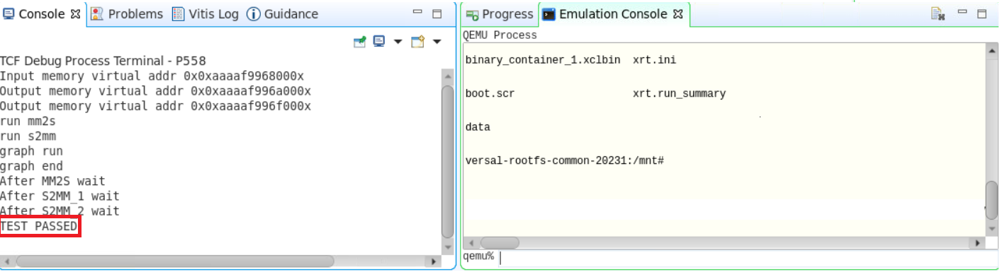
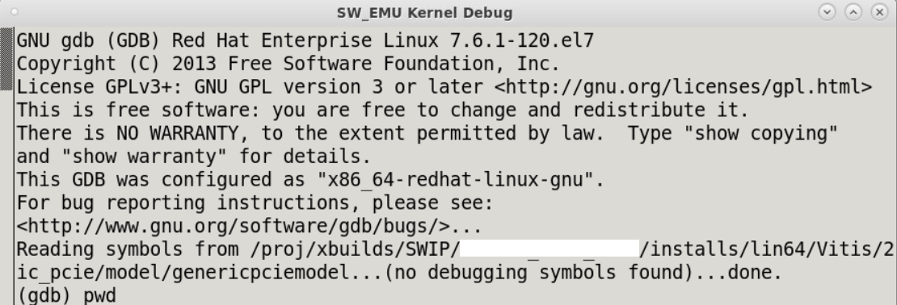

<table class="sphinxhide" width="100%">
 <tr width="100%">
    <td align="center"><h1>AI Engine Development</h1>
    <a href="https://www.xilinx.com/products/design-tools/vitis.html">See Vitis™ Development Environment on xilinx.com</br></a>
    <a href="https://www.xilinx.com/products/design-tools/vitis/vitis-ai.html">See Vitis™ AI Development Environment on xilinx.com</a>
    </td>
 </tr>
</table>

## Software-Emulation Debug Walkthrough

## Introduction

Generally, software emulation is the first step to building and testing the system in a functional process through the custom host code you create rather than the simulator test host code.

Software emulation for a system with an AI Engine can be useful in:

* Checking initial system behavior with a limited known data set
* Functional integration and debugging of the processing system (PS), programmable logic (PL), and ADF graph using the GNU debugger (GDB)
* Testing the system with the external traffic generator using Python or C++
* Running system with C-based models for register-transfer level (RTL) kernels
* Applying AI Engine simulation options through the x86 options file in `Work/options`

## Features

The following are some of the software emulation features this section covers.

<table style="width:100%">

<tr>
<td>
<a href="./README.md#Build-for-Software-Emulation-using-Vitis-IDE">Build for Software Emulation Using the Vitis IDE</a>
</td>
<td>
Explains how to create system project, build for sofware emulation, and run.
</td>
</tr> 

<tr>
<td>
<a href="./README.md#Using-Vitis-IDE-for-software-emulation-debug">Using the Vitis IDE for Software Emulation Debug</a>
</td>
<td>
Explains how to debug for software emulation using the Vitis IDE.
</td>
</tr> 

<tr>
<td>
<a href="./README.md#Debug-in-command-line">Debug in the Command Line</a>
</td>
<td>
Explains how to use the GDB to debug in the command line using the option `-kernel-dbg true`.
</td>
</tr>

</table>

# Section 1

## Build for Software Emulation Using the Vitis IDE

Before getting into this section, it is expected that you created an AI Engine application in the Vitis IDE and ran x86simulation [Build and Simulate in Vitis IDE](../X86_Simulation/README.md#Build-and-simulate-in-Vitis-IDE).

Create a system project manually using the steps mentioned in [Port Command Line Project to the Vitis IDE System Project](../CreateIDESystemProj.md), and download the Vitis IDE exported project ([Download Vitis IDE project](../README.md#Download-Vitis-IDE-project)).  

If you are using the `PeakDetect.ide.zip` package, make sure to open the system project settings by double-clicking **PeakDetect_system -> PeakDetect_system.sprj**, and set the `sysroot`,`Root FS` and `Kenrel Image` path. For more information, refer to [System Project Settings](../CreateIDESystemProj.md#System-Project-settings).

1. To build the system project, right-click **PeakDetect_System** and select **Build Project**. The top-level project uses an incremental build approach that recognizes the state of the subprojects and only rebuilds projects that need to be updated.
2. Once the build completes, right-click **PeakDetect_System**, select **Run As** -> **Run Configurations**, add the environment variables, and hit **Apply** -> **Run**.


3. In the **Launch on Emulator** window, click the **Start Emulator and Run** button. This starts the Quick Emulator (QEMU) emulation environment and boots Linux. The Emulation console shows a transcript of the QEMU launch and Linux boot process.

    Alternatively, you can also start emulation by selecting the **Vitis -> Start/Stop Emulator** option. One advantage with this is, you can specify the emulator arguments. For example, you can specify options for the AI Engine simulator that runs the graph application as follows:

    `-x86-sim-options ${FULL_PATH}/x86sim.options`

    

4. You can observe the Linux boot and application run message in the console as follows:


5. You can stop emulation by clicking the **Vitis -> Start/Stop Emulator** option, and hit **Stop**.

# Section 2

## Using the Vitis IDE for Software Emulation Debug

This section walks you through debugging the Vitis IDE for software emulation. Before going through this section, it is expected to complete the [Debug Using the Vitis IDE Debugger](../X86_Simulation/README.md#Debug-using-Vitis-IDE-debugger) section which gives quick idea on how to use the Vitis IDE debugger.

1. Once the build completes, you can right-click the system project, **PeakDetect_system** and select **Debug As** -> **Launch SW Emulator**.
2. In the **Launch on Emulator** window, select **Start Emulator and Debug**.
3. You can observe the Linux boot and application run messages in the console. Once the boot completes and application run starts, the debugger stops after the `main()` function as follows.


4. Also observe in the **Breakpoints** view, two other breakpoints that the tool automatically adds on to the `mm2s` and `s2mm` kernels.
5. Place some breakpoints in your AI Engine source code, and try to observe the intermediate values. Open the `src/kernels/peak_detect.cc` file at line 31.
6. Click the **Resume** button, and now the debugger waits at the breakpoint in `mm2s`. Optionally, you can also try placing the breakpoint in the `mm2s` function.
7. Click **Resume** again, and observe debugger and console output, waiting at the `s2mm` kernel. Continue clicking **Resume** until the breakpoint in `peak_detect.cc` hits. Now, do **step-over** and observe values in variables view as follows.


    Also note an error message if you try to access the vector variable values. This is not fully supported in software emulation and recommended to use the `x86simulator` to inspect the variable values.
8. After your debug, remove all breakpoints, and click **Resume** to complete the run and stop emulation.

    >**NOTE:** All the limitations from `x86simulator` are applicable in software emulation.

## Debug in the Command Line

This sections walk you through debugging for software emulation using the GDB in the command line.

1. Clone the git repository, and locate the `Makefile` to build the system for software emulation.
2. Set the environment variables as described in [Introduction](../README.md#Introduction).
3. Do `make all` or `make aie`,`make kernels`,`make xsa`,`make host` and`make package` one after the other to complete the build for software emulation.

    >**NOTE:** Make sure to compile the host application using the option `-g` to debug using the GDB.

4. To debug using the GDB, invoke the lauch emulation script using the option, `-kernel-dbg true`.

    ```
    ./sw/launch_sw_emu.sh -kernel-dbg true
    ```

    The option `-kernel-dbg true` will set up the emulator to run `gdb` at the execution of the application.

5. Observe the QEMU emulation environment and Linux boot.
6. Run the following commands in the `QEMU` shell.

    ```
    export LD_LIBRARY_PATH=/mnt/sd*1:/tmp:$LD_LIBRARY_PATH
    export XCL_EMULATION_MODE=sw_emu
    export XILINX_XRT=/usr
    ```

7. Run the PS application using `./host.exe a.xclbin`.

    This will start running the host application and launch the GDB in a separate terminal as follows:


8. Place breakpoints in the `s2mm`, `mm2s`, and `peak_detect` functions as follows, and run the application:

    ```
    (gdb) b s2mm
    Function "s2mm" not defined.
    Make breakpoint pending on future shared library load? (y or [n]) y
    Breakpoint 1 (s2mm) pending.
    (gdb) b mm2s
    Function "mm2s" not defined.
    Make breakpoint pending on future shared library load? (y or [n]) y
    Breakpoint 2 (mm2s) pending.
    (gdb) b peak_detect:24
    No symbol table is loaded.  Use the "file" command.
    Make breakpoint pending on future shared library load? (y or [n]) y
    Breakpoint 3 (peak_detect:24) pending.
    ```

9. Now type `r` to run the program, and observe it stops at the breakpoint in `mm2s`.

    ```
    [Switching to Thread 0x7fffef7fe700 (LWP 45539)]

    Breakpoint 2, mm2s (mem=0x7ffff0007000, s=..., size=448)
        at /wrk/xhdhdnobkup4/viswanad/2023_1/11_4_git_viswa/Vitis-Tutorials/AI_Engine_Development/Feature_Tutorials/20-debug-walkthrough-new/2_cmd/_x/link/int/xo/mm2s/mm2s/cpu_sources/mm2s.cpp:34
    34              for(int i = 0; i < size; i++) {
    (gdb) 
    ```

10. You can press `Ctrl`+`XA` in the GDB console, which opens the source code where the debugger stopped. Toggle using the same keyboard shortcut to come back to the original console.
11. Tpe `c` to continue execution, and observe it stops at the `s2mm` function now.
12. Type `c` again, and observe the breakpoint now hits at `peak_detect` function.
13. Type `next` to debug line by line, and observe variable values, e.g, max_out using `print max_out`.
14. Use all the `gdb debug` options and debug as mentioned in [x86simulation with the GDB](../X86_Simulation/README.md#x86simulation-with--the-GDB) section.
15. Type `d` to delete all breakpoints and `r` to complete the run.
16. Observe `Test Passed` in the Linux console.

## Support

GitHub issues will be used for tracking requests and bugs. For questions, go to [support.xilinx.com](https://support.xilinx.com/).

<p class="sphinxhide" align="center"><sub>Copyright © 2020–2023 Advanced Micro Devices, Inc</sub></p>

<p class="sphinxhide" align="center"><sup><a href="https://www.amd.com/en/corporate/copyright">Terms and Conditions</a></sup></p>
