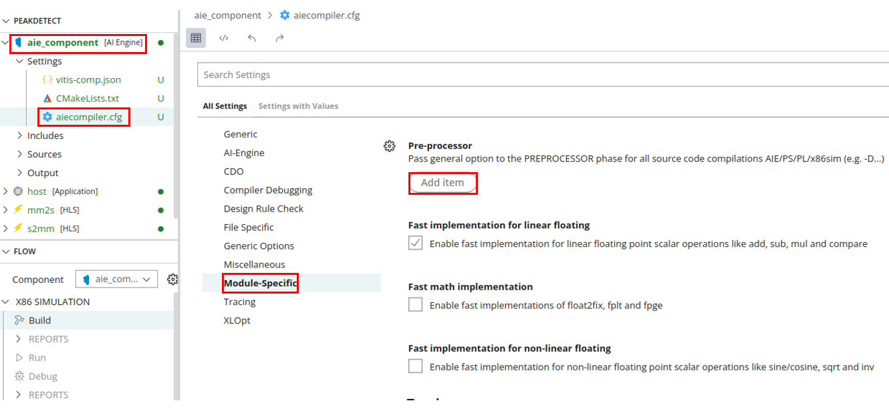
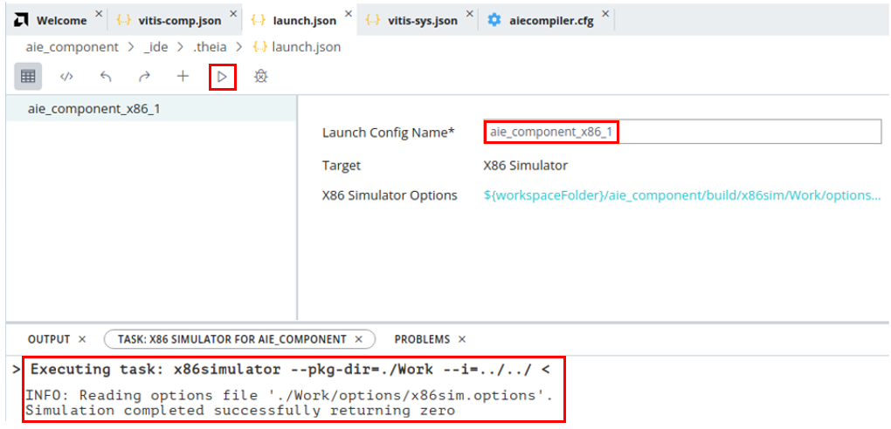
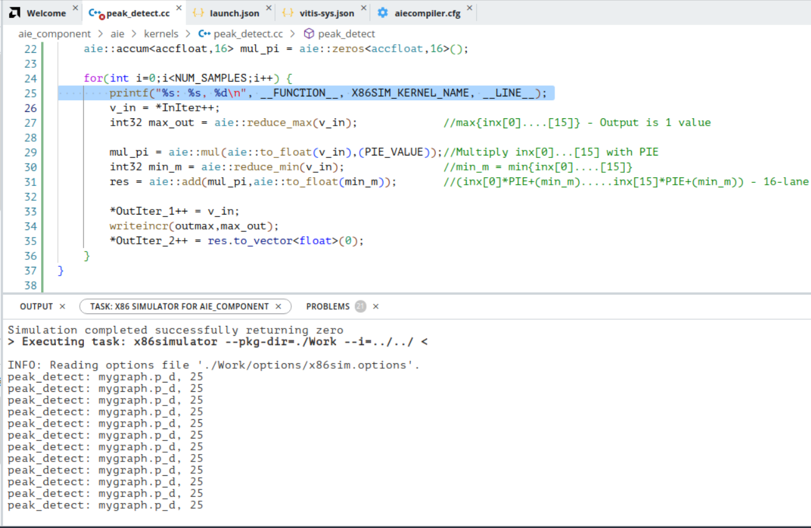
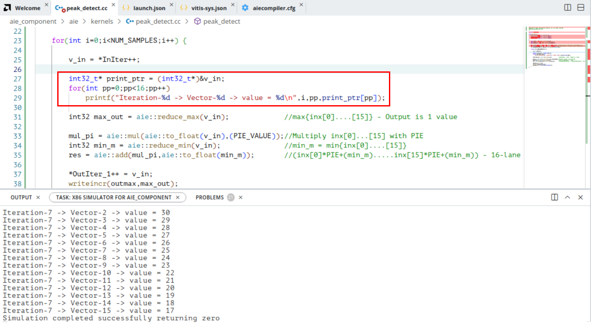
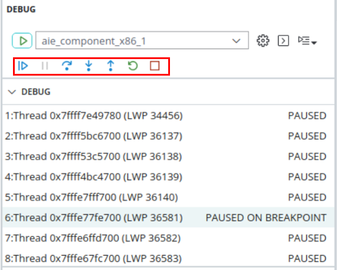
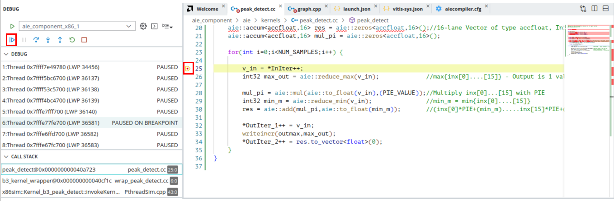
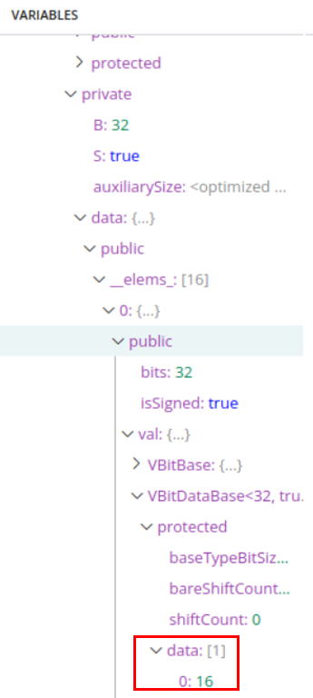
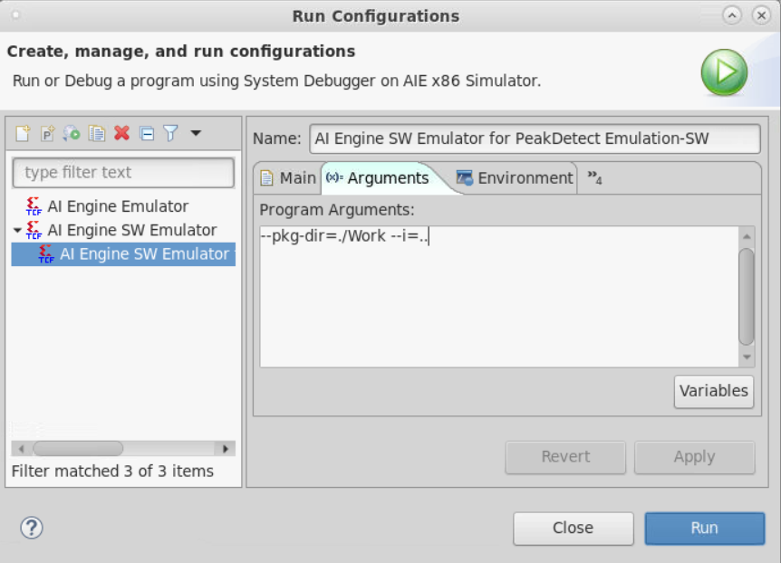
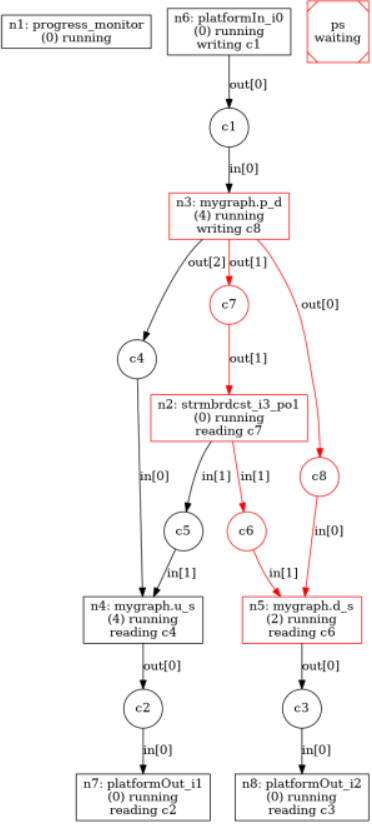

<table class="sphinxhide" width="100%">
 <tr width="100%">
    <td align="center"><h1>AI Engine Development</h1>
    <a href="https://www.xilinx.com/products/design-tools/vitis.html">See Vitis™ Development Environment on xilinx.com</br></a>
    <a href="https://www.xilinx.com/products/design-tools/vitis/vitis-ai.html">See Vitis™ AI Development Environment on xilinx.com</a>
    </td>
 </tr>
</table>

# X86 Simulation Debug Walkthrough

## Introduction

The x86simulator supports faster simulation to help verify the kernel's functionalities. It applies systemC model instead of the register transfer level (RTL) model to achieve faster build and runtime. The hardware constraints, such as heap/stack sizes and program memory size, are not verified in the software emulator.

Before starting this tutorial:

* It is expected that you have run the steps to set the environment variables as described in [Introduction](../README.md#Introduction).
* Create a system project manually using the steps mentioned in [Port a Command Line Project to a Vitis IDE System Project](../CreateIDESystemProj.md), or download the Vitis exported project as instructed in [Download the Vitis IDE Project](../README.md#Download-Vitis-IDE-project).
* Open the Vitis IDE tool by typing `vitis` in the console, set the workspace, and the IDE opens. Click **File**->**Import**, select the **Vitis exported project zip file**, browse to the above zip file, and click **Next**. Enable the **System Projects** check box, and click **Finish**.

## Features

<table style="width:100%">

<tr>
<td>
 <a href="./README.md#Build-and-simulate-in-Vitis-IDE">Build and Simulate in the Vitis IDE</a>
</td>
<td>
Demonstrates how to use the Vitis IDE to build and simulate an AI Engine design.
</td>
</tr>

<tr>
<td>
<a href="./README.md#Debug-using-printf">Debug Using printf()</a>
</td>
<td>
Demonstrates how to add formatted `printf()` to print debug messages.
</td>
</tr>

<tr>
<td>
<a href="./README.md#Debug-using-printf-with-Vector-datatypes">Debug Using printf() with Vector Datatypes</a>
</td>
<td>
Demonstrates how to print vector output data value via `printf()`.
</td>
</tr>

<tr>
<td>
<a href="./README.md#Debug-using-Vitis-IDE-debugger">Debug Using the Vitis IDE Debugger</a>
</td>
<td>
Demonstrates how to use the Vitis IDE debugger to debug an AI Engine design.
</td>
</tr>
 
<tr>
<td>
<a href="./README.md#x86simulator-options-for-debugging">x86simulator Options for Debugging</a>
</td>
<td>
Demonstrates how to use the x86simulator options file for debugging.
</td>
</tr>

<tr>
<td>
<a href="./README.md#Data-dump">Data Dump</a>
</td>
<td>
Demonstrates how to use the data dump feature with a practical scenario.
</td>
</tr>

<tr>
<td>
<a href="./README.md#Deadlock-detection">Deadlock Detection</a>
</td>
<td>
Demonstrates how to debug deadlock scenarios in an x86simulation.
</td>
</tr>

<tr>
<td>
<a href="./README.md#Trace-report-in-file">Trace Report in a File</a>
</td>
<td>
Demonstrates how to visualize the trace report in a file.
</td>
</tr>

<tr>
<td>
<a href="./README.md#Trace-report-in-output-console">Trace Report in the Output Console</a>
</td>
<td>
Demonstrates how to visualize the trace report in the output console during runtime.
</td>
</tr>

<tr>
<td>
<a href="./README.md#Memory-access-violation-and-valgrind-support">Memory Access Violation and Valgrind Support</a>
</td>
<td>
Demonstrates how to debug a memory access violations in an AI Engine design using Valgrind support.
</td>
</tr>

<tr>
<td>
<a href="./README.md#Using-GDB-debugger-in-command-line">Using the GDB Debugger in Command Line</a>
</td>
<td>
Demonstrates about debugging in command line using the GNU debugger (GDB).
</td>
</tr>

<tr>
<td>
<a href="./README.md#x86simulation-on-command-line">x86simulation on the Command Line</a>
</td>
<td>
Demonstrates how to run an x86simulation on the command line.
</td>
</tr>

<tr>
<td>
<a href="./README.md#x86simulation-with-GDB">x86simulation with GDB</a>
</td>
<td>
Demonstrates how to use the GDB during x86simulation.
</td>
</tr>

<tr>
<td>
<a href="./README.md#x86simulator-Using-GDB-server">x86simulator Using the GDB Server</a>
</td>
<td>
Demonstrates how to use a GDB server to debug the design.
</td>
</tr>

</table>

# Section 1

## Build and Simulate in the Vitis IDE

1. In the Vitis IDE toolbar, click the arrow next to the manage configurations button, and select the 'Emulation-SW'. This sets the build target for x86 simulation.

2. Right-click the *[aiengine]* domain project, select **C/C++ Build Settings**, choose **Compiler**, and add `-O0` to the Pre Processor Options. This improves the debug visibility.

3. Right-click the *[aiengine]* domain project, and select the **Build** option. Once the build completes, you see the **Compilation Complete** and **Build Finished** messages in the console.
4. Right-click the *[aiengine]* domain project, and select the **Run As → Launch SW Emulator** option to start simulation for an x86simulation target. When the simulation complete, you see the following output in the console.

5. The x86simulator output files from design are located at `${PROJECT}/Emulation-SW/x86simulator_output/data`. Verify the output files `${PROJECT}/Emulation-SW/x86simulator_output/data/output_upscale.txt` and `${PROJECT}/Emulation-SW/x86simulator_output/data/output_data_shuffle.txt` against the golden files `${PROJECT}/data/golden_upscale.txt` and `${PROJECT}/data/output_data_shuffle.txt` to ensure that the design's I/O functionalities are correct. The Vitis IDE supports compare with the feature to compare two files; highlight the two files to be compared, then right-click one of the highlighted files, and select **compare with** then **Each other**. For example, compare `${PROJECT}/data/golden_upscale.txt` and `${PROJECT}/Emulation-SW/data/output_upscale.txt`.

# Section 2

## Debug Using printf()

The simplest form of tracing is to use a formatted `printf()` statement in the code for printing debug messages. Visual inspection of intermediate values and addresses can help you understand the progress of program execution. You can add `printf()` statements to your code to be processed during x86 simulation, and remove them or comment them out for hardware builds. To help identify which kernel is printing which line, the `X86SIM_KERNEL_NAME` macro can be useful.

This section talks about adding a `printf()` statement in the source code, compile and run `x86simulator`, and check the output in the console.

1. From the Vitis IDE, browse to the *[aiengine]* domain project and expand **src** → **kernels** → **click** on `peak_detect.cc`.
2. Add `#include <adf/x86sim/x86simDebug.h>` at the beginning of the source file and `printf("%s: %s, %d\n", __FUNCTION__, X86SIM_KERNEL_NAME, __LINE__);` after for the loop.
3. To compile the project, right-click the *[aiengine]* domain project, and select **'Build Project'**.
4. To run the project, right-click **Run As** → **Launch SW Emulator**.
5. The expected result is as follows.

6. Remove the added `printf` statement from the `peak_detect.cc` file to use it for other features.

# Section 3

## Debug Using printf with Vector Datatypes

The x86simulator supports printing vector output data value via `printf()`. This section talks about visualizing vector values using the x86simulator.

1. Add the following lines in the `peak_detect.cc`.

   ```
   int32_t* print_ptr = (int32_t*)&v_in;
   for(int pp=0;pp<16;pp++)
      printf("Iteration-%d -> Vector-%d -> value = %d\n",i,pp,print_ptr[pp]);
   ```

2. Recompile the project either by right-clicking the project → **Build project**, or by hitting the **build** button in the taskbar.
3. Run the x86simulation, and observe the following `printf` statements in the console.


# Section 4

## Debug Using the Vitis IDE Debugger

This section walks you through a debug methodology that uses the Vitis IDE debugger. You can learn how to invoke the debugger, add breakpoints, view intermediate values, etc.

1. After the design is built for the x86simulation target, right-click the *[aiengine]* domain project, and select **Debug as** → **Launch SW Emulator**.
2. This gets you to the debug mode in the Vitis IDE and waits in the `graph.cpp` file (after the *main()* function).
3. Open any source file from the Explorer window, and add the breakpoint of interest. For example, open the *peak_detect.cc* source file, and add the breakpoint at line 26.
4. Observe the different debug functionalities/controls available, that is, step-in, step-over, step-return, resume, terminate, disconnect, etc.

5. Press **F8** or the **Resume** button in the toolbar. Observe the simulation stops at the user-defined breakpoint as follows.

6. You can inspect the array value `v_in` `(aie::vector<int32,16>)` from the Variables view. Double-click the Variables view to enlarge the area. You can restore it back to the original size by double-clicking again. Expand the variable, `v_in`, and continue expanding to `(Vin → data → __elems_ → __elems_[0] → val → VBitDataBase<32,true,false> → data →  0 → [])`. If you click that, it shows the value '16' at the bottom (based on the iteration in your case).

7. You can either continue stepping for all iterations, or remove the breakpoint and hit the **Run** button in the taskbar. It completely runs the simulation for all iterations. Once you are done with debugging, you can click the disconnect button, and switch back to Design mode.

# Section 5

## x86simulator Options for Debugging

The following table lists some x86simulator options which are used for debugging. For the complete set of x86simulator options, refer to [Simulator Options](https://docs.xilinx.com/r/en-US/ug1076-ai-engine-environment/Simulator-Options) in the *AI Engine Tools and Flows User Guide* (UG1076).

|Option |Description|
|:----|:----|
|--dump|Enables snapshots of data traffic on kernel ports.|
|--trace|Enables trace of kernel stall events.|
|--valgrind|Runs the simulator under Valgrind to detect access violations.|

All x86simulator supported features allow you to debug designs without using the debugger and do not require any instrumentation of kernel code.

One obvious way to specify these options is to add them in Run configurations in the Vitis IDE. To do this, right-click the *[aiengine]* domain project, select **Run As** → **Run configurations**, and add the following options in Arguments tab.


Another way to enable the feature is to update the configuration file, `${PROJECT_PATH}/Emulation-SW/Work/options/x86sim.options` from `no` to `yes` for the selected feature.

```
# For setting input directory path : define input-dir
input-dir=.
# For setting output directory path : define output-dir
output-dir=./x86simulator_output
# For Timeout : define timeout as integer value
timeout=
# For Snapshots : define dump=yes
dump=no
# For Gdb debugging : define gdb=yes
gdb=no
# For running Valgrind : define valgrind=yes
valgrind=no
# For running Valgrind and debugging via Gdb server : define valgrind-gdb=yes
valgrind-gdb=no
# For overriding default options to valgrind : define --valgrind-args with options
valgrind-args=
# For Stopping on deadlock : define disable-stop-on-deadlock=yes
disable-stop-on-deadlock=no
# For Trace : define trace=yes
trace=no
# For Trace print : define trace-print=yes
trace-print=no
# For Enabling handshake protocol with external testbench : define enable-handshake-ext-tb=yes
enable-handshake-ext-tb=no
# For generating valid x86sim.aierun_summary in SW_EMU flow: define pkg-dir=<absolute path to work directory>
pkg-dir= <Path to work directory>
```

### Data Dump

This feature allows you to dump and inspect data traffic at kernel ports with data types. Examine how this feature is helpful.

1. Open the `src/kernels/data_shuffle.cc` file in the *[aiengine]* domain project, and comment out the line 24.
2. Build the project, open the `${PROJECT_PATH}/Emulation-SW/Work/options/x86sim.options` file, and update the dump feature from `no` to `yes`.
3. Right-click the *[aiengine]* domain project, and select **Run As** → **Launch SW Emulator**.
4. Once the simulation is completed, you can observe the following messages in the console.

   ```
   Processing './x86simulator_output/dump/x86sim_dump.data'
   
   File                   Port direction  Port type  Data type  Kernel or platform port
   ---------------------  --------------  ---------  ---------  -----------------------
   mygraph_in_out_0.txt   out             window     int32      mygraph.in.out[0]     
   mygraph_p_d_in_0.txt   in              window     int32      mygraph.p_d.in[0]     
   mygraph_u_s_out_0.txt  out             window     float      mygraph.u_s.out[0]    
   mygraph_out0_in_0.txt  in              window     float      mygraph.out0.in[0]    
   mygraph_d_s_out_0.txt  out             window     int32      mygraph.d_s.out[0]    
   mygraph_out1_in_0.txt  in              window     int32      mygraph.out1.in[0]    
   mygraph_p_d_out_2.txt  out             window     float      mygraph.p_d.out[2]    
   mygraph_u_s_in_0.txt   in              window     float      mygraph.u_s.in[0]     
   mygraph_u_s_in_1.txt   in              stream     int32      mygraph.u_s.in[1]     
   mygraph_d_s_in_1.txt   in              stream     int32      mygraph.d_s.in[1]     
   mygraph_p_d_out_1.txt  out             stream     int32      mygraph.p_d.out[1]    
   mygraph_p_d_out_0.txt  out             window     int32      mygraph.p_d.out[0]    
   mygraph_d_s_in_0.txt   in              window     int32      mygraph.d_s.in[0]     
   
   Wrote './x86simulator_output/dump/mygraph_in_out_0.txt'
   Wrote './x86simulator_output/dump/mygraph_p_d_in_0.txt'
   Wrote './x86simulator_output/dump/mygraph_u_s_out_0.txt'
   Wrote './x86simulator_output/dump/mygraph_out0_in_0.txt'
   Wrote './x86simulator_output/dump/mygraph_d_s_out_0.txt'
   Wrote './x86simulator_output/dump/mygraph_out1_in_0.txt'
   Wrote './x86simulator_output/dump/mygraph_p_d_out_2.txt'
   Wrote './x86simulator_output/dump/mygraph_u_s_in_0.txt'
   Wrote './x86simulator_output/dump/mygraph_u_s_in_1.txt'
   Wrote './x86simulator_output/dump/mygraph_d_s_in_1.txt'
   Wrote './x86simulator_output/dump/mygraph_p_d_out_1.txt'
   Wrote './x86simulator_output/dump/mygraph_p_d_out_0.txt'
   Wrote './x86simulator_output/dump/mygraph_d_s_in_0.txt'
   Simulation completed successfully returning zero

   ```

   >**NOTE:** :The `Port type` column in the above console should show the type as *buffer*, but in 2023.1 release, it shows as the *window* port.

   Observe that one text file per each port of each kernel is generated using the `--dump` feature and the filenames are in the format of `<graph-name>_<sub-graph-class-name>_<sub-graph-instance-name>_<kernel-index>_[in]/[out]_index.txt` for graph input/output files.

5. Open the `${PROJECT_PATH}/Emulation-SW/x86simulator_output/dump/mygraph_in_out_0.txt` file, and note the `Iteration` and `snapshot` values recorded in that file. This matches with the dimensions (buffer size) specified in the graph code per iteration.

6. Similarly, you can open the input/output of all the kernels in a graph, and observe the intermediate outputs as well as the interface ports.

### Deadlock Detection

AI Engine designs can run into simulator hangs. A common cause is insufficient input data for the requested number of graph iterations, mismatch between production and consumption of stream data, cyclic dependency with stream, cascade stream or asynchronous buffers, or wrong order of blocking protocol calls (acquisition of async buffers, read/write from streams).

By default, the x86simulation detects the deadlock (if any), and the messages that appear in the console guides you on debugging further.

#### Scenario 1

1. For example, open the `src/kernels/data_shuffle.cc`, and comment out line 24.

2. Compile the design by rebuilding the *[aiengine]* domain project.

3. Run x86simulation by right-clicking the *[aiengine]* domain project and selecting **Run As** → **Launch SW Emulator**.

4. Observe that the x86simulator detects error and output messages on the console. In addition to that, the file, `${PROJECT_PATH}/Emulation-SW/x86simulator_output/simulator_state_post_analysis.dot`, is generated.

   ```
   x86simulator --pkg-dir=./Work --i=..
   INFO: Reading options file './Work/options/x86sim.options'.
   x86simulator: Detected deadlock
   Deadlock diagnosis:
   1. main() is waiting on kernel 'mygraph.p_d'
      because Node 'mygraph.p_d' is blocked while writing port 'mygraph.p_d.out[0]'
   2. Node 'mygraph.p_d' is blocked while writing port 'mygraph.p_d.out[0]'
      because Unable to write port 'mygraph.p_d.out[0]'
   3. Unable to write port 'mygraph.p_d.out[0]'
      because Node 'mygraph.d_s' is blocked while reading port 'mygraph.d_s.in[1]'
   4. Node 'mygraph.d_s' is blocked while reading port 'mygraph.d_s.in[1]'
      because Data unavailable from port 'mygraph.d_s.in[1]'
   5. Data unavailable from port 'mygraph.d_s.in[1]'
      because Node 'strmbrdcst_i3_po1' is blocked while reading port 'mygraph.p_d.out[1]'
   6. Node 'strmbrdcst_i3_po1' is blocked while reading port 'mygraph.p_d.out[1]'
      because Data unavailable from port 'mygraph.p_d.out[1]'
   7. Data unavailable from port 'mygraph.p_d.out[1]'
      because Node 'mygraph.p_d' is blocked while writing port 'mygraph.p_d.out[0]'
   Consider rerunning x86simulator with the --trace option.
   Wrote ./x86simulator_output/simulator_state_post_analysis.dot
   Simulation completed successfully returning zero
   ```

   This is the textual representation of the deadlock path (starting to the end). To get the pictorial representation of the same, you need to use the `dot` application.

5. Locate the `${PROJECT_PATH}/Emulation-SW/x86simulator_output/simulator_state_post_analysis.dot` file path in your terminal.

6. Issue the command `dot -Tpng simulator_state_post_analysis.dot > simulator_state_post_analysis.png`, and open the file.

   

   The paths in the red indicate the root cause of the deadlock. In this design, if you observe carefully, observe the graph path 'n3-c7-n2-c6-n5', the edge `c7` is not sending enough data to the edge `c6`. From your graph code, `in[1]` is the stream input of the kernel `data_shuffle`. This kernel expects stream data every iteration. However, the producing kernel sends one stream output every 16 input samples. This in turn caused the kernel to stop functioning, and the complete design went into the deadlock situation. Hence, the path from node `n3` to `n5` is also shown as red.  
7. Revert the changes you have done on `src/kernels/data_shuffle.cc`.

#### Scenario 2

1. Empty the file `data/inx.txt`. Make sure to backup the file before emptying it.
2. Repeat the steps 1-6, and observe the deadlock path now.

   

   In this case, due to the insufficient input data to fill the input buffer, the kernel went into the hang state waiting for the input data.

3. Make sure you revert the changes for other exercises.

   >**IMPORTANT:** The absence of deadlock for a x86 simulation does not mean absence of deadlock in a SystemC simulation. X86 simulation does not model timing and resource constraints, and thus, there are fewer causes of deadlock. On the other hand, if x86 simulation deadlocks, SystemC simulation deadlocks as well, so it is beneficial to fix the deadlock in x86 simulation before proceeding with SystemC simulation.

### Trace Report in the File

Trace capability is used for debugging simulation hangs without the need for instrumenting kernel code or using the GDB.

Consider Scenario 1 in the [Deadlock Detection](./README.md#Deadlock-detection) section, where the stream data from the producer kernel does not match with the consumer kernel. Now see how to visualize the information using the trace feature of the x86simulator.

1. Make the changes to the source code as mentioned in the Deadlock Detection section, Scenario 1, and build the project.
2. Right-click the *[aiengine]* domain project, and select **Run As** → **Run Configurations**.
3. In the Arguments tab, add `--trace` to the program arguments.

   ```
   --pkg-dir=./Work --i=.. --trace
   ```

4. Click **Apply** and **Run**

5. Once the run completes, you can see the following information in the console.

   ```
   Processing './x86simulator_output/trace/x86sim_event_trace.data'
   10% complete
   50% complete
   70% complete
   80% complete
   100% complete
   Wrote './x86simulator_output/trace/x86sim_event_trace.data.txt'
   Wrote ./x86simulator_output/simulator_state_post_analysis.dot
   Simulation completed successfully returning zero
   ```

6. Open the `${PROJECT_PATH}/Emulation-SW//x86simulator_output/trace/x86sim_event_trace.data.txt` file, and observe the trace events.

7. Observe the events corresponding to all the kernels. Say, for `mygraph.d_s`. Go to the last but one timestamp on that kernel, and locate the `stream stall begin in[1]` followed by `thread terminated`, as the deadlock happened.

8. You can also add `–dump` to the simulator options, open the `.txt` files, and observe the `snapshot` and `iteration` values to understand how many samples of data got processed.

For more details on the kind of events that are recorded, refer to the [Trace Report](https://docs.xilinx.com/r/en-US/ug1076-ai-engine-environment/Trace-Report) section in the *AI Engine Tools and Flows User Guide* (UG1076).

### Trace Report in the Output Console

This is in continuation to the [Trace Report in the File](./README.md#Trace-Report-in-the-File) topic. Here, try to look at the trace events in the console, rather than opening the file, `x86sim_event_trace.data.txt`.

>**NOTE:** Make sure you are still using the design changes that are done as part of exercising the deadlock situation.

1. Make sure the *[aiengine]* domain project is successfully built for Emulation-SW.

2. Right-click the *[aiengine]* domain project, and select **Run As** → **Run Configurations**.

3. In the Arguments tab, add `--trace-print` to the program arguments.

4. Click **Apply** and **Run**.

5. Observe the output in the console that has timestamp, internal name of the kernel, and event type.

   ```
   x86simulator --pkg-dir=./Work --i=.. --trace-print
   INFO: Reading options file './Work/options/x86sim.options'.
      351664               strmbrdcst_i3_po1                    thread begin 0
      565999               strmbrdcst_i3_po1              stream stall begin 7
      353987                   platformIn_i0                    thread begin 0
      381566                  platformOut_i1                    thread begin 0
      426106                  platformOut_i2                    thread begin 0
      524589                          ker_i3                    thread begin 0
      746420                          ker_i3        kernel wait on run begin 0
   ```

   Here you can notice that the output in the console is not as polished as the file generated by `--trace`. But this is useful when your design runs for long time, and you wish to see the event while the simulation is running.

# Section 6

## Memory Access Violation and Valgrind Support

Memory access violations occur when a kernel is reading or writing out of bounds of an object or reading uninitialized memory. This can manifest itself in multiple ways like a simulator crash or hang. The `x86simulator --valgrind` option will find memory access violations in kernel source code.

>**NOTE:** Valgrind needs to be installed for this feature to work. AMD recommends using Valgrind version 3.16.1. This option allows detection of memory access violations in kthe ernel source code using the `x86simulator` with Valgrind. The following kinds of access violations can be detected:
>
> * Out-of-bounds write
> * Out-of-bounds read
> * Read of uninitialized memory

### Set Up the Environment Variables

`x86simulator` requires `VALGRIND_HOME`, `VALGRIND_LIB`, and `PATH` environmental variables to be configured per your host computer configuration. Exit out of the Vitis IDE, and set up the following environmental variables and relaunch the Vitis IDE. For example:

   ```
   export PATH=<Install_Path>/valgrind/3.16.1/:$PATH
   export VALGRIND_HOME=<Install_Path>/valgrind/3.16.1/
   export VALGRIND_LIB=<Install_Path>valgrind/3.16.1/lib/
   ```

1. After relaunching the Vitis IDE tool, enable the valgrind feature either by updating the configuration file, `${PROJECT_PATH}/Emulation-SW/Work/options/x86sim.options` or adding `--valgrind` to run configuration, and click **Apply** then **Close**.
2. Run the x86simulation by right-clicking the *[aiengine]* domain project and selecting **Run As** → **Launch SW Emulator**.
3. With no violations in the kernel code, the valgrind messages looks similar to the following in the console:

   ```
   x86simulator --pkg-dir=./Work --i=.. --valgrind
   It is recommended to use Valgrind version 3.14.0 or higher.
   ==21151== Memcheck, a memory error detector
   ==21151== Copyright (C) 2002-2017, and GNU GPL'd, by Julian Seward et al.
   ==21151== Using Valgrind-3.16.1 and LibVEX; rerun with -h for copyright info
   ==21151== Command: ./Work/pthread/sim.out
   ==21151==
   INFO: Reading options file './Work/options/x86sim.options'.
   ==21151==
   ==21151== HEAP SUMMARY:
   ==21151==     in use at exit: 183,522 bytes in 530 blocks
   ==21151==   total heap usage: 179,047 allocs, 178,517 frees, 9,342,021 bytes allocated
   ==21151==
   ==21151== For a detailed leak analysis, rerun with: --leak-check=full
   ==21151==
   ==21151== For lists of detected and suppressed errors, rerun with: -s
   ==21151== ERROR SUMMARY: 0 errors from 0 contexts (suppressed: 0 from 0)
   ```

4. Add the memory read violation to the kernel code, and try to see the valgrind messages.
5. Open `src/kernels/peak_detect.cc`, and change the line 26 to `v_in = *(InIter+8500000500)`.
6. Build the *[aiengine]* domain project, and run the x86simulation. This time observe the console carefully for the following messages in the output console:

   ```
   x86simulator --pkg-dir=./Work --i=.. --valgrind
   ..
   ..
   ..
   ==15387==    by 0x411D64: operator= (vbit_vector.h:237)
   ==15387==    by 0x411D64: operator= (vbit_vector.h:507)
   ==15387==    by 0x411D64: v16int32::operator=(v16int32 const&) (me_chess_types.h:2654)
   ==15387==    by 0x411A60: aie::detail::vector<int, 16u>::operator=(aie::detail::vector<int, 16u> const&) (vector.hpp:304)
   ==15387==    by 0x40C382: peak_detect(adf::io_buffer<int, adf::direction::in, adf::io_buffer_config<adf::extents<4294967295u>, adf::locking::sync, adf::addressing::linear, adf::margin<0u> > >&, adf::io_buffer<int, adf::direction::out, adf::io_buffer_config<adf::extents<4294967295u>, adf::locking::sync, adf::addressing::linear, adf::margin<0u> > >&, output_stream<int>*, adf::io_buffer<float, adf::direction::out, adf::io_buffer_config<adf::extents<4294967295u>, adf::locking::sync, adf::addressing::linear, adf::margin<0u> > >&) (peak_detect.cc:20)
   ..
   ..
   ==15387== For lists of detected and suppressed errors, rerun with: -s
   ==15387== ERROR SUMMARY: 1 errors from 1 contexts (suppressed: 0 from 0)
   /proj/xbuilds/SWIP/2023.1_0427_0137/installs/lin64/Vitis/2023.1/aietools/bin/x86simulator: line 374: 15387 Segmentation fault      valgrind $VALGRIND_ARGS $X86SIM_PROG
   ```

   Valgrind points out the file that has out of bound read access with the line number as shown above.

### Exercise Step

1. Add the following lines of code that creates an uninitialized variable in any kernel code and see how the Valgrind helps in identifying the issue:

   ```
   int demo;
   printf("%s, %d\n", __FUNCTION__, demo);
   ```

# Section 7

## Using the GDB Debugger in the Command Line

The x86 simulation features that works in the Vitis IDE and also works in the command line. The Vitis IDE provides a GUI-based debug support to control the flow by setting the breakpoints and viewing the intermediate values while executing. It is also possible to do the similar debugging for command line projects using the GDB capabilities. This section walks through different steps to debug the code using the GDB.

To start with, locate the necessary files to compile and run the simulation as a standalone, and then add the GDB capabilities step-by-step.

Before beginning, it is expected to set the environment variables as described in [Introduction](../README.md#Introduction). Also, it is assumed that you have cloned the git repository.

### x86simulation on the Command Line

1. Go to the tutorial directory, and locate the `Makefile`.
2. Do `make aie` in the Linux terminal. This command runs the compilation.
3. Do `make sim` to simulate the AI Engine graph for the x86sim target.

### x86simulation with the GDB

This topic walks you through running the x86simulator with the GDB.

1. Running the `x86simulator` with the `--gdb` command line switch breaks immediately before entering `main()` in the `graph.cpp` file. This pauses execution before any AI Engine kernels have started because the graph has not been run. To exit the GDB, type `quit` or `help` for more commands.

   Now, update the configuration file, `${PROJECT_PATH}/Work/options/x86sim.options`, by changing the `gdb=no` to `gdb=yes`, then do `make sim` or directly issue the command, `x86simulator --gdb`, to launch the x86simulator.

   ```
   [Thread debugging using libthread_db enabled]
   Using host libthread_db library "/lib64/libthread_db.so.1".
   INFO: Reading options file './Work/options/x86sim.options'.
   [New Thread 0x7ffff595b700 (LWP 38956)]
   [New Thread 0x7ffff515a700 (LWP 38957)]
   [New Thread 0x7ffff4959700 (LWP 38958)]
   [New Thread 0x7fffeffff700 (LWP 38959)]
   [New Thread 0x7fffef7fe700 (LWP 38960)]
   
   Thread 1 "sim.out" hit Temporary breakpoint 1, main () at ../../aie/graph.cpp:7
   7      mygraph.init();
   ```

2. After `x86simulator` is launched successfully with the GDB, set up a breakpoint using the `break` command.

      ```
      (gdb) break data_shuffle
      Breakpoint 2 at 0x410f47: file ./../.././aie/kernels/data_shuffle.cc, line 9.
      ```

3. Type `c` and continue execution until the breakpoint is hit.

   ```
   (gdb) c
   Continuing.
   [New Thread 0x7fffeeffd700 (LWP 39520)]
   [New Thread 0x7fffee7fc700 (LWP 39521)]
   [New Thread 0x7fffedffb700 (LWP 39522)]
   [Switching to Thread 0x7fffedffb700 (LWP 39522)]
   
   Thread 9 "sim.out" hit Breakpoint 2, data_shuffle (from_prev=..., outmax=0x7fffedffad78, out_shift=...)
      at ./../.././aie/kernels/data_shuffle.cc:9
   9       auto InIter = aie::begin_vector<8>(from_prev);
   ```

4. Type `info locals` to examine the local variables and `info stack` to observe call stack.

   ```
   (gdb) info stack
   #0  data_shuffle (from_prev=..., outmax=0x7fffedffad78, out_shift=...) at ./../.././aie/kernels/data_shuffle.cc:9
   #1  0x0000000000411814 in b5_kernel_wrapper (arg0=..., arg1=0x4a26b0, arg2=...) at wrap_data_shuffle.cc:6
   #2  0x000000000042180a in x86sim::Kernel_b5_data_shuffle::invokeKernel (this=0x4a5a90) at PthreadSim.cpp:82
   #3  0x00007ffff7b4293f in x86sim::IMEKernel::execute() () from /proj/xbuilds/SWIP/2023.1_0427_0137/installs/lin64/Vitis/2023.1/aietools/lib/lnx64.o/libx86sim.so
   #4  0x00007ffff7b59564 in ?? () from /proj/xbuilds/SWIP/2023.1_0427_0137/installs/lin64/Vitis/2023.1/aietools/lib/lnx64.o/libx86sim.so
   #5  0x00007ffff7483dff in std::execute_native_thread_routine (__p=0x4a8890) at ../../../.././libstdc++-v3/src/c++11/thread.cc:80
   #6  0x00007ffff7bc6ea5 in start_thread () from /lib64/libpthread.so.0
   #7  0x00007ffff6be096d in clone () from /lib64/libc.so.6
   ```

5. You can also set the breakpoint of your interest in any kernel source code at any line. For example, using `break ./../.././aie/kernels/data_shuffle.cc:21` sets the breakpoint at line 21 in the `data_shuffle.cc` source code.
6. You can remove all breakpoints by typing `delete` and continue execution until end of the program. Issue `quit` to exit out of the GDB.

   ```
   (gdb) delete
   Delete all breakpoints? (y or n) y
   (gdb) c
   Continuing.
   [Thread 0x7fffeeffd700 (LWP 39520) exited]
   [Thread 0x7fffee7fc700 (LWP 39521) exited]
   [Thread 0x7fffedffb700 (LWP 39522) exited]
   [Thread 0x7fffef7fe700 (LWP 38960) exited]
   [Thread 0x7fffeffff700 (LWP 38959) exited]
   [Thread 0x7ffff4959700 (LWP 38958) exited]
   [Thread 0x7ffff515a700 (LWP 38957) exited]
   [Thread 0x7ffff595b700 (LWP 38956) exited]
   [Inferior 1 (process 37514) exited normally]
   ```

   The following are some useful GDB commands:

   |GDB Command |Description|
   |:----|:----|
   |break <kernel_function_name>|Pause execution at specified.|
   |continue|Causes the debugger to run to completion.|
   |delete|Delete all breakpoints.|
   |finish|Exits the current function call but keeps the simulation paused.|
   |info locals|Shows the current status of local variables within the scope of the function call shown in the call stack.|
   |info stack|Shows a track of the function call stack at the current breakpoint.|
   |print <local_variable_name>|Prints the current value of a single variable.|

### x86simulator Using the GDB Server

This feature uses the GDB server to debug and requires two terminals working together. One terminal for `x86simulator` and the other terminal for `GDB server`.

1. In Terminal 1, update the configuration file, `${PROJECT_PATH}/Work/options/x86sim.options`, by changing the `valgrind-gdb=no` to `valgrind-gdb=yes`, and issue the command, `x86simulator`, or directly issue the command, `x86simulator --valgrind-gdb`, directly.

   ```
   >>x86simulator --valgrind-gdb
   ==44263== Memcheck, a memory error detector
   ==44263== Copyright (C) 2002-2017, and GNU GPL'd, by Julian Seward et al.
   ==44263== Using Valgrind-3.16.1 and LibVEX; rerun with -h for copyright info
   ==44263== Command: ./Work/pthread/sim.out
   ==44263==
   ==44263== (action at startup) vgdb me ...
   ==44263==
   ==44263== TO DEBUG THIS PROCESS USING GDB: start GDB like this
   ==44263==   /path/to/gdb ./Work/pthread/sim.out
   ==44263== and then give GDB the following command
   ==44263==   target remote | /tools/baton/valgrind/3.16.1/lib/valgrind/../../bin/vgdb --pid=44263
   ==44263== --pid is optional if only one valgrind process is running
   ==44263==
   ```

2. In Terminal 2, set up the Vitis tool and Valgrind tool environment variables as described in [Memory Access Violation and Valgrind Support](./README.md#Memory-access-violation-and-valgrind-support).
3. Navigate to the project directory, and issue the command `gdb ./Work/pthread/sim.out`.

   ```
   >>gdb ./Work/pthread/sim.out
   GNU gdb (GDB) 11.2
   Copyright (C) 2022 Free Software Foundation, Inc.
   License GPLv3+: GNU GPL version 3 or later <http://gnu.org/licenses/gpl.html>
   This is free software: you are free to change and redistribute it.
   There is NO WARRANTY, to the extent permitted by law.
   Type "show copying" and "show warranty" for details.
   This GDB was configured as "x86_64-pc-linux-gnu".
   Type "show configuration" for configuration details.
   For bug reporting instructions, please see:
   <https://www.gnu.org/software/gdb/bugs/>.
   Find the GDB manual and other documentation resources online at:
      <http://www.gnu.org/software/gdb/documentation/>.
   
   For help, type "help".
   Type "apropos word" to search for commands related to "word"...
   Reading symbols from ./Work/pthread/sim.out...
   ```

4. In Terminal 2, issue the command, `target remote | <VALGRIND_INSTALL_PATH/valgrind/3.16.1/bin/vgdb`:

   ```
   (gdb) target remote | /tools/baton/valgrind/3.16.1/bin/vgdb
   Remote debugging using | /tools/baton/valgrind/3.16.1/bin/vgdb
   relaying data between gdb and process 44263
   warning: remote target does not support file transfer, attempting to access files from local filesystem.
   Reading symbols from /lib64/ld-linux-x86-64.so.2...
   (No debugging symbols found in /lib64/ld-linux-x86-64.so.2)
   0x0000000004001140 in _start () from /lib64/ld-linux-x86-64.so.2
   (gdb)
   ```

5. From now, you can follow the steps 1-5, and set the breakpoint of interest, observe local values, stack values etc, and finally once the GDB server exited normally, you can observe the Terminal 1 for the valgrind runs completion and overall status summaries.

   ```
   INFO: Reading options file './Work/options/x86sim.options'.
   ==44263==
   ==44263== HEAP SUMMARY:
   ==44263==     in use at exit: 183,522 bytes in 530 blocks
   ==44263==   total heap usage: 179,047 allocs, 178,517 frees, 9,341,190 bytes allocated
   ==44263==
   ==44263== For a detailed leak analysis, rerun with: --leak-check=full
   ==44263==
   ==44263== For lists of detected and suppressed errors, rerun with: -s
   ==44263== ERROR SUMMARY: 0 errors from 0 contexts (suppressed: 0 from 0)
   ```

#### Exercise Step

Insert an out-of-bound read access error as mentioned in [Memory Access Violation and Valgrind Support](./README.md#Memory-access-violation-and-valgrind-support), and perform the steps from (j)-(n). Observe the violation using the `--valgrind-gdb` command in Terminal 1.

## Support

GitHub issues will be used for tracking requests and bugs. For questions, go to [support.xilinx.com](https://support.xilinx.com/).

<p class="sphinxhide" align="center"><sub>Copyright © 2020–2023 Advanced Micro Devices, Inc</sub></p>

<p class="sphinxhide" align="center"><sup><a href="https://www.amd.com/en/corporate/copyright">Terms and Conditions</a></sup></p>
