<table class="sphinxhide" style="width:100%;">
  <tr>
    <td align="center">
      <picture>
        <source media="(prefers-color-scheme: dark)" srcset="https://raw.githubusercontent.com/Xilinx/Image-Collateral/main/logo-white-text.png">
        
      </picture>
      <h1>AMD Vitis™ AI Engine Tutorials</h1>
      <a href="https://www.amd.com/en/products/software/adaptive-socs-and-fpgas/vitis.html">See Vitis Development Environment on amd.com</a>
        </br>
      <a href="https://www.amd.com/en/products/software/vitis-ai.html">See Vitis AI Development Environment on amd.com</a>
    </td>
  </tr>
</table>

# Designing with the AI Engine DSPLib and Vitis Model Composer

***Version: Vitis 2025.2***

## Introduction

The purpose of this tutorial is to provide hands-on experience designing AI Engine applications using Vitis Model Composer. Use Model Composer's block sets for Simulink® to develop applications for AMD devices. Integrate register transfer level (RTL) or high‑level synthesis (HLS) blocks for programmable logic (PL) and AI Engine blocks for the AI Engine array. You can use the Vitis Model Composer to create complex systems targeting the PL (RTL and HLS block sets) and the AI Engine array (AIE block set) simultaneously. Simulate the complete system in Simulink® and generate RTL code for PL and C++ graph for AI Engine array.

## Before You Begin

Install the tools:

* Get and install [MATLAB® and Simulink®](https://www.mathworks.com/products/get-matlab.html?s_tid=gn_getml).
  * Supported MATLAB® releases: R2024a, R2024b, R2025a, R2025b.
  * Also install the DSP System Toolbox (required for this tutorial).
* Get and install [Vitis 2025.2](https://www.xilinx.com/support/download.html).

>**IMPORTANT**: Before beginning the tutorial, read and follow the *Vitis Software Platform Release Notes* (v2025.2) for software set up and VCK190 base platform installation.

## Overview

 The goal of this tutorial is to implement the Decimation Filter Chain depicted in the following figure:

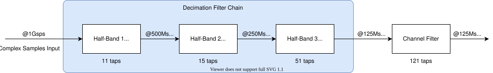

1. Open MATLAB® by typing `model_composer`. The path to the Model Composer block sets load automatically.
2. Type `setupLab`in the **MATLAB** command window to initialize the tutorial environment.

This function includes the directory ``LabUtils`` in the search path, and runs the filter coefficients initialization. The output in the MATLAB® command window is:

```
>> setupLab
HB1
  Center Tap: 16384
Phase 1 Norm: 16384
 Max Phase 1: 9647

HB2
  Center Tap: 16384
Phase 1 Norm: 16384
 Max Phase 1: 9935

HB3
  Center Tap: 16384
Phase 1 Norm: 16384
 Max Phase 1: 10373

CF
Channel Filter Norm: 32768
           Max Coef: 28004

>>
```

In the workspace sub-window, review the defined variables:

* ``hb1``, ``hb2``, ``hb3``, ``cfi``: Filter coefficients used in the Simulink® model.
* ``hb1_aie``, ``hb2_aie``, ``hb3_aie``, ``cfi_aie``: Coefficients vectors for the AI Engine design:
  * For half-band filters, each vector includes only the left-hand side non-null taps and the center tap.
  * For symmetric filters, each vector includes only the left-hand side taps, plus the center tap if the filter length is odd.
* Shift1, Shift2, Shift3, ShiftCF: The number of bits to shift results before sending to the output port.

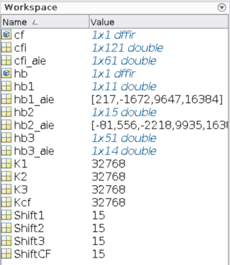

There are four additional files:

* `VMC_DSPLib_Solution_Stage1.slx`
* `VMC_DSPLib_Solution_Stage2.slx`
* `VMC_DSPLib_Solution_Stage3.slx`
* `VMC_DSPLib_Solution_Stage4.slx`

These are there to help you if you cannot complete any of the four stages.

## Stage 1: Create and Simulate the Design

1. On the MATLAB® GUI, select the **Home Tab** and click **Simulink**.

      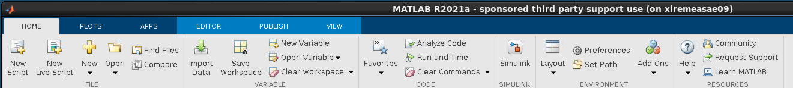

2. Select **Blank Model** to create a new canvas on which to design the Decimation Chain.

      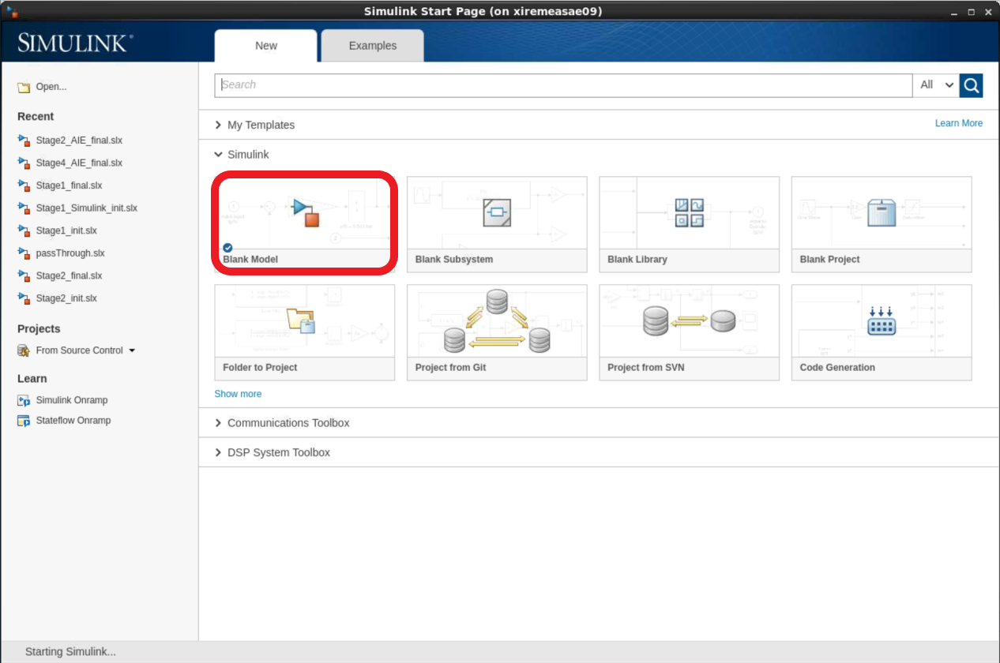

      Perform the next two steps to improve usability. Gain instant access to the initialization file and automatically call it when opening or updating the design.

3. Right-click in the canvas, and select **Model Properties**:
    * Click the **Callbacks** tab.
    * Click **PreLoadFcn**, and type `CreateFilter;` in the edit window on the right.
    * Click **InitFcn**, and type `CreateFilter;` in the edit window on the right.
    * Click **Apply** and **OK**.

      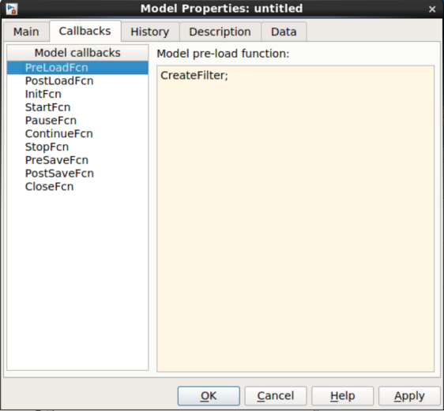

4. Click the canvas, and type `subsys`. Select the first **Subsystem** displayed in the list (Subsystem, Simulink/Ports & Subsystem).

   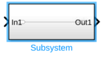

   * Double-click the subsystem, and remove all blocks inside (**CTRL-A** and **Del**).
   * Go back to the top level by clicking on the Up-arrow.

   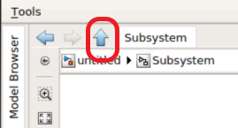

   * Right-click the **Subsystem**, and select **Properties**.
   * Click the **Callbacks** tab.
   * Select **OpenFcn** in the **Callback function list**.
   * Type `open('CreateFilter.m');` in the edit window on the right.
   * Click **Apply** and **OK**.

   Double-click this block to open the initialization MATLAB® function (`CreateFilter.m`) in the MATLAB® editor. Save the model **CTRL+S**, and assign the name **VMC_DSPLib**.

5. Click **Library Browser**.

   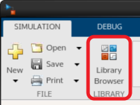

   In the list of libraries find the **AMD Toolbox**. This contains four sub-libraries:

   * AI Engine
   * HDL
   * HLS
   * Utilities

   Click the **AI Engine** section. This reveals seven subsections:

   * DSP
   * Interfaces
   * Signal Routing
   * Sinks
   * Sources
   * Tools
   * User-Defined functions

6. Click the **DSP** sub-section. There are two sub-menu entries:

   * Buffer IO: which contains filter implementations using frame-based input and output.
   * Stream IO : which contains filter implementations using streaming input and output.

7. Click the **Buffer IO** sub-section and place the **FIR Halfband Decimator** block in the canvas as shown in the following figure.

   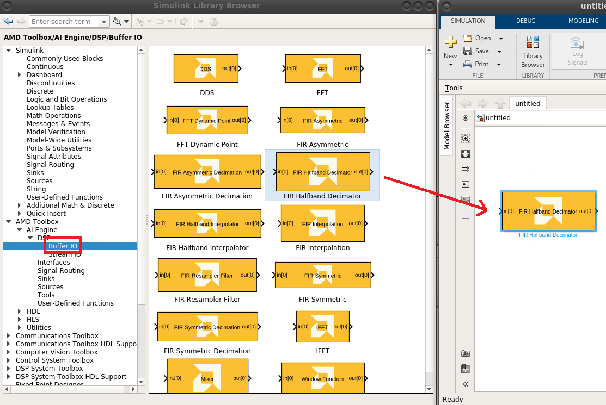

8. Double-click the **FIR Halfband Decimator** block to open the GUI. Populate the GUI with the following parameters :
    * **Input/output data type**: cint16
    * **Filter coefficients data type**: int16
    * **Filter coefficients**: hb1_aie
    * **Input Window size (Number of samples)**: 2048
    * **Scale output down by 2**: Shift1
    * **Rounding mode**: Floor
    * **Saturation mode**: 0-None

    Leave all other settings at their default values. Click **Apply** and **OK**.

   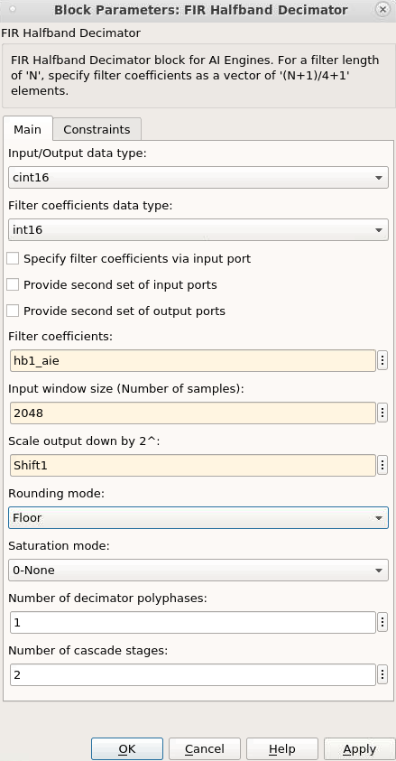

   Now create a data source to feed this filter.

9. Create the following two blocks by clicking the canvas and typing the beginning of the name of the block. Then enter the given parameters:

   |Name to Type | Block Name to Select | Parameters |
   |:--- | :--- | :--- |
   |random   | Random Source  |  Source Type: Uniform <br> Minimum: –20000  <br> Maximum: 20000  <br>  Sample time: 1   <br> Samples per frame: 2048   <br> Complexity: complex|
   |cast  | Cast  | Output data type: int16  |

10. Cascade the three blocks: **Random Source**, **Cast**, **AIE FIR Filter**.

11. The file ``ReferenceChain.slx`` contains the decimation chain using Simulink® blocks. **Open** `ReferenceChain.slx`. Copy the block **HB1** over to your design.
12. Copy the small set of blocks (**To Fixed Size**, **Subtract**, **Scope**, **Vitis Model Composer Hub**) to create the following design:

      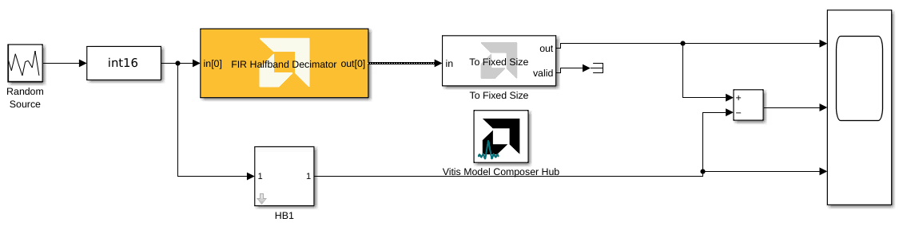

13. Ensure that the parameter **Output Size** of the block **To Fixed Size** is set to 1024.

14. Set the **Stop Time** to ``5000``, and run the design. The FIR filter is compiled and the design is run. The scope should show a completely null difference.

15. To gain more information about the signals traveling through the wires, update the following display parameters:
    * Right-click the canvas, and select **Other Displays --> Signals and Ports --> Signal Dimensions**.
    * Right-click the canvas, and select **Other Displays --> Signals and Ports --> Port Data Types**.
    * Right-click the canvas, and select **Sample Time Display --> all**.

      After updating the design with **CTRL-D**, the display should look as follows:

      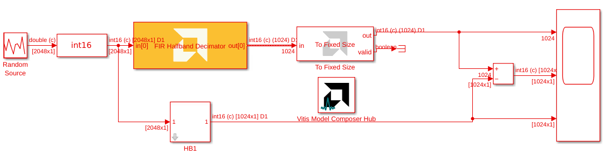

      Notice that before implementing the Decimation Filter the vector length was ``2048``, but after implementation this is reduced to ``1024``.

16. Update the design with the other three filters using the following parameters:

| **Parameter**                     | **HB1**                     | **HB2**                     | **HB3**                     | **Channel Filter**          |
|-----------------------------------|----------------------------|----------------------------|----------------------------|----------------------------|
| Filter Block                      | FIR Halfband Decimator    | FIR Halfband Decimator    | FIR Halfband Decimator    | FIR Asymmetric Filter      |
| Input/Output Data Type            | `cint16`                  | `cint16`                  | `cint16`                  | `cint16`                  |
| Filter Coefficients Data Type     | `int16`                   | `int16`                   | `int16`                   | `int16`                   |
| Filter Coefficients               | `hb1_aie`                 | `hb2_aie`                 | `hb3_aie`                 | `cfi`                     |
| Filter Length                     | N/A                       | N/A                       | N/A                       | `length(cfi)`             |
| Input Window Size (samples)       | 2048                      | 1024                      | 512                       | 256                       |
| Scale Output Down by 2^           | `Shift1`                  | `Shift2`                  | `Shift3`                  | `ShiftCF`                 |
| Rounding Mode                     | `floor`                   | `floor`                   | `floor`                   | `floor`                   |
| Saturation Mode                   | `0-None`                  | `0-None`                  | `0-None`                  | `0-None`                  |


17. Update the **Output Size** parameter of the **To Fixed Size** block to ``256``. The design should display like as follows:

      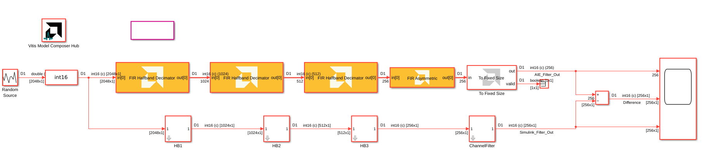

18. Run the design. The added filters are compiled, and the design is run through the 5000 samples. The difference between the two outputs should be zero.

## Stage 2: Further Analysis of the Design

When creating a DSP design, one of the most important parameters to consider is the spectrum. In Simulink®, the spectrum can be easily displayed using a spectrum scope.

1. Left-click the canvas and type ``spectrum``.
2. Connect the spectrum scope at the output of the last filter (the Channel Filter):
3. Set the Stop Time of the simulation to **inf**.

   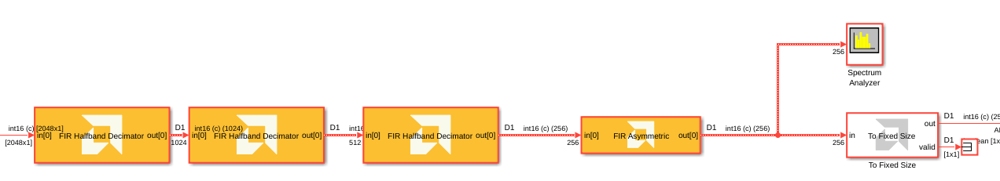

   Run the simulation. The spectrum scope should display similar to the following:

   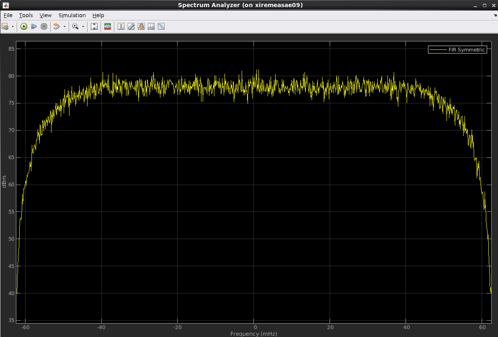


   Now add a block coming from a standard templated C++ kernel which source is in the directory ``aiecode_src``. This function is a frequency shift operation that is placed after the down sampling chain.

4. Select the block **AIE Kernel** from the **User-defined Functions** section of the AI Engine Library and place it in the canvas:

   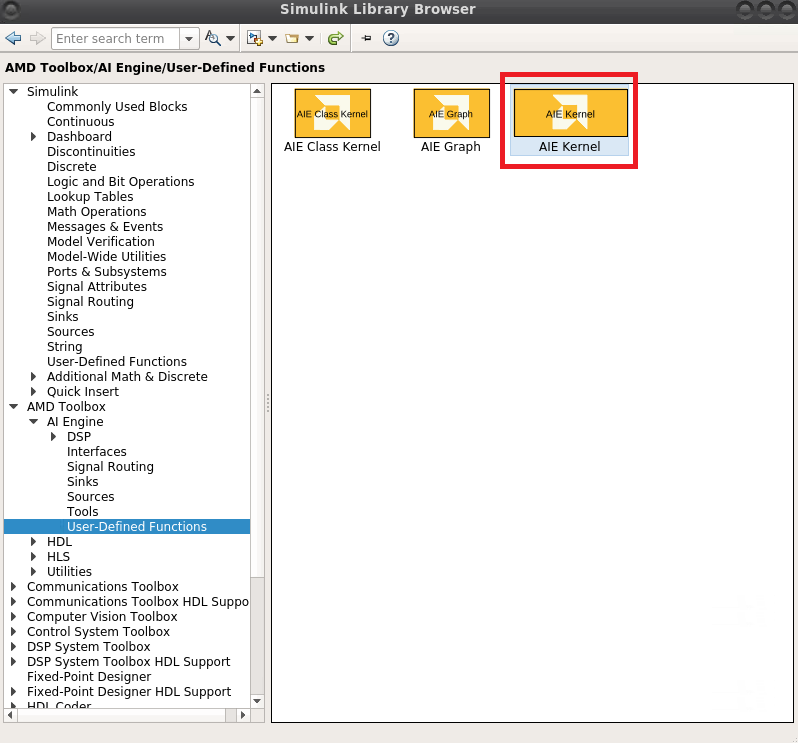

5. **Double-click** the block and populate the GUI with the following data:

   * **Kernel header file**: ``aiecode_src/FreqShift.h``
   * **Kernel function**: ``FreqShift``
   * **Kernel source file**: ``aiecode_src/FreqShift.cpp``

      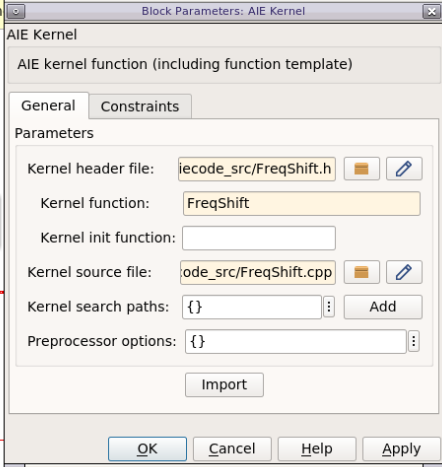

6. Click **Import**. A new GUI appears. **FRAME_LENGTH** is a template parameter, set its value to ``256``, as this is the size of the data frames at this stage. Set the window size for both the input and output ports to ``256`` samples. Then, click **OK**.

   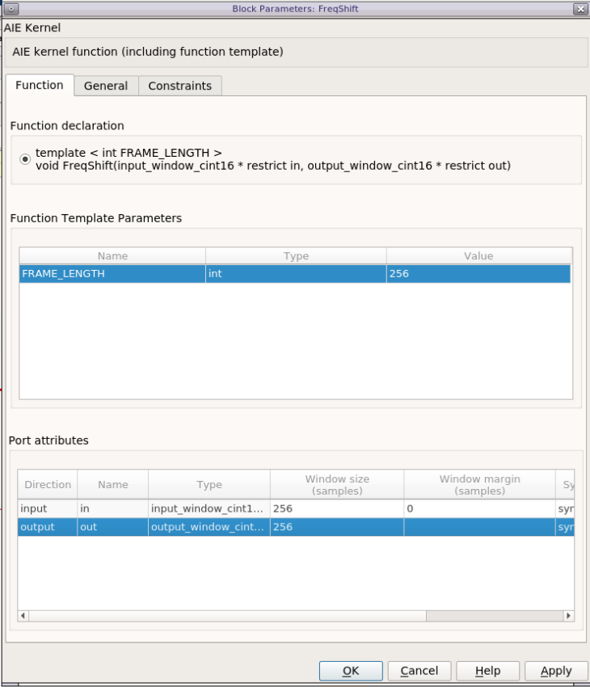

7. Place this new block between the **'FIR Asymmetric'** and **'To Fixed Size'** blocks. Grab the **'FreqShift'** block from the **Reference Chain** Simulink® design, and place it after the **ChannelFilter** Simulink® block. Your design now looks like this:

   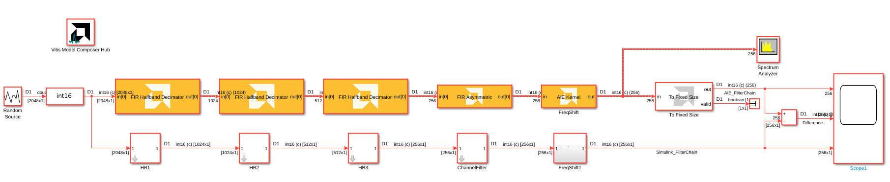

8. Click **Run**. The new filter gets compiled and a new spectrum displays:

   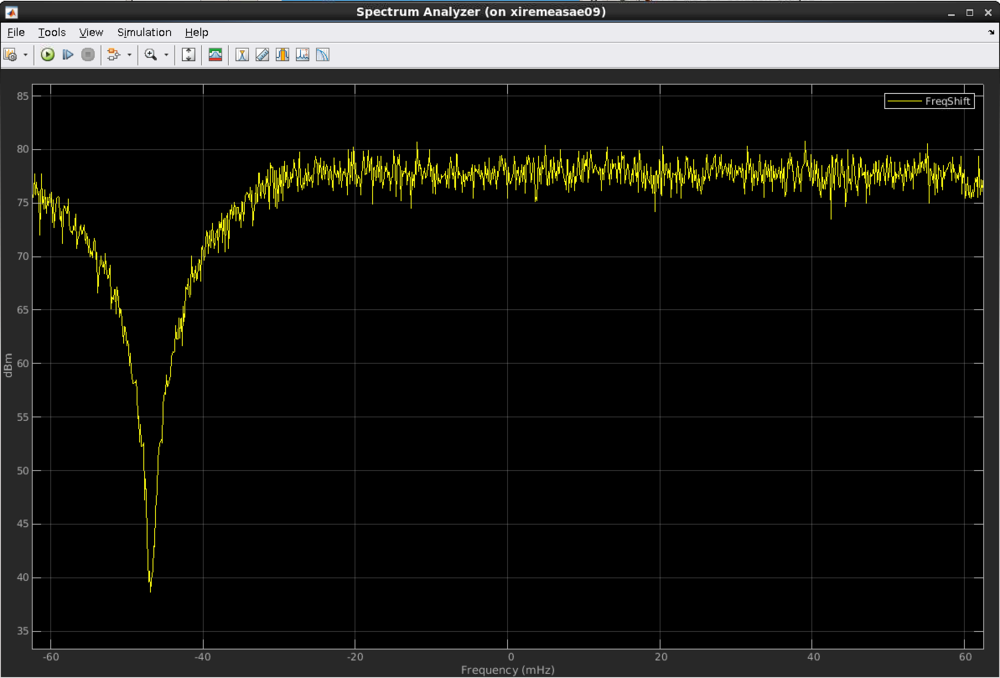

9. Switch the **Stop Time** back to ``5000`` and verify that the difference is still 0.

   Developing an AI Engine graph in Model Composer is relatively straightforward. You can place a spectrum scope at the design output or between two blocks without modifying kernels or the graph. Use Simulink® to generate test vectors, create reference models, and compare signals at any point in the design.

   Save data in a workspace variable for complex analysis using the **Variable Size Signal to Workspace** block in **AMD Toolbox --> AI Engine --> Tools  blockset**:

   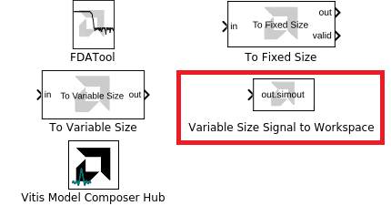

   All the simulations that occur in Simulink are the so-called 'Emulation-SW'. These types of simulation are bit-exact, but they do not provide any information about timing.

## Stage 3: Generate the Code and Perform Emulation-AI Engine

In this stage, you generate the graph code of this design and perform bit-true and cycle-approximate simulations with the AI Engine Simulator.

1. Select the four AIE FIR Filters and the Frequency shifting block, and type **CTRL+G** to group them in a subsystem. Assign a new name: **FIRchain**.
2. Double-click the block **Model Composer Hub** and select the **Code Generation** tab.
3. Select the **FIRchain** subsystem, and set the following parameters on the **Analyze** tab:
    * Check **Collect profiling statistics and enable 'printf' for debugging**.
    * Check **Collect trace data for Vitis Analyzer, view internal signals, and latency**.
4. Click **Analyze**.

Run the Simulink® design to generate the testbench. Generate and compile the graph code. View the source code in ``./code/ip/FIRchain/src/FIRchain.h``:

```C++
#ifndef __XMC_FIRCHAIN_H__
#define __XMC_FIRCHAIN_H__

#include <adf.h>
#include "./FIR_Halfband_Decimator_e52f70d5/FIR_Halfband_Decimator_e52f70d5.h"
#include "./FIR_Halfband_Decimator_5d110589/FIR_Halfband_Decimator_5d110589.h"
#include "./FIR_Halfband_Decimator_f09fd8f2/FIR_Halfband_Decimator_f09fd8f2.h"
#include "./FIR_Asymmetric_da0a14e6/FIR_Asymmetric_da0a14e6.h"
#include "aiecode_src/FreqShift.h"

class FIRchain_base : public adf::graph {
public:
   FIR_Halfband_Decimator_e52f70d5 FIR_Halfband_Decimator;
   FIR_Halfband_Decimator_5d110589 FIR_Halfband_Decimator1;
   FIR_Halfband_Decimator_f09fd8f2 FIR_Halfband_Decimator2;
   FIR_Asymmetric_da0a14e6 FIR_Asymmetric;
   adf::kernel FreqShift_0;

public:
   adf::input_port In1;
   adf::output_port Out1;

   FIRchain_base() {
      // create kernel FreqShift_0
      FreqShift_0 = adf::kernel::create(FreqShift<256>);
      adf::source(FreqShift_0) = "aiecode_src/FreqShift.cpp";

      // create kernel constraints FreqShift_0
      adf::runtime<ratio>(FreqShift_0) = 0.9;

      // create nets to specify connections
      adf::connect net0 (In1, FIR_Halfband_Decimator.in[0]);
      adf::connect net1 (FIR_Halfband_Decimator.out[0], FIR_Halfband_Decimator1.in[0]);
      adf::connect net2 (FIR_Halfband_Decimator1.out[0], FIR_Halfband_Decimator2.in[0]);
      adf::connect net3 (FIR_Halfband_Decimator2.out[0], FIR_Asymmetric.in[0]);
      adf::connect net4 (FIR_Asymmetric.out[0], FreqShift_0.in[0]);
      adf::dimensions(FreqShift_0.in[0]) = {256};
      adf::connect net5 (FreqShift_0.out[0], Out1);
      adf::dimensions(FreqShift_0.out[0]) = {256};
   }
};

class FIRchain : public adf::graph {
public:
   FIRchain_base mygraph;

public:
   adf::input_plio In1;
   adf::output_plio Out1;

   FIRchain() {
      In1 = adf::input_plio::create("In1",
            adf::plio_32_bits,
            "./data/input/In1.txt");

      Out1 = adf::output_plio::create("Out1",
            adf::plio_32_bits,
            "Out1.txt");

      adf::connect< > (In1.out[0], mygraph.In1);
      adf::connect< > (mygraph.Out1, Out1.in[0]);
   }
};

#endif // __XMC_FIRCHAIN_H__

```

Finally, the bit-exact simulation (Emulation-AIE) is performed and the result compared to the Simulink simulation:

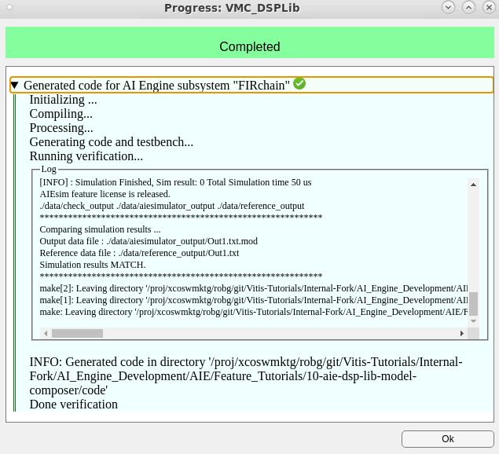

5. In the Model Composer Hub, click **Open Vitis Analyzer**.

Vitis Analyzer launches and you can view the **Graph View**, **Array View**, **Trace View**, and **Profile** information.

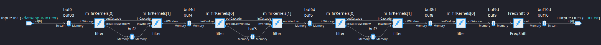

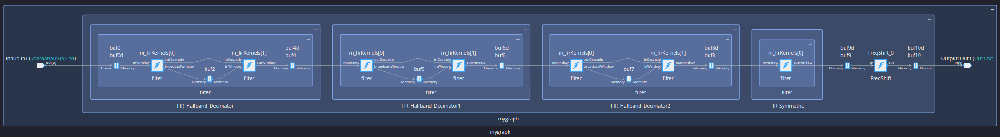

 Vitis Model Composer can also plot the output of the cycle-approximate AI Engine simulation and calculate a throughput estimate. AI Engine calculates throughput by counting the number of output data points and dividing by the time. In this example, three frames are received, but only two interframe idle time are counted. To obtain a more accurate throughput estimate, you can use data cursors to select a specific time region over which to calculate throughput:

6. In the Model Composer Hub, click **View AIE Simulation output and throughput**. The Simulation Data Inspector opens and shows the output of the AI Engine.
7. Select the `Out1` signal from the list on the left.
8. Click the drop-down of a plot icon, then select the **Two cursors** option.

   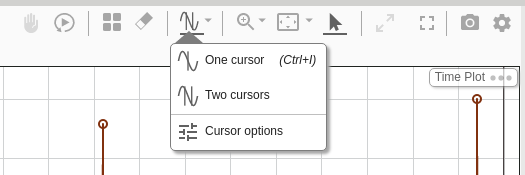

10. Position the cursors at the beginning of the first and third signal frames, as shown below. 

   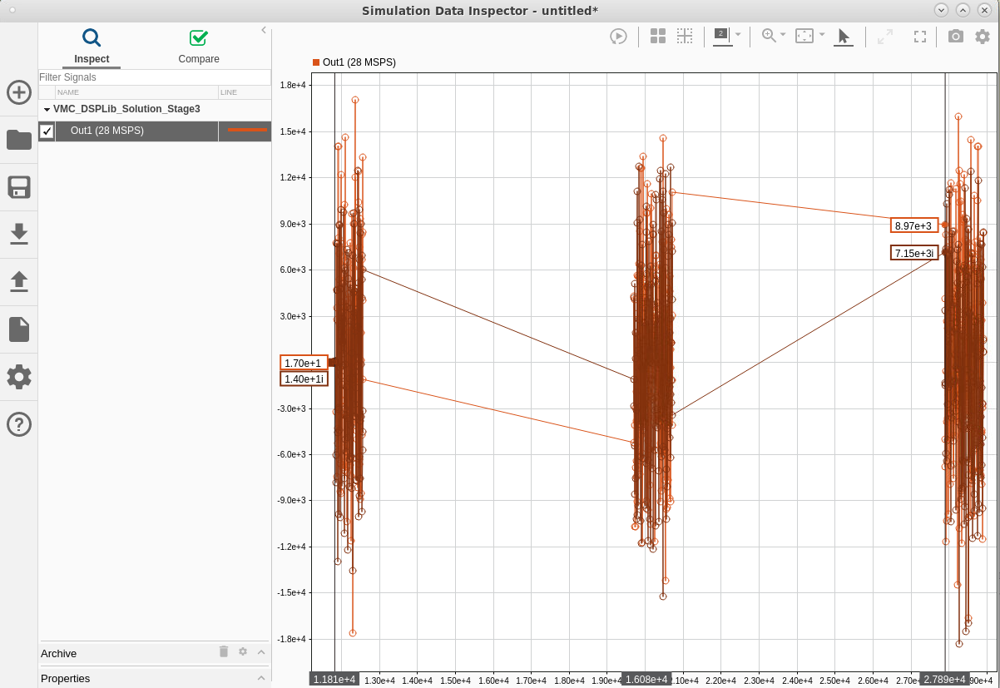

Here the estimated throughput is 28 MSPS instead of the expected 125 MSPS. You can use Vitis Analyzer to track the reason of this throughput reduction. The input stream feeds the data at 250 MSPS instead of the 1000 MSPS specified in the design. This occurs because the input bitwidth is 32 bits at a rate of 250 MHz by default. Confirm this setting at the end of the `FIRchain.h` file.

## Stage 4: Increasing the PLIO Bitwidth and Re-generate

To solve this problem navigate inside the **FIRchain** sub-system. Get the **PLIO** block from **AMD Toolbox / AI Engine / Interface**, or type **plio** in the canvas. Double-click the new block and specify:

* **PLIO width (bits)**: 128
* Check **Specify PLIO frequency**
* **PLIO frequency (MHz)** : 250

Click **OK**. Place the block just after the input port, and a copy of this block just before the output port:

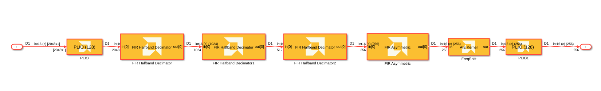

Re-open the **Model Composer Hub** block, and click **Analyze** to re-compile and re-simulate the design.

After the AI Engine simulation, the estimated throughput is 126 MSPS. This is computed from the following timestamped (green) output data, calculated for two full frame periods:

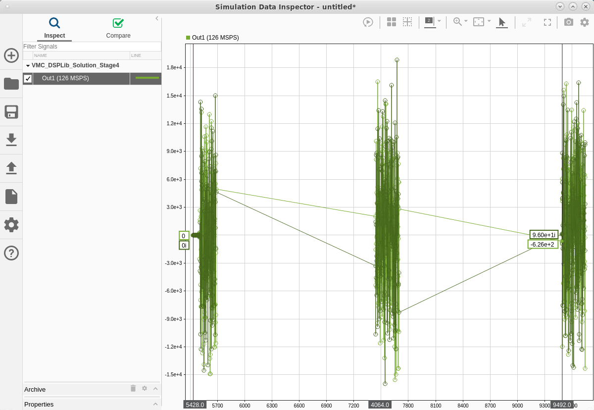

This gives around 125 MSPS which is 1/8th of the input sample rate (1 GSPS). This means that the design meets specification.

## Conclusion

Model Composer is an efficient way to create graphs either using your own kernels or using the DSPLib FIR Filter (other blocks are available in subsequent releases).

This tool shows its incredible flexibility when it comes to display spectrum or save data at any stage of the graph. You can use all the source and sink blocks anywhere, allowing you to efficiently debug your design in all corner cases.

<p class="sphinxhide" align="center"><sub>Copyright © 2020–2026 Advanced Micro Devices, Inc.</sub></p>

<p class="sphinxhide" align="center"><sup><a href="https://www.amd.com/en/corporate/copyright">Terms and Conditions</a></sup></p>
