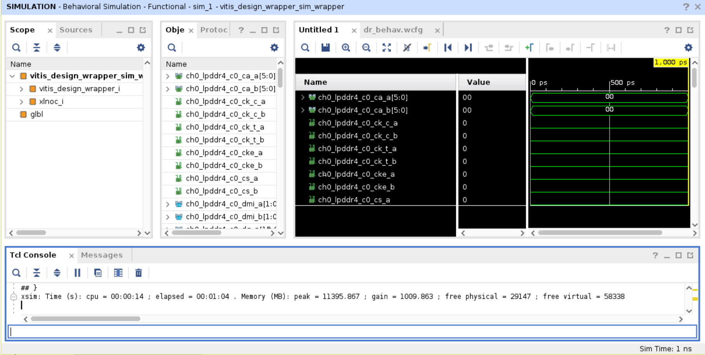
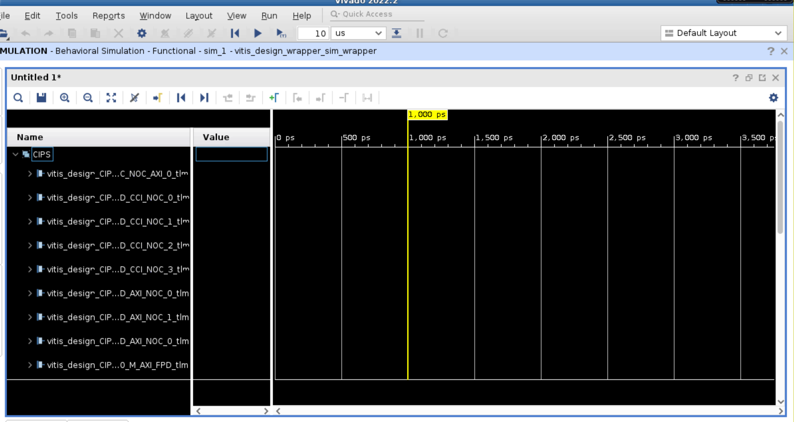
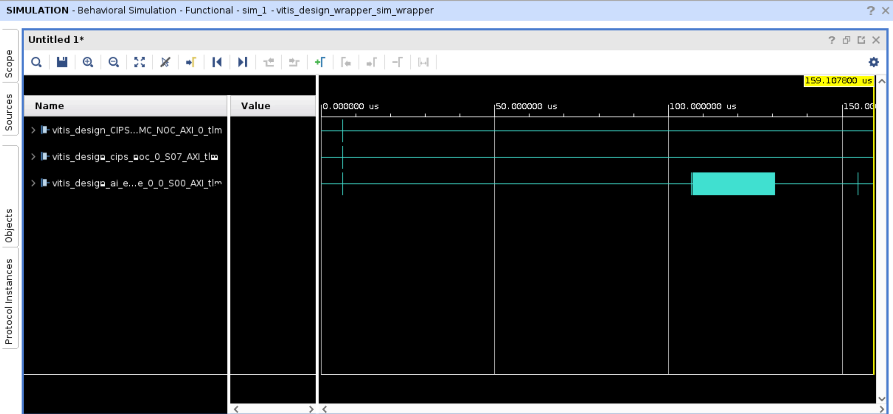
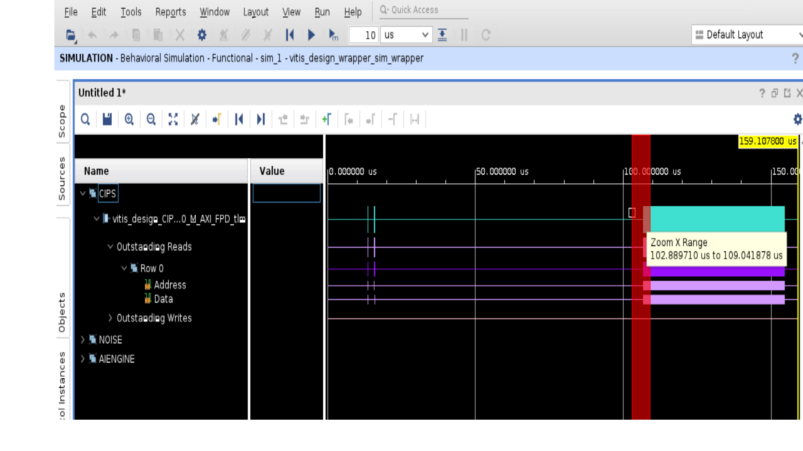
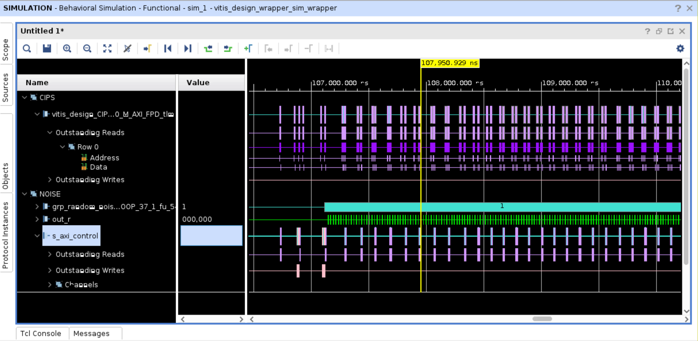
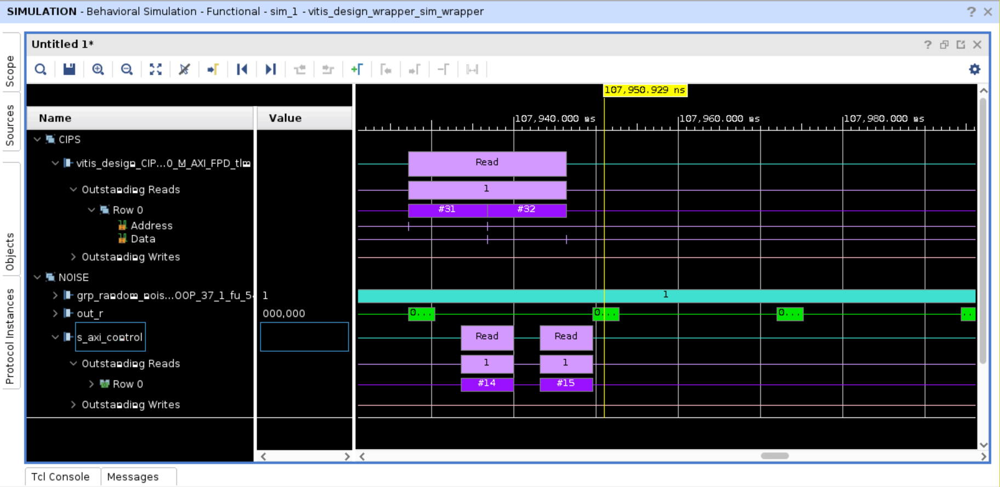
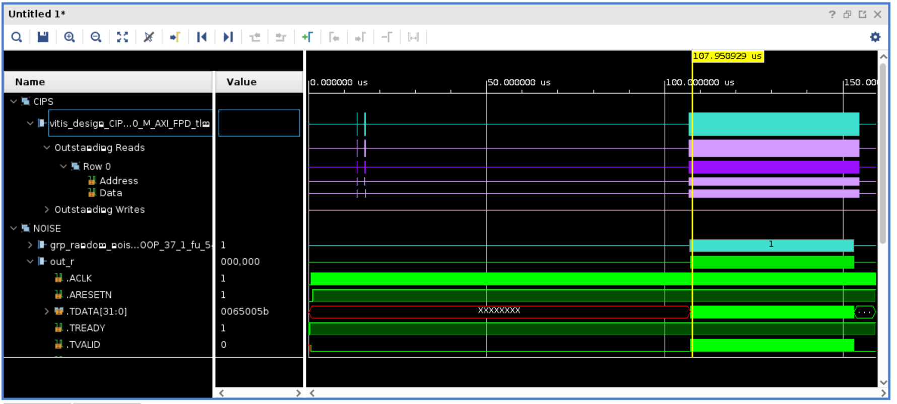
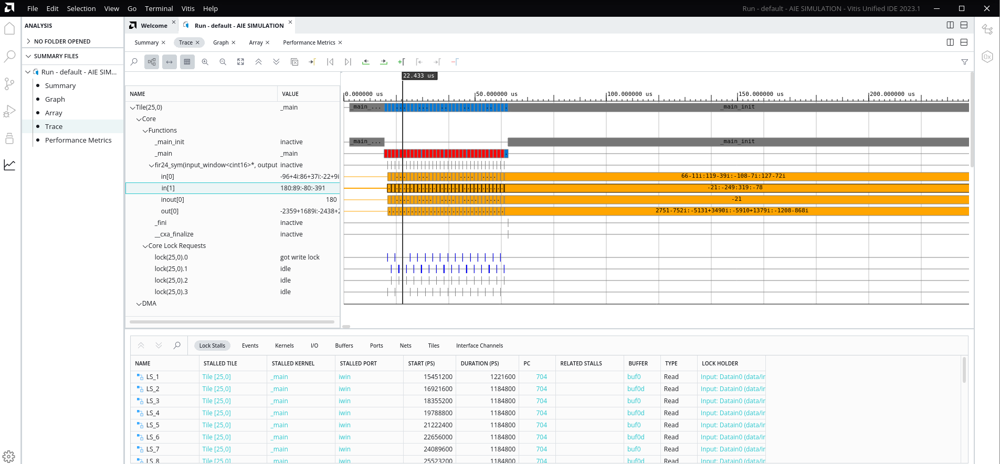
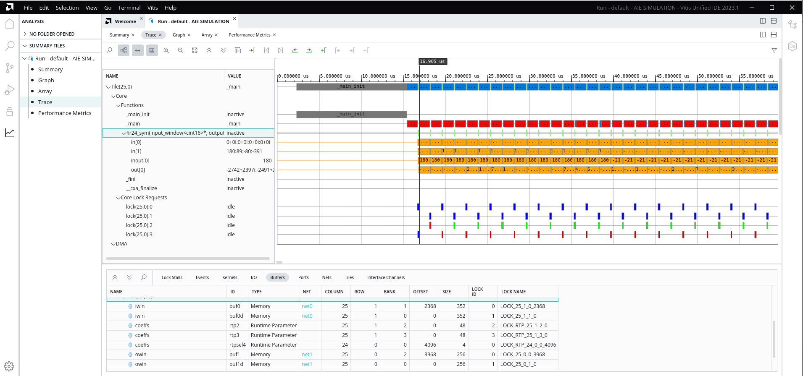

<table class="sphinxhide" width="100%">
 <tr width="100%">
    <td align="center"><h1>AI Engine Development</h1>
    <a href="https://www.xilinx.com/products/design-tools/vitis.html">See Vitis™ Development Environment on xilinx.com</br></a>
    <a href="https://www.xilinx.com/products/design-tools/vitis/vitis-ai.html">See Vitis™ AI Development Environment on xilinx.com</a>
    </td>
 </tr>
</table>

# Versal Emulation Waveform Analysis

***Version: Vitis 2023.1***

## Introduction

Simulating a complete system in the Vitis unified software platform allows for a near-hardware run of a design without the hardware and has the added benefit of detailed waveform analysis during hardware emulation to identify issues in the programmable logic (PL), AI Engine interfaces, and memory read/writes that might be harder to debug on hardware.

This tutorial demonstrates how you can use the AMD Vivado™ Design Suite logic simulator (XSIM) waveform GUI, and the Vitis analyzer to debug and analyze your design for an AMD Versal™ adaptive SoC. It steps through the process of building a design for hardware emulation, launching emulation with waveform viewing, and detailed information on how to read the waveforms, as well as using the Vitis analyzer to continue the analysis with generated trace output waveforms and data.

It is strongly recommended to go through the **Versal Integration tutorial** and the **Versal System Design Clocking tutorial** before running this tutorial.

**IMPORTANT**: Before beginning the tutorial, make sure you have installed the Vitis 2023.1 software. The Vitis release includes all the embedded base platforms including the VCK190 base platform that is used in this tutorial. In addition, ensure you have downloaded the Common Images for Embedded Vitis Platforms from this link: <https://www.xilinx.com/support/download/index.html/content/xilinx/en/downloadNav/embedded-platforms/2023-1.html> The common image package contains a prebuilt Linux kernel and root file system that can be used with the Versal board for embedded design development using Vitis.

Before starting this tutorial run the following steps:

1. Go to the directory where you have unzipped the Versal Common Image package.
2. In a Bash shell run the `/Common Images Dir/xilinx-versal-common-v2023.1/environment-setup-cortexa72-cortexa53-xilinx-linux` script. This script sets up the `SDKTARGETSYSROOT` and `CXX` variables. If the script is not present, you must run the `/Common Images Dir/xilinx-versal-common-v2023.1/sdk.sh`.
3. Set up your `ROOTFS` and `IMAGE` to point to the `rootfs.ext4` and `Image` files located in the `/Common Images Dir/xilinx-versal-common-v2023.1` directory.
4. Set up your `PLATFORM_REPO_PATHS` environment variable to `$XILINX_VITIS/lin64/Vitis/2023.1/base_platforms/`.

This tutorial targets VCK190 production board for 2023.1 version.

## Objectives

After completing this tutorial you should be able to:

* Use XSIM as a live waveform viewer to view signals to and from the AI Engine including stream data and run-time parameters (RTP).
* Read/understand Transaction Level Modeling (TLM) information in a waveform.
* Use the Vitis analyzer to read trace and profile data.

## Tutorial Overview

### Design Overview

The design is a simple FIR filter that takes in random noise generated by the PL kernel, `random_noise`, and gets asynchronous RTP updates to the AI Engine to update the FIR filter coefficients. To confirm the coefficients are applied, the host code reads back the coefficients.


## Transaction Level Modeling

Transaction level modeling (TLM) models Control Interfaces and Processing Systems (CIPS), Network on Chip (NoC), and AI Engine blocks, using SystemC, to show transaction-level communication in the waveform. It is cycle-approximate modeling. It can provide high-level information such as the address and data of the transactions to/from DDR memory or a specific PL kernel.

In the following diagram, the CIPS, NoC, and AI Engine are modeled in SystemC.


## Steps

**Step 1**: Building the Design

**Step 2**: Launching Emulation with the XSIM Waveform GUI

**Step 3**: Using XSIM Waveform GUI and [QEMU](https://docs.xilinx.com/r/en-US/ug1393-vitis-application-acceleration/QEMU)

**Step 4**: Using Vitis Analyzer

### Step 1: Build Design

1. To build the design run the following commands.

     ```bash
     make aie
     ```

2. After the ADF graph is compiled, run the AI Engine simulator (`aiesimulator`) to get additional profile data. This ensures the design is simulating correctly and generates extra profile information for performance analysis and optimizing the kernels.

    To run the simulator, run the following commands.

     ```bash
     make aiesim
     ```

   After running emulation a new directory, `aiesimulator_output`, is created and inside this directory, there is a file called `aiesim-options.txt`.

3. Open the `aiesim-options.txt` and you should see content similar to the following.

     ```
     AIE_PKG_DIR=/path/to/<tutorial>/./Work
     AIE_DUMP_VCD=tutorial
     AIE_PROFILE=All
     ```

4. Close the text file.

    **NOTE**: To view all the `aiesim_option.txt` values, see [Reusing AI Engine Simulator Options](https://docs.xilinx.com/r/en-US/ug1076-ai-engine-environment/Reusing-AI-Engine-Simulator-Options).

5. Run the rest of the build process using the following commands.

    ```bash
    make kernels
    make xsa
    make host
    make package
    ```

### Step 2: Launching Emulation with XSIM Waveform GUI

After the building and packaging of the design is complete, you can run hardware emulation on your design. Ensure that `launch_hw_emu.sh` is in the `sw` directory.

1. To launch emulation with the XSIM Waveform GUI, run the following command.

    ```bash
    ./launch_hw_emu.sh -g -aie-sim-options ../aiesimulator_output/aiesim_options.txt
    ```

    OR

    ```bash
    make run_emu
    ```

    OR

   You can include more options during emulation launch to see transactions logs:

   To see all the transactions generated by PS (QEMU) to either PL/AIE, set the `env` variable `ENABLE_RP_LOGS=true`.
   You can see the logs at `sim/behav_waveform/xsim/rp_log.txt`. 
   
   **NOTE:** The PS to DDR transactions cannot be seen here as QEMU has a backdoor direct connection into DDR buffer.

   To capture AIE transaction logs generated at runtime, set the `env` variable `ENABLE_AIE_DBG_TRACE`. You can see the logs created in the folder `aie_log/` e.g., `sw/sim/behav_waveform/xsim/aie_log/S00_AXI.log` file.
   This helps to debug the AIE systemC models only and contains transaction information per interface at each simulation cycle.

   At launch emulation, you can pass `-xtlm-aximm-log` switch. This logs all the transactions generated from CIPS to AIE or PL that is captured
   in `xsc_report.log file` e.g., `sw/sim/behav_waveform/xsim/xsc_report.log`.

    ```bash
    ./launch_hw_emu.sh -g -aie-sim-options ../aiesimulator_output/aiesim_options.txt -xtlm-aximm-log
    ```

    The terminal shows the following.

    ```log
    Starting QEMU
    - Press <Ctrl-a h> for help
    Waiting for QEMU to start.
    running directly on console
    QEMU started. qemu_pid=3208
    Waiting for PMU to start.
    qemu-system-aarch64: -chardev socket,path=./qemu-rport-_pmc@0,server,id=ps-pmc-rp: info: QEMU waiting for connection on: disconnected:unix:./qemu-rport-_pmc@0,server
    PMC started. pmc_pid=3243
    qemu-system-aarch64: -chardev socket,id=pl-rp,host=127.0.0.1,port=7043,server: info: QEMU waiting for connection on: disconnected:tcp:127.0.0.1:7043,server
    XSIM started. xsim_pid=3300
    ```

    This shows QEMU starting and launching XSIM. The QEMU and XSIM are linked together, meaning closing one closes the other. The use of the `-g` flag opens up the XSIM Waveform GUI as shown in the following image with two config files (`.wcfg` and `Untitled1`).

    

    You can keep any of the one file (preferably close `.wcfg` file) to continue adding signals or creating wave groups for waveform analysis.

    

    In this view, you can select the signals you want to watch from the **Scope** and **Objects** views.

2. In the **Tcl Console**, at the bottom of the view, run the following command.

    ```Tcl
    source ../../../../tcl/add_waveforms.tcl
    ```

    The `add_waveforms.tcl` file removes any default signals provided by the simulation environment, and adds in all the signals you want to view. There are some signals that are important to have such as: NoC, DDR memory, PL Kernel, and CIPS signals. Your design interacts with these components, and being able to trace signal changes from CIPS to the NoC to/from DDR memory, and then to your design can prove helpful in debugging any potential issue with data transfers.
    This file contains the following.

    ```Tcl
    ## Remove all waveforms before adding new ones
    remove_wave -of [get_wave_config] [get_waves -of [get_wave_config] -regexp ".*"]

    ## Set the appropriate paths based upon the platform being used
    set scope_path "/vitis_design_wrapper_sim_wrapper/vitis_design_wrapper_i/vitis_design_i"

    ## Create a wave group called CIPS and add all signals for the CIPS_0 to it
    set CIPS [add_wave_group CIPS]
    set cips_intf [get_objects -r $scope_path/CIPS_0/* -filter {type==proto_inst}]
    add_wave -into $CIPS $cips_intf

    ## Create a wave group called NOISE and add all signals of the random_noise_1 to it
    set NOISE [add_wave_group NOISE]
    set noise_intf [get_objects -r $scope_path/random_noise_1/* -filter {type==proto_inst}]
    add_wave -into $NOISE $noise_intf

    ## Create a wave group called S2MM and add all signals of the S2MM kernel to it
    set S2MM [add_wave_group S2MM]
    set s2mm_intf [get_objects -r $scope_path/s2mm_1/* -filter {type==proto_inst}]
    add_wave -into $S2MM $s2mm_intf

    ## Create a wave group called CIPS_NOC and all signals of the CIPS NoC to it
    set CIPS_NOC [add_wave_group CIPS_NOC]
    set cips_intf [get_objects -r $scope_path/cips_noc/* -filter {type==proto_inst}]
    add_wave -into $CIPS_NOC $cips_intf

    ## Create a wave group called DDR4 and all signals to/from DDR4
    set DDR4 [add_wave_group DDR4]
    set ddr4_intf [get_objects -r $scope_path/noc_ddr4/* -filter {type==proto_inst}]
    add_wave -into $DDR4 $ddr4_intf

    ## Create a wave group called AIENGINE and all signals of the AI Engine block to it
    set AIENGINE [add_wave_group AIENGINE]
    set aie_intf [get_objects -r $scope_path/ai_engine_0/* -filter {type==proto_inst}]
    add_wave -into $AIENGINE $aie_intf
    ```

    **NOTE**: This file can be executed automatically from the `launch_hw_emu.sh` command by using the `-user-pre-sim-script add_waveforms.tcl`.

    **IMPORTANT**: Add all the signals you need before starting emulation. If after starting emulation, you pause it, and add more signals, there will not be any data for the new signals.

    You will see a waveform view as shown in the following figure.

    

3. Expand the all signal groups in the view to get the following view.

    

4. The tutorial design runs very fast, and you will not be able to see anything meaningful on this small scale.

     Adjust the scale to 100 us.

    

    **TIP**: The scale can be adjusted when emulation is running to fit your needs.

**NOTE**: For more information about this simulator view and how to use it, see the [UG900 Vivado Design Suite User Guide: Logic Simulation](https://docs.xilinx.com/r/en-US/ug900-vivado-logic-simulation).

### Step 3: Using XSIM Waveform GUI and QEMU

A great benefit of having a waveform viewer showing live data is so you can see how the signals interact with each other. This includes the programming of the AI Engine and device traffic to/from the DDR memory, traffic to/from the PL kernels, as well as seeing RTP data being written to the AI Engine.

1. Click the **Run All** button ().

2. Click back to the terminal where `./launch_hw_emu.sh` was launched. The QEMU instance has begun booting and when you see the following messages QEMU has finished launching.

    ```text
    versal-rootfs-common-20222 login: root (automatic login)

	petalinux
	[   53.752390] audit: type=1006 audit(1666762798.812:2): pid=585 uid=0 old-auid=4294967295 auid=0 tty=(none) old-ses=4294967295 ses=1 res=1
	[   53.753038] audit: type=1300 audit(1666762798.812:2): arch=c00000b7 syscall=64 success=yes exit=1 a0=8 a1=ffffc55ea440 a2=1 a3=ffff94b186b0 items=0 ppid=1 pid=585 auid=0 uid=0 gid=0 euid=0 suid=0 fsuid=0 egid=0 sgid=0 fsgid=0 tty=(none) ses=1 comm="(systemd)" exe="/lib/systemd/systemd" key=(null)
	[   53.753819] audit: type=1327 audit(1666762798.812:2): proctitle="(systemd)"
                                                                                                                                   	 ^root@versal-rootfs-common-20222:~# mount /dev/mmcblk0p1 /mnt
	root@versal-rootfs-common-20222:~# cd /mnt
	root@versal-rootfs-common-20222:/mnt#  ls
	BOOT.BIN          a.xclbin          data              host.exe
	Image             boot.scr          embedded_exec.sh
    ```

3. Hit **Enter** a few times to clear these messages, and you should see this prompt.

   Type in the following commands to launch the tutorial application.

    ```bash
    ./host.exe a.xclbin
    ```

    **NOTE**: This might take some time to complete because hardware emulation is collecting profiling data as well as value change dump (VCD) data.

4. Navigate back to the XSIM Waveform GUI and notice that signals are toggling. Scroll up and down to see all the signals that are starting to display data.

5. Pause the execution of the design when you see all signals in the view stop toggling.

#### Exploring the Waveforms

One of the things the waveform viewer can help with is figuring out the order in which data is transferred from a source to a destination. In the following sections, you can see how to explore the various waveforms specific to certain communication/data transfer.

**NOTE**: If AI Engine kernels contain `printf` statements, the output will show up in the XSIM Waveform GUI in the **Tcl Console** and will be written to the `simulate.log` file after emulation is closed.

##### Checking Proper Boot-up Using PMC

The first key step to ensure emulation is operating correctly is making sure that the PS is able to program the platform management controller (PMC). This system is responsible for booting and configuring the device. Seeing the signal through the CIPS, NoC, and the AI Engine is a sign that things are operating normally.

1. To see this signal only, run the following Tcl script.

    ```tcl
    source ../../../../tcl/bootup_signals.tcl
    ```

    

2. Zoom in to the first transactions by clicking and dragging the mouse from the upper left to the bottom right. You should see similar to the following.

    

    Expand these signals, and notice that the NoC and the CIPS signals are all matched. This is showing that the CIPS is transferring configuration information to the PMC. These signals are TLM signals because the blocks of the device they are targeting are modeled in SystemC. In this view, a wide colored block might not be one transaction (because it is a ***us*** timescale), so zoom in, and notice there are more transactions occurring in a short amount of time.

    Looking at the last interface, ***vitis_design_ai_engine_0_0_S00_AXI_tlm***, the majority of the transactions are writes, and are configuring the AI Engine to the graph created in **Step 1**. These writes are specific to the Configuration Data Objects (CDO) that are commands that are passed to the PLM to configure the device, and in this interface, the AI Engine.

3. Zoom the window to full by clicking the mouse on the lower right side, and drag to the upper left.

#### Transactions Generated by PS (QEMU) to PL/AIE

You can view the logs at : `sim/behav_waveform/xsim/rp_log.txt`. PS to DDR transactions cannot be seen here as QEMU has a backdoor direct connection into DDR buffer.

##### PL to AI Engine

After bootup and the device is configured, the application can begin to run. In this design, there is a PL kernel called `random noise` that is generating data that is being fed directly into the AI Engine. The key here is looking at the `s_axi_control` interface to see when the PS sends the `run` signal.

1. To view the specific signals controlling the PL kernel, run the following command.

    ```tcl
    source ../../../../tcl/pl_to_aie.tcl
    ```

2. Expand the **CIPS** group down to the **Row 0**. Zoom into a specific region. In the following screenshot, the red area is the zoom region.

    

    After the zoom in, you should see something similar to the following.

    

    Here you can see the PS is using the Full Power Domain (FPD) interface to send the AXI signal to turn on. Notice that there are two blocks shown. This is the PS telling the `random_noise` and `s2mm` kernels to start running.

    If you zoom in more, you can see more specifics of the transactions.

    

    Notice that the `s_axi_control` has a read transaction slightly after the second transaction has started of the ***FPD*** interface.

3. Expand the **vitis_design_CIPS_0_0_M_AXI_FPD_tlm** interface and the **Outstanding Reads**, and you will see a **Row 0**. If you move the mouse over the **#3** or **#4**, a context help menu shows you some signal information on where data is being transfered. Notice the `ARADDR` value of `0xa4060000` for **#3** and `0xa4050000` for **#4**, and understand that this is the address to the PL kernels that the Vitis linker auto-assigns it during linking. From the host code, you can determine that these kernels are activated before the AI Engine, soon after the application starts, so it is safe to say these signals are used to start them. Do remember that these kernels are simpler than others; more complex kernels will result in different transactions.

4. Zoom to fit by clicking the **Zoom Fit** button (). Expand the ***NOISE*** group and expand ***Out_r***.

    

5. Notice after the `random_noise` kernel starts, you see the large green line. This is a series of many transactions of the PL kernel transferring data to the AI Engine. There are a few red sections in the waveform. This is a link stall, or where the kernel has been stalled and is caused by the AI Engine.

6. Zoom to fit by clicking the **Zoom Fit** button.

##### AI Engine RTP Signals

As mentioned in the **Overview**, this design is sending RTP values to the AI Engine through the `graph.update()` host application. From the host code, you can see that there are two updates being done, both with an array size of 12. Because these only apply to the AI Engine kernel, these will write signals to the `AIENGINE/S00_AXI` interface. However, there are other signals that show the same values because these are the interfaces the data traverses to the destination.

1. Run the following Tcl script to see only the AI Engine signal.

    ```tcl
    source ../../../../tcl/rtp_signals.tcl
    ```

2. Expand the **AIENGINE** group, **vitis_design_ai_engine_0_0_S00_AXI** interface, and expand the **Outstanding Writes**. You will see some write transactions; go to the second visible instance shown in the following figure.

    

3. Zoom into the transaction of writes until you can see something similar to the following screenshot.  

    

    **NOTE**: Depending on the time the host application runs, you will not see the exact same times.

    Here you can see that there are 12 writes that are being sent to the AI Engine, which are the RTP coefficients that are to be updated in the design.

    Expand **Row 0**, and hover the mouse over **#262** where it says **Data**. You will see a pop-up as shown in the following figure.

    

    You can see that there is data presented here. It is in the radix of hexidecimal, and reads `0xB4`. Converting this to decimal is `180`, which is the first coefficent in the area for updates.

    **TIP**: There are two RTP updates occurring. If you follow the same write signal, you will find the write transactions for the second update.

4. Click the **Zoom to Fit** button.

##### AI Engine to PL to DDR Memory

After the RTP update has been sent, you can start to see output data being written to DDR memory. In this design, the AI Engine is sending data from the `S00_AXIS` interface and getting it to the `s2mm` kernel. This kernel is a FIFO written in HLS and is used to write the output to DDR memory.

1. To view these signals run the following command.

    ```tcl
    source ../../../../tcl/aie_to_ddr.tcl
    ```

    You should see something similar to the following figure.

    

    As you can see, the transactions in green are slightly ahead of the tan. This means those signals are going first. The data path is the AI Engine kernel, to the interface tile, then to the **AIENGINE/M00_AXIS** interface. Notice how **AIENGINE/M00_AXIS** and **S2MM/s** interfaces are matched, meaning they are connected together. The same applies to the **S2MM/m_axi_gmem** and the **DDR4/S00_AXI** interfaces on the **noc_ddr4** IP.

    After the data is stored into DDR memory, the host application can then access it.

2. Expand the **CIPS_NOC** group. The last transactions on the **cips_noc_0_M00_AXI_tlm** and the **cips_noc_0_S00_AXI_tlm** interfaces as shown in the following screenshot. This is the host application reading the data that was stored by the `s2mm` kernel.

    

    Zoom in and you should see the following.

    

3. When emulation is finished, close the XSIM GUI, which closes the QEMU and the emulation. Discard the waveform at the pop-up prompt.
4. Navigate back to the terminal that launched emulation.

##### Limitations

Note the following limitations of the waveform viewer.

* Signals internal to the AI Engine can be viewed using VCD. They are not integrated in the general XSIM Waveform GUI.
* CIPS, (QEMU model) which executes the software program, is purely a functional model with no timing accuracy. The NoC, DDR memory, and AI Engine are cycle-approximate models.
* Bandwidth and latency estimation are approximate, based on the accuracy of the individual IP models.

### Step 4: Using Vitis Analyzer

After emulation is complete, you can look at the profiling and VCD trace data that was also generated at the same time. If profiling and VCD signal features are not used, emulation runs faster.

Using the XSIM Waveform GUI to view waveforms is powerful in allowing you to see the data path and flow of the design, as well as debug potential issues like a hang. However, this will only show the PL side of the system. To investigate the AI Engine signals, you need to use the VCD trace in the Vitis analyzer. To use the Vitis analyzer, open up a `.aierun_summary` file.

1. Open the run summary of the design by running the following command.

   ```bash
   vitis_analyzer sw/sim/behav_waveform/xsim/default.aierun_summary &
   ```

    When the summary is open, you should see something similar to the following.

    

2. Here you can see various reports: **Summary**, **Trace**, **Profile**, **Graph**, **Array**. Click on **Trace** to open up the VCD data that was collected during hardware emulation.

    

    You can see the inner traces of the graph through a tile hierarchy. Selecting a net, tile, function, or any object in this view will cross-select to various views. This can help with identifying specific nets and functions.

3. Open the **Graph** view, and click on the **Buffers** tab.
4. To find the RTP buffers, click on the search button (), and type in `coeffs`.

    You should see a window like the following.

    

5. Select the three `coeffs` buffers, and click the **Trace** view again. See that the lock signals are highlighted.

    

6. If you scroll up, you can see that the FIR filter kernel begins to process data soon after the RTP is read.

    

7. Open up the **Profile** report, and see specific information about the kernel and the tile it is placed in.

    

8. Click on **Total Function Time**, and see the following:

    

    This information is useful because it helps determine how long the kernel runs and can be used with the **Trace** to help determine if kernels are running optimally, or if there are stalls.

9. You can analyze the AIE status and profile in HW emulation same as that of Hardware. The AIE status can be prior analyzed during HW emulation in Vitis Analyzer for debug purposes.
  The `xrt.ini` on PS should have the following entries and must be packaged in v++ package flow before launching emulation.
  
    ```bash
    aie_profile=true
    aie_status=true
    ```

As a result, two files: `aie_status_edge.json` and `aieshim_status_edge.json` will be generated. These files can be copied back from embedded linux file system into the host machine and then loaded into Vitis Analyzer.

The AI Engine status is copied to the following files when the host program is running:

* `xrt.run_summary`: Run summary that contains list of files information that can be used by Vitis Analyzer.
* `aie_status_edge.json`: Status of AI Engine and AI Engine memory.
* `aieshim_status_edge.json`: AI Engine interface tiles status.

For more details, see [Analyzing AI Engine Status in Hardware Emulation](https://docs.xilinx.com/r/en-US/ug1076-ai-engine-environment/Analyzing-AI-Engine-Status-in-Hardware-Emulation). 

10. Close the Vitis analyzer.

## Summary

In this tutorial you have learned:

* To read the waveform viewer to follow data flow pathing for a simple Versal adaptive SoC design.
* To add/remove signals to the XSIM viewer to look at specific signals such as, NoC, DDR memory, PS, AI Engine.
* View TLM signals and how they interact with the AI Engine and Versal adaptive SoC blocks.
* Open and view Trace and Profile information in Vitis Analyzer.

<p class="sphinxhide" align="center"><sub>Copyright © 2020–2023 Advanced Micro Devices, Inc</sub></p>

<p class="sphinxhide" align="center"><sup><a href="https://www.amd.com/en/corporate/copyright">Terms and Conditions</a></sup></p>
