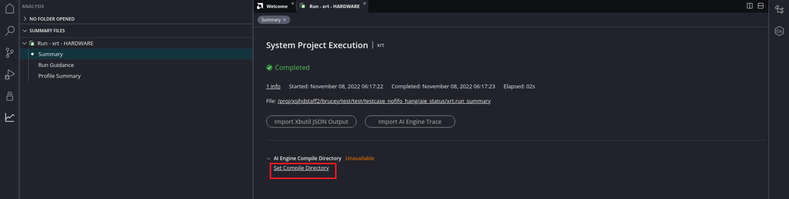
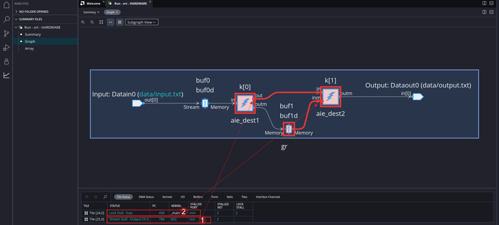

</table>
<table class="sphinxhide" width="100%">
 <tr width="100%">
    <td align="center"><h1>AI Engine Development</h1>
    <a href="https://www.xilinx.com/products/design-tools/vitis.html">See Vitis™ Development Environment on xilinx.com</br></a>
    <a href="https://www.xilinx.com/products/design-tools/vitis/vitis-ai.html">See Vitis™ AI Development Environment on xilinx.com</a>
    </td>
 </tr>
</table>

# AI Engine Status Analysis

***Version: Vitis 2023.1***

This tutorial shows you how to output a summary of the AI Engine status for further analysis in an AMD Vitis&trade; Analyzer. The main methods to output AI Engine status are as follows:

- **Automated and periodic AI Engine status output:** After initial setup in `xrt.ini`, this method requires minimal user intervention because the tool outputs the status at specified time intervals.

- **Manual output the AI Engine status:** This method requires that you run a command each time you want a status output report.

You can then open the status output in Vitis Analyzer for further analysis.

**Note:** The default working directory in this step is `testcase_nofifo_hang`, unless explicitly stated otherwise.

**Note:** The description here is based on the hardware flow. The methods decribed in this tutorial also apply for the hardware emulation flow.

## Setting Up and Running the Design

1. Change the directory to `testcase_nofifo_hang`. 
2. Modify the host code (`sw/host.cpp`) to call `gr.end();`, which causes the design to hang forever. 
3. Build the hardware package. See the example commands below:

	```
	cd testcase_nofifo_hang
	sed -i 's/gr.end(.*);/gr.end();/' sw/host.cpp
	make package TARGET=hw
	```

4. Boot from the SD card. In Linux, change the working directory to `/run/media/mmcblk0p1`:

	```
	cd /run/media/mmcblk0p1
	```

5. Choose one of the following options to dump the AI Engine status.

## **Option 1: Automated and Periodic AI Engine Status Output**

In the working directory `/run/media/mmcblk0p1`, create the file `xrt.ini`, and put the following contents into it:


	[Debug]
	aie_status=true

You can also specify the interval at which the AI Engine status should be probed and analyzed:

	[Debug]
	aie_status=true
	aie_status_interval_us=10000

Run the application:
	
	./host.exe a.xclbin

After some time, messages such as the following will be printed:

	[XRT] WARNING: Potential deadlock/hang found in AI Engines. Graph : gr
	[XRT] WARNING: Potential stuck cores found in AI Engines. Graph : gr Tile : (25,0) Status 0x1001 : Enable,Stream_Stall_MS0
	[XRT] WARNING: Potential stuck cores found in AI Engines. Graph : gr Tile : (24,0) Status 0x201 : Enable,Lock_Stall_E
	
**Note:** These messages indicate that the design might be stuck. However, it is your responsibility to determine if it is a true deadlock based on the design. 

Wait for some time. Either kill the application run by hitting **Ctrl+C** or suspend it by hitting **Ctrl+Z**. You will then see that multiple files are generated in the working directory:

* `xrt.run_summary`
* `aie_status_edge_XXX.json`
* `aieshim_status_edge_XXX.json`
* `summary.csv`

Copy them to the local server for further analysis in Vitis Analyzer. 

### **Analyzing the Automated Status Output**

Open the run summary file with the following command:

		vitis_analyzer xrt.run_summary

In Vitis Analyzer, click **Set Compile Directory** in Summary view. 



In the prompted dialog box, click the **...** button, and select the AI Engine compile summary (such as `./Work/graph.aiecompile_summary`) to set the AI Engine compile summary. 

The graph view is as shown in the following figure.



**1:** Kernel `k[0]` is trying to write to `k[1]`, but has stalled at the output stream port. See the red circle on the kernel instance.

**2:** Kernel `k[1]` is trying to read from buffers `buf1` and `buf1d`, but has stalled. See the red circle on the kernel instance.

The DMA Status window also shows the information about the status of DMA channels.


**1:** The data input from the PL is trying to write to the buffer `buf0` (BD0), but it cannot.

The Buffers view shows the buffer status of the graph. Click the **Buffers** window to select it, and then select the buffer in the graph to be analyzed.


The PING-PONG buffers are highlighted in the Buffers window. The Lock Status column shows the buffer lock status. The different statuses are as follows:


- **Acquired for read:** The buffer has been acquired for read by the consumer kernel.

- **Released for read:** The buffer has been released for read by the producer kernel.

- **Acquired for write:** The buffer has been acquired for write by the producer kernel.

- **Released for write:** The buffer has been released for write by the consumer kernel.

In this example, it shows that `buf1` is "Acquired for write" and `buf1d` is "Released for write". It indicates that `buf1` has already been acquired for write by `k[0]`. The `buf1d` buffer is released for write, but not released for read. Consequently, the buffers `buf1` and `buf1d` are not able to be acquired for read by `k[1]`, and `k[1]` is stalled. 

## **Option 2: Manual output the AI Engine status**

In Linux, run the application:
	
	/run/media/mmcblk0p1
	./host.exe a.xclbin

After the design runs for some time, either kill the application run by hitting **Ctrl+C** or suspend it by hitting **Ctrl+Z**. Dump the AI Engine status into a JSON file:

	xbutil examine -r aie -d 0 -f json -o xbutil_status.json
	 
Copy the JSON output to a local server for further analysis in Vitis Analyzer. 

### **Analyzing the Manual Status Output**

1. In Vitis Analyzer, click **Import Xbutil/Xsdb JSON Output...**.

2. In the prompted window, set the following options:

	• **Xbutil/Xsdb JSON Output File**: Select the JSON file that was manually generated with the `xbutil` command. For example, select the file `xbutil_status.json`.

	• **AI Engine Compile Summary**: Select the AI Engine compile summary file. For example, `./Work/graph.aiecompile_summary`.

	• **Save Run Summary**: The run summary to be written. A default name is provided. The run summary can be used to reload the analysis next time.

The Graph and Array views are shown in Vitis Analyzer. The analysis is similar as **Analyzing the Automated Status Output**.


### Conclusion

After completing this tutorial, you have learned how to output the live status of the AI Engine and how to analyze it in Vitis Analyzer.


#### Support

GitHub issues will be used for tracking requests and bugs. For questions go to [forums.xilinx.com](http://forums.xilinx.com/).


<p class="sphinxhide" align="center"><sub>Copyright © 2020–2023 Advanced Micro Devices, Inc</sub></p>

<p class="sphinxhide" align="center"><sup><a href="https://www.amd.com/en/corporate/copyright">Terms and Conditions</a></sup></p>
