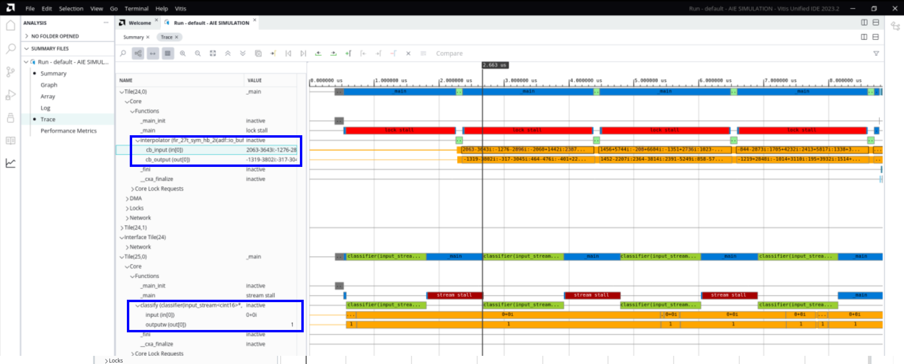

# Step-by-Step integration to run traffic generators with AI Engine simulation

## Step-1:  ADF Graph Modifications

To use external traffic generators for any kind of simulation, you need to make modifications to the graph code, specifically the graph.h file. This file contains the PLIO constructors, which are used to connect the graph to the programmable logic.

1. Navigate to aie/src and open graph.h.
2. Notice that the ``#ifdef EXTERNAL_IO`` is used and the lines of code under it do not have the PLIO based data file in the PLIO constructors. This is needed for the external traffic generator to work properly, because the PLIO based data file takes precedence.
3. Take a note of the names (first argument) of the PLIO constructors. These will be used to hook up the external traffic generators and the same name should be used for creating the ports in the external traffic generators. 
4. Close graph.h.

## Step-2: Writing the traffic generator 

The overall goal of the external traffic generator is to send or receive data to or from the AI Engine array through a specific port. The sender can generate data on the fly or read it from a file. The receiver can keep data and save it somewhere, or process it in a function.

Here, the PL datamovers are replaced with traffic generators and any PL-interface with AIE is replaced via ETG interface with AIE i.e. interfaced with the input port of the interpolator (in_interpolator), output port of the interpolator (out_interpolator), input port of the classifier and the output port of the classifier (out_classifier).  You can go inside `TrafficGenerator/` folder for the script analysis in Python, Matlab and C++.

<details>
  <summary>Python</summary>

### Python

#### 1. Instantiating the XTLM Utilies

You can create the sender and receiver objects for the AIE that will make sure to instantiate the XTLM utilies for IPC based communication while sending or receiving the traffic. See lines 7-13. 

```BASH
    in_interpolator = aie_input_plio("in_interpolator", 'int16')
    out_interpolator = aie_output_plio("out_interpolator", 'int16')
    in_classifier = aie_input_plio("in_classifier", 'int16')
    out_classifier = aie_output_plio("out_classifier", 'int32')
```
Here the first parameter `in_interpolator` is a string value that should match PLIO names in the graph PLIO constructors. The second parameter is the AIE kernel datatype with which sender/receiver is interfaced. For more details on datatype mapping in Python based external traffic generators, see [Writing Traffic Generators in Python](https://docs.amd.com/r/en-US/ug1393-vitis-application-acceleration/Writing-Python-Traffic-Generators)

#### 2. Transmitting the data using send_data (data_val, tlast) API

You can prepare the list of data values and send them using send_data API call. See lines 37 and 58 in the script `TrafficGenerator/Python/xtg_aie.py`. The API expects data values' list as the first parameter and TLAST value as the second.  

```BASH
in_interpolator.send_data(in_interpolator_data, True)
in_classifier.send_data(in_classifier_data, True)
```
Here the first parameter `in_interpolator_data` is the list of int16 values expected by the AIE kernel. The second parameter is the TLAST value as `True`

#### 3. Receiving the data using receive_data_with_size API(expected_data_size)

In order to get the received data values from the classifier, use receive_data_with_size(exp_data_size) API call. This API needs expected data size (in bytes) as an argument. 

```BASH 
out_classifier_data = out_classifier.receive_data_with_size(1024)
out_interpolator_data = out_interpolator.receive_data_with_size(1024)
```

This API is a blocking API and it will wait till specified data i.e. 4096 bytes is received in four iterations at the output port. Once received the specified data size, you can see the data values in the `out_classifier_data` and `out_interpolator_data` list. 

Once the data is received in the list, you can dump it in a file for comparing with the golden output or you can process the data further into some other function based on the application. The output of the interpolator is dumped into a file and can be validated against the golden data(interpolator_golden.txt). The output of the classifier is validated against the golden output (golden.txt). 

For more details on Python based APIs, refer [Writing Traffic Generators in Python](https://docs.amd.com/r/en-US/ug1393-vitis-application-acceleration/Writing-Python-Traffic-Generators)
</details>

<details>
  <summary>Matlab</summary>

### Matlab

#### 1. Instantiating the XTLM Utilies

You need to instantiate the classes to send and receive the data. See lines below inside `TrafficGenerator/MATLAB/xtg_aie.m` 

```BASH
    in_interpolator = aie_input_plio("in_interpolator", 'int16')
    out_interpolator = aie_output_plio("out_interpolator", 'int16')
    in_classifier = aie_input_plio("in_classifier", 'int16')
    out_classifier = aie_output_plio("out_classifier", 'int32')
```
Here, ``in_interpolator`` and ``in_classifier`` are sender objects whereas ``out_interpolator`` and ``out_classifier`` are the receiver objects. 

#### 2. Transmitting the data using send_data () API

In order to send the data values, use send_data() API call. The API expects its first parameter as data values in the list for the specified data type and second parameter as the TLAST value.   

```BASH
in_interpolator.send_data(in_interpolator_data, True)
in_classifier.send_data(in_classifier_data, True)
```
Here the first parameter `in_interpolator_data` is the list of int16 values expected by the AIE kernel. The second parameter is the TLAST value as `True`

#### 3. Receiving the data using receive_data_with_size () API

In order to get the received data values from the classifier, use receive_data_with_size(exp_data_size) API call. This API needs expected data size (in bytes) as an argument. 

```BASH 
out_classifier_data = out_classifier.receive_data_with_size(1024)
out_interpolator_data = out_interpolator.receive_data_with_size(1024)
```

This API is a blocking API and it will wait till specified data i.e. 4096 bytes is received in four iterations at the output port. Once received the specified data size, you can see the data values in the `out_classifier_data` and `out_interpolator_data` list.

Once the data is received in the list, you can dump it in a file for comparing with the golden output or you can process the data further into some other function based on the application. The output of the interpolator is dumped into a file and can be validated against the golden data(interpolator_golden.txt). The output of the classifier is validated against the golden output (classifier_golden.txt). 

For more details on MATLAB APIs, refer [Writing Traffic Generators in MATLAB](https://docs.amd.com/r/en-US/ug1393-vitis-application-acceleration/Writing-Traffic-Generators-in-MATLAB)
</details>

<details>
  <summary>C++</summary>

### CPP

#### 1. Instantiating the XTLM Utilities

You can create the sender and receiver objects for the AIE that will make sure to instantiate the XTLM utilies for IPC based communication while sending or receiving the traffic. The CPP based code is found inside `TrafficGenerator/CPP/` folder. 

```BASH
    xtlm_ipc::axis_master in_interpolator("in_interpolator");
	xtlm_ipc::axis_slave out_interpolator("out_interpolator");

	xtlm_ipc::axis_master in_classifier("in_classifier");
	xtlm_ipc::axis_slave out_classifier("out_classifier");

```
#### 2. Transmitting the data using send_data (data_val, tlast) API

You can prepare the list of data values and send them using send_data API call. See lines <> in the script. The API expects data values list as the first parameter and TLAST value as the second.  

```BASH
in_interpolator.send_data(interpolator_byte_array, true);
in_classifier.send_data(classifier_byte_array, true);
```
Here the first parameter `interpolator_byte_array` is the data values in the form of byte array. The second parameter is the TLAST value as `True`

#### 3. Receiving the data using receive_data_with_size API(expected_data_size)

In order to get the received data values from the classifier, use receive_data_with_size(exp_data_size) API call. This API needs expected data size (in bytes) as an argument. 

```BASH 
out_classifier.receive_data_with_size(data_out_cls, 1024)
out_interpolator.receive_data_with_size(data_out, 1024)
```

This API is a blocking API and it will wait till specified data i.e. total 4096 bytes is received in four iterations at the output port. Once received the specified data size, you can see the data values in the `out_data` and `out_data_cls` byte array. You can convert the byte array into user data type using the conversion APIs. For conversion APIs, refer [Writing Traffic Generators in C++](https://docs.amd.com/r/en-US/ug1393-vitis-application-acceleration/General-Purpose-C-API)

Once the data is received in the list, you can dump it in a file for comparing with the golden output or you can process the data further into some other function based on the application. The output of the interpolator is dumped into a file and can be validated against the golden data(interpolator_golden.txt). The output of the classifier is validated against the golden output (classifier_golden.txt). 

</details>

## Step-3: Run the Traffic Generator with AIE Simulation

You need to trigger the external TG script and the emulation process paralley to establish the connection. You can launch them using `make run` command or launch them on seperate terminals. Here are the steps - 

### Launching the external script

Use the script inside script/python.sh to launch the external traffic generator. This script sets up the `PYTHONPATH` required to point to the XTLM IPC libary from where all the APIs are imported and launches the python script. See lines 2-9. From bash terminal, trigger the script as below - 

```BASH
./scripts/etg_py.sh 

or 

./scripts/etg_cpp.sh 

or 

./scripts/etg_matlab.sh
```
### Launching the AIEsim process 
Once launched the external script, simultaneously on the other terminal you can run the HW_Emulation as below: 

```BASH
aiesimulator --pkg-dir=aie/Work

or 

x86simulator --pkg-dir=aie/Work
```
#### Make Utility to run all the flows 

1. To compile and run the x86simulation with external traffic generators --> ``make run_x86sim TARGET=x86sim EXTIO=true TRAFFIC_GEN=<PYTHON/CPP/MATLAB>``
2. To compile and run the x86simulation without external traffic generators --> ``make run_x86sim TARGET=x86sim EXTIO=false``
3. To compile and run the aiesimulation with external traffic generators --> ``make run_aiesim TARGET=hw EXTIO=true TRAFFIC_GEN=<PYTHON/CPP/MATLAB>``
4. To compile and run the aiesimulation without external traffic generators --> ``make run_aiesim TARGET=hw EXTIO=false``

### Viewing the Results in the Vitis Analyzer 
You need to run the aiesimulator with ``--dump-vcd`` option to generate the input and output data trace results. To view the results in the Vitis Analyzer, run the command ``vitis_analyzer aiesimulator_output/default.aierun_summary``. This opens the Vitis Analyzer with Trace view as below: 


