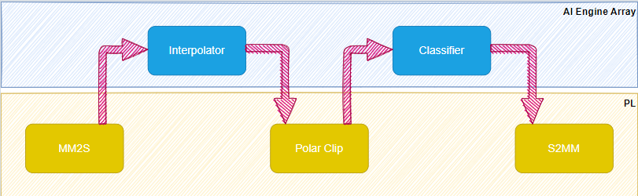
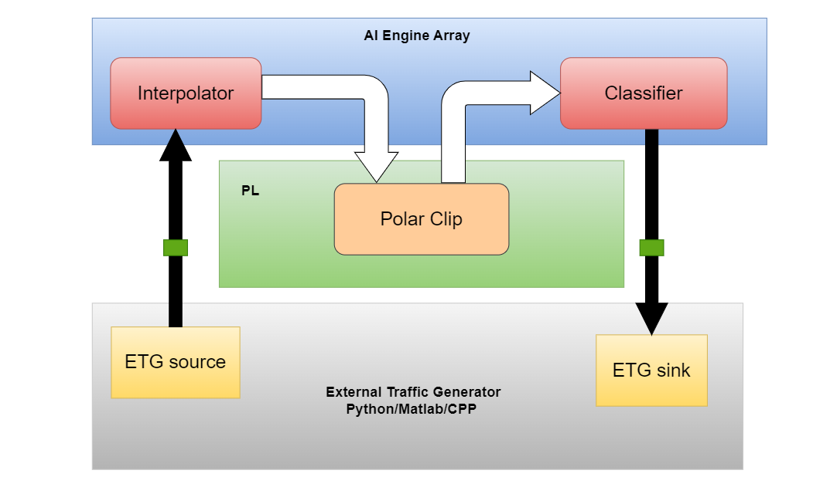
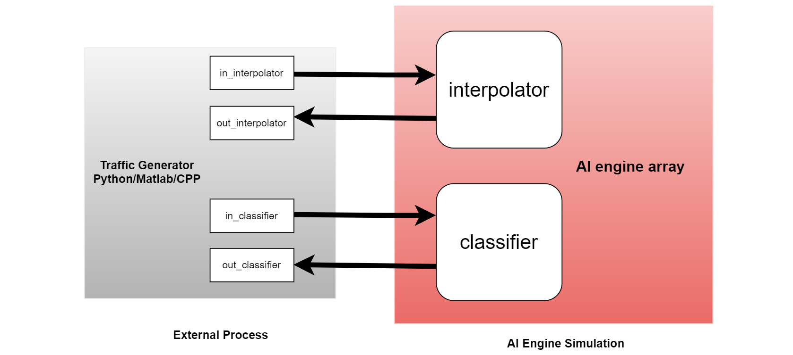

<table class="sphinxhide" width="100%">
 <tr width="100%">
    <td align="center"><h1>AI Engine Development</h1>
    <a href="https://www.xilinx.com/products/design-tools/vitis.html">See Vitis™ Development Environment on xilinx.com </a>
    <a href="https://www.xilinx.com/products/design-tools/vitis/vitis-ai.html">See Vitis™ AI Development Environment on xilinx.com</a>
    </td>
 </tr>
</table>

# Python and C++ External Traffic Generators for AI Engine Simulation and Emulation Flows

***Version: Vitis 2024.1***

## Introduction

Versal™ adaptive compute acceleration platforms (adaptive SoC) combine scalar engines, adaptable engines, and intelligent engines with leading-edge memory and interfacing technologies to deliver powerful heterogeneous acceleration for any application. In a bottom-up approach, each part of the system is simulated independently before being integrated in a more complete simulation. An heterogeneous device as the Versal adaptive SoC authorizes dataflows to go through a diversity of engines for completion.

This tutorial develops a case in which the dataflow goes back and forth multiple times between the programmable logic (PL) and the AI Engine array. Some PL blocks are only source or destination kernels, whereas others are processing kernels within the dataflow. This tutorial demonstrates how to create external traffic generators as Python scripts or C++ applications to exercise the AI Engine kernels in the x86 simulator (`x86simulator`), AI Engine simulator (`aiesimulator`), and in hardware emulation (`hw_emu`).

### Objectives

After completing the tutorial, you will be able to do the following:

* Create a Python/Matlab script or C++ application.
* Validate full system design using traffic generators in Vitis Emulation flow
* Validate only AIE blocks inside the graph using external TG
* Pass data between the traffic generator and the AI Engine through specific ports.
* Capture and send data and display using Python/Matlab
* Capture and send data using C++.
* Understand the necessary code changes in the graph and host to make the design work seamlessly between `x86simulator`, `aiesimulator`, and `hw_emu`.
* Bring up results in Vitis Analyzer.

### Before You Begin

This tutorial uses Python. In addition to AMD tools, you also need a valid installation of Python 3. It is recommended to use Python from Vitis Install Area. 

**IMPORTANT**: Before beginning the tutorial make sure you have read and followed the *Vitis Software Platform Release Notes* (v2024.1) for setting up software and installing the VCK190 base platform.

Before starting this tutorial run the following steps.

1. Set up your platform by running the `xilinx-versal-common-v2024.1/environment-setup-cortexa72-cortexa53-xilinx-linux` script as provided in the platform download. This script sets up the `SYSROOT` and `CXX` variables. If the script is not present, you _must_ run `xilinx-versal-common-v2024.1/sdk.sh`.
2. Set up your ROOTFS to point to the `xilinx-versal-common-v2024.1/rootfs.ext4`.
3. Set up your IMAGE to point to `xilinx-versal-common-v2024.1/Image`.
4. Set up your `PLATFORM_REPO_PATHS` environment variable based upon where you downloaded the platform.

## Design Overview

This tutorial is based on a basic design, as shown below. This design contains two AI Engine kernels with an intermediate kernel in the PL. The overall system is fed and flushed from kernels mm2s and s2mm that are in PL. In this full system design, the intermediate processing kernel is the polar_clip which is also in the PL logic. 

### Analyzing the full system design in the external traffic generators 

To validate above design using external traffic generators, there are few ways to acheive it-

#### In the Emulation Flow

You can validate the AIE kernels and intermediate PL logic by feeding and flushing the data using external traffic generators. In this case, you can generate the desired dataset quickly using traffic generator script instead of modelling the data movers. In the figure below, the traffic generators run in the external process (in grey) and AI-PL blocks run in the Vitis emulation process. 

For details on how to run traffic generators with emulation flow, please visit [Step-by-Step integration to run traffic generators with Emulation Flow](SW-HW_Emulation)

### In the AI Engine simulation flow 

You can also validate individual AIE blocks using external traffic generators that helps you quickly validate the entire AIE graph without having the burden to write the PL logic.  

As observed in the full system design, the output of the polar clip PL process is the input to the classifier. While validating individual blocks, the output of the interpolator can be validated against the golden data(interpolator_golden.txt) which is input of the polar clip PL logic in the full system design. The classifier input (classifier_in.txt) is generated from the reference dataset available (output of the polar clip PL processing kernel from full system design) which is dumped output of the polar clip PL logic. The output of the classifier is validated against the golden output (classifier_golden.txt). 
It's your choice if you want to read data from the file and prepare dataset or generate data on the fly with your own custom logic based on the design testbench dataset requirement.

For details on how to run traffic generators with AI Engine simulation, please visit [Step-by-Step integration to run traffic generators with AI Engine simulation](AIE_Simulation)

#### Support

GitHub issues will be used for tracking requests and bugs. For questions go to [forums.xilinx.com](http://forums.xilinx.com/).

Copyright © 2020–2023 Advanced Micro Devices, Inc

<a href="https://www.amd.com/en/corporate/copyright">Terms and Conditions</a>

