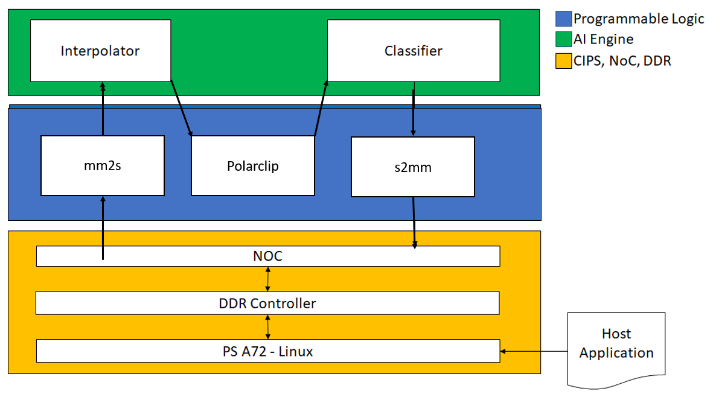
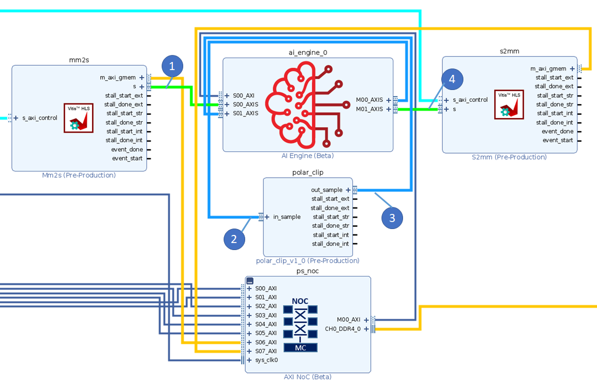
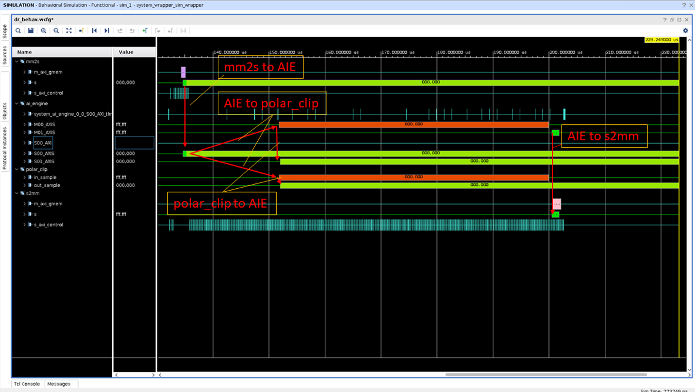

<table class="sphinxhide" style="width:100%;">
  <tr>
    <td align="center">
      <picture>
        <source media="(prefers-color-scheme: dark)" srcset="https://raw.githubusercontent.com/Xilinx/Image-Collateral/main/logo-white-text.png">
        
      </picture>
      <h1>AMD Vitis™ AI Engine Tutorials</h1>
      <a href="https://www.amd.com/en/products/software/adaptive-socs-and-fpgas/vitis.html">See Vitis™ Development Environment on amd.com</a>
        </br>
      <a href="https://www.amd.com/en/products/software/vitis-ai.html">See Vitis™ AI Development Environment on amd.com</a>
    </td>
  </tr>
</table>

# Using RTL IP with AI Engines

***Version: Vitis 2025.2***

## Introduction

This tutorial demonstrates the following two features of the AMD Vitis™ unified software platform flow:

1. Reusing an AXI-based IP initially created as an RTL IP.
2. Controlling the platform and converting an RTL IP to a kernel for a more streamlined process of creating the design.

**IMPORTANT**: Before beginning the tutorial, install the Vitis 2025.2 software platform. This release includes all the embedded base platforms, including the VCK190 base platform, used in this tutorial. Also, download the Common Images for Embedded Vitis Platforms from [this link](https://www.xilinx.com/support/download/index.html/content/xilinx/en/downloadNav/embedded-platforms/2025.2.html).

The 'common image' package contains a prebuilt Linux kernel and root file system that you can used with AMD Versal™ adaptive SoCs boards for embedded design development using the Vitis software platform.

Before starting this tutorial, run the following steps:

1. Go to the directory where you have unzipped the Versal Common Image package.
2. In a Bash shell run `/Common Images Dir/amd-versal-common-v2025.2/environment-setup-cortexa72-cortexa53-amd-linux` script. This script sets up the SDKTARGETSYSROOT and CXX variables. If the script is not present, run the `/Common Images Dir/amd-versal-common-v2025.2/sdk.sh`.
3. Set up your ROOTFS and IMAGE to point to `rootfs.ext4` and image files located in the `/Common Images Dir/amd-versal-common-v2025.2` directory.
4. Set up your PLATFORM_REPO_PATHS environment variable to `$XILINX_VITIS/base_platforms/amd_vck190_base_202520_1/amd_vck190_base_202520_1.xpfm`

**NOTE**: This tutorial targets the 2025.2 VCK190 production board.

## Objectives

In this tutorial, learn:

* To create a custom RTL kernel (outside the ADF graph) to use with ADF graphs
* To modify the ADF graph code to incorporate PLIO between AI Engines and RTL kernels

## Tutorial Overview

- **Step 1**: Creating custom RTL kernels with the AMD Vivado™ Design Suite
- **Step 2**: Creating HLS kernels with Vitis compiler
- **Step 3**: Interfacing ADF graph to the Programmable Logic (PL)
- **Step 4**: Building XCLBIN
- **Step 5**: Building a host application
- **Step 6**: Packaging the design
- **Step 7**: Running emulation

The design used is shown in the following figure:



|Kernel|Type|Comment|
|  ---  |  ---  |  ---  |
|MM2S|HLS|Memory Map to Stream HLS kernel to feed input data from DDR to AI Engine interpolator kernel through the PL DMA.|
|Interpolator |AI Engine| Half-band 2x up-sampling FIR filter with 16 coefficients. Input and output are cint16 window interfaces. The input interface has a sample margin of 16. |
|Polar_clip|RTL Engine| Determines the magnitude of the complex input vector and clips the output magnitude if it is greater than a threshold. The polar_clip has a single input stream of complex 16-bit samples. It has a single output stream whose underlying samples are also complex 16-bit elements.|
|Classifier |AI Engine| This kernel determines the quadrant of the complex input vector and outputs a single real value depending which quadrant. The input interface is a cint16 stream and the output is a int32 window.  |
|S2MM|HLS|Stream to Memory Map HLS kernel to feed output result data from AI Engine classifier kernel to DDR through the PL DMA.|

## Step 1 - Creating Custom RTL Kernels with the Vivado Design Suite

Follow these steps to package your RTL code as a Vivado IP and generate a Vitis RTL kernel:

1. Open the `polar_clip_rtl_kernel.tcl` file.
   
   This Tcl script creates an IP following the Vivado IP Packaging flow as described in the [Creating and Packaging Custom IP User Guide (UG1118)](https://docs.amd.com/r/en-US/ug1118-vivado-creating-packaging-custom-ip/Creating-and-Packaging-Custom-IP).

    Note the following points:

    * The script creates a Vivado Design Suite project. This is required to create any IP because all source and constraint files must be local to the IP.
    * Lines 34 and 35 associate the correct clock pins to the interfaces. This is required for the Vitis compiler which links those interfaces to the platform clocking.

        ```tcl
        ipx::associate_bus_interfaces -busif in_sample -clock ap_clk [ipx::current_core]
        ipx::associate_bus_interfaces -busif out_sample -clock ap_clk [ipx::current_core]
        ```

    * On lines 38 and 39 the `FREQ_HZ` bus parameter is removed. The Vivado IP integrator uses this parameter for correct association of the clock interface. The Vitis compiler sets this during the compilation process. Having it set in the IP can cause the compiler to incorrectly link the clocks.

        ```tcl
        ipx::remove_bus_parameter FREQ_HZ [ipx::get_bus_interfaces in_sample -of_objects [ipx::current_core]]
        ipx::remove_bus_parameter FREQ_HZ [ipx::get_bus_interfaces out_sample -of_objects [ipx::current_core]]
        ```

    * At the end of the script notice the `package_xo` command. This command analyzes the newly created IP to make sure it contains the proper AXI interfaces. It then creates the XO file in the same location as the IP repository. A key function used in this command is the `-output_kernel_xml`. The `kernel.xml` file is key to the RTL kernel as it describes to the Vitis tool how the kernel should be controlled. You can find more information on [RTL kernels and their requirements](https://docs.amd.com/r/en-US/ug1393-vitis-application-acceleration/Packaging-RTL-Kernels).

        ```tcl
        package_xo -kernel_name $kernelName \
            -ctrl_protocol ap_ctrl_none \
            -ip_directory [pwd]/ip_repo/$kernelName \
            -xo_path [pwd]/ip_repo/${kernelName}.xo \
            -force -output_kernel_xml [pwd]/ip_repo/kernel_${kernelName}_auto.xml
        ```

2. To complete this step run the following command:

    ```bash
    vivado -source polar_clip_rtl_kernel.tcl -mode batch
    ```

    or

    ```bash
    make polar_clip.xo
    ```

## Step 2 - Creating HLS Kernels with the Vitis Compiler

The `mm2s` and `s2mm` are HLS-based kernels that the Vitis compiler packages into XO files.

To build these kernels run the following commands:

```bash
v++ -c --platform <path_to_platform/platform.xpfm> -k mm2s pl_kernels/mm2s.cpp -o mm2s.xo
v++ -c --platform <path_to_platform/platform.xpfm> -k s2mm pl_kernels/s2mm.cpp -o s2mm.xo
```

or

```bash
make kernels
```

## Step 3 - Interfacing the ADF Graph to the Programmable Logic

To interface the ADF graph to the `polar_clip` RTL kernel and the `mm2s` and `s2mm` HLS kernels, add connections between PLIOs and the corresponding PL kernels IOs.

1. The following `graph.h` shows how to connect to the RTL kernel.

    ```cpp
      adf::source(interpolator) = "kernels/interpolators/hb27_2i.cc";
      adf::source(classify)    = "kernels/classifiers/classify.cc";
      
      //Input PLIO object that specifies the file containing input data
      in = adf::input_plio::create("DataIn1", adf::plio_32_bits,"data/input.txt");
      clip_out = adf::input_plio::create("clip_out", adf::plio_32_bits,"data/input2.txt");
      
      //Output PLIO object that specifies the file containing output data
      out = adf::output_plio::create("DataOut1",adf::plio_32_bits, "data/output.txt");
      clip_in = adf::output_plio::create("clip_in",adf::plio_32_bits, "data/output1.txt");

      connect(in.out[0], interpolator.in[0]);
      connect(interpolator.out[0], clip_in.in[0]);
      connect(clip_out.out[0], classify.in[0]);
      connect(classify.out[0],out.in[0]);

    ```

    Note the following:

   * Two additional `PLIO` objects `clip_in` and `clip_out` are added. These hook up to the `polar_clip` RTL kernel.
   * There are additional net objects to hook up the RTL kernel to the rest of the platform object.

    For more information on RTL kernels in the AI Engine, refer to [Integrating AIE and PL Components](https://docs.amd.com/r/en-US/ug1701-vitis-accelerated-embedded/Integrating-AIE-and-PL-Components).

2. Compile the graph using the following command:

   ```bash
   v++ --mode aie -c  --target=hw --include="/include" --include="./aie" --include="./data" --include="./aie/kernels" --include="./"  --aie.workdir=./Work --platform=${XILINX_VITIS}/base_platforms/xilinx_vck190_base_202520_1/xilinx_vck190_base_202520_1.xpfm aie/graph.cpp
   ```

   or

   ```bash
   make aie
   ```

## Step 4 - Building XCLBIN

Because there is no HLS kernel in the ADF graph, the `system.cfg` file that determines connectivity needs to reflect the new AI Engine interfacing.

1. Open the `system.cfg` file and the `sc` options. It has two lines specific to the `polar_clip` kernel. Note that the name of the interfaces are the same as defined previously in the code snippet for the `graph.h` file where the first parameter of the PLIO object is instantiated.

    ```yaml
    [connectivity]
    sc=mm2s_1.s:ai_engine_0.DataIn1
    sc=ai_engine_0.clip_in:polar_clip_1.in_sample
    sc=polar_clip_1.out_sample:ai_engine_0.clip_out
    sc=ai_engine_0.DataOut1:s2mm_1.s
   ```

2. Close `system.cfg`.
3. Build the emulation design using the following command:

    ```bash
    v++ -l --platform ${XILINX_VITIS}/base_platforms/xilinx_vck190_base_202520_1/xilinx_vck190_base_202520_1.xpfm s2mm.xo mm2s.xo polar_clip.xo libadf.a -t hw_emu --save-temps -g --config system.cfg -o tutorial.xsa
    ```

    or

   ```bash
   make xclbin
   ```

## Step 5 - Building the Host Application

You must use the appropriate `SYSROOT` path for the design.

To build the host application, run the following command:

```bash
aarch64-linux-gnu-g++ -Wall -c -std=c++14 -Wno-int-to-pointer-cast \
    --sysroot=${SDKTARGETSYSROOT}  \
    -I$(SDKTARGETSYSROOT)/usr/include/xrt \
    -I-I$(SDKTARGETSYSROOT)/usr/include \
    -o host.o host.cpp
aarch64-linux-gnu-g++ *.o -lxrt_coreutil \
    --sysroot=${SDKTARGETSYSROOT} \
    -std=c++14 -o host.exe
```

or

```bash
make host
```

## Step 6 - Packaging the Design

When packaging the design, `rootfs`, `kernel_image`, and `platform` must all point to the platform. If any of these items are not correct, packaging can throw an error. Or, if it does package successfully, then the emulation can malfunction.

To package the design, run the following command:

```bash
cd ./sw
v++ -p -t hw_emu \
    -f ${XILINX_VITIS}/base_platforms/xilinx_vck190_base_202520_1/xilinx_vck190_base_202520_1.xpfm \
    --package.rootfs=${PLATFORM_REPO_PATHS}/sw/versal/xilinx-versal-common-v2025.2/rootfs.ext4 \
    --package.image_format=ext4 \
    --package.boot_mode=sd \
    --package.kernel_image=${PLATFORM_REPO_PATHS}/sw/versal/xilinx-versal-common-v2025.2/Image \
    --package.defer_aie_run \
    --package.sd_file host.exe ../tutorial.xsa ../libadf.a
cd ..
```

or

```bash
make package
```

## Step 7 - Running Emulation

After packaging, you can run emulation or run on hardware.

1. To run emulation, use the following command:

    ```bash
    make run_emu
    ```

    or

    ```bash
    cd ./sw
    ./launch_hw_emu.sh
    cd ..
    ```

    When launched, use the Linux prompt to run the design.

2. Execute the following command when the emulated Linux prompt displays:

    ```bash
    ./host.exe a.xclbin
    ```

You should see **TEST PASSED**. Run the keyboard command `Ctrl+A x` to end the QEMU instance.

### Viewing Emulation Waveforms

The following image shows a debug waveform with data movement through the system. The general flow of data is as follows:

1. Data goes from DDR memory to the AI Engine through the `mm2s` kernel.
2. The ADF graph processes the data and sends it to the `polar_clip` kernel.
3. The `polar_clip` kernel processes the data and sends it back to the ADF graph.
4. The AI Engine sends the resulting graph output to the `s2mm` kernel to store in DDR memory.





To view the waveforms, follow these steps:

1. Launch the emulation from the `sw` directory with `./launch_hw_emu.sh -g` command. The `-g` option tells the script to launch the Vivado Simulator (`xsim`) Waveform GUI as shown in the preceding image.
2. When the GUI opens up, add waveforms to the waveform viewer or you can use the existing `.wcfg` file in the repository by selecting **File > Simulation Waveform > Open Configuration**, locate the `custom.wcfg`, and click **OK**.
3. Click **Run > Run All** or **F3**.

### Summary

This tutorial shows you how to:

* Create a custom RTL kernel from a Vivado IP
* Modify the ADF graph to handle more PLIO interfacing
* Build and execute the design in emulation


<p class="sphinxhide" align="center"><sub>Copyright © 2020–2026 Advanced Micro Devices, Inc.</sub></p>

<p class="sphinxhide" align="center"><sup><a href="https://www.amd.com/en/corporate/copyright">Terms and Conditions</a></sup></p>
