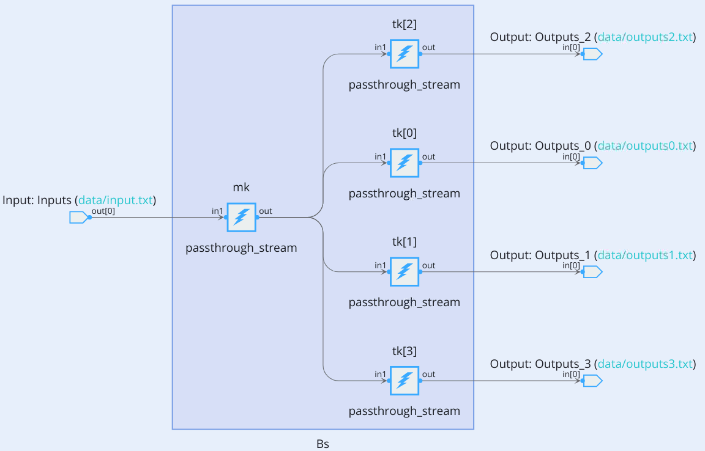
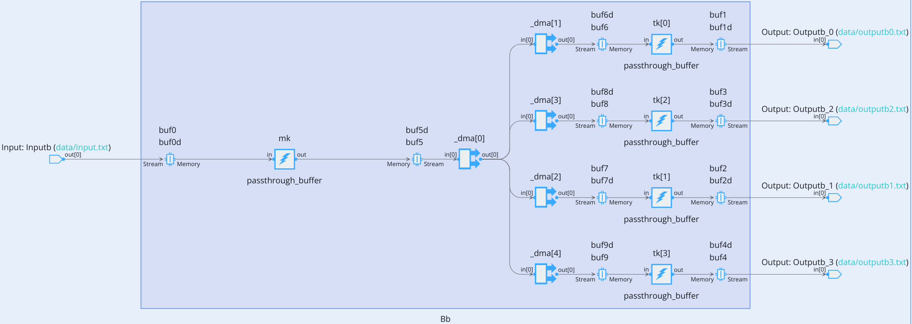
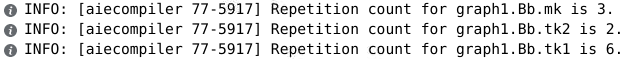

<table class="sphinxhide" style="width:100%;">
  <tr>
    <td align="center">
      <picture>
        <source media="(prefers-color-scheme: dark)" srcset="https://raw.githubusercontent.com/Xilinx/Image-Collateral/main/logo-white-text.png">
        
      </picture>
      <h1>AMD Vitis™ AI Engine Tutorials</h1>
      <a href="https://www.amd.com/en/products/software/adaptive-socs-and-fpgas/vitis.html">See Vitis™ Development Environment on amd.com</a>
        </br>
      <a href="https://www.amd.com/en/products/software/vitis-ai.html">See Vitis™ AI Development Environment on amd.com</a>
    </td>
  </tr>
</table>

# Data Multicasting

## Introduction

In a complete system design there are many situations where various independent kernels use the same data. These kernels are not aware of the existence of the other kernels and operate completely independently of other kernel operations.

There are situations where data is split (multicast) but the various branches do not have the same buffer size. The compiler handles such scenarios automatically when you use the buffer interface.

## Case 1: Stream and Buffer Multicasting

When the data source is a stream and all the input interfaces of the destinations are streaming interfaces, the `aiecopiler` has nothing special to do. The AXI-Stream interface interconnect connects the destinations to the same source.



>**Note:** Be aware of inefficiencies and deadlocks. You have to introduce FIFOs on the various paths to overcome stream stalls on some branches.

The situation is different when the source and destination are buffers. Only the four neighbors can access memory interfaces exclusively, and they cannot be extended further. That is why the `aiecompiler` uses the AXI-Stream interconnect and the DMAs (MM2S -> S2MM) to multicast the source memory content to the destination memories.



The compiler added all the infrastructure `_dma[0] ... _dma[4]` to multicast the data to all destination memories.

Type `make CASE=1 clean data aie aieviz` and explore the graph view and the array view shown by Vitis Analyzer.

At the end of the simulation the simulator displays the throughput of the system for every port:

```
--------------------------------------------------------------------------------------------------
Port Name           | Type              | Average Throughput
--------------------------------------------------------------------------------------------------
Inputb              | IN                | 1250.775916 MBps  
Inputs              | IN                | 1251.141553 MBps  
Outputb_0           | OUT               | 1252.446184 MBps  
Outputs_0           | OUT               | 1252.446184 MBps  
Outputb_1           | OUT               | 1252.446184 MBps  
Outputs_1           | OUT               | 1252.446184 MBps  
Outputb_2           | OUT               | 1252.446184 MBps  
Outputs_2           | OUT               | 1252.446184 MBps  
Outputb_3           | OUT               | 1252.446184 MBps  
Outputs_3           | OUT               | 1252.446184 MBps  
--------------------------------------------------------------------------------------------------
```

This case being single rate, the throughput is the same for all the ports.

## Case 2: Multirate Buffer Multicasting

[Multirate](../Multirate) design is a subject explored in another section of this tutorial. This subsection emphasizes that with different buffer sizes for destinations, the `aiecompiler` computes a number of runs per iteration for each kernel so that the `maker` generates data consumed by all the `takers`.

The architecture is exactly the same but the repetition counts are different from case 1:



Type `make CASE=2 clean data aie aieviz` and explore the graph view and the array view shown by the AMD Vitis™ Analyzer.

At the end of the simulation the simulator displays the throughput of the system for every port:

```
--------------------------------------------------------------------------------------------------
Port Name           | Type              | Average Throughput
--------------------------------------------------------------------------------------------------
Inputb              | IN                | 1250.344637 MBps  
Outputb_0           | OUT               | 1250.610650 MBps  
Outputb_1           | OUT               | 1250.814332 MBps  
--------------------------------------------------------------------------------------------------
```

Here the system is single rate. The only difference between the cores are the input and output buffer sizes.

## Support

GitHub issues are used for tracking requests and bugs. For questions, go to [support.amd.com](https://adaptivesupport.amd.com/s/topiccatalog?language=en_US).

<p class="sphinxhide" align="center"><sub>Copyright © 2025 Advanced Micro Devices, Inc.</sub></p>

<p class="sphinxhide" align="center"><sup><a href="https://www.amd.com/en/corporate/copyright">Terms and Conditions</a></sup></p>
