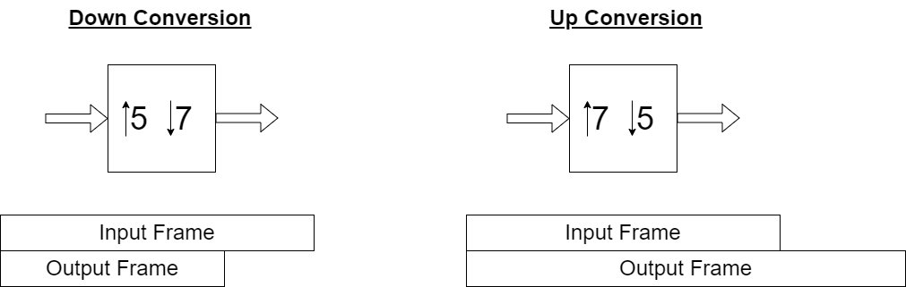
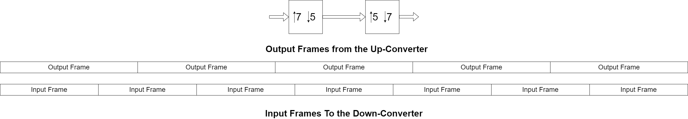
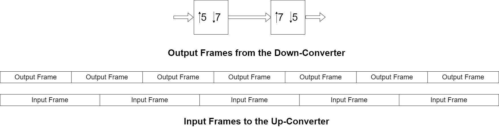
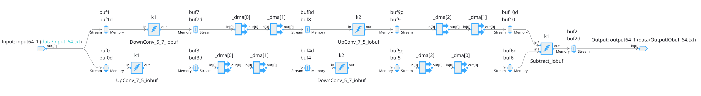
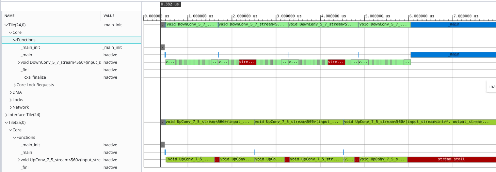
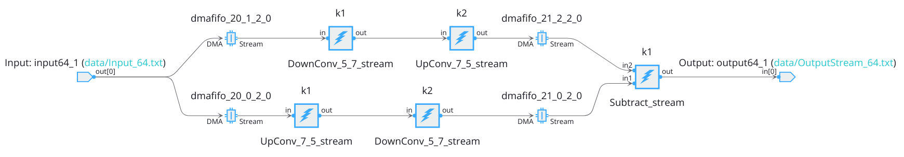

</table>
<table class="sphinxhide" width="100%">
 <tr width="100%">
    <td align="center"><h1>AI Engine Development</h1>
    <a href="https://www.xilinx.com/products/design-tools/vitis.html">See Vitis™ Development Environment on xilinx.com</br></a>
    <a href="https://www.xilinx.com/products/design-tools/vitis/vitis-ai.html">See Vitis™ AI Development Environment on xilinx.com</a>
    </td>
 </tr>
</table>

# Multirate AI Engine Graphs

## Introduction

Kernels can be created with a fixed size input/output frame of data. These kernels can be preceded and followed by other kernels that have their own frame size requirements. There can be mismatches in between these frame sizes and that is why the `aiecompiler` offers a mechanism to automatically compute a number of runs of each kernel, for one iteration of the system, so that the overall sizes for all kernel interfaces are matching.

This mechanism is completed by an API which provide these numbers of runs if the compiler does not have access to the frame length (streaming I/Os).

## Multirate Examples

All examples use three kernels:

- UpConv_7_5: Up-conversion 7/5, which is a passthrough with data extrapolation at the end.
- DownConv_5_7: Down-conversion which is a data truncation.
- Subtract: This kernel takes two inputs and subtracts them. This is a merge show case.

All kernels have the same input frame length (`InputSize`) which brings the compiler to take decisions in terms of number of calls for each kernel to harmonize the number of data produced and consumed on the whole system. The frame length can be seen in the `system_settings.h` file:

```C++
#define BaseSize (5*7)
// 8 int32 --> 256 bits
#define VECTOR_LENGTH 8
#define InputSize (2*VECTOR_LENGTH*BaseSize)
#define NIterations 4
```

Various parameters appear here:

- `BaseSize`: As the input size has to be divided by 5 or 7, depending on whether it is an up-conversion or a down-conversion, this ``BaseSize`` is necessary to handle only integer results.
- `VECTOR_LENGTH`: Kernels are optimized to use only vectors that are 256 bits in size.
- `InputSize`: Size of the input frame.
- `NIterations`: Number of iterations of the entire system.



## I/O-buffer Interface

### UpConv then DownConv

This simple design has an up-converter 7/5 followed by a down-converter 5/7.

```BASH
make VERSION=1 buffer aie
```

In this design, the up-Converter is followed by the down-Converter. The buffer size does not match as the output frame length is 784 samples while the input frame length is always 560 samples. The compiler has to find the number of runs of two kernels so that the global output frame length of the up-converter matches the global input frame length of the down-converter.

For each iteration, the compiler decides to run five times the up-converter and seven times the down-converter. This is explained below.

```
************************************************************************

INFO: [aiecompiler 77-5917] Repetition count for G.G1.k1 is 5.
INFO: [aiecompiler 77-5917] Repetition count for G.G1.k2 is 7.

************************************************************************
```

The compiler needs to find the smallest repetition rate. The problem is as follows:

- The up-converter consumes **S** samples and produces **S.(7/5)**.
- The down-converter consumes **S** samples and produces **S.(5/7)**
- How many times (minimum) should the converters be run so that the number of samples consumed by the down-converter (n2) is equal to the number of samples produced by the up-converter (n1)?

$$
n1.S.(7/5) = n2.S
7.n1.S = 5.n2.S
$$

The minimal solutions are:

- n1 = 5
- n2 = 7

which is what has been found by the compiler.



The resulting code for the tile containing the down-converter is:

```C++

...
// Declare Kernel functions and initializers
void DownConv_5_7_iobuf(adf::io_buffer<int, adf::direction::in, adf::io_buffer_config<>> &__restrict,adf::io_buffer<int, adf::direction::out, adf::io_buffer_config<>> &__restrict);

// Declare Kernel objects and external arrays

int main(void) {
  ...

  while(true)
  {

  int32 proc_25_0_bounds = sync_buffer[1];

  while (proc_25_0_bounds)
  {
    for (uint64_t proc_25_0_repetition = 0; proc_25_0_repetition < 7; proc_25_0_repetition++)
    {

    // Kernel call : i1:DownConv_5_7_iobuf
    window_buf3_buf3d_i->setData(*window_buf3_buf3d_i, (int32*)buf3, (int32*)buf3d, 1-index, 0);
    window_buf3_buf3d_i->acquire(*window_buf3_buf3d_i, LOCK_25_1_0_0, LOCK_25_1_1_0, 1-index);
    window_buf1_buf1d_o->setData(*window_buf1_buf1d_o, (int32*)buf1, (int32*)buf1d, 1-index, 0);
    window_buf1_buf1d_o->acquire(*window_buf1_buf1d_o, LOCK_25_0_0_0, LOCK_25_0_1_1600, 1-index);
    DownConv_5_7_iobuf(window_buf3_buf3d_i[0],window_buf1_buf1d_o[0]);
    window_buf3_buf3d_i->release(*window_buf3_buf3d_i, LOCK_25_1_0_0, LOCK_25_1_1_0, 1-index);
    window_buf1_buf1d_o->release(*window_buf1_buf1d_o, LOCK_25_0_0_0, LOCK_25_0_1_1600, 1-index);
    index = 1 - index;
    }

    chess_memory_fence();

    if(proc_25_0_bounds > 0)
      --proc_25_0_bounds;
  }
  done();
  if (sync_buffer[0] > 0) break;
  }
  return 0;
}
```

You can see in the main `for` loop that for each iteration this kernel is ran seven times. You can run the simulation and visualize the result:

```BASH
make aiesim aieviz
```

The four iterations (20 runs of the up-converter and 28 runs of the down-converter) take approximately 14 µs.

### DownConv then UpConv

In this design the first kernel in the dataflow is the down-converter 5/7 followed by the up-converter.

```BASH
make VERSION=2 clean buffer aie aiesim aieviz
```

The compiler decides that for each iteration it should run seven times the down-converter and five times the up-converter.

```
************************************************************************

INFO: [aiecompiler 77-5917] Repetition count for G.G2.k1 is 7.
INFO: [aiecompiler 77-5917] Repetition count for G.G2.k2 is 5.

************************************************************************
```



You can run the simulation and visualize the result:

```BASH
make aiesim aieviz
```

The four iterations (28 runs of the down-converter and 20 runs of the up-converter) take approximately 14µs.

### Split and Merge

In this new example, two branches are fed with the same PLIO and connected on the output side to a kernel that will compute the difference between the two branch outputs.



```BASH
make VERSION=3 clean buffer aie
```

The repetition rate as decided by the compiler is:

```
************************************************************************

INFO: [aiecompiler 77-5917] Repetition count for G.G3_nofifo.G1.k1 is 35.
INFO: [aiecompiler 77-5917] Repetition count for G.G3_nofifo.k1 is 35.
INFO: [aiecompiler 77-5917] Repetition count for G.G3_nofifo.G2.k2 is 25.
INFO: [aiecompiler 77-5917] Repetition count for G.G3_nofifo.G2.k1 is 35.
INFO: [aiecompiler 77-5917] Repetition count for G.G3_nofifo.G1.k2 is 49.

************************************************************************
```

You can see that **G1.k1** and **G2.k1** which are fed from the same source are run 35 times for each iteration.

In the previous sections, it was shown that you must run **k1** either five times (**5.n** with **n>0**) for the first example (G1) or seven times (**7.n** with **n>0**) for the second example (G2). This leads to a different number of samples consumed by the two branches. To get an equal number of samples consumed by the two branches, G1 repetition ratios should be multiplied by 7, the G2 repetition rations should be multiplied by 5, leading to  a repetition rate of 35 on the first kernel of the two branches.

Let run the simulation:

```BASH
make aiesim aieviz
```

The four iterations take approximately 91 µs.

## Stream Interface

The same exercise can be done using the streaming interface. Here the compiler has no clue about the size of the input and output frame (the inner loop can be an infinite loop), and you have to specify the repetition count for each kernel.

### No Repetition Count Indicated

This design uses the chain down-converter 5/7 and up-converter 7/5 using streaming interfaces but there is no repetition count indicated in the graph code.

```BASH
make VERSION=0 clean stream aie
```

As exposed in the console window, the default repetition rate for the two kernels is 1:

```
************************************************************************

INFO: [aiecompiler 77-5917] Repetition count for G.G2_norep.k1 is 1.
INFO: [aiecompiler 77-5917] Repetition count for G.G2_norep.k2 is 1.

************************************************************************
```

You can run the simulation with a time limitation:

```BASH
make STOP=10000 aiesim_stop
```

The Trace view can be seen in the following image:



In the previous image, you can see that the down-converter is running four times for the four iterations, but the up-converter is waiting for new data. The down-converter gets 2240 samples and produces 1600 samples. The up-converter is waiting for 2240 samples, but gets only 1600, so it waits for the remaining block of data, generating a stream stall event.

### UpConv then DownConv

```BASH
make VERSION=1 clean stream aie aiesim aieviz
```

In this configuration, the repetition rates are five (UpConv) and seven (DownConv). The simulation duration is slightly less 40 µs.

### DownConv then UpConv

```BASH
make VERSION=2 clean stream aie aiesim aieviz
```

In this configuration, the repetition rates are seven (DownConv) and five (UpConv). The simulation duration is slightly more than 40 µs.

### Split and Merge

In this new example, two branches are fed with the same PLIO and connected on the output side to a kernel that will compute the difference between the two branch outputs.



`VERSION=3` of this design stalls almost immediately because this design needs FIFOs set up at the input and output of each branch.

`VERSION=4` sets these FIFOs and the overall simulation lasts approximately 275 µs.

## Support

GitHub issues will be used for tracking requests and bugs. For questions, go to [support.xilinx.com](https://support.xilinx.com/).

<p class="sphinxhide" align="center"><sub>Copyright © 2023 Advanced Micro Devices, Inc</sub></p>

<p class="sphinxhide" align="center"><sup><a href="https://www.amd.com/en/corporate/copyright">Terms and Conditions</a></sup></p>
