<table class="sphinxhide" style="width:100%;">
  <tr>
    <td align="center">
      <picture>
        <source media="(prefers-color-scheme: dark)" srcset="https://raw.githubusercontent.com/Xilinx/Image-Collateral/main/logo-white-text.png">
        
      </picture>
      <h1>AMD Vitis™ AI Engine Tutorials</h1>
      <a href="https://www.amd.com/en/products/software/adaptive-socs-and-fpgas/vitis.html">See Vitis™ Development Environment on amd.com</a>
        </br>
      <a href="https://www.amd.com/en/products/software/vitis-ai.html">See Vitis™ AI Development Environment on amd.com</a>
    </td>
  </tr>
</table>

# Signal Processing on AI Engine Using Vitis DSP Libraries and Vitis Model Composer

***Version: Vitis 2025.2***

## Introduction

This tutorial guides you to design a Finite Impulse Response (FIR) filter with a Fast Fourier Transform (FFT) using the DSP library to target AMD Versal™ adaptive SoC AI Engine.

## Before You Begin

Download and install the following tools:

- **[MathWorks MATLAB® and Simulink® (R2025a or R2024b or R2024a)](https://www.mathworks.com/products/get-matlab.html?s_tid=gn_getml)**
- **[AMD Vitis™ software platform 2025.2](https://www.xilinx.com/support/download.html)**

> IMPORTANT: Before beginning the tutorial, use the Vitis Software Platform Release Notes (v2025.2) to set up the software and install the VCK190 base platform.

## Overview

The algorithm designer creates a MATLAB model design with a two-tone input signal. The FIR filter suppresses one tone from the two-tone input signal. The output of the FIR filter connects to the FFT block, which acts as a monitor to display a spectrum plot.

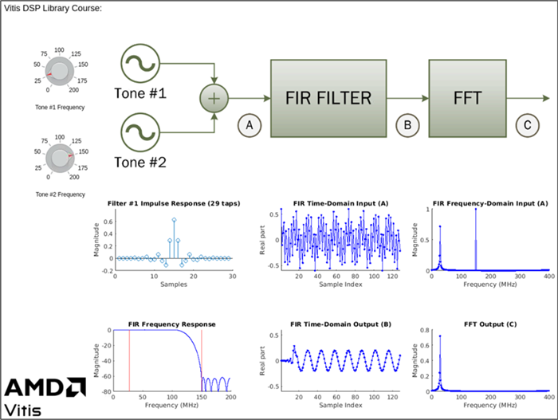

This tutorial implements the same MATLAB model using Vitis DSP libraries targeting AI Engines. The tutorial builds two different designs using the same IP with different system requirements, as shown in the following sections.

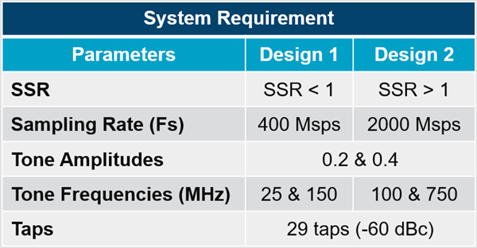

- In design 1, the sampling rate requirement is 400 mega samples per second (MSPS). Here, the super sample rate (SSR) is less than 1, because 400/1000 is less than 1. The AI Engine clock frequency is 1 GHz.
- In design 2, the sampling rate requirement is 2000 MSPS. Here, the SSR is greater than 1, because 2000/1000 is greater than 1. The AI Engine clock frequency is 1 GHz.

In both designs, set the number of taps to 29 to achieve ~-60 dBc stopband attenuation.

## Table of Contents

- [Part 1: Implementing design 1 (SSR<1)](#part-1-implementing-design-1-ssr1)
- [Part 2: Implementing Design 2 (SSR>1)](#part-2-implementing-design-2-ssr1)
- [Part 3: Implementing Design 1 using the Vitis IDE](#part-3-implementing-design-1-using-the-vitis-ide)
- [Part 4: Implementing Design 1 using the Vitis Model Composer](#part-4-implementing-design-1-using-the-vitis-model-composer)

## Objectives

- Create a DSP application using the AI Engine DSP library that targets the Versal adaptive SoC AI Engine
- Build and simulate the design using Vitis IDE and Makefile flow
- Implement the design using the Vitis Model Composer

## Tutorial Overview

This tutorial shows how to implement the two tone filter using Vitis DSP libraries targeting AI Engine. There are four parts in this tutorial:

- Part 1: Implementing design 1 (SSR<1)
- Part 2: Implementing design 2 (SSR>1)
- Part 3: Implementing design 1 using the Vitis IDE
- Part 4: Implementing design 1 using the Vitis Model Composer

## Part 1: Implementing design 1 (SSR<1)

### Designing Using the Vitis Libraries

#### Vitis DSP Libraries

In this step, identify the required functions available in the DSP library. This MATLAB model design requires a symmetrical FIR filter and FFT.

- DSPLib contains several variants of FIR filters. The library categorizes FIR filters into classes and places them in a distinct namespace `scope:xf::dsp::aie::fir` to prevent name collision in the global scope.
- DSPLib contains one FFT/iFFT solution: a single-channel, decimation-in-time (DIT) implementation. The solution has a configurable point size, data type, forward/reverse direction, scaling (as a shift), cascade length, static/dynamic point size, window size, interface API (stream/window), and parallelism factor.
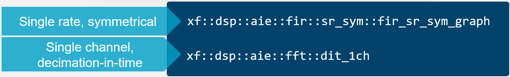

#### Configuring the FIR Parameters

The following figure shows the FIR parameters for design 1 (SSR<1).

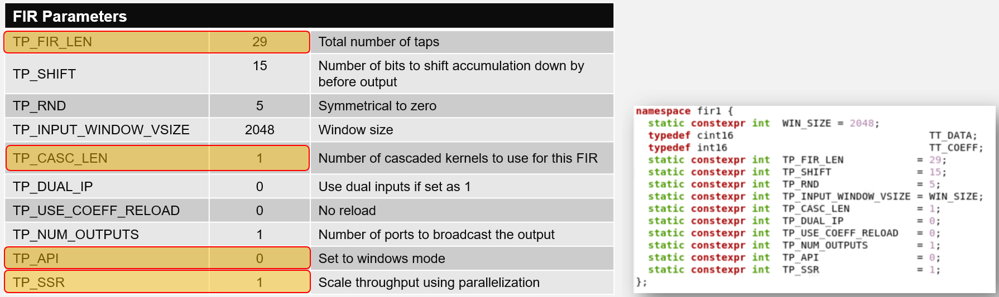

- TP_FIR_LEN is the total number of taps, set to 29.
- TP_CASC_LEN describes the number of AI Engine processors to split the operation over. This trades off resources against performance. In this design, set it to 1.
- Set TP_API to window type interface port.
- TP_SSR sets the parallelism factor. Set this parameter to 1.

#### Configuring the FFT Parameters

The following figure shows the FFT parameters for design 1 (SSR<1).

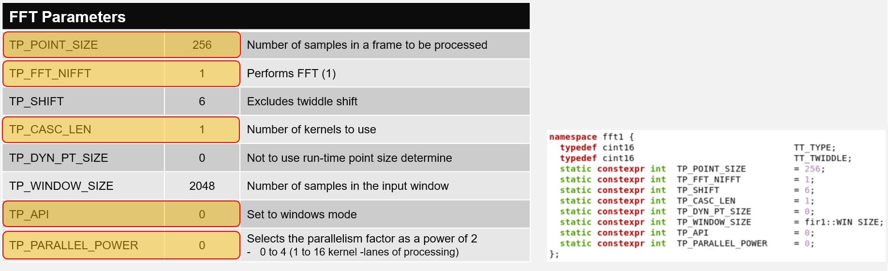

- TP_POINT_SIZE must be a power of 2 with a minimum value of 16. The library element supports a maximum value of 65536, but mapping limitations determine the achievable maximum. For instance, a single tile implementation can achieve a maximum of 4096, but this may require single rather than pingpong window interfaces depending on data type. Set this parameter to 256.
- TP_FFT_NIFFT can be set to forward or reverse transform. Set this parameter to 1 to perform FFT.
- TP_CASC_LEN splits the FFT/iFFT operation over multiple kernels in series, placing each subsequent kernel on an adjacent tile to achieve higher throughput. Set this parameter to 1.
- Set TP_API to window type interface port.
- TP_SSR sets the parallelism factor. Set this parameter to 1.

#### Passing the Parameters

Review the **`fir1_graph.h`** located in the `ssr_lt1/makefile_flow/src` directory.

- Observe the parameter configurations for FIR and FFT.
- The system passes configured parameters as arguments, as shown in the following figure.

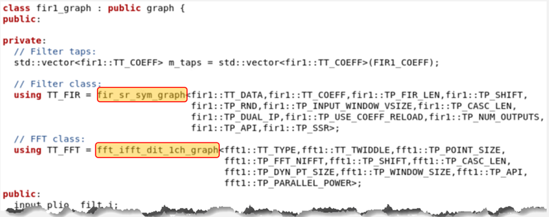

#### Connecting the Kernels (FIR and FFT)

After you configure the FIR and FFT parameters, connect the FIR and FFT. The code (**`fir1_graph.h`**) shows how to make the FIR and FFT connections.

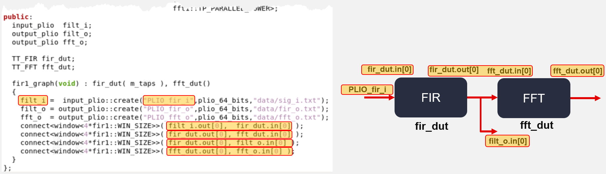

### Compiling and Simulating Design 1 for x86 Simulation to Verify Functional Correctness

#### Changing the Project Path

Follow these steps to change the project path:

1. Enter the following command to change the project path for SSR<1 design :

    ```bash
    cd ssr_lt1/makefile_flow
    ```

2. Set the PLATFORM_REPO_PATHS environment variable.

#### Sourcing the Vitis Tool

Enter the following command to source the Vitis tool:

```bash
source /<TOOL_INSTALL_PATH>/Vitis/2025.2/settings.sh
```

#### Setting the DSP Library Path

Enter the following command to set the library path:

```bash
export DSPLIB_ROOT=/<DSP_LIBRARY_PATH>/Vitis_Libraries/dsp
```

#### Generating the Configuration File

Run this command to generate the configuration file for the AI Engine compiler (aiecompiler):

```bash
make genConfigFile
```

This generates the following files for x86sim and aiesim compilation:

- aie_config_x86sim.cfg
- aie_config_hw.cfg

This file contains the aiecompiler configurations, source folder path, data folder path, platform details and target configuration. The system passes it to the v++ compiler.

#### Compiling the Design for x86 Simulation

Follow these steps to compile the design for x86 simulation:

1. Review the Makefile. Note that you can set TARGET to x86sim or hw.
2. Pass the argument for TARGET as x86sim.
3. Observe that the v++ compiler mode is set to `aie`, indicating that the aiecompiler was called. The configuration file generated in the previous step is passed here as `--config <CONFIG_FILE_NAME>`.

    ```Makefile
    ifeq ($(TARGET), x86sim)
      v++ -c --mode aie --config aie_config_x86sim.cfg ${DSPLIB_INCLUDE}
    else ifeq ($(TARGET), hw)
      v++ -c --mode aie --config aie_config_hw.cfg ${DSPLIB_INCLUDE}
    endif
    ```

4. Enter the following command to compile the design for x86sim:

    ```bash
    make aiecompile TARGET=x86sim
    ```

5. After successful compilation, simulate the design using the x86 simulator.

#### Simulating the Design Using the x86 Simulator

Enter the following command to simulate the design using the x86 simulator:

```bash
make x86sim
```

When the simulation stops, you can see that the simulation completed successfully. Verify the output files generated under `makefile_flow > x86simulator_output`. Compare the generated files with the golden files.

- Golden files: Located under `makefile_flow > data`
  - fir_o.txt (FIR output)
  - fft_o.txt (FFT output)
- Generated files after simulation: Located under `makefile_flow > x86simulator_output > data`
  - fir_o.txt
  - fft_o.txt

### Compiling and Simulating the Design using AIE Simulation (Cycle approximate - Emulate the Design on SystemC Model of AIE)

After verifying the design functional correctness is verified, compile the design for AIE Simulation (aiesim). In the Makefile, pass the TARGET as hw (by default, it is hw).

Enter the following command to clean the files and compile the design for aiesim:

```bash
make clean
make aiecompile TARGET=hw
```

After successful compilation, simulate the design using the aie simulator.

#### Simulating the Design using AIE Simulator

Enter the following command to simulate the design using aiesimulator:

```bash
make profile
```

This make take few minutes to complete the simulation.

When the simulation stops, you can see that the simulation completed successfully. Verify the output files generated under `makefile_flow > aiesimulator_output > data`. Compare the generated files with the golden files.

- Golden files: Located under `makefile_flow > data`
  - fir_o.txt (FIR output)
  - fft_o.txt (FFT output)
- Generated files after simulation: Located under `makefile_flow > aiesimulator_output > data`
  - fir_o.txt
  - fft_o.txt

Now the generated files have the time stamp for the outputs.

#### Analyzing the Design

After the aie simulation completes, analyze the results.

1. Enter the following command to analyze the reports using Vitis Analyzer:

    ```bash
    make analyze
    ```

    This command launches the Vitis Analyzer tool and you can review the reports.

    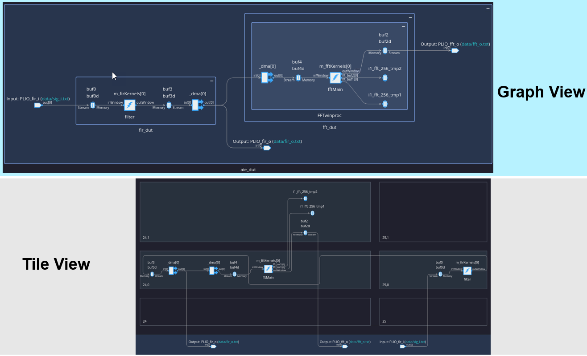

2. Select the Graph report. In Graph View, view the connections between the kernels and the buffers used. Use the Tile view to analyze the tiles mapped for the kernels and the buffers.

    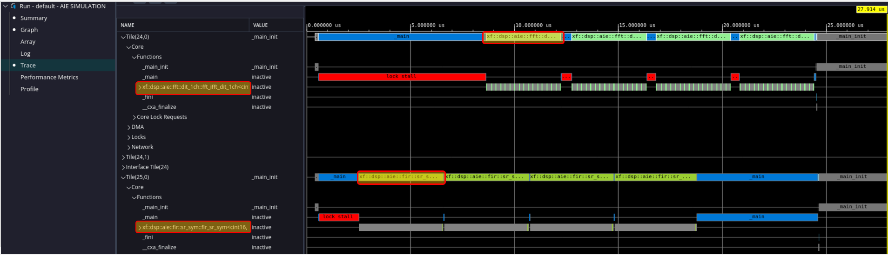

3. Select the Trace report. Each tile is reported in the Trace report. Within each tile the report includes core, DMA, locks, and I/O if there are PL blocks in the graph.

>**Note:** When using trace view, examine the waveform within the 0 to 25 µs range.

Notice that the FIR started processing (Tile: 25,0). After the first set of data is ready, FFT started processing (Tile: 24,0) the data and sending the processed output.

#### Verifying the Performance

Follow these steps to observe the throughput of the design:

1. In the Graph View, select the *I/O* tab and observe the **Throughput** column for each ports.

   The output PLIO port (PLIO_fft_o) throughput shows the value 2307.08 MB/s. To get the throughput in samples per second, divided it by four because the data type used is cint16, which is four bytes in size. This gives a throughput value of 576.77 MSPS.

2. Close the Vitis Analyzer.

    Optional: By running the make throughput command, it lists the throughput for the FIR and FFT output. This uses the custom python script which reads the time stamp from the output file and displays the value.

3. Enter the following command to analyze the throughput:

    ```bash
    make throughput
    ```

Per the design requirement for design 1, the required sampling rate is 400 MSPS. The achieved sampling rate is ~576 MSPS.

After reviewing the reports, close the Vitis Analyzer.

## Part 2: Implementing Design 2 (SSR>1)

In Design 2, the sampling rate requirement is 2000 MSPS.

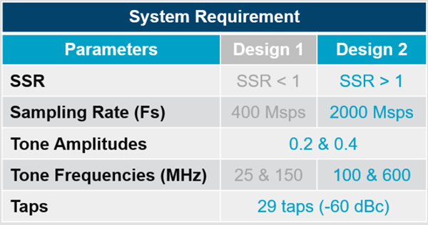

You can achieve this by using multiple AI Engines.

### Modifying the FIR and FFT Parameters to Achieve the Desired Sampling Rate

#### Modifying the FIR Parameters

Modify the configuration for the FIR filter parameters to meet design 2 requirements.

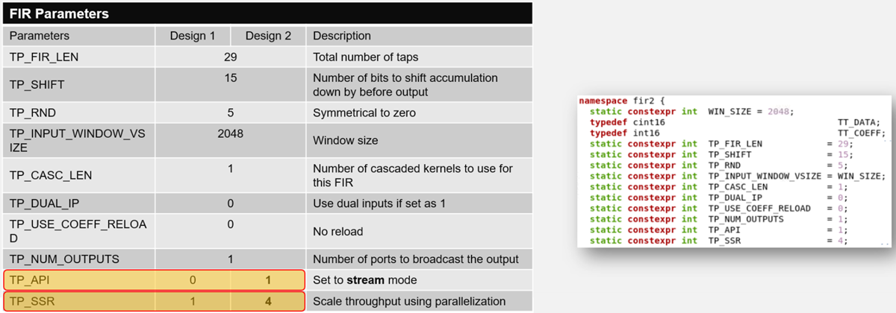

- TP_API is set to stream type interface port.
- TP_SSR sets a parallelism factor. This is set to 4. This ensures that the system uses multiple AI Engines to increase the design throughput.

These changes are made to achieve the required sampling rate of 2000 MSPS.

#### Modifying the FFT Parameters

Similarly, modify the configuration of the FFT parameters to meet the new design requirements.

The following table shows the modified FFT parameters:

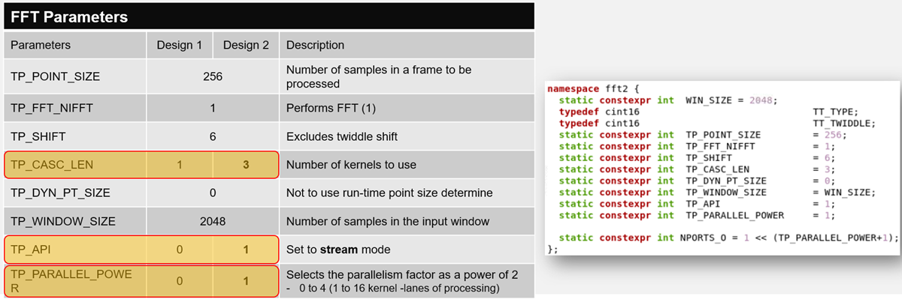

TP_CASC_LEN splits the FFT/iFFT operation over multiple kernels in series, placing each subsequent kernel on an adjacent tile to achieve higher throughput. Per the design requirement, the target is to achieve 2000 MSPS. To get this result, set it to 3.

TP_API is set to stream type interface port.

TP_PARALLEL_POWER is set to 1. If it is greater than 0, TP_CASC_LEN applies to the subframe FFT rather than the FFT as a whole. TP_PARALLEL_POWER improves performance and supports point sizes beyond the limitations of a single tile.

#### Determining the Optimal Number of Kernels: Sizing Guidelines and Metrics

Use the Vitis Analyzer tool to inspect the number of cycles each kernel takes and compare this to the target requirements. A useful approach is to start with TP_CASC_LEN set to 1 and then increase the value until your target throughput is met. For FFTs, extending TP_CASC_LEN essentially spreads the FFT stages across multiple tiles, using software pipelining principles to increase throughput. The system often achieves the highest throughput when a single AI Engine tile is applied to each FFT or inverse FFT stage.

### Compiling and Simulating Design 2 for x86 Simulation to Verify Functional Correctness

Ensure that you set the DSPLIB_ROOT environment variable and generate the configuration file for the previous design. If you have not completed these steps, set the DSPLIB_ROOT environment variable and generate the configuration file as explained earlier.

All the parameter modifications are already complete.

#### Changing the Project Path for Design 2

Enter the following command to change the project path for SSR>1 design :

```bash
cd ../../ssr_gt1
```

#### Compiling Design 2 for x86 Simulation

Enter the following command to compile the design for x86 simulation:

```bash
make aiecompile TARGET=x86sim
```

After the successful compilation, simulate the design using x86 simulator.

#### Simulating Design 2 Using the x86 Simulator

Enter the following command to simulate the design for x86 simulator:

```bash
make x86sim_all2
```

When the simulation stops, you can see that the simulation completed successfully. You can verify the output files generated under `ssr_gt1 > x86simulator_output`. Compare the generated files with the golden files. There are four outputs for FIR and FFT.

### Compiling and Simulating Design 2 for AIE Simulation (Cycle approximate - Emulate the design on SystemC model of AIE)

Enter the following command to compile the design for aiesimulator:

```bash
make aiecompile TARGET=hw
```

This can take a few minutes to complete. After the successful compilation, simulate the design using aiesimulator.

#### Simulating Design 2 Using AIE Simulator

Enter the following command to simulate the design for AIE Simulator:

```bash
make profile_all2
```

#### Analyzing Design 2

After the AIE simulation completes, analyze the results. Enter the following command to analyze the reports using the Vitis Analyzer:

```bash
make analyze
```

Select the Graph view and verify the number of FIR kernels. Similarly, verify the number of FFTs implemented.

Review reports such as Array and Trace.

#### Verifying the Performance of Design 2

Next step is to verify the performance of the design.

In the Graph View, select the *I/O* tab and observe the **Throughput** column for each ports.

The output of four PLIO ports (PLIO_fft_o_0, PLIO_fft_o_1, PLIO_fft_o_2, PLIO_fft_o_3) throughput shows 2853.55, 2851.97, 2852.36, 2852.76 MB/s, respectively for each ports. To get the throughput in samples per second, divide this throughput by four because the data type used is cint16, which is four bytes in size. This gives a throughput value of for each ports ~713 MSPS. There are four outputs and combined throughput of all output is ~2853 MSPS.

[Optional]: The make throughput command lists the throughput for the FIR and FFT output. It uses a custom Python script which reads the time stamp from the output file and displays the value.

Enter the following command to analyze the throughput:

```bash
make throughput_all2
```

Per the design requirement for design 2, the required sampling rate is 2000 MSPS. The achieved sampling rate is ~2853 MSPS. There are four outputs and combined throughput of all output is ~2853 MSPS.

After completing the review, close the Vitis Analyzer.

## Part 3: Implementing Design 1 using the Vitis IDE

This section implements design 1 (SSR<1) using Vitis Unified IDE.

### Launching the Vitis IDE and Creating the AI Engine Component

#### Launching Vitis Unified IDE

First source the Vitis tool and launch the Vitis Unified IDE. Enter the following command to launch Vitis Unified IDE:

```bash
vitis -w <PATH_TO_WORKSPACE>
```

>**Note:** <PATH_TO_WORKSPACE> is `ssr_lt1/ide_flow` directory.

#### Creating the AI Engine Component

Follow these steps to create a new AI Engine component:

1. Select **File > New Component > AI Engine**.
2. Enter the Component name as `aie_ssr_lt1` and click **Next**.

#### Adding Design Files

Follow these steps to add the design files:

1. Add design files by clicking the  button.
2. Browse to the folder location `ssr_lt1/makefile_flow/src` and select the following files and then click **Open**:

    - fir1_app.cpp
    - fir1_coeff.h
    - fir1_graph.h

   Note that the top-level file is selected as **`fir1_app.cpp`**.

3. Add the following folder which contains test vectors by clicking the  button.

      - data

4. Click **Next**.

#### Selecting the Platform

Follow these steps to select the platform:

1. Select the platform as *xilinx_vck190_base_202520_1*.
2. Click **Next** and review the Summary and then select **Finish**.

After closing the summary, you can see the Vitis Unified IDE. Review the following:

- New AIE Component named as `aie_ssr_lt1`
  - Design files under *Sources*
  - data folder under *Sources*
- Flow Navigator
- AI Engine Component Settings
  - Selected Platform listed here

#### Adding the DSP Library

Follow these steps to add the DSP library path to the project:

1. Expand **aie_ssr_lt1 > Settings**.
2. Double-click `aiecompiler.cfg` to add the DSP library path.
3. Select the Source Editor and add the DSP library path as shown below:

    ```bash
    include=<DSPLIB_ROOT>/Vitis_Libraries/dsp/L2/include/aie
    include=<DSPLIB_ROOT>/Vitis_Libraries/dsp/L1/include/aie
    include=<DSPLIB_ROOT>/Vitis_Libraries/dsp/L1/src/aie
    ```

    >**Note:** Replace the <DSPLIB_ROOT> with the actual path location.

    After adding the path, it should look like this:
    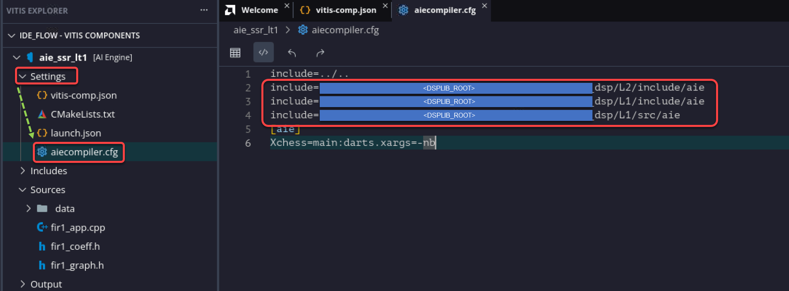

4. Save the file.

### Compiling and Simulating Design 1 for x86 Simulation to Verify Functional Correctness Using Vitis IDE

#### Compiling Design 1 for x86 Simulation

Click **Build** under *X86 SIMULATION* in Flow navigator to compile the project for x86 simulation.

After the successful compilation, simulate the design using x86 simulation.

#### Simulating Design 1 using x86 Simulator

Follow these steps to simulate the design using x86 simulator:

1. Click **Run** under *X86 SIMULATION* in Flow navigator to simulate the project for x86 simulation.
2. After the simulation is over, observe the output files generated under **Output > x86sim > x86simulator_output > data** directory.
3. Compare the results with the golden reference available under **aie_ssr_lt1 > Sources > data** directory.

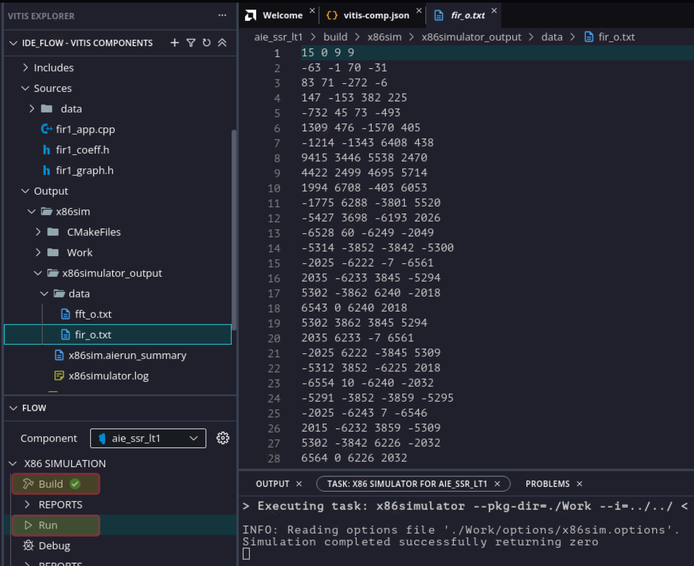

### Compiling and Simulating the Design for AIE Simulation (Cycle approximate - Emulate the design on SystemC model of AIE)

Click **Build** under *AIE SIMULATOR/HARDWARE* in Flow navigator to compile the project for AIE simulation.

After the successful compilation, simulate the design using aie simulation.

#### Simulating the Design using AIE simulator

Follow these steps to simulate the design using AIE simulator:

1. Before running the simulation, enable the trace and profile in the launch configuration.
2. Double-click the Open settings of the Run and enable the trace and profile in the launch configuration.,
3. Click **Run** under *AIE SIMULATOR/HARDWARE* in Flow navigator to simulate the project for AIE simulation.
4. After the simulation is complete, observe the output files generated under **Output > hw > aiesimulator_output > data** directory.

Compare the results with the golden reference available under data directory. Notice the timestamp is added for the outputs.

#### Analyzing Design 1

After the AIE simulation is complete, analyze the results. The Vitis Analyzer is integrated with the Vitis Unified IDE. You can see all the reports here.

Click **Graph** under *AIE SIMULATOR/HARDWARE > REPORTS*.
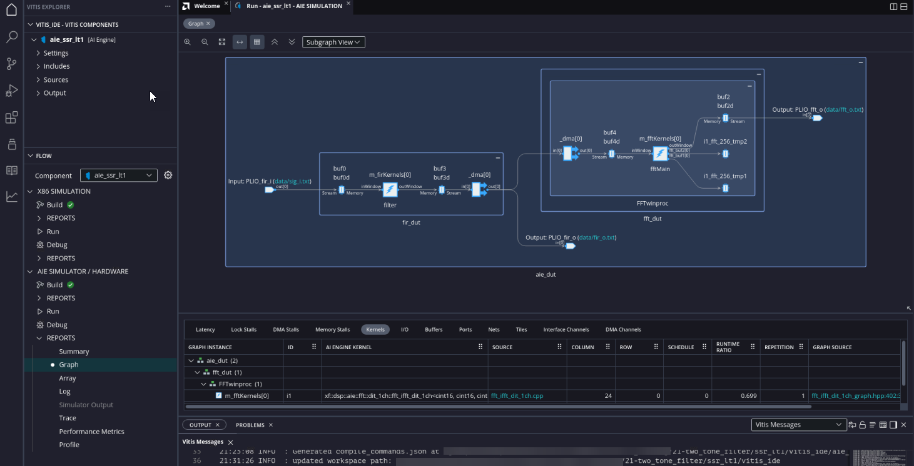

This Graph view allows to view the connections between kernels and the buffers used.

Similarly, review all other reports such as Array, Trace, etc.

Close the Vitis IDE.

## Part 4: Implementing Design 1 using the Vitis Model Composer

This section implements design 1 (SSR<1) using the Vitis Model Composer.

### Launching the Vitis Model Composer and Opening the Existing Design (Design 1)

#### Launching Vitis Model Composer

#### Changing the Project Path for Design 1

Follow these steps to change the project path for design 1:

1. Enter the following command to change the project path to vmc flow:

    ```bash
    cd ssr_lt1/vmc_flow
    ```

2. Open MATLAB by typing ```model_composer```.

    >**IMPORTANT:** Known Issue in 2025.1: Please follow the instructions given in the [Answer Record](https://adaptivesupport.amd.com/s/article/000038190?language=en_US) before running the below steps.

3. Browse to the project location `<YOUR_PATH>/21-two_tone_filer/ssr_lt1/vmc_flow` if required.
4. Double-click **`two_tone_filter.slx`**.

    This takes few minutes to open the project.

The blocks have been already added. Review the added blocks and simulate the design.

#### Reviewing the Blocks in the Library

Follow these steps to review the blocks in the library:

1. Click **Library Browser**.
2. In the Simulink **Library Browser**,  click **AMD Toolbox > AI Engine > DSP > Buffer IO**.
3. Review all the blocks available.

    The **FIR Symmetric** and **FFT** blocks are added from here.

4. After reviewing the available blocks, close the Simulink Library browser.

#### Reviewing the FIR and FFT Blocks Parameters

1. Double-click the **FIR Symmetric** block and review the FIR parameters settings based on design 1 requirements.

    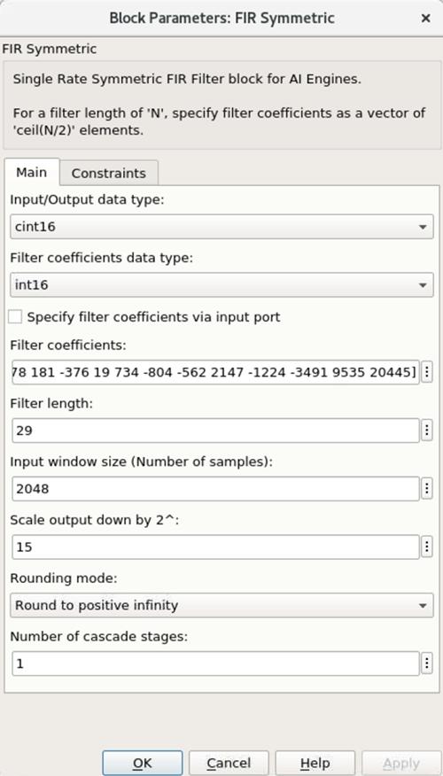

2. Similarly, review the FFT block and verify the parameters.

#### Verifying the FIR and FFT Blocks Connections

The input of FIR is connected using the PLIO block to set the PLIO width to 64 bits. FIR Symmetric block output is connected to the FFT block. The output of the FFT is connected with To Fixed Size block.

The outputs from FIR and FFT blocks are verified using comparators which compare the generated output with the golden reference file.

The comparator output of FIR and FFT goes to the FIR_Scope and FFT_Scope, respectively.

#### Running Simulation for these Blocks

Click **Run** and wait for the simulation to complete.

#### Verifying the Simulation Output for These Blocks

After the simulation completes, double-click **FIR_Scope** to see the results.

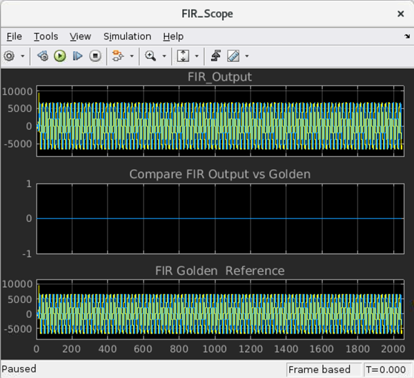

In this scope:

- The first is the FIR output.
- The second shows the difference between the FIR output and the golden reference.
- The last one is the FIR golden reference. You can see the design output matches with the golden reference.

Double-click **FFT_Scope** to verify the output generated by FFT.

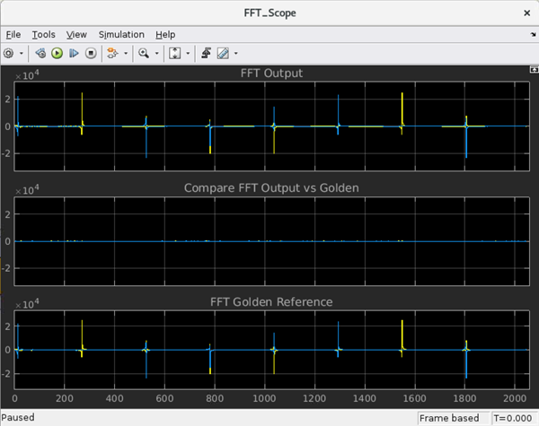

In this scope:

- The first is the FFT output.
- The second shows the difference between the FFT output and the golden reference.
- The last is the FFT golden reference. You can see the design output matches with the golden reference.

#### Generating Code Using the Hub block

For generating code, the top-level of the Vitis Model Composer model must contain:

- Vitis Model Composer Hub block
- The subsystem that encapsulates the application design

The Vitis Model Composer Hub block has been already added.

>**Note:** Remove the connection from FIR output to the To Fixed block.

Follow these steps to create a subsystem for the FIR and FFT blocks:

1. Right-click the FIR-FFT block and select **Create Subsystem from Area**.
2. Double-click **Vitis Model Composer Hub**. This opens the window where you can configure the code generation options.
3. Make sure the *Hardware selection* is proper by selecting the *Hardware Selection*. In this case, Versal AI Core Series device is selected.
4. In **Code Generation**, select **Subsystem** under *two_tone_filter* from the left window and enable the following option from the *Analyze* tab.
    - Collect trace data for Vitis Analyzer, viewing internal signals, and latency
5. Review the **Export** tab. You can generate the test bench and export the AIE subsystem.
6. Go back to the **Analyze** tab, click **Analyze** button.

    >**Note:** This can take a few minutes to complete the AIE simulation. You can see the progress in details.

    You can find the simulation results as *Simulation results MATCH* in the log. Click **OK**.

7. After the simulation completes, click **Open Vitis Analyzer** from the **Analyze** tab to review the report. Verify the graph and trace reports.
8. After the review completes, close the Vitis Analyzer and Model Composer tool.

### Conclusion

This tutorial demonstrated the following:

- How to create a DSP application using the AIE DSP library that targets Versal adaptive SoC AI Engines
- How to build and simulate using the Vitis Unified IDE and Makefile flow
- How to implement the design using the Vitis Model Composer

<hr class="sphinxhide"></hr>

<p class="sphinxhide" align="center"><sub>Copyright © 2021–2026 Advanced Micro Devices, Inc.</sub></p>

<p class="sphinxhide" align="center"><sup><a href="https://www.amd.com/en/corporate/copyright">Terms and Conditions</a></sup></p>
