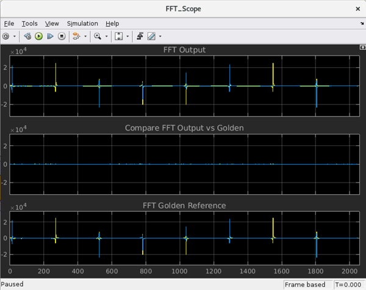

# Signal Processing on AI Engine Using Vitis DSP Libraries and Vitis Model Composer
### *Version: Vitis 2023.2* 
## Introduction
This tutorial guides you to design an FIR filter with an FFT using the DSP library targeting AMD Versal™ AI Engine.
## Before You Begin
Install the tools:
- Get and install **[MathWorks MATLAB® and Simulink® (R2021a or R2021b)](https://www.mathworks.com/products/get-matlab.html?s_tid=gn_getml)**
- Get and install **[AMD Vitis 2023.2](https://www.xilinx.com/support/download.html)**

> IMPORTANT: Before beginning the tutorial, make sure you have read and followed the Vitis Software Platform Release Notes (v2023.2) for setting up software and installing the VCK190 base platform.
## Overview
The algorithm designer creates a MATLAB model design, which has a two tone input signal. The FIR suppresses 1-tone from a 2-tone input signal. The output of the FIR filter connects to the FFT block. This FFT block acts as a monitor to display a spectrum plot.


Now the same MATLAB model will be implemented using the Vitis DSP libraries targeting AI Engine.
We will build two different designs using the same IP but with different system requirements as shown below.


In design 1, the sampling rate requirement is 400 Msps,  (where SSR < 1, because 400/1000 is less than 1. AI Engine clock frequency is 1 GHz).

In design 2, the sampling rate requirement is 2000 Msps (where SSR > 1 because 2000/1000 is greater than 1. AI Engine clock frequency is 1 GHz).

In both designs, the number of taps is fixed to 29 in order to achieve ~-60 dBc stop band attenuation.

# Table of Contents
- [Part1: Implementing design 1 (SSR<1)](#part-1-implementing-design-1-ssr1)
- [Part2: Implementing design 2 (SSR>1)](#part-2-implementing-design-2-ssr1)
- [Part3: Implementing design 1 using Vitis IDE](#part3-implementing-design-1-using-vitis-ide)
- [Part4: Implementing design 1 using Vitis Model Composer](#part4-implementing-design-1-using-vitis-model-composer)

## Objectives
- Create your DSP application using AI Engine DSP library targeting Versal AI Engine
- Build and simulate using Vitis IDE and makefile flow
- Implement the design using Vitis Model Composer

## Tutorial Overview
This shows how to implement the two tone filter using Vitis DSP libraries targeting AI Engine. There are four parts in this tutorial:
- Part1: Implementing design 1 (SSR<1)
- Part2: Implementing design 2 (SSR>1)
- Part3: Implementing design 1 using Vitis IDE
- Part4: Implementing design 1 using Vitis Model Composer

## Part 1: Implementing design 1 (SSR<1)
### Designing Using the Vitis Libraries
#### Vitis DSP Libraries
In this step, the user needs to identify the required functions available in the DSP library. For this MATLAB model design, we need a Symmetrical FIR filter and FFT. 
- The DSPLib contains several variants of Finite Impulse Response (FIR) filters. FIR filters have been categorized into classes and placed in a distinct namespace `scope:xf::dsp::aie::fir`, to prevent name collision in the global scope.
- The DSPLib contains one FFT/iFFT solution. This is a single channel, decimation in time (DIT) implementation. It has configurable point size, data type, forward/reverse direction, scaling (as a shift), cascade length, static/dynamic point size, window size, interface api (stream/window) and parallelism factor.

 
#### Configure the FIR Parameters
Now, configure the FIR filter parameters based on design 1 requirements (SSR < 1).
The below figure shows the FIR parameters for design 1 (SSR<1).

- TP_FIR_LEN is the total number of taps which is set to 29. 
- TP_CASC_LEN which describes the number of AIE processors to split the operation over, which allows resources to be traded off against performance. In this design it is set to 1.
- TP_API is set to window type interface port.
- TP_SSR sets a parallelism factor which is set to 1. 

#### Configure the FFT Parameters
The below figure shows the FFT parameters for design 1 (SSR<1).

- TP_POINT_SIZE must be a power of 2 with a minimum value of 16. The maximum value supported by the library element is 65536, but the achievable maximum will be determined by mapping limitations. For instance, a single tile implementation can achieve a maximum of 4096, but this may require single rather than pingpong window interfaces depending on data type. It is set to 256.
- TP_FFT_NIFFT can be set to forward or reverse transform. It is set to 1 to perform FFT.
- TP_CASC_LEN splits the FFT/IFFT operation over multiple kernels in series, with each subsequent kernel being placed on an adjacent tile. This is to achieve higher throughput. This is set to 1.
- TP_API is set to window type interface port.
- TP_SSR sets a parallelism factor which is set to 1. 

#### Passing the Parameters
Review the **`fir1_graph.h`** located under `two_tone_filter/ssr_lt1/makefile_flow/src` directory. 
- Observe the parameter configurations for FIR and FFT. 
- Configured parameters are passed as an argument as shown here.


#### Connect the Kernels (FIR and FFT)
Both the FIR and FFT parameters has been configured and the next step is to connect the FIR and FFT. The code (**`fir1_graph.h`**) shows the connection how the FIR and FFT connections are made.


### Compile and Simulate the Design 1 for x86 Simulation to Verify the Functional Correctness
#### Change the Project Path
Enter the following command to change the project path for SSR<1 design :
```
cd two_tone_filter/ssr_lt1/makefile_flow
```
Make sure to set the PLATFORM_REPO_PATHS environment variable.

#### Source the Vitis tool 
Enter the following command to source the Vitis tool:
```
source /<TOOL_INSTALL_PATH>/Vitis/2023.1/settings.sh
```

#### Set the DSP Library Path

Enter the following command to set the library path:
```
export DSPLIB_ROOT=/<DSP_LIBRARY_PATH>/Vitis_Libraries/dsp
```

#### Generate the Configuration File
In this step, we generate the configuration file for the AI Engine compiler (aiecompiler). 
```
make genConfigFile
```

This generates the following files for x86sim and aiesim compilation:
- aie_config_x86sim.cfg
- aie_config_hw.cfg 

This file contains the aiecompiler configurations, source folder path, data folder path, platform details and target configuration. This file will be passed to the v++ compiler.

#### Compile the Design for x86 Simulation
Now, we will compile the design for x86 simulation. Review the makefile, and notice that the TARGET can be set to x86sim or hw. We will now pass the argument for TARGET as x86sim.

Observe that the v++ compiler mode is set to aie. This is indicating that the aiecompiler will be called. Configuration file generated in the previous step is passed here as --config <CONFIG_FILE_NAME>. 

``` Makefile
ifeq ($(TARGET), x86sim)
	v++ -c --mode aie --config aie_config_x86sim.cfg ${DSPLIB_INCLUDE}
else ifeq ($(TARGET), hw)
	v++ -c --mode aie --config aie_config_hw.cfg ${DSPLIB_INCLUDE}
endif
```

Enter the following command to compile the design for x86sim:
```
make aiecompile TARGET=x86sim
```
After the successful compilation, simulate the design using x86 simulator.

#### Simulate the Design using x86 Simulator
Enter the following command to simulate the design using x86 simulator:
```
make x86sim
```
When the simulation stops, you should see the simulation completed successfully. You can verify the output files generated under `makefile_flow > x86simulator_output`. Compare the generated files with the golden files.

- Golden files: Located under `makefile_flow > data`
    - fir_o.txt (FIR output)
    - fft_o.txt (FFT output)
- Generated files after simulation: Located under `makefile_flow > x86simulator_output > data`
    - fir_o.txt
    - fft_o.txt

### Compile and Simulate the Design using AIE Simulation (Cycle approximate - Emulate the design on SystemC model of AIE)

The design functional correctness has been verified. Now, we will compile the design for AIE Simulation (aiesim). In the makefile, pass the TARGET as hw (by default, it is hw). 

Enter the following command to clean the files and compile the design for aiesim:
```
make clean
make aiecompile TARGET=hw
```
After the successful compilation, simulate the design using aie simulator.

#### Simulate the Design using AIE Simulator
Enter the following command to simulate the design using aiesimulator:
```
make profile
```

This make take few minutes to complete the simulation.

When the simulation stops, you should see the simulation completed successfully. You can verify the output files generated under `makefile_flow > aiesimulator_output > data`. Compare the generated files with the golden files.

- Golden files: Located under `makefile_flow > data`
    - fir_o.txt (FIR output)
    - fft_o.txt (FFT output)
- Generated files after simulation: Located under `makefile_flow > aiesimulator_output > data`
    - fir_o.txt
    - fft_o.txt

Now the generated files have the time stamp for the outputs.   

#### Analyze the Design 
Once the AIE simulation is complete, then analyze the results.
Enter the following command to analyze the reports using Vitis Analyzer:
```
make analyze
```
This command launches the Vitis Analyzer tool and you can review the reports.

Select the Graph report. In Graph View, you can view the connections between the kernels and the buffers used. Tile view helps to analyze the tiles mapped for the kernels and the buffers.


Select the Trace report. Trace report includes the following.
Each tile is reported. Within each tile the report includes core, DMA, locks, and I/O if there are PL blocks in the graph.

You can notice that the FIR started processing (Tile: 25,0) and once the first set of datas are ready, then FFT started processing (Tile: 24,0) the data and send the processed output. 

After reviewing the reports, close the Vitis Analyzer.

#### Verify the Performance

Next step is to verify the performance of the design.

By running the make throughput command, it lists the throughput for the FIR and FFT output. This uses the custom python script which reads the time stamp from the output file and displays the value.

Enter the following command to analyze the throughput:
```
make throughput
```

As per the design requirement, for the design 1, the required sampling rate is 400 Msps and we were able to achieve ~574 Msps.

## Part 2: Implementing design 2 (SSR>1)
In Desgin 2, the sampling rate requirement is 2000 Msps as given below.


We can achieve this by utilizing multiple AI Engines.

### Modifying the FIR and FFT Parameters to Achieve the Desired Sampling Rate
#### Modify the FIR Parameters 
We have to modify the configuration for the FIR filter parameters to meet the design 2 requirements.


TP_API is set to stream type interface port. 

TP_SSR sets a parallelism factor which is set to 4. This ensures multiple AI engines are used to increase the design throughput.

These changes are made to achieve the required sampling rate 2000 Msps.

#### Modify the FFT Parameters 
Similarly, we have to modify the configuration for the FFT parameters to meet our new design requirements.

The table shows the modified FFT parameters:


TP_CASC_LEN splits the FFT/IFFT operation over multiple kernels in series, with each subsequent kernel being placed on an adjacent tile. This is to achieve higher throughput. As per the design requirement, we need to achieve 2000 Msps. To get this result, it is set to 3.

TP_API is set to stream type interface port.

TP_PARALLEL_POWER is set to 1. If greater than 0, TP_CASC_LEN applies to the subframe FFT rather than the FFT as a whole. TP_PARALLEL_POWER is intended to improve performance and also allows support of point sizes beyond the limitations of a single tile.

#### How do we determine that 3 was the proper number of kernels to use? What sizing guidelines or metrics indicate that 3 would be a good number?

Generally, we use our Vitis Analyzer tool to inspect the number of cycles each kernel is taking and comparing this to our target requirements. A useful approach is to start with TP_CASC_LEN set to 1 and then increase the value until your target throughput is met. For FFT's, extending TP_CASC_LEN essentially spreads the FFT stages across multiple tiles, using software pipelining principles to increase throughput. Often the highest throughput is achieved when a single AI Engine tile is applied to each FFT or IFF stage.

### Compile and Simulate the Design 2 for x86 Simulation to Verify the Functional Correctness

Make sure you have done the DSPLIB_ROOT and generate configuration file has been done in the previous design. In case, you have not done please set the DSPLIB_ROOT environment variable and then generate the configuration file as explained earlier.

All the parameter modifications has been already made. 
#### Change the Project Path
Enter the following command to change the project path for SSR>1 design :
```
cd ../../ssr_gt1
```

#### Compile the Design for x86 Simulation
Enter the following command to compile the design for x86 simulation:
```
make aiecompile TARGET=x86sim
```
After the successful compilation, simulate the design using x86 simulator.

#### Simulate the Design using x86 Simulator
Enter the following command to simulate the design for x86 simulator:
```
make x86sim_all2
```
When the simulation stops, you should see the simulation completed successfully. You can verify the output files generated under `ssr_gt1 > x86simulator_output`. Compare the generated files with the golden files. There are four outputs for FIR and FFT.

### Compile and Simulate the Design for AIE Simulation (Cycle approximate - Emulate the design on SystemC model of AIE)
Enter the following command to compile the design for aiesimulator:
```
make aiecompile TARGET=hw
```
This make take few minutes to complete. After the successful compilation, simulate the design using aiesimulator.

#### Simulate the Design using AIE Simulator
Enter the following command to simulate the design for AIE Simulator:
```
make profile_all2
```

#### Analyze the Design 
Once the AIE simulation is complete, then analyze the results.
Enter the following command to analyze the reports using Vitis Analyzer:
```
make analyze
```
Select the Graph view and verify the number of FIR kernels. Similarly, verify the number of FFTs implemented.


Review reports such as Array and Trace. Once you complete the review, close the Vitis Analyzer.

#### Verify the Performance
Next step is to verify the performance of the design.

By running the make throughput command, it lists the throughput for the FIR and FFT output. This uses the custom python script which reads the time stamp from the output file and displays the value.

Enter the following command to analyze the throughput:
```
make throughput_all2
```

As per the design requirement, for the design 2, the required sampling rate is 2000 Msps and we were able to achieve ~2800 Msps. There are four outputs and combined throughput of all output is ~2800 Msps.

## Part3: Implementing design 1 using Vitis IDE
We will implement design 1 (SSR<1) using Vitis Unified IDE.

### Launch Vitis and Create AI Engine Component
#### Launch Vitis Unified IDE
First source the Vitis tool and launch the Vitis Unified IDE.
Enter the following command to launch Vitis Unified IDE:
```
vitis -w <PATH_TO_WORKSPACE>
```
Note: <PATH_TO_WORKSPACE> is `two_tone_filter/ssr_lt1/ide_flow` directory
#### Create AIE Component
Select **File > New Component > AI Engine**.

Enter the Component name as `aie_ssr_lt1` and click **Next**.

#### Add the design files
Add the files by clicking  button.

Browse to the folder location `two_tone_filter/ssr_lt1/makefile_flow/src` and select the following files and then click **Open**:
- fir1_app.cpp
- fir1_coeff.h
- fir1_graph.h

Note that the top-level file is selected as **`fir1_app.cpp`**.

Add the following folder which contains test vectors by clicking  button.
- data

Click **Next**.

#### Select the Platform
Select the platform as *xilinx_vck190_base_202320_1*.

Click **Next** and review the Summary and then select **Finish**.

After closing the summary, you will see the Vitis Unified IDE. Review the following:
 - New AIE Component named as `aie_ssr_lt1`
    - Design files under *Sources*
    - data folder under *Sources*
- Flow Navigator
- AI Engine Component Settings
    - Selected Platform listed here


#### Add the DSP Libary
Expand **aie_ssr_lt1 > Settings**.

Double-click `aiecompiler.cfg` to add the DSP library path.

Select the Source Editor and add the DSP library path as shown below:

```
include=<DSPLIB_ROOT>/Vitis_Libraries/dsp/L2/include/aie
include=<DSPLIB_ROOT>/Vitis_Libraries/dsp/L1/include/aie
include=<DSPLIB_ROOT>/Vitis_Libraries/dsp/L1/src/aie
```
Note: Replace the <DSPLIB_ROOT> with the actual path location.

After adding the path, it should look like this:


Save the file.

### Compile and Simulate the Design 1 for x86 Simulation to Verify the Functional Correctness

#### Compile the Design for x86 Simulation
Click **Build** under *X86 SIMULATION* in Flow navigator to compile the project for x86 simulation.

After the successful compilation, simulate the design using x86 simulation.

#### Simulate the Design using x86 Simulator
Click **Run** under *X86 SIMULATION* in Flow navigator to simulate the project for x86 simulation.

After the simulation is over, observe the output files generated under **Output > x86simulator_output > data** directory.

Compare the results with the golden reference available under **aie_ssr_lt1 > Sources > data** directory.


### Compile and Simulate the Design for AIE Simulation (Cycle approximate - Emulate the design on SystemC model of AIE)
Click **Build** under *AIE SIMULATOR/HARDWARE* in Flow navigator to compile the project for AIE simulation.

After the successful compilation, simulate the design using aie simulation.

#### Simulate the Design using AIE simulator
Before running the simulation, enable the trace and profile in the launch configuration.

Double-click the Open settings of the Run and enable the trace and profile in the launch configuration.,

Click **Run** under *AIE SIMULATOR/HARDWARE* in Flow navigator to simulate the project for AIE simulation.

After the simulation is over, observe the output files generated under **Output > hw > aiesimulator_output > data** directory.

Compare the results with the golden reference available under data directory. Notice the timestamp is added for the outputs.

#### Analyze the Design 
Once the AIE simulation is complete, then analyze the results.
Vitis Analyzer is integrated with the Vitis Unified IDE. You can see all the reports here.

Click **Graph** under *AIE SIMULATOR/HARDWARE > REPORTS*.


This Graph view allows to view the connections between kernels and the buffers used.

Similarly, review all other reports such as Array, Trace, etc. 

Close the Vitis IDE.

## Part4: Implementing design 1 using Vitis Model Composer
We will implement design 1 (SSR<1) using Vitis Model Composer.

### Launch Vitis Model Composer and Open the existing design (Design 1)
#### Launch Vitis Model Composer 

#### Change the Project Path
Enter the following command to change the project path to vmc flow:
```
cd ../vmc_flow
```
Open MATLAB by typing ```model_composer```.

Browse to the project location `<YOUR_PATH>/two_tone_filer/ssr_lt1/vmc_flow` if required.

Double-click **`two_tone_filter.slx`**. 

This takes few minutes to open the project.

The blocks has been already added and you will review the added blocks and simulate the design.

#### Review the Blocks in Library

Click **Library Browser**.

In the Simulink **Library Browser**,  click **AMD Toolbox > AI Engine > DSP > Buffer IO**.

Review all the blocks available.

We have added **FIR Symmetric** and **FFT** block from here.

After reviewing the available blocks, close the Simulink Library browser.

#### Review the FIR and FFT Blocks Parameters

Double-click the **FIR Symmetric** block and review the FIR parameters settings done based on design 1 requirements.


Similarly, review the FFT block and verify the parameters.

#### Verify the FIR and FFT Blocks Connections.

We have connected the input of FIR using PLIO block. This is done to set the PLIO width to 64 bits.

FIR Symmetric block output is connected to FFT block.

The ouput of FFT is connected with To Fixed Size block.

The ouputs from FIR and FFT blocks are verified using the comparators which compares the generated output with the golden reference file.

The comparator ouput of FIR and FFT separately goes to the  FIR_Scope and FFT_Scope respectively.

#### Run the Simulation for these blocks.

Click **Run** and wait for the simulation to complete.

#### Verify the Simulation output for these blocks.

Once the simulation is over, double-click **FIR_Scope** to see the results.


In this scope, the first is the FIR output, the second one shows the difference between the FIR output and the golden reference, and the last one is the FIR golden reference. You can see the design output matches with the golden reference. 

Double-click **FFT_Scope** to verify the output generated by FFT.



In this scope, the first is the FFT output, the second one shows the difference between the FFT output and the golden reference, and the last one is the FFT golden reference. You can see the design output matches with the golden reference. 


#### Code Generation using the Hub block
For the code generation, the top-level of the Vitis Model Composer model must contain:
- Vitis Model Composer Hub block
- The subsystem that encapsulates the application design

Vitis Model Composer Hub block has been already added.

Note: Remove the connection from FIR output to the To Fixed block.

Right-click the FIR-FFT block and select **Create Subsystem from Area**.

Double-click **Vitis Model Composer Hub**. This opens the window where you can configure the code generation options.

Select **FIR-FFT** under *two_tone_filter* from the left window and enable the following options from the AIE Settings tab.
- Create Testbench
- Run cycle-approximate AIE simulation (SystemC) after code generation
- Collect trace data for Vitis Analyzer

After completing the above selections, click **Generate** button.

Note: This may take few minutes (5-7 mins) to complete the aie simulation. You can see the progress in details.

Once the simulation is done, it launches the Vitis Analyzer and review the report. Verify the Graph and trace reports.

Once the review is done, close the Vitis Anlyzer and Model Composer tool.

# Conclusion
This tutorial has demonstrated the following:
- How to create your dsp application using AI DSP library targeting Versal AI Engine
- How to build and simulate using Vitis Unified IDE and makefile flow
- How to implement the design using Vitis Model Composer


