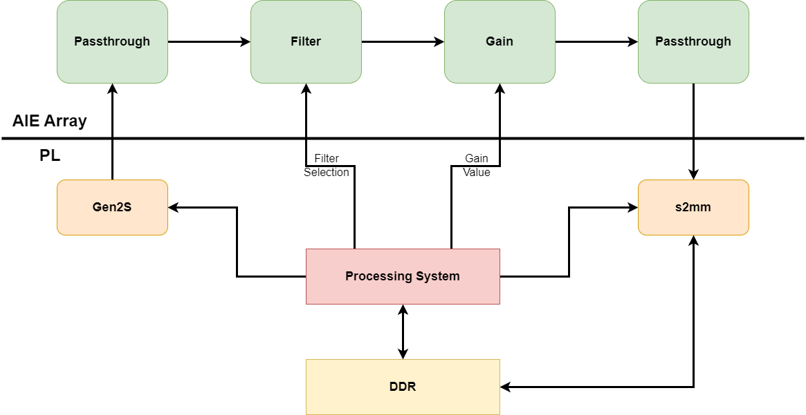
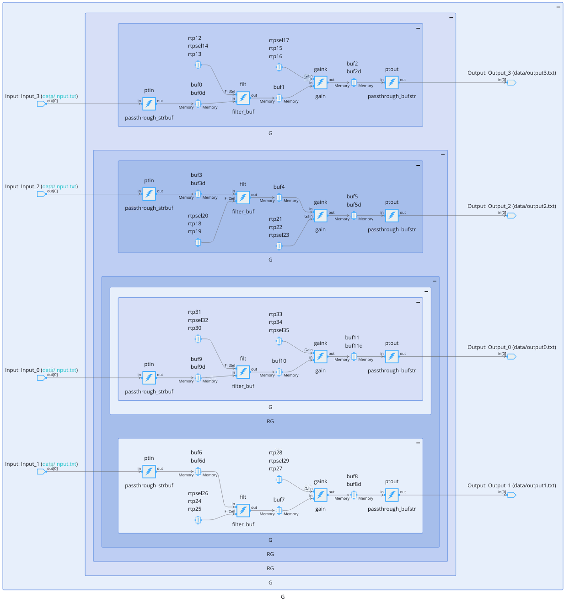
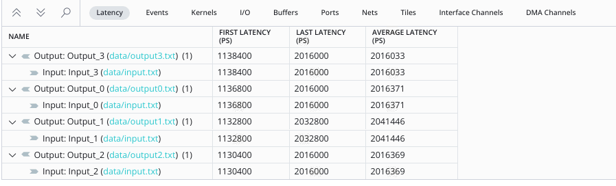
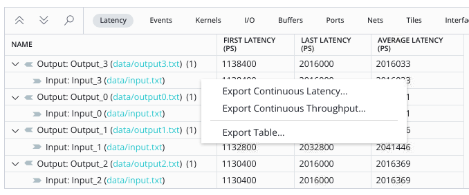
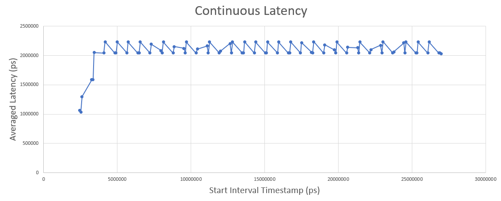
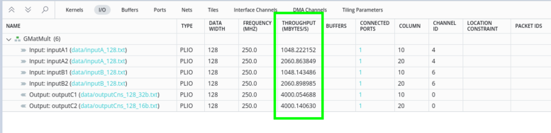
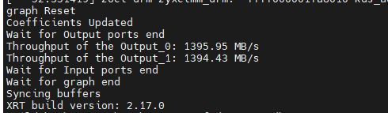
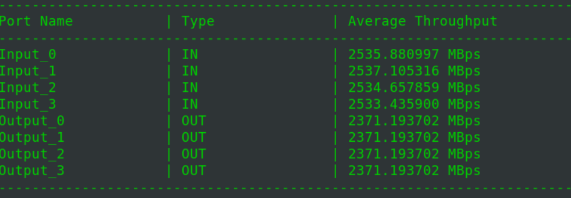
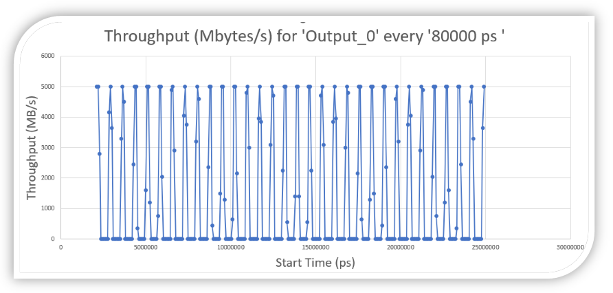

<table class="sphinxhide" width="100%">
 <tr width="100%">
    <td align="center"><h1>AI Engine Development</h1>
    <a href="https://www.xilinx.com/products/design-tools/vitis.html">See Vitis™ Development Environment on xilinx.com</br></a>
    <a href="https://www.xilinx.com/products/design-tools/vitis/vitis-ai.html">See Vitis™ AI Development Environment on xilinx.com</a>
    </td>
 </tr>
</table>

# Performance Validation in Analysis View of the Vitis Unified IDE

***Version: Vitis 2024.1***

## Introduction

AMD Versal&trade; adaptive SoCs combine Scalar Engines, Adaptable Engines, and Intelligent Engines with leading-edge memory and interfacing technologies to deliver powerful heterogeneous acceleration for any application.

This tutorial demonstrates creating a system design running on the AI Engine, PS, and Programmable Logic (PL). The AI Engine domain contains a simple graph consisting of four kernels - the first Passthrough, Filter, Gain and the second Passthrough kernel.

**IMPORTANT**: Before beginning the tutorial ensure you have installed Vitis&trade; 2024.1 software. The software includes all the embedded base platforms including the VCK190 base platform that is used in this tutorial. In addition, ensure you have downloaded the Common Images for Embedded Vitis Platforms from this link.

https://www.xilinx.com/support/download/index.html/content/xilinx/en/downloadNav/embedded-platforms/2024.1.html

The 'common image' package contains a prebuilt Linux kernel and root file system that can be used with the Versal board for embedded design development using Vitis.
Before starting this tutorial run the following steps:

1. Navigate to the directory where you have unzipped the Versal Common Image package.
2. In a Bash shell, run the ```/Common Images Dir/xilinx-versal-common-v2024.1/environment-setup-cortexa72-cortexa53-xilinx-linux``` script. This script sets up the SDKTARGETSYSROOT and CXX variables. If the script is not present, you must run the ```/Common Images Dir/xilinx-versal-common-v2024.1/sdk.sh```.
3. Set up your ROOTFS, and IMAGE to point to the ```rootfs.ext4``` and Image files located in the ```/Common Images Dir/xilinx-versal-common-v2024.1``` directory.
4. Set up your PLATFORM_REPO_PATHS environment variable to ```$XILINX_VITIS/lin64/Vitis/2024.1/base_platforms/xilinx_vck190_base_202410_1/xilinx_vck190_base_202410_1.xpfm```.

This tutorial targets VCK190 production board for 2024.1 version.

## Objectives

After completing this tutorial, you should be able to:

* Understand the simple Filter-Gain Application.
* See Average Throughput of the design reported after AI Engine Simulation. 
* Explore Analysis View of the Vitis Unified IDE for viewing the Throughput and Latency Reports.
* Use the XRT profiling APIs in the Hardware Flow for profiling Throughput.

## Design Overview

The design that will be used in all the sections of this lab is relatively simple. It is based on a Filter-Gain application that is replicated multiple times:



- The first Passthrough in the chain is taking a streaming input and pushes the data in an output buffer.
- The filter and the gain have buffer IOs
- The last Passthrough in the chain is taking the data from the gain output buffer and streams it out.

### AI Engine array
  
The design is replicated 4 times in the AIE array in the original design:



The file `common.mk` contains the the parameters that are used to build the design:

In the Project Parameters section, the following parameters are defined:


#### Vitis Platform

| Variable | Description |
| --- | --- |
| **TARGET** | The target which is either hw_emu or hw. The default is hw|
| **ARCH** | The architecture which is either aie or aie-ml. The default is aie. <br> Depending on the architecture the platform will be either:<br> &emsp;&emsp; _xilinx_vck190_base_202410_1_ for AI Engine architecture<br> &emsp;&emsp; _xilinx_vek280_base_202410_1_ for AI Engine-ML architecture |
| **MULTIRATE** | The implemented design will have the same input but the output size depends on the antenna index <br> **Multirate Designs won't run on hardware** The host code is not yet adapted to this possibility. |
|  |  |

#### AI Engine Array Design

| Variable | Description |
| --- | --- |
| **NAntenna**| The number of antennas in the design (number of replication of the base design). The default is 4|
| **NIterations**| The number of iterations for the design. The default is 64|
| **PLIOW**| The width of the PLIOs for data transfers. The default is 128.
| **DATAW**| The width of the data for the design. The default is 16. (Actually cint16)|
| **FREQ_HZ**| The frequency of the PL Kernels. The default is 325 MHz (1/4th of the AIE Array clock frequency)|
| **FRAME_LENGTH**| The length of the data frames for the design. The default is 256|
| **MARGIN_LENGTH**| The length of the margin (filter) for the design. The default is 16|
|  |  |

#### PL Kernels

| Variable | Description |
| --- | --- |
| **ARRAY_SIZE**| The size of the Array within the PL Kernels. The default is 512|
|  |  |

#### AI Engine Graph

The graph is defined ith the class `MyGraph` which has 2 template parameters:

```C++
template <int N, int RATIO_FILTER_GAIN>
class MyGraph : public graph
{
public:
    AllGraphs<N,RATIO_FILTER_GAIN> G;
    input_plio in[N];
    output_plio out[N];
    input_port gin[N],fin[N];

    MyGraph(std::string Prefix)
    {
#if PLIOW == 32
#define PLIO_IF plio_32_bits      
#elif PLIOW == 64
#define PLIO_IF plio_64_bits        
#elif PLIOW == 128
#define PLIO_IF plio_128_bits        
#endif

#define FREQ_MHZ ((double)FREQ_HZ/1000000.0)

        for(int idx=0;idx<N;idx++)
        {
            in[idx] = input_plio::create(Prefix+"Input_"+std::to_string(idx),PLIO_IF,"data/input.txt",FREQ_MHZ);
            out[idx] = output_plio::create(Prefix+"Output_"+std::to_string(idx),PLIO_IF,"data/"+Prefix+"output"+std::to_string(idx)+".txt",FREQ_MHZ);
            connect<> (in[idx].out[0],G.in[idx]);
            connect<> (G.out[idx],out[idx].in[0]);
            connect<> (gin[idx],G.gin[idx]);
            connect<> (fin[idx],G.fin[idx]);
        }
#undef PLIO_IF
    };
};
```

- **N** is the number of antennas
- **RATIO_FILTER_GAIN** is the utilization ratio defined for the Filter and the Gain kernels (in percentage). If they are set below 45, these 2 kernels will be placed in the same AIE Tile, otherwise they will be placed in different AIE Tiles.

##### Single Rate Design

The constructor take an argument `Prefix` that is used to name the PLIOs and output files. This allows to create multiple instances of the same graph in the same design, generating different names for the PLIOs and output files with different prefixes to avoid any conflict. If the goal is to run on hardware, there can be only one instance of the graph in the design and the `Prefix` should be set to "".

Creating a system with 2 antennas is done like this:

```C++
MyGraph<2,40> G("A_");
```

This creates a 2 antenna system with the prefix "A_" to all port names and output files. If you create 2 independent systems the prefix must be different:

```C++
MyGraph<2,40> G("A_"); // 2 antenna system with Gain and Filter on same tile (40% utilization ratio)
MyGraph<4,80> G("B_"); // 4 antenna system with Gain and Filter on different tiles (80% utilizatio ratio)
```


The class `AllGraphs` is a template class that defines the whole system recursively.

```C++
template<int N,int RATIO_FILTER_GAIN>
class AllGraphs : public graph {
public:
    GraphWithRTP<80,RATIO_FILTER_GAIN> G;
    AllGraphs<N-1, RATIO_FILTER_GAIN> RG;

    port<input> in[N];
    port<output> out[N];
    port<input> gin[N],fin[N];
...
};
```


This template recursivity is easy to handle except for the RTP accesses. In the AIE simulation the RTP Update is done as follows:

```C++
    for(int i=0;i<N;i++)
    {
      G.update(G.gin[i], Gain);
      G.update(G.fin[i], FilterSel);
    }
```

In the host code we need to go at the port level to access the RTPs located at the kernel level. This is done as follows in a 4 antenna case:


```C++
    cghdl.update("G.G.RG.RG.RG.G.gaink.in[1]",1);
    cghdl.update("G.G.RG.RG.RG.G.filt.in[1]",*((int *)coef1));

    cghdl.update("G.G.RG.RG.RG.G.gaink.in[1]",1);
    cghdl.update("G.G.RG.RG.RG.G.filt.in[1]",*((int *)coef1));

    cghdl.update("G.G.RG.RG.G.gaink.in[1]",1);
    cghdl.update("G.G.RG.RG.G.filt.in[1]",*((int *)coef1));

    cghdl.update("G.G.RG.G.gaink.in[1]",1);
    cghdl.update("G.G.RG.G.filt.in[1]",*((int *)coef1));

    cghdl.update("G.G.G.gaink.in[1]",1);
    cghdl.update("G.G.G.filt.in[1]",*((int *)coef1));
```

The instance name of the antenna can be generated in advance so it can be generalized to any number of antenna, but this limit the readability of the code.

##### Multirate Rate Design

Creating a single rate system with 2 antennas is done like this:

```C++
MyGraphUp<2,40> G("A_");
```

- The first antenna will have an output of the same size as the input
- The output of the second antenna will be twice the input size
- And so on for other antenna if any (3x, 4x, ...)

The Upsampling ratio is handled in the class recursivity. The upsample ration is incremented by one at each level of recursivity:

```C++
template<int N,int RATIO_FILTER_GAIN,int UPRATIO>
class AllGraphsUp : public graph {
public:
    GraphUpsampleWithRTP<80,RATIO_FILTER_GAIN,UPRATIO> G;
    AllGraphsUp<N - 1, RATIO_FILTER_GAIN,UPRATIO+1> RG;

    port<input> in[N];
    port<output> out[N];
    port<input> gin[N],fin[N];
...
};
```

### PL Kernels

There are 2 types of kernels:

- gen2s: A simple kernel that generates a limited amount of data in a table (BRAM) and then pushes it out to the output stream cyclically.
- s2mm: A simple kernel that takes a stream of data from the AI Engine array and pushes it in a table (BRAM) that will be copied to the DDR memory at the end of the simulation.

### Host code

The host code is relatively simple. It is generating the coefficients for the filter and the gain and then it is updating the RTPs of the PL Kernels. The host code is launching the data generator and gets back the output data.


### SD card

The final packaging of the system in an SD card is done using the package rule of the Makefile. On top of the standard `a.xclbin` and the `host.exe`, the SD card contains the following files:

- `xrt.ini`: contains all the parameters for runtime trace and profile.
- `embedded_exec.sh`: a script that is launched by the user to start the simulation on the board. It defines the number of iterations.
- `newdir`: generates a new directory (ptest1, ptest2, ...) on which it copies all files necessary to launch a simulation on the board. This includes the `a.xclbin`, the `host.exe`, `embedded_exec.sh` and the `xrt.ini` file.

copy your sd_card.img on a micro-sd card and insert it in the board. You may have your own way to do this, but let me give you mine.

- First boot: default user is `petalinux`and you set the password to `p`.
- `sudo su` and change the password of root `passwd root`: set it to r.
- Allow permission to login as root: `vi /etc/ssh/sshd_config` and change `PermitRootLogin` to `yes`.
- Reboot the board: `reboot`
- login as `root`
- Update XRT if necessary
- `cd /run/media/mmcblk0p1`
- `./newdir`
- `cd pest1`
- `./embedded_exec.sh`

#### How to update XRT on the SD Card

The process will be to copy the current version on the SD Card and re-install both.

- On the board
  - cd /
  - mkdir NewXRT
- from your PC using WinSCP
  - copy 2024.1_daily_latest/internal_platforms/sw/versal/xrt to /NewXRT/xrt
  - copy 2024.1_daily_latest/internal_platforms/sw/versal/aie to /NewXRT/aie
- Again on the board:
  - cd aie/versal
  - source ./reinstall-aie.sh
  - cd ../../xrt/versal
  - source ./reinstall-xrt.sh
  - reboot

Now the latest drivers are installed and you can run all kind of tests.

### Makefile

- To compile the AI Engine application for aiesimulation
  - for AI Engine: `make ARCH=aie clean aie` or `make clean aie` because AI Engine is the default architecture.
  - for AI Engine-ML: `make ARCH=aie-ml clean aie`
- To launch an AIE simulation: `make ARCH=<arch> clean aie aiesim`
- To build the sd_card for hw run: `make build_hw`

## Throughput and Latency Measurements after AI Engine Simulation

### Overview

In this new Vitis version, Throughput and Latency measurements are computed automatically as soon as you ask for a VCD file to be generated during AIE simulation.

`aiesimulator --pkg-dir=./Work --dump-vcd foo --options-file=aiesim-options.txt`

The file `aiesim-options.txt`should at least allow SHIM and STREAM_SWITCH data to be dumped (it is always a good idea to reduce the size of the vcd file):

```BASH
AIE_DUMP_VCD_IO=false
AIE_DUMP_VCD_CORE=false
AIE_DUMP_VCD_SHIM=true
AIE_DUMP_VCD_MEM=false
AIE_DUMP_VCD_STREAM_SWITCH=true
AIE_DUMP_VCD_CLK=false
```

### Latency Measurement

After compiling the design for your architecture (ARCH=aie or aie-ml) and running the simulation, the run summary file is generated in the `aiesimulator_output` directory.

Opening the `default.run_summary` file using vitis_analyzer will show the Latency measurements for the AIE Array in the Trace section within the `Latency` tab.

`vitis_analyzer aie/aiesimulator_output/default.aierun_summary`



For all output, each input that is related to it is shown. One can see the latency of the first sample (first sample in to first sample out), the latency of the last sample (last sample in to last sample out) and the average latency over all simulation.

To get some more insights about the evolution of the latency throughout the simulation, one can right click on an input port line and you can select export a continuous latency or a continuous throughput.



You're asked to specify the total interval and active cycles in each interval in number of clock cycles that will be used to divide the simulation duration. On each interval the average latency or throughput will be computed. The results will be stored in the file that is specified in the dialog box.


This will generate a csv file that can be opened in a spreadsheet. The file will contain the averaged latency computed on each interval in the simulation. Tthe CSV file contains the initial and final timestamp for each time frame and the computed averaged latency: Start Time (ps), End Time (ps), Latency (ps).

```cs
Start Time (ps), End Time (ps), Latency (ps) between 'Input_0' and 'Output_0'
2117600, 2198399, 990400
2198400, 2279199, 969600
2279200, 2888799, 1204000
2888800, 2969599, 1458400
2969600, 3050399, 1458400
3050400, 3659999, 1903200
3660000, 3740799, 1925600
3740800, 4350399, 2009600
4350400, 4431199, 1925600
4431200, 4511999, 1925600
4512000, 5121599, 2008800
...

```




The table output (the third choice in the menu) is an output of the IDE display in CSV format:

```json
"NAME","FIRST LATENCY (PS)","LAST LATENCY (PS)","AVERAGE LATENCY (PS)"
"Output: Output_3 (
data/output3.txt
) (1)",1138400,2016000,2016033
"Input: Input_3 (
data/input.txt
)",1138400,2016000,2016033
"Output: Output_0 (
data/output0.txt
) (1)",1136800,2016000,2016371
"Input: Input_0 (
data/input.txt
)",1136800,2016000,2016371
"Output: Output_1 (
data/output1.txt
) (1)",1132800,2032800,2041446
"Input: Input_1 (
data/input.txt
)",1132800,2032800,2041446
"Output: Output_2 (
data/output2.txt
) (1)",1130400,2016000,2016369
"Input: Input_2 (
data/input.txt
)",1130400,2016000,2016369
```


### Throughput Measurement

#### Average Throughput

The AI Engine simulator reports Average Throughput of each input and output PLIOs at the end of the simulation. The report is printed on the console once AIE simulator is run using ```aiesimulator``` command. The report is also generated inside AIESimulator.log file.


The same report is generated in the summary table of the Analysis View of the AMD Vitis Unified IDE. To open the Analysis View, run the following command:

```
vitis_analyzer BaseDesign/aie/aiesimulator_output/default.aierun_summary
```



The current design is 4 antenna system with Gain and Filter on same tiles instantiated as ```MyGraph<4,40> G("B_");```. The Average Throughput of the system is


Similar throughput values can be generated in the HW flow as well that uses event APIs to calculate the performance. Navigate inside sw/host.cpp and notice that the #ifdef USE_XRT_EVENT_API is used and lines of code under it uses XRT based event APIs to profile throughput. For more details, see XRT support for ADF Events APIs.

Running on hardware gives similar results in terms of throughput (1395MB/s vs. 1366MB/s).




On increasing the Utilization Ratio to 80 that is system with Gain and Filter on different tiles ```MyGraph<4,80> G("B_");```, throughput increases 2x as reported below:



#### Continuous Throughout

For continuous throughput, run AI Engine Simulator with VCD dump options.

```aiesimulator --pkg-dir=./Work --dump-vcd foo --options-file=aiesim-options.txt```

The file aiesim-options.txt should at least allow SHIM and STREAM_SWITCH data to be dumped (it is always a good idea to reduce the size of the vcd file):

```
AIE_DUMP_VCD_IO=false
AIE_DUMP_VCD_CORE=false
AIE_DUMP_VCD_SHIM=true
AIE_DUMP_VCD_MEM=false
AIE_DUMP_VCD_STREAM_SWITCH=true
AIE_DUMP_VCD_CLK=false
```
Open the Run summary in the Analysis View of the Vitis Unified IDE.
```vitis_analyzer aie/aiesimulator_output/default.aierun_summary```
In the latency tab, click on the output row to export the continuous throughput.


You're asked to specify the total interval and active cycles in each interval in number of clock cycles that will be used to divide the simulation duration. On each interval the average latency or throughput will be computed. The results will be stored in the file that is specified in the dialog box.


This will generate a csv file that can be opened in a spreadsheet. The file will contain the averaged throughput computed on each interval in the simulation. The CSV file contains the initial and final timestamp for each time frame and the computed averaged throughput: Start Time (ps), End Time (ps), Latency (ps).

```
Start Time (ps), End Time (ps), Throughput (Mbytes/s) for 'Output_0'
2117600, 2197599, 5000.0
2197600, 2277599, 5000.0
2277600, 2357599, 2800.0
2357600, 2437599, 0.0
2437600, 2517599, 0.0
2517600, 2597599, 0.0
2597600, 2677599, 0.0
2677600, 2757599, 0.0
2757600, 2837599, 0.0
2837600, 2917599, 4150.0
2917600, 2997599, 5000.0
2997600, 3077599, 3650.0
```


###  XRT support for ADF Events APIs

XRT API is recommended for event profiling for hardware emulation and hardware flows. The XRT API header file ```xrt/xrt_aie.h``` defines class ```xrt::aie::profiling``` to support event profiling. The ```xrt::aie::profiling``` class member functions start, read, and stop are used to start profiling, read profiling results, and stop profiling.

The profiling modes are defined in XRT as:

```C++
enum class profiling_option : int
  {
    io_total_stream_running_to_idle_cycles = 0,
    io_stream_start_to_bytes_transferred_cycles = 1,
    io_stream_start_difference_cycles = 2,
    io_stream_running_event_count = 3
  };
```

Navigate inside [sw/Makefile](./BaseDesign/sw/Makefile) and observe code under ```#ifdef USE_XRT_EVENT_API``` that is used to calculate throughput using the XRT based event APIs.

```C++
xrt::aie::profiling handle[]={xrt::aie::profiling(device), xrt::aie::profiling(device)};
handle[0].start(xrt::aie::profiling::profiling_option::io_stream_start_to_bytes_transferred_cycles, "G.out[0]", "", output_size_in_bytes); // start profiling

.....

long long cycle_count0 = handle[0].read(); // Read profiling
double throughput0 = (double)output_size_in_bytes / (cycle_count0 * 0.8 * 1e-3);
std::cout<<"Throughput of the Output_0: "<<throughput0<<" MB/s"<<std::endl;

handle[0].stop(); // stop profiling
```

### How to Operate the Tutorial

Compile the default design (AI Engine, 4 antennas, 16 iterations, single rate) and simulate:
```bash
make clean data aie aiesim
```

Compile for AI Engine-ML, 4 antennas, 32 iterations and Multi-rate:
```bash
make clean ARCH=aie-ml NIterations=32 MULTIRATE=true clean aie aiesim
```
 After AI Engine Simulation open the summary with vitis_analyzer:

 ```bash
 vitis_analyzer aie/aiesimulator_output/default.aierun_summary
 ```

For executing design on HW board: 

Build the design to generate the SD Card image for the VCK190: `make build_hw`.

Same thing for the VEK280: `make ARCH=aie-ml build_hw`

#### Support

GitHub issues will be used for tracking requests and bugs. For questions go to [support.xilinx.com](https://support.xilinx.com/).

<p class="sphinxhide" align="center"><sub>Copyright © 2020–2024 Advanced Micro Devices, Inc</sub></p>

<p class="sphinxhide" align="center"><sup><a href="https://www.amd.com/en/corporate/copyright">Terms and Conditions</a></sup></p>
