<table class="sphinxhide" width="100%">
 <tr width="100%">
    <td align="center"><h1>AI Engine Development</h1>
    <a href="https://www.xilinx.com/products/design-tools/vitis.html">See Vitis™ Development Environment on xilinx.com</br></a>
    <a href="https://www.xilinx.com/products/design-tools/vitis/vitis-ai.html">See Vitis™ AI Development Environment on xilinx.com</a>
    </td>
 </tr>
</table>

# RTL / AI Engine interfacing Examples 

***Version: Vivado / Vitis 2024.1***

## Introduction
The AI Engine can be connected to the Programmable Logic (PL) using AXI compliant AXI4-Stream interfaces. In most availabe examples, the connectivity between the PL and the AI Engine is shown using HLS kernels connected to the DDR as the default VCK190 base platform does not include any other blocks than the infrastructure blocks. To accelerate part of an application, connecting the AI Engine to a user's existing RTL requires knowledge of the AXI-Stream protocol and how it can be used to connect with the AI Engines using the AMD Vitis&trade; Acceleration flow.  It might require some modification or bridging from the existing RTL.
This tutorial shows multiple examples on how to connect RTL blocks with AXI4-Stream present in a custom platform to the AI Engine using the Vitis Acceleration flow.
  
---
## Part 1 - Connecting RTL AXI4-Stream Interfaces (included in Block Design) to the AI Engine

### Platform

This example is creating a custom platform, including RTL blocks with AXI4-Stream master and slave interfaces to be connected to the AI Engine.

### Hardware Platform creation
The platform is created using the AMD Versal&trade; Extensible Platform Configurable Example Design (CED) included in AMD Vivado&trade;.

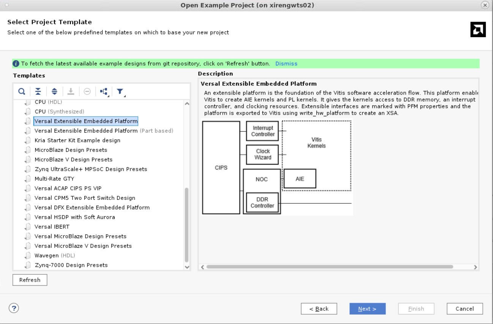

In this example, custom IPs are added to the block design. The first one AXI4S_Counter is a counter, which generates data on a 64-bit AXI4-Stream interface. The second one, dummy Sink, is an AXI4-Stream slave that accepts any data and drop it (tready always high).
The AXI4-Stream interfaces of these two IPs are not connected to any Slave or Master interfaces. They are connected to the AI Engine using the V++ linker.

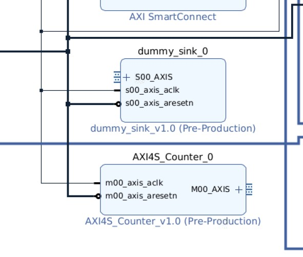

>***Note:*** The AI Engine expects AXI4-Stream compliant interfaces to be connected to its AXI4-Stream interfaces. While the following user guide focuses on designing Video IPs, it might contain useful consideration when designing any AXI4-Stream IP.
>
> [UG934 - AXI4-Stream Video IP and System Design](https://docs.amd.com/r/en-US/ug934_axi_videoIP/AXI4-Stream-Video-IP-and-System-Design-Guide)

For the V++ linker to be aware that the two AXI4-Stream interfaces are available, add two interfaces as part of the platform properties. They need to have a unique SP tag.

This is done using the following TCL commands:
```
set_property PFM.AXIS_PORT {M00_AXIS {type "M_AXIS" sptag "master_axi_1" is_range "false"}} [get_bd_cells /AXI4S_Counter_0]
set_property PFM.AXIS_PORT {S00_AXIS {type "S_AXIS" sptag "slave_axi_1" is_range "false"}} [get_bd_cells /dummy_sink_0]
```
Or this can be done through the Vivado GUI using the Platform Tab.

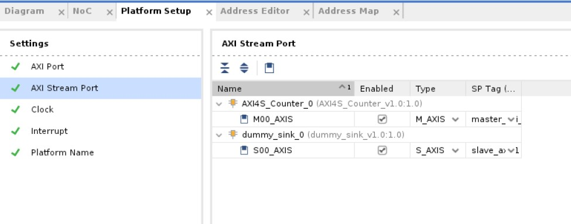

> ***Note***: The preceding flow assumes that the RTL AXI4-Stream interfaces are part of the block design (BD). In some designs, the RTL might be outside of the BD. In this case, it is possible to simply add an interface port to the BD set as AXI4-Stream (xilinx.com:interface:axis_rtl:1.0) and add an IP in the BD, which would only wire all the interface nets as a pass-through. The option is shown in the **Part 2**.

The Vivado Platorm can be generated using the following make command:
```
make vivado_platform
```

### Vitis V++ Link
In this example, you have an AI Engine application (simple FIR filter) with one input PLIO and one output PLIO. Connect these two PLIOs to the custom RTL AXI4-Stream interfaces using the V++ linker as part of the Vitis acceleration flow. 

In the AI Engine application, you can see the two PLIOs declared as follows:
```
sig_i =  input_plio::create("PLIO_i_0",plio_64_bits, "data/sig_i.txt" );
sig_o = output_plio::create("PLIO_o_0",plio_64_bits, "data/sig_o.txt" );
```
You can see that the input and output PLIOs are called PLIO_i_0 and PLIO_o_0, respectively.


In the binary container settings, you can define the connectivity between the PLIOs and the RTL AXI4-Stream interfaces (referred by their unique sptag):
```
[connectivity]
sc=master_axi_1:ai_engine_0.PLIO_i_0
sc=ai_engine_0.PLIO_o_0:slave_axi_1
```

The Vitis project can be generated using the following make command:
```
make vitis_project
```

If you open the generated Vivado project, which is located under Vitis/workspace_/system_project/build/hw_emu/hw_link/binary_container_1/binary_container_1/vivado/vpl/prj/, you can see that the RTL AXI4-Stream interfaces have been connected to the AI Engine.

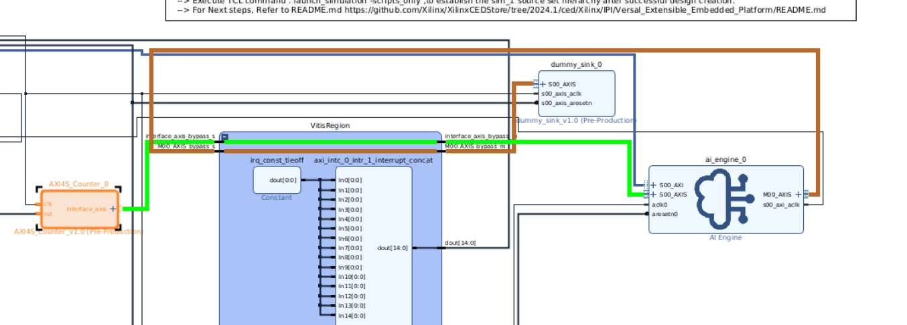

While you can run this application on Hardware, there is no way to verify the good behaviour of the design. In the following part 3, the platform is modified to add ILAs to the custom RTL AXI4-Stream interfaces so you are able to monitor the activity on the streams in Hardware.

### Hardware Emulation

Another way to verify the good behaviour of the design is to run through Hardware emulation and looking at the waveforms.
To run the Hardware Emulation and visualize the waveforms of the AXI4-Stream interfaces, go through the following steps:
1. Open the workspace_1 in Vitis IDE.
```
vitis -w Vitis/workspace_1/
```

2. In the flow navigator, make sure the component system project is selected and click on *Start Emulator* under *Harware Emulation*.

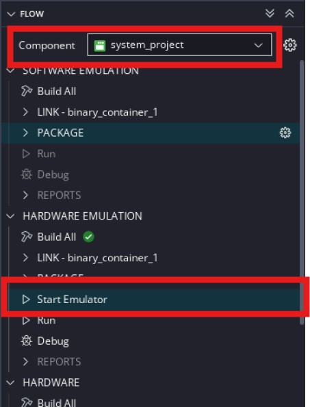

3. In the pop-up window, enable *Show Waveform* and click *Start*. This starts the emulator and launch the Vivado tool to visualize the simulation waveforms.

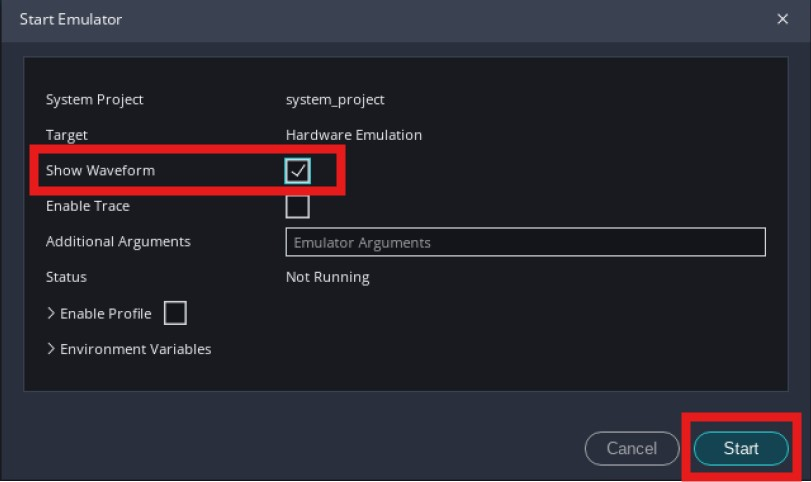

4. Add the M00_AXIS interface from the AXI4S_Counter_0 IP and the S00_AXIS from the dummy_sink_0 IP to the waveform window and run the simulation for 30us.

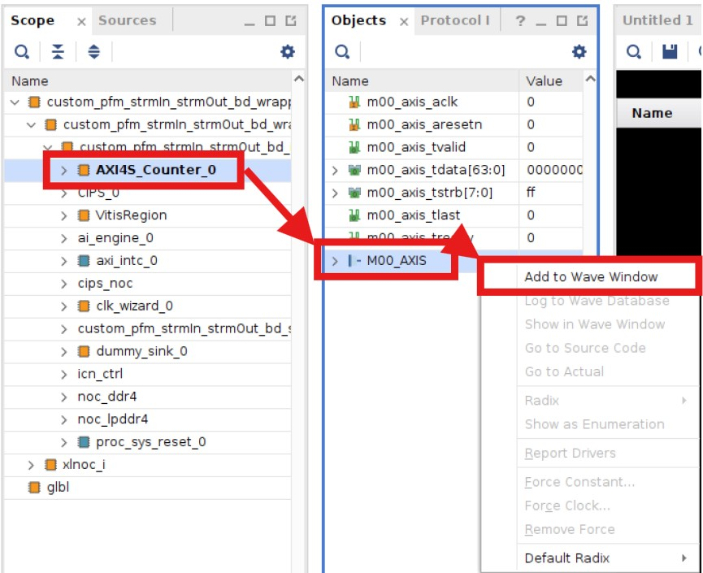

5. After ~10us of simulation time, you see transactions on the AXI4-Stream interfaces from and to the AI Engine demonstrating the good behaviour of the design.

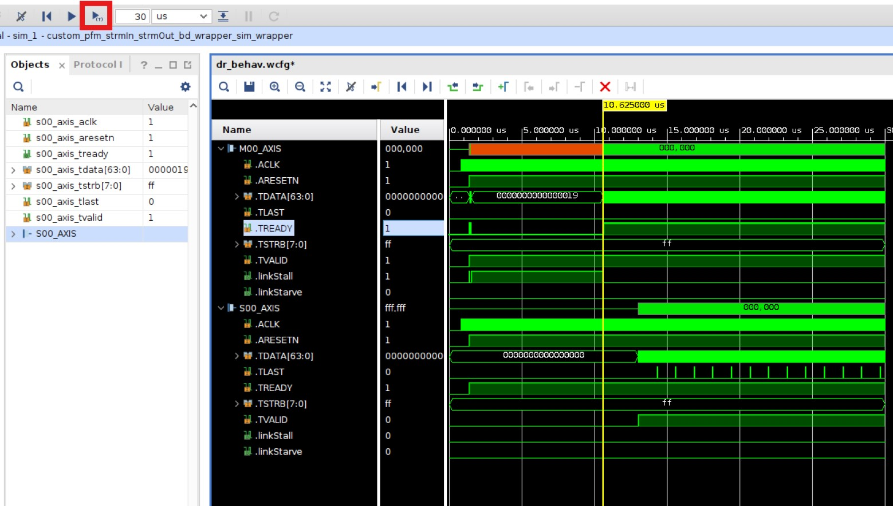

> ***Note***: In the Vitis workspace, you can see an application called `dummy_ps_app`. This application is just a simple hello_world application, which is running on the A72 processors. Running this application runs the PMC, which is loading the AI Engine. The application is added to the packaged file using the option ps_elf in `package.cfg`.

> ***Note***: The option `enable_aie_debug` is set to *false* in the `package.cfg`. With this option set to true, the AI Engine waits for the Vitis IDE to connect to the emulation and start the AI Engine. In this case, there is no need to debug inside the AI Engine, thus this option is set to *false*.

---
## Part 2 - Connecting RTL AXI4-Stream interfaces (NOT included in Block Design) to the AI Engine
In this part, a design is replicated in which all the RTL sending and receiving data to and from the AI Engine is outside the Block Design (BD). To communicate with the AI Engine, the RTL needs to have a compliant AXI4-Stream interace (for example, it needs to be able to handle back pressure when tready is low). The AXI4S_Counter and the dummy Sink used in the previous part are instantiated in an RTL top-level, which also instantiates the Block Design that contains the AI Engine.
As the V++ linker is only able to work inside a BD, add an IP block inside it to which the linker can connect.

### Hardware Platform
In this example, the Vivado design consists of a top-level RTL file, which instantiates the AXI4S_Counter and the dummy Sink IPs used in the previous part as well as a BD. The BD was generated from the CED and contains all the required elements for the Vitis acceleration flow.

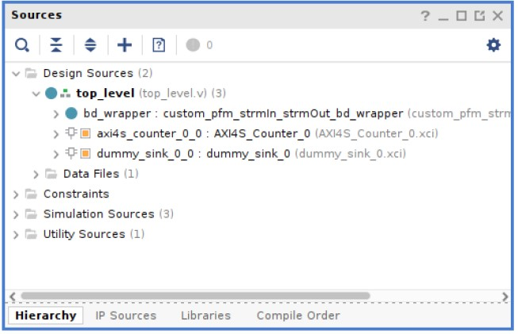

In the BD, two instances of the AXI4-Stream Register slice IP are added. They are configured in such way that they only act as a pass-through thus can be considered as wires. But they are required to have AXI4-Stream interfaces to which the V++ linker can connect the AI Engine. One side of these IP instances (M00_AXIS for one and S00_AXIS for the other) is connected to the external ports of the BD (which are then connected to the AXI4S_Counter and the dummy Sink IPs inside the top level). The other interfaces are left uncorrected and added to the plaform, similar to what was done in **Part 1**.

```
# Add AXI4-Stream interfaces to Platform
set_property PFM.AXIS_PORT {M_AXIS {type "M_AXIS" sptag "master_axi_1" is_range "false"}} [get_bd_cells /axis_register_slice_0]
set_property PFM.AXIS_PORT {S_AXIS {type "S_AXIS" sptag "slave_axi_1" is_range "false"}} [get_bd_cells /axis_register_slice_1]
```

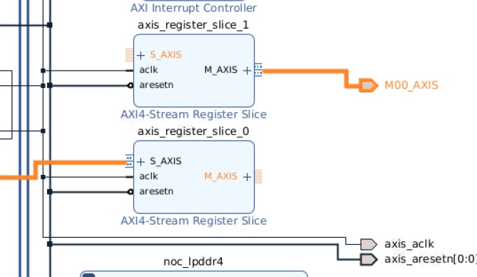

To build the HW design, run the following command:
```
make vivado_platform RTL_OUT_BD=1
```

### Vitis V++ Link
As the sptag for the master and slave interfaces are the same to what was used in **Part 1**, there is no change to the Vitis project. It can be built using the following command:
```
make vitis_project RTL_OUT_BD=1
```

If you open the generated Vivado project, which is located under `Vitis/workspace_2/system_project/build/hw_emu/hw_link/binary_container_1/binary_container_1/vivado/vpl/prj/`,  you can see that the RTL AXI4-Stream interfaces have been connected to the AI Engine.

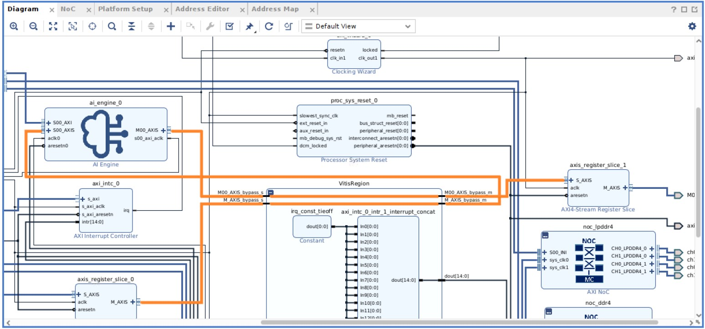

### Hardware Emulation

You can verify the good behaviour of the design running through Hardware emulation and looking at the waveforms, using the same steps as in **Part 1**.
To run the Hardware Emulation and visualize the waveforms of the AXI4-Stream interfaces, go through the following steps:

1. Open the workspace_2 in Vitis IDE.
```
vitis -w Vitis/workspace_2/
```

2. In the flow navigator, make sure the component system project is selected and click on **Start Emulator** under **Harware Emulation**.


3. In the pop-up window, enable **Show Waveform** and click **Start**. This starts the emulator and launch the Vivado tool to visualize the simulation waveforms.


4. Add the AXIS interface signals (tready, tvalid, tdata) from the AXI4S_Counter_0 IP and the S00_AXIS from the dummy_sink_0 IP to the waveform window and run the simulation for 30us.

5. After ~10us of simulation time, you see transactions on the AXI4-Stream interfaces from and to the AI Engine demonstrating the good behaviour of the design.

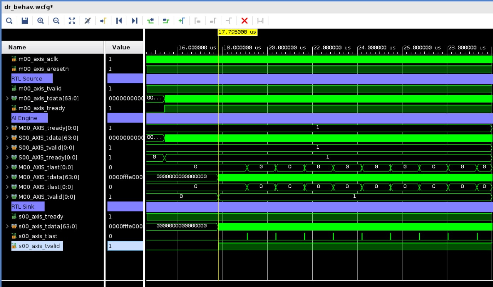
---
## Part 3 - Connecting Monitored RTL Interfaces to AI Engine

### Creating the design
In some cases, it can be useful to add debug capabilities to the interfaces to monitor the data that is going in and out of the array. When using RTL interfaces (this type of design is called flat design), ILAs cannot be added directly by v++ link. One way of adding the debug capabilities is to add the ILAs directly into the Vivado design. This is what is done in the design from **Part 1**:

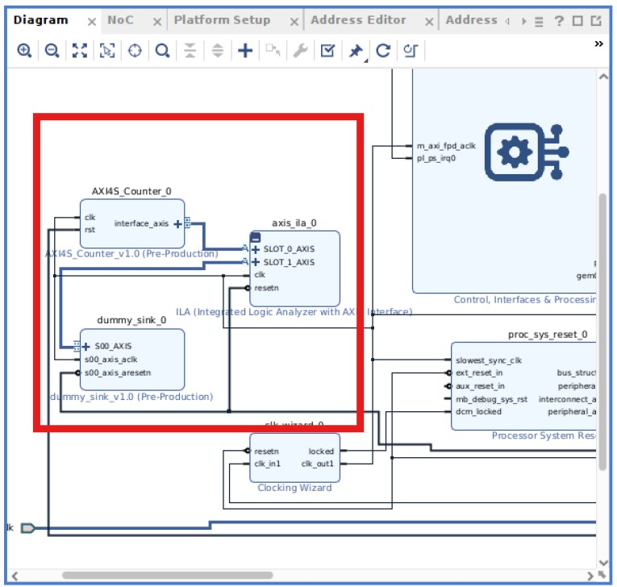

While the Vivado contains a slight change, the Vitis project can be similar to the one from **Part 1**.

To build the full project, including the Vivado HW design and the Vitis project, run the following command:
```
make all INCLUDE_ILAS=1
```

### Running the Design in Hardware

To run the design and observe the traces from the ILAs, open Vivado.

1. Prepare the VCK190 by connecting the UART/JTAG USB cable to your compute and set the boot mode to JTAG.

2. Power on the VCK190.

3. Open Vivado and open the Vivado HW manager.

4. Connect to the target and program the device using the generated `BOOT.BIN` (`Vitis/workspace_3/system_project/build/hw/package/package/BOOT.BIN`) and use the `.ltx` file from the V++ linker generated Vivado project (`Vitis/workspace_3/system_project/build/hw/hw_link/binary_container_1/binary_container_1/vivado/vpl/prj/prj.runs/impl_1/custom_pfm_strmIn_strmOut_bd_wrapper.ltx`).

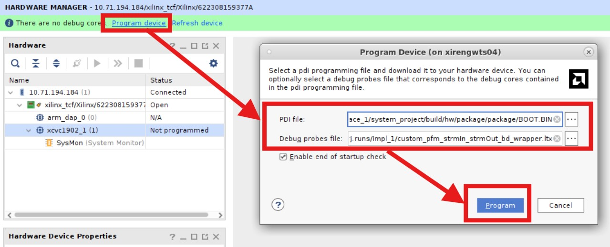

5. Open the ILA view and configure the ILA to trigger when M00_AXIS tready and tvalid are high. Change the number of captured window to two and set the trigger position in window setting to 10 and run the trigger for the ILA.

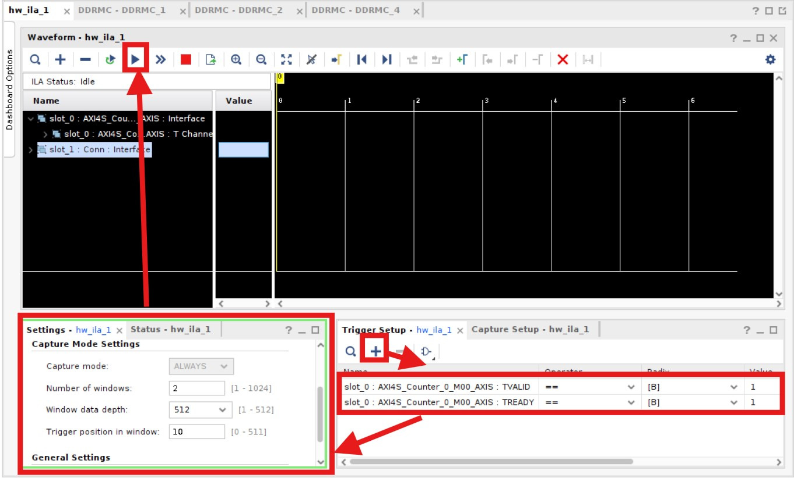

6. The ILA should trigger and you should see an activity on the AXI4-Streams.

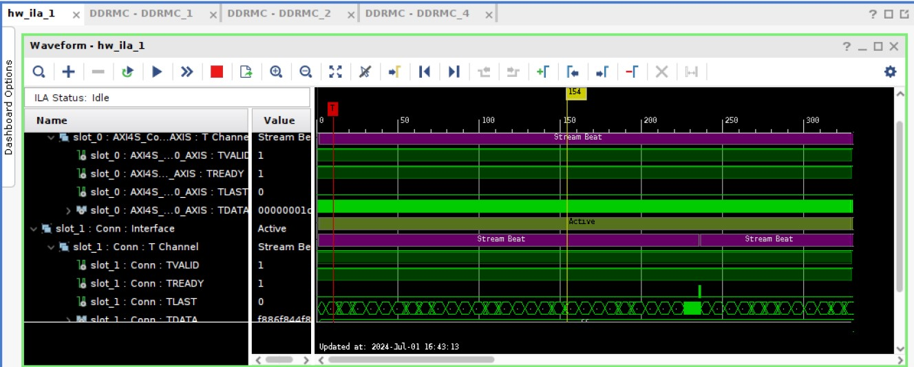

---
## Part 4 - Broadcasting Data to the AI Engine and the Programmable 
In some cases, the same data might need to be processed by both the AI Engine and the PL so you might need a way to broadcast the data to both the domains.
On important thing to keep in mind with working with compliant AXI4-Stream interfaces (as the AI Engine expects an AXI4-Stream compliant interface) is that the master and slave interfaces need to handle the handshaking protocol (with tvalid and tready). Thus, when connecting multiple slaves to a single master is not as simple as connecting the two slaves to the same master interface (as there would be two tready signals). The master would need to handle the logic between the two tready from the slaves.
Another option is to use an IP that would handle this for you. In the Vivado catalog, the AXI4-Stream Broadcaster IP is intended for this type of use case.

### Creating the design
In this example, the same design as **Part 1** with the AXI4S_Counter and dummy Sink custom RTL IPs is used. However, in this case, the source, the AXI4S_Counter, is connected to an AXI4-Stream broacaster IP to stream the data to both the PL and the AI Engine domains. A second dummy sink instance is added to simulate the connectivity with the PL.
The connectivity between one of the AXI4-Stream interfaces of the AXI4-Stream Broadcaster IP and the second dummy sink is added directly to the Vivado design as shown below.
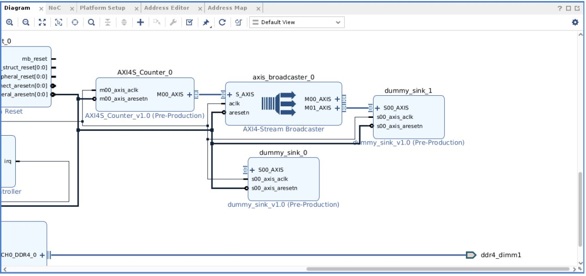

Similar to **Part 1**, the HW design as 2 AXI4-Stream interfaces left unconnected, one master and one slave interface. The only difference is that the unconnected master interface is from the AXI4-Stream Broadcaster IP.
However, same SP Tags are given to the two interfaces as in **Part 1**. Thus, you can use the exact same Vitis project.
```
set_property PFM.AXIS_PORT {M00_AXIS {type "M_AXIS" sptag "master_axi_1" is_range "false"}} [get_bd_cells /axis_broadcaster_0]
set_property PFM.AXIS_PORT {S00_AXIS {type "S_AXIS" sptag "slave_axi_1" is_range "false"}} [get_bd_cells /dummy_sink_0]
```

To build the full project including the Vivado HW design and the Vitis project, run the following command:
```
make vitis_project AXI4S_BROADCAST=1
```

### Hardware Emulation

You can verify the good behaviour of the design running through Hardware emulation and looking at the waveforms, using the same steps as in **Part 1**.
To run the Hardware Emulation and visualize the waveforms of the AXI4-Stream interfaces, go through the following steps:

1. Open the workspace_4 in Vitis IDE.
```
vitis -w Vitis/workspace_4/
```

2. In the flow navigator, make sure the component system project is selected and click on **Start Emulator** under **Hardware Emulation**.

3. In the pop-up window, enable **Show Waveform** and click **Start**. This starts the emulator and launches the Vivado tool to visualize the simulation waveforms.

4. Add the AXIS interface signals (tready, tvalid, tdata) from the AXI4S_Counter_0 IP and the S00_AXIS from the dummy_sink_0 IP to the waveform window and run the simulation for 30us.

5. After ~10us of simulation time, you see transactions on the AXI4-Stream interfaces from the AXI4-Stream broadcaster to the AI Engine, the AXI4-Stream broadcaster to the PL and from the AI Engine to the PL demonstrating the good behaviour of the design.

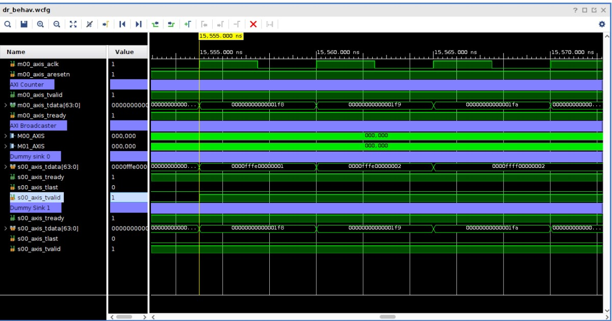

<p class="sphinxhide" align="center"><sub>Copyright © 2024 Advanced Micro Devices, Inc</sub></p>

<p class="sphinxhide" align="center"><sup><a href="https://www.amd.com/en/corporate/copyright">Terms and Conditions</a></sup></p>
