<table class="sphinxhide" style="width:100%;">
  <tr>
    <td align="center">
      <picture>
        <source media="(prefers-color-scheme: dark)" srcset="https://raw.githubusercontent.com/Xilinx/Image-Collateral/main/logo-white-text.png">
        
      </picture>
      <h1>AMD Vitis™ AI Engine Tutorials</h1>
      <a href="https://www.amd.com/en/products/software/adaptive-socs-and-fpgas/vitis.html">See Vitis Development Environment on amd.com</a>
        </br>
      <a href="https://www.amd.com/en/products/software/vitis-ai.html">See Vitis AI Development Environment on amd.com</a>
    </td>
  </tr>
</table>

# A "Gentle" Introduction to AI Engine Kernel Programming

***Version: Vitis 2025.2***

## Overview

This tutorial contains the code presented in the [webinar](https://webinar.amd.com/A-Gentle-Introduction-to-AI-Engine-Kernel-Programming/en) of the same name. This tutorial demonstrates how an [AI Engine](https://www.amd.com/en/products/adaptive-socs-and-fpgas/technologies/ai-engine.html) kernel program gets data from and outputs data to its environment. This tutorial proposes a *contrived* task which uses all port types. [Julia](https://julialang.org) scripts design unit tests for each component kernel to create stimulus and reference to verify the functionality of the kernels. You then assemble components to complete the task. The provided Makefiles allow you to build the program and run simulations so you can focus on the programming aspects of AI engine kernel design.

## Introduction

The [Versal Adaptive SoC](https://www.amd.com/en/products/adaptive-socs-and-fpgas/versal.html) product family introduced a new computing resource consisting of a 2D array of independently running scalar and vector processors. These processors are called AI Engines (AIE) and are capable of running at a maximum clock frequency of 1.3 GHz [[DS957](https://docs.amd.com/r/en-US/ds957-versal-ai-core/AI-Engine-Switching-Characteristics)].

## A Brief Overview of AI Engine Tiles and Kernels

Each AI Engine is on a tile containing the processors, local memory, and a programmable [AXI Stream Interface](https://docs.amd.com/r/en-US/pg256-sdfec-integrated-block/AXI4-Stream-Interface). The interconnect enables communication with non-adjacent tiles, programmable logic (PL), the processor system (PS), and external memory (Figure 1). This tutorial focuses on the first generation AIE architecture described in [AM009](https://docs.amd.com/r/en-US/am009-versal-ai-engine).

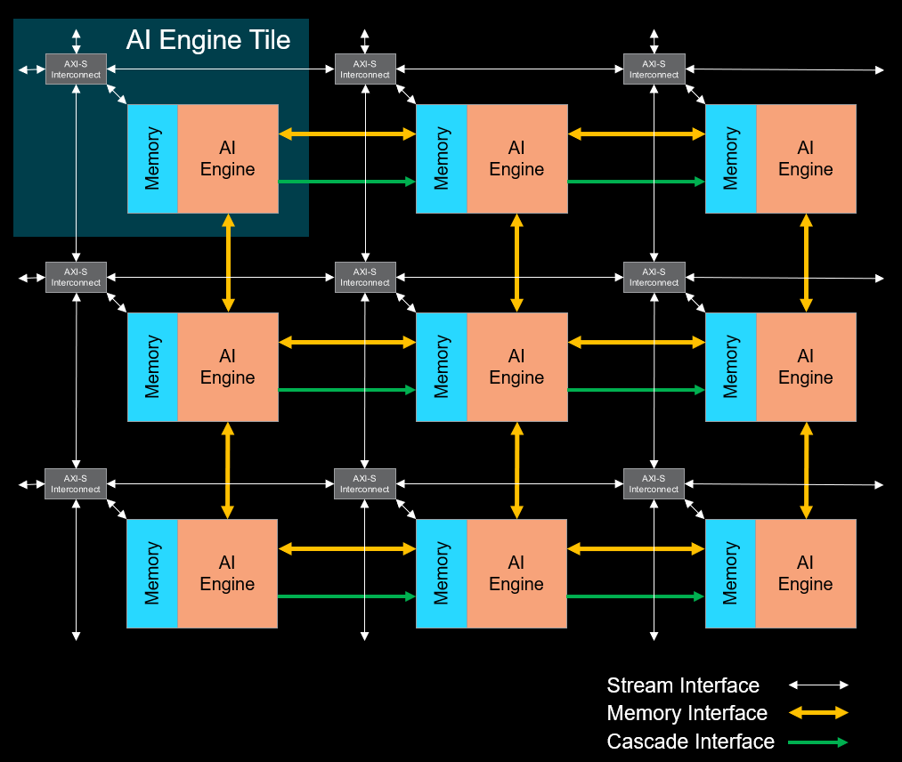
*Figure 1: AI Engine Array*

Each AIE tile has 16 KB of program memory and 32 KB of data memory. You can share this memory with adjacent tiles.

You create an adaptive dataflow (ADF) graph and define AXI Stream connections.

A C++ program running on the AI Engine (referred to as a kernel) reads, processes, and outputs data for further processing. For example, the program reads sampled signals from multiple antennas, processes the data to perform beamforming, and outputs the results for further processing.

An adaptive SoC can have tens to hundreds of these AIE tiles in [hard IP cores](https://en.wikipedia.org/wiki/Semiconductor_intellectual_property_core), depending on the device. For more details, refer to [Versal AI Core Series Product Selection Guide (XMP452)
](https://docs.amd.com/v/u/en-US/versal-ai-core-product-selection-guide)).

This arrangement of multiple independent processors has huge potential for parallel processing.

## Scalar and Vector Processors

The AI Engine is a very long instruction word (VLIW) processor with separate slots for scalar and vector instructions.

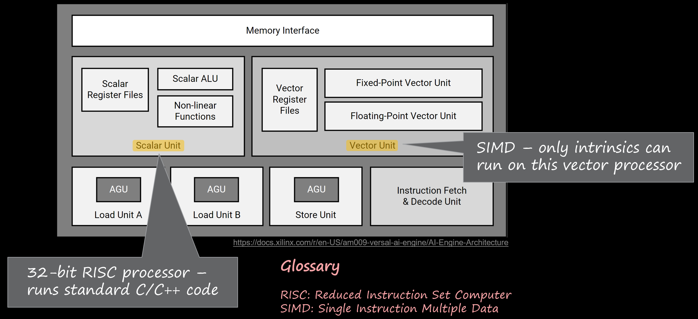
*Figure 2: Scalar and vector units*

AIE intrinsics are special functions recognized by the compiler. Use these to access the single instruction multiple data (SIMD) capabilities of the vector processor. You can also use the available high-level API to create architecture-agnostic programs which can abstract away from the low-level details of intrinsics. For more details, refer to [AI Engine Intrinsics and API User Guides](https://www.xilinx.com/htmldocs/aiengine_intrinsics_start.html)]. [Vitis Model Composer](https://www.amd.com/en/products/software/adaptive-socs-and-fpgas/vitis/vitis-model-composer.html) provides a graphical design environment to create AI Engine designs.

## AVX Versus AI Engine APIs

Using AIE APIs is similar to using Advanced Vector eXtensions (AVX) on an x86 processor.

### Vector Addition with AVX Intrinsics

On an x86 CPU with AVX support, the code to add the elements of two vectors looks similar to the following:

#### vadd_avx.cpp

```C++
#include <iostream>
#include <immintrin.h>

using namespace std;

int main() {
    constexpr unsigned vsize = 8;   // number of vector elements

    alignas(16) const float x[] = { 1.0,  2.0,  3.0,  4.0,  5.0,  6.0,  7.0,  8.0 };
    alignas(16) const float y[] = { 9.0, 10.0, 11.0, 12.0, 13.0, 14.0, 15.0, 16.0 };
    alignas(16) float z[vsize];         // z = x + y

    __m256 vx = _mm256_loadu_ps(x);     // transfer data from memory to 256-bit vector registers
    __m256 vy = _mm256_loadu_ps(y);

    __m256 vz = _mm256_add_ps(vx, vy);  // perform SIMD addition

    _mm256_storeu_ps(z, vz);            // transfer data from 256-bit vector register to memory

    cout << endl;
    for (auto i = 0u; i < vsize; i++) {
        if (i == 0) cout << "z = ";
        cout << z[i];
        if (i != (vsize - 1)) cout << ", ";
        else cout << endl;
    } // end for (auto i = 0u; i < vsize; i++)
    cout << endl;

    return (0);

} // end main()
```

### Vector Addition with AIE API

Using the high-level APIs on an AI engine is similar to the following:

#### vadd_aie.cpp

```C++
#include <aie_api/aie.hpp>
#include <aie_api/aie_adf.hpp>
#include <aie_api/utils.hpp>    // for aie::print()

void vadd() {

    constexpr unsigned vsize = 8;           // number of vector elements
    using v8f = aie::vector<float, vsize>;  // floating-point vector register with "vsize" elements

    alignas(aie::vector_decl_align) const float x[] = { 1.0,  2.0,  3.0,  4.0,  5.0,  6.0,  7.0,  8.0 };
    alignas(aie::vector_decl_align) const float y[] = { 9.0, 10.0, 11.0, 12.0, 13.0, 14.0, 15.0, 16.0 };
    alignas(aie::vector_decl_align) float z[vsize]; // z = x + y

    v8f vx = aie::load_v<vsize>(x); // transfer data from memory to vector registers
    v8f vy = aie::load_v<vsize>(y);

    v8f vz = aie::add(vx, vy);  // move sum from accumulator to vector register
    aie::store_v(z, vz);        // transfer data from vector register to memory

    printf("\n");
    aie::print(vz, true, "vz = "); // show contents of vector register
    printf("\n");

} // end vadd()
```

The following compares the relevant lines side-by-side:

|**AVX CPU**|**AIE API**|**Notes**|
|:---|:---|:---|
| __m256 vx = _mm256_loadu_ps(x); | v8f vx = aie::load_v<vsize>(x); | transfer from memory to vector register |
| __m256 vy = _mm256_loadu_ps(y); | v8f vy = aie::load_v<vsize>(y); | transfer from memory to vector register |
| __m256 vz = _m256_add_ps(vx, vy); | v8f vz = aie::add(vx, vy); | add the elements of the vector registers |
| __m256_storeu_ps(z, vz); | aie::store(z, vz); | store vector register to memory |

For this specific example, there is a one-to-one correspondence between the instructions for AVX on an x86 CPU and the high-level API on an AI Engine.

#### Building and Running the AVX CPU Program

Before building the AVX CPU program, check whether your machine supports AVX instructions by running the ``chk_avx.sh`` script.

```
$ cd avx_aie/avx
$ ./chk_avx.sh

Checking for AVX capabilities on this machine by looking at /proc/cpuinfo...

This machine supports AVX!
```

Build and execute the program `nly` after you get the result, *This machine supports AVX!*.

```
$ make

z = 10, 12, 14, 16, 18, 20, 22, 24
```

#### Building and Running the AIE API Program

Make sure that the Vitis environment has been setup and AIE licenses are available (see [AR#76792](https://adaptivesupport.amd.com/s/article/76792?language=en_US) on how to setup AIE licenses).

```
$ cd ../aie
$ make
...
8< --- snip --- >8
...
Compilation Complete
(WARNING:0, CRITICAL-WARNING:0, ERROR:0)
INFO: Reading options file './Work/options/x86sim.options'.

vz = 10.000000 12.000000 14.000000 16.000000 18.000000 20.000000 22.000000 24.000000 

Simulation completed successfully returning zero
```

## AI Engine APIs

AIE APIs are header files allowing a higher level of abstraction than intrinsics. They are also architecture-agnostic meaning the generated intrinsics match the selected target device. Browse through the [AI Engine API User Guide](https://www.xilinx.com/htmldocs/aiengine_intrinsics_start.html) to view the available functions (Figure 3).

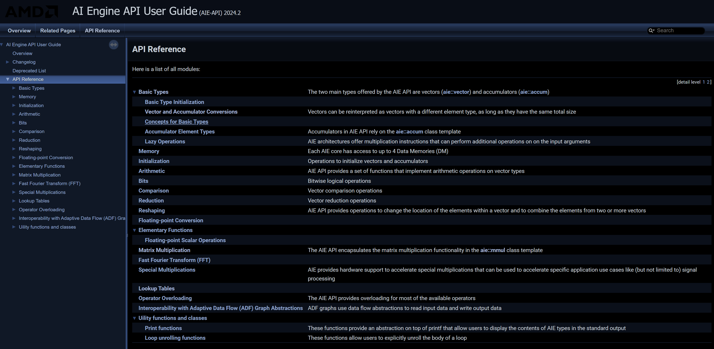
*Figure 3: AI Engine API User Guide*

The following figure shows how an intrinsic and an API with the same basic operation, such as multiply accumulate can differ.

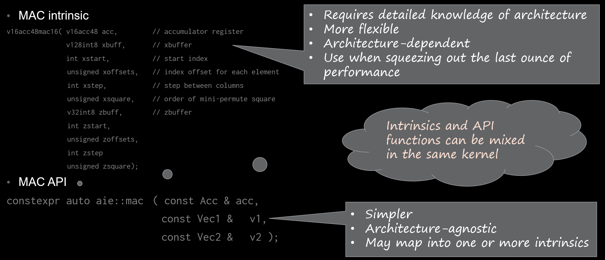
*Figure 4: Intrinsic vs. API*

>**Note:** Intrinsics have more parameters, allowing more flexibility, but require more detailed knowledge of the architecture. APIs assume a specific use-case, allowing the use of fewer parameters.

The use of APIs is highly recommended. Use only intrinsics to optimize critical portions of the code. Note that intrinsics and APIs can mix together in the same kernel code.

## Modified Kahn Process Network (KPN)

One way to implement a system capable of parallel computing is with a Kahn process network (KPN). Wikipedia states: "A Kahn process network (KPN, or process network) is a distributed model of computation in which a group of deterministic sequential processes communicate through *unbounded* first in, first out channels. The model requires that reading from a channel is blocking while writing is non-blocking. Due to these key restrictions, the resulting process network exhibits deterministic behavior that does not depend on the timing of computation nor on communication delays."

Figure 5 shows an example of a KPN. Note that all the nodes T1 through T4 may run simultaneously as they are separate processes. The key contribution of Kahn's proposal was defining *when* a node executes.

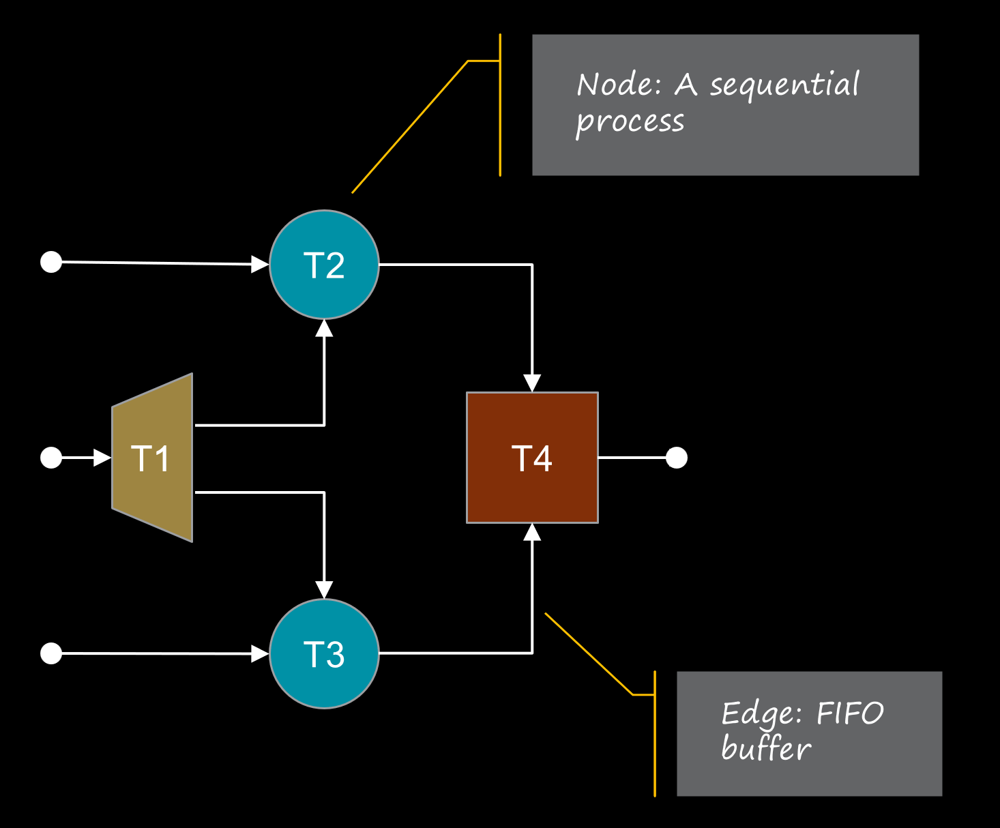
*Figure 5: Example of a Kahn Process Network (KPN)*

As *unbounded* first-in, first-out (FIFO) channels are physically unrealizable, the AIE array implements a *modified* KPN with bound channels. A well-designed system with balanced delays is still deterministic as possible stalls (caused by empty input buffers, full output buffers, or resource contention) always consume the same number of cycles.

A modified KPN described in an ADF graph encapsulates how AIE tiles (the "nodes" in the modified KPN) exchange data with the outside world. In an AI engine array, you implement the buffers (also called edges) as streams or shared memories. Note that a sequential process (also called a "node") *stalls* or halts execution, when the following happens:

* an input stream is empty
* an output stream is full
* another tile is accessing a shared memory bank

You can minimize stalls by allocating FIFOs of sufficient depth, or dedicating a memory bank to a kernel.


For details, refer to [AI Engine Programming: A Kahn Process Network Evolution (WP552)](https://docs.amd.com/r/en-US/wp552-ai-kpn/Kahn-Process-Network).

## Applications Best Suited for AI Engines

The vector unit in the first generation AI engine architecture supports the datatypes shown in Figure 6.

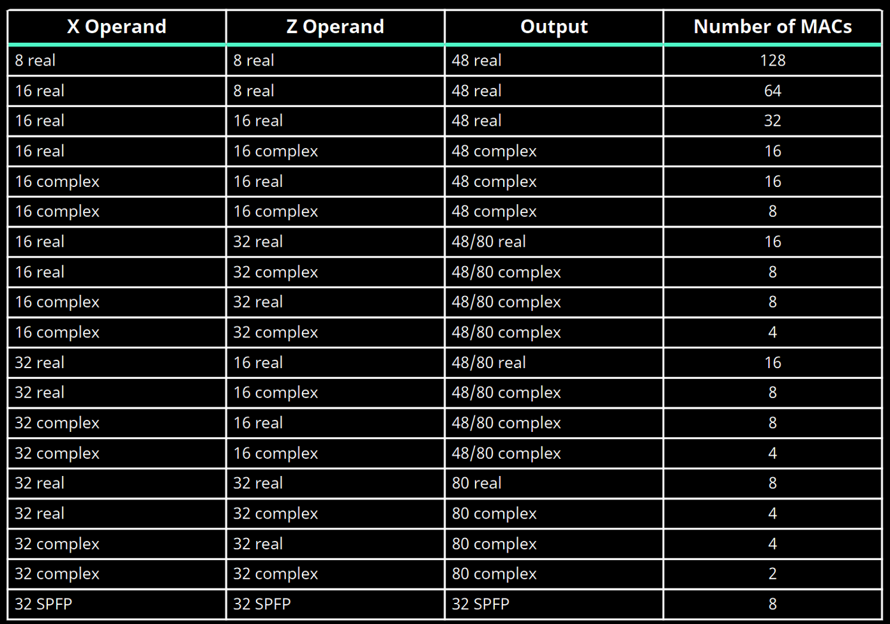
*Figure 6: Datatypes supported in the vector unit of the 1st generation AIE architecture*

Note that the rightmost column shows the number of multiply accumulate (MAC) operations that one tile can perform in one cycle. Thus, with 8-bit operands, one AIE tile can perform 128 MACs/cycle. Figure 7 shows what calculation is actually performed in one cycle.

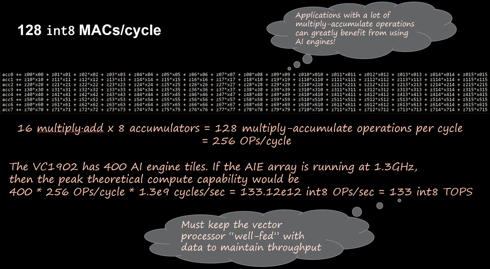
*Figure 7: Int8 MACs/cycle for 1st generation AIE architecture*

Applications using matrix-matrix or matrix-vector multiplications, such as polyphase filters (channelizers), FIR/IIR filters, FFTs, beamforming, MIMO signal processing, and many others can benefit by using AI Engines.

Other tasks like image, video, audio processing, scientific simulations, data compression, networking, speech recognition, machine learning, cryptography and others can also take advantage of the SIMD capabilities of the AI Engine.

Note that "peak theoretical compute capability" mentioned in Figure 7 is an *upper bound*, and can *never* be realized when solving a *practical* problem. There are periods when you cannot perform calculations to enable data ingress and egress, or when the compute units need to wait for the results of a previous operation to become available.

## Code Required to Create a Program to Run on an AI Engine

You require three pieces of code to use an AI Engine:

* Kernel code: C/C++ code that runs on the AI engine.
* ADF graph code: C++ code that describes how the kernel communicates with the outside world. This code sets the connections in the AXI-S interconnect on the AIE tile.
* Testbench/Control code: C/C++ code to load, initialize, run and terminate kernel code. In a practical application, this runs on an APU (application processing unit) in the processing system.

### Kernel Code Structure

You can use optionally templated functions or C++ classes as kernel programs.

Optionally templated function:

```C++
// func_name.cpp
template <…>	// optional
void func_name( /* I/O arguments */ ) {
  // 1. read inputs
  // 2. process inputs
  // 3. write outputs
}
```

Optionally templated C++ class:

```C++
// some_class.hpp
template <…>	 // optional
class some_class {
private:
  // private variables
public:
  // public variables
  some_class( /* constructor arguments */ );	// constructor performs initialization
  void f1( /* I/O arguments */ );		          // function to run on AI engine, same structure as templated function above
  static void registerKernelClass() {
    REGISTER_FUNCTION(some_class::f1);	// macro to tell the build tools that “f1” will run on AI engine
  }
};
```

### Graph Code Structure

The ADF graph (or simply "graph") contains information on how the AIE kernel communicates with the outside world. The tools use the information in this file to manage the resources (memory, ports, stream connections, and more) that the kernel uses.

```C++
class theGraph : public graph {   // inherit properties of adf::graph
private:
  // kernel declarations
public:
  // port declarations
  theGraph() {  // constructor
    // kernel definitions
    // source code definitions
    // runtime ratio declarations
    // source/destination files for simulating input/output ports
    // declare connections
    // declare buffer dimensions (optional)
    // declare constraints (optional)
  }
};
```

### Test Bench/Control Code Structure  

This is the "top-level file" referred to in the AMD Vitis™ GUI. When running simulations, this program runs on the host PC, not on the AI Engine, and not on the PS.

```C++
#include graph.hpp  // include ADF graph header file

theGraph g; // instantiate the graph as a global variable

int main() {

  g.init(); // initialize the graph
  g.run(1); // run the graph once
  g.end();  // terminate the graph

  return (0);
}
```

## AI Engine Kernel Input and Output Types

There are four input and output types (Figure 8):

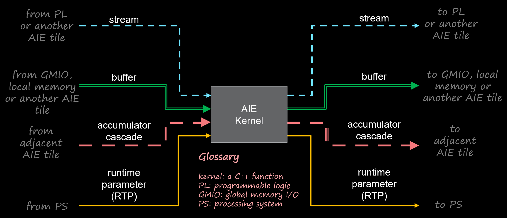
*Figure 8: AIE Kernel Port Types*

* **Stream**
  
  Streams use an [AXI-4 stream interface](https://docs.amd.com/r/en-US/pg256-sdfec-integrated-block/AXI4-Stream-Interface). A stream is 32 bits wide. Streams can come from and go to PL or another AIE tile. Depending on the architecture, an AIE tile can have one or two input streams, and one or two output streams. Streams are useful when data processes sequentially and has the potential to provide the lowest latency at the expense of lower throughput. Using the first generation AI Engine architecture as an example, an AIE tile can receive 64 bits of data through two input streams in one cycle.

* **Buffer**

  Buffers use local memory on the AIE tile or adjacent tiles. Buffer data can come from and go to global memory input/output (GMIO) (external DDR), PL, or an adjacent AIE tile. An AIE tile can perform two 256-bit loads from memory and one 256-bit write to memory. Using buffers enables higher throughput at the expense of higher latency because you need to fill the buffer before accessing it.

* **Accumulator cascade**

  Several algorithms require a sum-of-products calculation. You can distribute a long sum across multiple AIE tiles, with each tile calculating a partial sum and cascading (or passing) a partial sum to an adjacent tile (Figure 9).

  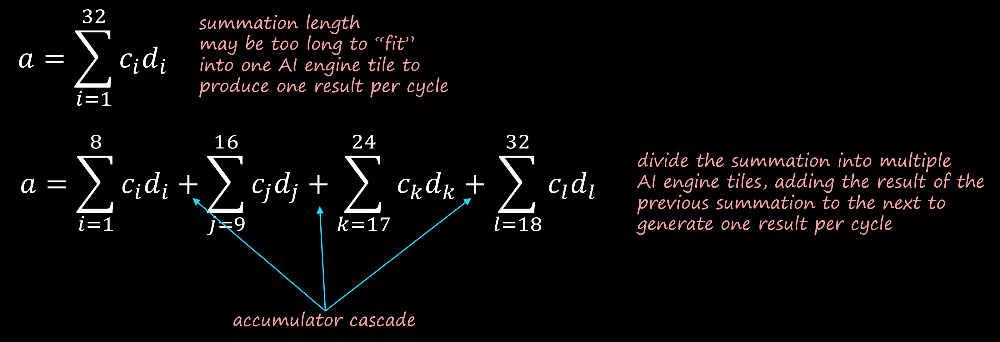
  *Figure 9: Accumulator Cascade iIntuition*

  For example, instead of summing 32 products in four cycles (eight sum-of-products calculated in one cycle), splitting the operation into four partial sums of eight products and cascading the partial sums can provide a result in one cycle. This reduces latency at the expense of using more AIE tiles.

* **Runtime parameter (RTP)**

  Use runtime parameters to have the PS modify the behavior of a kernel program or obtain state and status information.

  Runtime parameters specify scalar function arguments:

  * Input RTP: pass-by-value
  * Output RTP: pass-by-reference

  In the ADF graph, they can be:

  * **Asynchronous**: You must provide the RTP at least one time and reuse on every function invocation until updated
  * **Synchronous**: You must provide the RTP on every function invocation

  Figure 10 shows a kernel function using input and output RTPs.

  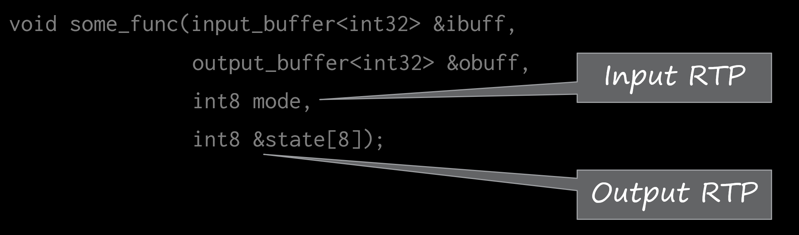
  *Figure 10: Function with Input and Output RTPs*

## A **_Contrived_** Task to Show How to Access AIE Kernel I/O Ports

The *contrived* task shown in Figure 11 shows how to access the input and output ports available to an AIE tile within a kernel program.

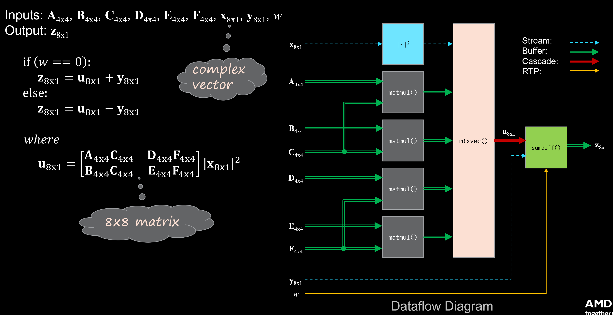
*Figure 11: A Contrived Task to Show the Different I/O Ports on the AI Engine*

The left side of the figure shows the mathematical description. Bold uppercase variables denote matrices, with the subscripts denoting the matrix sizes. Bold lowercase variables denote vectors, with the subscripts denoting the vector sizes. Italicized variables denote scalars.

Calculation steps:

1. Calculate the squared magnitude of the input complex vector **``x``**
2. Calculate the products of the 4x4 input matrices **``AC``**, **``DF``**, **``BC``**, and **``EF``**
3. Concatenate the resulting matrix products into an 8x8 matrix
4. Calculate the vector **``u``** as the product of the 8x8 matrix and the squared magnitude of **``x``**
5. If the input scalar is zero, calculate the output vector as the sum of **``u``** and the input vector **``y``**; otherwise, the output vector is the difference **``u``** - **``y``**

The block diagram on the right shows the required calculations more clearly. Note that it also shows the dependencies between calculations, which as a bonus, also shows which calculations can be done in parallel.

In this *contrived* task, buffers provide the input matrices and the input vectors through streams. The resultant vector **u** is handled as an accumulator cascade, and the scalar `w` as an input RTP.

Note that two simulation modes are available when developing AIE kernels:

* Functional: Source code compiles to run on the x86 host development platform. This enables fast simulations to check the veracity of the code.
* Emulation: Source code compiles to run on the AI engine. It is slower than functional simulation but provides cycle approximate information to estimate throughput and latency when using real hardware.

## Sample Code for Stream Input and Output

The following code segment shows how to calculate the squared magnitude of a complex vector using streams for input and output.

```C++
template  <typename Ti, typename To, unsigned vlen, unsigned burst_count>
void sqmag(input_stream<Ti>  *istrm,	// input stream
           output_stream<To> *ostrm		// output stream
) {

	for (auto i = 0u; i < burst_count; i++) {

        auto vin = readincr_v<vlen>(istrm);	// read "vlen" samples from "istrm" (re + j*im)
                                        	// into the vector register "vin"
        auto magsq = abs_square<To>(vin);  	// use "abs_square()" API to calculate (re^2 + im^2)
                                            // for each element and store in vector register "magsq"

		writeincr(ostrm, magsq);    // write vector register "magsq"
                                    // to output stream "ostrm"

	} // end for (auto i = 0u; i < burst_cnt; i++)

} // end sqmag()
```

The input stream port is declared as ``input_stream\<T\>``, where ``T`` is the typename specified in the template parameter list. Similarly, the output stream port is declared as ``output_stream\<T\>``.

``readincr_v\<N\>( )`` is an API which takes **N** values from an input stream and places them into a vector register. Note that:

* The AIE tile stream is 32 bits wide running at 1.25 GHz on the [VCK190 platform](https://www.amd.com/en/products/adaptive-socs-and-fpgas/evaluation-boards/vck190.html)
* The PL stream can be 32, 64, or 128 bits wide (defined in the ADF graph) running at a slower clock (usually half or a quarter of the AIE clock)
* There are FIFO and [clock domain crossing](https://www.maven-silicon.com/blog/clock-domain-crossing) circuits at the AIE array and PL boundary such that:
  * a 32-bit PL stream running at half the AIE clock will provide 32-bit data to the AIE tile at half the AIE tile rate, potentially resulting in stalls (with the AIE tile waiting for data to be available)
  * a 64-bit PL stream running at half the AIE clock can provide 32-bit data to the AIE tile at the AIE tile rate
  * a 128-bit PL stream running at a *quarter* of the AIE clock can provide 32-bit data to the AIE tile at the AIE tile rate

``aie::abs_square\<T\>( )`` is an API which calculates the squared magnitude of the input.

``writeincr( )`` is an API which writes values from a vector register to an output stream. The number of elements to write is determined by the size of the vector register.


### Unit Test for Squared Magnitude Module

Directory structure:

```sh
$ cd ../../unit_tests/sqmag
$ tree
.
├── data
│   └── ivec.dat    # stimulus generated by sqmag.jl
├── julia
│   ├── cleanup.jl
│   ├── ovec.dat    # reference result generated by sqmag.jl
│   ├── README.txt
│   └── sqmag.jl    # Julia script to generate stimulus and reference files
├── Makefile
└── src
    ├── graph.hpp   # ADF graph
    ├── params.h
    ├── sqmag.cpp   # kernel code
    ├── sqmag.hpp
    └── tb.cpp      # simulation code
```

Examine the stimulus generation script ``julia/sqmag.jl``. Examine the source code in the ``src`` directory.

Build and run the design in both functional (x86sim) and cycle-approximate (aiesim) modes. Note the results of the comparison between DUT and reference results.

```sh
$ make all | tee build.log

8< --- snip --- >8

Comparing x86sim and reference results...

diff -ws ./Emulation-SW/x86simulator_output/ovec.dat ./julia/ovec.dat
Files ./Emulation-SW/x86simulator_output/ovec.dat and ./julia/ovec.dat are identical

***************************** x86sim completed! *****************************

8< --- snip --- >8

Comparing aiesim and reference results...

diff -ws ./Emulation-HW/aiesimulator_output/ovec_new.dat ./julia/ovec.dat
Files ./Emulation-HW/aiesimulator_output/ovec_new.dat and ./julia/ovec.dat are identical

***************************** aiesim completed! *****************************
$
```

Examine the input and output streams with [Vitis Analyzer](https://docs.amd.com/r/en-US/Vitis-Tutorials-AI-Engine-Development/Vitis-Analyzer?tocId=9E_R9voq2EICc36D6pgoIg):

```sh
$ vitis_analyzer Emulation-HW/aiesimulator_output/default.aierun_summary &
```

Click **Trace** in the **Analysis** pane (Figure 12).

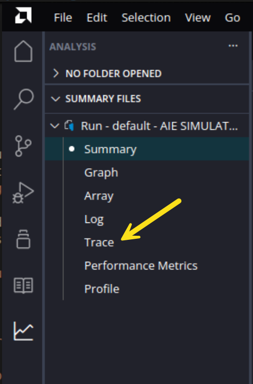
*Figure 12: Vitis Analyzer: Trace Menu*

Double-click the **Run - default - AIE SIMULATION** window to maximize it (Figure 13).

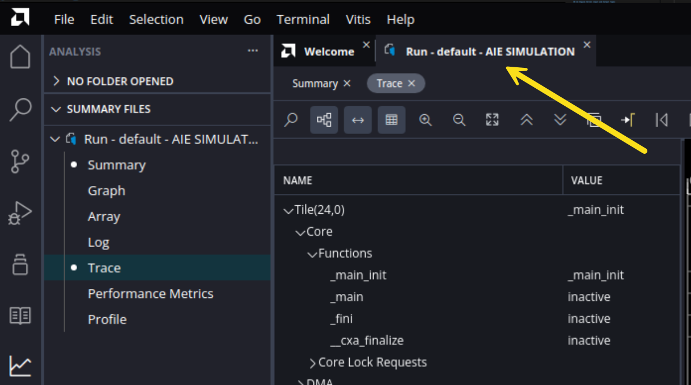
*Figure 13: Default - AIE SIMULATOR Window*

Double-click the Vitis Analyzer window to maximize it (double-click again to restore).

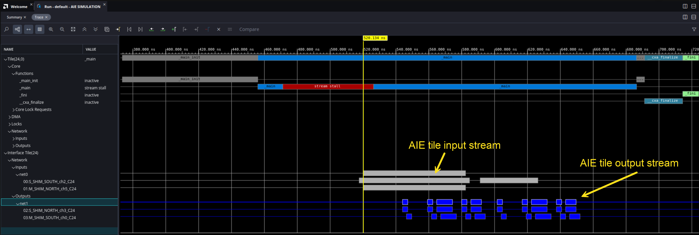
*Figure 14: Stream Trace Data*

Execute the function twice (as specified in ``src/tb.cpp``), processing eight vectors per invocation. Note that there are no spaces between the data in the input stream, but the output stream is "bursty." This code is not optimized. Optimization in outside the scope of this tutorial.

## Sample Code for Buffer Input and Output

The following code segment shows how to calculate the product of two matrices. For this tutorial, the matrices are 4x4 with ``int16`` elements (constrained to ``int8`` to avoid overflow). Note that although the function uses a template, using other values for the template parameters has not been tested.

```C++
template <typename Ta, typename Tb, typename Tp, unsigned Arows, unsigned Acols, unsigned Bcols, unsigned burst_count>
void matmul(
    adf::input_buffer< Ta, adf::extents<burst_count * Arows * Acols>> &Amtx,  // input "A" matrix
    adf::input_buffer< Tb, adf::extents<burst_count * Acols * Bcols>> &Bmtx,  // input "B" matrix
    adf::output_buffer<Tp, adf::extents<burst_count * Arows * Bcols>> &Pmtx   // output "P" product matrix
) {

    constexpr unsigned Aelems = Arows * Acols;  // no. of elements in "A" matrix
    constexpr unsigned Belems = Acols * Bcols;  // no. of elements in "B" matrix
    constexpr unsigned Pelems = Arows * Bcols;  // no. of elements in "P" matrix
    using MMUL = aie::mmul<Arows, Acols, Bcols, Ta, Tb>;    // alias for matrix multiplication class

    auto aptr = aie::begin_vector<Aelems>(Amtx);    // iterator for "A" matrix
    auto bptr = aie::begin_vector<Belems>(Bmtx);    // iterator for "B" matrix
    auto pptr = aie::begin_vector<Pelems>(Pmtx);    // iterator for "P" matrix

    for (auto i = 0u; i < burst_count; i++) {

        auto a = *aptr++;   // load "Aelems" from buffer to vector register "a"
        auto b = *bptr++;   // load "Belems" from buffer to vector register "b"
        MMUL mtxmul;        // instantiate matrix multiplication class
        mtxmul.mul(a, b);   // perform matrix multiplication
        auto p = mtxmul.template to_vector<Tp>();   // store product matrix in accumulator to vector register "p"
        *pptr++ = p;        // send product matrix to output

    } // end for (auto i = 0u; i < burst_count; i++)

} // end matmul()
```

The input ports for the two input matrices are declared as ``input_buffer\<T\>``, where ``T`` is the typename specified in the template parameter list. Similarly, the output port is declared as ``output_buffer\<T\>``. ``adf::extents\<num_elems\>`` is an *optional* template parameter which declares how many elements can be placed in the buffer.

``aie::begin_vector\<N\>( )`` is an API which returns an iterator used to access ``N`` elements in the buffer.

``aie::mmul\<\>`` is a class used for matrix multiplication. The actual multiplication is performed using the member function ``mul( )``.

The ``to_vector\<T\>`` API is used to copy the product in the accumulator to a vector register.


Note that buffers are implemented as double buffers by default. This allows reading from one while the other is being written to.

### Unit Test for Matrix Multiplication Module

Directory structure:

```sh
$ cd ../matmul 
$ tree
.
├── data
│   ├── Ain.dat     # stimulus generated by matmul.jl
│   └── Bin.dat
├── julia           # Julia files to generate stimulus and reference vectors
│   ├── cleanup.jl
│   ├── matmul.jl
│   └── Pout.dat
│   └── README.txt
├── Makefile
└── src
    ├── graph.hpp
    ├── matmul.cpp
    ├── matmul.hpp
    ├── params.h
    └── tb.cpp
```

Examine the stimulus generation script ``julia/matmul.jl``. Examine the source code in the ``src`` directory.

Build and run the design in both functional (x86sim) and cycle-approximate (aiesim) modes. Note the results of the comparison between DUT and reference results.

```sh
$ make all | tee build.log

8< --- snip --- >8

Comparing x86sim and reference results...

diff -ws ./Emulation-SW/x86simulator_output/Pout.dat ./julia/Pout.dat
Files ./Emulation-SW/x86simulator_output/Pout.dat and ./julia/Pout.dat are identical

***************************** x86sim completed! *****************************

8< --- snip --- >8

Comparing aiesim and reference results...

diff -ws ./Emulation-HW/aiesimulator_output/Pout_new.dat ./julia/Pout.dat
Files ./Emulation-HW/aiesimulator_output/Pout_new.dat and ./julia/Pout.dat are identical

***************************** aiesim completed! *****************************
$
```

Examine the placement of the input and output buffers in the AIE array with Vitis Analyzer:

```sh
$ vitis_analyzer Emulation-HW/aiesimulator_output/default.aierun_summary &
```
Click on <span style="color: orange; font-family: Consolas;">Array</span> in the <span style="color: orange; font-family: Consolas;">Analysis</span> pane and zoom in on the <span style="color: orange; font-family: Consolas;">matmul</span> kernel (see Figure 15).

 <table class="sphinxhide" width="100%">
 <tr width="100%">
    <td>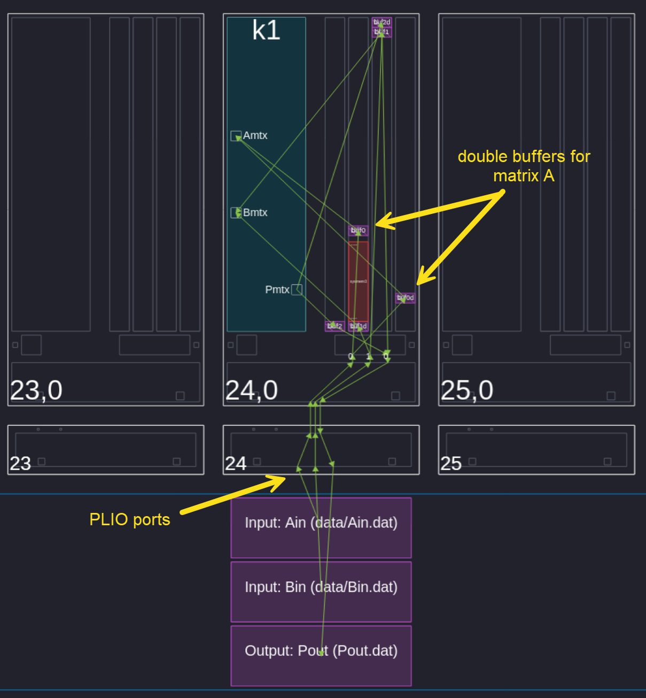</td>
 </tr>
 <tr width="100%">
    <td align="center">Figure 15: matmul in AIE tile array</td>
 </tr>
</table>
<br />

Note that the purple blocks in the PL (marked "Input" and "Output") are simulation artifacts. In an actual design, circuits have to placed in PL to achieve the desired functionality (provide or receive data).

Location constraints in the ADF graph (``src/graph.hpp``) direct the mapping tool to place the buffers in the same tile as the kernel.

```C++
      // location constraints on buffers
      // place all buffers on the same tile as the kernel
      location<buffer>(k1.in[0])  = location<kernel>(k1);
      location<buffer>(k1.in[1])  = location<kernel>(k1);
      location<buffer>(k1.out[0]) = location<kernel>(k1);
```

## Sample Code for Accumulator Cascade

The following code segment shows how to concatenate four 4x4 submatrices into an 8x8 matrix and multiply that with an 8x1 vector, with the result going through an accumulator cascade.

```C++
template<typename Ti, typename Tacc, unsigned mrows, unsigned mcols, unsigned burst_count>
void mtxvec(
    adf::input_buffer<Ti, adf::extents<burst_count * mrows * mcols>> &UL_in,  // input upper left matrix
    adf::input_buffer<Ti, adf::extents<burst_count * mrows * mcols>> &LL_in,  // input lower left matrix
    adf::input_buffer<Ti, adf::extents<burst_count * mrows * mcols>> &UR_in,  // input upper right matrix
    adf::input_buffer<Ti, adf::extents<burst_count * mrows * mcols>> &LR_in,  // input lower right matrix
    input_stream<Ti> *istrm,        // input vector
    output_cascade<Tacc> *ocstrm    // output accumulator cascade
) {

    // initialize iterators for input submatrices
    auto ul_ptr = aie::begin_vector<mrows * mcols>(UL_in);
    auto ll_ptr = aie::begin_vector<mrows * mcols>(LL_in);
    auto ur_ptr = aie::begin_vector<mrows * mcols>(UR_in);
    auto lr_ptr = aie::begin_vector<mrows * mcols>(LR_in);

    using MMUL = aie::mmul<(mrows * 2), (mcols * 2), 1, Ti, Ti, Tacc>;    // alias for matrix-vector multiplication class
    MMUL mvmul; // instantiate matrix-vector multiplication class

    for (auto i = 0u; i < burst_count; i++) {

        // concatenate sub-matrices
        auto [t1, t2] = aie::interleave_zip(*ul_ptr++, *ur_ptr++, mcols);
        auto top = aie::concat(t1, t2);
        auto [b1, b2] = aie::interleave_zip(*ll_ptr++, *lr_ptr++, mcols);
        auto bottom = aie::concat(b1, b2);
        auto m = aie::concat(top, bottom);

        auto v = readincr_v<mcols * 2>(istrm);  // form vector from stream
        mvmul.mul(m, v);                        // perform matrix-vector multiplication
        auto acc = mvmul.to_accum();            // put results in accumulator register
        writeincr(ocstrm, acc);                 // write accumulator to cascade stream

    } // end for (auto i = 0u; i < burst_count; i++)

} // end mtxvec()
```

In the example above, the output accumulator cascade is declared as ``output_cascade\<Tacc\>``. It is accessed in the same way as regular streams. Thus, writing to the output cascade stream uses ``writeincr( )``.

The 8x8 matrix is formed using ``aie::interleave_zip( )`` and ``aie::concat( )``. For details on these APIs, see [AI Engine API User Guide (UG1529)](https://www.xilinx.com/htmldocs/aiengine_intrinsics_start.html).

### Unit Test for Matrix-Vector Multiplication Module

Currently, Vitis does not handle unit tests with "dangling" input or output accumulator cascades (note however, that [Vitis Model Composer](https://www.amd.com/en/products/software/adaptive-socs-and-fpgas/vitis/vitis-model-composer.html) can). You must provide "Dummy" input or output kernels to act as sources or sinks for cascade streams.

Examine the stimulus generation script ``julia/mtxvec.jl``. Examine the source code in the ``src`` directory, especially the ``graph.hpp`` file.

Build and run the design in both functional (x86sim) and cycle-approximate (aiesim) modes. Note the results of the comparison between DUT and reference results.

```sh
$ cd ../mtxvec
$ make all | tee build.log

8< --- snip --- >8

Comparing x86sim and reference results...

diff -ws ./Emulation-SW/x86simulator_output/vout.dat ./julia/vo.dat
Files ./Emulation-SW/x86simulator_output/vout.dat and ./julia/vo.dat are identical

***************************** x86sim completed! *****************************

8< --- snip --- >8

Comparing aiesim and reference results...

diff -ws ./Emulation-HW/aiesimulator_output/vout_new.dat ./julia/vo.dat
Files ./Emulation-HW/aiesimulator_output/vout_new.dat and ./julia/vo.dat are identical

***************************** aiesim completed! *****************************
$
```

## Sample Code for Runtime Parameter (RTP)

The following code segment shows how to use a runtime parameter to generate a sum or difference of the cascade input and an input vector.

```C++
template<unsigned nelems, unsigned burst_count>
void sumdiff(
    const int8 mode,  // runtime parameter: 0: add; otherwise subtract
    input_stream<acc48> *icstrm,  // input vector via accumulator cascade
    input_stream<int32> *istrm,   // input vector via plio stream
    adf::output_buffer<int32, adf::extents<burst_count * nelems>> &out  // output sum or difference
) {

    // initialize iterator
    auto optr = aie::begin_vector<nelems>(out);

    // avoid if-else whenever possible in innermost loops as they will be executed on the scalar processor
    if (mode == 0) {    // perform addition
        for (auto i = 0u; i < burst_count; i++) {
            auto v1 = readincr_v<nelems>(icstrm);           // get input from previous accumulator
            auto v2 = readincr_v<nelems>(istrm);            // get input from plio
            auto acc = aie::add(v1, v2);                    // perform addition
            auto result = acc.template to_vector<int32>();  // copy accumulator to vector
            *optr++ = result;                               // write to output buffer

        } // end for (auto i = 0u; i < burst_count; i++) 
        
    } else {            // perform subtraction
        for (auto i = 0u; i < burst_count; i++) {
            auto v1 = readincr_v<nelems>(icstrm);           // get input from previous accumulator
            auto v2 = readincr_v<nelems>(istrm);            // get input from plio
            auto acc = aie::sub(v1, v2);                    // perform subtraction
            auto result = acc.template to_vector<int32>();  // copy accumulator to vector
            *optr++ = result;                               // write to output buffer
    
        } // end for (auto i = 0u; i < burst_count; i++) 
    } // end if-e,se (mode == 0)

} // end sumdiff()
```

Declare the input RTP as ``const int8 mode`` in the function argument list. Within the code, a simple ``if`` statement selects whether a sum or difference is output.

### Unit Test for SumDiff Module

Examine the stimulus generation script ``julia/sumdiff.jl``. Examine the source code in the ``src`` directory, especially the ``graph.hpp`` file.

Build and run the design in both functional (x86sim) and cycle-approximate (aiesim) modes. Note the results of the comparison between DUT and reference results.

```sh
$ cd ../sumdiff
$ make all | tee build.log

8< --- snip --- >8

Comparing x86sim and reference results...

diff -ws ./Emulation-SW/x86simulator_output/z.dat ./julia/z.dat
Files ./Emulation-SW/x86simulator_output/z.dat and ./julia/z.dat are identical

***************************** x86sim completed! *****************************

8< --- snip --- >8

Comparing aiesim and reference results...

diff -ws ./Emulation-HW/aiesimulator_output/z_new.dat ./julia/z.dat
Files ./Emulation-HW/aiesimulator_output/z_new.dat and ./julia/z.dat are identical

***************************** aiesim completed! *****************************
$
```

## Create the **_Contrived_** Task

You now have all the kernels required to create the *contrived* task.

### Advanced Dataflow Graph

The code for the ADF graph is divided into the following segments for easier perusal.

```C++
#pragma once

#include "params.h"
#include "sqmag.hpp"
#include "matmul.hpp"
#include "mtxvec.hpp"
#include "sumdiff.hpp"

using namespace adf;

// declare the ADF graph (it will be derived from the adf::graph class)
class theGraph : public graph {
private:

	kernel k_sqmag;                                     // squared magnitude
    kernel k_matmul1, k_matmul2, k_matmul3, k_matmul4;  // matrix multipliers
    kernel k_mtxvec;                                    // matrix-vector multiplier
    kernel k_sumdiff;                                   // sum-difference
```

The ADF graph is a header file and inherits from the ``adf::graph`` class. Declare the kernels as ``private`` members. All other members are ``public``.

```C++
public:

    input_plio xvec;                                // input complex vector
    input_plio Amtx, Bmtx, Cmtx, Dmtx, Emtx, Fmtx;  // input matrices
    input_plio yvec;                                // input vector
    input_port w;                                   // RTP
    output_plio zvec;                               // output vector

    using T1 = cint16;
    using T2 = int16;
    using T3 = int32;
    using Tacc = acc48;
```

The input RTP is declared as an ``input_port``. All other ports are coming from or going to the PL, and are declared as ``input_plio`` or ``output_plio``.

```C++
    theGraph() {

        k_sqmag   = kernel::create(sqmag<T1, T2, vlen, burst_count>);  // declare the function name and its template parameters
        k_matmul1 = kernel::create(matmul<T2, T2, T2, mrows, mcols, mcols, burst_count>);
        k_matmul2 = kernel::create(matmul<T2, T2, T2, mrows, mcols, mcols, burst_count>);
        k_matmul3 = kernel::create(matmul<T2, T2, T2, mrows, mcols, mcols, burst_count>);
        k_matmul4 = kernel::create(matmul<T2, T2, T2, mrows, mcols, mcols, burst_count>);
        k_mtxvec  = kernel::create(mtxvec<T2, Tacc, mrows, mcols, burst_count>);
        k_sumdiff = kernel::create(sumdiff<Tacc, T3, T3, vlen, burst_count>);

        source(k_sqmag)   = "src/sqmag.cpp";   // declare the location of the source code for the kernel
        source(k_matmul1) = "src/matmul.cpp";
        source(k_matmul2) = "src/matmul.cpp";
        source(k_matmul3) = "src/matmul.cpp";
        source(k_matmul4) = "src/matmul.cpp";
        source(k_mtxvec)  = "src/mtxvec.cpp";
        source(k_sumdiff) = "src/sumdiff.cpp";
```

Place other declarations within the graph constructor. In the previous code segment, you define the function associated with the kernel and its template parameters during kernel creation. You also declare the location of the source code for each kernel.

```C++
        runtime<ratio>(k_sqmag)   = 1.0;    // only this kernel will be placed on this tile
        runtime<ratio>(k_matmul1) = 1.0;
        runtime<ratio>(k_matmul2) = 1.0;
        runtime<ratio>(k_matmul3) = 1.0;
        runtime<ratio>(k_matmul4) = 1.0;
        runtime<ratio>(k_mtxvec)  = 1.0;
        runtime<ratio>(k_sumdiff) = 1.0;
```

The runtime ratio is a value > 0.0 and <= 1.0 used by the tools to determine whether it can fit more than one kernel into an AIE tile. It is the actual number of cycles used for computation divided by the total number of cycles available for a computation. A value of 1.0 implies that no other kernels are placed on that tile.

```C++
        // note that this system uses the VCK190 evaluation board as a platform
        // this platform has an AIE clock of 1.25GHz
        // the PL portion will have a slower clock of *at most* half of this, or 625MHz
        xvec = input_plio::create( "xvec", plio_64_bits, "data/x.dat", 625); 
        Amtx = input_plio::create( "Amtx", plio_64_bits, "data/A.dat", 625);
        Bmtx = input_plio::create( "Bmtx", plio_64_bits, "data/B.dat", 625);
        Cmtx = input_plio::create( "Cmtx", plio_64_bits, "data/C.dat", 625);
        Dmtx = input_plio::create( "Dmtx", plio_64_bits, "data/D.dat", 625);
        Emtx = input_plio::create( "Emtx", plio_64_bits, "data/E.dat", 625);
        Fmtx = input_plio::create( "Fmtx", plio_64_bits, "data/F.dat", 625);
        yvec = input_plio::create( "yvec", plio_64_bits, "data/y.dat", 625);
        zvec = output_plio::create("zvec", plio_64_bits, "z.dat",      625);
```

The ``create`` function for the PLIO ports declare names to identify the ports in reports and the width of the interface for each port. Source or destination files used during simulation are also declared here. The clock frequency (in MHz) used by the port may also be decared here.

```C++
        // establish connections
        connect(xvec.out[0], k_sqmag.in[0]);
        
        connect(Amtx.out[0], k_matmul1.in[0]);
        connect(Cmtx.out[0], k_matmul1.in[1]);

        connect(Bmtx.out[0], k_matmul2.in[0]);
        connect(Cmtx.out[0], k_matmul2.in[1]);

        connect(Dmtx.out[0], k_matmul3.in[0]);
        connect(Fmtx.out[0], k_matmul3.in[1]);
        
        connect(Emtx.out[0], k_matmul4.in[0]);
        connect(Fmtx.out[0], k_matmul4.in[1]);
        
        connect(k_matmul1.out[0], k_mtxvec.in[0]);
        connect(k_matmul2.out[0], k_mtxvec.in[1]);
        connect(k_matmul3.out[0], k_mtxvec.in[2]);
        connect(k_matmul4.out[0], k_mtxvec.in[3]);
        connect(k_sqmag.out[0],   k_mtxvec.in[4]);
        
        connect<parameter>(w, async(k_sumdiff.in[0]));
        connect<cascade>(k_mtxvec.out[0], k_sumdiff.in[1]);
        connect(yvec.out[0], k_sumdiff.in[2]);

        connect(k_sumdiff.out[0], zvec.in[0]);
```

The ``connect`` API establishes connections between graph elements. Note that all inputs and outputs are treated as arrays. The array index refers to the order in which the port was declared in the function prototype. A template parameter is required for ``parameter`` and ``cascade`` connections.

```C++
        // placement constraints
        location<stack>(k_sqmag)   = location<kernel>(k_sqmag);

        location<stack>(k_matmul1)         = location<kernel>(k_matmul1);
        location<buffer>(k_matmul1.in[0])  = location<kernel>(k_matmul1);
        location<buffer>(k_matmul1.in[1])  = location<kernel>(k_matmul1);

        location<stack>(k_matmul2) = location<kernel>(k_matmul2);
        location<buffer>(k_matmul2.in[0])  = location<kernel>(k_matmul2);
        location<buffer>(k_matmul2.in[1])  = location<kernel>(k_matmul2);

        location<stack>(k_matmul3) = location<kernel>(k_matmul3);
        location<buffer>(k_matmul3.in[0])  = location<kernel>(k_matmul3);
        location<buffer>(k_matmul3.in[1])  = location<kernel>(k_matmul3);

        location<stack>(k_matmul4) = location<kernel>(k_matmul4);
        location<buffer>(k_matmul4.in[0])  = location<kernel>(k_matmul4);
        location<buffer>(k_matmul4.in[1])  = location<kernel>(k_matmul4);

        location<stack>(k_mtxvec)  = location<kernel>(k_mtxvec);

        location<stack>(k_sumdiff) = location<kernel>(k_sumdiff);
        location<buffer>(k_sumdiff.out[0]) = location<kernel>(k_sumdiff);
        
    } // end theGraph() constructor
    
}; // end class theGraph    
```

Placement constraints direct the tool on how to map resources.

## Top-level File for **_Contrived_** Design

The top-level file acts as a simulation testbench during code development.

```C++
#include "graph.hpp"

theGraph g; // instantiate the ADF graph

int main() {

    g.init();   // initailize the graph

    // run once in addtion mode
    printf("  TESTBENCH INFO: Addition mode...\n");
    g.update(g.w, static_cast<int8>(0));    // mode = 0 : addition
    g.run(1);                               // run once    
    g.wait();                               // wait for it to complete

    // run once in subtration mode
    printf("  TESTBENCH INFO: Subtraction mode...\n");
    g.update(g.w, static_cast<int8>(1));    // mode != 0 : subtraction
    g.run(1);                               // run once
    g.wait();                               // wait for it to complete
    
    g.end();    // end the graph

    return (0);

} // end main()

```

It instantiates the ADF graph, initializes it, and runs it in addition mode for one iteration. It then updates the RTP to use subtraction mode for another iteration.

### Build the *Contrived* Design

```sh
$ cd ../../contrived
$ make all | tee build.log
```

Note that the DUT and reference results match.

Use the Vitis Analyzer to examine the placement of the kernels in the AIE tile array (Figure 16).

```sh
$ vitis_analyzer Emulation-HW/aiesimulator_output/default.aierun_summary
```

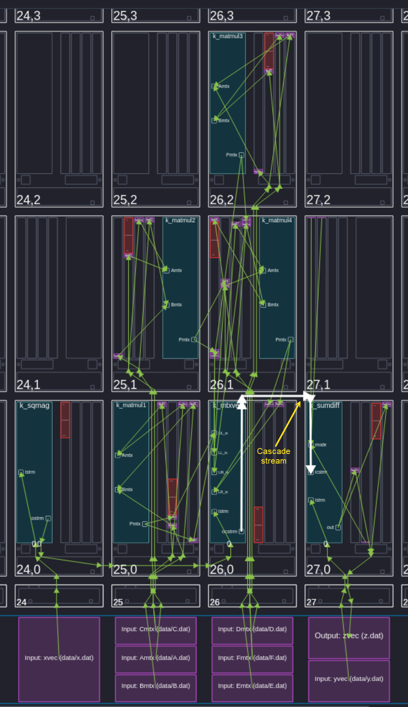
*Figure 16: Contrived Task Kernels in the AIE Tile Array*

Note that the ``k_mtxvec`` and ``k_sumdiff`` kernels share a cascade stream connection (highlighted in the figure) and hence you must place them adjacent to each other.

In the Vitis Analyzer, double-click on "Graph" in the Analysis pane to view the connections between kernels (Figure 17).

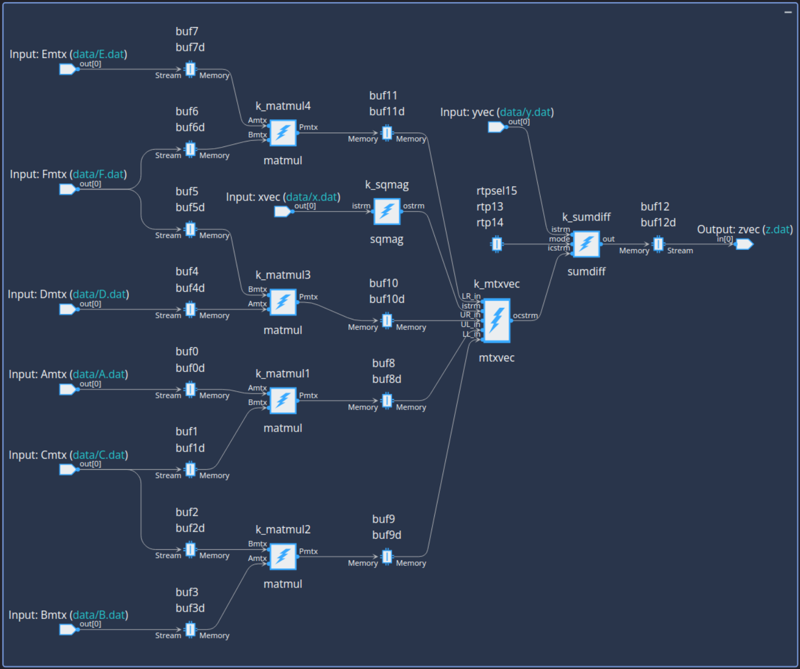
*Figure 17: Contrived Task Graph*

Open the trace view and check whether the matrix multipliers start roughly at the same time (Figure 18).

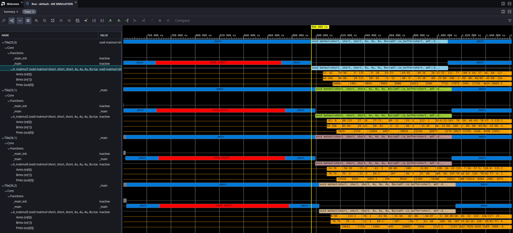
*Figure 18: Contrived Task Matrix Multiplier Kernels Trace*

## Conclusion

Any practical program requires inputs and outputs to perform computation. This tutorial showed how to read and write the various I/O port types available to the AI engine. It also showed a typical design flow where one starts with primitive modules and assembles them into a larger design.

## Learning Resources for AI Engine Kernel Programming

1. [AMD University Program AI Engine Tutorial](https://xilinx.github.io/xup_aie_training/)

    [N.B.: This requires Vitis 2022.2]

2. [Vitis Tutorials: AI Engine Development (XD100)](https://docs.amd.com/r/en-US/Vitis-Tutorials-AI-Engine-Development/Vitis-Tutorials-AI-Engine-Development-XD100): Contains basic tutorials as well as examples for specific applications.

3. [AI Engine Architecture & Tools Forum](https://adaptivesupport.amd.com/s/topic/0TO2E000000YKXjWAO/ai-engine-architecture-tools?language=en_US)

Ask questions on the forum!

## Support

GitHub issues track requests and bugs. For questions go to the [AI Engine Architecture & Tools Forum](https://adaptivesupport.amd.com/s/topic/0TO2E000000YKXjWAO/ai-engine-architecture-tools?language=en_US).

<p class="sphinxhide" align="center"><sub>Copyright © 2020–2026 Advanced Micro Devices, Inc</sub></p>

<p class="sphinxhide" align="center"><sup><a href="https://www.amd.com/en/corporate/copyright">Terms and Conditions</a></sup></p>
