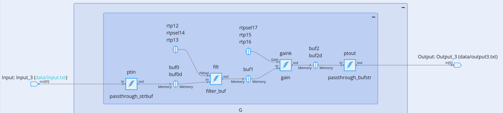
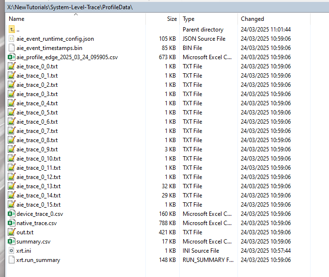
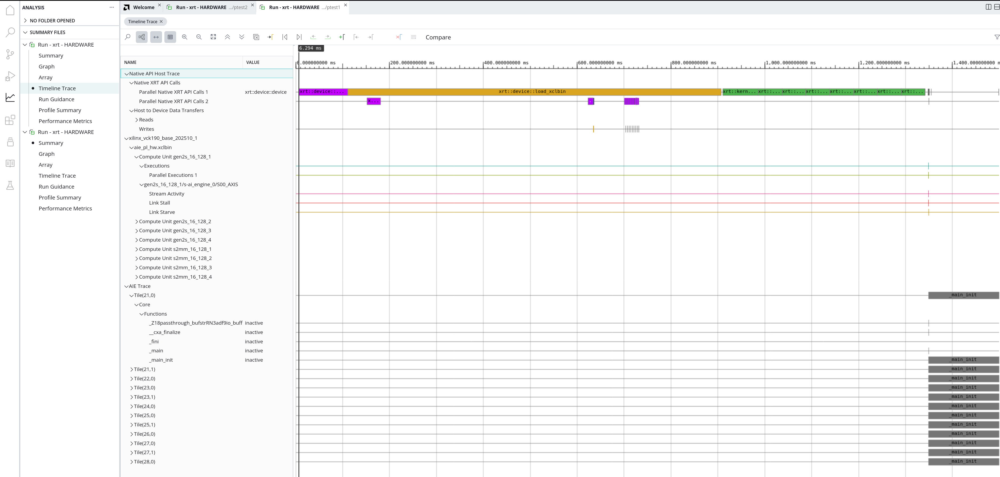
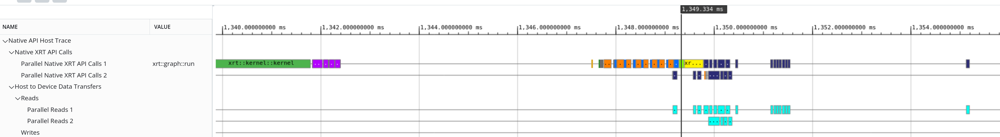
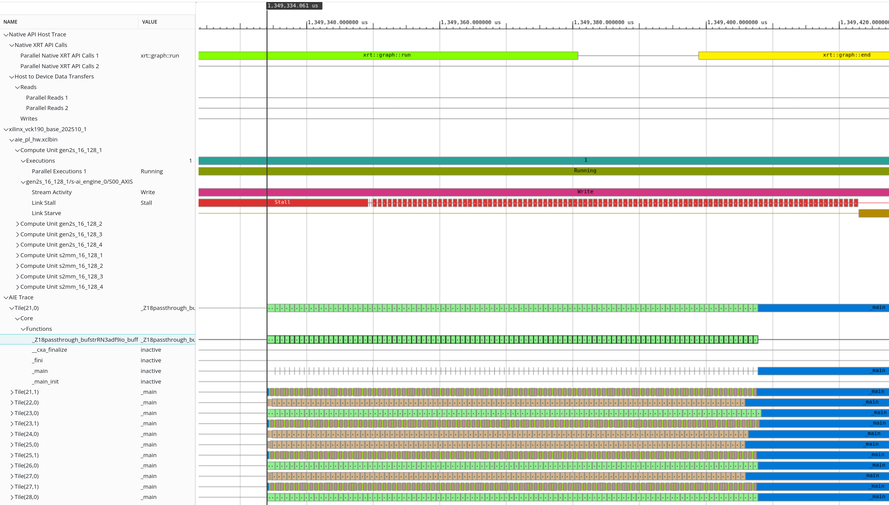
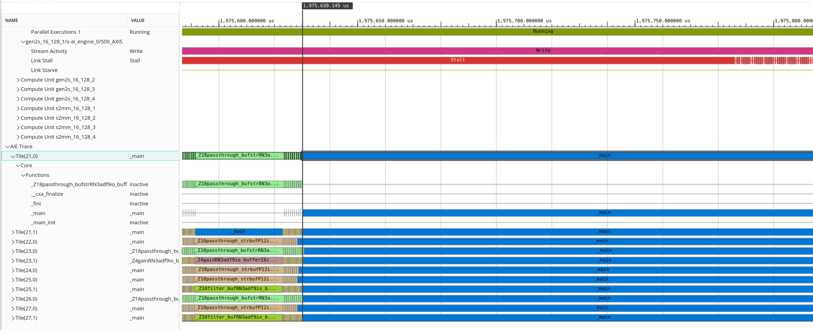

</table>
<table class="sphinxhide" width="100%">
 <tr width="100%">
    <td align="center"><h1>AI Engine Development</h1>
    <a href="https://www.xilinx.com/products/design-tools/vitis.html">See Vitis™ Development Environment on xilinx.com</br></a>
    <a href="https://www.xilinx.com/products/design-tools/vitis/vitis-ai.html">See Vitis™ AI Development Environment on xilinx.com</a>
    </td>
 </tr>
</table>

# System Timeline Tutorial

***Version: Vitis 2025.2***

This tutorial is based on a basic design to test the Vitis System Timeline feature.

## Introduction

AMD introduced a new (early access) feature called **System Timeline** in the AMD Vitis™ unified software platform 2025.2. This allows you to trace all subsystems of the device (PL, PS and AI Engine array). You can display them in the Vitis Analyzer on the same graph with a synchronized timeline. The goal is to understand how the various elements of the system work together. You can also track system controller bugs such as missing kernel start, incorrect number of iterations, and so on.

>**IMPORTANT**: Before beginning the tutorial, install the Vitis™ 2025.2 software platform. This release includes all the embedded base platforms, including the VCK190 base platform used in this tutorial. Also download the Common Images for Embedded Vitis Platforms from [this link](https://www.xilinx.com/support/download/index.html/content/xilinx/en/downloadNav/embedded-platforms.html).

The 'common image' package contains a prebuilt Linux kernel and root file system. You can use it with AMD Versal™ adaptive SoC boards for embedded design development using the Vitis software platform.

Before starting this tutorial, run the following steps:

1. Go to the directory where you have unzipped the Versal Common Image package.
2. In a Bash shell, run the ``/Common Images Dir/xilinx-versal-common-v2025.2/environment-setup-cortexa72-cortexa53-amd-linux`` script. This script sets up the SDKTARGETSYSROOT and CXX variables. If the script is not present, run ``/Common Images Dir/xilinx-versal-common-v2025.2/sdk.sh``.
3. Set up your ROOTFS and IMAGE to point to the ``rootfs.ext4`` and image files located in the ``/Common Images Dir/xilinx-versal-common-v2025.2`` directory.
4. Set up your PLATFORM_REPO_PATHS environment variable to ``$XILINX_VITIS/base_platforms``.

>**IMPORTANT**: This tutorial targets VCK190 production board for 2025.2 version.

Data generation for this tutorial requires [Python 3](https://www.python.org/downloads/). Ensure that are following packages are available:

- os
- sys
- numpy

>**Note**: This tutorial assumes that you have a basic understanding of the Adaptive Data Flow (ADF) API and Xilinx® Runtime (XRT) API usage. For more information about ADF API and XRT usage, refer to AI Engine Runtime Parameter Reconfiguration Tutorial and the Versal Adaptive SoC AI Engine Programming Environment User Guide ([UG1076](https://docs.amd.com/access/sources/dita/map?isLatest=true&ft:locale=en-US&url=ug1076-ai-engine-environment)).

## Objectives

After completing this tutorial, you can:

- Follow the complete flow to enable System Timeline for Hw debug.

## System Timeline Complete Flow

This tutorial has six stages:

1. Designing and compiling the AI Engine
2. Compiling PL kernels
3. Creating the xsa with the AI Engine interface and PL kernels
4. Compiling host code
5. Packaging and creating SD card image
6. Running the design on the board and capturing the trace
7. Analyzing the trace

The Makefile allows you to address each step alone or concatenate all steps in a single command:

```Makefile
   build_hw:
   make TARGET=hw  clean data aie kernels xclbin host package
```

### Designing and Compiling the AI Engine

The design replicates the same processing chain:

1. Passthrough.
2. Filtering.
3. Gain.
4. Passthrough.

The filter and the gain kernels receive asynchronous RTP to set the coefficients and the gain value.

By default, the design implements four of these chains. You can change this using the Makefile parameter `NAntenna`.

In `graph.cpp` the graph is instantiated as `MyGraph<NAntenna,40> G("");`. The value "40" specifies a utilization ratio of 40% for the filter and the gain, leading to a co-location for these two kernels. If you want them in different tiles, replace the value with one greater than 50.

Here is the subgraph of the fourth antenna:



During compilation, declare that the system extracts trace events during runtime. Set specific flags depending on how to extract these events through GMIO or PLIO:

#### GMIO-based Event Extraction

Refer to `aiecompiler_trace_gmio_options.cfg` for the configuration:

```shell
[aie]
event-trace=runtime
broadcast-enable-core=true
event-trace-port=gmio
xlopt=0
```

#### PLIO-based Event Extraction

Refer to `aiecompiler_trace_plio_options.cfg` for the configuration:

```shell
[aie]
event-trace=runtime
broadcast-enable-core=true
num-trace-streams=16
event-trace-port=plio
trace-plio-width=128
xlopt=0
```

Here are some options definitions:

- `event-trace=runtime`: Trace events are specified at runtime. This is the only possible option for hardware tracing.
- `broadcast-enable-core=true`: Ensures that the enable core signals are broadcasted so that all kernels start within a few clock cycles of each other.
- `event-trace-port=gmio/plio`: Selects the port type used for event tracing. GMIO is generally used for designs with limited PL resources, while PLIO is preferred for designs with sufficient PL resources.
- `num-trace-streams=16`: Sets the number of trace streams within the AI Engine array to be used for event tracing. The default is four streams, and the maximum is 16. Increasing the number of streams can reduce contention within the trace data path, especially in designs with a large number of active kernels. The drawback is that it would use more resources, making it more difficult for the router to route the AI Engine design by itself.
- `trace-plio-width=128`: Specifies the width of the PLIO trace interface.
- `xlopt=0`: Disables extra optimizations that could interfere with event tracing. Typically the compiler avoids inlining the kernels within the main function. This allows you to see each kernel as a separate entity in the trace and have a clear view of all iterations.

### Link Stage

The system enables PL Trace during the link stage by adding the `--profile.data` flag to the `v++` command line.

```shell
v++ -g -l --platform ${PLATFORM} ${XOS} ${LIBADF} -t hw --save-temps --verbose --config ${VPP_SPEC} --profile.data all:all:all -o XCLBIN_File
```

The --profile option profiles many different activities. For more information, refer to [--profile Options in UG1702](https://docs.amd.com/r/en-US/ug1702-vitis-accelerated-reference/profile-Options).

`--profile.data all:all:all` monitors data on all kernels and compute units.

### Run on Hardware

The packaging step creates a zip version of the SD card image that you can use with any usual SD Card flash software like balenaEtcher. When you run the application on hardware using XRT on Linux, capture the trace using the following `xrt.ini` file specification:

```shell
# Debug group for the aie, ps and pl
[Debug]
aie_profile = false
aie_trace = true
device_trace=fine
continuous_trace = true
host_trace=true

# PL Trace buffer
trace_buffer_size = 32M
trace_buffer_offload_interval_ms = 5

# Subsection for AIE profile settings only if aie_profile is set to true
[AIE_profile_settings]
# Interval in between reading counters (in us)
interval_us = 1000

tile_based_aie_metrics = all:heat_map
tile_based_aie_memory_metrics = all:conflicts
tile_based_interface_tile_metrics = all:output_throughputs


# Subsection for AIE Trace only if aie_trace is set to true
[AIE_trace_settings]
# PLIO
reuse_buffer = true
periodic_offload = true
buffer_offload_interval_us = 50
buffer_size = 100M

tile_based_aie_tile_metrics = all:functions
enable_system_timeline = true

[Runtime]
verbosity = 10
```

The option `enable-system-timeline`is true by default. Find more information at [*xrt.ini* file in UG1702](https://docs.amd.com/r/en-US/ug1702-vitis-accelerated-reference/xrt.ini-File).

Follow these steps to boot the board, configure the environment, and run the application to capture trace data:

1. Plug the SD card in your board
2. Connect the right COM port.
3. Boot the board.
4. Login with username `petalinux` and set the password to whatever you want, let say `p`.
5. For the next steps you must be a superuser: `sudo su` and enter your password.
6. Change `root` password: `passwd root` to use `r` as the password.
7. As you must copy back the trace files, allow connection with `root` through ethernet: `vi /etc/ssh/sshd_config`.
8. Change the option of `PermitRootLogin` into `yes`.
9. Now, go to the application directory: `cd /run/media/mmcblk0p1`.
10. To run the application multiple times with different options, use the script `newdir` which copies the necessary files into directory `ptest1`, `ptest2`, and more.
11. In `ptest1`, check the content of `xrt.ini` and `embedded_exec.sh`.
12. Run the application: `./embedded_exec.sh`

    All trace files generate in 2 s. To perform another test with other parameters, run `./newdir` from `/run/media/mmcblk0p1` and change the parameters in `ptest2/xrt.ini`. Type `reboot` to restart the board and re-run the application.

After running the application with multiple sets of parameters, copy the various `ptest` directories back to your development machine using `scp`. Use `ifconfig` to get the board IP address.

You can copy the whole `ptest*`directories to `ProfileData` on your development machine. The minimum set of files that you have to copy is: `*.csv, *.txt, *.bin, *summary`



Now you can run `vitis_analyzer`on your development machine with the summary file: `vitis_analyzer xrt.run_summary`. To view the System Timeline, enable it on the tool by clicking *Vitis -> New Feature Preview* in the top bar menu and checking *System Timeline*.

Click the analysis tab on the Vitis Analyzer, and click *Timeline Trace*.

The overall view covers the complete simulation time:



In the beginning, you can see when the processing system opens the device and starts the PL kernels:



Zooming in where the AI Engine graph starts, you can see the PL kernels **gen2s** generating the data and the AI Engine kernels consuming these data. These traces align well enough to understand the overall behavior of the system.



The polling interval is crucial in event alignment. Reducing the polling interval improves event alignment in the timeline at the expense of increased timestamp file size. To show the effect of different polling intervals, modify the `buffer_offload_interval_us` parameter in `xrt.ini` file. The default value is 50 µs. The following example shows 100 µs:



As you can see , the PL kernels are out of sync with the AI Engine array iterations.

### Other Tests

You can play with all parameters:

- trace_buffer_offload_interval_ms
- tile_based_aie_tile_metrics
- Change or remove AI Engine Profiling metrics
- Change number of iterations in embedded_exec.sh

## Conclusion

This tutorial explored how to set up and analyze system-level traces for AI Engine applications using the system timeline feature. It covered the necessary configuration changes and the process of running the application on the target hardware. You learned steps to collect and analyze the generated trace files. By leveraging the Vitis Analyzer tool, you can gain valuable insights into the performance and behavior of your AI Engine applications. This enables you to optimize and improve their efficiency.

## License

 The MIT License (MIT)

 Copyright (c) 2026 Advanced Micro Devices, Inc. All rights reserved.
 SPDX-License-Identifier: MIT

## Support

Use GitHub issues for tracking requests and bugs. For questions, go to [support.amd.com](https://support.amd.com/).

<hr class="sphinxhide"></hr>

<p class="sphinxhide" align="center"><sub>Copyright © 2021–2026 Advanced Micro Devices, Inc.</sub></p>

<p class="sphinxhide" align="center"><sup><a href="https://www.amd.com/en/corporate/copyright">Terms and Conditions</a></sup></p>
