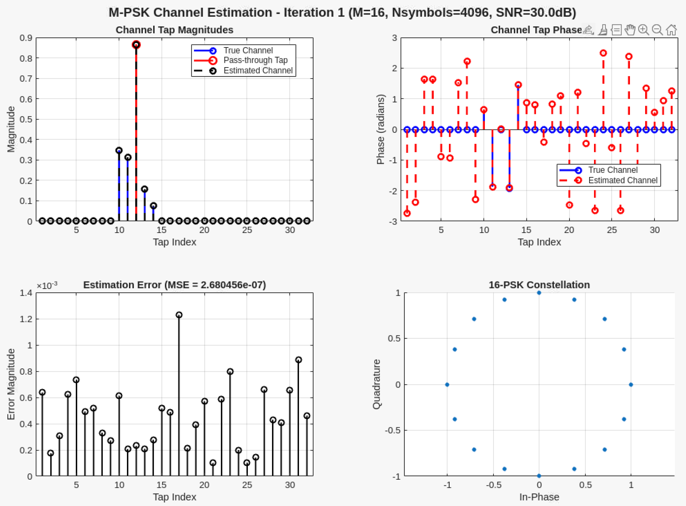
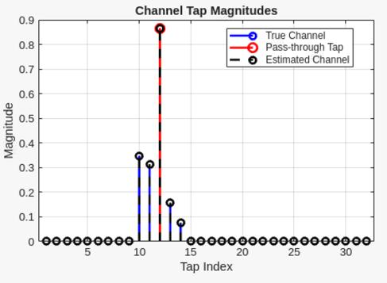
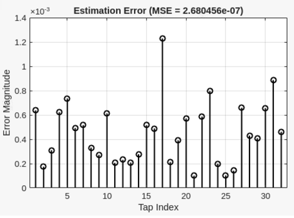
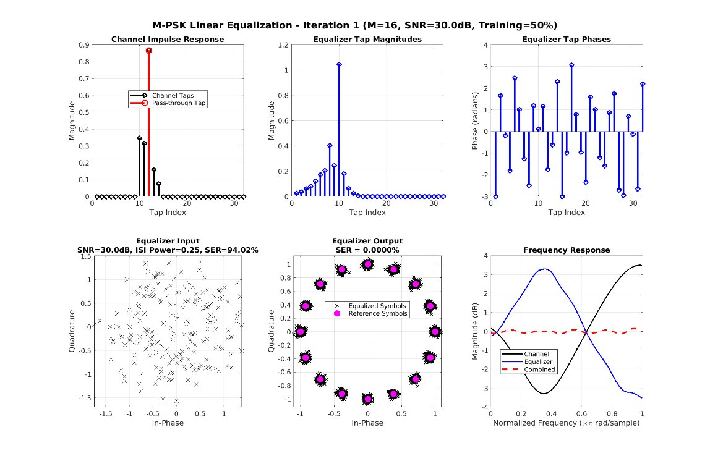
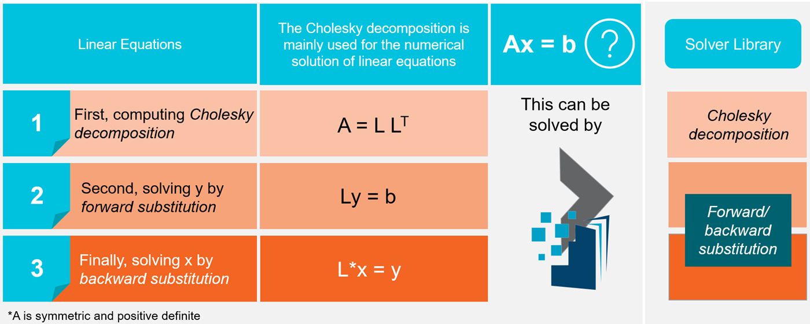

<table class="sphinxhide" style="width:100%;">
  <tr>
    <td align="center">
      <picture>
        <source media="(prefers-color-scheme: dark)" srcset="https://raw.githubusercontent.com/Xilinx/Image-Collateral/main/logo-white-text.png">
        
      </picture>
      <h1>AMD Vitis™ AI Engine Tutorials</h1>
      <a href="https://www.amd.com/en/products/software/adaptive-socs-and-fpgas/vitis.html">See Vitis™ Development Environment on amd.com</a>
        </br>
      <a href="https://www.amd.com/en/products/software/vitis-ai.html">See Vitis™ AI Development Environment on amd.com</a>
    </td>
  </tr>
</table>

# Solving Linear Systems Using Solver Libraries

***Version: Vitis 2026.1***

## Introduction

Many wireless and signal-processing algorithms reduce to **solving linear systems** or related least-squares problems. The AI Engine Solver Library provides optimized building blocks—such as **Cholesky decomposition** and **forward/backward substitution**—that you can connect in a dataflow graph to solve structured problems efficiently on Versal AI Engines.

**IMPORTANT**: Before starting this tutorial, read and follow the *Vitis Software Platform Release Notes* (v2026.1) to set up the software and install the **VCK190** base platform.

Then complete the following steps:

1. Download the Vitis libraries from https://github.com/Xilinx/Vitis_Libraries. For example: run `git clone https://github.com/Xilinx/Vitis_Libraries.git` to an appropriate directory.
2. Set the `DSPLIB_ROOT` to the downloaded Vitis libraries path. For example, run `export DSPLIB_ROOT=/<DSP_LIBRARY_PATH>/Vitis_Libraries/dsp`
3. Set the `SOLVERLIB_ROOT` to the downloaded Vitis libraries path. For example, run `export SOLVERLIB_ROOT=/<DSP_LIBRARY_PATH>/Vitis_Libraries/solver`
4. If you want to generate the test vectors using the MATLAB® model provided, MATLAB must be installed to create the test vectors and compare the simulation results against the golden reference data. ***Note:*** The required test vectors are already available.

# Table of Contents

- [Objectives](#objectives)
- [Introduction to Vitis Solver Library](#introduction-to-vitis-solver-library)
- [Use Cases - Solving Linear Systems using Solver Libraries](#use-cases---solving-linear-systems-using-solver-libraries)
  - [Use Case #1: M-PSK Channel Estimation](#use-case-1-m-psk-channel-estimation)
  - [Use Case #2: M-PSK Linear Equalization](#use-case-2-m-psk-linear-equalization)
- [List of parameters in Cholesky Decomposition](#list-of-parameters-in-cholesky-decomposition)
- [List of parameters in Substitution](#list-of-parameters-in-substitution)
- [Configuring the Parameters](#configuring-the-parameters)
  - [Cholesky decomposition](#cholesky-decomposition)
  - [Forward Substitution](#forward-substitution)
  - [Backward Substitution](#backward-substitution)
- [Running the Design](#running-the-design)
  - [Change the Project Path](#change-the-project-path)
  - [Review the graph.h File](#review-the-graphh-file)
  - [Review the graph.cpp File](#review-the-graphcpp-file)
  - [Compile and Simulate the Design](#compile-and-simulate-the-design)
  - [Analyze the Reports](#analyze-the-reports)
- [Conclusion](#conclusion)

## Objectives

- Provide an overview of Cholesky decomposition and substitution within the AI Engine Solver Library.
- Configure Cholesky decomposition and substitution parameters based on design requirements.
- Review and validate the graph code, including parameter settings and connectivity for both modules.
- Execute the design and verify the correctness of results.

## Introduction to Vitis Solver Library

Vitis Solver Library provides a collection of matrix decomposition operations, linear solvers and eigenvalue solvers. The AMD Vitis™ AI Engine Solver library encapsulates several solver algorithms, optimized to take full advantage of the processing power of AMD Versal™ adaptive SoC devices, which contain an array of AI Engines.

Currently this includes the following operations for dense matrix:

**Matrix decomposition**

- Cholesky decomposition for symmetric positive definite matrix
- QR decomposition (Gram-Schmidt method)
- Substitution (Forward/Backward)

For more information, see the *[AI Engine Solver Library User Guide](https://docs.amd.com/r/en-US/Vitis_Libraries/AIE-Solver-Library-User-Guide)*.

## Use Cases - Solving Linear Systems using Solver Libraries

The following use cases illustrate how Cholesky decomposition and substitution appear in practical receiver algorithms. 

### Use Case #1: M-PSK Channel Estimation

In **M-ary phase shift keying (M-PSK)**, information is encoded in the phase of each transmitted symbol. After the signal passes through a dispersive communication channel, the received symbols are corrupted by **inter-symbol interference (ISI)**: energy from neighboring symbols leaks into the current symbol interval and **spreads** the constellation at the receiver.

**FIR time-domain channel response (top-left)**  
The plot illustrates a short FIR model of the channel in the time domain. A **dominant central tap** (highlighted in red) represents the nominal pass-through path—the component you would ideally like to receive undistorted. **Smaller surrounding taps** (blue) model multipath and filtering effects that introduce ISI.

**Receiver strategy**  
To mitigate distortion, the receiver **estimates the unknown channel taps**. With good tap estimates, the receiver can reconstruct the interference contributed by the ISI taps and **subtract** it (or otherwise use the taps inside a sequence detector). A common choice is a **Viterbi decoder** that uses the estimated channel model to improve detection under ISI.

**Tap comparison**  
In the tap comparison view, **blue** indicates the **true** channel taps, **red** emphasizes the main pass-through tap, and **black** shows **estimated taps** obtained from the receiver processing chain. In setups like this tutorial’s reference model, the linear algebra used to estimate taps can be implemented using **Cholesky factorization** together with **forward and backward substitution**.



**Mean squared error (bottom-left)**  
This view reports the **mean squared error (MSE)** for each tap estimate. When the estimator is well conditioned, the errors are small (often on the order of **10⁻³** or below for significant taps), indicating that the dominant structure of the channel has been captured accurately.

**Magnitude and phase (right side)**  
Because the taps are complex-valued, both **magnitude** and **phase** matter. The visuals note that the **true channel phase** may be **zero** by construction in the example, while **estimated phase** can fluctuate for taps with **very small magnitude**—where phase is poorly defined and contributes little to the received signal. For the **few dominant taps** with larger magnitude, phase estimates tend to be more meaningful and stable.

**Two-step takeaway**

1. **Estimate** the channel taps.  
2. **Use** those estimates to compensate for ISI and recover the transmitted symbols.





### Use Case #2: M-PSK Linear Equalization

Some systems want to avoid the complexity of a **Viterbi decoder** and instead apply a **linear equalizer** implemented as an **FIR filter** at the receiver.



**Channel response (top-left)**  
The time-domain view shows a strong **pass-through tap** (red) and additional taps (black) that introduce distortion.

**Receiver input (bottom-left)**  
After the poor channel, the **PSK constellation** appears **smeared** and noisy—symbols are no longer tight clusters.

**Equalizer concept (middle / blue FIR)**  
Instead of explicitly canceling each black channel tap one by one, the receiver applies a FIR filter (blue) whose taps are chosen so that, when cascaded with the channel, the **effective end-to-end response** is close to an ideal **pass-through** response.

**After equalization (bottom-middle)**  
Filtering the distorted received signal with the equalizer yields a **cleaner, tighter** constellation—clusters become well separated again.

**Role of the equalizer in the frequency domain**  
Channels often attenuate some frequencies more than others. An equalizer **boosts suppressed frequencies** so that the **combined** channel-plus-equalizer response (visualized as a flattened **red** composite response) is closer to **flat**, restoring uniform gain across the band of interest.

**Designing the equalizer taps**  
The FIR equalizer coefficients are commonly computed by solving a **least-squares** problem. A practical implementation path on AI Engines is:

- **Cholesky decomposition**
- **Forward substitution**
- **Backward substitution**

## Solving linear equations
We want to solve 
\[
A x = b
\]



where **\(A\)** is the coefficient matrix and **\(b\)** is the known right-hand side (input vector). The unknown **\(x\)** is what we compute.

For the Cholesky-based approach, **\(A\)** must be **symmetric and positive definite (SPD)**.

## Why Cholesky decomposition

**Cholesky decomposition** is mainly used for the **numerical solution** of linear equations \(A x = b\). 

## Factorization

First, form the Cholesky factorization:

\[
A = L L<sup>T</sup>
\]

**\(L\)** is a **lower triangular** matrix produced by Cholesky decomposition (the original **\(A\)** is not replaced by \(L\); we obtain **\(L\)** so that \(A = L L<sup>T</sup>\)).

## Two triangular solves

After \(L\) is known, the solve is split into two steps:

1. **Forward substitution** — solve for an intermediate vector **\(y\)** in  
   \[
   L y = b
   \]
2. **Backward substitution** — solve for **\(x\)** in  
   \[
   L<sup>T</sup> x = y
   \]

Then **\(x\)** satisfies \(A x = b\), because \(A x = L L<sup>T</sup> x = L y = b\); replace A with L L<sup>T</sup>.

## Three stages

| Stage | What you compute | Equation |
|-------|------------------|----------|
| 1 | Lower triangular Cholesky factor **\(L\)** | \(A = L L<sup>T</sup>\) |
| 2 | Intermediate **\(y\)** by forward substitution | \(L y = b\) |
| 3 | Solution **\(x\)** by backward substitution | \(L<sup>T</sup> x = y\) |

This matches the ordering: **Cholesky decomposition**, then **forward substitution** for \(y\), then **backward substitution** for \(x\).


## List of parameters in Cholesky Decomposition

The Cholesky graph is templated so you can trade matrix size, datatype, framing, grid tiling, and cascade depth. The table below summarizes the primary template controls (names follow the library graph template; see the linked API reference for exact class spelling and additional notes).

| Parameter | Description |
|-----------|-------------|
| **TP_DIM** | Matrix dimension along one side. For an `N x N` matrix, `TP_DIM` is `N` (for example, `32` for a `32 x 32` matrix). |
| **TP_NUM_FRAMES** | Number of matrices processed per kernel invocation (per call), enabling multi-frame scheduling when your application batches multiple factorizations. |
| **TP_GRID_DIM** | Grid tiling factor along one dimension for splitting a large matrix across multiple kernels/tiles. The tiled organization uses a lower-triangular grid pattern; increasing `TP_GRID_DIM` enables larger matrices than a single kernel instance alone. |
| **TP_CASC_LEN** | Cascade depth used to increase throughput by chaining multiple AI Engine processors in the implementation. |
| **TT_DATA** | Sample datatype for matrix elements (for example, `float` or `cfloat`). |

**`TP_DIM` and `TP_GRID_DIM`**

- **`TP_GRID_DIM` must divide `TP_DIM` evenly** so each tile operates on a consistent sub-matrix size.
- The **sub-matrix dimension** after tiling must align with vectorized memory access requirements (for example, relationships involving **`vecSampleNum`** derived from datatype width and the effective vector load width on the device variant).
- Practical combinations depend on device architecture (AI Engine versus AI Engine ML variants) and datatype. Always cross-check against your target device and the latest library release notes.

Here’s an example illustrating how TP_DIM and TP_GRID_DIM are calculated.

This example shows how **TP_DIM** and **TP_GRID_DIM** are derived for the example configuration, and lists **legal** `TP_GRID_DIM` values for **float** on the **AIE variant**.

## Memory Access Width
| Parameter | Value |
|-----------|--------|
| **AIE architecture** | AIE variant |
| **Single memory access width** | 256 bits |

## `vecSampleNum` from data type

`vecSampleNum` is the number of samples per 256-bit vector access:

| Data type | Bits per element | vecSampleNum |
|-----------|------------------|--------------|
| `cfloat`  | 64 | 256 ÷ 64 = **4** |
| `float`   | 32 | 256 ÷ 32 = **8** |

## Legal `TP_DIM` and `TP_GRID_DIM` (AIE variant, `float`)

> **Note:** The combination **TP_DIM** / **TP_GRID_DIM** must define a **sub-matrix that fits on a tile**. Only the grid divisors listed below are valid for the given **TP_DIM** on this architecture and data type.

Each row gives **TP_DIM** and the allowed **TP_GRID_DIM** values (as a list of integers).

| TP_DIM | TP_GRID_DIM |
|--------|----------------|
| 8 | `[1]` |
| 16 | `[1, 2]` |
| 24 | `[1, 3]` |
| 32 | `[1, 2, 4]` |
| 40 | `[1, 5]` |
| 48 | `[1, 2, 6]` |
| 56 | `[1]` |
| 64 | `[1, 2, 4]` |
| 72 | `[1, 3]` |
| 80 | `[1, 2, 5]` |
| 88 | `[1]` |
| 96 | `[2, 3, 4, 6]` |
| … | *(see product docs for other TP_DIM)* |
| 256 | `[4]` |

For more information on cholesky decomposition, see **[Vitis_Libraries > Cholesky_decomposition](https://docs.amd.com/r/en-US/Vitis_Libraries/solver/rst/class_xf_solver_aie_cholesky_cholesky_graph.html)**.

## List of parameters in Substitution

The substitution graph solves triangular linear systems and is instantiated twice in this design: once for **forward** substitution and once for **backward** substitution. The template parameters control matrix size, direction, datatype, leading-dimension storage behavior, and tiling.

| Parameter | Description |
|-----------|-------------|
| **DIM_SIZE** (matrix dimension parameter) | Length of one dimension of the square system (for example, `32` for `32 x 32` triangular solves aligned with Cholesky output). |
| **TP_SUBST_TYPE** (substitution direction) | Selects **forward** versus **backward** substitution. Forward substitution assumes a **lower** triangular system; backward substitution assumes an **upper** triangular system (consistent with solving `L^T x = y`). |
| **TP_GRID_DIM** | Grid tiling factor for dividing the problem across multiple kernels, analogous in intent to other tiled solver graphs. |
| **TP_L_LEADING** | Leading-dimension / storage interpretation controls for how the triangular matrix `L` is read (row-major versus column-major conventions, depending on direction and transpose settings). Set these to match how Cholesky presents `L` and how vectors are streamed into the graph. |
| **TT_DATA** | Sample datatype for matrix and vector elements (for example, `float` or `cfloat`). |

> Tip: If you are familiar with other Vitis L2 graphs (for example, GEMM), think of these fields the same way: they establish **datatype**, **problem dimensions**, **tiling**, **parallelism**, and **data layout** expectations that must remain consistent across connected graphs.

For more information on Substitution, see **[Vitis_Libraries > Substitution](https://docs.amd.com/r/en-US/Vitis_Libraries/solver/rst/group_substitution_graph.html)**.

## Configuring the Parameters

This repository’s ADF graph connects three library graphs in series:

- **Cholesky:** `A = L · Lᵀ` → `xf::solver::aie::cholesky::cholesky_graph`
- **Forward substitution:** `L y = b` → `xf::solver::aie::substitution::substitution_graph` (**forward**)
- **Backward substitution:** `Lᵀ x = y` → `xf::solver::aie::substitution::substitution_graph` (**backward**)

### Cholesky decomposition

Design target for this tutorial example:

- **Matrix size:** `32 x 32`
- **Datatype:** `cfloat`
- **Single-tile mapping:** set **`TP_GRID_DIM = 1`** so the full matrix maps to one tile configuration (paired with **`TP_CASC_LEN = 1`** in the included design).

In `design/src/graph.h`, the Cholesky section is configured similarly to:

```cpp
#define TT_DATA cfloat
#define TP_DIM 32
#define TP_NUM_FRAMES 1
#define TP_GRID_DIM 1
#define TP_CASC_LEN 1
```

### Forward Substitution

Forward substitution uses **`FWD_SUBST_TYPE = 0`**, with **`TP_L_LEADING_TRANSPOSE = 1`** and **`TP_GRID_DIM = 1`** to match the Cholesky output connectivity and the single-tile requirement.

```cpp
#define DIM_SIZE_SUBSTITUTION 32
#define TP_L_LEADING_TRANSPOSE 1
#define FWD_SUBST_TYPE 0

xf::solver::aie::substitution::substitution_graph<TT_DATA, DIM_SIZE_SUBSTITUTION, FWD_SUBST_TYPE,
                                                  TP_L_LEADING_TRANSPOSE, TP_GRID_DIM>
    fwd_substitutionGraph;
```

### Backward Substitution

Backward substitution uses **`BCK_SUBST_TYPE = 1`**, with **`TP_L_LEADING`** set to match the stored leading dimension behavior for the transpose solve, and **`TP_GRID_DIM = 1`**.

```cpp
#define TP_L_LEADING 1
#define BCK_SUBST_TYPE 1

xf::solver::aie::substitution::substitution_graph<TT_DATA, DIM_SIZE_SUBSTITUTION, BCK_SUBST_TYPE, TP_L_LEADING,
                                                  TP_GRID_DIM>
    bck_substitutionGraph;
```

**Connectivity (`design/src/graph.h`)**

The output lower-triangular factor from Cholesky feeds **both** substitution graphs (as `L` for forward and as the transposed triangular structure for backward, consistent with the library’s backward mode). The right-hand side vector `b` enters the forward graph; the intermediate solution `y` flows from forward to backward; the final solution `x` drives the PLIO output.

```59:71:/solver_library/design/src/graph.h
        // Cholesky: A_matrix -> choleskyGraph -> matL_output
        connect<> net_A(A_matrix.out[0], choleskyGraph.in[0]);

        // Forward substitution: matL_output and b_input -> y_output
        connect<> net_L_fwd(choleskyGraph.out[0], fwd_substitutionGraph.L_in[0]);
        connect<> net_b(b_input.out[0], fwd_substitutionGraph.y_in[0]);
        
        // Backward substitution: L from Cholesky and y from forward substitution -> x_output
        connect<> net_L_bck(choleskyGraph.out[0], bck_substitutionGraph.L_in[0]);
        connect<> net_y(fwd_substitutionGraph.x_out[0], bck_substitutionGraph.y_in[0]);

        // Output: x_output
        connect<> net_x(bck_substitutionGraph.x_out[0], x_output.in[0]);
```


## Running the Design

### Change the Project Path

Run the following command to navigate to the project path:

```bash
cd <path-to-tutorial>/AIE/Feature_Tutorials/28-solver_library/design
```

### Review the graph.h File

Open `src/graph.h` and review the code:

- **Graph class:** `class LinearEquSolverGraph : public adf::graph`
- **Cholesky, forward substitution, and backward substitution parameter definitions:** macros for `TT_DATA`, `TP_DIM`, `TP_NUM_FRAMES`, `TP_GRID_DIM`, `TP_CASC_LEN`, substitution direction, leading-dimension controls, and `DIM_SIZE_SUBSTITUTION`
- **Graph objects:**
  - `xf::solver::aie::cholesky::cholesky_graph<> choleskyGraph;`
  - `xf::solver::aie::substitution::substitution_graph<> fwd_substitutionGraph;`
  - `xf::solver::aie::substitution::substitution_graph<> bck_substitutionGraph;`
- **Connectivity:** observe how nets are declared so that data flows **Cholesky → forward substitution → backward substitution → `x_output`**.

Close the `graph.h` file after you complete your review.

### Review the graph.cpp File

Open `src/graph.cpp` and confirm the top-level graph instance (`LinearEquSolverGraph`) and the `main()` wrapper used for `x86sim` / `aiesim` bring-up.

Close the file after review.

### Generate the Test Data Based on Use Case

Run the command below to generate the test vector for either use case:
- Use Case #1: M‑PSK channel estimation — model name: channel_estimation
- Use Case #2: M‑PSK linear equalization — model name: linear_equalization

```bash
make data MODEL=<MODEL_NAME>
```

Example: 
```bash
make data MODEL=linear_equalization
```

### Compile and Simulate the Design

Run the following commands to compile (`x86compile`) and simulate (`x86sim`) to verify functional correctness:

```bash
make x86compile
make x86sim
```

The first command compiles the graph code for simulation on an x86 processor. The second command runs the functional simulation.

Ensure MATLAB® is available from your environment, then verify the results:

```bash
make verify-x86
```

This command invokes MATLAB® to compare simulator output against golden test vectors. You should see verification messages reporting that the simulator outputs match the golden references within the tolerances set in `matlab/verify_results.m`.

To exercise the AI Engine path, run SystemC-based AI Engine emulation and reporting:

```bash
make all
```

`make all` performs the following:

- **AIE compilation** (`aiecompiler` through the `v++ --mode aie` flow invoked by the Makefile)
- **AIE simulation** (`aiesimulator`, including profiling in this Makefile’s `profile` target)
- **Extraction** of latency, resource utilization, and throughput via the helper scripts under `utility_scripts/`
- **Final comparison** of generated outputs against golden reference values (`verify-aie`)

Review the summary compiled from the various reports generated by the tool; typical reporting includes:

- Simulation type, **matrix dimension** aligned with **`TP_DIM`**, **datatype**, **PLIO** width assumptions, and **`TP_GRID_DIM`**
- Error metrics and sample-by-sample comparisons
- Accuracy check PASSED (when verification succeeds)
- Performance metrics (including throughput-related summaries)
- AI Engine resource utilization
- AI Engine latency metrics

One important metric to note under performance reporting is the **update rate** (matrices solved per unit time). For decomposition and triangular solve chains, users often care about **how many independent systems are solved per second**, not only raw vector throughput numbers.

Update Rate: 75.8 KHz (calculated from the verify-aie script)

Throughput: 25.84 MBps (equivalent to 3.23 Msps, i.e., 25.84 ÷ 8, since the data type is cfloat, which is 8 bytes).

Note: Throughput value from AIE Simulation

### Analyze the Reports

Run the following command to launch Vitis Analyzer and review the reports.

```bash
make analyze
```

Review the **Graph**, **Array**, and **Trace** (and related) views for your run, then close Vitis Analyzer when finished.

## Conclusion

In this tutorial, you learned how to:

- Identify Cholesky decomposition and substitution parameters and understand their usage.
- Configure Cholesky decomposition, forward substitution, and backward substitution parameters according to your specific design requirements.
- Implement and verify the design end-to-end using x86 and AI Engine simulation flows.
