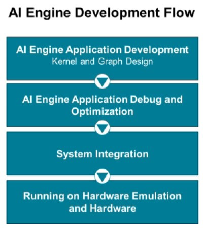

<table class="sphinxhide" style="width:100%;">
  <tr>
    <td align="center">
      <picture>
        <source media="(prefers-color-scheme: dark)" srcset="https://raw.githubusercontent.com/Xilinx/Image-Collateral/main/logo-white-text.png">
        
      </picture>
      <h1>AMD Vitis™ AI Engine Tutorials</h1>
      <a href="https://www.amd.com/en/products/software/adaptive-socs-and-fpgas/vitis.html">See Vitis Development Environment on amd.com</a>
         
      <a href="https://www.amd.com/en/products/software/vitis-ai.html">See Vitis AI Development Environment on amd.com</a>
    </td>
  </tr>
</table>

# AI Engine Development

## Introduction

The tutorials under AI Engine Development help you learn to target, develop, and deploy advanced algorithms using an AMD Versal™ AI Engine array. Do this in conjunction with PL IP/kernels and software applications running on the embedded processors. To successfully deploy AI Engine applications in hardware, you need to understand the Vitis and AI Engine tools and flows.

- The AI Engine Development **[Feature Tutorials](./Feature_Tutorials/)** highlight specific features and flows that help you develop AI Engine applications.

- The AI Engine Development **[Design Tutorials](./Design_Tutorials/)** showcase two major phases of AI Engine application development: designing the application and developing the kernels. These tutorials demonstrate both phases.

## Getting Started

### AI Engine Documentation

Use the [AI Engine Design Process Hub](https://docs.amd.com/p/ai-engine-development) to find the right documentation for your current development stage.

Key AI Engine documentation includes:

- *Versal adaptive SoC AI Engine Architecture Manual* [AM009](https://docs.amd.com/r/en-US/am009-versal-ai-engine)
- *AI Engine Tools and Flows* [UG1076](https://docs.amd.com/r/en-US/ug1076-ai-engine-environment)
- *AI Engine Kernel and Graph Programming Guide* [UG1079](https://docs.amd.com/r/en-US/ug1079-ai-engine-kernel-coding)

### AI Engine Training

If you are new to AI Engine, take these training courses to understand the architecture and design flow:

- [Designing with Versal AI Engine 1: Architecture and Design Flow](https://xilinxprod-catalog.netexam.com/Search?searchText=Designing+with+Versal+AI+Engine+1)
- [Designing with Versal AI Engine 2: Graph Programming with AI Engine Kernels](https://xilinxprod-catalog.netexam.com/Search?searchText=Designing+with+Versal+AI+Engine+2)
- [Designing with Versal AI Engine 3: Kernel Programming and Optimization](https://xilinxprod-catalog.netexam.com/Search?searchText=Designing+with+Versal+AI+Engine+3)

### Environment Settings

**IMPORTANT**: Before starting any tutorial, read and follow the *Vitis Release Notes and Installation Guide* ([UG1742](https://docs.amd.com/r/en-US/ug1742-vitis-release-notes)) (v2025.2) to set up software and install the VCK190 base platform.

Follow these steps to set up your environment (do **not** apply to tutorials that do not use the VCK190 base platform):

1. Set up your platform: Run the `xilinx-versal-common-v2025.2/environment-setup-cortexa72-cortexa53-amd-linux` script from the platform download. This script sets up the `SYSROOT` and `CXX` variables. If the script is not present, you **must** run the `xilinx-versal-common-v2025.2/sdk.sh` command.
2. Set the `ROOTFS` path: Point it to `xilinx-versal-common-v2025.2/rootfs.ext4`.
3. Set the `IMAGE` path: Point it to `xilinx-versal-common-v2025.2/Image`.
4. Set the `PLATFORM_REPO_PATHS` environment variable: Define it based on where you downloaded the platform.

### Getting Started with AI Engine Development Using the AI Engine Tutorials

If you are new to AI Engine architecture and tools, start with the [A to Z Bare-metal Flow](./Feature_Tutorials/01-aie_a_to_z/). This tutorial takes you step-by-step from platform creation in AMD Vivado™ to AI Engine application creation, system integration, and hardware testing using the Vitis IDE.

#### AI Engine Application Development

To start developing AI Engine applications, work through the following tutorials:

- [DSP Library Tutorial](./Feature_Tutorials/08-dsp-library/): Learn to create an AI Engine application using the AMD DSP library.
- [AIE DSPLib and Model Composer](./Feature_Tutorials/10-aie-dsp-lib-model-composer/): Learn to create an AI Engine application using the AMD provided DSP library with ModelComposer, enabling MATLAB Simulink-based design.
- [Using GMIO with AIE](./Feature_Tutorials/02-using-gmio/): Learn how to connect AI Engine to DDR memory through the GMIO interface and NoC.
- [Implementing an IIR Filter on the AIE](./Feature_Tutorials/14-implementing-iir-filter/): Learn custom kernel coding with an IIR filter application.

Other tutorials covering useful AI Engine features include:

- [Runtime Parameter Reconfiguration](./Feature_Tutorials/03-rtp-reconfiguration/)
- [Packet Switching](./Feature_Tutorials/04-packet-switching/)
- [Using Floating-Point in the AIE](./Feature_Tutorials/07-AI-Engine-Floating-Point/)

#### AI Engine Application Debug and Optimization

After writing your first AI Engine application, verify that your graphs and kernels function correctly using x86 and AI Engine simulation. Use these tutorials to assist with debugging and optimization:

- [Debug Walkthrough Tutorial](./Feature_Tutorials/09-debug-walkthrough/): Analyze performance and debug functional issues.
- [AIE Performance and Deadlock Analysis](./Feature_Tutorials/13-aie-performance-analysis/): Learn performance analysis, optimization methods, and graph execution synchronization.

#### System Integration

When your AI Engine application meets functional and performance expectations, integrate it into the Versal system. Use these tutorials:

- [AIE Versal Integration](./Feature_Tutorials/05-AI-engine-versal-integration/): Build a design running on the AI Engine, PS, and PL.
- [Versal System Design Clocking](./Feature_Tutorials/06-versal-system-design-clocking-tutorial/): Learn clocking concepts for the Vitis compiler and define clocking for an ADF Graph and PL kernels using automation.
- [Versal Emulation Waveform Analysis](./Feature_Tutorials/11-ai-engine-emulation-waveform-analysis/):Use the Vivado Design Suite logic simulator GUI and Vitis analyzer to debug and analyze your design.

## Available Tutorials

### Feature Tutorials

These tutorials target the **VCK190** board. Use the following table to find available tutorials and see the features and flows each one demonstrates. The columns list specific features and flows so you can identify tutorials that match what you want to learn.

 <table style="width:100%">
 <tr>
 <td width="7%" align="center"><b>Tutorial</b>
 <td width="7%" align="center"><b>Platform</b>
 <td width="7%" align="center"><b>OS</b>
 <td width="7%" align="center"><b>IDE Flow</b>
 <td width="7%" align="center"><b>Libraries Used</b>
 <td width="7%" align="center"><b>HLS Kernel</b>
 <td width="7%" align="center"><b>x86 Simulator</b>
 <td width="7%" align="center"><b>AIE Simulator</b>
 <td width="7%" align="center"><b>HW Emu</b>
 <td width="7%" align="center"><b>HW</b>
 <td width="7%" align="center"><b>Event Trace in HW</b>
 <td width="7%" align="center"><b>Profile in HW</b>
 </tr>
 <tr>
 <td align="center"><a href="./Feature_Tutorials/18-aie_a_to_z_custom_linux_platform/">AI Engine A-to-Z Flow for Linux</a></td>
 <td>Base / Custom</td>
 <td>Linux</td>
 <td> </td>
 <td> </td>
 <td>MM2S / S2MM</td>
 <td>Yes</td>
 <td>Yes</td>
 <td>Yes</td>
 <td>Yes</td>
 <td> </td>
 <td> </td>
 </tr>
 <tr>
 <td align="center"><a href="./Feature_Tutorials/01-aie_a_to_z/">A to Z Bare-metal Flow</a></td>
 <td>Custom</td>
 <td>Baremetal</td>
 <td>Yes</td>
 <td> </td>
 <td>MM2S / S2MM</td>
 <td> </td>
 <td>Yes</td>
 <td>Yes</td>
 <td>Yes</td>
 <td> </td>
 <td> </td>
 </tr>
 <tr>
 <td align="center"><a href="./Feature_Tutorials/02-using-gmio/">Using GMIO with AIE</a></td>
 <td>Base</td>
 <td>Linux</td>
 <td> </td>
 <td> </td>
 <td> </td>
 <td> </td>
 <td>Yes</td>
 <td>Yes</td>
 <td>Yes</td>
 <td> </td>
 <td>Yes</td>
 </tr>
  <tr>
 <td align="center"><a href="./Feature_Tutorials/03-rtp-reconfiguration/">Runtime Parameter Reconfiguration</a></td>
 <td>Base</td>
 <td>Linux</td>
 <td> </td>
 <td> </td>
 <td>MM2S / S2MM</td>
 <td> </td>
 <td>Yes</td>
 <td>Yes</td>
 <td>Yes</td>
 <td> </td>
 <td> </td>
 </tr>
  <tr>
 <td align="center"><a href="./Feature_Tutorials/04-packet-switching/">Packet Switching</a></td>
 <td>Base</td>
 <td>Linux</td>
 <td> </td>
 <td> </td>
 <td>MM2S / S2MM</td>
 <td> </td>
 <td>Yes</td>
 <td>Yes</td>
 <td>Yes</td>
 <td> </td>
 <td> </td>
 </tr>
  <tr>
 <td align="center"><a href="./Feature_Tutorials/05-AI-engine-versal-integration/">AIE Versal Integration</a></td>
 <td>Base</td>
 <td>Linux</td>
 <td>Yes</td>
 <td></td>
 <td>MM2S / S2MM</td>
 <td>Yes</td>
 <td>Yes</td>
 <td>Yes</td>
 <td>Yes</td>
 <td> </td>
 <td> </td>
 </tr>
 <tr>
 <td align="center"><a href="./Feature_Tutorials/06-versal-system-design-clocking-tutorial/">Versal System Design Clocking</a></td>
 <td>Base</td>
 <td>Linux</td>
 <td> </td>
 <td> </td>
 <td>MM2S / S2MM</td>
 <td> </td>
 <td>Yes</td>
 <td>Yes</td>
 <td>Yes</td>
 <td> </td>
 <td> </td>
 </tr>
  <tr>
 <td align="center"><a href="./Feature_Tutorials/07-AI-Engine-Floating-Point/">Using Floating-Point in the AIE</a></td>
 <td>Base</td>
 <td>Linux</td>
 <td> </td>
 <td> </td>
 <td> </td>
 <td> </td>
 <td>Yes</td>
 <td> </td>
 <td> </td>
 <td> </td>
 <td> </td>
 </tr>
  <tr>
 <td align="center"><a href="./Feature_Tutorials/08-dsp-library/">DSP Library Tutorial</a></td>
 <td>Base</td>
 <td>Linux</td>
 <td> </td>
 <td>DSPLib</td>
 <td>MM2S / S2MM</td>
 <td> </td>
 <td>Yes</td>
 <td> </td>
 <td> </td>
 <td> </td>
 <td> </td>
 </tr>
 <tr>
 <td align="center"><a href="./Feature_Tutorials/09-debug-walkthrough/">Debug Walkthrough Tutorial</a></td>
 <td>Base</td>
 <td>Linux</td>
 <td>Yes</td>
 <td> </td>
 <td> </td>
 <td>Yes</td>
 <td>Yes</td>
 <td>Yes</td>
 <td>Yes</td>
 <td>Yes</td>
 <td>Yes</td>
 </tr>
 <tr>
 <td align="center"><a href="./Feature_Tutorials/10-aie-dsp-lib-model-composer/">AIE DSPLib and Model Composer</a></td>
 <td>Base</td>
 <td>Linux</td>
 <td>Yes</td>
 <td>DSPLib</td>
 <td>MM2S / S2MM</td>
 <td>Yes</td>
 <td>Yes</td>
 <td> </td>
 <td> </td>
 <td> </td>
 <td> </td>
 </tr>
 <tr>
 <td align="center"><a href="./Feature_Tutorials/11-ai-engine-emulation-waveform-analysis/">Versal Emulation Waveform Analysis</a></td>
 <td>Base</td>
 <td>Linux</td>
 <td> </td>
 <td> </td>
 <td>Traffic Gen</td>
 <td> </td>
 <td> </td>
 <td>Yes</td>
 <td> </td>
 <td> </td>
 <td> </td>
 </tr>
 <tr>
 <td align="center"><a href="./Feature_Tutorials/13-aie-performance-analysis/">AIE Performance and Deadlock Analysis</a></td>
 <td>Base</td>
 <td>Linux</td>
 <td> </td>
 <td> </td>
 <td> </td>
 <td> </td>
 <td>Yes</td>
 <td>Yes</td>
 <td>Yes</td>
 <td> </td>
 <td>Yes</td>
 </tr>
 <tr>
 <td align="center"><a href="./Feature_Tutorials/14-implementing-iir-filter/">Implementing an IIR Filter on the AIE</a></td>
 <td>Base</td>
 <td>Linux</td>
 <td>Yes</td>
 <td> </td>
 <td> </td>
 <td>Yes</td>
 <td>Yes</td>
 <td> </td>
 <td> </td>
 <td> </td>
 <td> </td>
 </tr>
 <tr>
 <td align="center"><a href="./Feature_Tutorials/15-post-link-recompile/">Post-Link Recompile of an AIE Application </a></td>
 <td>Base</td>
 <td>Linux</td>
 <td> </td>
 <td> </td>
 <td>MM2S / S2MM</td>
 <td> </td>
 <td>Yes</td>
 <td>Yes</td>
 <td>Yes</td>
 <td> </td>
 <td> </td>
 </tr>
 <tr>
 <td align="center"><a href="./Feature_Tutorials/17-RTL-IP-with-AIE-Engines/">Using RTL IP with AI Engines</a></td>
 <td>Custom</td>
 <td>Linux</td>
 <td> </td>
 <td> </td>
 <td>MM2S / S2MM</td>
 <td> </td>
 <td>Yes</td>
 <td>Yes</td>
 <td> </td>
 <td> </td>
 <td> </td>
 </tr>
 <tr>
 <td align="center"><a href="./Feature_Tutorials/20-aiecompiler-features/">AIE Compiler Features</a></td>
 <td>Base</td>
 <td>Linux</td>
 <td> </td>
 <td> </td>
 <td>MM2S / S2MM</td>
 <td>Yes</td>
 <td>Yes</td>
 <td>Yes</td>
 <td>Yes</td>
 <td>Yes</td>
 <td>Yes</td>
 </tr>
 <tr>
 <td align="center"><a href="./Feature_Tutorials/21-two_tone_filter/">Two Tone Filter</a></td>
 <td>Base</td>
 <td>Linux</td>
 <td>Yes</td>
 <td>DSPLib</td>
 <td> </td>
 <td>Yes</td>
 <td>Yes</td>
 <td> </td>
 <td> </td>
 <td> </td>
 <td> </td>
 </tr>
 <tr>
 <td align="center"><a href="./Feature_Tutorials/23-AIE_independent_graphs/">Compiling AIE Graphs for Independent Partitions</a></td>
 <td>Base</td>
 <td>Linux</td>
 <td> </td>
 <td> </td>
 <td>MM2S / S2MM</td>
 <td> Yes </td>
 <td> Yes </td>
 <td> Yes </td>
 <td> Yes </td>
 <td> Yes </td>
 <td> </td>
 </tr>
 <tr>
 <td align="center"><a href="./Feature_Tutorials/24-aie_pl_interface/">RTL / AI Engine interfacing Examples</a></td>
 <td>Custom</td>
 <td>N/A</td>
 <td>Yes</td>
 <td> </td>
 <td> </td>
 <td> </td>
 <td> </td>
 <td> Yes </td>
 <td> </td>
 <td> </td>
 <td> </td>
 </tr>
 <tr>
 <td align="center"><a href="./Feature_Tutorials/25-AIE-kernel-optimization/">AIE Kernel Optimization</a></td>
 <td>Base / Custom</td>
 <td>Linux</td>
 <td> </td>
 <td> </td>
 <td> </td>
 <td> Yes </td>
 <td> Yes </td>
 <td> </td>
 <td> </td>
 <td> </td>
 <td> </td>
 </tr>
 <tr>
 <td align="center"><a href="../AIE-ML/Feature_Tutorials/06-gemm/">Matrix Compute with Vitis Libraries</a></td>
 <td>Base</td>
 <td>Linux</td>
 <td> </td>
 <td>DSPLib</td>
 <td> </td>
 <td> </td>
 <td>Yes</td>
 <td> </td>
 <td> </td>
 <td> </td>
 <td> </td>
 </tr> 
 <tr>
 <td align="center"><a href="./Feature_Tutorials/26-gentle_intro_to_aie_kernel_programming/">A Gentle Introduction to AI Engine Kernel Programming</a></td>
 <td>Base</td>
 <td>Linux</td>
 <td>Yes</td>
 <td> </td>
 <td> </td>
 <td>Yes</td>
 <td>Yes</td>
 <td> </td>
 <td> </td>
 <td> </td>
 <td> </td>
 </tr> 
 <tr>
 <td align="center"><a href="./Feature_Tutorials/27-system-timeline/">System Timeline Tutorial</a></td>
 <td>Base</td>
 <td>Linux</td>
 <td>Yes</td>
 <td> </td>
 <td>MM2S / S2MM</td>
 <td>Yes</td>
 <td>Yes</td>
 <td>Yes</td>
 <td>Yes</td>
 <td>Yes</td>
 <td>Yes</td>
 </tr> 
 </table>

### Design Tutorials

These tutorials target the **VCK190** board. The following table lists the tutorials, features, and flows highlighted in these tutorials. The columns correspond to specific features and flows supported in these tutorials and help you identify tutorials that showcase specific flows and features that interest you.

 <table style="width:100%">
 <tr>
 <td width="7%" align="center"><b>Tutorial</b>
 <td width="7%" align="center"><b>Platform</b>
 <td width="7%" align="center"><b>OS</b>
 <td width="7%" align="center"><b>IDE Flow</b>
 <td width="7%" align="center"><b>Libraries Used</b>
 <td width="7%" align="center"><b>HLS Kernel</b>
 <td width="7%" align="center"><b>x86 Simulator</b>
 <td width="7%" align="center"><b>AIE Simulator</b>
 <td width="7%" align="center"><b>HW Emu</b>
 <td width="7%" align="center"><b>HW</b>
 <td width="7%" align="center"><b>Event Trace in HW</b>
 <td width="7%" align="center"><b>Profile in HW</b>
 </tr>
 <tr>
 <td align="center"><a href="../../Vitis_System_Design/Design_Tutorials/01-Versal_Custom_Thin_Platform_Extensible_System/">Versal Custom Thin Platform Extensible System</a></td>
 <td>Custom</td>
 <td>Linux</td>
 <td> </td>
 <td> </td>
 <td>MM2S / S2MM / VADD</td>
 <td> </td>
 <td> </td>
 <td>Yes</td>
 <td>Yes</td>
 <td> </td>
 <td> </td>
 </tr>
 <tr>
 <td align="center"><a href="./Design_Tutorials/01-aie_lenet_tutorial/">LeNet Tutorial</a></td>
 <td>Base</td>
 <td>Linux</td>
 <td> </td>
 <td> </td>
 <td>MM2S / S2MM</td>
 <td> </td>
 <td>Yes</td>
 <td>Yes</td>
 <td>Yes</td>
 <td> </td>
 <td>Yes</td>
 </tr>
 <tr>
 <td align="center"><a href="./Design_Tutorials/02-super_sampling_rate_fir/">Super Sampling Rate FIR Filters</a></td>
 <td>Base</td>
 <td>Linux</td>
 <td> </td>
 <td> </td>
 <td> </td>
 <td> </td>
 <td>Yes</td>
 <td> </td>
 <td> </td>
 <td> </td>
 <td> </td>
 </tr>
 <tr>
 <td align="center"><a href="./Design_Tutorials/03-beamforming/">Beamforming Design</a></td>
 <td>Base</td>
 <td>Linux</td>
 <td> </td>
 <td> </td>
 <td> </td>
 <td> </td>
 <td>Yes</td>
 <td>Yes</td>
 <td>Yes</td>
 <td> </td>
 <td>Yes</td>
 </tr>
 <tr>
 <td align="center"><a href="./Design_Tutorials/04-Polyphase-Channelizer/">Polyphase Channelizer</a></td>
 <td>Base</td>
 <td>Linux</td>
 <td> </td>
 <td> </td>
 <td>MM2S / S2MM</td>
 <td> </td>
 <td> </td>
 <td>Yes</td>
 <td>Yes</td>
 <td> </td>
 <td> </td>
 </tr>
 <tr>
 <td align="center"><a href="./Design_Tutorials/05-Prime-Factor-FFT/">Prime Factor FFT</a></td>
 <td>Base</td>
 <td>Linux</td>
 <td> </td>
 <td> </td>
 <td>MM2S / S2MM</td>
 <td> </td>
 <td> </td>
 <td>Yes</td>
 <td>Yes</td>
 <td> </td>
 <td> </td>
 </tr>
 <tr>
 <td align="center"><a href="./Design_Tutorials/06-fft2d_AIEvsHLS/">2D-FFT</a></td>
 <td>Base</td>
 <td>Linux</td>
 <td> </td>
 <td>DSPLib</td>
 <td>PL Data Generator and Checker</td>
 <td> </td>
 <td>Yes</td>
 <td>Yes</td>
 <td>Yes</td>
 <td> </td>
 <td>Yes</td>
 </tr>
 <tr>
 <td align="center"><a href="./Design_Tutorials/07-firFilter_AIEvsHLS/">FIR Filter</a></td>
 <td>Base</td>
 <td>Linux</td>
 <td> </td>
 <td>DSPLib</td>
 <td>PL Data Generator and Checker</td>
 <td> </td>
 <td>Yes</td>
 <td>Yes</td>
 <td>Yes</td>
 <td> </td>
 <td>Yes</td>
 </tr>
 <tr>
 <td align="center"><a href="./Design_Tutorials/08-n-body-simulator/">N-Body Simulator</a></td>
 <td>Base</td>
 <td>Linux</td>
 <td> </td>
 <td> </td>
 <td>PL Datamover</td>
 <td> </td>
 <td>Yes</td>
 <td>Yes</td>
 <td>Yes</td>
 <td> </td>
 <td> </td>
 </tr>
 <tr>
 <td align="center"><a href="./Design_Tutorials/09-ddc_chain/">Digital Down-conversion Chain</a></td>
 <td>Base</td>
 <td>Linux</td>
 <td> </td>
 <td> </td>
 <td> </td>
 <td>Yes</td>
 <td>Yes</td>
 <td> </td>
 <td> </td>
 <td> </td>
 <td> </td>
 </tr> 
 <tr>
 <td align="center"><a href="./Design_Tutorials/10-GeMM_AIEvsDSP/">Versal GeMM Implementation</a></td>
 <td>Base</td>
 <td>Linux</td>
 <td> </td>
 <td>DSPLib</td>
 <td>Datamover</td>
 <td> </td>
 <td>Yes</td>
 <td>Yes</td>
 <td>Yes</td>
 <td> </td>
 <td>Yes</td>
 </tr>
 <tr>
 <td align="center"><a href="./Design_Tutorials/11-Bilinear_Interpolation/">Bilinear Interpolation</a></td>
 <td>Base</td>
 <td>Linux</td>
 <td> </td>
 <td> </td>
 <td> </td>
 <td>Yes</td>
 <td>Yes</td>
 <td> </td>
 <td> </td>
 <td> </td>
 <td></td>
 </tr>
 <tr>
 <td align="center"><a href="./Design_Tutorials/12-IFFT64K-2D/">64K IFFT Using 2D Architecture</a></td>
 <td>Base</td>
 <td>Linux</td>
 <td> </td>
 <td> </td>
 <td>MM2S / S2MM</td>
 <td> </td>
 <td> </td>
 <td>Yes</td>
 <td>Yes</td>
 <td> </td>
 <td> </td>
 </tr>
 <tr>
 <td align="center"><a href="./Design_Tutorials/13-FFT-DFT-on-AIE/">FFT and DFT on AI Engine</a></td>
 <td>Base</td>
 <td>Linux</td>
 <td> </td>
 <td>DSPLib</td>
 <td> </td>
 <td>Yes</td>
 <td>Yes</td>
 <td> </td>
 <td> </td>
 <td> </td>
 <td> </td>
 </tr> 
 <tr>
 <td align="center"><a href="./Design_Tutorials/14-Bitonic-Sorting/">Bitonic SIMD Sorting on AI Engine</a></td>
 <td>Base</td>
 <td>Linux</td>
 <td> </td>
 <td> </td>
 <td> </td>
 <td>Yes</td>
 <td>Yes</td>
 <td> </td>
 <td> </td>
 <td> </td>
 <td> </td>
 </tr> 
 <tr>
 <td align="center"><a href="./Design_Tutorials/15-farrow_filter/">Fractional Delay Farrow Filter</a></td>
 <td>Base</td>
 <td>Linux</td>
 <td> </td>
 <td> </td>
 <td>Data Movers</td>
 <td>Yes</td>
 <td>Yes</td>
 <td>Yes</td>
 <td>Yes</td>
 <td> </td>
 <td> </td>
 </tr>
 <tr>
 <td align="center"><a href="./Design_Tutorials/16-1M-Point-FFT-32Gsps/">1M Point float FFT @ 32 Gsps</a></td>
 <td>Custom</td>
 <td>Baremetal</td>
 <td> </td>
 <td> </td>
 <td> </td>
 <td>Yes</td>
 <td>Yes</td>
 <td> </td>
 <td>Yes</td>
 <td> </td>
 <td>Yes</td>
 </tr>
 <tr>
 <td align="center"><a href="./Design_Tutorials/17-Hough-Transform/">System Partitioning of a Hough Transform</a></td>
 <td>Base</td>
 <td>Linux</td>
 <td> </td>
 <td> </td>
 <td> </td>
 <td>Yes</td>
 <td>Yes</td>
 <td> </td>
 <td> </td>
 <td> </td>
 <td> </td>
 </tr> 
 <tr>
 <td align="center"><a href="./Design_Tutorials/18-MUSIC-Algorithm/">MUSIC Algorithm on AI Engine</a></td>
 <td>Base</td>
 <td>Linux</td>
 <td> </td>
 <td> </td>
 <td>MM2S / S2MM</td>
 <td> </td>
 <td> </td>
 <td> </td>
 <td>Yes</td>
 <td> </td>
 <td> </td>
 </tr> 
 <tr>
 <td align="center"><a href="./Design_Tutorials/19-Softmax-Function/">SoftMax Function on AI Engine</a></td>
 <td>Base</td>
 <td>Linux</td>
 <td> </td>
 <td> </td>
 <td> </td>
 <td>Yes</td>
 <td>Yes</td>
 <td> </td>
 <td> </td>
 <td> </td>
 <td> </td>
 </tr>
 <tr>
 <td align="center"><a href="./Design_Tutorials/20-TDM-Mixer/">Time-Division Multiplexed Mixer</a></td>
 <td>Base</td>
 <td>Linux</td>
 <td> </td>
 <td> </td>
 <td> </td>
 <td>Yes</td>
 <td>Yes</td>
 <td> </td>
 <td> </td>
 <td> </td>
 <td> </td>
 </tr>
 <tr>
 <td align="center"><a href="./Design_Tutorials/21-Back-Projection-SAR/">Back-Projection SAR on AIE</a></td>
 <td>Base</td>
 <td>Linux</td>
 <td> </td>
 <td>DSPLib</td>
 <td>Data Movers & Image Buffering</td>
 <td>Yes</td>
 <td>Yes</td>
 <td> </td>
 <td>Yes</td>
 <td> </td>
 <td>Yes</td>
 </tr>      
 </table>

Copyright © 2020–2025 Advanced Micro Devices, Inc.

<a href="https://www.amd.com/en/corporate/copyright">Terms and Conditions</a>

