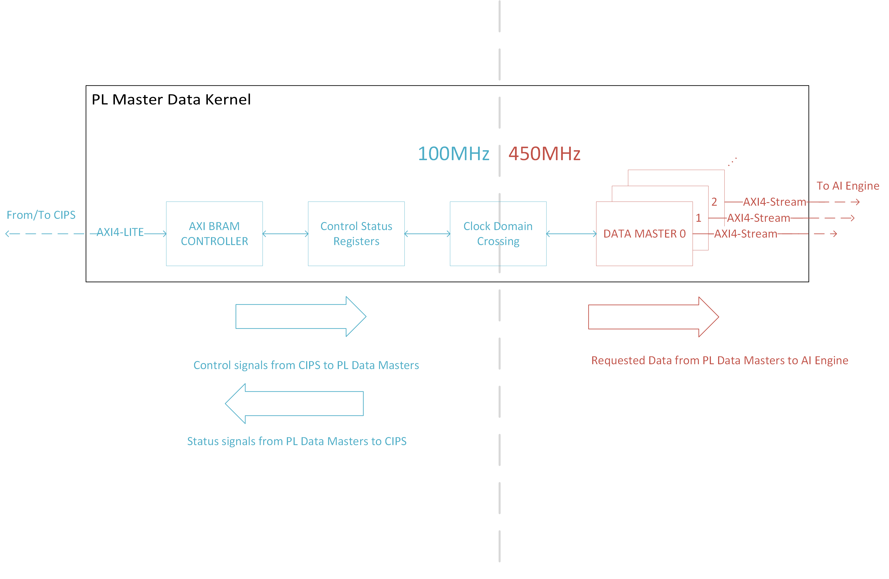

# Building the Design 
```bash
make kernels
```
or 
```bash
cd dlbf_data
vivado -mode batch -source run_dlbf_data.tcl -tclargs NO_SIM xcvc1902-vsva2197-1LHP-i-L

cd ../dlbf_coeffs
vivado -mode batch -source run_dlbf_coeffs.tcl -tclargs NO_SIM xcvc1902-vsva2197-1LHP-i-L

cd ../dlbf_slave
vivado -mode batch -source run_dlbf_slave.tcl -tclargs NO_SIM xcvc1902-vsva2197-1LHP-i-L

cd ../ulbf_data
vivado -mode batch -source run_ulbf_data.tcl -tclargs NO_SIM xcvc1902-vsva2197-1LHP-i-L

cd ../ulbf_coeffs
vivado -mode batch -source run_ulbf_coeffs.tcl -tclargs NO_SIM xcvc1902-vsva2197-1LHP-i-L

cd ../ulbf_slave
vivado -mode batch -source run_ulbf_slave.tcl -tclargs NO_SIM xcvc1902-vsva2197-1LHP-i-L

cd ../axi4s_regslice_64b
vivado -mode batch -source run_axi4s_regslice_64b.tcl -tclargs NO_SIM xcvc1902-vsva2197-1LHP-i-L
```
## Dependencies
Each PL kernel has a run_\<kernel_name\>.tcl, bd_\<kernel_name\>.tcl, kernel_\<kernel_name\>.xml, and hdl/\*.v RTL code as dependencies. 

|Filename|Description|
|  ---  |  ---  |
|run_\<kernel_name\>.tcl||
|bd_\<kernel_name\>.tcl||
|kernel_\<kernel_name\>.xml||

The hdl/ folder in each PL kernel folder contains the the verilog RTL that is used to create the PL kernels. 

The dlbf_data, dlbf_coeffs, ulbf_data, and ulbf_coeffs kernels contain: 

|Filename|Description|
|  ---  |  ---  |
|hdl/\<kernel_name\>\_cdc.v| Clock domain crossing module. |
|hdl/\<kernel_name\>\_cntrl.v| |
|hdl/\<kernel_name\>\_csr_cntrl.v| Control Status Register module. |
|hdl/\<kernel_name\>\_master.v| Data Master Module. Only in dlbf_coeffs, dlbf_data and ulbf_coeffs, and ulbf_data PL kernels. |
|hdl/\<kernel_name\>\_ram2axis_64b.v| |
|hdl/\<kernel_name\>\_xpm_ram.v| |
|hdl/\<kernel_name\>\_xpm_sync_fifo.v| |
|hdl/\<kernel_name\>\.v| Top level module for the PL kernel. |

The dlbf_slave and ulbf_slave kernels contain:

|Filename|Description|
|  ---  |  ---  |
|hdl/\<kernel_name\>\_cdc.v|Clock domain crossing module|
|hdl/\<kernel_name\>\_cntrl.v|Control status register module|
|hdl/\<kernel_name\>\_ram.v|URAM instantiation|
|hdl/\<kernel_name\>\.v|Top level module for the PL kernel. |

## Build Products 
|Filename|Description|
|  ---  |  ---  |
|\<kernel_name\>.xo||
|\<kernel_name\> directory ||

# Introduction: PL Kernels
Now that we have an AI Engine application, we need to find a way to send the input data and store the output data on hardware. We accomplish this by creating PL Master Kernels that feed the input data into the AI Engine application, and with PL Slave Kernels to store the AI Engine output data into block RAM (BRAM) resources. 

# PL Master Kernels
The PL Master Kernels are the `dlbf_data`, `dlbf_coeff`, `ulbf_data`, and `ulbf_coeff` kernels. A `dlbf_data` PL kernel stores the reference input data matrices for the downlink subgraph in the AI Engine graph. The `dlbf_coeff` PL kernel stores the reference input coefficents for the downlink subgraph. The `ulbf_data` PL kernel stores the input data for the uplink subgraph. The `ulbf_coeff` stores the input coeffcient data for the uplink subgraph. 

Open the Vivado projects for these PL kernels and review their source code. You'll notice that they are all made of the same modules: a AXI BRAM Controller IP, a Control Status Register (CRS) module, a Clock Domain Crossing (CDC) module, and multiple Data Master modules. The Data Master modules are initialized with the reference input data and input coefficients from HEX files in the data/ folder. 




Each PL Master Kernel hooks up to one of the 16 AXI4-LITE PL interfaces on the custom platform we built in _Module 01 - Creating a Custom Platform_. Through this connection, the CIPS block can send AXI control signals to the Data Master modules and receive AXI status signals from the Data Master modules. 

**AXI BRAM Controller**:
The AXI BRAM Controller writes the control signals to the CSR module and reads the status signals from the CSR module at 100MHz. 

**Control Status Register (CSR) Module**:
The CSR module is a register interface that the AXI BRAM Controller accesses to access the Data Masters. 

_Control and Status Register Address Map_

| Register Space Offset | Bits and Name | R/W? | Description |  
|  ---  |  ---  |  ---  | --- |
| 0x0 | \[31:0\] ID | R | 32 bit ID Register.|
| 0x4 | \[0\] RESET | W | 1:assert, 0:de-assert. Also assigned to the `m_axis_rst_bram` input in CRS module. | 
| 0x4 | \[4\] GO | W | 1:Start PL traffic, 0: Stop PL traffic. Also assigned to the `go_bram` input in CRS module. | 
| 0x8 | \[11:0\] BLOCK_SIZE | W | Sets the block size of stream frame. TLAST is asserted for every "Block Size" number of cycles. Also assigned to the `block_size_bram` input in the CRS module. |  
| 0xC | \[11:0\] NITER | W | Sets the number of iterations of the data to go through. If this set to 0m data will be transmitted to the AIE forever. Also assigned to the `niter_bram` input in the CRS module. The main_partial.cpp sets this to 4. The main_full.cpp sets this is TODO. | 
| 0x10 | \[15:0\] ROLLOVER_ADDR | W | When BRAM address reaches rollover address, it will reset to 0. Also assigned to the `rollover_addr_bram` input in the CRS module. | 
| 0x20 | \[0\] MASTER_DONE | R | When this status register is 1'b, the Data Master is done sending data to AI Engine. Also assigned to the `m0_done_bram` input in the CRS module. |

**Clock Domain Crossing (CDC) Module**: The control and status signals sent to the CSR module sync up with the Data Master modules through a clock domain crossing (CDC) module. It converts the 100MHz control and status signals from the CSR module to 400MHz signals. The Data Master modules operate at 400MHz. It also works the other way as well (converting 400MHz signals from the Data Master modules to 100MHz signals).   

**Data Master Modules**: Initalized by hex.mem files with input data. 4 per PL kernel in DLBF. 8 per PL kernel in ULBF. Contains 1 BRAM per Data Master Module. 

## PL Master Execution Flow
Through the control path (highlighted in blue), CIPS requests data from specific addresses from the Data Master modules. The Data Master modules then sends out the data at the requested address through an AXI4-Stream interface to the AI Engine. The AI Engine receives its downlink input data matrices, downlink input coefficient data, uplink input data matrices, and uplink input coefficient data this way. The PL Masters must follow a certain execution flow to function properly.

### Reset
First, the PL Masters must first be reset by asserting their RESET bits to 1’b1 for TODO clock cycles and then deasserted to 0’b1. 

### Configuration
The PL Masters must then have their BLOCK_SIZE, NITER, and ROLLOVER_ADDR registers configured. 

#### BLOCK_SIZE
The value we set the BLOCK_SIZE register to is determined by the number of 32-bit complex data samples we will send to the AI Engine. Since the PL Interface to the AI Engine is 64-bit, we can fit 2 (32)-bit complex data samples in a single data packet. The BLOCK_SIZE register for each PL Master Kernel is as follows:

| PL Kernels | AI Engine Window Size (bytes) | Number of 32-bit complex data samples | number of 64-bit data packets (BLOCK_SIZE) |  
|  ---  |  ---  |  ---  |  ---  |
|dlbf_data ulbf_data| 3072 | 768 | 384 |
|dlbf_coeffs ulbf_coeffs | 2048| 512 | 256 | 

#### NITER and ROLLOVER_ADDR
The value of the NITER register determines the number BLOCK_SIZE chunks of input data to send of the AI Engine. Since there is a finite amount of BRAM resources, we can’t store a large amount of unique input data. A design choice was made to store four BLOCK_SIZE chunks of unique data in the PL masters. 

When NITER <=4, we are sending up to four unique BLOCK_SIZE chunks of data to the AI Engine. 

When NITER > 4, the BRAMs send the four unique BLOCK_SIZE chunks of data, then the BRAM addresses rollover to address 0, and they start sending the same data again.  

The NITER register allows the us to continuously feed the AI Engine graph input data for an NITER number of data chunks without using an insane amount of BRAMs. 

The ROLLOVER_ADDR register contains the address that tells the BRAMs when to restart (or rollover) to address 0. The ROLLOVER_ADDR is calculated by the BLOCK_SIZE * four. Four is the number of unique BLOCK_SIZE chunks of input data the PL masters store. 

For example, if wanted to test that the AI Engine graph for a variety of data inputs, then we can set NITER to 4. This configures the PL kernels to send four BLOCK_SIZE chunks of unique input data to the AI Engine. If we wanted to test performance, then we can set NITER to 100 which will send the same four chunks input data to the AI Engine 25 times (for a total of 25\*4 = 100 iterations). And then we can average the throughput across the iterations to give a valid performance measurement. The following is a table of the rollover addresses:

| PL Kernels | BLOCK_SIZE | ROLLOVER_ADDR |  
|  ---  |  ---  |  ---  |
dlbf_data ulbf_data | 384 | 1536 | 
dlbf_coeffs ulbf_coeffs | 256 | 1024 |

### Start 
After configuration, the PL Master kernels are ready to send data stored in their BRAMs to the AI Engine. When the GO bit is asserted, the PL traffic to the AI Engine starts. Deasserting the GO bit will stop PL traffic to the AI Engine. 

### Done 
When the PL Master kernels have sent the input data to the AI Engine for NITER number of times, then then they assert their MASTER_DONE bits.

# PL Slave Kernels
The PL Slave kernels are the `dlbf_slave` and the `ulbf_slave` kernels. These kernels store the output data generated from the AI Engine application. 

Open the Vivado projects for the PL kernels and review their source code. 


**AXI BRAM Controller**

**CSR Module**

_Register Address Map_

| Register Space Offset | Bits and Name | R/W? | Description |  
|  ---  |  ---  |  ---  | --- |
| 0x0 | \[31:0\] ID | R | 32 bit ID Register.|
| 0x4 | \[0\] RESET | W | 1:assert, 0:de-assert. Also assigned to the `slave_rst_bram` input in CRS module. | 
| 0xC | \[11:0\] NITER | W | Sets the number of iterations of the data to go through. If this set to 0m data will be transmitted to the AIE forever. Also assigned to the `niter_bram` input in the CRS module. The main_partial.cpp sets this to 4. The main_full.cpp sets this is TODO. | 
| 0x20 | \[0\] SLAVE_DONE | R | When this status register is 1'b, the RAM slave is done recieving data to AI Engine. Also assigned to the `rxdone_bram` input in the CRS module. | 

**CDC Module**

**Data Slave RAM Module** 

## PL Slave Execution Flow
The control path (blue) is the same as the one in the PL Master kernels, however the CSR module syncs with a Data Slave RAM module. The AI Engine writes its output data to a Data Slave RAM module through a AXI4-Stream interface. The AI Engine application writes its output data from downlink and uplink subgraphs to the `dlbf_slave` and `ulbf_slave` PL Kernels this way. The PL Slaves must follow a certain execution flow to function properly. 

### Reset
Just like the PL Masters, the PL Slaves must first be reset by asserting their RESET bits to 1’b1 for TODO clock cycles and then deasserted to 0’b1. 

### Configuration
The PL Slaves must then have their BLOCK_SIZE, NITER, and ROLLOVER_ADDR registers configured. 

#### BLOCK_SIZE

The BLOCK_SIZE register for each PL Slave Kernel is as follows:

| PL Kernels | AI Engine Window Size (bytes) | Number of 32-bit complex data samples | number of 64-bit data packets (BLOCK_SIZE) |  
|  ---  |  ---  |  ---  |  ---  |
| dlbf_slave | 3072 | ?? | 768 |
| ulbf_slave | 3072 | ?? | 768 |

### NITER and ROLLOVER_ADDR 
The NITER register tells the PL Slave kernel how many BLOCK_SIZE chunks of data to expect and store in their URAMs. 

The PL Slave Kernels do not have a ROLLOVER_ADDR registers since we want to keep all the output data for functional verification. Data starts to get overwritten when NITER = TODO? 

### Start 
The PL Slave kernels are slaves to the AI Engine since the AI Engine writes output data to them. Since the PL kernels must wait until the AI Engine fills their URAMs, there is no GO bit on the PL Slave kernels. 

### Done 
When the PL Slave kernels have received the BLOCK_SIZE amount of data for NITER number of times, then then they assert their SLAVE_DONE bits. 

# AXI4-Stream Register Slice
TODO 

# Beamforming Design
The `dlbf_data` and `dlbf_coeff` PL kernels have four Data Master modules. Since the AI Engine graph requires four input data ports for the downlink subgraph, we only need to instantiate one `dlbf_data` PL kernel for this design. The AI Engine graph requires 32 input coeffcient ports for the downlink subgraph, so we need eight `dlbf_coeff` PL kernels. The `ulbf_data` and `ulbf_coeff` PL kernels have eight Data Master modules. The AI Engine graph requires eight input data ports and 32 input coeffcient ports for the uplink subgraph. So we need to instantiate one `ulbf_data` PL kernel and four `ulbf_coeff` PL kernels for this design. 

# Simulating PL Kernels
