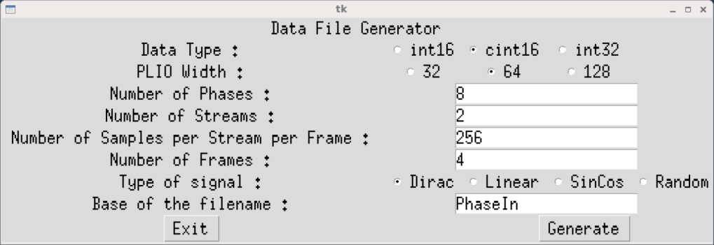
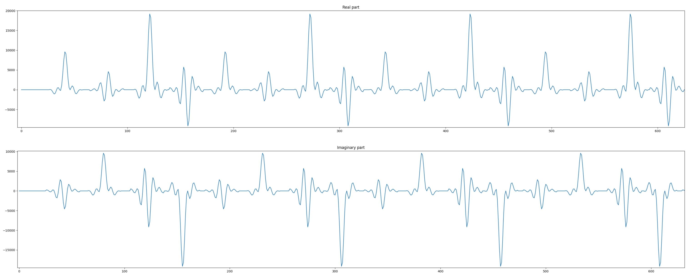

<table class="sphinxhide" width="100%">
 <tr width="100%">
    <td align="center"><h1>AI Engine Development</h1>
    <a href="https://www.xilinx.com/products/design-tools/vitis.html">See Vitis™ Development Environment on xilinx.com</br></a>
    <a href="https://www.xilinx.com/products/design-tools/vitis/vitis-ai.html">See Vitis™ AI Development Environment on xilinx.com</a>
    </td>
 </tr>
</table>

# Super Sampling Rate FIR Filter with Dual-Stream Input

***Version: Vitis 2023.1***

The purpose of this fourth part of the tutorial is to understand how to improve upon the performance already achieved using the two input and output stream connections to the AI Engine.

Navigate to the `DualStreamSSR` directory to continue.

## Dual-Stream Input Impact

The last two sections (Multi-kernel and Single-Stream SSR) showed that when a single input stream is used, the balance between stream bandwidth and compute performance for `cint16 x cint16` is obtained for an 8-tap filter implementation in an AI Engine. This can be easily computed. For the slowest speed grade of the AMD Versal&trade; AI core, the entire AI Engine array (processors, AXI-Stream connections, memory modules, and so on) is clocked at 1 GHz. The input stream can transfer 32 bits per clock and a `cint16` variable is 32-bit wide; hence, a rate of 1 Gsps (Giga samples per second). The processor by itself is capable of eight `cint16xcint16` operations per clock cycle. The result is that the processor can perform 8-tap filter processing per clock cycle.

If the two input streams are used in an efficient way, the input sample rate can increase to 2 Gsps (1 Gsps per stream). As the processor performance does not change, it is able to process only four taps per clock cycle at the input sample rate.

This means that in the case of a single-stream implementation, the filter length should be a multiple of eight to have the maximum performance extracted from the AI Engine array. In the case of a dual-stream implementation, the filter length should be a multiple of four to achieve this maximum performance. This lower granularity allows more freedom in the filter length. Take a 12 tap filter as an example, with an input sample rate at 2 Gsps.

1. Single-stream implementation: The input sample rate (2 Gsps) requires that the coefficients and the input data are split into two phases (1 Gsps each). Having two phases, this implementation requires four kernels (2 x 2) to be used in a grid. 12 taps divided into two phases results in six taps per phase. Each kernel will handle six taps, but the maximum performance is eight taps. Single-stream input data will use four AI Engines at 75 percent of their maximum performance.
2. Dual-stream implementation: In this case, it is much simpler. The input interface can handle a 2 Gsps input data sampling rate, but can process only four taps per kernel. This implementation will require three kernels (3 kernels x 4 taps = 12 taps) running at 100 percent of their compute performance.

A major impact is the way the data is provided to the AI Engine. The AI Engine alternatively reads four samples on both the streams (or eight samples at the same time). The resulting stream should be equivalent to a 2 Gsps data stream. Suppose we have the following 2 Gsps data stream: `d0, d2, d3, d4, d5, d6, d7, d8, d9, d10, d11, d12, d13, d14, d15, d16, d17, d18, d19, ...`

The AI Engine read sequence should be:

- Read Stream 0 : `d0, d1, d2, d3`
- Read Stream 1 : `d4, d5, d6, d7`
- Read Stream 0 : `d8, d9, d10, d11`
- Read Stream 1 : `d12, d13, d14, d15`
- Read Stream 0 : `d16, d17, d18, d19`
- ...

So the content of each stream should be:

- Stream 0: `d0, d1, d2, d3, d8,d9, d10, d11, d16, d17, d18, d19, ...`
- Stream 1: `d4, d5, d6, d7, d12, d13, d14, d15, ...`

The stream content is dependent on the number of samples (bits), which are read as a block on each stream.

In single-stream implementation, some of the kernels had to discard one sample before the first invocation of the kernel. This was done easily by the initialization function, that was able to discard one sample, but also blocks of eight samples if the coefficient phases were longer than eight coefficients. In dual-stream implementation, this is slightly more complex because if one sample is read from Stream 0 beforehand, the stream combination will be completely disorganized. To avoid changing the stream content in this case we reorganized the computation and started to compute one sample after (change the *Start* parameter of the `mul4/mac4` intrinsic).

On top of this, if the coefficient phase is longer than four, four elements need to be discarded. If it is longer than eight, it needs to be discarded. The first four elements must be read from Stream 0, the next four from Stream 1, and then again from Stream 0. If more blocks of four elements are read from Stream 0 than from Stream 1, the first stream to read within the kernel is Stream 1.


## Designing the Graph

With the input data rate being 2 Gsps on each AI Engine and the filter with 32 taps, the data stream and coefficient can be split into eight phases as each AI Engine is capable of 4-tap filter processing. This leads to 2 Gsps x 8 Phases = 16 Gsps input sample rate. You will now design the maximum performance for the filter.

The same recommendations as in the previous section will apply:

- Each AI Engine in a column should receive the same data.
- One row in every two has a cascade stream in the other direction, leading to a differentiated set of stream for even and odd rows.
- The kernels above the diagonal (lower left to upper right) should discard one element in the stream.


## C++ Code Analysis

The kernel definition is now different from the single-stream implementation. The class definition is close, but there is now one more parameter in the template:

```C++
template<int NSamples,int ShiftAcc,bool DiscardSample,bool SwapRead>
class FIR_MultiKernel_cout {
private:
	alignas(32) cint16 weights[4];
	alignas(32) cint16 delay_line[16];

public:
	FIR_MultiKernel_cout(const cint16 (&taps)[4])
	{
		for(int i=0;i<4;i++) weights[i] = taps[i];
		for(int i=0;i<16;i++) delay_line[i] = (cint16){0,0};
	};

	void filter(input_stream_cint16*  restrict sin1,input_stream_cint16*  restrict sin2,output_stream_cacc48*  cout);

	static void registerKernelClass()
	{
		REGISTER_FUNCTION(FIR_MultiKernel_cout::filter);
	};
};
```

The template contains two more boolean parameters: `DiscardSample`and `SwapRead`. These parameters provide control over whether or not the computation is started at sample 1 or 2 (`DiscardSample`), and whether the stream read should start with Stream 0 or Stream 1 (`SwapRead`).

```C++
template <int NSamples,int ShiftAcc,bool DiscardSample,bool SwapRead>
void DoubleStream::FIR_MultiKernel_cout<NSamples,ShiftAcc,DiscardSample,SwapRead>::filter(input_stream_cint16* restrict sin1,input_stream_cint16* restrict sin2,output_stream_cacc48* cout)
{
	v8cint16 taps =  *(v8cint16*) weights;
	v16cint16 *ptr_delay_line = (v16cint16 *)delay_line;
	v16cint16 data = *ptr_delay_line;

	v4cacc48 acc = undef_v4cacc48();

    // These values must be constants in the intrinsic, hence these pre-declaration
	static const int Start_1 = (DiscardSample?2:1);
	static const int Start_3 = (DiscardSample?4:3);
	static const int Start_5 = (DiscardSample?6:5);
	static const int Start_7 = (DiscardSample?8:7);
	static const int Start_9 = (DiscardSample?10:9);
	static const int Start_11 = (DiscardSample?12:11);
	static const int Start_13 = (DiscardSample?14:13);
	static const int Start_15 = (DiscardSample?0:15);


	// Computes 16 samples per iteration
	for(int i=0;i<NSamples/16;i++)
	chess_prepare_for_pipelining
	chess_loop_range(NSamples/16,NSamples/16)
	{
        // Change read order depending on 'SwapRead' flag
		if(SwapRead)
			data = upd_w(data,1, concat(getc_wss(1),getc_wss(0)));
		else
			data = upd_w(data,1, concat(getc_wss(0),getc_wss(1)));

		acc = mul4(data,Start_1,0x3210,1,taps,0,0x0000,1);
		acc = mac4(acc,data,Start_3,0x3210,1,taps,2,0x0000,1);
		writeincr_v4(cout,acc);

		acc = mul4(data,Start_5,0x3210,1,taps,0,0x0000,1);
		acc = mac4(acc,data,Start_7,0x3210,1,taps,2,0x0000,1);
		writeincr_v4(cout,acc);


		if(SwapRead)
			data = upd_w(data,0, concat(getc_wss(1),getc_wss(0)));
		else
			data = upd_w(data,0, concat(getc_wss(0),getc_wss(1)));

		acc = mul4(data,Start_9,0x3210,1,taps,0,0x0000,1);
		acc = mac4(acc,data,Start_11,0x3210,1,taps,2,0x0000,1);
		writeincr_v4(cout,acc);

		acc = mul4(data,Start_13,0x3210,1,taps,0,0x0000,1);
		acc = mac4(acc,data,Start_15,0x3210,1,taps,2,0x0000,1);
		writeincr_v4(cout,acc);

	}

	*ptr_delay_line = data;
}
```

You can see that the stream read is done using the raw access intrinsic to the streams intrinsic. This is due to the fact that if the stream name given in the parameter list is used (even with restrict), the compiler is unable to schedule them on the same clock cycle.

At the graph level, all kernels are first declared in a class:

```C++
class FIRGraph_SSR8: public adf::graph
{
private:
    kernel k[8][8];

public:
    input_port in[16]; // 8 columns, 2 streams per kernel
    output_port out[16]; // 8 columns, 2 streams per kernel
```

The constructor takes charge of the next operations. The first operation is to create the kernels; the complete grid of 8x8 kernels is defined within a nested loop. Because template parameters must be constant, there are two parts in the inner loop, one for `(DiscardSample, SwapRead) = (true, false)` and the other for `(DiscardSample, SwapRead) = (false, false)`.


The source and header locations are then defined for the AI Engine. The location of the first AI Engine in each row must also be constrained to facilitate the placer work. To shorten the place time by a few seconds, you can constrain the core location. A single one is necessary because all the others are constrained by the **cascade** connection.


All the kernels need to discard a specific number of elements. In this dual-stream implementation, this is handled by the kernel itself. To ensure that this is correctly done, the instantiation line can be extracted from the AI Engine source code. Navigate to `Emulation-AIE/Work/aie/`. In this directory, all the AI Engines used in the design have their own directory. Open the first one: `cd 23_0/src`, and look at the source code. The instantiation of the kernel can be viewed:

```C++
// Declare Kernel objects and external arrays
#include "aie_kernels/FirDoubleStream.cpp"
DoubleStream::FIR_MultiKernel_cout<512, 0, false, false> i48({{-82, -253}, {643, 467}, {9582, 0}, {-192, 140
}});

// Declare shared memory buffers
...
```

It would be tedious to repeat this for every AI Engine, so a utility has been created that extracts this information for all AI Engines. Navigate back to `Emulation-AIE/Work/aie`, and type `GetDeclare.sh`. The output starts as follows:

```C++
Row 0
DoubleStream::FIR_MultiKernel_cout<512, 0, false, false> i48({{-82, -253}, {643, 467}, {9582, 0}, {-192, 140}});
DoubleStream::FIR_MultiKernel_cincout<512, 0, false, false> i49({{0, -204}, {984, 1355}, {7421, 2411}, {-882, 287}});
DoubleStream::FIR_MultiKernel_cincout<512, 0, false, false> i50({{11, -35}, {550, 1691}, {3936, 2860}, {-1079, 0}});
DoubleStream::FIR_MultiKernel_cincout<512, 0, false, false> i51({{-198, 273}, {0, 647}, {1023, 1409}, {-755, -245}});
DoubleStream::FIR_MultiKernel_cincout<512, 0, false, false> i52({{-642, 467}, {538, -1656}, {-200, -615}, {-273, -198}});
DoubleStream::FIR_MultiKernel_cincout<512, 0, false, false> i53({{-1026, 333}, {2860, -3936}, {0, -1778}, {22, 30}});
DoubleStream::FIR_MultiKernel_cincout<512, 0, false, false> i54({{-927, 0}, {6313, -4587}, {517, -1592}, {63, 194}});
DoubleStream::FIR_MultiKernel_cin<512, 0, false, false> i55({{-226, -73}, {9113, -2961}, {467, -643}, {0, 266}});

Row 1
DoubleStream::FIR_MultiKernel_cin<512, 0, true, false> i56({{-226, -73}, {9113, -2961}, {467, -643}, {0, 266}});
DoubleStream::FIR_MultiKernel_cincout<512, 0, false, false> i57({{-82, -253}, {643, 467}, {9582, 0}, {-192, 140}});
DoubleStream::FIR_MultiKernel_cincout<512, 0, false, false> i58({{0, -204}, {984, 1355}, {7421, 2411}, {-882, 287}});
DoubleStream::FIR_MultiKernel_cincout<512, 0, false, false> i59({{11, -35}, {550, 1691}, {3936, 2860}, {-1079, 0}});
...
```

In row 0, no kernel should discard any sample, in row 1, only the first kernel discards one sample, and so on.


Finally, all kernels must be connected together with the cascade stream in between them, and the input streams for all of them. In this example, the DMA FIFOs are shared. There are two DMA FIFOs in row 0 for all the even rows, and two DMA FIFOs on row 1 for all odd rows:

```C++
// Input Streams connections
for(int row = 0;row<NPhases;row++)
for(int col=0;col<NPhases;col++)
{
    int col1 = (row%2?NPhases-col-1:col); // kernel col is inverted on odd rows
    int fiforow = row%2;

    connect<stream> n0(in[2*col],k[row][col1].in[0]);
    connect<stream> n1(in[2*col+1],k[row][col1].in[1]);
    fifo_depth(n0) = 512;
    fifo_depth(n1) = 512;

    location<fifo>(n0) = dma_fifo(aie_tile, FirstCol+col, fiforow, 0x0000, 512);
    location<fifo>(n1) = dma_fifo(aie_tile, FirstCol+col, fiforow, 0x2000, 512);
}
```

## Compilation and Analysis


Navigate to the `MultiKernel` directory. In the `Makefile`, three methods are defined:

- `aie`
  - Compiles the graph and the kernels
- `aie_sim`
  - Runs the AI Engine System C simulator
- `aie_viz`
  - Runs `vitis_analyzer`on the output summary

Take a look at the source code (kernel and graph) to familiarize yourself with C++ instantiation of kernels. In `graph.cpp`, the PL AI Engine connections are declared using 64-bit interfaces running at 500 MHz, allowing for maximum bandwidth on the AI Engine array AXI-Stream network.

To have the simulation running, input data must be generated. There are two possibilities:

1. Just type `make data`.
2. Change directory to `data` and type `GenerateStreamsGUI`. The following parameters should be set for this example:



Click **Generate** and then **Exit**. The generated files `PhaseIn_0_0.txt` ... `PhaseIn_7_7.txt` should contain mainly 0's, with a few 1's and 2's. The number of samples per stream is half of the one that is declared in the C++ code because in the C++ code this is the length of the concatenation of both input streams.

Type `make all` and wait for the `vitis_analyzer` GUI to Display. The AMD Vitis&trade; analyzer is able to show the graph, how it has been implemented in the device, and the complete timeline of the simulation. In this specific case, the graph is simple (a single kernel) and the implementation is on a single AI Engine.

Click **Graph** to visualize the graph of the application:


The 64 kernels and their 16 independent input streams are clearly visible. The top graph is for the output phases 0, 2, 4, and 6, the phases where the cascade stream goes from left to right on the physical device, and the bottom graph is for the phases 1, 3, 5, and 7 where the cascade stream goes from right to left.

Click **Array** to visualize where the kernel has been placed, and how it is fed from the the PL:


In this view, the cascade streams connecting neighboring AI Engines are key to the performance of this graph. With the four location constraints that were added, the placer had only one solution for the kernel placement: this square. The router had an easy job to feed all these kernels by simply using the south-north AXI-Stream. The path back to the PL from the extremities also uses only the vertical AXI-Streams.

Finally, click **Trace** to look at how the entire simulation went through. This may be useful to track where your AI Engine stalls if the performance is not as expected:

Now the output of the filter can be displayed. The input being a set of Dirac impulses, the impulse response of the filter should be recognized throughout the waveform. Navigate to `Emulation-AIE/aiesimulator_output/data` and look at the `PhaseOut_0.txt`. You can see that you have two complex outputs per line, which is prepended with a time stamp.  `ProcessAIEOutput PhaseOut_*`.



The top graph reflects the real part of the output, the bottom graph this is the imaginary part. On both, the filter impulse response is recognizable.

The performance of this architecture can be measured using the timestamped output. In the same directory (`Emulation-AIE/aiesimulator_output/data`), type `StreamThroughput PhaseOut_*`:

```
output_0_0.txt -->   896.67 Msps
output_0_1.txt -->   896.67 Msps
output_1_0.txt -->   891.99 Msps
output_1_1.txt -->   893.54 Msps
output_2_0.txt -->   896.67 Msps
output_2_1.txt -->   896.67 Msps
output_3_0.txt -->   891.99 Msps
output_3_1.txt -->   893.54 Msps
output_4_0.txt -->   898.25 Msps
output_4_1.txt -->   896.67 Msps
output_5_0.txt -->   891.99 Msps
output_5_1.txt -->   893.54 Msps
output_6_0.txt -->   898.25 Msps
output_6_1.txt -->   896.67 Msps
output_7_0.txt -->   891.99 Msps
output_7_1.txt -->   893.54 Msps

-----------------------


Total Throughput -->   14318.64 Msps
```

This architecture achieves slightly over 14 Gsps performance. It is less than the maximum expected (16 Gsps) because of the number of cycles spent for initialization when the kernels are called. This performance increases when the frame length is increased. For a 32K sample frame length, the performance obtained is:

```
Total Throughput -->   15960.30 Msps
```

which is almost the expected maximum.


## License

___

The MIT License (MIT)

Copyright (c) 2023 Advanced Micro Devices, Inc.

Permission is hereby granted, free of charge, to any person obtaining a copy of this software and associated documentation files (the "Software"), to deal in the Software without restriction, including without limitation the rights to use, copy, modify, merge, publish, distribute, sublicense, and/or sell copies of the Software, and to permit persons to whom the Software is furnished to do so, subject to the following conditions:

The above copyright notice and this permission notice shall be included in all copies or substantial portions of the Software.

THE SOFTWARE IS PROVIDED "AS IS", WITHOUT WARRANTY OF ANY KIND, EXPRESS OR IMPLIED, INCLUDING BUT NOT LIMITED TO THE WARRANTIES OF MERCHANTABILITY, FITNESS FOR A PARTICULAR PURPOSE AND NONINFRINGEMENT. IN NO EVENT SHALL THE AUTHORS OR COPYRIGHT HOLDERS BE LIABLE FOR ANY CLAIM, DAMAGES OR OTHER LIABILITY, WHETHER IN AN ACTION OF CONTRACT, TORT OR OTHERWISE, ARISING FROM, OUT OF OR IN CONNECTION WITH THE SOFTWARE OR THE USE OR OTHER DEALINGS IN THE SOFTWARE.


<p align="center"><sup>Copyright&copy; 2020–2023 Advanced Micro Devices, Inc</sup><br><sup>XD020</sup></br></p>
