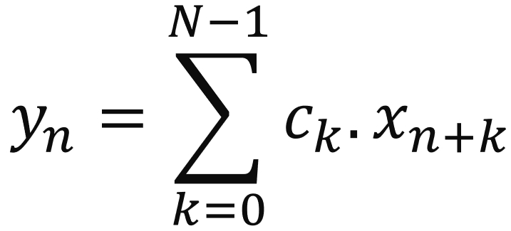
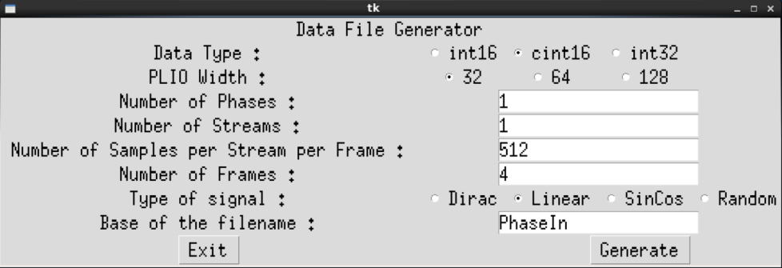

<table>
 <tr>
   <td align="center">
   <h1>Super Sampling Rate FIR Filters</h1>
   <h2>Implementation on the AI Engine</h2>
   </td>
 </tr>
 <tr>
 </tr>
</table>

This design has been tested using the Vitis software development platform 2020.2.

# Introduction

Versal™ ACAP AI Core Series are heterogeneous devices containing many domains with compute capabilities. With respect to Digital Signal Processing (DSP), and particularly Finite Impulse Response (FIR) filters, the two domains of interest are:
- The Programmable Logic (PL) which is the "classical" domain of Xilinx devices
- The AI Engine Processor Array which is a new domain within Versal ACAP Xilinx devices

FIR filter architecture is a rich and fruitful electrical engineering domain, especially when the input sampling rate becomes higher than the clock rate of the device (Super Sampling Rate aka. SSR). For the PL there exists a number of solutions that are already available using turnkey IP solution (FIR Compiler). The AI Engine array is a completely new processor and processor array architecture with enormous compute capabilities, so an efficient filtering architecture has to be found using all the capabilities of the AI Engine array, but also all the communications that are possible with the PL.

The purpose of this tutorial is to provide a methodology to enable you to make appropriate choices depending on the filter characteristics, and to provide examples on how to implement Super Sampling Rate (SSR) FIR Filters on a Versal ACAP AI Engine processor array.

# Before You Begin

Before beginning this tutorial you should be familiar with Versal ACAP architecture and more specifically on the AI Engine array processor and interconnect architecture.

* [Xilinx Website for Versal ACAP AI Core Series](https://www.xilinx.com/products/silicon-devices/acap/versal-ai-core.html)
*[Introduction to the AI Engine](https://forums.xilinx.com/t5/Design-and-Debug-Techniques-Blog/Versal-ACAP-AI-Engines-for-Dummies/ba-p/1132493)
*[AI Engine Detailed Architecture](https://www.xilinx.com/support/documentation/architecture-manuals/am009-versal-ai-engine.pdf)

Software requirements include:
* [Vitis](https://www.xilinx.com/support/download/index.html/content/xilinx/en/downloadNav/vitis.html)
* [Python 3](https://www.python.org/downloads/)

## Accessing the Tutorial Reference Files

1. To access the reference files, type the following into a terminal: `git clone https://github.com/Xilinx/SSR-FIR-Tutorial`.
2. Navigate to the `Utils` directory, and type `source InitPythonPath` to have this directory in your path for Python libraries and executable search path.

You can now start the tutorial.

# SSR FIR Tutorial

This tutorial is decomposed into multiple steps:

1. [Summary of AI Engine Architecture](#AIE_Architecture)
2. [What is a FIR Filter?](#FIR_Filter)
3. ["Utils" directory](#UtilsDirectory)
4. [Single Kernel FIR](SingleKernel/README.md)
5. [Multi-Kernel FIR](MultiKernel/README.md)
6. Polyphase FIR (SSR)
   1. [Single Stream](SingleStreamSSR/README.md)
   2. [Double Stream](DualStreamSSR/README.md)

# Summary of AI Engine Architecture

You should have already read the [AI Engine Detailed Architecture](https://www.xilinx.com/support/documentation/architecture-manuals/am009-versal-ai-engine.pdf), so the purpose of this chapter is simply to highlight the features of the AI Engine that will be useful for this tutorial.

Versal™ Adaptive Compute Acceleration Platforms (ACAPs) combine Scalar Engines, Adaptable Engines, and Intelligent Engines with leading-edge memory and interfacing technologies to deliver powerful heterogeneous acceleration for any application.

 

Intelligent Engines are SIMD VLIW AI Engines for adaptive inference and advanced signal processing compute.

DSP Engines are for fixed point, floating point, and complex MAC operations.

The SIMD VLIW AI Engines come as an array of interconnected processors using AXI-Stream interconnect blocks as shown in the following figure:

 

All arrays (processors, memory modules, AXI interconnects) are driven by a single clock. The slowest speed grade device can run @1 GHz. The highest speedgrade will allow 1.3 GHz clock rates. The AI Engine allows for numerous connection possibilities with the surrounding environment as shown in the following figure.

 

## Memory interface

 

Each AI Engine is surrounded by 4x 32 kB memories, each one being divided in four pairs of banks. The bandwidth is very high:
- 2 reads / cycle on 32 bytes (256 bits) each
  - Each bank having a single port, the accesses must be done on different banks to achieve 2x 256 bits/cycle.
- 1 write / cycle on 32 bytes (256 bits)
  - On another bank to achieve the highest bandwidth
- Be aware that you need also to feed the memories using DMAs or other AI Engines

## Streaming interface

 

The streaming interface is based on two incoming streams and two outgoing streams, each one on 32 bits per clock cycle. These four streams are handled by a stream FIFO that allows the processor to use different bitwidths to access these streams:

- 2 streams in, 2 streams out
  - Each one 4 bytes/cycle or 16 bytes/ 4 cycles
- Parallel access to streams per VLIW:
  - 2 reads (4/16 bytes), 1 write (4/16 bytes)
  - OR 1 read (4/16 bytes), 2 writes (4/16 bytes)
- Using 1 stream:
  - 4 bytes/cycle read and 4 bytes/cycle write
- Using the 2 streams and the 16-byte access option
  - Reads and/or writes can be dispatched over time
  - On average 8 bytes/cycle read and 8 bytes/cycle write

Accessing the data to/from the streams using the 128 bit interface does not increase the bandwidth, but limits the number of accesses that must be scheduled within the microcode of the VLIW processor.

## Cascade Streams

 

The cascade stream allows an AI Engine processor to transfer the value of some of its accumulator register (384 bits) to its neighbor (on the left or on the right depending on the row):

- It is capable of 8x 48-bit word transfer v8acc48 or v4cacc48 in a single cycle
- 48 bits is the number of bits of the result of a 16-bits x 16-bits multiplication
- If the transfer concerns a 768 bit register, it will take 2 clock cycles.

# What is a FIR Filter?

The purpose of this tutorial is not to train you to be an expert in Digital Signal Processing, however to grasp the basics of FIR filtering it is necessary to understand the computations that are required, and the data that are consumed and produced by the compute block.

A digital signal is an analog signal (audio, radio frequencies, ...) that has been received by a converter (Analog to Digital Converter: ADC) which performs two operations:
- **Slicing**: The impinging signal is sliced into very small time slots on which its amplitude is approximated by a constant value.
- **Quantizing**: Digital systems understand only bits. The constant value at the output of the slicer is transformed into an integer value whose maximum represents the maximum amplitude that the system can receive.

As a result the digital signal at the output of the ADC is simply a series of *N*-bits values (called samples) that can be processed to extract some useful information. The most basic operation is to multiply some samples by some specific coefficients and accumulate these values to create a "summary" of this part of the signal.

A filtering operation perform this using a sliding window on the signal as shown in the following figure:

 

Input data samples are in general called **x** (blue squares), the coefficients **c** (green squares) and the output samples **y**:

 

DSP experts may say that this equation represents a _correlation_ and not a _convolution_ which is the mathematical expression of the filtering operation. The easy answer may be to say that it is simply a question of coefficients ordering (and perhaps conjugation for complex coefficients). Regardless, this equation is the one that will be implemented in the AI Engine throughout this tutorial.

# "Utils" Directory

For this tutorial a number of utilities have been created that you are free to reuse for your own purposes.

First, to allow these utilities to be called from anywhere during this tutorial you need to add this directory in your **_PATH_** but also indicate to `python` that this directory contains some libraries and should be checked during imports.

Navigate to the `Utils` directory, and type `source InitPythonPath` to have this directory in your path for Python libraries and executable search path.

## GenerateStreams

This utility will use a library **_GenerationLib.py_** to generate input data suitable for the cases you want to test. It is called by typing: `GenerateStreams`. This displays a GUI in which you can select the appropriate parameters to generate the correct input data files:

 

You have access to a number of parameters:
- _Data Type_: by default `cint16`as this is what you will use throughout this tutorial
- _PLIO Width_: by default `64` as this is the width which is used in this tutorial
- _Number of Phases_: for Super Sampling Rate Filters
- _Number of Streams_: for the SSR filters using the 2 streams of the AI Engines
- _Number of Samples per Stream per Phase_: Each stream contains a number of samples defined there
- _Number of Frames_: simulations are launched for a limited number of Frames
- _Base of the Filename_: `PhaseIn` by default which generates the following names:
  - Single Stream, Single Phase: `PhaseIn_0.txt`
  - Single Stream, Polyphase: `PhaseIn_0.txt`, `PhaseIn_1.txt`, ...
  - Dual streams, Polyphase:  `PhaseIn_0_0.txt`, `PhaseIn_0_0.txt`, `PhaseIn_1_0.txt, `PhaseIn_1_0.txt``, ...

## ProcessAIEOutput

This utility takes all generated outputs and displays the reconstructed signal. For Single Stream/Single Phase it will display a signal using the timestamps written in the file.

If your output signals are stored in files named `output_0.txt` ... then navigate to the output directory and type `ProcessAIEOutput output_*` to process the output of the AI Engines.

Two other files are generated:
- _Atot.txt_ which is the output phase by phase
- _out.txt_ which is the textfile of the reconstructed signal

## StreamThroughput

This utility computes the throughput concerning all AI Engine output files given in an argument.

## GetDeclare.sh

This utility has been created to view the template arguments that were used for kernel declaration in the Double Stream SSR case. It can be easily modified to be adapted to different cases.

Copyright&copy; 2020 Xilinx XD020 

