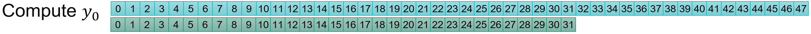
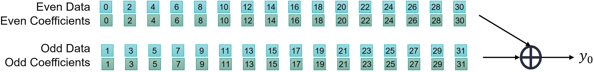
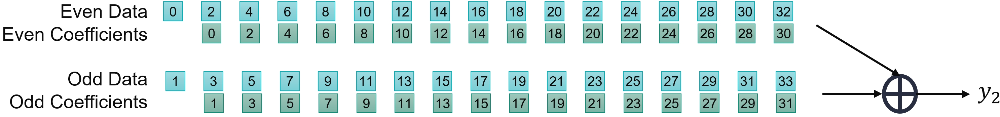
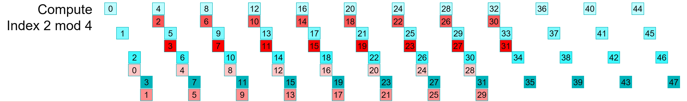
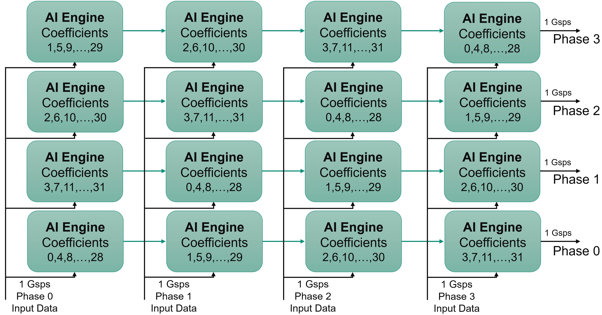
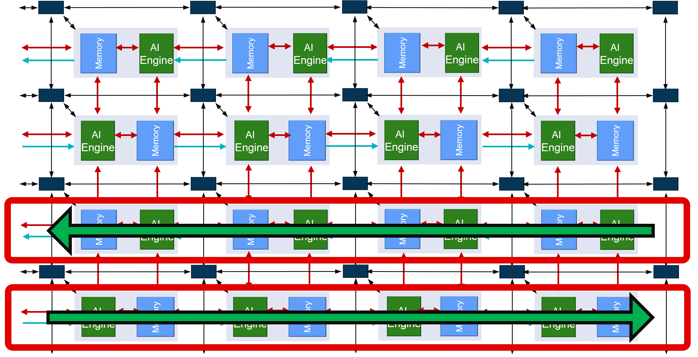
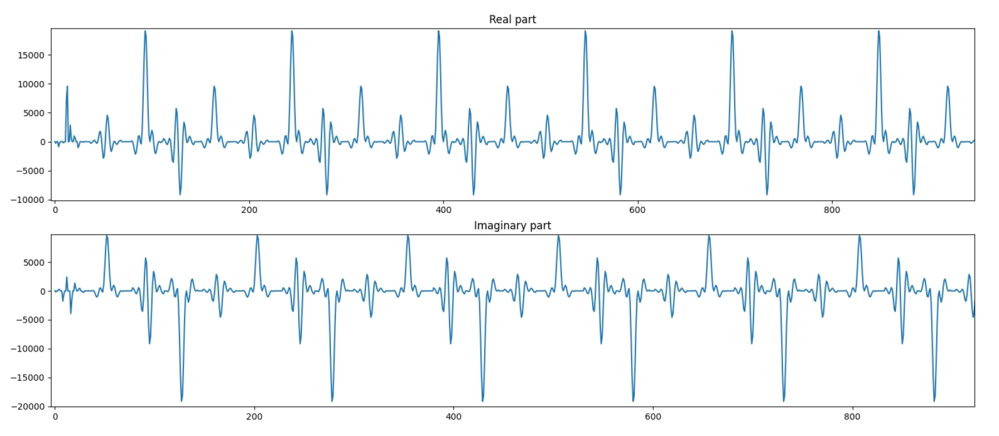

<table class="sphinxhide" width="100%">
 <tr width="100%">
    <td align="center"><h1>AI Engine Development</h1>
    <a href="https://www.xilinx.com/products/design-tools/vitis.html">See Vitis™ Development Environment on xilinx.com</br></a>
    <a href="https://www.xilinx.com/products/design-tools/vitis/vitis-ai.html">See Vitis™ AI Development Environment on xilinx.com</a>
    </td>
 </tr>
</table>

# Single-Stream Interface

***Version: Vitis 2023.1***

## Super Sampling Rate FIR Filter

The purpose of this third part of the tutorial is to understand how to implement a FIR filter that has an input sample rate above the clock frequency of the AI Engine array.

Navigate to the `SingleStreamSSR` directory to continue.

## Super Sampling Rate and Polyphase

When the input sampling Rate is above the clock frequency of the processor (Super Sampling Rate), samples must be acquired in parallel. For a 2 Gsps input sample rate, you can specify that the filter should receive two samples at a 1 GHz rate, which can be seen as two data streams (Polyphase decomposition), each one at 1 Gsps. Because the AI Engine array AXI-Stream network is limited to 1 GHz (slowest speed grade), the high sampling rate input (above 1 Gsps) is to be decomposed into multiple phases to be processed.

As a first example, suppose there is a 2 Gsps data stream to be processed, it can be split into two phases to be routed to the AI Engine array:


A 5 Gsps data stream must be split into 5 phases:


## Organize Computation for a 2 Gsps Data Stream in 2 Phases

For a single-rate filter, a 2 Gsps input sample rate also means a 2 Gsps output sample rate. Because the input stream is separated into two (even, odd) streams, the output stream must be split the same way.

Take a look at how **y0** is computed:



If the data stream is split into two phases, it can be seen that the coefficients also have to be split into two phases.



Also take a look at how **y2** is computed:




For the even output stream, the data and coefficient phases should match:
- Even data phase sent through a filter built with the even phase coefficients
- Odd data phase sent through a filter built with the odd phase coefficients

Take a look at how this is modified for the odd outputs:


In this case, the phases of the data and coefficients should be mixed:
- Even data phase sent through a filter built with the odd phase coefficients
- Odd data phase sent through a filter built with the even phase coefficients

There is a further difference between the two. In the odd output case, they (even data, odd coefficients) should discard one data at the beginning of the stream.

In the previous section, the balance between data transfer and compute performance of the AI Engine was obtained for a 1 Gsps data stream going through an eight tap filter. The balance is identical here. As we have eight different filters, we can process 4x 1 Gsps streams in parallel.

The data stream and the coefficients must be split into four phases and then recombined. In the following figures, the various colors correspond to a different phase for the data (blue) and the coefficients(red):
- Output phase 0, will be split and recombined as follows:


- Output phase 1, will be split and recombined as follows:


- Output phase 2, will be split and recombined as follows:





- Output phase 3, will be split and recombined as follows:


The Data and the Coefficients being split into *N* Phases (four in this case), the resulting architecture requires *N*Phases x *N*Phases (4x4 = 16) to be implemented.

## Designing the Graph

The kernels created in the previous section can be reused here as the only difference is the way that thay are connected together. In the preceding images, you can see that there are 16 associations **(Data Phase, Coefficient Phase)**. Also, it can clearly be seen that some of the data streams have the data discarded before the computation starts:
- Output phase 0: No input data phase will have discarded samples.
- Output phase 1: Input data phase 0 will have 1 discarded sample.
- Output phase 2: Input data phase 0 and 1 will have 1 discarded sample.
- Output phase 3: Input data phase 0, 1 and 2 will have 1 discarded sample.

To minimize the data routing, all blocks using the same data stream should be placed in the same column. This leads to the following architecture:



In the AI Engine array, the direction of the cascade stream is flipped from one row to the next.



This feature needs to be taken into account when placing the kernels to get the cascade connections correct in the graph:


The kernels highlighted in the following figure need to discard one sample within the initialization function:


At this point, consider latencies within the kernels. In the operation scheduling, data is first read from the stream, a `mul4` and three `mac4` are performed, and the accumulator is then sent to the cascade stream. Overall, the latency from 'read' to 'write' is approximately 20-25 clock cycles (call it L, L~25). In the left hand side column, this means that the data input from the first row to the second row should enter a FIFO of length ~75 (3L). The Input to row two is approximately the same as row zero, and row three should be fed at the same time as row 1. The following table shows the latencies in multiple of L:

| | Column 0 | Column 1 | Column 2 | Column 3 |
| ---: | :---: | :---: | :---: | :---: |
| **Row 3** | 3L  | 2L  | L  | 0  |
| **Row 2** | 0  | L  | 2L  | 3L  |
| **Row 1** | 3L  | 2L  | L  | 0  |
| **Row 0** | 0  | L  | 2L  | 3L  |

Depending on the row, the latencies are completely different.

A first possibility is to have these FIFOs implemented in the PL, and have two streams coming from the PL for each column, one serving the even rows and the other serving the odd rows. A single FIFO is required on the first and last columns, but two are necessary for the inner columns.


Another possibility is to have them inside the AI Engine array. A latency of less than 32 colock cycle usually gets implemented into the FIFOs included in the AXI-Stream interconnect. Above that number, it gets implemented in a memory module as a DMA FIFO. Either you can share one DMA FIFO for the odd rows and another one for the even rows, or you dedicate one FIFO for each AI Engine. The latter choice that has been done here, and they are constrained to be placed right beside the kernel.


## C++ Code Analysis

The kernel definition is exactly the same as the previous part of this tutorial. The only difference is in the graph to encode this 16 kernel four-phase filter.

At the graph level, all the kernels are first declared in a class:

```C++
class FIRGraph_4Kernels: public adf::graph
{
private:
	kernel k[4][4];

public:
	input_port in[4];
	output_port out[4];
```

The constructor takes charge in the next operations. The first operation is to create the kernels. The complete grid of 4x4 kernels is defined as follows:

```C++
FIRGraph_SSR4()
{
    // k[N][0] is always the first in the cascade stream
    // Topology of the TopGraph
    //
    //      3,3   3,2   3,1   3,0 <--
    //  --> 2,0   2,1   2,2   2,3
    //      1,3   1,2   1,1   1,0 <--
    //  --> 0,0   0,1   0,2   0,3

    k[0][0] = kernel::create_object<SingleStream::FIR_MultiKernel_cout<NUM_SAMPLES,SHIFT>>(taps4_p0);
    k[0][1] = kernel::create_object<SingleStream::FIR_MultiKernel_cincout<NUM_SAMPLES,SHIFT>>(taps4_p1);
    k[0][2] = kernel::create_object<SingleStream::FIR_MultiKernel_cincout<NUM_SAMPLES,SHIFT>>(taps4_p2);
    k[0][3] = kernel::create_object<SingleStream::FIR_MultiKernel_cin<NUM_SAMPLES,SHIFT>>(taps4_p3);

        .
        .
        .

    k[3][0] = kernel::create_object<SingleStream::FIR_MultiKernel_cout<NUM_SAMPLES,SHIFT>>(taps4_p0);
    k[3][1] = kernel::create_object<SingleStream::FIR_MultiKernel_cincout<NUM_SAMPLES,SHIFT>>(taps4_p3);
    k[3][2] = kernel::create_object<SingleStream::FIR_MultiKernel_cincout<NUM_SAMPLES,SHIFT>>(taps4_p2);
    k[3][3] = kernel::create_object<SingleStream::FIR_MultiKernel_cin<NUM_SAMPLES,SHIFT>>(taps4_p1);
```
The source and header locations are then defined for the AI Engine. The location of the first AI Engine in each row must also be constrained to facilitate the placer work:

```C++
// Constraints: location of the first kernel in the cascade
for(int i=0;i<NPhases;i++)
{
    int j = (i%2?28:25); // 25 on even rows and 28 on odd rows
    location<kernel>(k[i][0]) = tile(j,i);
}
```

To shorten the place time by a few seconds, you can constrain the core location. A single one is necessary because all the others are constrained by the **cascade** connection:

```C++
// Constraints: location of the first kernel in the cascade
location<kernel>(k[0]) = tile(25,0);
```

All kernels need to discard a specific number of elements, this is handled by the initialization function as this must be done beforehand and only once. This can be done in a loop on the column and rows with two initialization functions:

- `SingleStream::FIRinit<0>`
- `SingleStream::FIRinit<1>`


Finally, the kernels must be connected together with the cascade stream in between them, and the input streams for all of them.

```C++
// Cascade Connections
for(int row=0;row<NPhases;row++)
{
    for(int i=0;i<NPhases-1;i++) connect<cascade> (k[row][i].out[0],k[row][i+1].in[1]);
    connect<stream> (k[row][3].out[0],out[row]);
}

// Input Streams connections and DMA FIFO constraints
for(int row = 0;row<NPhases;row++)
    for(int col=0;col<NPhases;col++)
    {
        int col1 = (row%2?NPhases-col-1:col); // kernel col is inverted on odd rows
        int fiforow = row;  // Each Kernel is served by an independent FIFO

        connect<stream> n0 (in[col],k[row][col1].in[0]);
        fifo_depth(n0) = 512;
        location<fifo>(n0) = dma_fifo(aie_tile, FirstCol+col, fiforow, 0x0000, 512);
    }
```

## Compilation and Analysis


Navigate to the `MultiKernel` directory. In the `Makefile`, three methods are defined:
- `aie`
  - Compiles the graph and the kernels
- `aiesim`
  - Runs the AI Engine System C simulator
- `aieviz`
  - Runs `vitis_analyzer`on the output summary

Take a look at the source code (kernel and graph) to familiarize yourself with the C++ instanciation of kernels. In `graph.cpp`, the PL AI Engine connections are declared using 64-bit interfaces running at 500 MHz, allowing for maximum bandwidth on the AI Engine array AXI-Stream network.

To have the simulation running, input data must be generated. There are two possibilities:

1. Just type `make data`.
2. Change directory to `data` and type `GenerateStreams`. The following parameters should be set for this example:


Click **Generate** and then **Exit**. The generated files `PhaseIn_0.txt` ... `PhaseIn_3.txt` should contain mainly 0's, with a few 1's and 2's.

Type `make all` and wait for the `vitis_analyzer` GUI to display. The AMD Vitis&trade; analyzer is able to show the graph, how it has been implemented in the device, and the complete timeline of the simulation. In this specific case, the graph is simple (a single kernel) and the implementation is on a single AI Engine.

Click **Graph** to visualize the graph of the application:


The 16 kernels and their eight independent input streams are clearly visible. The top graph is for the output phases 0 and 2, the phases where the cascade stream is from left to right on the physical device. The bottom graph is for phases 1 and 3 where the cascade stream is from right to left.

Click **Array** to visualize where the kernel has been placed, and how it is fed from the the PL:


In this view, the cascade streams connecting neighboring AI Engines are key to the performance of this graph. With the four location constraints that were added, the placer had only one solution for the kernel placement: this square. The router had an easy job to feed all these kernels by simply using the south-north AXI-Stream. The path back to the PL from the extremities also uses only the vertical AXI-Streams.

Finally, click **Trace** to look at how the entire simulation went through. This may be useful to track where your AI Engine stalls if performance is not as expected:


Now the output of the filter can be displayed. The input being a set of Dirac impulses, the impulse response of the filter should be recognized throughout the waveform. Navigate to `Emulation-AIE/aiesimulator_output/data` and look at the `output_0.txt`. You can see that you have two complex outputs per line which is prepended with a time stamp.  `ProcessAIEOutput output_*`.



The top graph reflects the real part of the output. The bottom graph this is the imaginary part. On both, the filter impulse response is recognizable.

The performance of this architecture can be measured using the timestamped output. In the same directory (`Emulation-AIE/aiesimulator_output/data`), type `StreamThroughput output_*`:

```
output_0.txt -->   954.33 Msps
output_1.txt -->   949.91 Msps
output_2.txt -->   954.33 Msps
output_3.txt -->   949.91 Msps

-----------------------


Total Throughput -->    3808.48 Msps
```

This architecture achieves close to 4 Gsps performance. It is slightly less because of the number of cycles spent for initialization when the kernels are called. This performance increases when the frame length is increased.

## License

___

The MIT License (MIT)

Copyright (c) 2023 Advanced Micro Devices, Inc.

Permission is hereby granted, free of charge, to any person obtaining a copy of this software and associated documentation files (the "Software"), to deal in the Software without restriction, including without limitation the rights to use, copy, modify, merge, publish, distribute, sublicense, and/or sell copies of the Software, and to permit persons to whom the Software is furnished to do so, subject to the following conditions:

The above copyright notice and this permission notice shall be included in all copies or substantial portions of the Software.

THE SOFTWARE IS PROVIDED "AS IS", WITHOUT WARRANTY OF ANY KIND, EXPRESS OR IMPLIED, INCLUDING BUT NOT LIMITED TO THE WARRANTIES OF MERCHANTABILITY, FITNESS FOR A PARTICULAR PURPOSE AND NONINFRINGEMENT. IN NO EVENT SHALL THE AUTHORS OR COPYRIGHT HOLDERS BE LIABLE FOR ANY CLAIM, DAMAGES OR OTHER LIABILITY, WHETHER IN AN ACTION OF CONTRACT, TORT OR OTHERWISE, ARISING FROM, OUT OF OR IN CONNECTION WITH THE SOFTWARE OR THE USE OR OTHER DEALINGS IN THE SOFTWARE.

<p align="center"><sup>Copyright&copy; 2020–2023 Advanced Micro Devices, Inc </sup><br><sup>XD020</sup></br></p>
