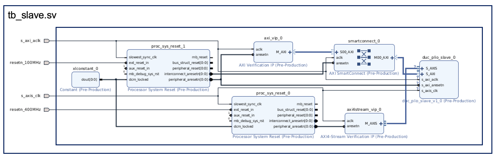

© Copyright 2021 Xilinx, Inc.

Licensed under the Apache License, Version 2.0 (the "License");
you may not use this file except in compliance with the License.
You may obtain a copy of the License at

    http://www.apache.org/licenses/LICENSE-2.0

Unless required by applicable law or agreed to in writing, software
distributed under the License is distributed on an "AS IS" BASIS,
WITHOUT WARRANTIES OR CONDITIONS OF ANY KIND, either express or implied.
See the License for the specific language governing permissions and
limitations under the License.

# Summary
This simulation design builds on the IP that was generated by using the Makefile in the parent directory, i.e. dlbf_slave. The design is built using the following blocks:
1. AXI4 LITE VIP
2. AXI4 Stream Master VIP
3. Reset blocks
4. dlbf_slave IP 

# Block diagram of test design

# Resources
1. [Xilinx AXI VIP](https://www.xilinx.com/products/intellectual-property/axi-vip.html)
2. [Xilinx AXI Stream VIP](https://www.xilinx.com/products/intellectual-property/axi-stream-vip.html)
3. [Xilinx Wiki](https://xilinx-wiki.atlassian.net/wiki/spaces/A/pages/18842507/Using+the+AXI4+VIP+as+a+master+to+read+and+write+to+an+AXI4-Lite+slave+interface)

