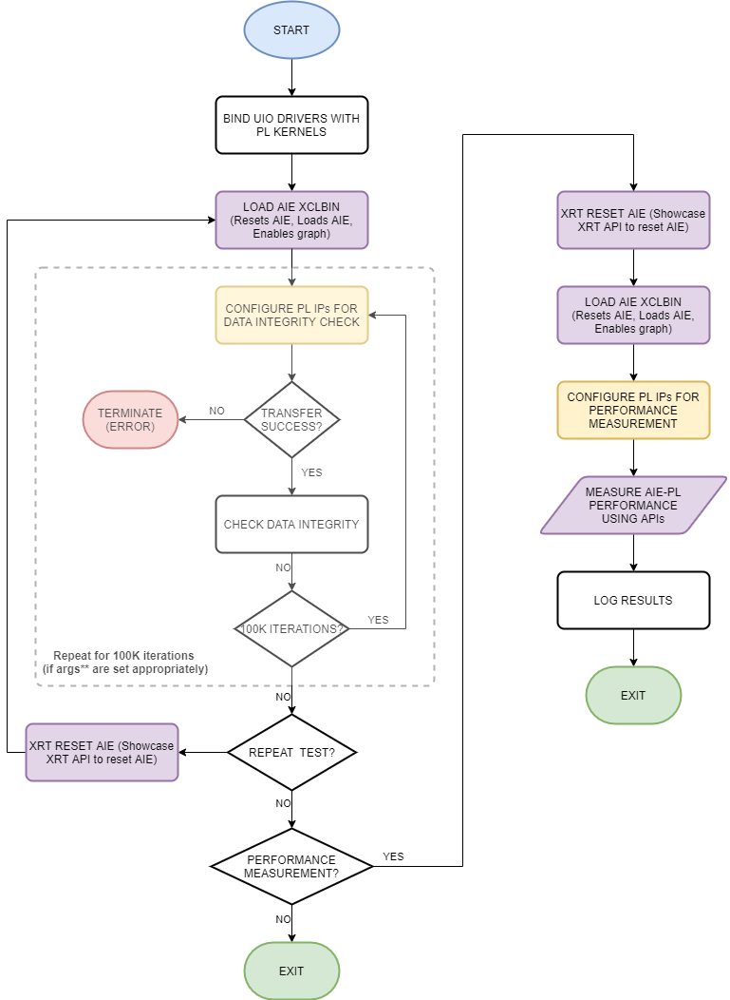

# Building the Design

The next step is to create the Linux PS host application.


```
make exe
```

The individual commands are explained later on in this module.


# Introduction: Programming the PS Host Application

A top-level PS application running on the Cortex-A72 processor controls the AI Engine graph and the PL kernels. In Module 05, you created a PS host application for a bare-metal system. In this module, you will create a PS host application that runs on a Linux operating system (built in Module 07).

Detailed descriptions of compiler flags, include directories, and linker flags are available in [AI Engine Documentation: Integrating the Application Using the Vitis Tools Flow, Compile the Embedded Application for the Cortex-A72 Processor](https://www.xilinx.com/html_docs/xilinx2020_2/vitis_doc/integrate_ai_engine_application.html#ariaid-title7).

Linux host applications use the Xilinx Runtime (XRT) API to control the PL and AI Engine kernels. In this tutorial, XRT is used to access the AI Engine graph and generic UIO drivers to access the PL kernels.  

# Execution Flow Chart

The Linux PS host application is the ``beamformer.cpp`` file. The following figure shows the execution flow diagram implemented by the ``beamformer.cpp``.



The following sections detail the important steps in the execution flow.  

# Bind UIO Drivers with PL Kernels

In Module 07, you created the PetaLinux software platform with a custom DTSI file that listed out the generic UIO drivers for each PL kernel instance. Each UIO driver in the DTSI file has the same name as each PL kernel instance name specified in the ``config_2regslice.ini`` file in Module 04.

One of the first things the host application does is bind the UIO drivers to the PL kernels. It searches for the UIO devices in the system for the known PL kernel names. This is done by calling the `dlbf_assign_addr` and `ulbf_assign_addr` functions defined in the `src/utils/utils_dlbf.cpp` and `src/utils/utils_ulbf.cpp` files.

These functions call the `mmap` function to bind the physical address of the PL kernels to a memory pointer. The host application uses the memory pointer to access the register maps of the PL kernels.   

# Load AIE XCLBIN   

The host application resets the AI Engine array, loads the AI Engine array, and enables the AI Engine graph.

## Reset AI Engine

The host application can reset and reload the AIE array whenever required. To do this, XRT must be built into the PetaLinux build. In the host application, you can use the following API to reset the AI Engine with the `xrtResetAIEArray` function:

```C++
 auto dhdl   = xrtDeviceOpen(0);
 ...
reset_done = xrtResetAIEArray(dhdl);
if (reset_done == -1){
    printf("[Beamformer] AIE reset FAILS \n");
    log_plnx << "[Beamformer] AIE reset FAILS" <<std::endl;
    printf("[Beamformer] Exiting the application as it cannot be run\n");
    log_plnx << "[Beamformer] Exiting the application as it cannot be run" <<std::endl;
    return 1;
}
else if(reset_done == 0) {
    printf("[Beamformer] AIE reset done successfully\n");
    log_plnx << "[Beamformer] AIE reset done successfully" << std::endl;
}
```
If the `xrtResetAIEArray` function fails, the AI Engine reset has not been accomplished successfully and a system reboot might be required. See the [API Documentation](https://github.com/Xilinx/XRT/blob/a155e1630d18884c9f82d71f3a0b4e8a91074069/src/runtime_src/core/include/experimental/xrt_aie.h).

This function does not orchestrate system reset but _only_ resets the AI Engine array.

## Load AI Engine with XCLBIN

The host application loads the AI Engine with the XCLBIN with the ``xclloadxclbin()`` function.

The following snippet of code shows usage in the application shows how to load AIE. See the [API Documentation](https://xilinx.github.io/XRT/master/html/xrt.main.html?highlight=xclloadxclbin#c.xclLoadXclBin).

```C++
//In load_xclbin()
...
if (xclLoadXclBin(device, top))
 throw std::runtime_error("Bitstream download failed");
...
```
If the AI Engine load fails, the `load_xclbin()` function throws an exception. A system reboot might be required.

## Reset AI Engine in the Middle of Execution

Sometimes it is necessary to stop a running execution of the system and start over. To restart the system and start again, there is a flow to follow. These steps can be performed any number of times in the host application.

**1. Quiesce PL kernels (that is to say, stop PL<->AIE data paths)**

As a prerequisite, the PL kernels should have the ability to be quiesced by the host application. All the examples shown in this design have this feature by way of the start register (that is, all PL kernels are AXI-MM slaves to the PS). The PS communicates with the PL kernels to hold them in an idle state before the reset/load of the AI Engine.

**2. Reset AI Engine**

Reset the AI Engine using the ``xrtResetAIEArray`` function. Make sure to verify the return value and proceed if it is ``SUCCESSFUL``. Otherwise, reboot the system.

**3. Load AI Engine with the XCLBIN**

Reload the AI Engine with the XCLBIN using the `xclloadxclbin()` function. Verify the return value and proceed if it is ``SUCCESSFUL``. Otherwise, reboot the system.

**4. Re-start PL kernels**

Lastly, restart the PL kernels to send/receive PL traffic to/from the AI Engine.


## Command-Line Arguments

The ``beamformer.cpp`` file takes two command line arguments:

```
./beamformer.exe <argv[1]> a.xclbin
```

The `a.xclbin` is the AI Engine PDI. You can specify the ``<argv[1]>`` variable for the program to execute a different test. Below is a table of the test options:

| argv\[1\]  | Description  |
| -------- |-----|
| 0      |  <ul><li>Reset/ Load AIE</li><li>Functional test for N iter</li><li>Reset/ Load AIE </li><li>Functional test for N iter</li><li>Reset/load AIE </li><li>PERF test with one input and one output PLIO of each sub graph</li></ul> |
| 1      | <ul><li>Reset/ Load AIE</li><li>Functional test for 100k iterations with data integrity test every N iterations</li><li>Reset/ Load AIE</li><li>PERF test for all PLIOs  </li></ul>|
|2|Continuously run the functional test for an infinite number of iterations. To exit, hit **Ctrl+C**. This does not guarantee graceful exit. System reboot is required. This mode helps measure the power of the system while it runs continuously. |

© Copyright 2021 Xilinx, Inc.

Licensed under the Apache License, Version 2.0 (the "License");
you may not use this file except in compliance with the License.
You may obtain a copy of the License at

    http://www.apache.org/licenses/LICENSE-2.0


Unless required by applicable law or agreed to in writing, software
distributed under the License is distributed on an "AS IS" BASIS,
WITHOUT WARRANTIES OR CONDITIONS OF ANY KIND, either express or implied.
See the License for the specific language governing permissions and
limitations under the License.
