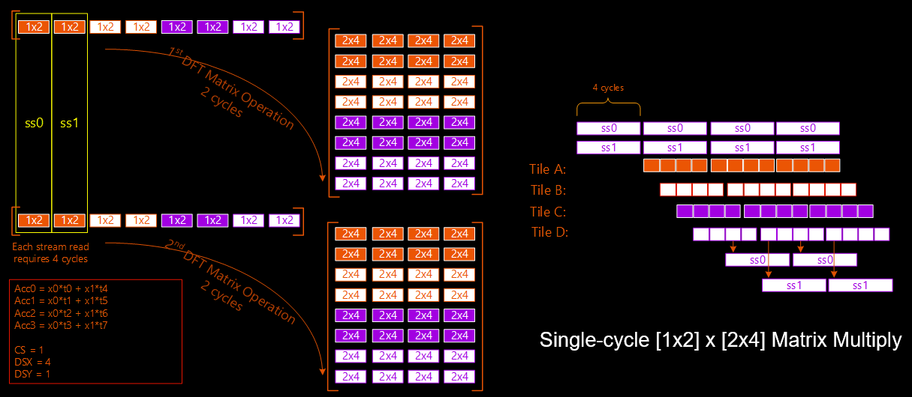

<!--
Copyright (C) 2023, Advanced Micro Devices, Inc. All rights reserved.
SPDX-License-Identifier: MIT
Author: Mark Rollins
-->
<table class="sphinxhide" width="100%">
 <tr width="100%">
    <td align="center"><h1>AI Engine Development</h1>
    <a href="https://www.xilinx.com/products/design-tools/vitis.html">See Vitis™ Development Environment on xilinx.com</br></a>
    <a href="https://www.xilinx.com/products/design-tools/vitis/vitis-ai.html">See Vitis™ AI Development Environment on xilinx.com</a>
    </td>
 </tr>
</table>

# Polyphase Channelizer

***Version: Vitis 2023.1***

## Table of Contents

1. [Introduction](#introduction)
2. [Channelizer Requirements](#channelizer-requirements)
3. [Matlab Model](#matlab-model)
4. [System Partitioning](#system-partitioning)
5. [Design Overview](#design-overview)
6. [Polyphase Filterbank Design](#polyphase-filterbank-design)
7. [Discrete Fourier Transform Design](#discrete-fourier-transform-design)
8. [Build and Run Design](#build-and-run-design)

[References](#references)

[Support](#support)

[License](#license)

## Introduction

The polyphase channelizer [[1]] down-converts simultaneously a set of frequency-division multiplexed (FDM) channels carried in a single data stream using an
efficient approach based on digital signal processing. Channelizer use is ubiquitous in many wireless communications systems. Channelizer sampling rates increase steadily as the capabilities of RF-DAC and RF-ADC technology advances, making them challenging to implement in high-speed reconfigurable devices, such as field programmable gate arrays (FPGAs). This tutorial implements a high-speed channelizer design using a combination of AI Engine and programmable logic (PL) resources in AMD Versal™ adaptive SoC devices.

## Channelizer Requirements

The following table shows the system requirements for the polyphase channelizer. The input sampling rate is 10.5 GSPS. The design supports M=16 channels with each one supporting 10.5G / 16 = 656.25 MHz of bandwidth. The channelizer employs a polyphase technique as outlined in [[1]] to achieve an oversampled output at a rate of P/Q = 8/7 times the channel bandwidth, or 656.25 * 8/7 = 750 MSPS. The prototype filter used by the channelizer uses K=8 taps per phase, leading to a total of 16 x 8 = 128 taps overall.

|Parameter|Value|Units|
|---|---|---|
| Input Sampling Rate (Fs) | 10.5 | GSPS |
| # of Channels (M) | 16 | channels |
| Interpolation Factor (P)| 8 | n/a |
| Decimation Factor (Q) | 7 | n/a |
| Channel Bandwidth | 656.25 | MHz |
| Output Sampling Rate | 750 | MSPS |
| # of taps per phase (K) | 8 | n/a |

The following figure shows a block diagram of the polyphase channelizer. The following five blocks perform the required signal processing functions:

* The Circular Buffer converts the scalar input data stream into an M-vector output format for the downstream blocks, and introduces state to manage the P/Q output oversampling. Its memory depth spans the full extent of M x K samples. Conceptually, the circular buffer operates on a M x K array, employing a "serpentine shift" to introduce S = M x Q /   P samples to each new output block. The remaining M - S samples come from the state history.
* The Polyphase Filter implements a parallel bank of M filters across the columns of the M x K circular buffer. Each filter employs K = 8 coefficients taken from an M-phase  decomposition of the channelizer prototype filter. The filter produces a single vector of M output samples.
* The Cyclic Shift Buffer removes frequency-dependent phase shifts from the downstream Inverse Discrete Fourier Transform (IDFT) outputs using a memoryless and periodically time-varying circular shift of its inputs. A finite state machine (FSM) manages the sequence of input permutations across each input block. The number of states depends on the specific oversampling ratio factors P and Q and number of channels M.
* The Inverse Fast Fourier Transform (IFFT) performs an IDFT operation on its input vector of M samples to produce a transformed vector of output samples. In the channelizer context, the IDFT performs a parallel bank of M frequency down-conversion operations. Each IDFT output represents a separate down-converted channel of bandwidth Fs / M sampled at a rate of Fs / M * P / Q samples per second.
* The output buffer prepares the output channel samples for consumption by downstream processing. It is not included in this reference design.


## MATLAB Model

The following figure shows a system model of the polyphase channelizer built in MATLAB and encapsulated in a MATLAB app (GUI). This provides a comprehensive golden model of the channelizer algorithms and illustrates the relationships between the various system parameters. The model was built to support a broader range of parameter settings than the actual Versal adaptive SoC design:

* The model supports two different input sampling rates: Fs = 10.5 GSPS and Fs = 20.5 GSPS.
* The number of channels M can be set to 16, 32, 64, or 128 using a dial.
* The output oversampling ratio P/Q may be set to 1/1, 2/1, 4/3, or 8/7 using the appropriate button.
* The number of active channels can be entered in the bottom left. This value must be less than the chosen value of M.

The model may be run by pressing the "Go" button. When this occurs, the model generates the desired number of active channels and positions them in randomly chosen carrier locations. Each signal is modeled as filtered Gaussian noise for simplicity. The model displays the impulse response of the prototype channelizer filter computed for the given system parameters in the top left plot. The bottom left plot shows this same filter in the frequency domain in red along with the actual signal to be extracted by the channelizer in blue. The top right plot shows the input spectrum to the channelizer along with the active carriers and their index labels. The bottom right plot shows the extracted channels at baseband in the time domain, where the blue signals are the channelizer inputs (delayed by the known group delay of the channelizer), and the red signals are the channelizer outputs.


## System Partitioning

This section outlines the system partitioning for the polyphase channelizer. This involves analyzing the characteristics of its five functional blocks to identify which should be implemented in AI Engines versus PL to establish a data flow with sufficient bandwidth to support the required computations.

### Clock Rate and SSR Planning

Channelizers today can operate at sampling rates between 10 and 20 GSPS. With typical AI Engine and PL clock rates of 1 GHz and 500 MHz respectively, this implies channelizers require Super Sample Rate (SSR) operation where several I/O samples are produced and consumed on clock every cycle. A feasible clocking strategy is based on the following:

* IFFT processing employs sizes N = 2^m and hardware solutions become overly complex unless SSR = 2^n. Here SSR = 4, 8, or 16 makes sense given M = 16 for this design.
* Hardware design is further simplified when the input sampling rate Fs contains a factor of Q=7 matching its output oversampling factor P/Q = 8/7 because the output sampling rate is then an integral number of clock cycles.
* AI Engine supports clock rates ranging from Fc = 1.0 GHz to 1.3 GHz depending on speed grade. It follows SSR = Fs/Fc ranges from 10/1.3 to 20/1.0.

A suitable clocking strategy can be identified based on these considerations. This tutorial targets a nominal Fs = 10 GSPS with SSR = 8 for an AI Engine nominal clock rate of Fc = 1.25 GHz. This performance may be met with a "-2M" speed grade device, the specific clock rates chosen as appropriate to satify the Q=7 divisibility requirement.

### Circular Buffer

The following figure shows a diagram of the M x K Circular Buffer described earlier. Each cell contains one sample "x(n)", where each sample is labelled with its time index "n". Note there are M=16 rows and K=8 columns. The diagram shows the evolution of the buffer contents over three consecutive time epochs of the buffer. The leftmost column represents the current input samples. There are M=16 samples in total. Fourteen of these labelled in red are input to the buffer over two cycles. The two samples labelled in blue represent history samples from the previous epoch.

Notice how the circular or "serpentine" shift operates on the M x K buffer. From the left to the middle, the buffer is shifted down by 14 samples. The bottom of each column is shifted around to the top of the next column to the right. Samples shifted out of the rightmost column are discarded. Notice how the red input samples "x13" and "x12" in the top two rows on the left become the blue state samples "x13" and "x12" in the bottom two rows in the middle. This is how the Circular Buffer introduces state into the filterbank processing.

The filterbank needs to process each row in the M x K array as a normal FIR filter. This is depicted as the green rectangle in the following figure. Notice, however, how the "state history" inside the green rectangle does not contain the normal "time-shifted" samples one usually sees within the state of an FIR filter. The sample ordering is jumbled and is unrelated over time. This cannot be implemented as a normal finite impulse response (FIR) filter in the AI Engine because the state history is not "linear". Not only the input sample, but the entire state history would have to be input to the FIR on every cycle. This is not feasible.

However, the yellow boxes reveal a solution. Note how the time indices of the samples within the yellow boxes do exhibit the desired "time-shifted" characteristic of a normal FIR filter state. On each time sample, the state contents within the yellow boxes are shifted by one sample making room for a new one. But these yellow boxes correspond to different logical filters of the filterbank. Consequently, a workable solution may be achieved by mapping logical filters (i.e., different rows in the M x K matrix) to physical AI Engine tiles performing those filters. This mapping changes over time on a sample-by-sample basis as indicated by the following figure, and acts as a "card dealing" operation where the input samples to the desired logical filters are dealt to different physical AI Engine tiles. Inside those AI Engine tiles, the state history exhibits time-shifted state. The outputs of the physical tiles must then undergo an inverse "card dealing" pattern to assign the output samples to the proper logical filter. This "card dealing" permutation is implemented easily in the PL through routing and multiplexing logic resource.


### Polyphase Filterbank

The AI Engine supports 16 MAC/cycle with "cint16" data and "int16" coefficients. It follows that four samples of a K=8 tap filter requires two cycles of compute. A single I/O stream delivers exactly four samples over four cycles. It follows this design is "I/O bound" rather than "Compute Bound" because the compute is busy only 50% of the time. The system must process M=16 samples every two cycles. It follows eight AI Engine tiles provide sufficient bandwidth with single stream I/O, each tile performing the compute for two filterbank channels. Additional design details are given below.

### Cyclic Shift Buffer

The cyclic shift performs no computations but simply introduces memoryless permutations in each input M-vector. No buffering occurs between inputs. The block simply performs a "cyclic shift" of each input M-vector. The shift amount varies according to an eight-stage FSM in this design. This block fits poorly to the AI Engine array as its stream routing is more restrictive than PL for introducing permutations, and there is no compute require to warrant it. This function is a natural fit for a "PL Data Mover" and can be implemented easily using Vitis HLS.

### IDFT

The IDFT or IFFT must perform an M=16 point transform at the input sample rate Fs. Given the design adopts SSR = 8, it follows a complete transform must be performed once every M / SSR = 16/8 = 2 cycles. This is a very high throughput rate given the M=16 transform involves either four stages of Radix-2 butterflies (32 total) or two stages of Radix-4 butterflies (eight total). This is challenging to achieve at a sustained rate of two cycles per transform given the overhead of butterfly addressing required for FFT solutions.

In this case, a direct "matrix multiplication" approach to computing the IDFT directly provides a workable solution. For the "cint16" data types adopted in this design, the AI Engine is capable of performing a single [1x2] x [2x4] vector-matrix product "OP" per cycle. The IDFT for M=16 requires a [1x16] x [16x16] vector-matrix product, equivalent to 32 such OPs. It follows that 16 AI engine tiles are required to implement the IDFT matrix product in two cycles.

To support this 100% efficient compute bound, each tile must use two input streams and compute one OP every cycle without stalling. The final output tiles must deliver four samples every two cycles to meet the desired throughput. More design details are given below.

## Design Overview

The following figure shows a hardware diagram of the final polyphase channelizer design. It consists of the following elements:

* The DMA Stream Source block uses a block RAM buffer to store channelizer input samples from DDR memory sampled at Fs. These samples are played out over seven AXI streams into the channelizer design. This block is implemented in PL using HLS at 312.5 MHz.
* The Input Permute block introduces the "serpentine shift" required by the Circular Buffer plus any "card dealing" permutations as dictated by the periodic logical-to-physical channel pattern to drive the AI Engine filterbank with proper data to establish fixed state history patterns in the array. This block is implemented in PL using HLS at 312.5 MHz.
* The Filterbank is implemented as an AI Engine sub-graph using the design approach detailed below. The design uses eight tiles and has eight I/O AXI streams. The AI Engine array is clocked at 1.25 GHz.
* The Output Permute block removes the "card dealing" permutation applied for the filterbank processing so its output ordering has been restored prior to addition of the cyclic shift. This block is implemented in PL using HLS at 312.5 MHz.
* The IDFT is implemented as an AI Engine sub-graph using the design approach detailed below. The design uses 16 tiles and has eight I/O AXI streams.
* The DMA Stream Sink block uses a block RAM buffer to capture the channelizer output samples and return them to DDR memory. The block is implemented in PL using HLS at 312.5 MHz.

   

The following figure shows the physical layout of the AI Engine array for the polyphase channelizer design. The overall design requires 24 tiles. The IDFT uses 4 x 4 = 16 tiles and the Filterbank uses 4 x 2 = 8 tiles. A total of 22 tiles are used for buffering. The design uses 32 PLIO in total, 16 for input and 16 for output.


The following figure shows the VC1902 die layout for the polyphase channelizer and summarizes the AI Engine and PL resources needed to build the full design.


## Polyphase Filterbank Design

The following figure shows the software scheduling of the polyphase filterbank design. Each tile implements the filtering for two physical channels, in this case "A" and "B". The stream inputs collect four samples over four cycles, alternately for each channel. Similarly, the compute is performed alternately over two cycles for each channel. The output results are then produced alternately on the output stream over another four cycles. This loop is scheduled with II=8 to achieve the desired throughput.

From the compute gaps in the following figure and the fact that each AI Engine tile contains not one but two I/O streams, raises the question as to why do we use eight tiles for this design when perhaps only four are required from a compute bound perspective? Although the AI Engine supports two input and two output streams, a VLIW hardware restriction limits their use to either (i) two inputs and one output or (ii) one input and two outputs, or (iii) one input and one output. It was not feasible to schedule an II=8 loop supporting four filters in a single tile.


## Discrete Fourier Transform Design

The following figure shows a diagram of how the "vector x matrix" multiplication form of the IDFT is vectorized and mapped to the AI Engine array of 4 x 4 = 16 tiles. The figure shows two consecutive IDFT transforms, one above the other. Recall each full transform is performed over two cycles. The operation of the design is outlined as follows:

* The design consists of a four x four array of tiles. Each tile performs two [1x2] x [2x4] operations over two cycles. Each row of tiles passes its computed outputs to the tile below in the same column using the cascade stream.
* Four samples are input on each of two input streams for each tile. The same data is broadcast to each tile in the row. For example, the orange input samples are broadcast to all tiles in the orange row, whereas the purple input samples are broadcast to all tiles in the purple row.
* Notice how the four input samples on a given stream span particular consecutive samples of a pair of transform inputs. For example, the four orange inputs on stream "ss0" contain the first two samples in the top (current) and bottom (next) input vector. Similarly, the four left-most purple samples on (unlabelled) stream "ss4" contain the 9th and 10th samples in the top and bottom input vectors.
* The array combines outputs top-to-bottom (in the diagram) using the cascade streams. The four tiles in the bottom row produce the outputs, writing four samples every four cycles on both streams in each tile. Note in the physical array, the cascade streams run horizontally left to right — the physical layout is rotated 90 degrees from the diagram in the following figure.
* Each full compute takes two cycles, with throughput sustained at that rate with 100% efficient compute in each AI Engine tile.



## Build and Run Design

The polyphase channelizer design can be built easly from the command line.

### Setup & Initialization

The first step is to set the environment variable ```COMMON_IMAGE_VERSAL``` to the full path where you have downloaded the Versal platforms corresponding to your tool release. This edit should be done in the ```channelizer/Makefile``` file.

```
RELEASE=2023.1
BOARD=vck190
BASE_NUM=202310_1

# Platform Selection...
VERSAL_VITIS_PLATFORM      = xilinx_${BOARD}\_base_${BASE_NUM}
VITIS_PLATFORM_DIR         = ${PLATFORM_REPO_PATHS}/${VERSAL_VITIS_PLATFORM}
export VITIS_PLATFORM_XPFM = ${VITIS_PLATFORM_DIR}/${VERSAL_VITIS_PLATFORM}.xpfm

# Set SysRoot, RootFS and Image
export VITIS_SYSROOTS   = ${COMMON_IMAGE_VERSAL}/sysroots/cortexa72-cortexa53-xilinx-linux
export KERNEL_IMAGE     = ${COMMON_IMAGE_VERSAL}/Image
export ROOTFS           = ${COMMON_IMAGE_VERSAL}/rootfs.ext4
export XLNX_VERSAL      = ${COMMON_IMAGE_VERSAL}
export PLATFORM         = ${VITIS_PLATFORM_XPFM}
export SYSROOT          = ${VITIS_SYSROOT}
```

### Hardware Emulation

The channelizer design can be built for hardware emulation using the Makefile as follows:

```
[shell]% cd <path-to-channelizer>/channelizer
[shell]% make all TARGET=hw_emu
```

This will take about 90 minutes to run the first time as the build will perform C/RTL verification and Vivado out-of-context place-and-route runs for all five HLS IPs. This will only be done once, but is not strictly required for hardware emulation. To skip this step, alternately run using the following:

```
[shell]% cd <path-to-channelizer>/channelizer
[shell]% make all TARGET=hw_emu DO_COSIM=false
```

The build process will generate a folder ```channelizer/package``` containing all the files required for hardware emulation. This can be run as shown below. An optional `-g` can be applied to the ```launch_hw_emu.sh``` command to launch the Vivado waveform GUI to observe the top-level AXI signal ports in the design.

```
[shell]% cd <path-to-channelizer>/channelizer/package
[shell]% ./launch_hw_emu.sh -run-app embedded_exec.sh
```

### Hardware

The channelizer design can be built for the VCK190 board using the Makefile as follows:

```
[shell]% cd <path-to-channelizer>/channelizer
[shell]% make all TARGET=hw
```

The build process will generate the SD card image in the ```channelizer/package/sd_card``` folder.

## References

[1]: <https://ieeexplore.ieee.org/document/1193158> "Digital Receivers and Transmitter Using Polyphase Filter Banks for Wireless Communications, F.J. Harris et. al."

[[1]] F.J. Harris et. al., "[Digital Receivers and Transmitter Using Polyphase Filter Banks for Wireless Communications](https://ieeexplore.ieee.org/document/1193158)", IEEE Transactions on Microwave Theory and Techniques, Vol. 51, No. 4, April 2003.

## Support

GitHub issues will be used for tracking requests and bugs. For questions, go to [support.xilinx.com](http://support.xilinx.com/).

## License

Components: xilinx-images

images in the documentation

Components: xilinx-files

The MIT License (MIT)

Copyright (c) 2023 Advanced Micro Devices, Inc.

Permission is hereby granted, free of charge, to any person obtaining a copy
of this software and associated documentation files (the "Software"), to deal
in the Software without restriction, including without limitation the rights
to use, copy, modify, merge, publish, distribute, sublicense, and/or sell
copies of the Software, and to permit persons to whom the Software is
furnished to do so, subject to the following conditions:

The above copyright notice and this permission notice shall be included in all
copies or substantial portions of the Software.

THE SOFTWARE IS PROVIDED "AS IS", WITHOUT WARRANTY OF ANY KIND, EXPRESS OR
IMPLIED, INCLUDING BUT NOT LIMITED TO THE WARRANTIES OF MERCHANTABILITY,
FITNESS FOR A PARTICULAR PURPOSE AND NONINFRINGEMENT. IN NO EVENT SHALL THE
AUTHORS OR COPYRIGHT HOLDERS BE LIABLE FOR ANY CLAIM, DAMAGES OR OTHER
LIABILITY, WHETHER IN AN ACTION OF CONTRACT, TORT OR OTHERWISE, ARISING FROM,
OUT OF OR IN CONNECTION WITH THE SOFTWARE OR THE USE OR OTHER DEALINGS IN THE
SOFTWARE.

<p class="sphinxhide" align="center">  &copy; Copyright 2023 Advanced Micro Devices, Inc.</p>
<p class="sphinxhide" align="center">  &copy; Copyright 2021 Xilinx Inc.</p>

Components: xilinx-binary-files

Copyright © 2022 Advanced Micro Devices, Inc.
Redistribution and use in binary form only, without modification,
is permitted provided that the following conditions are met:
1. Redistributions must reproduce the above copyright notice,
this list of conditions and the following disclaimer in the documentation
and/or other materials provided with the distribution.
2. The name of Xilinx, Inc. may not be used to endorse or promote products
redistributed with this software without specific prior written permission.
THIS SOFTWARE IS PROVIDED BY XILINX, INC. "AS IS" AND ANY EXPRESS OR IMPLIED
WARRANTIES, INCLUDING, BUT NOT LIMITED TO, THE IMPLIED WARRANTIES OF
MERCHANTABILITY AND FITNESS FOR A PARTICULAR PURPOSE ARE DISCLAIMED.
IN NO EVENT SHALL XILINX, INC. BE LIABLE FOR ANY DIRECT, INDIRECT, INCIDENTAL,
SPECIAL, EXEMPLARY, OR CONSEQUENTIAL DAMAGES (INCLUDING, BUT NOT LIMITED TO,
PROCUREMENT OF SUBSTITUTE GOODS OR SERVICES; LOSS OF USE, DATA, OR PROFITS;
OR BUSINESS INTERRUPTION) HOWEVER CAUSED AND ON ANY THEORY OF LIABILITY,
WHETHER IN CONTRACT, STRICT LIABILITY, OR TORT (INCLUDING NEGLIGENCE
OR OTHERWISE) ARISING IN ANY WAY OUT OF THE USE OF THIS SOFTWARE, EVEN IF
ADVISED OF THE POSSIBILITY OF SUCH DAMAGE.
