<table>
 <tr>
   <td align="center"><h1>2021.1 Versal™ AI Engine</h1>
   </td>
 </tr>
 <tr>
 <td align="center"><h3>Transmit Chain Tutorial</h3>
 </td>
 </tr>
</table>

# Table of Contents
1. [Introduction](#introduction)

2. [Before You Begin](#before-you-begin)

3. [Building the TX Chain Design](#building-the-tx-chain-design)
	
4. [Hardware Design Details](#hardware-design-details)

5. [Software Design Details](#software-design-details)

6. [Throughput Requirements](#throughput-requirements)

7. [Timing and Clocking Requirement](#timing-and-clocking-requirement)	

8. [References](#references)

9. [Revision History](#revision-history)

# Introduction
The Xilinx® Versal™ ACAP is a fully software-programmable, heterogeneous compute platform that combines the processing system (PS) (Scalar Engines that include the ARM processors), Programmable Logic (PL) (Adaptable Engines that include the programmable logic), and AI Engines which belong in the Intelligent Engine category.

This tutorial demonstrates creating a system to implement a transmit (TX) chain design running on the AI Engine, PL, and PS, and validating the design running in this heterogeneous domain. This tutorial requires a basic understanding of wireless communication systems and crest-factor reduction techniques.

The tutorial also takes you through hardware emulation and hardware flow in the context of a complete Versal ACAP system integration. A Makefile is provided that you can modify to suit your own needs in a different context.
## Objectives 
After completing the tutorial, you should be able to:
* Build a complete system design by going through the various steps in the Vitis™ unified software platform tools flow, including creating the AI Engine adaptive data flow (ADF) API graph, compiling the A72 Linux-based host application and compiling PL kernels, using the Vitis compiler (`v++`) to link the AI Engine and HLS kernels with the platform, and packaging the design. 
* Run the design through the hardware emulation and hardware flow in a mixed SystemC/RTL cycle-accurate/QEMU-based simulator.
* Develop an understanding of capabilities for interfacing with the Network on Chip (NoC)/DDR and details on the AXI transfer requirements of data mover kernels.
* Develop an understanding of various clock and throughput requirements in a multi-domain clock system design and using the Vitis tools automation features for timing closure.
* Develop an understanding of graph control APIs to enable run-time updates using the run-time parameter (RTP) interface.
* Develop an understanding of performance measurement and functional/throughput debug at the application level.

## Tutorial Overview 

In this application, the design under test (DUT) is a wireless digital front end (DFE) transmit (TX) chain design for a 200 MHz system (available in the Xilinx® Communications Library (Commslib)). It includes digital up-conversion (DUC), crest factor reduction (CFR), digital predistortion (DPD), and an example fractional interpolation filter between the CFR and DPD. This TX chain design should be viewed as a representative example using AI Engine and PL resources typically needed in wireless DFE applications. This design should be used mainly as a learning/reference design and not be used as-is in a production design. This tutorial is intended to show how such heterogenous designs can be integrated and validated on Versal ACAPs using Xilinx tools.

This tutorial focuses on guiding you to use DDR memory on the board as source and capture memory. The memory map to stream (MM2S) data mover kernels move data from the DDR memory to the AI Engine through the vertical NoC (VNoC). The AI Engine and the PL subsystem implement the 5G transmit chain pipeline and the final digital pre-distortion (DPD) output is moved back to DDR memory using the stream to memory map (S2MM) data mover kernel.

The design implements multiple kernels in the AI Engine and PL and uses multiple clock frequencies to meet the TX chain sampling frequency requirement. The various interfaces to the AI Engine run at different clock frequencies, including the following: 
* The MM2S kernel gets the data from the DDR memory through the VNoC and sends it to the AI Engine array. 
* The crest factor reduction solution splits the functionality between AI Engine kernels and PL kernels, which operate to satisfy a minimum of a 307.2 MSPS sampling rate for CFR functionality (peak cancellation CFR (PC-CFR) with smart peak processing followed by peak windowing CFR (WCFR)).
* Data comes out of the DPD filter in the AI Engine at a sampling rate of 983.04 MSPS (with an AI Engine clock of 1 GHz). The data then comes out of the AI Engine array interface at 500 MHz with a data width of 64 bits. 

In addition, this tutorial demonstrates the application mapping and datapath acceleration which is mapped to the AXI4-Stream interfaces. The AI Engine has a run-time parameter (RTP) interface that enables run-time updates. The RTP feature can be accessed through the Xilinx Runtime Library (XRT) APIs and are documented in this tutorial as they apply to the TX Chain design.

## Directory Structure
```
tx_chain
|____design......................contains AI Engine Kernel, HLS Kernel source files, and input data files
|    |___aie_src
|    |   |___common
|    |   |   |_____inc
|    |   |   |_____src
|    |   |___data
|    |   |___local
|    |   |   |_____inc
|    |   |   |_____src
|    |   |_____versal_run
|    |_____kernel_src
|___images......................contains images that appear in README.md
|___Makefile...................contains Makefile and configuration (.cfg) files and HLS kernel Vivado optimizations Tcl scripts
|___directives
|___clk_automation_cleanup.tcl
|___env_setup.sh..................Shell script for environment settings
|___pccfr_pds_itr1.cfg
|___pccfr_pds_itr2.cfg 
|___system.cfg
|___wcfr_peak_d.cfg
|___sample_link.ini
```

# Before You Begin
Note: This tutorial targets the VCK190 Production board (see https://www.xilinx.com/products/boards-and-kits/vck190.html). If you have already purchased this board, download the necessary files from the lounge and ensure you have the correct licenses installed. If you do not have a board and ES license please contact your Xilinx sales contact.

## *Documentation*: Explore AI Engine Architecture

* [AM009 AI Engine Architecture Manual](https://www.xilinx.com/cgi-bin/docs/ndoc?t=architecture-manuals;d=am009-versal-ai-engine.pdf)

* [Versal ACAP AI Engines for Dummies](https://forums.xilinx.com/t5/Design-and-Debug-Techniques-Blog/Versal-ACAP-AI-Engines-for-Dummies/ba-p/1132493)

* [Xilinx Communications Library (CommsLib)](https://www.xilinx.com/member/forms/registration/versal_ai_engine_commslib_ea.html)

## *Tools*: Installing the Tools

Tools Documentation: 

* [AI Engine Tools lounge](https://www.xilinx.com/member/versal_ai_engines.html#documentation)

* [AI Engine Documentation](https://www.xilinx.com/html_docs/xilinx2021_1/vitis_doc/yii1603912637443.html)

* [UG1274 Versal ACAP Communications Library for AI Engine](https://www.xilinx.com/member/forms/registration/versal_ai_engine_commslib_ea.html)

To build and run the TX Chain tutorial, you need the following:

* Install the [Vitis Software Platform 2021.1](https://www.xilinx.com/html_docs/xilinx2021_1/vitis_doc/acceleration_installation.html#dhg1543555360045__ae364401) 

* Obtain a license to enable Beta Devices in Xilinx tools (to use the `xilinx_vck190_base_202110_1` platform)

* Obtain licenses for AI Engine tools

* Follow the instructions in [Installing Xilinx Runtime and Platforms](https://www.xilinx.com/html_docs/xilinx2021_1/vitis_doc/acceleration_installation.html#dhg1543555360045__ae364401) (XRT) 

* Download and setup the [Xilinx Communications Library (CommsLib) EA8](https://www.xilinx.com/member/forms/registration/versal_ai_engine_commslib_ea.html)

* Download and setup the [VCK190 Vitis Platform for 2021.1](https://www.xilinx.com/member/vck190_headstart.html#docs)

## *Environment*: Setting Up Your Shell Environment
When the elements of the Vitis software platform are installed, update the shell environment script. Set the `TUTORIAL_PATH` and `XILINX_PATH` env variables to your system specific paths. 

Edit `env_setup.sh` script with your file paths: 

```bash
export XILINX_XRT=/opt/xilinx/xrt
export COMMSLIB_ROOT=<YOUR-COMMSLIB-DIRECTORY>
export DSPLIB_ROOT=<YOUR-DSPLIB-DIRECTORY>
export PLATFORM_REPO_PATHS=<YOUR-PLATFORM-DIRECTORY> 

source <XILINX-INSTALL-LOCATION>/Vitis/2021.1/settings64.sh
source $XILINX_XRT/setup.sh
```
Then source the environment script: 
```bash
source env_setup.sh
```  
## *Validation*: Confirming Tool Installation
Make sure you are using the 2021.1 version of Xilinx tools. 
```bash
which vitis
which aiecompiler
```
Confirm you have the VCK190 Production Base Platform. 
```bash
platforminfo --list | grep -m 1 -A 9 vck190_base
```
The output of the preceding command should be as follows:
```bash
"baseName": "xilinx_vck190_base_202110_1",
            "version": "1.0",
            "type": "sdsoc",
            "dataCenter": "false",
            "embedded": "true",
            "externalHost": "false",
            "serverManaged": "false",
            "platformState": "pre_synth",
            "usesPR": "false",
```
## *Other Tutorials*: Learn Basic V++ and AI Engine Concepts
For novice users, review the following tutorials to understand the basic Vitis compiler (`v++`) concepts and how to build simple AI Engine designs: 

* XD002: [AI Engine Versal Integration for Hardware Emulation and Hardware Tutorial](https://github.com/Xilinx/Vitis-Tutorials/tree/master/AI_Engine_Development/Feature_Tutorials/05-AI-engine-versal-integration)

* XD004: [System Clocking Tutorial](https://github.com/Xilinx/Vitis-Tutorials/tree/master/AI_Engine_Development/Feature_Tutorials/06-versal-system-design-clocking-tutorial)

# Building the TX Chain Design
In this section, you will build and run the TX Chain design. You will compile the AI Engine design and integrate it into a larger system design (including the Programmable Logic (PL) kernels and Processing System (PS) host application). You can review [Integrating the Application Section in the AI Engine Documentation](https://www.xilinx.com/html_docs/xilinx2021_1/vitis_doc/integrate_ai_engine_application.html#mpe1572279880565) for the general flow. The following image shows the Vitis tool flow with the `make` targets (in blue) and input source files and output file generation (in red) at each step. 

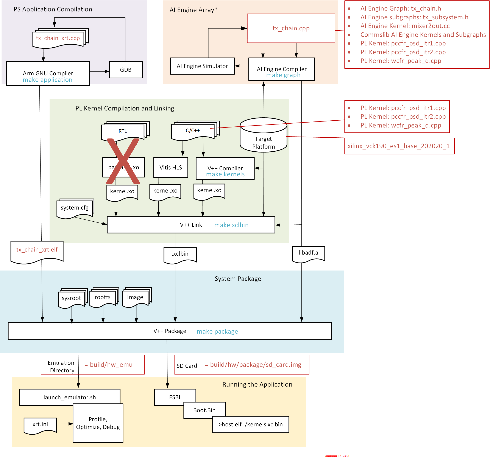

At the end of this section, you will generate a new directory (called `build/`) that contains the `Work/`, `hw_emu/`, and `hw/` subfolders. The `Work/` subfolder is an output from the AI Engine compiler. The `hw_emu/` subfolder contains the build for hardware emulation. The `hw/` subfolder contains the build for hardware run on a VCK190 board.   

The steps to build the TX Chain AI Engine design are summarized below:

#### 1. Compiling an AI Engine Graph Application 

One of the first steps is to create and compile the AI Engine graph using the AI Engine compiler (`aiecompiler`). The TX chain design has been provided for you in the `design` folder. The AI Engine compiler (during the `make graph` step) compiles the `tx_chain_200MHz` graph, and builds the TX Chain AI Engine application. You can review [Compiling an AI Engine Graph Application Section in AI Engine Documentation](https://www.xilinx.com/html_docs/xilinx2021_1/vitis_doc/compile_graph_application.html#rsb1512607764188) for general details on how to use the AI Engine compiler. The `tx_chain_200MHz` graph is composed of nine AI Engine subgraphs which are further composed of a total of 22 AI Engine kernels. The following is a description of each AI Engine subgraph and the AI Engine kernels it uses. A more detailed description of each AI engine kernel is provided later on in the [Software Design Details](#software-design-details). 

The `interp_chain` is a user-defined AI Engine subgraph (defined in `tx_subsystem.h`) used to limit the signal to the frequency of interest and remove unwanted signals and prevent blocking signals. It uses the `fir_63t_sym` and `fir_23t_sym_hb_2i` CommsLib AI Engine kernels.

The `mixer_subsystem` is a user-defined AI Engine subgraph (defined in `tx_subsystem.h`) used to combine the signals from the `interp_chain` subgraphs. It uses the `mixer_2out` user-defined AI Engine kernel. 

The `pc_cfr_chain_itr_win` is a CommsLib AI Engine subgraph used for PC-CFR to limit the dynamic range of signals being transmitted. It uses the `pccfr_sma_itr_win` Commslib AI Engine subgraph which contains two instances of the `pccfr_scaleadd_itr_window`, `fir_23t_sym_hb_2i`,  and `window_copy_1in_2out` CommsLib AI Engine kernels.

The `wcfr_graph` is a CommsLib AI Engine subgraph used to remove the peak above threshold after detection by PC-CFR. It uses the `wcfr_int_mag` CommsLib AI Engine subgraph which contains the `fir_23t_sym_hb_2i`, `fir_11t_sym_hb_2i`, and `wcfr_mag_pack` CommsLib AI Engine kernels. It also uses the `wcfr_filt_sub` CommsLib AI Engine subgraph which contains the `fir_96t_real_sym`  and `wcfr_correction` CommsLib AI Engine kernels.  

The `dpd_upsampler_8by5_up2` is a user-defined AI Engine subgraph (`tx_subsystem.h`) used to change the signal after CFR to the DPD sampling frequency. It uses the  `fir_11t_sym_hb_2i`, `fir_95t_sym_8i_5d`, and `gain_magsqr` CommsLib AI Engine kernels.  
The `DPD_LUT_FILT_1G_32T` is a CommsLib AI Engine subgraph used to maintain average signal-to-noise ratio by subtracting the distortion component in the outbound signal. It uses the `dpd_1g_core0`, `dpd_1g_core1`, `dpd_1g_core2`, `dpd_1g_core3`, and `cl2_kernel` CommsLib AI Engine kernels. 

#### 2. Compiling the PL Kernels
The Vitis compiler (during the `make kernels` step) compiles five PL kernels for implementation in the PL region of the target platform (`xilinx_vck190_base_202110_1`). These C++ kernels are compiled into `*.xo` object (XO) files. The following is a description of each HLS PL kernel.

+ `mm2s` data mover kernel is a memory map to stream kernel to feed data from the DDR memory through the NoC to the AI Engine through the PL DMA
+ `pccfr_pl_pds_itr1` CFR kernel performs peak detection, scale factor compute, CP address and offset generation
+ `pccfr_pl_pds_itr2` CFR kernel conducts a second iteration of peak detection, scale factor compute, CP address and offset generation
+ `wcfr_peak_d` CFR kernel performs peak detection and scale factor compute for the WCFR function
+ `s2mm` data mover kernel is a stream to memory map kernel to feed data from the AI Engine through the NoC to DDR memory through the PL DMA

#### 3. Linking the System
The Vitis compiler link step (during `make xclbin`) combines the compiled AI Engine graph (`build/libadf.a`) with the C++ PL kernels onto the target platform. This process creates an XCLBIN file to load and run an AI Engine graph and PL kernel code on the target platform. 

#### 4. Compile the Embedded Application for the Cortex-A72 Processor
The TX Chain design uses a host program running the A72 processor to interact with the AI Engine kernels. The Arm® GNU compiler (during the `make application` step) compiles an embedded PS host application to run on the Cortex-A72 core processor. This step uses the GNU Arm cross-compiler to create an ELF file. The host program interacts with the AI Engine kernels and data mover PL kernels.

#### 5. Packaging the system
The Vitis compiler package step (during `make package`) gathers the required files to configure and boot the system, to load and run the application (including the AI Engine graph and PL kernels). If your target is hardware emulation, this step creates the necessary package as the `build/hw_emu/package` folder. If your target is to run your application on hardware, this step creates the necessary package as the `build/hw/package` folder. 

# Make Steps 
To run the following `make` steps (for example, `make kernels`, `make graph`, etc), you must be in the `Makefiles/` folder.
```bash
cd Makefiles
```
<details>
  <summary>Build the Entire TX Chain Design with a Single Command</summary>
	
## Build the Entire TX Chain Design with a Single Command
If you are an advanced user and are already familier with the AI Engine and Vitis kernel compilation flows, you can build the entire TX Chain design with one command: 

```bash
make build TARGET=hw_emu 
```
or 
```bash
make build TARGET=hw
```

This command runs `make kernels`, `make graph`, `make xclbin`, `make application`, and `make package` for hardware emulation or hardware (VCK190 board), depending on the `TARGET` you specify.

You can also run the following command to build the entire TX Chain tutorial *and* launch hardware emulation: 
```bash
make run TARGET=hw_emu
```
</details>

<details>
  <summary>make kernels: Compile PL Kernels</summary>

## make kernels: Compile PL Kernels
The first step is to take any Vitis compiler kernels (RTL or HLS C) and your AI Engine kernels and graph and compile them into their respective `.xo` and `.o` files. You can compile the kernels and graph in parallel because they do not rely on each other at this step.

This design also contains three HLS PL kernels that work closely with the AI Engine subgraphs and are essential to the dataflow. They are written in HLS-compliant C++. 
+ `pccfr_pl_pds_itr1` HLS PL kernel 
+ `pccfr_pl_pds_itr2` HLS PL kernel 
+ `wcfr_peak_d` HLS PL kernel

This design contains two DMA HLS PL kernels (data movers) that move data between the DDR memory and the AI Engine. They are written in HLS-compliant C++. 
+ `mm2s` HLS PL kernel 
+ `s2mm` HLS PL kernel

To compile the five HLS PL kernels, use the Vitis compiler command which takes in an HLS kernel source and produces a `.xo` file. 

To compile the kernels, use the following command: 

```
make kernels
```
or 
```
make kernels TARGET=hw_emu 
```
or 
```
mkdir -p ./build/hw_emu; 					\
cd ./build/hw_emu; 						

v++         --target hw_emu					\
            --platform xilinx_vck190_base_202110_1		\
            --save-temps					\
            --temp_dir _x					\
            --verbose						\
            --config pccfr_pds_itr1.cfg				\
            -c ../../design/kernel_src/pccfr_pds_itr1.cpp	\
	    -k pccfr_pl_pds_itr1 				\
            -o pccfr_pl_pds_itr1.xo		
            
v++         --target hw_emu					\
            --platform xilinx_vck190_base_202110_1		\
            --save-temps					\
            --temp_dir _x					\
            --verbose						\
            --config pccfr_pds_itr2.cfg				\
            -c ../../design/kernel_src/pccfr_pds_itr2.cpp	\
	    -k pccfr_pl_pds_itr2				\
            -o pccfr_pl_pds_itr2.xo		
            
v++         --target hw_emu					\
            --platform xilinx_vck190_base_202110_1		\
            --save-temps					\
            --temp_dir _x					\
            --verbose						\
            --config wcfr_pd.cfg				\
            -c ../../design/kernel_src/wcfr_pd.cpp		\
	    -k wcfr_peak_d 					\
            -o wcfr_pd.xo			

v++         --target hw_emu					\
            --platform xilinx_vck190_base_202110_1		\
            --save-temps					\
            --temp_dir _x					\
            --verbose						\
            -c ../../design/kernel_src/s2mm.cpp			\
	    -k s2mm						\
            -o s2mm.xo			
            
v++         --target hw_emu					\
            --platform xilinx_vck190_base_202110_1		\
            --save-temps					\
            --temp_dir _x					\
            --verbose						\
            -c ../../design/kernel_src/mm2s.cpp			\
            -k mm2s						\
	    -o mm2s.xo		
cd ../		            
```
|Switch|Description|
|  ---  |  ---  |
|--target \| -t [hw\|hw_emu]|Specifies the build target.|
|--platform \| -f|Specifies the name of a supported acceleration platform as specified by the $PLATFORM_REPO_PATHS environment variable or the full path to the platform XPFM file.|
|--save-temps \| -s|Directs the Vitis compiler command to save intermediate files/directories created during the compilation and link process. Use the ```--temp_dir``` option to specify a location to write the intermediate files to.|
|--temp_dir <string>|This allows you to manage the location where the tool writes temporary files created during the build process. The temporary results are written by the Vitis compiler and then removed, unless the `--save-temps` option is also specified.|
|--verbose|Display verbose/debug information.|
|--config <config_file>|Specifies a configuration file containing Vitis compiler switches.|
|--compile \| -c|Required for compilation to generate `.xo` files from kernel source files.|
|--output \| -o|Specifies the name of the output file generated by the Vitis compiler command. The DMA HLS kernels output should be `.xo`.|
|--kernel \<arg\>\|-k \<arg\>|Compile only the specified kernel from the input file. Only one -k option is allowed per Vitis compiler command.|

The options listed in the `pccfr_pl_pds_itr1.cfg`, `pccfr_pl_pds_itr2.cfg`, and `wcfr_peak_d.cfg` files are described as follows. 

|Switch|Description|
|  ---  |  ---  |
|--hls.clock <arg\>|Specifies a frequency in Hz at which the listed kernel(s) should be compiled by Vitis HLS. Where \<arg\> is specified as: <frequency_in_Hz>:<cu_name1>,<cu_name2>,..,<cu_nameN>.|
|--advanced.prop solution.hls_pre_tcl|Specifies the path to a Vitis HLS Tcl file, which is executed before the C code is synthesized. This allows the Vitis HLS configuration settings to be applied prior to synthesis.|

|Input|Description|
|  ---  |  ---  |
|design/kernel_src/pccfr_pds_itr1.cpp|Defines the `pccfr_pds_itr1` PL kernel.|
|design/kernel_src/pccfr_pds_itr1.cpp|Defines the `pccfr_pds_itr2` PL kernel.|
|design/kernel_src/wcfr_peak_d.cpp|Defines the `wcfr_peak_d` PL kernel.|
|design/kernel_src/mm2s.cpp|Defines the `mm2s` PL data mover kernel.|
|design/kernel_src/s2mm.cpp|Defines the `s2mm` PL data mover kernel.|
|design/pccfr_pds_itr1.cfg|The configuration file with additional options to compile the `pccfr_pds_itr1` kernel.|
|design/pccfr_pds_itr2.cfg|The configuration file with additional options to compile the `pccfr_pds_itr2` kernel.|
|design/wcfr_peak_d.cfg|The configuration file with additional options to compile the `wcfr_peak_d kernel`.|
|design/directives/pccfr_pds_itr12.tcl|The Tcl file that contains additional Vivado® commands to optimize the `pccfr_pds_itr1/2` kernels.|
|design/directives/wcfr_pl.tcl|The Tcl file that contains additional Vivado commands to optimize the `wcfr_pl` kernel.|

|Output|Description|
|  ---  |  ---  |
|build/hw_emu/pccfr_pds_itr1.xo|The `pccfr_pds_itr1` kernel object file.|
|build/hw_emu/pccfr_pds_itr2.xo|The `pccfr_pds_itr2` kernel object file.|
|build/hw_emu/wcfr_peak_d.xo|The `wcfr_peak_d` kernel object file.|
|build/hw_emu/mm2s.xo|The `mm2s` kernel object file.|
|build/hw_emu/s2mm.xo|The `s2mm` kernel object file.|
|build/hw_emu/pccfr_pds_itr1.compile_summary|The `pccfr_pds_itr1` compile_summary.|
|build/hw_emu/pccfr_pds_itr2.compile_summary|The `pccfr_pds_itr2` compile_summary.|
|build/hw_emu/wcfr_peak_d.compile_summary|The `wcfr_peak_d` compile_summary.|
|build/hw_emu/mm2s.compile_summary|The `mm2s` compile_summary.|
|build/hw_emu/s2mm.compile_summary|The `s2mm` compile_summary.|
|build/hw_emu/v++\_pccfr_pds_itr1.log|The `pccfr_pds_itr1` v++ kernel compilation log.|
|build/hw_emu/v++\_pccfr_pds_itr2.log|The `pccfr_pds_itr2` v++ kernel compilation log.|
|build/hw_emu/v++\_wcfr_peak_d.log|The `wcfr_peak_d` v++ kernel compilation log.|
|build/hw_emu/v++\_mm2s.log|The `mm2s` v++ kernel compilation log.|
|build/hw_emu/v++\_s2mm.log|The `s2mm` v++ kernel compilation log.|
|build/hw_emu/\_x/||

To view the compilation log of each kernel: 
```
build/hw_emu/<kernel_name>.log
```
</details>

<details>
  <summary>make graph: Creating the AI Engine ADF Graph for the Vitis Compiler Flow</summary> 

## make graph: Creating the AI Engine ADF Graph for the Vitis Compiler Flow
An ADF graph can be connected to an extensible Vitis platform (the graph I/Os can be connected either to platform ports or to ports on Vitis kernels through the Vitis compiler connectivity directives). 
* The AI Engine ADF C++ graph of this TX Chain design contains AI Engine subgraphs (which contain AI Engine kernels) and CFR PL kernels. 
* All interconnects between kernels are defined in the C++ graph (`tx_chain.h` and `tx_chain_subsystem.h`).
* All interconnections to external I/O are fully specified in the C++ simulation testbench (`tx_chain.cpp`) that instantiates the C++ ADF graph object. All `adf::sim` platform connections from the graph to the PLIO map onto ports on the AI Engine subsystem graph that are connected using the Vitis compiler connectivity directives. No dangling ports or implicit connections are allowed by the Vitis compiler. 

Review the `tx_chain.h` and `tx_subsystem.h` to better understand the graph connections. Notice that in the `tx_chain_200MHz` graph definition, the `mm2s` and `s2mm` PL data mover kernels are not instantiated while the PL CFR kernels (`pccfr_pds_itr1`, `pccfr_pds_itr2`, and `wcfr_peak_d`) are. This is because the PL data mover kernels are not required for the `aiesimulator`, and only the ports to these data mover PL kernels are described in this graph. Review the AI Engine application `tx_chain.cpp` file and you will see the PLIOs that hook up to the data mover kernels during the Vitis linking step (`make xclbin`).  

To compile the graph using the Makefile flow type:
```
make graph
```
The following AI Engine compiler command compiles the AI Engine design graph.
```
cd ./build;  

aiecompiler --include=./design/aie_src/commslib/common/inc	\
            --include=./design/aie_src/commslib/common/src	\
            --include=./design/aie_src/commslib/filters/src	\      
            --include=./design/aie_src/commslib/filters/inc	\
            --include=./design/aie_src/commslib/radio/src	\
            --include=./design/aie_src/commslib/radio/inc	\
            --include=./design/aie_src/local/inc		\
            --include=./design/aie_src/local/src		\
            --include=./design/aie_src/common/inc		\
            --include=./design/aie_src/common/src		\
            --include=./design/aie_src/dsplib/L2/include/hw     \
	    --include=./design/aie_src/dsplib/L1/src/hw         \
	    --include=./design/aie_src/dsplib/L1/tests/inc      \
	    --include=./design/aie_src/dsplib/L1/include/hw     \
            -v                                          		\
            --Xchess=main:llvm.xargs=-Wno-shift-negative-value 		\
            --Xchess="gain_magsqr:cpp.define=USER_PARAMS"      		\
            --Xpreproc=-DDOPWRSQRT                             		\
            --Xpreproc=-DABSCONSTRAINTS                        		\
            --Xmapper=BufferOptLevel7                          		\
            --genArchive                               			\
            --log-level=5                                      		\
            --write-unified-data=true                          		\
            --pl-axi-lite=false                                		\  
            --workdir=Work						\
            ./design/aie_src/tx_chain.cpp

cd ../../; 		            

```
|Switch|Description|
|  ---  |  ---  |
|--include=\<string\>|Specify compile time include directory (zero or more).|
|--verbose\|-v|Verbose output of the AI Engine compiler emits compiler messages at various stages of compilation. These debug and tracing logs provide useful messages regarding the compilation process.|
|--Xchess=\<string\>|Pass kernel specific options to the CHESS project as specified as `<kernel>:optionid>=value`. This option string is included during compilation of generated source files on the AI Engine where the specified kernel function is mapped.|
|--Xpreproc=\<string\>|Pass general option to the PREPROCESSOR phase of all source code compilations (AI Engine/PS/PL/x86sim). The option string is specified as `-D<var>=<value>`.|
|--Xmapper=\<string\>|Pass general options to the MAPPER phase of the compiler. These are options to try when your design is either failing to converge in the mapping or routing phase, or when you are trying to achive better performance using reduction in memory bank conflict, for example, (`-Xmapper=DisableFloorPlanning`).|
|--log-level=\<int\>|Log level for verbose logging (default=1).|
|--write-unified-data=true|Enable output of netlist and solution using unified data format.|
|--pl-register-threshold=\<number\>|Specifies the frequency (in MHz) threshold for registered AI Engine-PL crossings. The default frequency is one eighth of the AI Engine frequency, dependent on the device speed grade specific AI Engine frequency.|
|--pl-aix-lite=\<true\|false\>|This option specifies whether PL kernels in the ADF graph are wrapped with an AXI4-Lite interface for AI Engine simulation. The default it true. Set to false only if none of the PL kernels have run-time parameters (RTPs).|
|--workdir=\<string\>|By default, the compiler writes all outputs to a sub-directory of the current directory, called Work. Use this option to specify a different output directory.|
	
The following is a description of the input sources compiled by the AI Engine compiler command. 

|Inputs Sources|Description|
|  ---  |  ---  |
|aie_src/tx_chain.h|Defines the `tx_chain_200MHz` graph class.|
|aie_src/tx_chain.cpp|Instantiates a `tx_chain_200MHz` graph object, connects it to the platform, and initalizes and runs the dataflow graph.|

The following is a description of the output objects that results from executing the AI Engine compiler command with the previous inputs and options. 

|Output Objects|Description|
|  ---  |  ---  |
|build/libadf.a|Compiled AI Engine design graph.|
|build/Work/|Directory that contains all outputs of the AI Engine compiler.|

</details>

<details>
  <summary>make xclbin: Use the Vitis Compiler to link AI Engine and HLS Kernels with the Platform</summary>

## make xclbin: Use the Vitis Compiler to link AI Engine and HLS Kernels with the Platform
After the AI Engine kernels and graph and PL HLS kernels have been compiled, you can use the Vitis compiler to link them with the platform to generate both an XCLBIN and a new XSA file. 

## Platform
The Vitis compiler lets you integrate your AI Engine and HLS kernels into an existing extensible platform. From a software developer's perspective this is a nice automated step where the platform chosen will be provided by the hardware designer (or you can opt to use one of the many extensible base platforms provided by Xilinx) and the Vitis compiler builds the hardware design for you in addition to integrating the AI Engine and PL kernels in the design. 

To test this feature in this tutorial, it is required to use the base VCK190 platform to build the design. 

To generate the platform, type: 

```
make xclbin
``` 
or 
```
make xclbin TARGET=hw_emu
```
or 
```
cd ./build/hw_emu;

v++         -g						\ 
            -l						\ 
            --platform xilinx_vck190_base_202110_1 	\
            --save-temps				\
            --temp_dir _x				\
            --verbose					\
            --config system.cfg				\
            -t hw_emu					\
            s2mm.xo					\            
            mm2s.xo					\
            pccfr_kernel1.xo				\
            pccfr_kernel2.xo				\                   
            wcfr_kernel.xo				\                    
            ../libadf.a					\
            -o vck190_aie_tx_chain.xclbin

cd ../../; 		            

```
|Switch|Description|
|  ---  |  ---  |
|--debug \| -g|Generates code for debugging the kernel. Using this option adds features to facilitate debugging the kernel as it is compiled and the FPGA binary is built.|
|--link \| -l|This is a required option for the linking process, which follows compilation. The PL kernel source code was compiled into their respective XO files during the `make kernels` step. Run the Vitis compiler in link mode to link the XO input files and generate an XCLBIN output file.|
|--platform \| -f|Specifies the name of a supported acceleration platform as specified by the $PLATFORM_REPO_PATHS environment variable or the full path to the platform XPFM file.|
|--save-temps \| -s|Directs the the Vitis compiler command to save intermediate files/directories created during the compilation and link process. Use the `--temp_dir` option to specify a location to write the intermediate files to.|
|--temp_dir <string>|This allows you to manage the location where the tool writes temporary files created during the build process. The temporary results are written by the Vitis compiler, and then removed, unless the `--save-temps` option is also specified.|
|--verbose|Display verbose/debug information.|
|--config <config_file>|Specifies a configuration file containing the Vitis compiler switches.|
|--target \| -t [hw\|hw_emu]|Specifies the build target.|
|--output \| -o|Specifies the name of the output file generated by the Vitis compiler command. The DMA HLS kernels output should be `.xo` files. The PL HLS kernels interfacing with the AI Engine should be `.o` files.|

You have a number of kernels at your disposal but you need to tell the linker the way you want to connect them all together from the AI Engine array to the PL and vice versa. These connections are described in a configuration file `system.cfg`. This file has a number of lines that describes the overall connection scheme of the system. 

```
[connectivity]
nk=mm2s:2:mm2s_0.mm2s_1
nk=s2mm:1:s2mm_0

stream_connect=mm2s_0.s:ai_engine_0.lte_0
stream_connect=mm2s_1.s:ai_engine_0.lte_1
stream_connect=ai_engine_0.dpd_out0:s2mm_0.s

[advanced]
param=hw_emu.enableProfiling=false
param=compiler.addOutputTypes=hw_export
param=compiler.skipTimingCheckAndFrequencyScaling=true

[clock]
freqHz=250000000:s2mm_0
freqHz=153600000:mm2s_0
freqHz=153600000:mm2s_1
defaultTolerance=0.001

```

|Switch|Comment|
|  ---  |  ---  |
|--connectivity.nk|Number of kernels. `mm2s:2:mm2s_0.mm2s_1` means that the Vitis compiler should instantiate two mm2s kernels and name those instances 'mm2s_0' and 'mm2s_1'.|
|--connectivity.stream_connect|How the kernels connect to IPs, platforms, or other kernels. The output of the AI Engine compiler tells you the interfaces that need to be connected. `mm2s_0.s:ai_engine_0.lte_0` means that the Vitis compiler should connect the port 's' of 'mm2s' to the port 'lte_0' of AI Engine port 0. The name of the AI Engine port has been defined in the `tx_chain.cpp` PLIO instantiation.|
|--advanced.param=hw_emu.enableProfiling=false|???|
|param=compiler.addOutputTypes=hw_export| This option tells the Vitis compiler that besides creating an XCLBIN, it also outputs an XSA file which is needed to create a post-Vivado fixed platform for Vitis software development.|
|param=compiler.skipTimingCheckAndFrequencyScaling=true||
|--clock.freqHz \<arg\>|Specifies a clock frequency in Hz and assigns it to a list of associated compute units (CUs) and optionally specifies clock pins on the CU.|
|--clock.defaultTolerance \<arg\>|Specifies a default clock tolerance as a value, or as a percentage of the default clock frequency.|

Notice the `pccfr_1`, `pccfr_2`, and `wcfr` kernels are not specified in `system.cfg`. This is because the generated graph (`libadf.a`) contains the PL kernel information and knows how to connect it to the AI Engine. 

Note that the Vitis compiler called Vivado IP Integrator under the hood to build the design. The platform and kernels are input to the Vivado Design Suite, which produces a simulation XSA or an XSA after running place and route on the design. The point at which the XSA is produced from Vivado is dependent on what `-target` option is set on the the Vitis compiler command line. 

Note that you can now view the Vivado project, which is located in the `build/[hw_emu|hw]/_x/link/vivado/vpl/prj/` directory.

Now you have generated the XCLBIN file that will be used to execute your design on the platform. 
</details>

<details>
  <summary>make application: Compile the A72 Host Application</summary>

## make application: Compile the A72 Host Application
You can compile your host application by following the typical cross-compilation flow for the Cortex-A72. 
To build the application you can run the following command:
```
make application
```
or
```
aarch64-linux-gnu-g++ 	-O						\
			-c						\
			-std=c++14					\
			 -D__PS_ENABLE_AIE__				\
			-D__linux__                         		\
			-DXAIE_DEBUG					\
 			-I ./design/local/inc/ 			\
			-I ./design/aie_src/commslib/common/inc	\
                        -I ./design/aie_src/commslib/common/src	\
			-I ./design/aie_src/commslib/filters/inc	\
                        -I ./design/aie_src/commslib/filters/src	\
			-I ./design/aie_src/commslib/radio/inc		\
                        -I ./design/aie_src/commslib/radio/src		\
			-I ./design/aie_src/local/inc                	\
                        -I ./design/aie_src/local/src                	\
                        -I ./design/aie_src/dsplib/L2/include/hw        \
	                -I ./design/aie_src/dsplib/L1/src/hw            \
	                -I ./design/aie_src/dsplib/L1/tests/inc         \
	                -I ./design/aie_src/dsplib/L1/include/hw        \			
			-I$(XILINX_VITIS_AIETOOLS)/include/ 		\
			--sysroot=$(PLATFORM_REPO_PATHS)/sw/versal/xilinx-versal-common-v2020.2/sysroots/aarch64-xilinx-linux \
			-I$(PLATFORM_REPO_PATHS)/sw/versal/xilinx-versal-common-v2020.2/sysroots/aarch64-xilinx-linux/usr/include/xrt \
			-I$(PLATFORM_REPO_PATHS)/sw/versal/xilinx-versal-common-v2020.2/sysroots/aarch64-xilinx-linux/usr/include\
			-I$(PLATFORM_REPO_PATHS)/sw/versal/xilinx-versal-common-v2020.2/sysroots/aarch64-xilinx-linux/usr/lib\
			./build/Work/ps/c_rts/aie_control_xrt.cpp 	\
			-o ./build/aie_control_xrt.o

aarch64-linux-gnu-g++ 	-O						\
			-c						\
			-std=c++14					\
			 -D__PS_ENABLE_AIE__				\
			-D__linux__                         		\
			-DXAIE_DEBUG					\
 			-I ./design/local/inc/ 			\
			-I ./design/aie_src/commslib/common/inc	\
                        -I ./design/aie_src/commslib/common/src	\
			-I ./design/aie_src/commslib/filters/inc	\
                        -I ./design/aie_src/commslib/filters/src	\
			-I ./design/aie_src/commslib/radio/inc		\
                        -I ./design/aie_src/commslib/radio/src		\
			-I ./design/aie_src/local/inc                	\
                        -I ./design/aie_src/local/src                	\
                        -I ./design/aie_src/dsplib/L2/include/hw        \
	                -I ./design/aie_src/dsplib/L1/src/hw            \
	                -I ./design/aie_src/dsplib/L1/tests/inc         \
	                -I ./design/aie_src/dsplib/L1/include/hw        \			
			-I$(XILINX_VITIS_AIETOOLS)/include/ 		\
			--sysroot=$(PLATFORM_REPO_PATHS)/sw/versal/xilinx-versal-common-v2020.2/sysroots/aarch64-xilinx-linux \
			-I$(PLATFORM_REPO_PATHS)/sw/versal/xilinx-versal-common-v2020.2/sysroots/aarch64-xilinx-linux/usr/include/xrt \
			-I$(PLATFORM_REPO_PATHS)/sw/versal/xilinx-versal-common-v2020.2/sysroots/aarch64-xilinx-linux/usr/include\
			-I$(PLATFORM_REPO_PATHS)/sw/versal/xilinx-versal-common-v2020.2/sysroots/aarch64-xilinx-linux/usr/lib\
			./design/aie_src/tx_chain_app.cpp		\
			-o ./build/tx_chain_app.o

aarch64-linux-gnu-g++ 	./build/aie_control_xrt.o			\ 
			./build/tx_chain_app.o				\
			--sysroot=$(PLATFORM_REPO_PATHS)/sw/versal/xilinx-versal-common-v2020.2/sysroots/aarch64-xilinx-linux\
			-L$(PLATFORM_REPO_PATHS)/sw/versal/xilinx-versal-common-v2020.2/sysroots/aarch64-xilinx-linux/usr/lib\  
			-L$(XILINX_VITIS_AIETOOLS)/lib/aarch64.o	\ 
			-L$(XILINX_VITIS_AIETOOLS)/lib/lnx64.o		\ 	
			-ladf_api_xrt					\ 
			-lxrt_coreutil					\ 
			-std=c++14					\					 
			-o ./build/tx_chain_xrt.elf
```
|Switch|Description|
|  ---  |  ---  |
|-O \| Optimize| Optimizing compilation takes more time, and a lot of memory for a large function. With `-O`, the compiler tries to reduce code size and execution time, without performing any optimizations that take a great deal of compilation time.|
|-D__linux__||
|-D__PS_ENABLE_AIE__|This flag indicates that the host application enables the AI Engine at execution.|
|-DXAIE_DEBUG|Enable debug interface capabilities where certain core status, event status, or stack trace can be dumped out.|
|-I \<dir\>|Add the directory `dir` to the list of directories to be searched for header files.|
|-o \<file\>|Place output in file \<file\>. This applies regardless of whatever sort of output is being produced, whether it is an executable file, an object file, an assembler file, or preprocessed C code.|
|--sysroot=\<dir\>|Use \<dir\> as the logical root directory for headers and libraries. For example, if the compiler normally searches for headers in `/usr/include` and libraries in `/usr/lib`, it will instead search `dir/usr/include` and `dir/usr/lib`.|
|-l\<library\>|Search the library named \<library\> when linking. The TX Chain tutorial requires `adf_api`, `xrt_coreutil`, `xrt_core`, `aiengine`, `metal`, `open_amp` libraries.|
|-L \<dir\>|Add directory <dir> to the list of directories to be searched for -l.|

The following is a description of the input sources compiled by the AI Engine compiler command. 

|Inputs Sources|Description|
|  ---  |  ---  |
|aie_src/tx_chain_app.cpp|Source application file for the `tx_chain.elf` that will run on an A72 processor.|
|build/Work/ps/\_crts_aie_control.cpp|This is the AI Engine control code generated implementing the `tx_chain0.init()`, `tx_chain0.run()`, and `tx_chain0.end()` graph APIs for the TX Chain graph.|

The following is a description of the output objects that results from executing the AI Engine compiler command with the preceding inputs and options. 

|Output Objects|Description|
|  ---  |  ---  |
|build/tx_chain_xrt.elf|The executable that will run on an A72 processor.|
</details>

<details>
  <summary>make package: Package the Design</summary>

## make package: Package the Design
With all the AI Engine outputs created as well as the new platform, you can now generate the Programmable Device Image (PDI) and a package to be used on an SD card. The PDI contains all executables, bitstreams, and configurations of every element of the device and the packaged SD card directory contains everything to boot Linux, and contains your generated applications and the XCLBIN file.

To package the design, run the following command: 
```
make package
``` 
or 
```
make package TARGET=hw_emu
```
or 
```
v++	-p  							\
 	-t hw_emu						\
	--save-temps						\
	--temp_dir ./build/hw_emu/_x				\
	-f xilinx_vck190_base_202110_1				\
	--package.sd_dir $(PLATFORM_REPO_PATHS)/sw/versal/xrt 	\
	--package.rootfs $(PLATFORM_REPO_PATHS)/sw/versal/xilinx-versal-common-v2020.2/rootfs.ext4 \
	--package.kernel_image $(PLATFORM_REPO_PATHS)/sw/versal/xilinx-versal-common-v2020.2/Image \
	--package.boot_mode=sd					\
	--package.out_dir ./build/hw_emu/package		\
	--package.sd_dir ./design/aie_src/data			\
	--package.image_format=ext4				\
	--package.sd_file ./build/hw_emu/tx_chain_xrt.elf ./build/hw_emu/vck190_aie_tx_chain.xclbin ./build/libadf.a    
```

|Switch|Description|
|  ---  |  ---  |
|--package \| -p|Packages the final product at the end of the the Vitis compiler compile and link build process.|
|--target \| -t [hw\|hw_emu]|Specifies the build target.|
|--platform \| -f|Specifies the name of a supported acceleration platform as specified by the $PLATFORM_REPO_PATHS environment variable or the full path to the platform XPFM file.|
|--package.sd_dir \<arg\>|Where \<arg\> specifies a folder to package into the SD card `directory/image`.|
|--package.rootfs \<arg\>|Where \<arg\> specifies the absolute or relative path to a processed Linux root file system file. The platform RootFS file is available for download from xilinx.com. See the Vitis Software Platform Installation for more information.|
|--package.kernel_image \<arg\>|Where \<arg\> specifies the absolute or relative path to a Linux kernel image file. Overrides the existing image available in the platform. The platform image file is available for download from xilinx.com. See the Vitis unified software platform installation for more information.|
|--package.boot_mode \<arg\>|Where \<arg\> specifies `<ospi\|qspi\|sd>` boot mode used for running the application in emulation or on hardware.|
|--package.out_dir \<arg\>|Where \<arg\> specifies the absolute or relative path to the output directory of the `--package` command.|
|--package.image_format \<arg\>|Where \<arg\> specifies `<ext4\|fat32>` output image file format. ext4: Linux file system and fat32: Windows file system.|
|--package.sd_file \<arg\>|Where \<arg\> specifies an ELF or other data file to package into the SD card directory/image. This option can be used repeatedly to specify multiple files to add to the SD card.|

|Inputs Sources|Description|
|  ---  |  ---  |
|$(PLATFORM_REPO_PATHS)/sw/versal/xrt|The PS host application needs the XRT headers in this folder to execute.|
|$(PLATFORM_REPO_PATHS)/sw/versal/xilinx-versal-common-v2020.2/rootfs.ext4|The root filesystem file for Petalinux.|
|$(PLATFORM_REPO_PATHS)/sw/versal/xilinx-versal-common-v2020.2/Image|The pre-built Petalinux image the processor boots from.|
|design/aie_src/data|The data folder that contains the input data stored in DDR memory. It also contains the output golden refernece data the PS host application used to verify the DPD output data from the AI Engine.|
|build/hw_emu/tx_chain_xrt.elf|The PS host application executable created in the `make application` step.|
|build/hw_emu/vck190_aie_tx_chain.xclbin|The XCLBIN file created in the `make xclbin` step.|
|build/libadf.a|The compiled AI Engine design graph created in the `make graph` step.|

The output of the `v++ package` step is the package directory that contains the contents to run hardware emulation. 

|Output Objects|Description|
|  ---  |  ---  |
|build/hw_emu/package|The hardware emulation package that contains the boot file, hardware emulation launch script, the PLM and PMC boot files, the PMC and QEMU command arguement specification files, and the Vivado simulation folder.|

</details>

<details>
  <summary>make run_emu: Run Hardware Emulation</summary>

## make run_emu: Run Hardware Emulation
After packaging, everything is ready to run emulation on hardware. To run emulation use the following command: 
```
make run_emu
```
or
```
cd ./build/hw_emu/package
./launch_hw_emu.sh
```
When launched, you will see the QEMU simulator load. Wait for the autoboot countdown to go to zero, and after a few minutes, you will see the root Linux prompt: 
```bash
root@versal-rootfs-common-2021_1:~#
```

At the root prompt, run the following commands to run the design:  
```
cd /mnt/sd-mmcblk0p1
export XCL_EMULATION_MODE=hw_emu
export XILINX_XRT=/usr
./tx_chain_xrt.elf a.xclbin
```

The `tx_chain_xrt.elf` should execute, and after a few minutes, you should see the following output on the console:
``` 
A72-Info: Test Passed for DPD0
```

When this is shown, run the following keyboard command to exit the QEMU instance: 
```
#To exit QEMU Simulation
Press CtrlA, let go of the keyboard, and then press x 
```
</details>

<details>
  <summary>TARGET=hw: Run on Hardware</summary> 
	  
## TARGET=hw: Run on Hardware	  
To run your design on hardware, re-run the following steps with TARGET=hw

```
make kernels TARGET=hw
make xclbin TARGET=hw
make package TARGET=hw 
```
These commands create a `build/hw` folder with the kernels, `xclbin`, and `package/` for a hardware run. 

Now follow **Steps 1-9** to run the `tx_chain_xrt.elf` excutable on your VCK190 board. 

**Step 1.** Ensure your board is powered off. 

**Step 2.** Use an SD card writer (such as balenaEtcher) to flash the `sd_card.img` file an SD card. 

**Step 3.** Plug the flashed SD card into the top slot of the VCK190 board. 

**Step 4.** Set the switch SW1 Mode\[3:0\]=1110 = OFF OFF OFF ON

**Step 5.** Connect your computer to the VCK190 board using the included USB cable. 

**Step 6.** Open a TeraTerm terminal and select the correct COM port. Set the port settings to the following: 
```
Port: <COMMXX>
Speed: 115200
Data: 8 bit
Parity: none
Stop Bits: 1 bit
Flow control: none
Transmit delay: 0 msec/char 0 msec/line
```

**Step 7.** Power on the board.

**Step 8.** Wait until you see the `root@versal-rootfs-common-2021_1` Linux command prompt. Press enter a few times to get past any `xinit` errors. 

**Step 9.** Run the following commands into the TeraTerm terminal: 
```
cd /mnt/sd-mmcblk0p1
export XILINX_XRT=/usr
./tx_chain_xrt.elf a.xclbin
```

The `tx_chain_xrt.elf` should execute, and after a few minutes, you should see the following output on the terminal:
``` 
A72-Info: Test Passed for DPD0
```
</details>

# Hardware Design Details
## Block Diagram
The following figure shows a high level block diagram of the design. For a more detailed illustration of the design under test (DUT) unit, refer to "Transmit Chain (200 MHz) block diagram" in UG1274, available in the [Communication Library lounge](https://www.xilinx.com/member/versal_ai_engine_commslib_ea.html#documents).

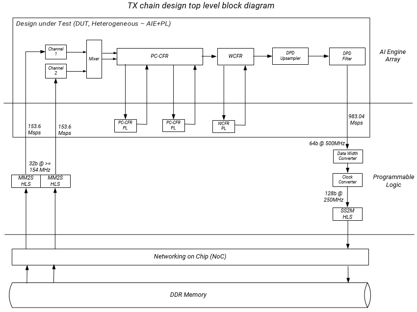

<details>
  <summary>Design Details</summary>
	
## Design Details
The design in this tutorial starts with a base platform containing the Control Interface and Processing System (CIPS), NoC, and AI Engine and the interfaces among them. The `v++` linker step builds on top of the base platform by adding the AI Engine graphs and PL kernels. To add the various functions in a system level design, PL kernels are added to the base platform depending on the application, that is, the PL kernels present in each design might vary. An ADF graph is connected to an extensible Vitis platform where the graph I/Os are connected either to the platform ports or to ports on Vitis kernels through the the Vitis compiler connectivity directives.
As indicated, the components are added by the linker "`v++ -l`" step (`make xclbin` in the tool flow section) and include the following:

* `libadf.a`
* `mm2s` and `ss2m` data mover kernels
* `ai_engine_system` block which includes the PC-CFR PL kernels, WCFR PL kernel, data width converter, and clock converter kernels
* Any other necessary connections and interfaces

To see a schematic view of the design with the extended platform (as shown in the following diagram), open `build/hw_emu/_x/link/vivado/vpl/prj/prj.xpr`.
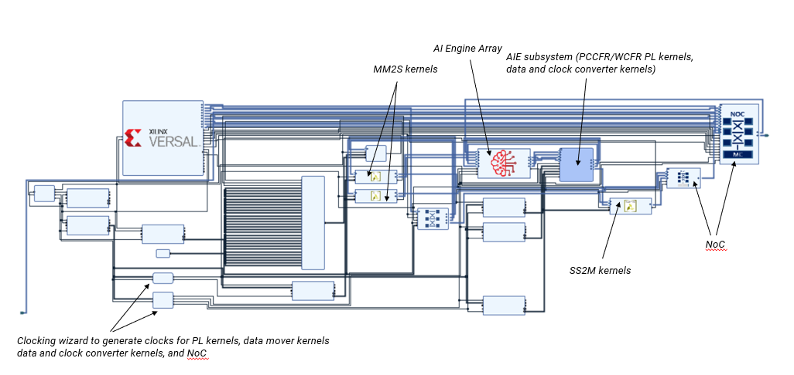

</details>

<details>
	<summary>TX Chain Graph Details</summary>
	
## TX Chain Graph Details
A description of the AI Engine and PL kernels used in the TX Chain design together with a top level diagram have been provided in the previous sections. The overall design consists of two input streams at 153.6 MSPS to channel filter and interpolating half band filter feeding into a mixer, through PC-CFR followed by WCFR, DPD pre-processing and the DPD subsystem. This section goes into more details about the CFR and DPD kernels in this design. 

Crest Factor Reduction (CFR) is a technique to reduce the PAPR (Peak to Average Power Ratio) of the transmitted signals that so the power amplifier can operate more efficiently. The algorithms in the TX Chain design use the Peak Cancellation CFR (PC-CFR) and Windows CFR (WCFR). The descriptions of the two functions are given as follows.

**PC-CFR**: The purpose of the PC-CFR is to reduce the PAPR of a signal by maintaining a balance between the out-of-band emission and in-band waveform quality of the signal. It first identifies the peaks that are above a threshold which is determined by the target PAPR and then applies a low-pass filter on the peaks to generate cancellation pulses. Multiple iterations are needed to achieve the target PAPR; in this design two iterations are implemented with each module kernel split between the AI Engine and the PL. The PL kernel receives two half band filter signals from the AI Engine and generates four streams (each at 307.2 MSPS) to feed to a peak detection unit which generates cancellation pulse (CP) LUT addresses and peak scaling factor values to send back to the AI Engine to generate the cancellation pulse. The reason for implementing the peak detect function in the PL rather than in the AI Engine is because it is mainly a compare function which is a better use of PL resources. The difference between the PL kernels in the two iterations lies in the peak detection windows which are set to 16 and 8 to detect different peaks. In the first pass, a wider window is selected to remove one window at a time. The second pass uses a reduced sized window to remove the missed peaks.

**WCFR**: After the peaks are removed, the signal can be amplified and operated at a better dynamic range. WCFR is implemented after the two iterations of PC-CFR to remove the over-threshold peaks present in the signal. The whole channel bandwidth is used to cancel the remaining peaks rather than the moving windows in PC-CFR. 

After the WCFR, the signals go through the DPD pre-processing subsystem which consists of interpolation filter stages to match the signal sampling rate with the DPD sampling rate of 983.04 MSPS. The two sub-kernels are defined together with a gain and magnitude unit as the kernel `dpd_upsampler_8by5_up2` and the connections inside the kernel is defined in the subgraph `aie_src/tx_subsystem.h`.

The Digital Predistortion (DPD) consists of the LUT-based non-linear filter and coefficient to LUT conversion. All the modules are implemented inside the AI Engine. The filter implementation uses four AI Engine tiles in the horizontal direction and partial data is sent from one to the remaining tiles using cascade streams while the neighboring tiles share data memory. The coefficient to LUT conversion is implemented to provide LUTs to two DPD filters, hence two instances of coefficients-to-LUT conversion is needed (tile 1 for DPD filters 0 and 1, and tile 1 for filters 2 and 3).

</details>

<details>
	<summary>Data Mover Kernel Details</summary>
	
## Data Mover Kernel Details
The PL-based data movers consist of MM2S and S2MM kernels. The MM2S move data from DDR memory through the NoC to the AI Engine array and the final DPD output from the AI Engine array is moved back to DDR memory through the NoC by the S2MM kernel. In either data mover kernel, the side facing NoC uses a memory mapped AXI4 interface (MM-AXI4) and the side facing the AI Engine array uses an AXI4-Stream interface.
Some additional details regarding the data mover kernels include:

**MM2S**
* The data width is 32 bits and the kernel runs at a 154 MHz clock.
* To avoid bandwidth limitation resulting in back pressure which causes performance degradation, the HLS pragma `max_read_burst_length` is set higher than the default to 256 bits.

**S2MM**
* The data width is 128 bits and the kernel runs at a 250 MHz clock.
* To avoid bandwidth limitation resulting in back pressure which causes performance degradation, the HLS pragma `max_write_burst_length` is set higher than the default to 256 bits.

</details>

<details>
	<summary>NoC and DDR Memory Interface Details</summary>
	
## NoC and DDR Memory Interface Details
In this design, the AXI4-Stream interconnect uses the NoC Slave Unit (NSU) in the horizontal NoC which is a direct connection to the NoC streaming interface in the AI Engine array interface, as shown in the following diagram. Also shown in this diagram, the data mover kernels use two of four available VNoC channels to transfer data between DDR memory and the AI Engine array through the NoC using the data mover kernels and additionally the data and clock converters at the S2MM side. In the design, the write and read bandwidths are set to the default in the AXI NoC IP (64 MB/s). If higher bandwidth is required (for example, to support more data mover kernels), you can change the setting in the AXI NoC IP QOS tab.

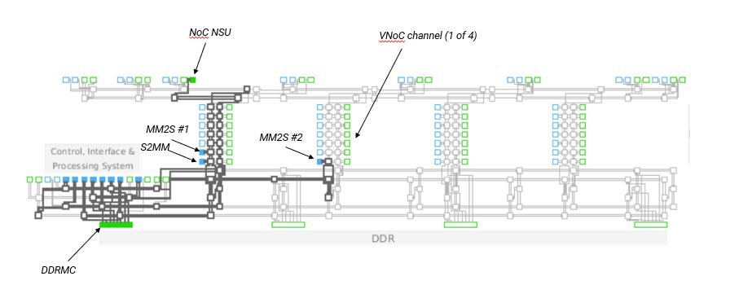


</details>

<details>
	<summary>Multi Domain Clock Implementation</summary>
	
## Multi Domain Clock Implementation
In the TX Chain design, the various PL kernels run at different clock frequencies to meet the sampling frequency requirement. The multi-clock domains require specification of the clock frequency which needs instantiations of different clocking wizard primitives. The specification of the kernel frequency requirement can be found in `aie_src/Makefile` and `hw/Makefile`. 

In the AI Engine application, the PLIOs specify a PL frequency of 500 MHz so that the AI Engine compiler can compile the PL kernels, and clock sources can be generated to run simulation. Note that Boundary Layer Interface (BLI) registers are automatically instantiated when the PL frequency in the AI Engine application is greater than 125 MHz (one eighth of the AI Engine frequency of 1 GHz) and are inserted between the AI Engine and PL to prevent data loss.

The frequency requirements for implementing the design are also specified in the Makefile. The requirements instruct the Vivado design tools to instantiate a clocking wizard to generate the required frequencies. For the PC-CFR and WCFR PL kernels, the `--hls.clock` option can be used in the Vitis compiler when compiling HLS C/C++ into Xilinx object (XO) files. The option `--clock.freqHz` specifies a clock frequency and assigns it to the specified kernels and their clock pins. In addition, this design also specifies the option `-clock.defaultTolerance` which defines the uncertainty of the clock frequency. This is done to help the clocking wizard to generate a clock frequency within a certain tolerance.

</details>

# Software Design Details
The software in the TX Chain tutorial is made up of five parts:

<details>
  <summary>AI Engine Kernels</summary>

## AI Engine Kernels	
An AI Engine kernel is a C/C++ program written to target the AI Engine processor. Kernels that use specialized intrinsic calls use the VLIW vector processor. The AI Engine compiler compiles the kernel code to produce an executable ELF file for each of the AI Engines being used in the design. Review [AI Engine Kernel Programming Section in the AI Engine Documentation](https://www.xilinx.com/html_docs/xilinx2021_1/vitis_doc/ciz1611769309578.html) for a high-level overview of kernel programming. These kernels can be stitched together to function as AI Engine graphs written in C++. Multiple subgraphs can be stitched together into a high-level AI Engine graph. 

The TX Chain tutorial uses the CommsLib library for most of the kernel source code. The exception is the `mixer_2out.cc` kernel developed specifically for the TX Chain tutorial. These kernels are organized into larger systems described by the `interp_chain`, `mixer_subsystem`, `pc_cfr_chain_itr_win`, `wcfr_graph`, `dpd_upsampler_8by5_up2`, and `DPD_LUT_FILT_1G_32T` subgraphs. This section gives a summary of each AI Engine kernel and subgraph used in this design. These subgraphs work with three PL kernels (`pccfr_pl1`, `pccfr_pl2`, and `wcfr_pl`) and are stitched together into the high-level `tx_chain_200MHz` graph. 

The AI Engine compiler writes a summary of compilation results called `tx_chain.aiecompile_summary`. You can view the graph by running the following command:
```bash
vitis_analyzer build/Work/tx_chain.aiecompile_summary
```
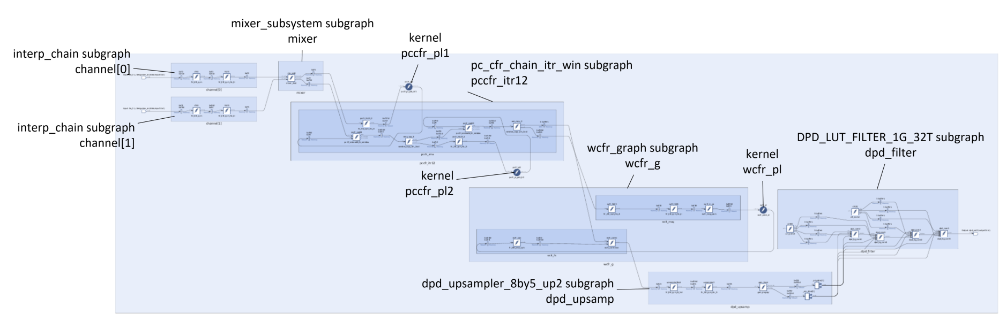

### interp_chain
The TX Chain design has two instances of the `interp_chain` subgraph called `channel[0]` and `channel[1]`. During simulation, each `interp_chain` subgraph reads in data from `input0.txt` and `input1.txt` files stored in `design/aie_src/data/` folder. Each `interp_chain` subgraph consists of `cf63` and `hb23` kernels. The data streams into the `interp_chain` subgraphs and is stored in the data memory of the AI Engines that are executing the `cf63` kernels. This data is processed by the `cf63` kernels and then stored into the data memories of the `hb23` kernels. The data is processed by the `hb23` kernels and then stored in data memory of the `mix_add` kernel.   

Location: `aie_src/tx_subsystem.h`

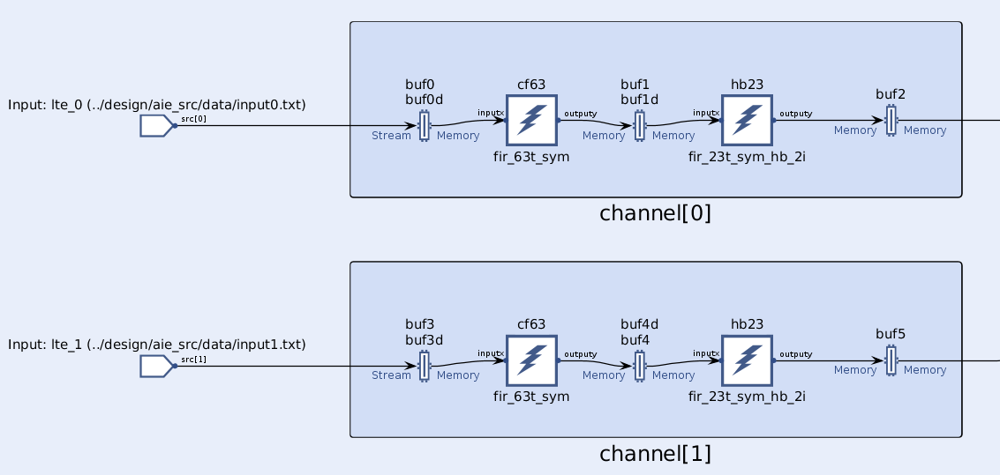

#### cf63
The `cf63` kernel is a `fir_63t_sym` CommsLib kernel which is an implementation of a symmetric real filter with 63 taps.

Location: `$(COMMSLIB_ROOT)/filters/src/fir_63t_sym.cc`

#### hb23
The `hb23` kernel is a `fir_23t_sym_hb_2i` CommsLib kernel which is an implementation of a half-band up-sampler. 

Location: `$(COMMSLIB_ROOT)/filters/src/fir_23t_sym_hb_2i.cc`

### mixer_subsystem
The TX Chain design has one instance of the `mixer_subsystem` subgraph which consists of a `mix_add` kernel. The data from `channel[0]` and `channel[1]` is processed by the `mix_add` kernel and stored into the data memories of the `pccfr_itr12.pccfr_sma.pccfr_hb23_2` and `pccfr_itr12.pccfr_sma.pccfr_sadd1` kernels.   

Location: `aie_src/tx_subsystem.h`

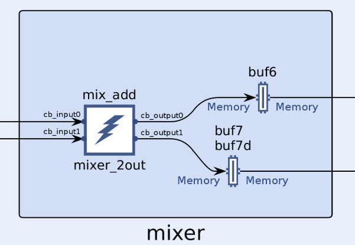

#### mix_add
The `mix_add` kernel is a `mixer_2out` user defined kernel made specially for the TX Chain tutorial. 

Location: `aie_src/local/src/mixer_2out.cc`

### pc_cfr_chain_itr_win
The `pc_cfr_chain_itr_win` subgraph is a CommsLib subgraph which consists of the `pccfr_sma_itr_win` subgraph. It is a top-level PC-CFR subgraph with 1x sampling rate. The `pccfr_sma_itr_win` subgraph consists of the `pccfr_sadd1`, `pccfr_sadd2`, `pccfr_hb23_1`, `pccfr_hb23_2`, `win_copy_1`, `win_copy_2` kernels. 

* Data from the mixer is processed by the `pccfr_hb23_2` and `pccfr_sadd1` kernels.
* The `pccfr_hb23_2` kernel streams its results to the PL (`pccfr_pl1`) kernel. 
* The `pccfr_pl1` kernel processes the data and streams it back to the AI Engine into the `pccfr_sadd1` kernel. 
* The `pccfr_sadd1` kernel takes the data from the mixer and the `pccfr_pl1` kernel, processes it, and sends its results to the `win_copy_1` kernel. 
* The `win_copy_1` kernel processes the data and sends it to the `pccfr_sadd2` and `pccfr_hb23_1` kernels. 
* The `pccfr_hb23_1` kernel processes it and streams it to the PL (`pccfr_pl2`) kernel. 
* The `pccfr_pl2` kernel processes it and streams it back to the AI Engine into the `pccfr_sadd2` kernel. 
* The `pccfr_sadd2` kernel processes the `pccfr_pl2` and `win_copy_1` data and sends its results to the `win_copy_2` kernel. 
* The `win_copy_2` kernel processes it and stores the results into the data memories of the `wcfr_g.wcfr_mag.wcfr_hb23` and `wcfr_g.wcfr_fs.wcfr_correction` kernels.     

Location: `$(COMMSLIB_ROOT)/radio/inc/pccfr_subsystem_window.h`

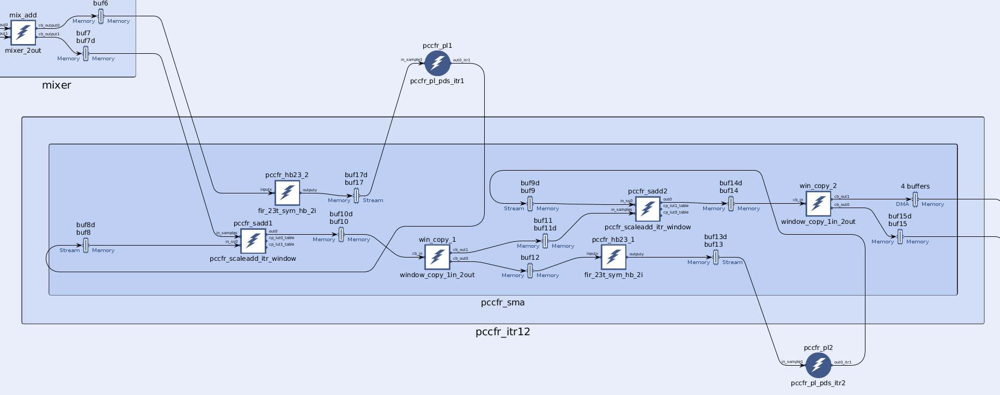

#### pccfr_sadd1/pccfr_sadd2
The `pccfr_sadd1` and `pccfr_sadd2` kernels are `pccfr_scaleadd_itr_window` CommsLib kernels that are responsible for scaling the PL output for the adjacent frequency components based on the metadata received from the PC-CFR PL kernel. 

Location: `$(COMMSLIB_ROOT)/radio/src/pccfr_scaleadd_itr_window.cc`

#### pccfr_hb23_1/pccfr_hb23_2
The `pccfr_hb23_1` and `pccfr_hb23_2` kernels are `fir_23t_sym_hb_2i` CommsLib kernels. The `fir_23t_sym_hb_2i` kernel is an implementation of of a half-band up-sampler: 

* FIR filter
* 23 taps
* Symmetric
* Half band
* Interpolation by 2 

Location: `$(COMMSLIB_ROOT)/radio/src/pccfr_scaleadd_itr_window.cc`

#### win_copy_1/win_copy_2
The `win_copy_1` and `win_copy_2` kernels are `window_copy_1in_2out` CommsLib kernels. The `win_copy_1` kernel copies the buffer that comes from the `pccfr_sadd1` kernel to the `pccfr_hb23_1` FIR 23 tap filter kernel and to the `pccfr_sadd2` scale add kernel that subtracts the the error in the peak values. The `win_copy_2` kernel copies the buffer that comes from the `pccfr_sadd2` scale add kernel to the `wcfr_g.wcfr_mag.wcfr_hb23` kernel and to the `wcfr_g.wcfr_fs.wcfr_correc` kernel (through DMA). 

Location: `$(COMMSLIB_ROOT)/common/src/window_copy_1in_2out.cc`

### wcfr_graph
The `wcfr_graph` subgraph is a CommsLib subgraph which consists of the `wcfr_int_mag` and `wcfr_filt_sub` subgraphs. The `wcfr_int_mag` subgraph consists of the `wcfr_hb23`, `wcfr_hb11`, and `wcfr_m_pa` kernels. The `wcfr_filt_sub` subgraph consists of the `wcfr_sub` and `wcfr_correc` kernels. 

* Data from the `pccfr_itr12` is processed by the `wcfr_correc` and `wcfr_hb23` kernels.
* The `wcfr_hb23` kernel processes the data and sends its results to the `wcfr_hb11` kernel.
* The `wcfr_hb11` kernel processes the data and sends its results to the `wcfr_m_pa` kernel. 
* The `wcfr_m_pa` kernel processes the data and streams it to the PL (`wcfr_pl`) kernel. 
* The `wcfr_pl kernel` procceses that data and streams it back to the AI Engine (`wcfr_sub kernel`).
* The `wcfr_sub` kernel proccess it and sends its results to the `wcfr_correc` kernel. 
* The `wcfr_correc` kernel proccesses data from the `pccfr_itr12` and the `wcfr_sub` kernel and sends its results to the `dpd_upsamp.upsampler8by5` kernel. 

Location: `$(COMMSLIB_ROOT)/radio/inc/commslib/radio/inc/wcfr_subsystem.h`

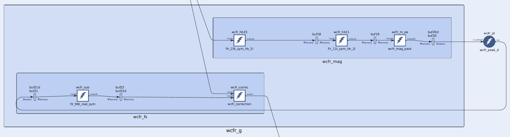

#### wcfr_hb23
The `wcfr_hb23` kernel is a CommsLib kernel that is an implementation of a half-band up-sampler: 

* FIR filter
* 23 taps
* Symmetric
* Half band
* Interpolation by 2 

Location: `$(COMMSLIB_ROOT)/filters/src/fir_23t_sym_hb_2i.cc`

#### wcfr_hb11 
The `wcfr_hb11` kernel is a CommsLib kernel that is an implementation of a half-band up-sampler: 

* FIR filter
* 11 taps
* Symmetric
* Half band
* Interpolation by 2 

Location: `$(COMMSLIB_ROOT)/filters/src/fir_11t_sym_hb_2i.cc`

#### wcfr_m_pa
The `wcfr_m_pa` kernel is a `wcfr_mag_pack` CommsLib kernel that is responsible for packing the magnitude values from the `wcfr_hb11` 11-tap FIR symmetric filter kernel before providing them to the WCFR PL kernel:   

Location: `$(COMMSLIB_ROOT)/commslib/radio/src/wcfr_mag_pack.cc`

#### wcfr_sub
The `wcfr_sub` kernel is a CommsLib kernel that is an implementation of a rate change filter:

* FIR filter
* 96 taps
* Real
* Symmetric

Location: `$(COMMSLIB_ROOT)/commslib/filters/src/fir_96t_real_sym.cc`

#### wcfr_correc
The `wcfr_correc` kernel is a `wcfr_correction` CommsLib kernel that is responsible for adjusting the WCFR samples coming from the PL by multiplying the samples with a gain factor and subtracting the orignal signal from it.   

Location: `$(COMMSLIB_ROOT)/commslib/radio/src/wcfr_correction.cc`

### dpd_upsampler_8by5_up2
The `dpd_upsampler_8by5_up2` is a user-defined subgraph made specially for the TX Chain tutorial. It consists of the `upsampler2`, `upsampler8by5`, and `gain_block` kernels. 

* Data from the `wcfr_g` is sent to the `upsampler8by5` kernel 
* The `upsampler8by5` kernel processes the data and sends its results to the `upsamplerby2` kernel
* The `upsamplerby2` kernel processes the data and sends its results to the `gain_block` kernel 
* The `gain_block` kernel proccess the data and sends its results to two DMA blocks that multicast streams that data to the `dpd_filter.dpd_core0`, `dpd_filter.dpd_core1`, `dpd_filter.dpd_core2`, and `dpd_filter.dpd_core3` kernels. 

Location: `design/aie_src/tx_subsystem.h`

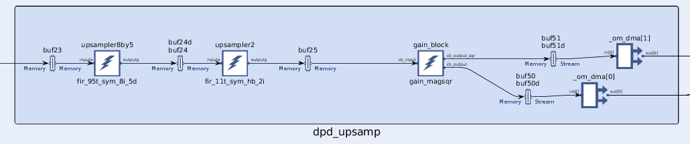

#### upsampler2
The `upsampler2` kernel is a `fir_11t_sym_hb_2i` CommsLib kernel that is an implementation of a half-band up-sampler: 

* FIR filter
* 11 taps
* Symmetric
* Half band
* Interpolation by 2 

Location: `$(COMMSLIB_ROOT)/commslib/filters/src/fir_11t_sym_hb_2i.cc`

#### upsampler8by5
The `upsampler8by5` kernel is a `fir_95t_sym_8i_5d` CommsLib kernel that is an implementation of a rate change filter:

* FIR Filter
* 95 taps
* Symmetric 
* Interpolation by 8
* Divide by 5 

Location: `$(COMMSLIB_ROOT)/commslib/filters/src/fir_95t_sym_8i_5d.cc`

#### gain_block
The `gain_block` kernel is a `gain_magsqr` Commslib kernel that multiplies the input samples and sends it to the FIR filter stage with a gain factor. It also performs magnitude computation based on the real and imaginary part of the signal.  

Location: `$(COMMSLIB_ROOT)/commslib/radio/src/gain_magsqr.cc`

### DPD_LUT_FILT_1G_32T
The `DPD_LUT_FILT_1G_32T` is a CommsLib subgraph that consists of the `dpd_core0`, `dpd_core1`, `dpd_core2`, `dpd_core3`, and `cl2[2]` kernels. 

* Data from the `dpd_upsamp` graph is multicast streamed to the `dpd_core0`, `dpd_core1`, `dpd_core2`, and `dpd_core3` kernels.  
* The `dpd_core0` and `dpd_core1` kernels recieve data from the `dpd_upsamp` graph and the `c2l[0]` kernel containing coefficients values. 
* The `dpd_core2` and `dpd_core3` kernels recieve data from the `dpd_upsamp` graph and the `c2l[1]` kernel. 
* During simulation, the `dpd_filter` subgraph writes output data to the `output0.txt` file. 

Location: `$(COMMSLIB_ROOT)/radio/inc/dpd_filter.h`

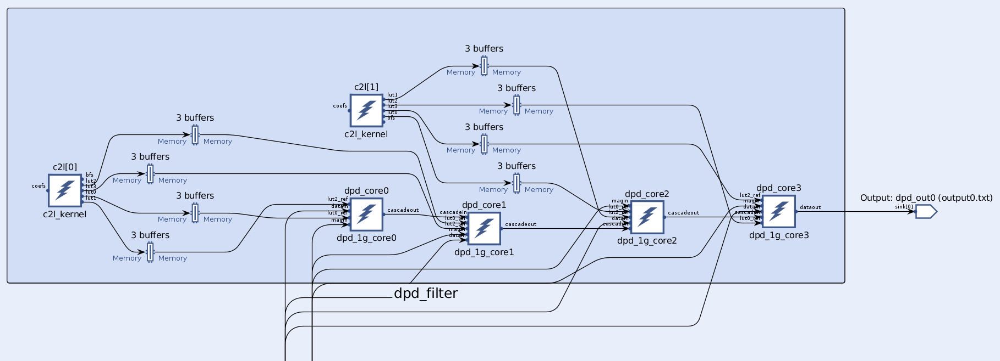

#### dpd_core0/dpd_core1/dpd_core2/dpd_core3 
The `dpd_core0`, `dpd_core1`, `dpd_core2`, and `dpd_core3` kernels are `dpd_1g_core0`, `dpd_1g_core1`, `dpd_1g_core2`, and `dpd_1g_core3` CommsLib kernels to that implement DPD at 1 GSPS. They perform digital pre-distortion filtering.  

Locations: 
```
$(COMMSLIB_ROOT)/commslib/radio/src/dpd_1g_core0.c
$(COMMSLIB_ROOT)/commslib/radio/src/dpd_1g_core1.c
$(COMMSLIB_ROOT)/commslib/radio/src/dpd_1g_core2.c
$(COMMSLIB_ROOT)/commslib/radio/src/dpd_1g_core3.c
```
#### cl2\[2]
The `cl2[2]` kernel array (size 2) is a `c2l_kernel` CommsLib kernel that converts 256 coefficeint values to a lookup table (LUT). The coefficient values are sent to this kernel by the PS.  

Location: `$(COMMSLIB_ROOT)/commslib/radio/src/c2l_kernel.cc`

</details>

<details>
  <summary>Data Flow Graph</summary>

## Data Flow Graph
The AI Engine subgraphs described above are further stitched together with the CFR PL kernels to make the high-level `tx_chain200MHz` graph definition. This is the overall data-flow graph specification which is compiled by the AI Engine compiler. Review [AI Engine Programming Section in the AI Engine Documentation](https://www.xilinx.com/html_docs/xilinx2021_1/vitis_doc/ai_engine_programming.html#mes1509388302139) for an introduction to ADF graphs. 

The `tx_chain.h` provides the overall graph definition of the design. In addition, `tx_chain.cpp` instantiates the `tx_chain` graph object and uses the Run Time Graph Control API to control and update the graph execution on a virtual platform. This section describes the `tx_chain.h` graph definition, `tx_chain.cpp` (graph execution), and some of the unique AI Engine compiler options used. 

### TX Chain Graph Class (`tx_chain.h`) 
The TX Chain graph class is defined in the header file (`tx_chain.h`). It must include the adaptive data flow (ADF) library, `tx_subsystem.h`, and `tx_chain_kernels.h`. The `tx_subsystem.h` defines the user-defined AI Engine subgraphs (`interp_chain`, `mixer_subsystem`, and `dpd_upsampler8by5_up2`). The `tx_chain_kernels.h` contains the CFR PL kernel prototypes and the user-defined AI Engine kernel `mixer_2out` prototype.  

```C++
#include <adf.h>
#include "kernels.h"
#include "tx_subsystem.h"
#include "tx_chain_kernels.h"
```
In the TX Chain tutorial, the graph definition has been divided into multiple steps for learning purposes. Each step is represented as comments in the `tx_chain.h` file using notations Step 1, Step 2, Step 2.1, etc. 

#### Step 1. Define the TX chain graph class 
Define the TX Chain graph class in the `Adf_DFE` namespace. All user-defined graphs are derived from the class `graph`. This graph is an example of a templated graph class that is instantiated with three parameters: 

* `xoff`: column offset on AI Engine 
* `yoff`: row offset on the AI Engine
* `dir`: directionality of specifying AI Engine tiles (usually set to 1)

These parameters are used to define location constraints to ensure kernel placement in specific AI Engine tiles. 

```C++
using namespace af;
namespace adf_DFE {
  template <int xoff, int yoff, int dir> 
    class tx_chain_200MHz : public graph {
...    
```
*Step 1.1*: Declare top-level ports to the graph: 
* Two input ports (because there are two MM2S kernels that send data from the DDR memory to the AI Engine)
* One output port (because there is one S2MM kernel that writes processed data from the AI Engine to the DDR memory).

*Step 1.2*: Declare all AI Engine subgraphs and the CFR PL kernels:

**AI Engine Subgraphs:** 
* interp_chain 
* mixer_subsystem
* pc_cfr_chain_itr_win
* wcfr_graph
* dpd_upsampler_8by5_up2
* DPD_LUT_FILT_1G_32T

**CFR PL Kernels:** 
* pccfr_pl_pds_itr1
* pccfr_pl_pds_itr2
* wcfr_peak_d 

The data mover PL kernels are not declared in `tx_chain.h` because they are not part of the data flow graph. They connect to the AI Engine during the Vitis linker stage (`make xclbin`). The CFR PL kernels work closely with the AI Engine and are essential to the data flow path. Thus they need to be instantiated in `tx_chain.h` and are needed by the AI Engine simulator (`aiesimulator`). The data mover PL kernels are represented by the input and output ports and are not needed by the AI Engine simulator.  

#### Step 2. Define the Graph Constructor
To instantiate the TX chain graph, you must define the constructor that creates the CFR PL kernels, adds the connectivity information, specifies the location constraints, sets the source files for each of the kernels, and sets the tile use. 

*Step 2.1* Uses the `kernel::create` function to instantiate the CFR PL kernel objects using the functionality of the C functions `wcfr_peak_d`, `pccfr_pl_pds_itr1`, `pccfr_pl_pds_itr2`. You can specify that a kernel is intended to run in the programmable logic by attaching the attribute `fabric<pl>` to the kernel instance. 

```C++
wcfr_pl = kernel::create(wcfr_peak_d);
fabric<pl>(wcfr_pl);
pccfr_pl1 = kernel::create(pccfr_pl_pds_itr1);
fabric<pl>(pccfr_pl1);
pccfr_pl2 = kernel::create(pccfr_pl_pds_itr2);
fabric<pl>(pccfr_pl2);  
```
Because all other kernels reside in AI Engine subgraphs, their instantiation is in their AI Engine subgraph constructors. 

*Step 2.2* Add the connectivity information which is equivalent to the nets in a data flow graph. This is done by using the templated `connect<>` object. The connection can be `window<>` or `stream`. If a window connection is used, then window parameters must be specified. See [Window and Streaming Data API Section in the AI Engine Documentation](https://www.xilinx.com/html_docs/xilinx2021_1/vitis_doc/window_streaming_api.html#efv1509388613160) for more information about window and stream connections. The TX Chain tutorial showcases three different types of connections. Example connections are shown as follows. 

##### Window Connection with Margin Example 
```C++
connect<window<CF63_INPUT_SAMPLES*4, CF63_INPUT_MARGIN*4> > (in[i], channel[i].in);
```
In the `interp_chain` graph definition (`tx_subsystem.h`), you can see that `in[]` ports connect to the kernel `cf63.in[]` with the same connection type. 

NOTE: You can also use the syntax `connect<>` and the AI Engine compiler interprets the connection to be the same as `in[]` to `cf63.in[]` connection in the `interp_chain` definition. 

This connection has two arguments: 

* window size: CF63_INPUT_SAMPLES\*4 = 160\*4 = 640 bytes 

* margin: CF63_INPUT_MARGIN\*4 = 64\*4 = 256 bytes

640 bytes of data stream into the AI Engine (from the `mm2s` HLS kernels). This data is written into the data memory of the AI Engine core that contains the `channel[].cf63` kernels. The margin parameter identifies that there is a 276 bytes of overlap from one block of data to the next. The total memory allocated in the data memory of the AI Engine core is window-size + margin-size (916 bytes). Review the `interp_chain` definition in `tx_subsystem.h` to see the kernel connections inside the subgraph.  

##### AI Engine Subgraph to AI Engine Subgraph Window Connection:
```C++
connect<window<MIXER_INPUT_SAMPLES*4> > (channel[i].out, mixer.in[i]);
```

window size: MIXER_INPUT_SAMPLES\*4 = 320\*4 = 1280 bytes. 

1280 bytes of data are written from the AI Engine core that contains the `channel[].hb23` kernel to the data memory of the AI Engine core that contains the `mixer.mix_add` kernel. Review the `mixer_subsystem` definition in `tx_subsystem.h` to see the kernel connections in the subgraph. 

##### AI Engine to/from PL Stream Connections 
```
connect< stream > (pccfr_itr12.pccfr_pl_in0, pccfr_pl1.in[0]);
connect< stream > (pccfr_itr12.pccfr_pl_in1, pccfr_pl2.in[0]);
connect< stream > (pccfr_pl1.out[0], pccfr_itr12.pccfr_pl1_out0);
connect< stream > (pccfr_pl2.out[0], pccfr_itr12.pccfr_pl2_out0);
```
These connections allow data to be sent between the AI Engine and the PL. The AI Engines push data into the AXI4-Stream interconnect where it is routed south to a PL interface tile, out of the AI Engine, and eventually routed to the CLB containing the `pccfr_pl` kernel. The first line means data is streamed from the AI Engine containing the `pccfr_itr12.pccfr_sma.pccfr_hb23_2` kernel to the `pccfr_pl` HLS kernel. The second line means data is streamed from the `pccfr_itr12.pccfr_sma.pccfr_hb23_1` kernel to the `pccfr_pl` HLS kernel. Similarly, the PL kernels can stream data (through the AXI4-Stream interface) to a PL interface tile on the AI Engine. This data gets pushed into the AXI4-Stream interconnect where it is routed to its destination AI Engine. The third line means data is streamed from the `pccfr_pl` HLS kernel to the `pccfr_itr12.pccfr_sma.pccfr_sadd1` kernel. The fourth line means data is streamed to the `pccfr_itr12.pccfr_sma.pccfr_sadd2` kernel. 

##### AI Engine Window to Stream MultiCast
```C++
connect<window<DPD_GAIN_INPUT_SAMPLES*4>, stream> (dpd_upsamp.out[0], dpd_filter.datain[0]);
connect<window<DPD_GAIN_INPUT_SAMPLES*4>, stream> (dpd_upsamp.out[0], dpd_filter.datain[1]);
connect<window<DPD_GAIN_INPUT_SAMPLES*4>, stream> (dpd_upsamp.out[0], dpd_filter.datain[2]);
connect<window<DPD_GAIN_INPUT_SAMPLES*4>, stream> (dpd_upsamp.out[0], dpd_filter.datain[3]);
connect<window<DPD_GAIN_INPUT_SAMPLES*4>, stream> (dpd_upsamp.out[1], dpd_filter.magin[0]);
connect<window<DPD_GAIN_INPUT_SAMPLES*4>, stream> (dpd_upsamp.out[1], dpd_filter.magin[1]);
connect<window<DPD_GAIN_INPUT_SAMPLES*4>, stream> (dpd_upsamp.out[1], dpd_filter.magin[2]);
connect<window<DPD_GAIN_INPUT_SAMPLES*4>, stream> (dpd_upsamp.out[1], dpd_filter.magin[3]);
```
* window size: DPD_GAIN_INPUT_SAMPLES\*4 = 1024\*4 = 4096 bytes

These connections allow data to be sent from data memory (window) to multiple streams using the AXI4-Stream interconnect. The first four lines mean that 4096 bytes of data stored in data memory of the AI Engine containing the `dpd_upsamp.gain_block[0]` is streamed to `dpd_filter.dpd_core0`, `dpd_filter.dpd_core1`, `dpd_filter.dpd_core2`, and `dpd_filter.dpd_core3` kernels. The last four lines mean that 4096 bytes of data from `dpd_upsamp.gain_block[1]` are streamed to the `dpd_filter.dpd_core0-3` kernels.  


*Step 2.3* Specify relative and absolute location constraints for each kernel. This is done by using the `location<kernel>` function. See the [Specialized Graph Constructs Section in the AI Engine Documentation](https://www.xilinx.com/html_docs/xilinx2021_1/vitis_doc/special_graph_constructs.html#obg1512605687084) for more information about Location Constraints. 

*Step 2.3* Set the source file and tile use for each of the kernels. This is done by using the `source` and `runtime<ratio>` functions. Most of the AI Engine kernels are sourced from `CommsLib\` with the exception of the `mix_add` kernel. All the CFR PL kernels are sourced from `kernel_src\`.  
 
### TX Chain Top-Level Application (tx_chain.cpp) 
Define the TX chain top-level application file in `tx_chain.cpp`. This file contains an instance of the `tx_chain_200MHz` graph class and connects the graph to a simulation platform to provide file input and output. These files are called `aie_src/data/input0.txt`, `aie_src/data/input1.txt`, and `aie_src/data/output0.txt`. 

#### Step 1: Connect TX Chain Graph to a Virtual Platform. 
This is done by the following actions:

* Allocate a `PLIO` pointer for each input and output to the graph (two inputs, one output). Refer the [PLIO Attributes Section in the AI Engine Documentation](https://www.xilinx.com/html_docs/xilinx2021_1/vitis_doc/use_virtual_program.html#bna1512607665307). 

* Instantiate the templated `simulation:platform<>` object. This is a virtual platform specification to execute the data flow graph in a software simulation environment. You need to specify the parameters `<2,1>` for two inputs and one output. You also need to pass in the `PLIO` pointers as constructor arguments. Refer to the [Using a Virtual Platform Section in the AI Engine Documentation](https://www.xilinx.com/html_docs/xilinx2021_1/vitis_doc/use_virtual_program.html#oul1512606721147).  

* Instantiate the TX chain graph object. You need to specify the parameters `<0,0,1>` to ensure the AI Engine kernel locations are constrained to the bottom-left corner of the AI Engine array and the direction of kernel placement is '1' (that is, towards the right).

* Connect the platform source and sink ports to the TX chain graph with the `connect<>` construct. Refer to the Connections section in [Adaptive Data Flow Graph Specification Reference Section in the AI Engine Documentation](https://www.xilinx.com/html_docs/xilinx2021_1/vitis_doc/data_flow_graph_reference.html#uiz1512617950785). 

#### Step 2: Define main() Program
The `main` program is the driver of the graph. It is used to load, execute, and terminate the graph. This is done by using the Run Time Graph Control API calls: `tx_chain0.init()`, `tx_chain0.run()`, `tx_chain0.update()`, and `tx_chain0.end()`. Refer to [Run Time Graph Control API Section in the AI Engine Documentation](https://www.xilinx.com/html_docs/xilinx2021_1/vitis_doc/runtime_graph_api.html#pfy1512589515876) for more information. 

The TX Chain graph contains a DPD filter subgraph (`DPD_LUT_FILT_1G_32T`) which needs user-specified coefficients to run the filter. These DPD coefficients are updated through the PS ports using the `tx_chain0.update()` API call. These coefficients are read in from the `aie_src/data/coefs_4c2l_ps01.txt` and `aie_src/data/coefs_4c2l_ps23.txt` files using the `readIntegersFromFile` function.

</details>

<details>
  <summary>PL Kernels</summary>
	
## PL Kernels
In addition to kernels operating on the AI Engines, this design specifies five kernels to run on the PL region of the device (written in HLS C++). The CFG PL kernels are directly used in the `tx_chain200MHz` graph. The two data mover kernels are brought into the design during the Vitis kernel compilation. Review the [AI Engine/Programmable Logic Integration Section in the AI Engine Documentation](https://www.xilinx.com/html_docs/xilinx2021_1/vitis_doc/programmable_logic_integration.html#lci1512606550399) for an introduction to PL kernel development with the AI Engine. 

The TX Chain tutorial is made up of the following PL kernels: 

**CFR Kernels** 
* pccfr_pds_itr1
* pccfr_pds_itr2
* wcfr_peak_d

**Data Mover Kernels** 
* mm2s_0
* mm2s_1
* s2mm 

This section describes the PL kernel code for the five PL kernels and the unique Vitis compiler options used in the configuration files (`.cfg`). 

### pccfr_pds_itr1 (pccfr_pds_itr1.cpp) 
### pccfr_pds_itr2 (pccfr_pds_itr2.cpp)
### wcfr_peak_d (wcfr_peak_d.cpp)
### mm2s (mm2s.cpp)
The mm2s kernels reads 32 bits of data from an AXI-Memory mapped interface (using the `mem` argument) and writes it to an AXI4-Stream interface (to the `s` argument). 
#### Arguments 
The mm2s kernel has three arguments:

* `ap_int<32>* mem`
* `hls::stream<qdma_axis<32,0,0,0>>&s`
* `int size`

* `ap_int<N>` is an arbitrary precision integer data type defined in `ap_int.h` where `N` is a bit-size from 1-1024. For the `mem` argument, the bit-size is set to 32. 

* `hls::stream<qdma_axis<D,0,0,0>>` is a data type defined in `ap_axi_sdata.h`. It is a special data class used for data transfer when using a streaming platform. The parameter `<D>` is the data width of the streaming interface which is set to 32 (same as the `mem` argument). The remaining three parameters should be set to 0. 
  
#### #pragma HLS INTERFACE s_axilite
An mm2s kernels has one `s_axilite` interface (specifying an AXI4-Lite slave I/O protocol) with `bundle=control` associated with all the arguments (`mem`,`s`, and `size`). This interface is also associated with `return`. 

##### #pragma HLS INTERFACE m_axi
An `mm2s` kernel has one `m_axi` interface (specifying an AXI4 master I/O protocol) with `offset=slave bundle=gmem` associated with the `mem` argument. This interface also has `max_read_burst_length=256`. Part of this AXI4 interface is the Read Address Channel containing the signals `ARBURST` and `ARLEN`. This interface has a burst type `ARBURST=INCR` and can support burst length `ARLEN` of 1-256 read transfers. In an incrementing burst, the address for each transfer in the burst is an increment of the previous transfer address. The `max_read_burst_length=256` sets the burst length `ARLEN=256` transfers, meaning that in every transaction (burst), there are 256 transfers of data. The address of each transfer with a size of four bytes (32-bits from the `mem` argument) is the previous address plus four.      

References: 
* [Vivado AXI Reference](https://www.xilinx.com/cgi-bin/docs/ipdoc?c=axi_ref_guide;v=latest;d=ug1037-vivado-axi-reference-guide.pdf)
* [AMBA AXI Protocol Specification](https://developer.arm.com/documentation/ihi0022/c)

#### #pragma HLS INTERFACE axis
An `mm2s` kernel has one `axis` interface (specifying an AXI4-Stream I/O protocol) associated with the `s` argument. 

#### #pragma HLS PIPELINE II=1
An `mm2s` kernel has a `for` loop that is a candidate for burst read because the memory addresses per loop iteration is consecutive (`ARBURST=INCR`). To pipeline this `for` loop, you can use this pragma by setting the initiation interval (`II`) = 1.  

### s2mm (s2mm.cpp) 
The `s2mm` kernel reads 128 bits of data from an AXI4-Stream interface (using the `s` argument) and writes it to an AXI Memory mapped interface (to the `mem` argument). 

#### Arguments 
The `s2mm` kernel has three arguments:

* `ap_int<128>* mem`
* `hls::stream<qdma_axis<128,0,0,0>>&s`
* `int size`

* `ap_int<N>` is an arbitrary precision integer data type defined in `ap_int.h` where `N` is a bit-size from 1-1024. For the `mem` argument, the bit-size is set to 128.

* `hls::stream<qdma_axis<D,0,0,0>>` is a data type defined in `ap_axi_sdata.h`. It is a special data class used for data transfer when using a streaming platform. The parameter `<D>` is the data width of the streaming interface and is set to 128 (same as the `mem` argument). The remaining three parameters should be set to 0. 

#### #pragma HLS INTERFACE s_axilite
An `s2mm` kernel has one `s_axilite` interface  (specifying an AXI4-Lite slave I/O protocol) with `bundle=control` associated with all the arguments (`mem`,`s`, and `size`). This interface is also associated with `return`. 

#### #pragma HLS INTERFACE m_axi
An `s2mm` kernel has one `m_axi` interface (specifying an AXI4 master I/O protocol) with `offset=slave bundle=gmem` associated with the `mem` argument. This interface also has `max_write_burst_length=256`. Part of this AXI4 interface is the Write Address channel containing the signals `AWBURST` and `AWLEN`. This interface has a burst type `AWBURST=INCR` and can support a burst length `AWLEN` of 1-256 read transfers. In an incrementing burst, the address for each transfer in the burst is an increment of the previous transfer address. The `max_write_burst_length=256` sets the burst length `AWLEN=256` transfers, meaning that in every transaction (burst), there are 256 transfers of data. The address of each transfer with a size of four bytes (32-bits from the `mem` argument) is the previous address plus four.      

#### #pragma HLS INTERFACE axis
An `s2mm` kernel has one `axis` interface (specifying an AXI4-Stream I/O protocol) associated with the `s` argument. 

#### #pragma HLS PIPELINE II=1
An `s2mm` kernel has a `for` loop that is a candidate for burst write because the memory addresses (mem\[i]) are contiguous (memory accesses across loop iterations are consecutive). To pipeline this `for` loop, you can use this pragma by setting the initiation interval (`II`) = 1.  

</details>

<details>
  <summary>A72 Application</summary>
	
## PS Host Application
The TX Chain tutorial uses the embedded processing system (PS) as an external controller to control the AI Engine graph and data mover PL kernels. Review the [Programming the PS Host Application Section in the AI Engine Documentation](https://www.xilinx.com/html_docs/xilinx2021_1/vitis_doc/program_ps_host_application.html#ykt1590616160037) to understand the process to create a host application. 

In addition to the PS host application (`tx_chain_app.cpp`), the AI Engine control code must also be compiled. This control code (`aie_control.cpp`) is generated by the AI Engine compiler when compiling the AI Engine design graph and kernel code. The AI Engine control code is used by the PS host application for the following reasons: 

* Control the initial loading of the AI Engine kernels.
* Run the graph for several iterations, update the run time parameters associated with the graph, exit, and reset the AI Engine tiles. 

The PS Host application stack diagram for the TX Chain tutorial is shown below: 

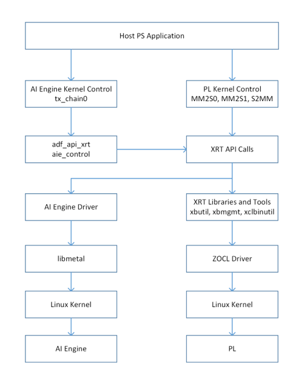

In the TX Chain tutorial, the A72 application have been divided into multiple steps for learning purposes. Each step is represented by a corresponding message in the console window during the application run. In addition, these steps are tagged in the A72 application (`tx_chain_app.cpp`) code using notations Step 1, Step 2, Step 2.1, etc.  

### Step 1: Include the AI Engine Graph Application and XRT and ADF Headers
The AI Engine Graph Application (`tx_chain.cpp`) contains an instantiation of the `tx_chain_200MHz` graph (`tx_chain0`) that will be used in this A72 host application. 
```C++
#include "tx_chain.cpp"
```

#### Step 2: Check Command Line Argument
The beginning of the A72 application is represented by the main function: 
```C++
int main (int argc, char* argv[])
...
```
The main function has one argument: 

* argv[1]: XCLBIN - the name of the Xilinx binary container where the PL kernels are precompiled. 

#### Step 3: Open XCLBIN and Create Data Mover Kernel Handles
At this step, the A72 application loads the XCLBIN binary file and creates the data mover kernels to be executed on the Versal device. This process consists of two steps:

*Step 3.1* loads the XCLBIN binary file (passed to the main using `argv[1]` argument) using `load_xclbin` function (which calls the `xrtDeviceLoadXclbin` XRT function).

*Step 3.2* creates the data mover kernel handles (`mm2s_0`, `mm2s_1`, and `s2mm`) using the `xrtPLKernelOpen` XRT function.

The CFR PL kernels are not controlled by the PS and are not included in the `tx_chain_app.cpp`. 

#### Step 4: Allocate buffers for Input data and Results in Global Memory 
Before the A72 application can launch the data mover kernel executions, it needs to accomplish two tasks: 
* Pass the input data to the kernel to process it 
* Allocate the memory where the kernels can store the output results

The A72 application allocates BOs (buffer objects) to store the two channels of `NR100` input data in global memory (DDR memory). This data is loaded from the `data/input0_hex` and `data/input1_hex` text data files in a later step. In addition, it allocates a BO to store the results (`dpd0`) in global memory (DDR memory). The results are generated by the s2mm kernel and are stored in the `log_output` text file (in a later step).

This is done by using the `xrtBOAlloc` and `xrtBOMap` functions. 

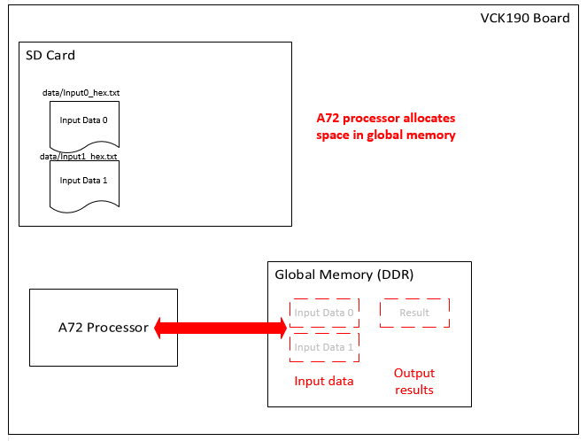

#### Step 5: Prepare VCK190 board and Run TX Chain Graph 
Before executing the data mover kernels, the A72 processor must reset the VCK190 board and then use the XRT run time graph control API calls to run the AI Engine TX chain dataflow graph. 

*Step 5.1* resets the VCK190 board by executing the `versal_run/reset-board.sh` script with the `system()` function. Before running the script, the A72 processor must wait 1000 microseconds before and after running the reset script with the `usleep()` function. This allows time for the PS to define the three memory locations in DDR memory. 

*Step 5.2* reads the DPD filter coefficients from the `data/coefs_4c2l_ps01.txt` and `data/coefs_42cl_ps23.txt` files using the `readIntegersFromFile` function. The A72 processor then opens, resets, and runs the TX chain graph using the `xrtGraphOpen`, `xrtGraphReset` and `xrtGraphRun` functions. The A72 processor must wait 1000 microseconds after running the graph to allow the PS to configure the AI Engine before updating the coefficients. 

The A72 processor then updates the DPD filter with the coefficients using the `xrtGraphUpdateRTP` function. 

#### Step 6:  Write Input Data to Global Memory
The A72 processor copies the input data text files in the SD memory to global memory (two channels of `NR100`). 

*Step 6.1* reads input data from the `data/Input0_hex.txt` and `data/Input1_hex.txt` files. 
*Step 6.2* writes input data to the two `NR100` BOs mapped to global memory through the `lte0_mapped` and `lte1_mapped` memory-mapped `xclBufferHandle` objects. 
*Step 6.3* synchronizes the data content in the mapped BOs to the Versal device. This ensures that the device DDR memory has the same data as the BOs in the A72 processor. This operation might require DMA to the device and CPU cache flushing/invalidation. This is done with the `xrtBOSync` XRT function.


#### Step 7: Execute the Data Mover Kernels
Now that the data is loaded in DDR memory, the A72 processor launches the data mover kernels and generates the output results which is written to global memory. 

It starts the mm2s data mover kernels to read data from DDR memory and send to the AI Engine. The A72 processor also starts the s2mm data mover kernel to move data streaming out the AI Engine and write the results in DDR memory. For all three data mover kernels, the A72 processor must create the kernel run handles, wait for kernels to complete running, and close them. This is done with the `xrtRunOpen`, `xrtRunSetArg`, `xrtRunStart`, `xrtRunWait`, `xrtRunClose`, and `xrtKernelClose` XRT functions. 

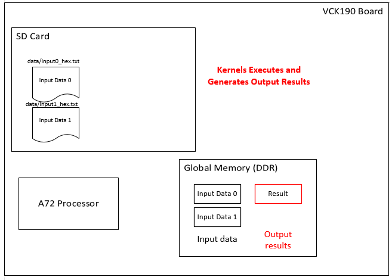

#### Step 8: Verify Output Results
After the kernels’ executions have been completed, the A72 processor copies the output results from global memory to the SD memory and verifies that the output results are correct. If the results are not correct, the A72 processor reports the test failed. 

*Step 8.1* copies the two channels of `NR100` input data, and `dpd0` output data from DDR memory to SD memory (to `log_lte0.txt`, `log_lte1`, and `log_output.txt` files). 

*Step 8.2* compares the output results to the golden reference data (stored in the `data/dpd0_golden.txt` file). 

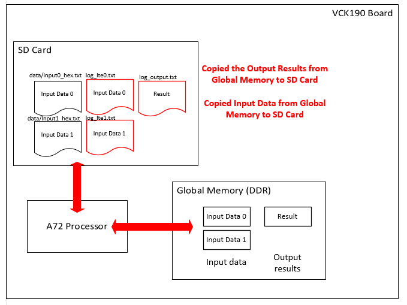

#### Step 9: Release Allocated Resources
At the final step, the A72 processor frees previously allocated resources. 

</details>

<details>
  <summary>Makefile</summary>
	
## Makefile
Review the Makefile file. The following section describes the various steps the Makefile performs. 

### Help 
The make help command is provided below: 
```make
%.PHONY: help

help::
	@echo  " Makefile Usage:"
	@echo  ""
	@echo  "  make kernels TARGET=<hw_emu/hw>"
	@echo  "  Command to generate the PL kernels"
	@echo  "  Default TARGET is hw_emu"
	@echo  ""
	@echo  "  make graph"
	@echo  "  Command to generate the AI Engine graph"
	@echo  ""
	@echo  "  make xclbin TARGET=<hw_emu/hw>"
	@echo  "  Command to generate the xclbin for specified target"
	@echo  "  Default TARGET is hw_emu"
	@echo  ""
	@echo  "  make application"
	@echo  "  Command to generate the A72 application"
	@echo  ""
	@echo  "  make package TARGET=<hw_emu/hw>"
	@echo  "  Command to package design into an sd_card for specified target"
	@echo  "  Default TARGET is hw_emu"
	@echo  ""
	@echo  "  make clean"
	@echo  "  Command to remove the generated files"
	@echo  ""
	@echo  ""
```
A phony target is one that is not really the name of a file; rather it is just the name for a recipe to be executed when you make an explicit request. That is, explicitly declare the target to be phony by making it a prerequisite of the special .PHONY as help. 
The command “make help” will run the recipe. This will display the Makefile use. 

### Select the target platform
Set the target platform to xilinx_vck190_202020_1 
```make
# =========================================================
# platform selection
# =========================================================
PLATFORM := xilinx_vck190_es1_base_202020_1
```

### Select the target build configuration
Set the TARGET build configuration to be hardware emulation (`hw_emu`) or system run (`hw`). The $(TARGET) variable defines the build configuration (`hw_emu` or `hw`). The default value of the TARGET variable is `hw_emu`. You can override the default build configuration by entering a command such as `make kernels TARGET=hw`. The build configuration matters for the `make kernels`, `make xclbin`, and `make package` steps. The outputs of those commands are stored in `build/hw_emu/` or `build/hw/` folders. The build configuration does not matter for the `make graph` and `make application` steps. The outputs of those commands are stored in the `build/` folder. 
```make
# =========================================================
# TARGET can be set as:
#   hw_emu: Hardware Emulation
#   hw    : Hardware Run
# =========================================================
TARGET := hw_emu
```

### Select the cross compiler
Set the cross compiler to `aarch64-linux-gnu-g++`. This is used by the `make application` step. 
```make
# =========================================================
# Choose the compiler based on the A72 Processor in the 
# Versal device
# =========================================================
HOST_CXX :=aarch64-linux-gnu-g++
```
### Select the SYSROOT, XRT, and XAIENGINE Paths
Set the SYSROOT, XRT, and XAIENGINE paths. 
```make
# =========================================================
# Choose the XRT and XAIENGINE
# =========================================================
SYSROOT_PATH :=$(PLATFORM_REPO_PATHS)/sw/versal/xilinx-versal-common-v2020.2/sysroots/aarch64-xilinx-linux
XRT_PATH :=$(SYSROOT_PATH)/usr/include/xrt
XAIENGINE_PATH :=$(SYSROOT_PATH)/usr/include/xaiengine 
```

### Select the Project, Source Files, Hardware, and Build Directories
```make
# =========================================================
# Source directory
# =========================================================
PROJECT_DIR	:= $(TX_CHAIN)
AIE_SRC_REPO	:= $(PROJECT_DIR)/aie_src
KERNEL_SRC_REPO := $(PROJECT_DIR)/kernel_src 
MAKEFILES_DIR 	:= $(PROJECT_DIR)/MAKEFILES
BUILD_DIR 	:= $(PROJECT_DIR)/build
WORK_DIR	:= $(BUILD_DIR)/Work
BUILD_TARGET_DIR := $(BUILD_DIR)/$(TARGET)
```

### Select the COMMSLIB and Local Library Paths
```make
# =========================================================
# COMMSLIB and Local Libraries
# =========================================================
COMM_INC	:= $(COMMSLIB_ROOT)/common/inc
COMM_SRC	:= $(COMMSLIB_ROOT)/common/src 
FILTERS_SRC	:= $(COMMSLIB_ROOT)/filters/src
FILTERS_INC	:= $(COMMSLIB_ROOT)/filters/inc
RADIO_SRC	:= $(COMMSLIB_ROOT)/radio/src
RADIO_INC	:= $(COMMSLIB_ROOT)/radio/inc
LOCAL_INC	:= $(AIE_SRC_REPO)/local/inc
LOCAL_SRC	:= $(AIE_SRC_REPO)/local/src
LOCAL_COMM_INC	:= $(AIE_SRC_REPO)/common/inc
LOCAL_COMM_SRC	:= $(AIE_SRC_REPO)/common/src
```

### Name AI Engine ADF Graph, AI Engine Graph Executable, A72 Application Executable, Kernel Executables, and XCLBIN File
The $(LIBADF_A) variable defines the AI Engine ADF graph name. The $(LIBADF_A) variable defines the AI Engine graph executable file name. The $(APP_ELF) variable defines the A72 application executable file name. The kernel executable names are the following: 

* pccfr_pl_pds_itr1.\[hw_emu | hw].xo
* pccfr_pl_pds_itr2.\[hw_emu | hw].xo
* wcfr_peak_d.\[hw_emu | hw].xo
* mm2s.\[hw_emu | hw].xo
* s2mm.\[hw_emu | hw].xo

```make
# ==========================================================
# Below are the names for ADF graph, application executable,
# kernel executables, and xclbin
# ==========================================================
LIBADF_A		:= libadf.a
APP_ELF 		:= tx_chain_xrt.elf
PCCFR_KERNEL1_XO 	:= pccfr_pl_pds_itr1.$(TARGET)
PCCFR_KERNEL2_XO 	:= pccfr_pl_pds_itr2.$(TARGET)
WCFR_KERNEL_XO 		:= wcfr_peak_d.$(TARGET)
S2MM_XO 		:= s2mm.$(TARGET)
MM2S_XO 		:= mm2s.$(TARGET)
XCLBIN 			:= vck190_aie_tx_chain.$(TARGET).xclbin
```

### Select the Kernel, AI Engine Graph, and A72 Application Source Files
```make
# =========================================================
# Kernel Source Files repository
# =========================================================
PCCFR_KERNEL1_SRC	:= kernel_src/pccfr_pds_itr1.cpp
PCCFR_KERNEL2_SRC	:= kernel_src/pccfr_pds_itr2.cpp
WCFR_KERNEL_SRC		:= kernel_src/wcfr_peak_d.cpp
S2MM_SRC		:= kernel_src/s2mm.cpp
MM2S_SRC		:= kernel_src/mm2s.cpp

# =========================================================
# Graph Source files repository
# ========================================================
GRAPH_SRC_CPP	:= $(AIE_SRC_REPO)/tx_chain.cpp 

# =========================================================
# Application Source Files repository
# =========================================================
APP_SRC_CPP := $(AIE_SRC_REPO)/tx_chain_app.cpp 
APP_SRC_CPP += $(WORK_DIR)/ps/c_rts/aie_control.cpp
```

### Select the AI Engine Compiler Settings and Include Libraries
```make
# =========================================================
# AIE Compiler Global Settings and Include Libraries
# =========================================================
AIE_FLAGS := --include=$(COMM_INC) 
AIE_FLAGS += --include=$(COMM_SRC) 
AIE_FLAGS += --include=$(FILTERS_INC) 
AIE_FLAGS += --include=$(FILTERS_SRC) 
AIE_FLAGS += --include=$(RADIO_INC) 
AIE_FLAGS += --include=$(RADIO_SRC) 
AIE_FLAGS += --include=$(LOCAL_INC) 
AIE_FLAGS += --include=$(LOCAL_SRC) 
AIE_FLAGS += --include=$(LOCAL_COMM_INC)  
AIE_FLAGS += --include=$(LOCAL_COMM_SRC) 
AIE_FLAGS += --target=hw 
AIE_FLAGS += --verbose 
AIE_FLAGS += --Xchess=main:llvm.xargs=-Wno-shift-negative-value 
AIE_FLAGS += --Xchess="gain_magsqr:cpp.define=USER_PARAMS"
AIE_FLAGS += --Xpreproc=-DDOPWRSQRT 
AIE_FLAGS += --Xpreproc=-DABSCONSTRAINTS 
AIE_FLAGS += --Xmapper=BufferOptLevel8 
AIE_FLAGS += --full-program=true 
AIE_FLAGS += --log-level=5 
AIE_FLAGS += --write-unified-data=true 
AIE_FLAGS += --pl-freq=lte_0:153.6 
AIE_FLAGS += --pl-freq=lte_1:153.6 
AIE_FLAGS += --pl-freq=tx_chain0.pccfr_pl1:307.2 
AIE_FLAGS += --pl-freq=tx_chain0.pccfr_pl2:307.2 
AIE_FLAGS += --pl-freq=tx_chain0.wcfr_pl:307.2  
AIE_FLAGS += --pl-register-threshold=125 
AIE_FLAGS += --pl-axi-lite=false
AIE_FLAGS += --workdir=$(WORK_DIR) 
```

### Select the A72 Application Compiler Settings, Include Libraries, and Linker Flags:
```make
# =========================================================
# Application Compiler and Linker Flags
# =========================================================
GCC_FLAGS := -O
GCC_FLAGS += -D__linux__ 
GCC_FLAGS += -DPS_ENABLE_AIE 
GCC_FLAGS += -DXAIE_DEBUG
GCC_FLAGS += -I$(AIE_SRC_REPO)/driver 
GCC_FLAGS += -I$(AIE_SRC_REPO)/local/inc/ 
GCC_FLAGS += -I$(COMM_INC) 
GCC_FLAGS += -I$(COMM_SRC) 
GCC_FLAGS += -I$(FILTERS_INC) 
GCC_FLAGS += -I$(FILTERS_SRC) 
GCC_FLAGS += -I$(RADIO_INC) 
GCC_FLAGS += -I$(RADIO_SRC) 
GCC_FLAGS += -I$(LOCAL_INC) 
GCC_FLAGS += -I$(LOCAL_SRC) 
GCC_FLAGS += -I$(LOCAL_COMM_INC)  
GCC_FLAGS += -I$(LOCAL_COMM_SRC)  
GCC_FLAGS += -I$(XRT_PATH)/usr/include/xrt 
GCC_FLAGS += -I$(XAIENGINE_PATH)
GCC_FLAGS += -I$(XILINX_VITIS_AIETOOLS)/include/

GCC_LIB := --sysroot=$(SYSROOT_PATH) 
GCC_LIB += -ladf_api 
GCC_LIB += -L$(XILINX_VITIS_AIETOOLS)/lib/aarch64.o 
GCC_LIB += -L$(XILINX_VITIS_AIETOOLS)/lib/lnx64.o 
GCC_LIB += -lxrt_coreutil 
GCC_LIB += -lxrt_core 
GCC_LIB += -lxaiengine 
GCC_LIB += -lmetal 
GCC_LIB += -lopen_amp
```

### Select the v++ Kernel Compiler Settings 
```make
# =========================================================
# Kernel Compiler and Linker Flags
# ========================================================
VPP_FLAGS := --platform $(PLATFORM) 
VPP_FLAGS += --save-temps
VPP_FLAGS += --temp_dir $(BUILD_TARGET_DIR)/_x 
VPP_FLAGS += --verbose 
```

### Step 1. Kernel Code Compilation Target
This creates a directory from the $(BUILD_TARGET_DIR) variable (`build/hw_emu/` or `build/hw/`) and places the compiled kernel executables and logs there. 
```make 
kernels: $(BUILD_TARGET_DIR)/$(PCCFR_KERNEL1_XO).xo		\
		$(BUILD_TARGET_DIR)/$(PCCFR_KERNEL2_XO).xo 	\
		$(BUILD_TARGET_DIR)/$(WCFR_KERNEL_XO).xo 	\
		$(BUILD_TARGET_DIR)/$(S2MM_XO).xo 		\
		$(BUILD_TARGET_DIR)/$(MM2S_XO).xo

$(BUILD_TARGET_DIR)/$(PCCFR_KERNEL1_XO).xo: $(PCCFR_KERNEL1_SRC)
	mkdir -p $(BUILD_TARGET_DIR); \
	v++ --target $(TARGET) $(VPP_FLAGS) --config pccfr_pds_itr1.cfg -c -k pccfr_pl_pds_itr1 $(PCCFR_KERNEL1_SRC) -o $@  
	mv v++_pccfr_pl_pds_itr1.$(TARGET).log $(BUILD_TARGET_DIR)/.

$(BUILD_TARGET_DIR)/$(PCCFR_KERNEL2_XO).xo: $(PCCFR_KERNEL2_SRC)
	v++ --target $(TARGET) $(VPP_FLAGS) --config pccfr_pds_itr2.cfg -c -k pccfr_pl_pds_itr2 $(PCCFR_KERNEL2_SRC) -o $@  
	mv v++_pccfr_pl_pds_itr2.$(TARGET).log $(BUILD_TARGET_DIR)/.

$(BUILD_TARGET_DIR)/$(WCFR_KERNEL_XO).xo: $(WCFR_KERNEL_SRC)
	v++ --target $(TARGET) $(VPP_FLAGS) --config wcfr_peak_d.cfg -c -k wcfr_peak_d $(WCFR_KERNEL_SRC) -o $@   
	mv v++_wcfr_peak_d.$(TARGET).log $(BUILD_TARGET_DIR)/.

$(BUILD_TARGET_DIR)/$(S2MM_XO).xo: $(S2MM_SRC)
	v++ --target $(TARGET) $(VPP_FLAGS) -c -k s2mm $(S2MM_SRC) -o $@   
	mv v++_s2mm.$(TARGET).log $(BUILD_TARGET_DIR)/.

$(BUILD_TARGET_DIR)/$(MM2S_XO).xo: $(MM2S_SRC)
	v++ --target $(TARGET) $(VPP_FLAGS) -c -k mm2s $(MM2S_SRC) -o $@   
	mv v++_mm2s.$(TARGET).log $(BUILD_TARGET_DIR)/.
```

### Step 2. AI Engine Graph Compilation 
The compiled files from the AI Engine compiler (ADF Graph and Work directory) is the same for `TARGET=hw` and `TARGET=hw_emu`. They will be placed under the `$(BUILD_DIR)` folder (`build/`). 

```make
graph: $(BUILD_DIR)/$(LIBADF_A) 

$(BUILD_DIR)/$(LIBADF_A): $(GRAPH_SRC_CPP)
	cd $(BUILD_DIR); \
	aiecompiler $(AIE_FLAGS) $(GRAPH_SRC_CPP) 
```

### Step 3. XCLBIN Compilation
The kernels and graph executable (`libadf.a`) are linked into an XCLBIN file under `$(BUILD_TARGET_DIR)`. 
```make
xclbin: $(BUILD_TARGET_DIR)/$(XCLBIN)

$(BUILD_TARGET_DIR)/$(XCLBIN): 	$(BUILD_TARGET_DIR)/$(S2MM_XO).xo		\
				$(BUILD_TARGET_DIR)/$(MM2S_XO).xo 		\
				$(BUILD_TARGET_DIR)/$(PCCFR_KERNEL1_XO).xo	\
				$(BUILD_TARGET_DIR)/$(PCCFR_KERNEL2_XO).xo 	\
				$(BUILD_TARGET_DIR)/$(WCFR_KERNEL_XO).xo 	\
				$(LIBADF_A) 					
	v++ -g -l $(VPP_FLAGS) --config system.cfg -t $(TARGET) -o $@\
		$(BUILD_TARGET_DIR)/$(S2MM_XO).xo		\
		$(BUILD_TARGET_DIR)/$(MM2S_XO).xo 		\
		$(BUILD_TARGET_DIR)/$(PCCFR_KERNEL1_XO).xo 	\
		$(BUILD_TARGET_DIR)/$(PCCFR_KERNEL2_XO).xo 	\
		$(BUILD_TARGET_DIR)/$(WCFR_KERNEL_XO).xo 	\
		$(LIBADF_A)
	mv vck190_aie_tx_chain.$(TARGET).xsa $(BUILD_TARGET_DIR)/.
	mv v++_vck190_aie_tx_chain.$(TARGET).log $(BUILD_TARGET_DIR)/.
```

### Step 4. A72 Application Compilation
The $(APP_ELF) variable provides the name of `tx_chain.elf`. This executable is generated from the `$(APP_SRC_CPP)` variable (`tx_chain_app.cpp`, and `aie_control.cpp`). The GNU Arm cross-compiler is used. The compiled files are the same for `TARGET=hw_emu` and `TARGET=hw` and placed under `$(BUILD_DIR)`.
```make
application: $(BUILD_DIR)/$(APP_ELF) 

$(BUILD_DIR)/$(APP_ELF): $(APP_SRC_CPP)
	 $(HOST_CXX) $(GCC_FLAGS) $(APP_SRC_CPP) -o $@ $(GCC_LIB)
```
### Step 5. Package Compilation
The package/ folder containing the sd card boot image file is in `$(BUILD_TARGET_DIR)`. 
```make
package:
	v++ -p  -t $(TARGET) --save-temps --temp_dir $(BUILD_TARGET_DIR)/_x 					\
		-f $(PLATFORM) 											\
		--package.sd_dir $(PLATFORM_REPO_PATHS)/sw/versal/xrt 						\
		--package.rootfs $(PLATFORM_REPO_PATHS)/sw/versal/xilinx-versal-common-v2020.2/rootfs.ext4 	\
		--package.kernel_image $(PLATFORM_REPO_PATHS)/sw/versal/xilinx-versal-common-v2020.2/Image 	\
		--package.boot_mode=sd 										\
		--package.out_dir $(BUILD_TARGET_DIR)/package 							\
		--package.sd_dir $(AIE_SRC_REPO)/data 								\
		--package.sd_dir $(AIE_SRC_REPO)/versal_run    					            	\
		--package.image_format=ext4 									\
		--package.sd_file $(BUILD_DIR)/$(APP_ELF) $(BUILD_TARGET_DIR)/$(XCLBIN) $(BUILD_DIR)/$(LIBADF_A)
	mv a.xclbin $(BUILD_TARGET_DIR)/.
	mv v++.package_summary $(BUILD_TARGET_DIR)/.
	mv v++_package.log $(BUILD_TARGET_DIR)/.
```

### Step 6. Running Hardware Emulation 
If `TARGET=hw_emu`, this step launches the QEMU emulator script (`./launch_hw_emu.sh`). 
```make
run_emu: 
ifeq ($(TARGET),hw_emu)
	cd $(BUILD_TARGET_DIR)/package;\
	./launch_hw_emu.sh -noc-ddr-shared-mem qemu-memory-_ddr@0x00000000 
else
	@echo "Hardware build, no emulation executed."
endif
```
### Review the Primary Build Targets 
This Makefile also provides the commands `make build`, `make run`, and `make clean`. The `build` target builds the design without running hardware emulation. the `run` target builds the design and runs hardware emulation. The `clean` target removes all generated files. 
```make
 =========================================================
# Primary Build Targets
# ==> build
# ==> run
# ==> clean
# ========================================================

.PHONY: all clean

#Build the design without running the hardware emulation
build: kernels graph xclbin application package

#Build the design and then run hardware emulation 
run: build run_emu

#Clean generated files
clean:
	rm -rf .Xil/
	rm -rf _x/
	rm -rf $(WORK_DIR)
	rm -rf build/hw_emu
	rm -rf build/hw
	rm -rf $(BUILD_DIR)
	rm -f xcd.log
	rm -f xrc.log
```

</details>

# Throughput Requirements

<details>
	<summary>Hardware Throughput specification</summary>
	
## Hardware Throughput specifications
In the 200 MHz TX Chain design, two channels of NR100 are mixed together to form composite signal of 200 MHz. DPD processes the signal for predistorting PA nonlinearities at ~5x over sampling, and hence 983.04 Msps design is chosen.

The PC-CFR and WCFR PL kernels are targeted to run at 307.2 Msps. To provide the re-sampling stage from the CFR output to the DPD, a filter with a fractional interpolation of 8/5 (interpolating by 8 and decimating by 5) is implemented. It is followed by an interpolation filter which provides a further 2x interpolation to achieve 983.04 Msps sampling rate. The design takes two NR data inputs and the frequency for each is given by the following equation.

Input sampling rate * (carrier multiplier in mixer) * (DPD preprocessing rate filter sampling rate change) * (DPD preprocessing interpolation) = 983.04

Input sampling rate * 2 * (8/5) * 2 = 983.04

Input frequency = 153.6 MHz

which is the minimum clock frequency the MM2S data mover kernel.

</details>

<details>
	<summary>NoC/DDR Memory Bandwidth Requirement</summary>

## NoC/DDR Memory Bandwidth Requirement
There are four vertical NoC channels in the VC1902 each supporting 32 GB/s in either direction. Multiple data mover kernels can be connected to each NoC channel. The default maximum read and write bandwidth for each kernel is specified in the AXI NoC IP tab QoS to be 64 MB/s. In the TX Chain design where the write case (S2MM data mover) is the more limiting case, with AXI transfer size of 4 KB and data width of 128 bits, the NoC IP parameter AxLen should be set by specifying `max_write_burst_length` in `s2mm.cpp` to be 256 for maximum transfer efficiency.

</details>

<details>
	<summary>Timing and Clocking Requirement</summary>
	
# Timing and Clocking Requirement
As described in previous sections, the TX Chain design operates in a multi-clock environment to meet the sampling frequency requirements. With the frequencies for various kernels specified in the Makefiles, a number of clocking wizards are instantiated to generate the required clocks to the various kernels. The PC-CFR and WCFR PL kernels operate at 307.2 MHz and the MM2S kernels at half that frequency at 153.6 MHz. With the current implementation, the S2MM kernel can only operate at 250 MHz with a data width of 128 bits. Because of the timing requirement of the PL running at 500 MHz at the AI Engine array interface, a data width converter and a clock converter are instantiated to enable timing closure and sustained bandwidth of 983.04  Msps at the DPD out of the AI Engine array. See the blocks in the `aie_engine_system` module in the Vivado Design Suite.

</details>

# Simulation and Event Tracing 

# References
These documents provide supplemental material useful with this tutorial. 

### [AI Engine Documentation](https://www.xilinx.com/html_docs/xilinx2021_1/vitis_doc/yii1603912637443.html)
Contains sections on how to develop AI Engine graphs, how to use the Ai Engine compiler, and AI Engine simulation, and performance analysis.

### [UG1274 Versal ACAP Communications Library for AI Engine](https://www.xilinx.com/member/forms/registration/versal_ai_engine_commslib_ea.html)
Contains information regarding the CommsLib example kernels used by this tutorial.

### [Xilinx Runtime (XRT) Architecture](https://xilinx.github.io/XRT/master/html/index.html)
Below are links to the XRT information used by this tutorial: 

* [XRT Documentation](https://xilinx.github.io/XRT/master/html/index.html): Explains general XRT API calls used in the PS Host Application. 

* [XRT Github Repo](https://github.com/Xilinx/XRT): Contains the XRT source code. 

* [XRT AIE API](https://github.com/Xilinx/XRT/blob/master/src/runtime_src/core/include/experimental/xrt_aie.h): Documents the AI Engine XRT API calls

### [Vitis Unified Software Development Platform 2021.1 Documentation](https://www.xilinx.com/html_docs/xilinx2021_1/vitis_doc/index.html)
The following are links to Vitis-related documentation used in this tutorial:

* [Vitis Application Acceleration Development Flow Documentation](https://www.xilinx.com/html_docs/xilinx2021_1/vitis_doc/kme1569523964461.html)

* [Vitis Application Acceleration Development Flow Tutorials](https://github.com/Xilinx/Vitis-Tutorials)

* [Vitis HLS](https://www.xilinx.com/html_docs/xilinx2021_1/vitis_doc/irn1582730075765.html)
 

# Revision History
* December 2020 - Initial Release to Versal Communications Library Lounge
* July 2021 - Updated to 2021.1 release
 
<p align="center"><sup>Copyright&copy; 2020-2021 Xilinx</sup><br><sup>XD014</sup></br></p>
