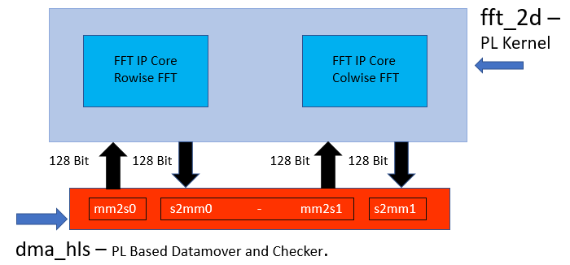

<table>
 <tr>
   <td align="center"><h1>2021.1 Versal™ 2D-FFT Tutorial (DSP Implementation)</h1>
   </td>
 </tr>
</table>

# Table of Contents
[Building the Design](#Building-the-Design)

[Hardware Design Details](#Hardware-Design-Details)

[Software Design Details](#Software-Design-Details)

[Resource Utilization, Power, Throughput & Latency and Performance per Watt](#Resource-Utilization-Power-Throughput--Latency-and-Performance-per-Watt)

# Building the Design

<details>
<summary>Design Build</summary> 
	
## Design Build
In this section, you will build and run the 2D-FFT design using the DSP implementation. You will compile the DSP design and integrate it into a larger system design (including the Programmable Logic (PL) kernels and Processing System (PS) host application). You can review the References section for more details for Integrating the DSP Designs.

At the end of this section, the design flow will generate a new directory (called `build/`). Underneath are sub-directories named `fft2d_$(MAT_ROWS)x$(MAT_COLS)/x$(FFT_2D_INSTS)/` (for example, fft2d_1024x2048/x1/) depending on value of matrix dimensions `${MAT_ROWS}`, `${MAT_COLS}` and number of instances `$(FFT_2D_INSTS)` chosen in the build. Each sub-directory contains the `hw_emu/`, and/or `hw/` subfolders. The respective subfolders contain host app executable and the builds, targeted to `hw` or `hw_emu` respectively. The `hw_emu/` subfolder contains the build for hardware emulation. The `hw/` subfolder contains the build for hardware run on a VCK190 board.

</details>

<details>
<summary>Make Steps</summary> 
	
## Make Steps
To run the following `make` steps (e.g. `make kernels`, `make xclbin`, etc), you must be in the `DSP/` folder.\
Below are the `options` that can be specified in the make steps, see the make steps below for instructions how to apply them

`TARGET:` It can be set to hw or hw_emu to build the design in hardware or hardware emulation flow. Default is `hw_emu`

`FFT_2D_INSTS:` It can be set to 1, 5, or 10 to build the design with the number of kernel instances. Default is `1`

`ITER_CNT:` Number of iterations the design is run. Default is `8`

`FFT_2D_PT`: FFT 2D Point. Permissible values `64, 128, 256, 512 and 2048`

Dimensions of the Matrix:\
`MAT_ROWS x MAT_COLS:` Automatically configured as `FFT_2D_PT/2, FFT_2D_PT` -\
Number of Rows in the Input Matrix x Number of Cols in the Input Matrix,\
permissible values are `32x64, 64x128, 128x256, 256x512 and 1024x2048`. Default is `1024x2048`

`EN_TRACE:` Flag to enable trace-profiling. 0 is disabled and 1 is enabled. Default is `0 (disabled)`

The Makefile uses the below directory references:
```
# Relative fft_2d directory
RELATIVE_PROJECT_DIR := ./

# Absolute fft_2d directory = <user path>/Tutorials/AI_Engine/fft_2d
PROJECT_REPO := $(shell readlink -f $(RELATIVE_PROJECT_DIR))

DESIGN_REPO  := $(PROJECT_REPO)/design
HOST_APP_SRC := $(DESIGN_REPO)/host_app_src
PL_SRC_REPO  := $(DESIGN_REPO)/pl_src
DIRECTIVES_REPO        := $(DESIGN_REPO)/directives
SYSTEM_CONFIGS_REPO    := $(DESIGN_REPO)/system_configs
PROFILING_CONFIGS_REPO := $(DESIGN_REPO)/profiling_configs
BASE_BLD_DIR     := $(PROJECT_REPO)/build
FFTPT_BLD_DIR    := $(BASE_BLD_DIR)/fft2d_$(MAT_ROWS)x$(MAT_COLS)
INSTS_BLD_DIR    := $(FFTPT_BLD_DIR)/x$(FFT_2D_INSTS)
BUILD_TARGET_DIR := $(INSTS_BLD_DIR)/$(TARGET)
```

</details>

<details>
<summary>Build the Entire Design with a Single Command</summary>
	
## Build the Entire Design with a Single Command
If you are already familiar with the DSP and Vitis kernel compilation flows, you can build the entire design for each case of `FFT_2D_INSTS` with one command: 

```bash
make run (default hardware emulation, 1 instance, iterations=8, matrix dimentions rows=1024 and columns=2048, no trace-profiling )
```
or 
```bash
make run TARGET=hw FFT_2D_INSTS=5 ITER_CNT=16 EN_TRACE=1 FFT_2D_PT=64 (hardware, 5 instances, 16 iterations, enable trace profiling, matrix dimentions rows=32 and columns=64 )
```

This command will run the `make kernels`,`make xclbin`,`make application`,`make package` and `make run_emu` for hardware emulation or to run on hardware (VCK190 board) depending on the `TARGET` you specify. The settings also apply to individual make steps listed below.

**Note**

1) The generated files for each `FFT_2D_INSTS` are placed under invididual directory: `$(BUILD_TARGET_DIR)/`
2) See the specification in each make step below for options used and location of input and output files.

</details>

### The individual make steps to build the design with the options that applied to them are specified below

<details>
<summary>make kernels: Compile PL Kernels</summary> 
 
## make kernels: Compile PL Kernels
In this step, the Vitis compiler takes any V++ kernels (RTL or HLS C) in the PL region of the target platform (`xilinx_vck190_base_202110_1`) and the DSP kernels and graph and compiles them into their respective XO files. 

The following commands compiles the kernels (default TARGET=hw_emu, FFT_2D_INSTS=1, ITER_CNT=8 and FFT_2D_PT=2048). 

```
make kernels
```

The expanded command is as follows:

for fft_2d
```
mkdir -p $(BUILD_TARGET_DIR); \

cd $(BUILD_TARGET_DIR); \

v++ --target hw_emu --hls.pre_tcl $$(DIRECTIVES_REPO)/hls_pre.tcl \
   --hls.clock 500000000:fft_2d -D MAT_ROWS=1024 -D MAT_COLS=2048 \
   --platform xilinx_vck190_base_202110_1 --save-temps --temp_dir $(BUILD_TARGET_DIR)/_x \
   --verbose -g -c -k fft_2d $(DESIGN_REPO)/pl_src/fft_2d.cpp -o $(BUILD_TARGET_DIR)/fft_2d.hw_emu.xo
```

for dma_hls
```
mkdir -p $(BUILD_TARGET_DIR); \

cd $(BUILD_TARGET_DIR); \

v++ --target hw_emu --hls.clock 250000000:dma_hls --platform xilinx_vck190_base_202110_1 \
   --save-temps --temp_dir $(BUILD_TARGET_DIR)/_x --verbose -g -c -k dma_hls \
   $(DESIGN_REPO)/pl_src/dma_hls.cpp -o $(BUILD_TARGET_DIR)/dma_hls.hw_emu.xo
```
[Detailed Desicription of All Vitis Compiler Switches](https://www.xilinx.com/html_docs/xilinx2021_1/vitis_doc/vitiscommandcompiler.html#wrj1504034328013)\
Summary of the Switches used:
|Switch|Description|
|  ---  |  ---  |
|--target \| -t [hw\|hw_emu]|Specifies the build target.|
|--hls.pre_tcl \<arg\>|Specifies a Tcl file containing Tcl commands for `vitis_hls` to source before running `csynth_design`. [Details on HLS Options](https://www.xilinx.com/html_docs/xilinx2021_1/vitis_doc/vitiscommandcompiler.html?hl=hls.pre_tcl#mcj1568640526180)|
|--platform \| -f|Specifies the name of a supported acceleration platform as specified by the $PLATFORM_REPO_PATHS environment variable or the full path to the platform XPFM file.|
|--save-temps \| -s|Directs the Vitis compiler command to save intermediate files/directories created during the compilation and link process. Use the `--temp_dir` option to specify a location to write the intermediate files to.|
|--temp_dir <string>|This allows you to manage the location where the tool writes temporary files created during the build process. The temporary results are written by the Vitis compiler, and then removed, unless the `--save-temps` option is also specified.|
|--verbose|Display verbose/debug information.|
|--compile \| -c|Required for compilation to generate XO files from kernel source files.|
|--kernel \<arg\>\|-k \<arg\>|Compile only the specified kernel from the input file. Only one -k option is allowed per Vitis compiler command.|
|-D \| --define  \<Macro Name\>=\<value\>|Defines Macros for the compiler.|
|--output \| -o|Specifies the name of the output file generated by the V++ command. The DMA HLS kernels output should be XO.|

|Input|Description|
|  ---  |  ---  |
|$(PL_SRC_REPO)/fft_2d.cpp|Defines the fft_2d PL kernel.|
|$(PL_SRC_REPO)/dma_hls.cpp|Defines the data-mover PL kernel.|

|Output|Description|
|  ---  |  ---  |

|$(BUILD_TARGET_DIR)/dma_hls.hw_emu.xo|The data-mover kernel object file.|

</details>

<details>
<summary>make xclbin: Use Vitis Tools to Link DSP and HLS Kernels with the Platform</summary> 
 
## make xclbin: Use Vitis Tools to Link HLS Kernels with the Platform
After the HLS kernels have been compiled, you can use the Vitis compiler to link them with the platform to generate a XCLBIN file. 

The Vitis tools allow you to integrate the HLS kernels into an existing extensible platform. This is an automated step from a software developer perspective where the platform chosen is provided by the hardware designer (or you can opt to use one of the many extensible base platforms provided by Xilinx and the Vitis tools build the hardware design and integrate the HLS kernels into the design).
 
To test this feature in this tutorial, use the base VCK190 platform to build the design.
 
The command to run this step is shown as follows ( default TARGET=hw_emu, FFT_2D_INSTS=1, ITER_CNT=8, EN_TRACE=0, FFT_2D_PT=2048 ):
```
make xclbin
``` 

The expanded command is as follow: 
```
cd $(BUILD_TARGET_DIR);	\

v++ -l --platform xilinx_vck190_base_202110_1 --save-temps --temp_dir $(BUILD_TARGET_DIR)/_x \
   --verbose -g --clock.freqHz 500000000:fft_2d_0 --clock.freqHz 250000000:dma_hls_0 --clock.defaultTolerance 0.001 \
   --advanced.param compiler.userPostSysLinkOverlayTcl=$(DIRECTIVES_REPO)/cdc_async.tcl \
   --config $(SYSTEM_CONFIGS_REPO)/x1.cfg --vivado.prop fileset.sim_1.xsim.simulate.log_all_signals=true \
   --vivado.prop run.synth_1.{STEPS.SYNTH_DESIGN.ARGS.CONTROL_SET_OPT_THRESHOLD}={16} \
   --vivado.prop run.impl_1.{strategy}={Performance_NetDelay_low} \
   --vivado.prop run.impl_1.{STEPS.OPT_DESIGN.ARGS.DIRECTIVE}={Explore} \
   -t hw_emu -o $(BUILD_TARGET_DIR)/vck190_dsp_fft_2d.hw_emu.xclbin $(BUILD_TARGET_DIR)/fft_2d.hw_emu.xo \
   $(BUILD_TARGET_DIR)/dma_hls.hw_emu.xo
```
The above vivado.prop settings are for every variation except for 10 instance variation for 256x512 and 1024x2048,\
below are the respective settings for them:

for 256x512 - x10 design:
```
   --vivado.prop run.synth_1.{STEPS.SYNTH_DESIGN.ARGS.CONTROL_SET_OPT_THRESHOLD}={16}
   --vivado.prop run.impl_1.{strategy}={Performance_HighUtilSLRs}
   --vivado.prop run.impl_1.{STEPS.OPT_DESIGN.ARGS.DIRECTIVE}={Explore}
   --vivado.prop run.impl_1.{STEPS.PHYS_OPT_DESIGN.ARGS.DIRECTIVE}={AggressiveExplore}
   --vivado.prop run.impl_1.{STEPS.ROUTE_DESIGN.ARGS.DIRECTIVE}={AggressiveExplore}
```

for 1024x2048 - x10 design:
```
   --vivado.prop run.synth_1.{STEPS.SYNTH_DESIGN.ARGS.CONTROL_SET_OPT_THRESHOLD}={16}
   --vivado.prop run.impl_1.{strategy}={Performance_HighUtilSLRs}
   --vivado.prop run.impl_1.{STEPS.OPT_DESIGN.ARGS.DIRECTIVE}={AddRemap}
```

If EN_TRACE is enabled, the following v++ flags are also set
```
   --profile.data dma_hls:all:all or profile.data dma_hls:all:strmInp_from_colwiseFFT (for higher instances) \
   --profile.trace_memory DDR
```
For higher values of FFT_2D_INSTS, only the `strmInp_from_colwiseFFT` port is profiled to avoid too much data.

[Detailed Description of Vitis Linking Options](https://www.xilinx.com/html_docs/xilinx2021_1/vitis_doc/buildingdevicebinary.html#mjs1528399150499)\
Summary of the Switches Used:
|Switch|Description|
|  ---  |  ---  |
|--platform \| -f|Specifies the name of a supported acceleration platform as specified by the $PLATFORM_REPO_PATHS environment variable or the full path to the platform XPFM file.|
|--save-temps \| -s|Directs the V++ command to save intermediate files/directories created during the compilation and link process. Use the `--temp_dir` option to specify a location to write the intermediate files to.|
|--temp_dir <string>|This allows you to manage the location where the tool writes temporary files created during the build process. The temporary results are written by the Vitis compiler, and then removed, unless the `--save-temps` option is also specified.|
|--verbose|Display verbose/debug information.|
|--output \| -o|Specifies the name of the output file generated by the V++ command. In this design the outputs of the DMA HLS kernels and the PL kernels interfacing with the DSP are in XO files.|
|--vivado.prop \<arg\>|Specifies properties for the Vivado Design Suite to be used during synthesis and implementation of the FPGA binary (xclbin). [Detailed Vivado Options](https://www.xilinx.com/html_docs/xilinx2021_1/vitis_doc/vitiscommandcompiler.html#pbx1568640588680)|
|--profile.data [<kernel_name>\|all]:[<cu_name>\|all]:[<interface_name>\|all]\(:[counters\|all]\)|Enables monitoring of data ports through the monitor IPs. This option needs to be specified during linking. [Detailed Profiling Options](https://www.xilinx.com/html_docs/xilinx2021_1/vitis_doc/vitiscommandcompiler.html#lpy1600804966354)|
|--profile.trace_memory \<FIFO\>:\<size\>\|\<MEMORY\>[\<n\>]|When building the hardware target \(-t=hw\), use this option to specify the type and amount of memory to use for capturing trace data. [Detailed Profiling Options](https://www.xilinx.com/html_docs/xilinx2021_1/vitis_doc/vitiscommandcompiler.html#lpy1600804966354)|
|--config <config_file>|Specifies a configuration file containing V++ switches. Described Below|

The information to tell the linker how to connect the DSP and PL kernels together is described in a configuration file `system_configs/x$(FFT_2D_INSTS).cfg`. The file describes the overall connection scheme of the system.

```
[connectivity]
nk=fft_2d:1:fft_2d_0
nk=dma_hls:1:dma_hls_0

#Connections For FFT-2D Insts 0...
stream_connect=dma_hls_0.strmOut_to_rowiseFFT:fft_2d_0.strmFFTrows_inp
stream_connect=fft_2d_0.strmFFTrows_out:dma_hls_0.strmInp_from_rowiseFFT
stream_connect=dma_hls_0.strmOut_to_colwiseFFT:fft_2d_0.strmFFTcols_inp
stream_connect=fft_2d_0.strmFFTcols_out:dma_hls_0.strmInp_from_colwiseFFT

[advanced]
# Disable Profiling in hw_emu so that it is faster...
param=hw_emu.enableProfiling=false

# Export the xsa of the design..
param=compiler.addOutputTypes=hw_export
```

[Detailed Description of Vitis Compiler Configuration File](https://www.xilinx.com/html_docs/xilinx2021_1/vitis_doc/vitiscommandcompiler.html?hl=--config#pni1524163195211)\
Summary of Configuration Options Used:
|Switch|Comment|
|  ---  |  ---  |
|--connectivity.nk|Number of kernels. `dma_hls:1:dma_hls_0` means that the Vitis compiler should instantiate one dma_hls kernel and name the instance `dma_hls_0`.|
|--connectivity.stream_connect|How the kernels will connect to IPs, platforms, or other kernels. The output of the DSP compiler tell you the interfaces that need to be connected. `dma_hls_0.strmOut_to_rowiseFFT:fft_2d_0.strmFFTrows_inp` means that the Vitis compiler should connect the port `strmOut_to_rowiseFFT` of `dma_hls_0` HLS kernel to the `strmFFTrows_inp` of the `fft_2d_0` HLS kernel.|
|param=compiler.addOutputTypes=hw_export| This option tells the Vitis compiler that besides creating an XCLBIN file, it also outputs an XSA file which is needed to create a post-Vivado fixed platform for Vitis software developement.|

Note that the Vitis compiler calls Vivado® IP integrator under the hood to build the design. The platform and kernels are input to the Vivado Design Suite, which produces a simulation XSA or an XSA after running place and route on the design. The point at which the XSA is produced from Vivado is dependent on what `-target` option is set on the the Vitis compiler command line. 

Note that you can now view the Vivado project, which is located in the `$(BUILD_TARGET_DIR)/_x/link/vivado/vpl/prj` directory.

Now you have generated the XCLBIN file, `$(BUILD_TARGET_DIR)/vck190_dsp_fft_2d.hw_emu.xclbin`that will be used to execute your design on the platform.

</details>

<details>
<summary>make application: Compile the Host Application</summary> 

## make application: Compile the Host Application
You can compile the host application by following the typical cross-compilation flow for the Cortex-A72. To build the application run the following command (default FFT_2D_INSTS=1, ITER_CNT=8, FFT_2D_PT=2048 ):
```
make application
```
or
```
cd $(BUILD_TARGET_DIR);	\

aarch64-xilinx-linux-g++ -mcpu=cortex-a72.cortex-a53 -march=armv8-a+crc -fstack-protector-strong \
   -D_FORTIFY_SOURCE=2 -Wformat -Wformat-security -Werror=format-security --sysroot=$(SDKTARGETSYSROOT) -O -c \
   -std=c++14 -D__linux__ -DFFT2D_INSTS=10 -DITER_CNT=8 -DMAT_ROWS=1024 -DMAT_COLS=2048 \
   -I$(SDKTARGETSYSROOT)/usr/include/xrt -I$(SDKTARGETSYSROOT)/usr/include -I$(SDKTARGETSYSROOT)/usr/lib \
   -I$(HOST_APP_SRC) $(HOT_APP_SRC)/fft_2d_dsp_app.cpp -o $(BUILD_TARGET_DIR)/fft_2d_dsp_app.o \
   -L$(SDKTARGETSYSROOT)/lib -lxrt_coreutil

aarch64-xilinx-linux-g++  -mcpu=cortex-a72.cortex-a53 -march=armv8-a+crc -fstack-protector-strong \
   -D_FORTIFY_SOURCE=2 -Wformat -Wformat-security -Werror=format-security --sysroot=$(SDKTARGETSYSROOT) \
   $(BUILD_TARGET_DIR)/fft_2d_dsp_app.o -L$(SDKTARGETSYSROOT)/usr/lib -lxrt_coreutil \
   -o $(BUILD_TARGET_DIR)/fft_2d_dsp_xrt.elf
```
[XRT Documentation](https://xilinx.github.io/XRT/2021.1/html/index.html)\
[Details of Host Application Programming](https://www.xilinx.com/html_docs/xilinx2021_1/vitis_doc/devhostapp.html#vpy1519742402284)
|Switch|Description|
|  ---  |  ---  |
|-O \| Optimize.| Optimizing compilation takes somewhat more time, and a lot more memory for a large function. With -O, the compiler tries to reduce code size and execution time, without performing any optimizations that can take a great deal of compilation time.|
|-D__linux__|
|-DXAIE_DEBUG|Enable debug interface capabilities where certain core status, event status, or stack trace can be dumped out.|
|-D\<Pre-processor Macro String\>=\<value\>|Pass Pre-processor Macro definitions to the cross-compiler.|
|-I \<dir\>|Add the directory `dir` to the list of directories to be searched for header files.|
|-o \<file\>|Place output in file `<file>`. This applies regardless of the output being produced, whether it be an executable file, an object file, an assembler file or preprocessed C code.|
|--sysroot=\<dir\>|Use `dir` as the logical root directory for headers and libraries. For example, if the compiler would normally search for headers in `/usr/include` and libraries in `/usr/lib`, it will instead search `dir/usr/include` and `dir/usr/lib`. This is automatically set by the `env_setup.sh` script|
|-l\<library\>|Search the library named `library` when linking. The 2D-FFT tutorial requires `adf_api_xrt` and `xrt_coreutil` libraries.|
|-L \<dir\>|Add directory `<dir>` to the list of directories to be searched for -l.|

The following is a description of the input sources compiled by the DSP compiler command. 

|Inputs Sources|Description|
|  ---  |  ---  |
|$(HOST_APP_SRC)/fft_2d_dsp_app.cpp|Source application file for the `fft_2d_dsp_xrt.elf` that will run on an A72 processor.|

The following is a description of the output objects that results from executing the DSP compiler command with the above inputs and options. 

|Output Objects|Description|
|  ---  |  ---  |
|$(BUILD_TARGET_DIR)/fft_2d_dsp_xrt.elf|The executable that will run on an A72 processor.|

</details>

<details>
<summary>make package: Package the Design</summary> 
 
## make package: Package the Design
With the DSP outputs created, as well as the new platform, you can now generate the Programmable Device Image (PDI) and a package to be used on an SD card. The PDI contains all executables, bitstreams, configurations of the device. The packaged SD card directory contains everything to boot Linux, the generated applications and `.xclbin`.

The command to run this step is as follows (default TARGET=hw_emu, EN_TRACE=0, FFT_2D_INSTS=1, FFT_2D_PT=2048 ):
```
make package
``` 

or 
```
cp $(PROJECT_REPO)/run_script.sh $(BUILD_TARGET_DIR)/
cd $(BUILD_TARGET_DIR);	\

v++ -p -t hw --save-temps --temp_dir $(BUILD_TARGET_DIR)/_x -f xilinx_vck190_base_202110_1 \
   --package.rootfs $(XLNX_VERSAL)/rootfs.ext4 --package.kernel_image $(XLNX_VERSAL)/Image --package.boot_mode=sd \
   --package.out_dir $(BUILD_TARGET_DIR)/package --package.image_format=ext4 --package.sd_file $(BUILD_TARGET_DIR)/fft_2d_dsp_xrt.elf \
   $(BUILD_TARGET_DIR)/vck190_dsp_fft_2d.hw.xclbin
```

If EN_TRACE is enabled, the following v++ flags are also set
```
   --package.sd_file $(PROFILING_CONFIGS_REPO)/xrt.ini
```

If XRT_ROOT is set, the following v++ flags are also set
```
   --package.sd_dir $(XRT_ROOT)
```
[Details of Packaging the System](https://www.xilinx.com/html_docs/xilinx2021_1/vitis_doc/packagesystem1.html#cwq1586366344968)
|Switch|Description|
|  ---  |  ---  |
|--target \| -t [hw\|hw_emu]|Specifies the build target.|
|--package \| -p|Packages the final product at the end of the Vitis compile and link build process.|
|--package.rootfs \<arg\>|Where \<arg\> specifies the absolute or relative path to a processed Linux root file system file. The platform RootFS file is available for download from xilinx.com. Refer to the Vitis Software Platform Installation for more information.|
|--package.kernel_image \<arg\>|Where \<arg\> specifies the absolute or relative path to a Linux kernel image file. Overrides the existing image available in the platform. The platform image file is available for download from xilinx.com. Refer to the Vitis Software Platform Installation for more information.|
|--package.boot_mode \<arg\>|Where \<arg\> specifies <ospi\|qspi\|sd> Boot mode used for running the application in emulation or on hardware.|
|--package.image_format|Where \<arg\> specifies \<ext4\|fat32\> output image file format. `ext4`: Linux file system and `fat32`: Windows file system|
|--package.sd_file|Where \<arg\> specifies an ELF or other data file to package into the `sd_card` directory/image. This option can be used repeatedly to specify multiple files to add to the `sd_card`.|

|Inputs Sources|Description|
|  ---  |  ---  |
|$(XRT_ROOT)|The PS Host Application needs the XRT headers in this folder to execute. Set in the `env_setup.sh`|
|$(XLNX_VERSAL)/rootfs.ext4|The Root Filesystem file for Petalinux.|
$(XLNX_VERSAL)/Image|The pre-built Petalinux Image the processor boots from.|
|$(BUILD_TARGET_DIR)/fft_2d_dsp_xrt.elf|The PS Host Application executabled created in the `make application` step.|
|$(BUILD_TARGET_DIR)/vck190_dsp_fft_2d.hw_emu.xclbin|The XCLBIN file created in the `make xclbin` step.|

The output of the V++ Package step is the package directory that contains the contents to run hardware emulation. 

|Output Objects|Description|
|  ---  |  ---  |
|$(BUILD_TARGET_DIR)/package|The hardware emulation package that contains the boot file, hardware emulation launch script, the PLM and PMC boot files, the PMC and QEMU command argument specification files, and the Vivado simulation folder.|

</details>

<details>
<summary>make run_emu: Run Hardware Emulation</summary>

## make run_emu: Run Hardware Emulation
After packaging, everything is set to run emulation or hardware. 
To run emulation use the following command ( default TARGET=hw_emu ):
```
make run_emu 
```
or
```
###########################################################################
Hardware Emulation Goto:
$(BUILD_TARGET_DIR)/package

and do:
./launch_hw_emu.sh or ./launch_hw_emu.sh -g (for waveform viewer)...

```
When launched, you will see the QEMU simulator load. Wait for the autoboot countdown to go to zero, and after a few minutes, you will see the root Linux prompt come up: 
```bash
root@versal-rootfs-common-2021.1:~#
```
After the root prompt comes up, run the following commands to run the design:  
```
mount /dev/mmcblk0p1 /mnt
cd /mnt
export XILINX_XRT=/usr
./fft_2d_dsp_xrt.elf a.xclbin
```
The `fft_2d_dsp_xrt.elf` should execute, and after a few minutes, you should see the output with *TEST PASSED* on the console. When this is shown, run the following keyboard command to exit the QEMU instance: 

```
#To exit QEMU Simulation
Press CtrlA, let go of the keyboard, and then press x 
```

To run with waveform do the following:
```
cd $(BUILD_TARGET_DIR)/package
./launch_hw_emu.sh -g
```
The XSIM Waveform Viewer is launched. Drag and drop the signals into the Viewer and click Play to start the emulation. Go back to the terminal and wait for the Linux prompt to show up. 

In the XSIM Waveform Viewer, you will see the signals you added to the waveform adjusting over the execution of the design. Once done, hit the pause button and close the window to end the emulation.\
\
Waveform View of the 32x64 - 1x design:\


</details>

<details>
<summary>TARGET=hw: Run on Hardware</summary>

## Run on Hardware

To run the design in hardware, re-run the following "make" steps with TARGET=hw and other applicable options (see the make steps above)
```
make kernels TARGET=hw
make xclbin TARGET=hw 
make package TARGET=hw 
```
These command create a `$(BUILD_TARGET_DIR)` folder with the kernels, `xclbin`, and `package` for a hardware run. 

Then run the following step to setup the execution file; the generated images and base images (`$(BUILD_TARGET_DIR)/package/sd_card` and `$(BUILD_TARGET_DIR)/package/sd_card.img`)
```
make run_emu TARGET=hw 
```
These command create a `build/hw` folder with the kernels, `xclbin`, and `package` for a hardware run. 

Now follow **Steps 1-9** to run the `fft_2d_dsp_xrt.elf` excutable on your VCK190 board. 

**Step 1.** Ensure your board is powered off. 

**Step 2.** Use an SD card writer (such as balenaEtcher) to flash the `sd_card.img` file an SD card. 

**Step 3.** Plug the flashed SD card into the top slot of the VCK190 board. 

**Step 4.** Set the switch SW1 Mode\[3:0\]=1110 = OFF OFF OFF ON

**Step 5.** Connect your computer to the VCK190 board using the included USB cable. 

**Step 6.** Open a TeraTerm terminal and select the correct COM port. Set the port settings to the following: 
```
Port: <COMMXX>
Speed: 115200
Data: 8 bit
Parity: none
Stop Bits: 1 bit
Flow control: none
Transmit delay: 0 msec/char 0 msec/line
```

**Step 7.** Power on the board.

**Step 8.** Wait until you see the `root@versal-rootfs-common-2021_1` Linux command prompt. Press enter a few times to get past any `xinit` errors. 

**Step 9.** Run the following commands into the TeraTerm terminal: 
```
cd /mnt/sd-mmcblk0p1
export XILINX_XRT=/usr
./init.sh

./fft_2d_dsp_xrt.elf a.xclbin
```

</details>

# Hardware Design Details
<details>
<summary>2D-FFT DSP Implementation architecture and  DSP/PL Function Partitioning</summary>
	
## 2D-FFT DSP Implementation architecture and  DSP/PL Function Partitioning
The following figure shows a high level block diagram of the design. The test harness consists of the DSP and data-mover-HLS kernels(dma_hls). In this setup, the interface between the data-mover kernels and DSP cores is AXI4-stream, with the data width of 128bit and the data-mover kernel is running at 250Mhz and the DSP-HLS kernel is running at 500MHz.
Datamover is pl-based data generator and checker, it generates impulse input and checks the output of rowise-fft core for response of the same, and subsequently generates the transposed pattern of the rowise fft output and feeds that to the colwise fft core and check the output of .



</details>

<details>
<summary>Design Details</summary>

## Design Details
The design in this tutorial starts with a base platform containing the Control Interface and Processing System (CIPS), NoC, and DSP and the interfaces among them. The v++ linker step builds on top of the base platform by adding the DSP and HLS kernels. To add the various functions in a system level design, PL kernels are added to the base platform depending on the application, that is, the PL kernels present in each design may vary. In the design, the components are added by v++ -l step (make XCLBIN in the tool flow section above) and include the following:
* fft_2d DSP kernel (`fft_2d.[hw|hw_emu].xo`)
* data-mover kernel (`dma_hls.[hw|hw_emu].xo`)
* connections interfaces defined in system configuration file

To see a schematic view of the design with the extended platform as shown in the following figure, open in Vivado 

`build/fft2d_$(MAT_ROWS)x$(MAT_COLS)/x$(FFT_2D_INSTS)/[hw|hw_emu]/_x/link/vivado/vpl/prj/prj.xpr`


In this design, the 2D FFT computation happens in two stages: the first compute is across the row vectors(`fft_rows` function in the `fft_2d` kernel) and the second stage is performed across the column vectors(`fft_cols` function in the `fft_2d` kernel). The input data is accessed linearly and streamed to the DSPs which perform MAT_COLS( default 2048 ) point FFT. The data coming out of the DSPs is streamed to a PL Kernels where it is checked against the expected pattern(First row should be 1 remaining should be 0), mismatch if any is recorded in variable stage0_errCnt. Transposed pattern of the output of the row vectors is then linearly streamed into another DSP which performs MAT_ROWS( default 1024 ) point FFT. The output is streamed into data-mover kernel again and is checked against expected pattern(All values should be 1), mismatch if any is stored in variable stage1_errCnt. Finally the sum of stage0_errCnt and stage1_errCnt is returned from the kernel, which is read in the host app to determine whether the test has passed or failed.

Notice the system debugging and profiling IP (DPA) is added to the PL region of the device to capture DSP run-time trace data if the EN_TRACE option is enabled in the design. The dma_hls kernel is operating at 250 MHz and the DSP kernel are both operating at 500 MHz and unlike the DSP implementation there is no clock domain crossing in the PL region in this design.

</details>

<details>
<summary>DSP and PL Kernels</summary>
	
## DSP and PL Kernels
The top level DSP kernel `fft_2d` contains 2 sub-functions, `fft_rows` and `fft_cols`. Each sub-functions contains the individual DSP kernels which perform `MAT_COLS` and `MAT_ROWS` point FFT respectively.

The PL-based data-movers consist of dma_hls kernel, which generates impulse input and check the output of each fft stage for the expected pattern.

**FFT_2D**
* Internally comprises of 2 functions `fft_rows` and `fft_cols`. Both functions are concurrently scheduled.
* The data width is 128 bits at both the AXI4-stream IO side.
* Working at 500 Mhz.

**DMA_HLS**
* Internally comprises of 4 loops `mm2s0, s2mm0 , mm2s1 and s2mm1`. With `s2mm0 - mm2s1` sequenced one after the other and wrapped into `dmaHls_rowsToCols function and, mm2s0, dmaHls_rowsToCols and s2mm1` concurrently scheduled.
* The data width is 128 bits at both the AXI4-stream IO side.
* Working at 250 Mhz.

</details>

# Software Design Details
The software design in the DSP 2D-FFT tutorial consists of the following sections:

<details>
<summary>Methodology</summary>

## Methodology
The following figure elaborates on the DSP Implementation Methodology.


### DSP
* **Concurent Scheduling** \
The concurrent scheduling is required so that each function is independently running and the execution of one function is not blocking the other.\
Both DSP sub-functions `fft_rows` and `fft_cols` are configured independent of each other, with concurrent scheduling done using the `#pragma HLS DATAFLOW`.
```
...
#pragma HLS DATAFLOW

ITER_LOOP_FFT_ROWS:for(int i = 0; i < iterCnt; ++i) {
   fft_rows(strmFFTrows_inp, strmFFTrows_out);
}

ITER_LOOP_FFT_COLS:for(int i = 0; i < iterCnt; ++i) {
   fft_cols(strmFFTcols_inp, strmFFTcols_out);
}
...
```

* **Sub-functions are Pipelined and Setup in DATAFLOW** \
Pipelining reduces the initiation interval (II) for a function or loop by allowing the concurrent execution of operations. The default type of pipeline is defined by the config_compile -pipeline_style command, but can be overridden in the [PIPELINE pragma](https://www.xilinx.com/html_docs/xilinx2021_1/vitis_doc/hls_pragmas.html#fde1504034360078) or directive.\
The [DATAFLOW pragma](https://www.xilinx.com/html_docs/xilinx2021_1/vitis_doc/hls_pragmas.html#sxx1504034358866) enables task-level pipelining as described in [Exploiting Task Level Parallelism: Dataflow Optimization](https://www.xilinx.com/html_docs/xilinx2021_1/vitis_doc/vitis_hls_optimization_techniques.html#bmx1539734225930), allowing functions and loops to overlap in their operation, increasing the concurrency of the RTL implementation and increasing the overall throughput of the design.\
All operations are performed sequentially in a C description. In the absence of any directives that limit resources (such as pragma HLS allocation), the Vitis HLS tool seeks to minimize latency and improve concurrency. However, data dependencies can limit this. For example, functions or loops that access arrays must finish all read/write accesses to the arrays before they complete. This prevents the next function or loop that consumes the data from starting operation. The DATAFLOW optimization enables the operations in a function or loop to start operation before the previous function or loop completes all its operations.\
Functions `fft_rows` does `MAT_COLS` point FFT and runs for `MAT_ROWS` number of Iterations and vice-versa for the `fft_cols` function. Each loops within these functions are pipelined with `II=1` and, are called under dataflow. Showing the `fft_rows` functions as example:
```
...
LOOP_FFT_ROWS:for(int i = 0; i < MAT_ROWS; ++i) {

   #pragma HLS DATAFLOW

   readIn_row(strm_inp, in);  // Pipelined with II=1 inside...
   
   fftRow(directionStub, in, out, &ovfloStub);

   writeOut_row(strm_out, out);  // Pipelined with II=1 inside...
}
...
```
Pipelining reduces the execution latency and establishing dataflow within the sub-functions reduces all overhead latency in terms of reading/writing input and output respectively. As shown in the diagram below:\


* **Vitis HLS Scheduling and Dataflow View For FFT_2D**
\


### Data-Mover
* **Data Generation/Checking and Sequencing** \
The data-mover comprises of 4 loops `mm2s0, s2mm0, mm2s1 and s2mm1`.\
`s2mm0 and mm2s1` are wrapped into a single function `dmaHls_rowsToCols`. Within that the execution sequence is `s2mm0` followed by `mm2s1`. `s2mm0 and s2mm1` functions check the output of `rowise and colwise fft` respectively, against expected golden.

* **Concurrent Scheduling** \
The concurrent scheduling is required so that each function is independently running and the execution of one function is not blocking the other.\
The concurrent scheduling of the 3 functions `mm2s0, dmaHls_rowsToCols and s2mm1`, done as below using `#pragma HLS DATAFLOW`.
```
#pragma HLS DATAFLOW
...
LOOP_ITER_MM2S0:for(int i = 0; i < iterCnt; ++i)
{
   #pragma HLS loop_tripcount min=1 max=8
   
   mm2s0(strmOut_to_rowiseFFT, matSz);
}

LOOP_ITER_S2MM0_TO_MM2S1:for(int i = 0; i < iterCnt; ++i)
{
   #pragma HLS loop_tripcount min=1 max=8
   
   dmaHls_rowsToCols(strmInp_from_rowiseFFT, strmOut_to_colwiseFFT, \
                     matSz, rows, cols, stg0_errCnt, goldenVal);
}

LOOP_ITER_S2MM1:for(int i = 0; i < iterCnt; ++i)
{
   #pragma HLS loop_tripcount min=1 max=8
   
   s2mm1(strmInp_from_colwiseFFT, matSz, stg1_errCnt, goldenVal);
}
...
```

* **Vitis HLS Scheduling and Dataflow View for DMA_HLS**


### Streaming Interface Data-width
Streaming Interface Data-width is kept as `128Bit` to reduce Read/Write overhead while processing data.

### Frequency Selection
In the DSP Engine Implementation due to timing closure limitations the `fft_2d` kernel is kept at 500Mhz and data-mover is kept at 250Mhz.

### Timing Closure
For timing closure of the whole design the different `implementation` properties are used as mentioned in the `make xclbin` step above.\
Such strategies are required as the timing closure will not happen for the design with default implementation settings.\
For the purposes of timing closure of `256x512 point - x10` and `1024x2048 point - x10` designs, over 200 Implementation Strategies were used , out of which 3 met timing, out of that the ones with least power were chosen as the implementation strategy in the `v++ -l / make xclbin` step.\
[Vivado Implementation User Guide](https://www.xilinx.com/support/documentation/sw_manuals/xilinx2021_1/ug904-vivado-implementation.pdf)

</details>

<details>
<summary>DSP Kernel Representation</summary>
	
## DSP Kernel Representation
An DSP kernel comprises of FFT IP logiCORE([FFT Core Overview](https://www.xilinx.com/products/intellectual-property/fft.html#overview)) intantiated in the HLS-kernel via, [HLS FFT Library](https://www.xilinx.com/html_docs/xilinx2021_1/vitis_doc/hls_ip_libraries.html#pmv1539734237197) additionaly the kernel has the the input and output wrappers for reading and writing data into and out from the FFT core. You can view the function call graph via vitis_hls gui:

The following figure shows the Function Call Graph:


</details>

<details>
<summary>Data Flow</summary>
	
## Data Flow
This section describes the overall data flow of the 2D-FFT design using the DSP-kernel which is compiled using the vitis compiler. Refer to [Compiling HLS Kernels](https://www.xilinx.com/html_docs/xilinx2021_1/vitis_doc/vitiscommandcompiler.html#wrj1504034328013) and writing [HLS Kernels](https://www.xilinx.com/html_docs/xilinx2021_1/vitis_doc/devckernels.html#rjk1519742919747) for information.

The overall definition of fft-2D Kernel is defined in `$(PL_SRC_REPO)/fft_2d.cpp`.

### Define FFT Inputs
Define FFT Core Inputs in `$(PL_SRC_REPO)/fft_config.h`. Based on the Matrix Dimensions `MAT_ROWS` and `MAT_COLS` (Derived from `FFT_2D_PT` in the `Makefile`, and passed to the kernel via `-D` option while vitis compilation), define all the FFT inputs (for Matrix Dimensions) like below for 32x64 point design:
```
#pragma once
...
const char FFT_ROWS_NFFT_MAX       = 6;
const char FFT_ROWS_CONFIG_WIDTH   = 8;
const char FFT_ROWS_STAGES_BLK_RAM = 0;
const char FFT_ROWS_SCALING        = 0;

const char FFT_COLS_NFFT_MAX       = 5;
const char FFT_COLS_CONFIG_WIDTH   = 8;
const char FFT_COLS_STAGES_BLK_RAM = 0;
const char FFT_COLS_SCALING        = 0;
...
```
### Required Headers and Functions Declarations
Include the required headers and declare input and output types:
```
#pragma once

#include <ap_int.h>
#include <ap_fixed.h>
#include <hls_stream.h>
#include <hls_fft.h>
#include <stdbool.h>
#include <complex>
#include <stdint.h>
#include <ap_axi_sdata.h>
#include "fft_config.h"

// Configurable params...
const char FFT_INPUT_WIDTH  = 16;
const char FFT_OUTPUT_WIDTH = FFT_INPUT_WIDTH;

using namespace std;
using namespace hls;

typedef ap_fixed<FFT_INPUT_WIDTH,  1> data_in_t;
typedef ap_fixed<FFT_OUTPUT_WIDTH, 1> data_out_t;

typedef complex<data_in_t>  cmpxDataIn;
typedef complex<data_out_t> cmpxDataOut;
```
and the function declarations.

### FFT Core Config Structure
Define the FFT Config Structure used to instantiate the FFT logiCORE, in `$(PL_SRC_REPO)/fft_2d.h`, shown below for `fft_rows` function:
```
...
struct configRow : hls::ip_fft::params_t {
   static const unsigned ordering_opt = hls::ip_fft::natural_order;
   static const unsigned config_width = FFT_ROWS_CONFIG_WIDTH;
   static const unsigned max_nfft = FFT_ROWS_NFFT_MAX;
   static const unsigned stages_block_ram = FFT_ROWS_STAGES_BLK_RAM;
   static const unsigned input_width = FFT_INPUT_WIDTH;
   static const unsigned output_width = FFT_OUTPUT_WIDTH;
};

typedef hls::ip_fft::config_t<configRow> configRow_t;
typedef hls::ip_fft::status_t<configRow> statusRow_t;
...
```
### Top Function
The function is declared in the `$(PL_SRC_REPO)/fft_2d.h` and is defined in `$(PL_SRC_REPO)/fft_2d.cpp` as below:

```
void fft_2d(
      hls::stream<qdma_axis<128, 0, 0, 0>> &strmFFTrows_inp,
      hls::stream<qdma_axis<128, 0, 0, 0>> &strmFFTrows_out,
      hls::stream<qdma_axis<128, 0, 0, 0>> &strmFFTcols_inp,
      hls::stream<qdma_axis<128, 0, 0, 0>> &strmFFTcols_out,
      uint32_t iterCnt
     )
{
   #pragma HLS interface axis port=strmFFTrows_inp
   #pragma HLS interface axis port=strmFFTrows_out
   #pragma HLS interface axis port=strmFFTcols_inp
   #pragma HLS interface axis port=strmFFTcols_out

   #pragma HLS INTERFACE s_axilite port=iterCnt bundle=control
   #pragma HLS INTERFACE s_axilite port=return bundle=control
   
   #pragma HLS DATAFLOW

   ITER_LOOP_FFT_ROWS:for(int i = 0; i < iterCnt; ++i) {
      fft_rows(strmFFTrows_inp, strmFFTrows_out);
   }

   ITER_LOOP_FFT_COLS:for(int i = 0; i < iterCnt; ++i) {
      fft_cols(strmFFTcols_inp, strmFFTcols_out);
   }
}
```

### Sub-function Details
`fft_rows` and `fft_cols` are similar in structure expect for the configured FFT Point and Loop bounds for the data reading and writing. Detailing `fft_rows` below, it reads data, does fft and writes out the data (`directionStub=1/0 means FFT/IFFT` and `ovfloStub` is returned once fft is done and tell whether over flow has happened or not):
```
void fft_rows(
      hls::stream<qdma_axis<128, 0, 0, 0>> &strm_inp,
      hls::stream<qdma_axis<128, 0, 0, 0>> &strm_out
     )
{
   cmpxDataIn   in[MAT_COLS]; // Partially reshaped (factor=4) below for simultaneous access while reading...
   cmpxDataOut out[MAT_COLS]; // Partially reshaped (factor=4) below for simultaneous access while writing...
   #pragma HLS ARRAY_RESHAPE variable=in cyclic factor=4 dim=1
   #pragma HLS ARRAY_RESHAPE variable=out cyclic factor=4 dim=1
   
   bool directionStub = 1;
   bool ovfloStub;

   LOOP_FFT_ROWS:for(int i = 0; i < MAT_ROWS; ++i) {

      #pragma HLS DATAFLOW // Read Input-followed by FFT-followed by Write Output Called under Dataflow...

      readIn_row(strm_inp, in);
      
      fftRow(directionStub, in, out, &ovfloStub);

      writeOut_row(strm_out, out);
   }
}
```
#### Reading Data
The `readIn_row` function reads data for the `fftRow` functions and it is defined below:
```
void readIn_row(hls::stream<qdma_axis<128, 0, 0, 0>> &strm_inp,
                cmpxDataIn in[MAT_COLS]
               )
{
   qdma_axis<128, 0, 0, 0> qdma;
   data_in_t rval_fix[4], ival_fix[4];
   
   LOOP_FFT_ROW_READ_INP:for(int j = 0; j < MAT_COLS; j += 4) {
      #pragma HLS PIPELINE II=1 // Initialization interval set to 1...

      cmpxDataIn tmp[4];
      #pragma HLS ARRAY_RESHAPE variable=tmp complete dim=1

      qdma = strm_inp.read(); // Reads 128bits (4 words)
      qdma.keep_all();

      // Assigning bits...
      rval_fix[0].range(15, 0) = qdma.data.range( 15,   0);
      ival_fix[0].range(15, 0) = qdma.data.range( 31,  16);

      rval_fix[1].range(15, 0) = qdma.data.range( 47,  32);
      ival_fix[1].range(15, 0) = qdma.data.range( 63,  48);

      rval_fix[2].range(15, 0) = qdma.data.range( 79,  64);
      ival_fix[2].range(15, 0) = qdma.data.range( 95,  80);

      rval_fix[3].range(15, 0) = qdma.data.range(111,  96);
      ival_fix[3].range(15, 0) = qdma.data.range(127, 112);

      // Assigning Corresponding Real and Imaginary Values...
      tmp[0].real(rval_fix[0]);
      tmp[0].imag(ival_fix[0]);

      tmp[1].real(rval_fix[1]);
      tmp[1].imag(ival_fix[1]);
                            
      tmp[2].real(rval_fix[2]);
      tmp[2].imag(ival_fix[2]);
                            
      tmp[3].real(rval_fix[3]);
      tmp[3].imag(ival_fix[3]);

      // Filling the input array...
      in[j] = tmp[0];
      in[j + 1] = tmp[1];
      in[j + 2] = tmp[2];
      in[j + 3] = tmp[3];
   }
}
```

#### FFT Function
`fftRow` function is defined below:
```
//Workaround to make write out side II=1...
void copyRow(cmpxDataOut out_fft[MAT_COLS],
             cmpxDataOut out[MAT_COLS]
            )
{
   LOOP_COPY_ROW:for(int i = 0; i < MAT_COLS; ++i)
   {
      #pragma HLS pipeline
      
      out[i]=out_fft[i];
   }
}

void fftRow(
      bool direction,
      cmpxDataIn   in[MAT_COLS],
      cmpxDataOut out[MAT_COLS],
      bool* ovflo)
{
   #pragma HLS dataflow

   configRow_t fft_config;
   statusRow_t fft_status;
   
   cmpxDataOut out_fft[MAT_COLS];
   #pragma HLS STREAM depth=2 variable=out_fft

   fftRow_init(direction, &fft_config);

   // FFT IP
   hls::fft<configRow>(in, out_fft, &fft_status, &fft_config);
   copyRow(out_fft, out);

   fftRow_status(&fft_status, ovflo);
}
```

#### Writing Out Data
Similar structure as `readIn_row`, `writeOut_row` is defined below:
```
void writeOut_row(hls::stream<qdma_axis<128, 0, 0, 0>> &strm_out,
                  cmpxDataOut out[MAT_COLS]
                 )
{
   qdma_axis<128, 0, 0, 0> qdma;
   data_in_t rval_fix[4], ival_fix[4];

   LOOP_FFT_ROW_WRITE_OUT:for(int j = 0; j < MAT_COLS; j += 4) {
      #pragma HLS PIPELINE II=1

      cmpxDataOut tmp[4];
      #pragma HLS ARRAY_RESHAPE variable=tmp complete dim=1

      tmp[0] = out[j];
      tmp[1] = out[j + 1];
      tmp[2] = out[j + 2];
      tmp[3] = out[j + 3];

      rval_fix[0] = real(tmp[0]);
      ival_fix[0] = imag(tmp[0]);

      rval_fix[1] = real(tmp[1]);
      ival_fix[1] = imag(tmp[1]);
      
      rval_fix[2] = real(tmp[2]);
      ival_fix[2] = imag(tmp[2]);
      
      rval_fix[3] = real(tmp[3]);
      ival_fix[3] = imag(tmp[3]);

      qdma.data.range( 15,   0) = rval_fix[0].range(15, 0);
      qdma.data.range( 31,  16) = ival_fix[0].range(15, 0);

      qdma.data.range( 47,  32) = rval_fix[1].range(15, 0);
      qdma.data.range( 63,  48) = ival_fix[1].range(15, 0);

      qdma.data.range( 79,  64) = rval_fix[2].range(15, 0);
      qdma.data.range( 95,  80) = ival_fix[2].range(15, 0);

      qdma.data.range(111,  96) = rval_fix[3].range(15, 0);
      qdma.data.range(127, 112) = ival_fix[3].range(15, 0);

      strm_out.write(qdma);
   }
}
```
The fft_2d kernel specifies hls pragmas to help optimize the kernel code and adhere to interface protocols. \
[Detailed Documentation of All HLS Pragmas](https://www.xilinx.com/html_docs/xilinx2021_1/vitis_doc/hls_pragmas.html?hl=hls%2Cpragmas)

Summary of hls pragmas used in the kernel:
|Switch|Description|
|  ---  |  ---  |
|#pragma HLS INTERFACE|In C/C++ code, all input and output operations are performed, in zero time, through formal function arguments. In a RTL design, these same input and output operations must be performed through a port in the design interface and typically operate using a specific input/output (I/O) protocol. For more information, see Defining Interfaces. [Detailed Documentation](https://www.xilinx.com/html_docs/xilinx2021_1/vitis_doc/hls_pragmas.html#jit1504034365862)|
|#pragma HLS PIPELINE II=1|Reduces the initiation interval (II) for a function or loop by allowing the concurrent execution of operations. The default type of pipeline is defined by the config_compile -pipeline_style command, but can be overridden in the PIPELINE pragma or directive. [Detailed Documentation](https://www.xilinx.com/html_docs/xilinx2021_1/vitis_doc/hls_pragmas.html#fde1504034360078)|
|#pragma HLS dataflow|The DATAFLOW pragma enables task-level pipelining as described in Exploiting Task Level Parallelism: Dataflow Optimization, allowing functions and loops to overlap in their operation, increasing the concurrency of the RTL implementation and increasing the overall throughput of the design. [Detailed Documentation](https://www.xilinx.com/html_docs/xilinx2021_1/vitis_doc/hls_pragmas.html#sxx1504034358866)|
|#pragma HLS array_reshape|The ARRAY_RESHAPE pragma reforms the array with vertical remapping and concatenating elements of arrays by increasing bit-widths. This reduces the number of block RAM consumed while providing parallel access to the data. This pragma creates a new array with fewer elements but with greater bit-width, allowing more data to be accessed in a single clock cycle. [Detailed Documentation](https://www.xilinx.com/html_docs/xilinx2021_1/vitis_doc/hls_pragmas.html#mrl1504034361747)|

</details>

<details>
<summary>PL Data-Mover Kernel</summary>

## PL Data-Mover Kernel

In addition to the kernels operating in PL region using the DSP Engines, this design also specifies a data-mover kernel to run in the PL region of the device (written in HLS C++). The data-mover kernel is brought into the design during the Vitis kernel compilation. Which is further replicated based on `FFT_2D_INSTS` value. The software design of the data-mover kernel is described below:

### dma_hls (dma_hls.cpp)
The `dma_hls` kernel reads data from a Memory Mapped AXI4 (MM-AXI4) interface and writes it to an AXI4-Stream Interface

#### Top Function Declaration
The `dma_hls` kernel takes the following arguments, as shown in the :
```
int dma_hls(
      hls::stream<qdma_axis<128, 0, 0, 0>> &strmOut_to_rowiseFFT,
      hls::stream<qdma_axis<128, 0, 0, 0>> &strmInp_from_rowiseFFT,
      hls::stream<qdma_axis<128, 0, 0, 0>> &strmOut_to_colwiseFFT,
      hls::stream<qdma_axis<128, 0, 0, 0>> &strmInp_from_colwiseFFT,
      int matSz, int rows, int cols, int iterCnt
     );
```
* `ap_int<N>` is an arbitrary precision integer data type defined in `ap_int.h` where `N` is a bit-size from 1-1024. In this design, the bit-size is set to 128.
* `hls::stream<qdma_axis<D,0,0,0>>` is a data type defined in `ap_axi_sdata.h`. It is a special data class used for data transfer when using a streaming platform. The parameter `<D>` is the data width of the streaming interface which is set to 128. The remaining three parameters should be set to 0.

#### Top Function Definition
Use `dataflow` pragma for concurrently scheduling the three functions `mm2s0, dmaHls_rowsToCols and s2mm1`
```
int dma_hls(
      hls::stream<qdma_axis<128, 0, 0, 0>> &strmOut_to_rowiseFFT,
      hls::stream<qdma_axis<128, 0, 0, 0>> &strmInp_from_rowiseFFT,
      hls::stream<qdma_axis<128, 0, 0, 0>> &strmOut_to_colwiseFFT,
      hls::stream<qdma_axis<128, 0, 0, 0>> &strmInp_from_colwiseFFT,
      int matSz, int rows, int cols, int iterCnt
     )
{
   #pragma HLS INTERFACE axis port=strmOut_to_rowiseFFT
   #pragma HLS INTERFACE axis port=strmInp_from_rowiseFFT
   #pragma HLS INTERFACE axis port=strmOut_to_colwiseFFT
   #pragma HLS INTERFACE axis port=strmInp_from_colwiseFFT
   
   #pragma HLS INTERFACE s_axilite port=matSz bundle=control
   #pragma HLS INTERFACE s_axilite port=rows bundle=control
   #pragma HLS INTERFACE s_axilite port=cols bundle=control
   #pragma HLS INTERFACE s_axilite port=iterCnt bundle=control
   #pragma HLS INTERFACE s_axilite port=return bundle=control  
   
   #pragma HLS DATAFLOW
   
   int stg0_errCnt = 0, stg1_errCnt = 0;
   
	ap_uint<128> goldenVal;

   ap_uint<64> golden64 = 0x0000000100000001;
   goldenVal.range(127, 64) = golden64.range();
   goldenVal.range( 63,  0) = golden64.range();
   

   LOOP_ITER_MM2S0:for(int i = 0; i < iterCnt; ++i)
   {
      #pragma HLS loop_tripcount min=1 max=8
      
      mm2s0(strmOut_to_rowiseFFT, matSz);
   }
   
   LOOP_ITER_S2MM0_TO_MM2S1:for(int i = 0; i < iterCnt; ++i)
   {
      #pragma HLS loop_tripcount min=1 max=8
      
      dmaHls_rowsToCols(strmInp_from_rowiseFFT, strmOut_to_colwiseFFT, \
                        matSz, rows, cols, stg0_errCnt, goldenVal);
   }
   
   LOOP_ITER_S2MM1:for(int i = 0; i < iterCnt; ++i)
   {
      #pragma HLS loop_tripcount min=1 max=8
      
      s2mm1(strmInp_from_colwiseFFT, matSz, stg1_errCnt, goldenVal);
   }

   return (stg0_errCnt + stg1_errCnt);
}
```
The dma_hls kernel also specifies hls pragmas to help optimize the kernel code and adhere to interface protocols.

[Detailed Documentation of All HLS Pragmas](https://www.xilinx.com/html_docs/xilinx2021_1/vitis_doc/hls_pragmas.html?hl=hls%2Cpragmas)\
Summary of hls pragmas used in the kernel:
|Switch|Description|
|  ---  |  ---  |
|#pragma HLS INTERFACE|In C/C++ code, all input and output operations are performed, in zero time, through formal function arguments. In a RTL design, these same input and output operations must be performed through a port in the design interface and typically operate using a specific input/output (I/O) protocol. For more information, see Defining Interfaces. [Detailed Documentation](https://www.xilinx.com/html_docs/xilinx2021_1/vitis_doc/hls_pragmas.html#jit1504034365862)|
|#pragma HLS PIPELINE II=1|Reduces the initiation interval (II) for a function or loop by allowing the concurrent execution of operations. The default type of pipeline is defined by the config_compile -pipeline_style command, but can be overridden in the PIPELINE pragma or directive. [Detailed Documentation](https://www.xilinx.com/html_docs/xilinx2021_1/vitis_doc/hls_pragmas.html#fde1504034360078)|
|#pragma HLS dataflow|The DATAFLOW pragma enables task-level pipelining as described in Exploiting Task Level Parallelism: Dataflow Optimization, allowing functions and loops to overlap in their operation, increasing the concurrency of the RTL implementation and increasing the overall throughput of the design. [Detailed Documentation](https://www.xilinx.com/html_docs/xilinx2021_1/vitis_doc/hls_pragmas.html#sxx1504034358866)|
|#pragma HLS loop_tripcount|When manually applied to a loop, specifies the total number of iterations performed by a loop. The `LOOP_TRIPCOUNT` pragma or directive is for analysis only, and does not impact the results of synthesis. [Detailed Documentation](https://www.xilinx.com/html_docs/xilinx2021_1/vitis_doc/hls_pragmas.html#sty1504034367099)|
 
</details>

<details>
<summary>PS Host Application</summary>
	
## PS Host Application
The 2D-FFT DSP tutorial uses the Embedded processing system (PS) as an external controller to control the DSP and data-mover PL kernels. Review [Programming the PS Host Application Section in the DSP Documentation](https://www.xilinx.com/html_docs/xilinx2021_1/vitis_doc/devhostapp.html#vpy1519742402284) to understand the process to create a host application.

The PS host application (`fft_2d_dsp_app.cpp`) is cross-compiled to get the executable.

The steps in the tutorial to run the A72 application are described as follows:

### 1. Include the required headers and define required Macros
```

#include <stdio.h>
#include <stdlib.h>
#include <stdint.h>
#include <fstream>
#include <iostream>
#include <string>

#include "experimental/xrt_aie.h"
#include "experimental/xrt_kernel.h"
#include "experimental/xrt_bo.h"

#define MAT_SIZE (MAT_ROWS * MAT_COLS)

/////////////////////////////////////////////////
// Due to 128bit Data Transfer all dimensions,
// to be given as by 4.. 
/////////////////////////////////////////////////
#define MAT_SIZE_128b (MAT_SIZE / 4)
#define MAT_ROWS_128b (MAT_ROWS / 4)
#define MAT_COLS_128b (MAT_COLS / 4)
...
```
### 2. Check Command Line Argument
The beginning of the A72 application is represented by the main function. It takes in one command line argument: an XCLBIN file.
`int main(int argc, char** argv)`

### 3. Open XCLBIN and Create Data Mover Kernel Handles
The A72 application loads the XCLBIN binary file and creates the data-mover kernels to be executed on the device. The steps are:

* Open device and load xclbin
```
auto dhdl = xrtDeviceOpen(0);
auto xclbin = load_xclbin(dhdl, xclbinFilename);
auto top = reinterpret_cast<const axlf*>(xclbin.data());
```
* Open fft_2d and data-mover kernel and obtain handles to start HLS PL kernels

for fft_2d DSP kernel
```
...
xrtKernelHandle fft_2d_khdl;
xrtRunHandle fft_2d_rhdl;
...
fft_2d_khdl = xrtPLKernelOpen(dhdl, top->m_header.uuid, fft_2d_obj);
fft_2d_rhdl = xrtRunOpen(fft_2d_khdl);
...
```

for dma_hls PL kernel
```
...
xrtKernelHandle dma_hls_khdl;
xrtRunHandle dma_hls_rhdl;
...
// Open kernel handle exclusively to read the ap_return register later for reporting error...
dma_hls_khdl = xrtPLKernelOpenExclusive(dhdl, top->m_header.uuid, dma_hls_obj);
dma_hls_rhdl = xrtRunOpen(dma_hls_khdl);
...
```

### 4. Execute the Data Mover Kernels and Generate the Output Results
* Set the `fft_2d` kernel arguments using `xrtRunSetArg` function.
* Set the `dma_hls` kernel arguments using `xrtRunSetArg` function.
* Start the `fft_2d` kernels using `xrtRunStart` function.
* Start the `dma_hls` kernels using `xrtRunStart` function.
* Wait for `fft_2d` execution to finish using `xrtRunWait` runction.
* Wait for `dma_hls` execution to finish using `xrtRunWait` runction.

### 5. Verify Output Results
By reading the `ap_return` in `$(BUILD_TARGET_DIR)/_x/dma_hls.$(TARGET)/dma_hls/dma_hls/ip/drivers/dma_hls_v1_0/src/xdma_hls_hw.h` \
Using the `xrtKernelRegister` API, as shown below:
```
void golden_check(uint32_t *errCnt)
{
   //////////////////////////////////////////
   // Compare results
   //////////////////////////////////////////

   // Reading the error count for the ap_return reg of the hls kernel...
   xrtKernelReadRegister(dma_hls_khdl, 0x10, &instance_errCnt);
   std::cout << "fft_2d_" << instsNo << " " << (instance_errCnt ? "Failed!..." : "Passed!...") << "\n" << std::endl;

   // Adding instance error to the total error count...
   *errCnt += instance_errCnt;
}
```

### 6. Release Allocated Resources
After post-processing the data, release the allocated objects and handles using `xrtRunClose`, `xrtKernelClose`, `xrtGraphClose` and `xrtDeviceClose` functions.

</details>

# Resource Utilization, Power, Throughput & Latency and Performance per Watt

For all applications, designers must work to predefined specifications and build a system for their specific deployment by meeting their system requirements with respect to their available resources, latency, throughput, performance and power. In this section, it is outlined how to measure those characteristics for the DSP Engine implementation in this tutorial. 

<details>
<summary>Resource Utilization</summary> 

### Resource Utilization
It is measured by using vivado tool.\
The `Registers`, `CLB LUTs`, `BRAMs` and `DSP` Utilization information can be found in Vivado project. Steps are below:
* Open the vivado proj $(BUILD_TARGET_DIR)/_x/link/vivado/vpl/prj/prj.xpr
* Open Implemented Design -> Click On Report Utilization
* In the below shown Utilization tab select `fft_2d_0` and view the `Registers`, `CLB LUTs`, `BRAMs` and `DSPs` for `1024 x 2048 point - 1 instance` design:


Summary of Resource Utilization for all Variations:
| No. of Instances | FFT Configurations       | FF (Regs) | CLB LUTs | BRAMs | No. of DSP Engines |
|:----------------:|:------------------------:|:---------:|:--------:|:-----:|:------------------:|
| 1                | 64 point (32 x 64)       | 6815      | 4273     | 19    | 8                  |
| 1                | 128 point (64 x 128)     | 7716      | 5122     | 19    | 10                 |
| 1                | 256 point (128 x 256)    | 8454      | 5637     | 21    | 12                 |
| 1                | 512 point (256 x 512)    | 9200      | 5928     | 24    | 14                 |
| 1                | 2048 point (1024 x 2048) | 10836     | 7116     | 33.5  | 18                 |
| 5                | 64 point (32 x 64)       | 33831     | 21447    | 95    | 40                 |
| 5                | 128 point (64 x 128)     | 38255     | 25350    | 95    | 50                 |
| 5                | 256 point (128 x 256)    | 42173     | 27992    | 105   | 60                 |
| 5                | 512 point (256 x 512)    | 45805     | 29199    | 120   | 70                 |
| 5                | 2048 point (1024 x 2048) | 54338     | 35116    | 167.5 | 90                 |
| 10               | 64 point (32 x 64)       | 67634     | 42804    | 190   | 80                 |
| 10               | 128 point (64 x 128)     | 76557     | 51233    | 190   | 100                |
| 10               | 256 point (128 x 256)    | 84334     | 56307    | 210   | 120                |
| 10               | 512 point (256 x 512)    | 91736     | 58501    | 240   | 140                |
| 10               | 2048 point (1024 x 2048) | 108471    | 70475    | 335   | 180                |

</details>

<details>
<summary>Power</summary>

### Power
It is measured by using vivado tool.\
The `power` information can be found in Vivado project. Steps are below:
* Open the vivado proj $(BUILD_TARGET_DIR)/_x/link/vivado/vpl/prj/prj.xpr
* Open Implemented Design -> Click On Report Power
* In the below shown Power tab select `fft_2d_0` and view the `power` consumed for `1024 x 2048 point - 1 instance` design `1024 x 2048 point - 1 instance` design:


Summary of Power Utilization for all Variations:
| No. of Instances | FFT Configurations       | Dynamic Power (in mW) |
|:----------------:|:------------------------:|:---------------------:|
| 1                | 64 point (32 x 64)       | 416                   |
| 1                | 128 point (64 x 128)     | 500                   |
| 1                | 256 point (128 x 256)    | 579                   |
| 1                | 512 point (256 x 512)    | 609                   |
| 1                | 2048 point (1024 x 2048) | 772                   |
| 5                | 64 point (32 x 64)       | 1994                  |
| 5                | 128 point (64 x 128)     | 2314                  |
| 5                | 256 point (128 x 256)    | 2503                  |
| 5                | 512 point (256 x 512)    | 3115                  |
| 5                | 2048 point (1024 x 2048) | 4013                  |
| 10               | 64 point (32 x 64)       | 3809                  |
| 10               | 128 point (64 x 128)     | 4614                  |
| 10               | 256 point (128 x 256)    | 5277                  |
| 10               | 512 point (256 x 512)    | 6040                  |
| 10               | 2048 point (1024 x 2048) | 7875                  |

</details>

<details>
<summary>Throughput & Latency</summary> 

### Throughput & Latency
Throughput is measured in Mega Samples Trasferred per Second (MSPS) and Latency is defined as the time between, when the first sample is sent by data-mover into `fft_rows` function in the `fft_2d_0` kernel and when the first sample from the `fft_cols` function in the `fft_2d_0` kernel is received by the data-mover. It is measured by viewing the runtime generated trace texts via vitis_analzer. Throughput and Latency measurement steps are below:

* Compile the design using `EN_TRACE=1` it automatically includes a xrt.ini file while packaging, which comprises of:
```
[Debug]
xrt_trace=true
data_transfer_trace=fine
trace_buffer_size=500M
```
[Refer to xrt.ini Documentation for more Information](https://www.xilinx.com/html_docs/xilinx2021_1/vitis_doc/xrtini.html#tpi1504034339424).

* After execution on the board transfer the generated `device_trace_0.csv, hal_host_trace.csv and xclbin.run_summary` files back to your system.

* Open `xclbin.ex.run_summary` using vitis_analyzer -> `vitis_analyzer xclbin.ex.run_summary`.

* The snapshot of the timeline trace for the AI Engine 1024x2048 point 1 instance design run with ITER_CNT=8 is shown in the following figure\


* The profiling setup in the Makefile measures the execution time and all the interfaces and for higher instances designs only strmInp_from_colwiseFFT is profiled,\
the calculation of throughput and latency `1024 x 2048 point - 1 instance` design, are as follows:
```
Execution Time:
   = Difference in execution timeline trace
   = (End Timestamp of s2mm1 - Start Timestamp of mm2s0) x (150 / 250)
   = (659384.18us - 606924.1us) x (150 / 250)
   = 33583.7us

Latency:
   = Difference between strmInp_from_colwiseFFT beginning and execution beginning
   = (Start Timestamp of s2mm1 - Start Timestamp of mm2s0) x (150 / 250)
   = (606924.1us - 603411.32us) x (150 / 250)
   = 2107.7us

Throughput = (Samples transferred x Iterations) / execution time
           = (MAT_ROWS x MAT_COLS x ITER_CNT) / execution time
           = (1024 x 2048 x 8) / 33583.7us
           = 499.564 MSamples/s
           = 499.564 x 4 MB/s (As each sample is 4bytes)
           = 1998.256 MB/s
```
**The time stamps are scaled by (150 / 250) due to a known issue, wherein the timeline trace doesn't scale the timestamps based on the changed frequency, but reports it as thought the frequency is the default frequency (150Mhz). As 250Mhz is used for the data-mover and profiling, timestamps have to be scaled by (150 / 250).**

Summary of Throughput & Latency for all Variations:
| No. of Instances | FFT Configurations           | Data Transfer size | Average in MSPS | Aggregate in MSPS |Average Latency in us | Minimum Latency in us |
|:----------------:|:----------------------------:|:------------------:|:---------------:|:-----------------:|:--------------------:|:---------------------:|
| 1                | 64 point (32 x 64)           | 16384              | 477.114         | 477.114           | 2.620                | 2.620                 |
| 1                | 128 point<br/>(64 x 128)     | 65536              | 501.362         | 501.362           | 9.100                | 9.100                 |
| 1                | 256 point<br/>(128 x 256)    | 262144             | 503.887         | 503.887           | 34.354               | 34.354                |
| 1                | 512 point<br/>(256 x 512)    | 1048576            | 503.042         | 503.042           | 133.936              | 133.936               |
| 1                | 2048 point<br/>(1024 x 2048) | 16777216           | 499.564         | 499.564           | 2107.668             | 2107.668              |
| 5                | 64 point (32 x 64)           | 16384              | 448.208         | 2241.038          | 2.620                | 2.620                 |
| 5                | 128 point<br/>(64 x 128)     | 65536              | 494.438         | 2472.190          | 9.100                | 9.100                 |
| 5                | 256 point<br/>(128 x 256)    | 262144             | 502.071         | 2510.355          | 34.330               | 34.330                |
| 5                | 512 point<br/>(256 x 512)    | 1048576            | 502.744         | 2513.721          | 133.603              | 132.334               |
| 5                | 2048 point<br/>(1024 x 2048) | 16777216           | 499.542         | 2497.711          | 2107.748             | 2107.716              |
| 10               | 64 point (32 x 64)           | 16384              | 453.570         | 4535.695          | 2.620                | 2.620                 |
| 10               | 128 point<br/>(64 x 128)     | 65536              | 495.440         | 4954.403          | 9.099                | 9.093                 |
| 10               | 256 point<br/>(128 x 256)    | 262144             | 502.119         | 5021.189          | 34.324               | 34.280                |
| 10               | 512 point<br/>(256 x 512)    | 1048576            | 502.585         | 5025.847          | 133.928              | 133.928               |
| 10               | 2048 point<br/>(1024 x 2048) | 16777216           | 499.544         | 4995.440          | 2107.723             | 2107.716              |


</details>

<details>
<summary>Performance per Watt</summary> 

### Performance per Watt
Performance per Watt is represented as Throughput in MSPS / Power in Watts,\
below is the `Performance per Watt` calculation for `1024 x 2048 point - 1 instance` design:
```
Performance per Watt = Throughput(MSPS) / Power(Watt)
                     = (499.564 / 0.609) MSPS/Watt
                     = 647.10 MSPS/Watt
```

Summary of Performance Per Watt for all Variations:
| No. of Instances | FFT Configurations           | Performance per Watt (in MSPS/Watt) |
|:----------------:|:----------------------------:|:-----------------------------------:|
| 1                | 64 point<br/>(32 x 64)       | 1146.91                             |
| 1                | 128 point<br/>(64 x 128)     | 1002.72                             |
| 1                | 256 point<br/>(128 x 256)    | 870.27                              |
| 1                | 512 point<br/>(256 x 512)    | 826.01                              |
| 1                | 2048 point<br/>(1024 x 2048) | 647.10                              |
| 5                | 64 point<br/>(32 x 64)       | 1123.89                             |
| 5                | 128 point<br/>(64 x 128)     | 1068.36                             |
| 5                | 256 point<br/>(128 x 256)    | 1002.94                             |
| 5                | 512 point<br/>(256 x 512)    | 806.97                              |
| 5                | 2048 point<br/>(1024 x 2048) | 622.40                              |
| 10               | 64 point<br/>(32 x 64)       | 1190.78                             |
| 10               | 128 point<br/>(64 x 128)     | 1073.78                             |
| 10               | 256 point<br/>(128 x 256)    | 951.52                              |
| 10               | 512 point<br/>(256 x 512)    | 832.09                              |
| 10               | 2048 point<br/>(1024 x 2048) | 634.34                              |

</details>

<details>
<summary>Consolidated Summary</summary> 

### Consolidated Summary
Consolidated Summary of Observations for all the point sizes and the all the corresponding instance variations:
| FFT Configuration - No. of Instances    | Aggregate Throughput<br/>(in MSPS) | Average Latency<br/>(in us) | FF (Regs) | CLB LUTs | BRAMs | No. of DSP Engines | Dynamic Power<br/>(in mW) | Performance per Watt<br/>(in MSPS/Watt) |
|:---------------------------------------:|:----------------------------------:|:---------------------------:|:---------:|:--------:|:-----:|:------------------:|:-------------------------:|:---------------------------------------:|
| 64 point<br/>(32 x 64)<br/> - x1        | 477.114                            | 2.620                       | 6815      | 4273     | 19    | 8                  | 416                       | 1146.91                                 |
| 128 point<br/>(64 x 128)<br/> - x1      | 501.362                            | 9.100                       | 7716      | 5122     | 19    | 10                 | 500                       | 1002.72                                 |
| 256 point<br/>(128 x 256)<br/> - x1     | 503.887                            | 34.354                      | 8454      | 5637     | 21    | 12                 | 579                       | 870.27                                  |
| 512 point<br/>(256 x 512)<br/> - x1     | 503.042                            | 133.936                     | 9200      | 5928     | 24    | 14                 | 609                       | 826.01                                  |
| 2048 point<br/>(1024 x 2048)<br/> - x1  | 499.564                            | 2107.668                    | 10836     | 7116     | 33.5  | 18                 | 772                       | 647.10                                  |
| 64 point<br/>(32 x 64)<br/> - x5        | 2241.038                           | 2.620                       | 33831     | 21447    | 95    | 40                 | 1994                      | 1123.89                                 |
| 128 point<br/>(64 x 128)<br/> - x5      | 2472.190                           | 9.100                       | 38255     | 25350    | 95    | 50                 | 2314                      | 1068.36                                 |
| 256 point<br/>(128 x 256)<br/> - x5     | 2510.355                           | 34.330                      | 42173     | 27992    | 105   | 60                 | 2503                      | 1002.94                                 |
| 512 point<br/>(256 x 512)<br/> - x5     | 2513.721                           | 133.603                     | 45805     | 29199    | 120   | 70                 | 3115                      | 806.97                                  |
| 2048 point<br/>(1024 x 2048)<br/> - x5  | 2497.711                           | 2107.748                    | 54338     | 35116    | 167.5 | 90                 | 4013                      | 622.40                                  |
| 64 point<br/>(32 x 64)<br/> - x10       | 4535.695                           | 2.620                       | 67634     | 42804    | 190   | 80                 | 3809                      | 1190.78                                 |
| 128 point<br/>(64 x 128)<br/> - x10     | 4954.403                           | 9.099                       | 76557     | 51233    | 190   | 100                | 4614                      | 1073.78                                 |
| 256 point<br/>(128 x 256)<br/> - x10    | 5021.189                           | 34.324                      | 84334     | 56307    | 210   | 120                | 5277                      | 951.52                                  |
| 512 point<br/>(256 x 512)<br/> - x10    | 5025.847                           | 133.928                     | 91736     | 58501    | 240   | 140                | 6040                      | 832.09                                  |
| 2048 point<br/>(1024 x 2048)<br/> - x10 | 4995.440                           | 2107.723                    | 108471    | 70475    | 335   | 180                | 7875                      | 634.34                                  |

From the observations above it can seen that, with the increase in the FFT Point size, the throughput doesn't increase appreciably and eventually saturates.\
But the power increases in proportion to the resources used, therefore the Performance per Watt maintains a decreasing trend with the increase in the FFT Point size.

</details>
