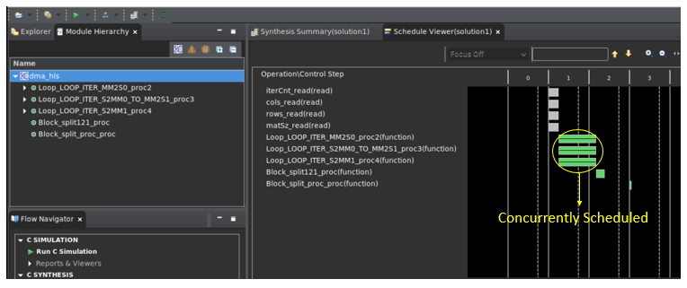
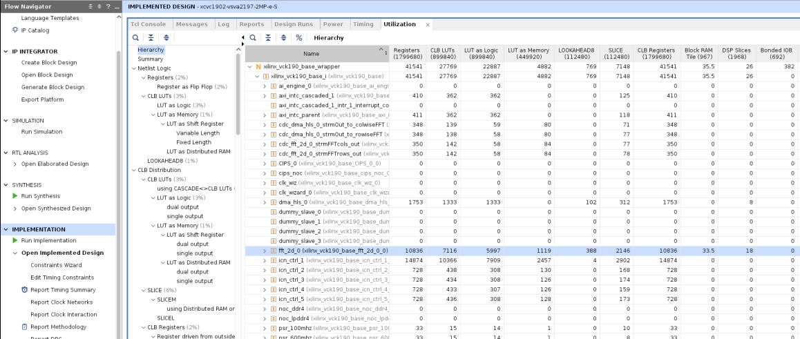
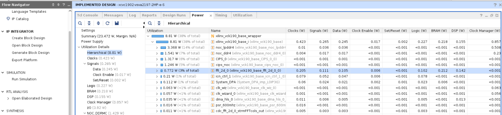

<table class="sphinxhide" width="100%">
 <tr>
   <td align="center"><h1>2022.2 Versal 2D-FFT Implementation Using Vitis Acceleration Library Tutorial (XD073)</h1>
   </td>
 </tr>
</table>

# HLS Implementation

## Table of Contents

[Building the Design](#Building-the-Design)

[Hardware Design Details](#Hardware-Design-Details)

[Software Design Details](#Software-Design-Details)

[Performance Details](#Performance-Details)

## Building the Design

<details>
<summary>Design Build</summary> 
	
### Design Build

In this section, you will build and run the 2D-FFT design using the HLS/DSP implementation. You will compile the HLS/DSP design and integrate it into a larger system design (including the PL kernels and PS host application).

At the end of this section, the design flow will generate a new directory (called `build/`). Underneath are subdirectories named `(cint16_dsns-cfloat_dsns)/fft2d_$(MAT_ROWS)x$(MAT_COLS)/x$(FFT_2D_INSTS)/`, depending on the value of the datatype `${FFT_2D_DT}`, the values of the matrix dimensions (`${MAT_ROWS}`, `${MAT_COLS}`) and the number of instances (`$(FFT_2D_INSTS)`) chosen in the build. Each subdirectory contains the `hw_emu/` and/or `hw/` subfolders. These subfolders contain a host app executable and the builds targeted to `hw` or `hw_emu` respectively. The `hw_emu/` subfolder contains the build for hardware emulation. The `hw/` subfolder contains the build for a hardware run on a VCK190 board.

</details>

<details>
<summary>Make Steps</summary> 
	
### Make Steps

To run the following `make` steps (for example, `make kernels`, `make xsa`, and so on), you must be in the `HLS/` folder. The following options can be specified in the `make` steps. Instructions for how to apply them are provided later in this section.

`TARGET:` This option can be set to `hw` or `hw_emu` to build the design in the hardware or hardware emulation flow. The default is `hw_emu`.

`FFT_2D_INSTS:` This option can be set to 1, 5, or 10 to build the design with the number of kernel instances. The default is `1`.

`ITER_CNT:` The number of iterations the design is run. The default is `8`.

`FFT_2D_PT:` FFT 2D point. Permissible values are `64`, `128`, `256`, `512`, and `2048`.

`FFT_2D_DT`: FFT 2D Datatype. Permissible values are `0` and `1`, for the cint16 and cfloat datatypes.

`MAT_ROWS x MAT_COLS:` Dimensions of the matrix (number of rows in the input matrix x number of cols in the input matrix). Automatically configured as `FFT_2D_PT/2, FFT_2D_PT`. Permissible values are `32x64`, `64x128`, `128x256`, `256x512`, and `1024x2048`. The default is `1024x2048`.

`EN_TRACE:` Flag to enable trace profiling. `0` is disabled and `1` is enabled. The default is `0` (disabled).

The Makefile uses the following directory references:

```
## Relative fft_2d directory
RELATIVE_PROJECT_DIR := ./

## Absolute fft_2d directory = <user path>/Tutorials/AI_Engine/fft_2d
PROJECT_REPO := $(shell readlink -f $(RELATIVE_PROJECT_DIR))

DESIGN_REPO  := $(PROJECT_REPO)/design
HOST_APP_SRC := $(DESIGN_REPO)/host_app_src
PL_SRC_REPO  := $(DESIGN_REPO)/pl_src
DIRECTIVES_REPO        := $(DESIGN_REPO)/directives
SYSTEM_CONFIGS_REPO    := $(DESIGN_REPO)/system_configs
PROFILING_CONFIGS_REPO := $(DESIGN_REPO)/profiling_configs
EXEC_SCRIPTS_REPO      := $(DESIGN_REPO)/exec_scripts
VIVADO_METRICS_SCRIPTS_REPO := $(DESIGN_REPO)/vivado_metrics_scripts

BASE_BLD_DIR     := $(PROJECT_REPO)/build
FFT_2D_DT_DIR    := $(BASE_BLD_DIR)/cint16_dsns
FFTPT_BLD_DIR    := $(FFT_2D_DT_DIR)/fft2d_$(MAT_ROWS)x$(MAT_COLS)
INSTS_BLD_DIR    := $(FFTPT_BLD_DIR)/x$(FFT_2D_INSTS)
BUILD_TARGET_DIR := $(INSTS_BLD_DIR)/$(TARGET)
WORK_DIR         := Work

REPORTS_REPO := $(PROJECT_REPO)/reports_dir
BLD_REPORTS_DIR := $(REPORTS_REPO)/$(FFT_2D_DT_DIR_VAL)/fft2d_$(MAT_ROWS)x$(MAT_COLS)/x$(FFT_2D_INSTS)

EMBEDDED_PACKAGE_OUT := $(BUILD_TARGET_DIR)/package
EMBEDDED_EXEC_SCRIPT := run_script.sh
```

</details>

<details>
<summary>Build the Entire Design with a Single Command</summary>

### Build the Entire Design with a Single Command

If you are already familiar with the HLS and Vitis kernel compilation flows, you can build the entire design for each case of `FFT_2D_INSTS` with one command: 

```bash
make run ( default hardware emulation, cint16 datatype, 1 instance, iterations=8, matrix dimentions rows=1024 and columns=2048, no trace-profiling )
```

or 

```bash
make run TARGET=hw FFT_2D_DT=0 FFT_2D_INSTS=5 ITER_CNT=16 EN_TRACE=1 FFT_2D_PT=64 (hardware, 5 instances, 16 iterations, enable trace profiling, matrix dimentions rows=32 and columns=64 )
```

This command runs the `make kernels`, `make xsa`, `make application`, `make package`, and `make run_emu` steps for hardware emulation or to run on hardware (VCK190 board) depending on the `TARGET` you specify. The settings also apply to individual make steps listed below.

The generated files for each `FFT_2D_INSTS` are placed under an individual directory: `$(BUILD_TARGET_DIR)/`. Each `make` step to build the design is specified in the following sections. These sections also detail the options used and the location of input and output files in each case.

</details>

<details>
<summary>make kernels: Compiling PL Kernels</summary> 
 
### make kernels: Compile PL Kernels

In this step, the Vitis compiler takes any V++ kernels (RTL or HLS C) in the PL region of the target platform (`xilinx_vck190_base_202220_1`) and the HLS kernels and compiles them into their respective XO files. The following commands compile the kernels (default `TARGET=hw_emu`, `FFT_2D_INSTS=1`, `ITER_CNT=8`, `FFT_2D_DT=0`, and `FFT_2D_PT=2048`). 

```
make kernels
```

The expanded command is as follows (for `fft_2d`):

```
mkdir -p $(BUILD_TARGET_DIR); \

cd $(BUILD_TARGET_DIR); \

v++ --target hw_emu --hls.pre_tcl $$(DIRECTIVES_REPO)/hls_pre.tcl \
   --hls.clock 500000000:fft_2d -D MAT_ROWS=1024 -D MAT_COLS=2048 -D FFT_2D_DT=0 \
   --platform xilinx_vck190_base_202220_1 --save-temps --temp_dir $(BUILD_TARGET_DIR)/_x \
   --verbose -g -c -k fft_2d $(DESIGN_REPO)/pl_src/fft_2d.cpp -o $(BUILD_TARGET_DIR)/fft_2d.hw_emu.xo
```

For `dma_hls`:

```
mkdir -p $(BUILD_TARGET_DIR); \

cd $(BUILD_TARGET_DIR); \

v++ --target hw_emu --hls.clock 250000000:dma_hls --platform xilinx_vck190_base_202220_1 \
   --save-temps --temp_dir $(BUILD_TARGET_DIR)/_x --verbose -g -c -k dma_hls -D FFT_2D_DT=0 \
   $(DESIGN_REPO)/pl_src/dma_hls.cpp -o $(BUILD_TARGET_DIR)/dma_hls.hw_emu.xo
```

See [this page](https://docs.xilinx.com/r/en-US/ug1393-vitis-application-acceleration/Vitis-Compiler-Command) for a detailed description of all Vitis compiler switches. The following table provides a summary of the switches used. 


|Switch|Description|
|  ---  |  ---  |
|--target \| -t [hw\|hw_emu]|Specifies the build target.|
|--hls.pre_tcl \<arg\>|Specifies a Tcl file containing Tcl commands for `vitis_hls` to source before running `csynth_design`. See [this page](https://docs.xilinx.com/r/en-US/ug1393-vitis-application-acceleration/hls-Options) for details about HLS options.|
|--platform \| -f|Specifies the name of a supported acceleration platform as specified by the $PLATFORM_REPO_PATHS environment variable or the full path to the platform XPFM file.|
|--save-temps \| -s|Directs the Vitis compiler command to save intermediate files/directories created during the compilation and link process. Use the `--temp_dir` option to specify a location to write the intermediate files to.|
|--temp_dir <string>|This allows you to manage the location where the tool writes temporary files created during the build process. The temporary results are written by the Vitis compiler, and then removed, unless the `--save-temps` option is also specified.|
|--verbose|Display verbose/debug information.|
|--compile \| -c|Required for compilation to generate XO files from kernel source files.|
|--kernel \<arg\>\|-k \<arg\>|Compile only the specified kernel from the input file. Only one -k option is allowed per Vitis compiler command.|
|-D \| --define  \<Macro Name\>=\<value\>|Defines Macros for the compiler.|
|--output \| -o|Specifies the name of the output file generated by the V++ command. The DMA HLS kernels output should be XO.|

|Input|Description|
|  ---  |  ---  |
|$(PL_SRC_REPO)/fft_2d.cpp|Defines the fft_2d PL kernel.|
|$(PL_SRC_REPO)/dma_hls.cpp|Defines the data mover PL kernel.|

|Output|Description|
|  ---  |  ---  |
|$(BUILD_TARGET_DIR)/dma_hls.hw_emu.xo|The data mover kernel object file.|

</details>

<details>
<summary>make xsa: Using the Vitis Tools to Link HLS Kernels with the Platform</summary> 
 
### make xsa: Using the Vitis Tools to Link HLS Kernels with the Platform

After the HLS kernels have been compiled, you can use the Vitis compiler to link them with the platform to generate an XSA file. 

The Vitis tools allow you to integrate the HLS kernels into an existing extensible platform. This is an automated step from a software developer perspective where the platform chosen is provided by the hardware designer (or you can opt to use one of the many extensible base platforms provided by Xilinx and the Vitis tools build the hardware design and integrate the HLS kernels into the design).
 
To test this feature in this tutorial, use the base VCK190 platform to build the design.
 
The command to run this step is shown as follows (default `FFT_2D_DT=0`, `TARGET=hw_emu`, `FFT_2D_INSTS=1`, `ITER_CNT=8`, `EN_TRACE=0`, `FFT_2D_PT=2048`):

```
make xsa
``` 

The expanded command is as follows:

```
cd $(BUILD_TARGET_DIR);	\

v++ -l --platform xilinx_vck190_base_202220_1 --save-temps --temp_dir $(BUILD_TARGET_DIR)/_x \
   --verbose -g --clock.freqHz 500000000:fft_2d_0 --clock.freqHz 250000000:dma_hls_0 --clock.defaultTolerance 0.001 \
   --advanced.param compiler.userPostSysLinkOverlayTcl=$(DIRECTIVES_REPO)/cdc_async.tcl \
   --config $(SYSTEM_CONFIGS_REPO)/x1.cfg --vivado.prop fileset.sim_1.xsim.simulate.log_all_signals=true \
   --vivado.prop run.synth_1.{STEPS.SYNTH_DESIGN.ARGS.CONTROL_SET_OPT_THRESHOLD}={16} \
   --vivado.prop run.impl_1.{strategy}={Performance_NetDelay_low} \
   --vivado.prop run.impl_1.{STEPS.OPT_DESIGN.ARGS.DIRECTIVE}={Explore} \
   -t hw_emu -o $(BUILD_TARGET_DIR)/vck190_hls_fft_2d.hw_emu.xsa $(BUILD_TARGET_DIR)/fft_2d.hw_emu.xo \
   $(BUILD_TARGET_DIR)/dma_hls.hw_emu.xo
```

The above `vivado.prop` settings are for every variation except for the 10-instance variation for 256 x 512 and 1024 x 2048. The settings for these dimensions are given in the following examples.

For the 256 x 512 10-instance design:

```
   --vivado.prop run.synth_1.{STEPS.SYNTH_DESIGN.ARGS.CONTROL_SET_OPT_THRESHOLD}={16}
   --vivado.prop run.impl_1.{strategy}={Performance_HighUtilSLRs}
   --vivado.prop run.impl_1.{STEPS.OPT_DESIGN.ARGS.DIRECTIVE}={Explore}
   --vivado.prop run.impl_1.{STEPS.PHYS_OPT_DESIGN.ARGS.DIRECTIVE}={AggressiveExplore}
   --vivado.prop run.impl_1.{STEPS.ROUTE_DESIGN.ARGS.DIRECTIVE}={AggressiveExplore}
```

For the 1024 x 2048 10-instance design:

```
   --vivado.prop run.synth_1.{STEPS.SYNTH_DESIGN.ARGS.CONTROL_SET_OPT_THRESHOLD}={16}
   --vivado.prop run.impl_1.{strategy}={Performance_HighUtilSLRs}
   --vivado.prop run.impl_1.{STEPS.OPT_DESIGN.ARGS.DIRECTIVE}={AddRemap}
```

If `EN_TRACE` is enabled, the following Vitis compiler flags are also set:

```
   --profile.data dma_hls:all:all or profile.data dma_hls:all:strmInp_from_colwiseFFT (for higher instances) \
   --profile.trace_memory DDR
```
For higher values of `FFT_2D_INSTS`, only the `strmInp_from_colwiseFFT` port is profiled to avoid too much data.

See [this page](https://docs.xilinx.com/r/en-US/ug1393-vitis-application-acceleration/Linking-the-Kernels) for a detailed description of Vitis linking options. The following table provides a summary of the switches used. 

|Switch|Description|
|  ---  |  ---  |
|--platform \| -f|Specifies the name of a supported acceleration platform as specified by the $PLATFORM_REPO_PATHS environment variable or the full path to the platform XPFM file.|
|--save-temps \| -s|Directs the V++ command to save intermediate files/directories created during the compilation and link process. Use the `--temp_dir` option to specify a location to write the intermediate files to.|
|--temp_dir <string>|This allows you to manage the location where the tool writes temporary files created during the build process. The temporary results are written by the Vitis compiler, and then removed, unless the `--save-temps` option is also specified.|
|--verbose|Display verbose/debug information.|
|--output \| -o|Specifies the name of the output file generated by the V++ command. In this design the outputs of the HLS/DSP kernels with their interfacing with the PL kernels are in XO files.|
|--vivado.prop \<arg\>|Specifies properties for the Vivado Design Suite to be used during synthesis and implementation of the FPGA binary (xsa). See [this page](https://docs.xilinx.com/r/en-US/ug1393-vitis-application-acceleration/vivado-Options) for detailed Vivado options.|
|--profile.data [<kernel_name>\|all]:[<cu_name>\|all]:[<interface_name>\|all]\(:[counters\|all]\)|Enables monitoring of data ports through the monitor IPs. This option needs to be specified during linking. See [this page](https://docs.xilinx.com/r/en-US/ug1393-vitis-application-acceleration/profile-Options) for detailed profiling options.|
|--profile.trace_memory \<FIFO\>:\<size\>\|\<MEMORY\>[\<n\>]|When building the hardware target \(-t=hw\), use this option to specify the type and amount of memory to use for capturing trace data. See [this page](https://docs.xilinx.com/r/en-US/ug1393-vitis-application-acceleration/profile-Options) for detailed profiling options.|
|--config <config_file>|Specifies a configuration file containing V++ switches.|

The information to tell the linker how to connect the HLS/DSP and PL kernels together is described in a configuration file, `system_configs/x$(FFT_2D_INSTS).cfg`. The file describes the overall connection scheme of the system.

```
[connectivity]
nk=fft_2d:1:fft_2d_0
nk=dma_hls:1:dma_hls_0

#Connections For FFT-2D Insts 0...
stream_connect=dma_hls_0.strmOut_to_rowiseFFT:fft_2d_0.strmFFTrows_inp
stream_connect=fft_2d_0.strmFFTrows_out:dma_hls_0.strmInp_from_rowiseFFT
stream_connect=dma_hls_0.strmOut_to_colwiseFFT:fft_2d_0.strmFFTcols_inp
stream_connect=fft_2d_0.strmFFTcols_out:dma_hls_0.strmInp_from_colwiseFFT

[advanced]
## Disable Profiling in hw_emu so that it is faster...
param=hw_emu.enableProfiling=false

## Export the xsa of the design..
param=compiler.addOutputTypes=hw_export
```

See [this page](https://docs.xilinx.com/r/en-US/ug1393-vitis-application-acceleration/Vitis-Compiler-Configuration-File) for a detailed description of the Vitis compiler configuration file. A summary of the configuration options used is provided in the following table. 


|Switch|Comment|
|  ---  |  ---  |
|--connectivity.nk|Number of kernels. `dma_hls:1:dma_hls_0` means that the Vitis compiler should instantiate one dma_hls kernel and name the instance `dma_hls_0`.|
|--connectivity.stream_connect|How the kernels will connect to IPs, platforms, or other kernels. The elaborates the streaming port connections like. `dma_hls_0.strmOut_to_rowiseFFT:fft_2d_0.strmFFTrows_inp` means that the Vitis compiler should connect the port `strmOut_to_rowiseFFT` of `dma_hls_0` HLS kernel to the `strmFFTrows_inp` of the `fft_2d_0` HLS kernel.|
|param=compiler.addOutputTypes=hw_export| This option tells the Vitis compiler that besides creating an XSA file, it also outputs an XSA file which is needed to create a post-Vivado fixed platform for Vitis software development.|

The Vitis compiler calls the Vivado® IP integrator under the hood to build the design. The platform and kernels are input to the Vivado Design Suite, which produces a simulation XSA or an XSA after running place and route on the design. The point at which the XSA is produced from Vivado depends on the `-target` option set on the Vitis compiler command line. 

You can now view the Vivado project, which is located in the `$(BUILD_TARGET_DIR)/_x/link/vivado/vpl/prj` directory. You have now have generated the XSA file, `$(BUILD_TARGET_DIR)/vck190_hls_fft_2d.hw_emu.xsa`, that will be used to execute your design on the platform.


</details>

<details>
<summary>make application: Compile the Host Application</summary> 

### make application: Compile the Host Application

You can compile the host application by following the typical cross-compilation flow for the Cortex A72 processor. To build the application, run the following command (default `FFT_2D_INSTS=1`, `ITER_CNT=8`, `FFT_2D_DT=0` and `FFT_2D_PT=2048`):

```
make application
```
or

```
cd $(BUILD_TARGET_DIR);	\

aarch64-xilinx-linux-g++ -mcpu=cortex-a72.cortex-a53 -march=armv8-a+crc -fstack-protector-strong \
   -D_FORTIFY_SOURCE=2 -Wformat -Wformat-security -Werror=format-security --sysroot=$(SDKTARGETSYSROOT) -O -c \
   -std=c++14 -D__linux__ -DFFT2D_INSTS=10 -DITER_CNT=8 -DMAT_ROWS=1024 -DMAT_COLS=2048 -DFFT_2D_DT=0 \
   -I$(SDKTARGETSYSROOT)/usr/include/xrt -I$(SDKTARGETSYSROOT)/usr/include -I$(SDKTARGETSYSROOT)/usr/lib \
   -I$(HOST_APP_SRC) $(HOT_APP_SRC)/fft_2d_hls_app.cpp -o $(BUILD_TARGET_DIR)/fft_2d_hls_app.o \
   -L$(SDKTARGETSYSROOT)/lib -lxrt_coreutil

aarch64-xilinx-linux-g++  -mcpu=cortex-a72.cortex-a53 -march=armv8-a+crc -fstack-protector-strong \
   -D_FORTIFY_SOURCE=2 -Wformat -Wformat-security -Werror=format-security --sysroot=$(SDKTARGETSYSROOT) \
   $(BUILD_TARGET_DIR)/fft_2d_hls_app.o -L$(SDKTARGETSYSROOT)/usr/lib -lxrt_coreutil \
   -o $(BUILD_TARGET_DIR)/fft_2d_hls_xrt.elf
```


See [this page](https://xilinx.github.io/XRT/2022.2/html/index.html) for XRT documentation. See [this page](https://docs.xilinx.com/r/en-US/ug1393-vitis-application-acceleration/Host-Programming) for details of host application programming.


|Switch|Description|
|  ---  |  ---  |
|-O \| Optimize.| Optimizing compilation takes somewhat more time, and a lot more memory for a large function. With -O, the compiler tries to reduce code size and execution time, without performing any optimizations that can take a great deal of compilation time.|
|-D__linux__|
|-DXAIE_DEBUG|Enable debug interface capabilities where certain core status, event status, or stack trace can be dumped out.|
|-D\<Pre-processor Macro String\>=\<value\>|Pass Pre-processor Macro definitions to the cross-compiler.|
|-I \<dir\>|Add the directory `dir` to the list of directories to be searched for header files.|
|-o \<file\>|Place output in file `<file>`. This applies regardless of the output being produced, whether it be an executable file, an object file, an assembler file or preprocessed C code.|
|--sysroot=\<dir\>|Use `dir` as the logical root directory for headers and libraries. For example, if the compiler would normally search for headers in `/usr/include` and libraries in `/usr/lib`, it will instead search `dir/usr/include` and `dir/usr/lib`. This is automatically set by the `env_setup.sh` script|
|-l\<library\>|Search the library named `library` when linking. The 2D-FFT tutorial requires `adf_api_xrt` and `xrt_coreutil` libraries.|
|-L \<dir\>|Add directory `<dir>` to the list of directories to be searched for -l.|

The following is a description of the input sources compiled by the cross-compiler compiler command. 

|Inputs Sources|Description|
|  ---  |  ---  |
|$(HOST_APP_SRC)/fft_2d_hls_app.cpp|Source application file for the `fft_2d_hls_xrt.elf` that will run on an A72 processor.|

The following is a description of the output objects that results from executing the cross-compiler command with the above inputs and options. 

|Output Objects|Description|
|  ---  |  ---  |
|$(BUILD_TARGET_DIR)/fft_2d_hls_xrt.elf|The executable that will run on an A72 processor.|

</details>

<details>
<summary>make package: Packaging the Design</summary> 
 
### make package: Packaging the Design

With the HLS/DSP outputs created, as well as the new platform, you can now generate the programmable device image (PDI) and a package to be used on an SD card. The PDI contains all the executables, bitstreams, and configurations of the device. The packaged SD card directory contains everything to boot Linux, the generated applications, and the XCLBIN.

The command to run this step is as follows (default `TARGET=hw_emu`, `EN_TRACE=0`, `FFT_2D_INSTS=1`, `FFT_2D_DT=0` and  `FFT_2D_PT=2048`):

```
make package
``` 

or 

```
cp $(PROJECT_REPO)/run_script.sh $(BUILD_TARGET_DIR)/
cd $(BUILD_TARGET_DIR);	\

v++ -p -t hw --save-temps --temp_dir $(BUILD_TARGET_DIR)/_x -f xilinx_vck190_base_202220_1 \
   --package.rootfs $(XLNX_VERSAL)/rootfs.ext4 --package.kernel_image $(XLNX_VERSAL)/Image --package.boot_mode=sd \
   --package.out_dir $(BUILD_TARGET_DIR)/package --package.image_format=ext4 --package.sd_file $(BUILD_TARGET_DIR)/fft_2d_hls_xrt.elf \
   $(BUILD_TARGET_DIR)/vck190_hls_fft_2d.hw.xsa
```

If `EN_TRACE` is enabled, the following Vitis compiler flags are also set:

```
   --package.sd_file $(PROFILING_CONFIGS_REPO)/xrt.ini
```

If the `XRT_ROOT` is set, the following Vitis compiler flags are also set:

```
   --package.sd_dir $(XRT_ROOT)
```

See [this page](https://docs.xilinx.com/r/en-US/ug1393-vitis-application-acceleration/Packaging-the-System) for more details about packaging the system.


|Switch|Description|
|  ---  |  ---  |
|--target \| -t [hw\|hw_emu]|Specifies the build target.|
|--package \| -p|Packages the final product at the end of the Vitis compile and link build process.|
|--package.rootfs \<arg\>|Where \<arg\> specifies the absolute or relative path to a processed Linux root file system file. The platform RootFS file is available for download from xilinx.com. Refer to the [Vitis Software Platform Installation](https://docs.xilinx.com/r/en-US/ug1393-vitis-application-acceleration/Vitis-Software-Platform-Installation) for more information.|
|--package.kernel_image \<arg\>|Where \<arg\> specifies the absolute or relative path to a Linux kernel image file. Overrides the existing image available in the platform. The platform image file is available for download from xilinx.com. Refer to the [Vitis Software Platform Installation](https://docs.xilinx.com/r/en-US/ug1393-vitis-application-acceleration/Vitis-Software-Platform-Installation) for more information.|
|--package.boot_mode \<arg\>|Where \<arg\> specifies <ospi\|qspi\|sd> Boot mode used for running the application in emulation or on hardware.|
|--package.image_format|Where \<arg\> specifies \<ext4\|fat32\> output image file format. `ext4` is the Linux file system and `fat32` is the Windows file system.|
|--package.sd_file|Where \<arg\> specifies an ELF or other data file to package into the `sd_card` directory/image. This option can be used repeatedly to specify multiple files to add to the `sd_card`.|

|Inputs Sources|Description|
|  ---  |  ---  |
|$(XRT_ROOT)|The PS host application needs the XRT headers in this folder to execute. Set in the `env_setup.sh`.|
|$(XLNX_VERSAL)/rootfs.ext4|The root filesystem file for PetaLinux.|
$(XLNX_VERSAL)/Image|The pre-built PetaLinux image the processor boots from.|
|$(BUILD_TARGET_DIR)/fft_2d_hls_xrt.elf|The PS host application executable created in the `make application` step.|
|$(BUILD_TARGET_DIR)/vck190_hls_fft_2d.hw_emu.xsa|The XSA file created in the `make xsa` step.|

The output of the V++ Package step is the package directory that contains the contents to run hardware emulation. 

|Output Objects|Description|
|  ---  |  ---  |
|$(BUILD_TARGET_DIR)/package|The hardware emulation package that contains the boot file, hardware emulation launch script, the PLM and PMC boot files, the PMC and QEMU command argument specification files, and the Vivado simulation folder.|

</details>

<details>
<summary>make run_emu: Running Hardware Emulation</summary>

### make run_emu: Running Hardware Emulation

After packaging, everything is set to run hardware emulation. To run emulation, use the following command (default `TARGET=hw_emu`):

```
make run_emu 
```

or

```
###########################################################################
Hardware Emulation Goto:
$(BUILD_TARGET_DIR)/package

and do:
./launch_hw_emu.sh or ./launch_hw_emu.sh -g (for waveform viewer)...

```
When hardware emulation is launched, you will see the QEMU simulator load. Wait for the autoboot countdown to go to zero. After a few minutes, the root Linux prompt comes up: 

```bash
root@versal-rootfs-common-2022.2:~#
```

After the root prompt comes up, run the following commands to run the design:  

```
mount /dev/mmcblk0p1 /mnt
cd /mnt
./fft_2d_hls_xrt.elf a.xclbin
```

The `fft_2d_aie_xrt.elf` executes. After a few minutes, you should see the output with `TEST PASSED` on the console. When this is shown, run the following keyboard command to exit the QEMU instance: 

```
#To exit QEMU Simulation
Press CtrlA, let go of the keyboard, and then press x 
```

To run with waveform, do the following:

```
cd $(BUILD_TARGET_DIR)/package
./launch_hw_emu.sh -g
```
The XSIM Waveform Viewer is launched. Drag and drop the signals into the viewer and click **Play** to start the emulation. Go back to the terminal and wait for the Linux prompt to show up. In the XSIM Waveform Viewer, you will see the signals you added to the waveform adjusting over the execution of the design. When this is done, hit the pause button and close the window to end the emulation.

The following figure shows a waveform view of the 32x64 - 1x design.


</details>

<details>
<summary>TARGET=hw: Running on Hardware</summary>

### Running on Hardware

To run the design in hardware, rerun the following `make` steps with `TARGET=hw` and other applicable options (see the preceding `make` steps specified above).

```
make kernels TARGET=hw
make xsa TARGET=hw 
make package TARGET=hw 
```

These commands create a `$(BUILD_TARGET_DIR)` folder with the kernels, XSA, and `package` for a hardware run. 

Run the following step to set up the execution file, generated images, and base images (`$(BUILD_TARGET_DIR)/package/sd_card` and `$(BUILD_TARGET_DIR)/package/sd_card.img`).

```
make run_emu TARGET=hw 
```

These commands create a `build/hw` folder with the kernels, XSA, and `package` for a hardware run. Follow steps 1-9 to run the `fft_2d_hls_xrt.elf` executable on your VCK190 board. 

**Step 1.** Ensure your board is powered off. 

**Step 2.** Use an SD card writer (such as balenaEtcher) to flash the `sd_card.img` file to an SD card. 

**Step 3.** Plug the flashed SD card into the top slot of the VCK190 board. 

**Step 4.** Set the switch (`SW1 Mode\[3:0\]=1110 = OFF OFF OFF ON`).

**Step 5.** Connect your computer to the VCK190 board using the USB cable included with the board. 

**Step 6.** Open a TeraTerm terminal and select the correct COM port. Set the port settings to the following: 

```
Port: <COMMXX>
Speed: 115200
Data: 8 bit
Parity: none
Stop Bits: 1 bit
Flow control: none
Transmit delay: 0 msec/char 0 msec/line
```

**Step 7.** Power on the board.

**Step 8.** Wait until you see the `root@versal-rootfs-common-2022.2` Linux command prompt. Press enter a few times to get past any `xinit` errors. 

**Step 9.** Run the following commands in the TeraTerm terminal: 

```
cd /mnt/sd-mmcblk0p1
./init.sh
./fft_2d_hls_xrt.elf a.xclbin
```

</details>


## Hardware Design Details


<details>
<summary>2D-FFT HLS Implementation Architecture and DSP/PL Function Partitioning</summary>
	
### 2D-FFT HLS Implementation Architecture and DSP/PL Function Partitioning

The following figure shows a high-level block diagram of the design. The test harness consists of the HLS FFT kernels using DSP Engines and the data mover HLS kernels (`dma_hls`). In this setup, there is an AXI4-Stream interface between the data mover kernels and DSP Engines, with a data width of 128 bits. The data mover kernel is running at 250 MHz and the HLS/DSP kernel is running at 500 MHz.

The data mover is a PL-based data generator and checker. It generates impulse input and checks the output of the row-wise FFT core for its response. It then generates the transposed pattern of the row-wise FFT output and feeds that to the col-wise FFT core and checks its output.


</details>

<details>
<summary>Design Details</summary>

### Design Details

The design in this tutorial starts with a base platform containing the control interface and processing system (CIPS), NoC, DSP, and the interfaces among them. The Vitis compiler linker step builds on top of the base platform by adding the PL/HLS kernels. To add the various functions in a system-level design, PL kernels are added to the base platform depending on the application (that is, the PL kernels present in each design might vary). In the design, the components are added by the Vitis compiler `-l` step (see [make XSA](#make-xsa-using-the-vitis-tools-to-link-hls-kernels-with-the-platform)) and include the following:

* `fft_2d` HLS/DSP kernel (`fft_2d.[hw|hw_emu].xo`)
* Data mover kernel (`dma_hls.[hw|hw_emu].xo`)
* Connections interfaces defined in the system configuration file

To see a schematic view of the design with the extended platform as shown in the following figure, open the following in Vivado:

`build/fft2d_$(MAT_ROWS)x$(MAT_COLS)/x$(FFT_2D_INSTS)/[hw|hw_emu]/_x/link/vivado/vpl/prj/prj.xpr`


In this design, the 2D FFT computation happens in two stages: the first compute is across the row vectors (the `fft_rows` function in the `fft_2d` kernel) and the second stage is performed across the column vectors(`fft_cols` function in the `fft_2d` kernel). The input data is accessed linearly and streamed to the HLS/DSP kernels which perform `MAT_COLS( default 2048 )` point FFT. The data coming out of the HLS/DSP kernels is streamed to a PL kernel where it is checked against the expected pattern (the first row should be 1 and the remaining should be 0). If there is a mismatch, it is recorded in the variable `stage0_errCnt`. The transposed pattern of the output of the row vectors is then linearly streamed into another HLS/DSP kernel which performs `MAT_ROWS( default 1024 )` point FFT. The output is streamed into the data mover kernel again and is checked against the expected pattern (all values should be 1). If there is a mismatch, it is stored in the variable `stage1_errCnt`. Finally, the sum of `stage0_errCnt` and `stage1_errCnt` is returned from the kernel, which is read in the host app to determine whether the test has passed or failed.

The system debugging and profiling IP (DPA) is added to the PL region of the device to capture HLS/DSP kernel's runtime trace data if the `EN_TRACE` option is enabled in the design. The `dma_hls` kernel operates at 250 MHz and the HLS/DSP kernel operates at 500 MHz: unlike the AI Engine implementation, there is a clock domain crossing in the PL region in this design.

</details>

<details>
<summary>HLS/PL Kernels</summary>
	
### HLS/PL Kernels

The top-level HLS/DSP kernel, `fft_2d`, contains two sub-functions: `fft_rows` and `fft_cols`. Each sub-function contains the individual HLS/DSP kernels which perform `MAT_COLS` and `MAT_ROWS` point FFT respectively.

The PL-based data movers consist of the `dma_hls` kernel, which generates impulse input and checks the output of each FFT stage for the expected pattern.

#### FFT_2D

* Internally comprises two functions: `fft_rows` and `fft_cols`. Both functions are concurrently scheduled.
* The data width is 128 bits at both input and output (I/O) AXI4-Stream interfaces.
* Working at 500 MHz.

#### DMA_HLS

* Internally comprises four loops (`mm2s0`, `s2mm0` , `mm2s1`, and `s2mm1`). `s2mm0` and `mm2s1` are sequenced one after the other and wrapped into the `dmaHls_rowsToCols`. `dmaHls_rowsToCols` and `s2mm1` are concurrently scheduled.
* The data width is 128 bits at both the AXI4-Stream I/O side.
* Working at 250 MHz.

</details>


## Software Design Details


The software design in the HLS/DSP 2D-FFT tutorial consists of the following sections:

<details>
<summary>Methodology</summary>

### Methodology

The following figure elaborates on the HLS implementation using DSP Engines methodology.


#### DSP

##### Concurrent Scheduling

Concurrent scheduling is required so that each function runs independently and the execution of one function does not block the other. Both DSP/HLS subfunctions, `fft_rows` and `fft_cols`, are configured independently of one other, with concurrent scheduling achieved using `#pragma HLS DATAFLOW`.

```
...
#pragma HLS DATAFLOW

ITER_LOOP_FFT_ROWS:for(int i = 0; i < iterCnt; ++i) {
   fft_rows(strmFFTrows_inp, strmFFTrows_out);
}

ITER_LOOP_FFT_COLS:for(int i = 0; i < iterCnt; ++i) {
   fft_cols(strmFFTcols_inp, strmFFTcols_out);
}
...
```

##### Subfunctions are Pipelined and Set Up in DATAFLOW

Pipelining reduces the initiation interval (II) for a function or loop by allowing the concurrent execution of operations. The default type of pipeline is defined by the `config_compile -pipeline_style` command, but can be overridden in the [PIPELINE pragma](https://docs.xilinx.com/r/en-US/ug1399-vitis-hls/pragma-HLS-pipeline) or directive.

The [DATAFLOW pragma](https://docs.xilinx.com/r/en-US/ug1399-vitis-hls/pragma-HLS-dataflow) enables task-level pipelining as described in [Exploiting Task Level Parallelism: Dataflow Optimization](https://docs.xilinx.com/r/en-US/ug1399-vitis-hls/Exploiting-Task-Level-Parallelism-Dataflow-Optimization), allowing functions and loops to overlap in their operation, increasing the concurrency of the RTL implementation and increasing the overall throughput of the design.

All operations are performed sequentially in a C description. In the absence of any directives that limit resources (such as pragma HLS allocation), the Vitis HLS tool seeks to minimize latency and improve concurrency. However, data dependencies can limit this. For example, functions or loops that access arrays must finish all read/write accesses to the arrays before they complete. This prevents the next function or loop that consumes the data from starting operation. The DATAFLOW optimization enables the operations in a function or loop to start operation before the previous function or loop completes all its operations.

The `fft_rows` function performs `MAT_COLS` point FFT and runs for `MAT_ROWS` number of iterations (and vice versa for the `fft_cols` function). Each loop within these functions is pipelined with `II=1` and are called under `DATAFLOW`. The following code snippet shows the `fft_rows` functions as an example:

```
...
LOOP_FFT_ROWS:for(int i = 0; i < MAT_ROWS; ++i) {

   #pragma HLS DATAFLOW

   readIn_row(strm_inp, in);  // Pipelined with II=1 inside...
   
   fftRow(directionStub, in, out, &ovfloStub);

   writeOut_row(strm_out, out);  // Pipelined with II=1 inside...
}
...
```

Pipelining reduces the execution latency. Moreover, establishing dataflow within the sub-functions reduces all overhead latency in terms of reading/writing input and output respectively; see the following figure.


##### Vitis HLS Scheduling and Dataflow View For FFT_2D

The following figure shows the scheduler view.


The following figure shows the dataflow view.


#### Data Mover

##### Data Generation/Checking and Sequencing

The data mover comprises four loops: `mm2s0`, `s2mm0`, `mm2s1`, and `s2mm1`. The `s2mm0` and `mm2s1` functions are wrapped into a single function, `dmaHls_rowsToCols`. Within that the execution sequence, `s2mm0` is followed by `mm2s1`. The `s2mm0` and `s2mm1` functions check the output of the row-wise and col-wise FFT respectively against the expected golden output.

##### Concurrent Scheduling

Concurrent scheduling is required so that each function runs independently and the execution of one function is not blocking the other. The concurrent scheduling of the three functions `mm2s0`, `dmaHls_rowsToCols`, and `s2mm1` is achieved using `#pragma HLS DATAFLOW` as shown in the following example.

```
#pragma HLS DATAFLOW
...
LOOP_ITER_MM2S0:for(int i = 0; i < iterCnt; ++i)
{
   #pragma HLS loop_tripcount min=1 max=8
   
   mm2s0(strmOut_to_rowiseFFT, matSz);
}

LOOP_ITER_S2MM0_TO_MM2S1:for(int i = 0; i < iterCnt; ++i)
{
   #pragma HLS loop_tripcount min=1 max=8
   
   dmaHls_rowsToCols(strmInp_from_rowiseFFT, strmOut_to_colwiseFFT, \
                     matSz, rows, cols, stg0_errCnt, goldenVal);
}

LOOP_ITER_S2MM1:for(int i = 0; i < iterCnt; ++i)
{
   #pragma HLS loop_tripcount min=1 max=8
   
   s2mm1(strmInp_from_colwiseFFT, matSz, stg1_errCnt, goldenVal);
}
...
```

##### Vitis HLS Scheduling and Dataflow View for DMA_HLS

The following figure shows the scheduler view.



The following figure shows the dataflow view.


#### Streaming Interface Data Width

The streaming interface data width is kept as 128 bits to reduce read/write overhead while processing data.

#### Frequency Selection

In the HLS implementation, due to timing closure limitations, the `fft_2d` kernel is kept at 500 MHz and the data mover is kept at 250 MHz.

#### Timing Closure

For timing closure of the whole design, different implementation properties are used, as mentioned in the `make xsa` step above. These strategies are required because timing closure does not happen for the design if the default implementation settings are used.

For the purposes of achieving timing closure for the 256 x 512 point x10 and 1024 x 2048 point x10 designs, over 200 implementation strategies were used, out of which three met timing. Out of that, those with the least power were chosen as the implementation strategy in the `v++ -l / make xsa` step.

For more information about implementation strategies, see the _Vivado Implementation User Guide_ [UG904](https://docs.xilinx.com/r/en-US/ug904-vivado-implementation)

</details>

<details>
<summary>HLS/DSP Kernel Representation</summary>
	
### HLS/DSP Kernel Representation

An HLS/DSP kernel comprises the [Fast Fourier Transform LogiCORE IP](https://www.xilinx.com/products/intellectual-property/fft.html#overview) instantiated in the HLS kernel using the [HLS FFT library](https://docs.xilinx.com/r/en-US/ug1399-vitis-hls/FFT-IP-Library). Additionally, the kernel has the input and output wrappers for reading and writing data into and out of the FFT core. You can view the function call graph in the Vitis HLS GUI, as shown in the following figure.


</details>

<details>
<summary>Data Flow</summary>
	
### Data Flow

This section describes the overall data flow of the 2D-FFT design using the HLS FFT library, which is compiled using the Vitis compiler. Refer to [C/C++ Kernels](https://docs.xilinx.com/r/en-US/ug1393-vitis-application-acceleration/C/C-Kernels) for information.

The overall definition of the FFT-2D kernel is defined in `$(PL_SRC_REPO)/fft_2d.cpp`.

#### Define FFT Inputs

FFT core inputs must be defined in `$(PL_SRC_REPO)/fft_config.h`. Based on the matrix dimensions `MAT_ROWS` and `MAT_COLS` (derived from `FFT_2D_PT` in the Makefile and passed to the kernel through the `-D` option during Vitis compilation), all the FFT inputs (for the matrix dimensions) are defined as below for the 32 x 64 point design:

```
#pragma once
...
   #define FFT_ROWS_NFFT_MAX       6
   #define FFT_ROWS_CONFIG_WIDTH   8
   #define FFT_ROWS_STAGES_BLK_RAM 0
   #define FFT_ROWS_SCALING        0
   
   #define FFT_COLS_NFFT_MAX       5
   #define FFT_COLS_CONFIG_WIDTH   8
   #define FFT_COLS_STAGES_BLK_RAM 0
   #define FFT_COLS_SCALING        0
...
```

#### Required Headers and Function Declarations

Include the required headers and function declarations. Declare input and output types.

```
   #if FFT_2D_DT == 0 // cint16 datatype
   
   // Configurable params...
   #define FFT_INPUT_WIDTH  16
   #define FFT_OUTPUT_WIDTH FFT_INPUT_WIDTH
   
   using namespace std;
   using namespace hls;
   
   typedef ap_fixed<FFT_INPUT_WIDTH,  1> data_in_t;
   typedef ap_fixed<FFT_OUTPUT_WIDTH, 1> data_out_t;
   
   typedef complex<data_in_t>  cmpxDataIn;
   typedef complex<data_out_t> cmpxDataOut;
   ...

#else //cfloat datatype
   
   // Configurable params...
   #define FFT_INPUT_WIDTH  32
   #define FFT_OUTPUT_WIDTH FFT_INPUT_WIDTH
   
   using namespace std;
   using namespace hls;
   
   typedef float data_in_t;
   typedef float data_out_t;
   
   typedef complex<data_in_t>  cmpxDataIn;
   typedef complex<data_out_t> cmpxDataOut;
   
```


#### FFT Core Config Structure

Define the FFT config structure used to instantiate the FFT LogiCORE IP in `$(PL_SRC_REPO)/fft_2d.h`, as shown below for the `fft_rows` function:

```
...
   struct configRow : hls::ip_fft::params_t {
      static const unsigned ordering_opt = hls::ip_fft::natural_order;
      static const unsigned config_width = FFT_ROWS_CONFIG_WIDTH;
      static const unsigned max_nfft = FFT_ROWS_NFFT_MAX;
      static const unsigned stages_block_ram = FFT_ROWS_STAGES_BLK_RAM;
      static const unsigned input_width = FFT_INPUT_WIDTH;
      static const unsigned output_width = FFT_OUTPUT_WIDTH;
   };

   typedef hls::ip_fft::config_t<configRow> configRow_t;
   typedef hls::ip_fft::status_t<configRow> statusRow_t;
   ...
   
   struct configRow : hls::ip_fft::params_t {
      static const unsigned ordering_opt = hls::ip_fft::natural_order;
      static const unsigned config_width = FFT_ROWS_CONFIG_WIDTH;
      static const unsigned max_nfft = FFT_ROWS_NFFT_MAX;
      static const unsigned stages_block_ram = FFT_ROWS_STAGES_BLK_RAM;
      static const unsigned input_width = FFT_INPUT_WIDTH;
      static const unsigned output_width = FFT_OUTPUT_WIDTH;
      static const unsigned scaling_opt = hls::ip_fft::block_floating_point;
      static const unsigned phase_factor_width = 24;
   };

   typedef hls::ip_fft::config_t<configRow> configRow_t;
   typedef hls::ip_fft::status_t<configRow> statusRow_t;
...
```
#### Top Function

The function is declared in the `$(PL_SRC_REPO)/fft_2d.h` file, and is defined in `$(PL_SRC_REPO)/fft_2d.cpp` as shown below:

```
void fft_2d(
      hls::stream<qdma_axis<128, 0, 0, 0>> &strmFFTrows_inp,
      hls::stream<qdma_axis<128, 0, 0, 0>> &strmFFTrows_out,
      hls::stream<qdma_axis<128, 0, 0, 0>> &strmFFTcols_inp,
      hls::stream<qdma_axis<128, 0, 0, 0>> &strmFFTcols_out,
      uint32_t iterCnt
     )
{
   #pragma HLS interface axis port=strmFFTrows_inp
   #pragma HLS interface axis port=strmFFTrows_out
   #pragma HLS interface axis port=strmFFTcols_inp
   #pragma HLS interface axis port=strmFFTcols_out
   
   #pragma HLS INTERFACE s_axilite port=iterCnt bundle=control
   #pragma HLS INTERFACE s_axilite port=return bundle=control
   
   #pragma HLS DATAFLOW
   
   ITER_LOOP_FFT_ROWS:for(int i = 0; i < iterCnt; ++i) {
      #pragma HLS loop_tripcount min=1 max=8
      //#pragma HLS DATAFLOW
      
      fft_rows(strmFFTrows_inp, strmFFTrows_out);
   }
   
   ITER_LOOP_FFT_COLS:for(int i = 0; i < iterCnt; ++i) {
      #pragma HLS loop_tripcount min=1 max=8
      //#pragma HLS DATAFLOW
      
      fft_cols(strmFFTcols_inp, strmFFTcols_out);
   }
}
```

#### Sub-Function Details

The `fft_rows` and `fft_cols` functions are similar in structure except for the configured FFT point and loop bounds for data reading and writing. As detailed in the following example, `fft_rows` reads the data, performs FFT, and writes out the data (`directionStub=1/0` means `FFT/IFFT`, and `ovfloStub` is returned when FFT is done and indicates whether overflow has happened):

```
void fft_rows(
      hls::stream<qdma_axis<128, 0, 0, 0>> &strm_inp,
      hls::stream<qdma_axis<128, 0, 0, 0>> &strm_out
     )
{
   LOOP_FFT_ROWS:for(int i = 0; i < MAT_ROWS; ++i) {
      #pragma HLS DATAFLOW
      #pragma HLS loop_tripcount min=32 max=1024
      
      #if FFT_2D_DT == 0 // cint16 datatype
         cmpxDataIn in[MAT_COLS];
         #pragma HLS STREAM variable=in depth=1024
         //#pragma HLS ARRAY_RESHAPE variable=in cyclic factor=4 dim=1
         
         cmpxDataOut out[MAT_COLS];
         #pragma HLS STREAM variable=out depth=1024
         //#pragma HLS ARRAY_RESHAPE variable=out cyclic factor=4 dim=1
      
      #else // cfloat datatype
         cmpxDataIn in[MAT_COLS] __attribute__((no_ctor));
         #pragma HLS STREAM variable=in depth=512
         //#pragma HLS ARRAY_RESHAPE variable=in cyclic factor=2 dim=1
         
         cmpxDataOut out[MAT_COLS] __attribute__((no_ctor));
         #pragma HLS STREAM variable=out depth=512
         //#pragma HLS ARRAY_RESHAPE variable=out cyclic factor=2 dim=1
      
      #endif
      
      bool directionStub = 1;
      
      #if FFT_2D_DT == 0 // cint16 datatype
         bool ovfloStub;
      #endif
      
      readIn_row(strm_inp, in);
      
      #if FFT_2D_DT == 0 // cint16 datatype
         fftRow(directionStub, in, out, &ovfloStub);
      
      #else // cfloat datatype
         fftRow(directionStub, in, out);
      
      #endif
      
      writeOut_row(strm_out, out);
   }
```
##### Reading Data

The `readIn_row` function reads data for the `fftRow` functions. It is defined in the following example:

```
void readIn_row(hls::stream<qdma_axis<128, 0, 0, 0>> &strm_inp,
                cmpxDataIn in[MAT_COLS]
               )
{
   #if FFT_2D_DT == 0 // cint16 datatype
      LOOP_FFT_ROW_READ_INP:for(int j = 0; j < MAT_COLS; j += 4) {
         #pragma HLS PIPELINE II=1
         #pragma HLS loop_tripcount min=16 max=512
         
         qdma_axis<128, 0, 0, 0> qdma = strm_inp.read();
         qdma.keep_all();
         
         cmpxDataIn tmp_in;
         
         tmp_in.real().range(15, 0) = qdma.data.range( 15,   0);
         tmp_in.imag().range(15, 0) = qdma.data.range( 31,  16);
         in[j] = tmp_in;
         
         tmp_in.real().range(15, 0) = qdma.data.range( 47,  32);
         tmp_in.imag().range(15, 0) = qdma.data.range( 63,  48);
         in[j + 1] = tmp_in;
         
         tmp_in.real().range(15, 0) = qdma.data.range( 79,  64);
         tmp_in.imag().range(15, 0) = qdma.data.range( 95,  80);
         in[j + 2] = tmp_in;
         
         tmp_in.real().range(15, 0) = qdma.data.range(111,  96);
         tmp_in.imag().range(15, 0) = qdma.data.range(127, 112);
         in[j + 3] = tmp_in;
      }
   
   #else // cfloat datatype
      LOOP_FFT_ROW_READ_INP:for(int j = 0; j < MAT_COLS; j += 2) {
         #pragma HLS PIPELINE II=1
         #pragma HLS loop_tripcount min=32 max=1024
         
         qdma_axis<128, 0, 0, 0> qdma = strm_inp.read();
         qdma.keep_all();
         
         cmpxDataIn tmp_in;
         AXI_DATA rowInp;
         
         rowInp.data[0] = qdma.data.range( 63,  0);
         rowInp.data[1] = qdma.data.range(127, 64);
         
         tmp_in.real(rowInp.fl_data[0]);
         tmp_in.imag(rowInp.fl_data[1]);
         in[j] = tmp_in;
         
         tmp_in.real(rowInp.fl_data[2]);
         tmp_in.imag(rowInp.fl_data[3]);
         in[j + 1] = tmp_in;
      }
   
   #endif
}
```

##### FFT Function

The `fftRow` function is defined in the following example:

```
#if FFT_2D_DT == 0 // cint16 datatype

   void fftRow(
         bool direction,
         cmpxDataIn   in[MAT_COLS],
         cmpxDataOut out[MAT_COLS],
         bool* ovflo)

#else // cfloat datatype

   void fftRow(
         bool direction,
         cmpxDataIn   in[MAT_COLS],
         cmpxDataOut out[MAT_COLS])

#endif
{
   #pragma HLS dataflow
   
   configRow_t fft_config;
   statusRow_t fft_status;
   
   cmpxDataOut inp_fft[MAT_COLS];
   #pragma HLS STREAM variable=inp_fft depth=2
   
   cmpxDataOut out_fft[MAT_COLS];
   #pragma HLS STREAM variable=out_fft depth=2
   
   fftRow_init(direction, &fft_config);
   
   // FFT IP
   //copyRow_inp(in, inp_fft);
   //hls::fft<configRow>(inp_fft, out_fft, &fft_status, &fft_config);
   //copyRow_out(out_fft, out);
   
   hls::fft<configRow>(in, out, &fft_status, &fft_config);
   
   #if FFT_2D_DT == 0 // cint16 datatype
      fftRow_status(&fft_status, ovflo);
   #endif
}
```

##### Writing Out Data

The `writeOut_row` function is defined in the following example. It is structurally similar to `readIn_row`.

```
void writeOut_row(hls::stream<qdma_axis<128, 0, 0, 0>> &strm_out,
                  cmpxDataOut out[MAT_COLS]
                 )
{
   #if FFT_2D_DT == 0 // cint16 datatype
      LOOP_FFT_ROW_WRITE_OUT:for(int j = 0; j < MAT_COLS; j += 4) {
         #pragma HLS PIPELINE II=1
         #pragma HLS loop_tripcount min=16 max=512
         qdma_axis<128, 0, 0, 0> qdma;
         
         cmpxDataOut tmp;
         tmp = out[j];

         qdma.data.range( 15,   0) = real(tmp).range(15, 0);
         qdma.data.range( 31,  16) = imag(tmp).range(15, 0);

         tmp = out[j+1];

         qdma.data.range( 47,  32) = real(tmp).range(15, 0);
         qdma.data.range( 63,  48) = imag(tmp).range(15, 0);

         tmp = out[j+2];

         qdma.data.range( 79,  64) = real(tmp).range(15, 0);
         qdma.data.range( 95,  80) = imag(tmp).range(15, 0);

         tmp = out[j+3];

         qdma.data.range(111,  96) = real(tmp).range(15, 0);
         qdma.data.range(127, 112) = imag(tmp).range(15, 0);
         
         strm_out.write(qdma);
      }
   
   #else // cfloat datatype
      LOOP_FFT_ROW_WRITE_OUT:for(int j = 0; j < MAT_COLS; j += 2) {
         #pragma HLS PIPELINE II=1
         #pragma HLS loop_tripcount min=32 max=1024
         
         qdma_axis<128, 0, 0, 0> qdma;
         
         AXI_DATA rowOut;
         cmpxDataOut tmp;
         
         tmp = out[j];
         rowOut.fl_data[0] = real(tmp);
         rowOut.fl_data[1] = imag(tmp);
         
         tmp = out[j+1];
         rowOut.fl_data[2] = real(tmp);
         rowOut.fl_data[3] = imag(tmp);
         
         qdma.data.range( 63,  0) = rowOut.data[0];
         qdma.data.range(127, 64) = rowOut.data[1];
         
         strm_out.write(qdma);
      }
   #endif
}
```

The `fft_2d` kernel specifies HLS pragmas to help optimize the kernel code and adhere to interface protocols. See [this page](https://docs.xilinx.com/r/en-US/ug1399-vitis-hls/HLS-Pragmas) for detailed documentation of all HLS pragmas. A summary of the HLS pragmas used in this kernel is given in the following table.

|Switch|Description|
|  ---  |  ---  |
|#pragma HLS INTERFACE|In C/C++ code, all input and output operations are performed, in zero time, through formal function arguments. In a RTL design, these same input and output operations must be performed through a port in the design interface and typically operate using a specific input/output (I/O) protocol. For more information, see [this page](https://docs.xilinx.com/r/en-US/ug1399-vitis-hls/pragma-HLS-interface).|
|#pragma HLS PIPELINE II=1|Reduces the initiation interval (II) for a function or loop by allowing the concurrent execution of operations. The default type of pipeline is defined by the `config_compile -pipeline_style` command, but can be overridden in the `PIPELINE` pragma or directive. For more information, see [this page](https://docs.xilinx.com/r/en-US/ug1399-vitis-hls/pragma-HLS-pipeline).|
|#pragma HLS dataflow|The `DATAFLOW` pragma enables task-level pipelining, allowing functions and loops to overlap in their operation, increasing the concurrency of the RTL implementation and increasing the overall throughput of the design. For more information, see [this page](https://docs.xilinx.com/r/en-US/ug1399-vitis-hls/pragma-HLS-dataflow).|
|#pragma HLS array_reshape|The `ARRAY_RESHAPE` pragma reforms the array with vertical remapping and concatenating elements of arrays by increasing bit widths. This reduces the amount of block RAM consumed while providing parallel access to the data. This pragma creates a new array with fewer elements but with greater bit width, allowing more data to be accessed in a single clock cycle. For more information, see [this page](https://docs.xilinx.com/r/en-US/ug1399-vitis-hls/pragma-HLS-array_reshape).|

</details>

<details>
<summary>PL Data Mover Kernel</summary>

### PL Data Mover Kernel

In addition to the kernels operating in PL region using the DSP engines, this design also specifies a data mover kernel to run in the PL region of the device (written in HLS C++). The data mover kernel is brought into the design during the Vitis kernel compilation, and is further replicated based on the `FFT_2D_INSTS` value. The software design of the data mover kernel is described in the following sections.

#### dma_hls (dma_hls.cpp)

The `dma_hls` kernel reads data from a Memory Mapped AXI4 (MM-AXI4) interface and writes it to an AXI4-Stream interface.

##### Top Function Declaration

The `dma_hls` kernel takes the following arguments, as shown in the following example:

```
int dma_hls(
      hls::stream<qdma_axis<128, 0, 0, 0>> &strmOut_to_rowiseFFT,
      hls::stream<qdma_axis<128, 0, 0, 0>> &strmInp_from_rowiseFFT,
      hls::stream<qdma_axis<128, 0, 0, 0>> &strmOut_to_colwiseFFT,
      hls::stream<qdma_axis<128, 0, 0, 0>> &strmInp_from_colwiseFFT,
      int matSz, int rows, int cols, int iterCnt
     );
```

* `ap_int<N>` is an arbitrary precision integer data type defined in `ap_int.h` where `N` is a bit size from 1-1024. In this design, the bit size is set to 128.
* `hls::stream<qdma_axis<D,0,0,0>>` is a data type defined in `ap_axi_sdata.h`. It is a special data class used for data transfer when using a streaming platform. The parameter `<D>` is the data width of the streaming interface, which is set to 128. The remaining three parameters should be set to 0.

##### Top Function Definition

Use the `dataflow` pragma for concurrently scheduling the three functions `mm2s0`, `dmaHls_rowsToCols`, and `s2mm1`.

```
int dma_hls(
      hls::stream<qdma_axis<128, 0, 0, 0>> &strmOut_to_rowiseFFT,
      hls::stream<qdma_axis<128, 0, 0, 0>> &strmInp_from_rowiseFFT,
      hls::stream<qdma_axis<128, 0, 0, 0>> &strmOut_to_colwiseFFT,
      hls::stream<qdma_axis<128, 0, 0, 0>> &strmInp_from_colwiseFFT,
      int matSz, int rows, int cols, int iterCnt
     )
{
   #pragma HLS INTERFACE axis port=strmOut_to_rowiseFFT
   #pragma HLS INTERFACE axis port=strmInp_from_rowiseFFT
   #pragma HLS INTERFACE axis port=strmOut_to_colwiseFFT
   #pragma HLS INTERFACE axis port=strmInp_from_colwiseFFT
   
   #pragma HLS INTERFACE s_axilite port=matSz bundle=control
   #pragma HLS INTERFACE s_axilite port=rows bundle=control
   #pragma HLS INTERFACE s_axilite port=cols bundle=control
   #pragma HLS INTERFACE s_axilite port=iterCnt bundle=control
   #pragma HLS INTERFACE s_axilite port=return bundle=control  
   
   #pragma HLS DATAFLOW
   
   int stg0_errCnt = 0, stg1_errCnt = 0;
   
   ap_uint<128> goldenVal;

   goldenVal.range(127, 64) = 0x0000000100000001;
   goldenVal.range( 63,  0) = 0x0000000100000001;
   

   LOOP_ITER_MM2S0:for(int i = 0; i < iterCnt; ++i)
   {
      #pragma HLS loop_tripcount min=1 max=8
      
      mm2s0(strmOut_to_rowiseFFT, matSz);
   }
   
   LOOP_ITER_S2MM0_TO_MM2S1:for(int i = 0; i < iterCnt; ++i)
   {
      #pragma HLS loop_tripcount min=1 max=8
      
      dmaHls_rowsToCols(strmInp_from_rowiseFFT, strmOut_to_colwiseFFT, \
                        matSz, rows, cols, stg0_errCnt, goldenVal);
   }
   
   LOOP_ITER_S2MM1:for(int i = 0; i < iterCnt; ++i)
   {
      #pragma HLS loop_tripcount min=1 max=8
      
      s2mm1(strmInp_from_colwiseFFT, matSz, stg1_errCnt, goldenVal);
   }

   return (stg0_errCnt + stg1_errCnt);
}
```

The `dma_hls` kernel also specifies HLS pragmas to help optimize the kernel code and adhere to interface protocols. See [this page](https://docs.xilinx.com/r/en-US/ug1399-vitis-hls/HLS-Pragmas) for detailed documentation of all HLS pragmas. A summary of the HLS pragmas used in this kernel is given in the following table.

|Switch|Description|
|  ---  |  ---  |
|#pragma HLS INTERFACE|In C/C++ code, all input and output operations are performed, in zero time, through formal function arguments. In a RTL design, these same input and output operations must be performed through a port in the design interface and typically operate using a specific input/output (I/O) protocol. For more information, see [this page](https://docs.xilinx.com/r/en-US/ug1399-vitis-hls/pragma-HLS-interface).|
|#pragma HLS PIPELINE II=1|Reduces the initiation interval (II) for a function or loop by allowing the concurrent execution of operations. The default type of pipeline is defined by the `config_compile -pipeline_style` command, but can be overridden in the `PIPELINE` pragma or directive. For more information, see [this page](https://docs.xilinx.com/r/en-US/ug1399-vitis-hls/pragma-HLS-pipeline).|
|#pragma HLS dataflow|The `DATAFLOW` pragma enables task-level pipelining, allowing functions and loops to overlap in their operation, increasing the concurrency of the RTL implementation and increasing the overall throughput of the design. For more information, see [this page](https://docs.xilinx.com/r/en-US/ug1399-vitis-hls/pragma-HLS-dataflow).|
|#pragma HLS loop_tripcount|When manually applied to a loop, this pragma specifies the total number of iterations performed by a loop. The `LOOP_TRIPCOUNT` pragma or directive is for analysis only, and does not impact the results of synthesis. For more information, see [this page](https://docs.xilinx.com/r/en-US/ug1399-vitis-hls/pragma-HLS-loop_tripcount).|

</details>

<details>
<summary>PS Host Application</summary>
	
### PS Host Application

The 2D-FFT HLS/DSP tutorial uses the embedded processing system (PS) as an external controller to control the 2D-FFT and data mover PL kernels. Review the [Programming the PS Host Application](https://docs.xilinx.com/r/en-US/ug1076-ai-engine-environment/Programming-the-PS-Host-Application) section in the documentation to understand the process to create a host application.

The PS host application (`fft_2d_hls_app.cpp`) is cross-compiled to get the executable. The steps in the tutorial to run the A72 application are as follows.

1. Include the required headers and define the required macros:

```
#include <stdio.h>
#include <stdlib.h>
#include <stdint.h>
#include <fstream>
#include <iostream>
#include <string>

#include "experimental/xrt_aie.h"
#include "experimental/xrt_kernel.h"
#include "experimental/xrt_bo.h"

#define MAT_SIZE (MAT_ROWS * MAT_COLS)

/////////////////////////////////////////////////
// Due to 128bit Data Transfer all dimensions,
// to be given as by 4 for cint16
// since 4 samples of cint16 are passed 
/////////////////////////////////////////////////
#if FFT_2D_DT == 0
   #define MAT_SIZE_128b (MAT_SIZE / 4)
   #define MAT_ROWS_128b (MAT_ROWS / 4)
   #define MAT_COLS_128b (MAT_COLS / 4)
/////////////////////////////////////////////////
// Due to 128bit Data Transfer all dimensions,
// to be given as by 2 for cfloat
// since 2 samples of cfloat are passed 
/////////////////////////////////////////////////

#elif FFT_2D_DT == 1
   #define MAT_SIZE_128b (MAT_SIZE / 2)
   #define MAT_ROWS_128b (MAT_ROWS / 2)
   #define MAT_COLS_128b (MAT_COLS / 2)

#endif
...
```

2. Check the command line argument. The beginning of the A72 application is represented by the `main` function. It takes in one command line argument: an XCLBIN file.

```
int main(int argc, char** argv)
```

3. Open the XCLBIN and create the data mover kernel handles. The A72 application loads the XCLBIN binary file and creates the data mover kernels to be executed on the device. The steps are:

   - Open the device and load the XCLBIN:

   ```
   auto dhdl = xrtDeviceOpen(0);
   auto xclbin = load_xclbin(dhdl, xclbinFilename);
   auto top = reinterpret_cast<const axlf*>(xclbin.data());
   ```
   - Open the FFT 2D and data mover kernel and obtain handles to start the HLS PL kernels. For the FFT 2D HLS/DSP kernel, see the following example:

   ```
   ...
   xrtKernelHandle fft_2d_khdl;
   xrtRunHandle fft_2d_rhdl;
   ...
   fft_2d_khdl = xrtPLKernelOpen(dhdl, top->m_header.uuid, fft_2d_obj);
   fft_2d_rhdl = xrtRunOpen(fft_2d_khdl);
   ...
   ```
   - For the dms_hls kernel, see the following example:

   ```
   ...
   xrtKernelHandle dma_hls_khdl;
   xrtRunHandle dma_hls_rhdl;
   ...
   // Open kernel handle exclusively to read the ap_return register later for reporting error...
   dma_hls_khdl = xrtPLKernelOpenExclusive(dhdl, top->m_header.uuid, dma_hls_obj);
   dma_hls_rhdl = xrtRunOpen(dma_hls_khdl);
   ...
   ```

4. Execute the data mover kernels and generate the output results:

   * Set the `fft_2d` kernel arguments using the `xrtRunSetArg` function.
   * Set the `dma_hls` kernel arguments using the `xrtRunSetArg` function.
   * Start the `fft_2d` kernels using the `xrtRunStart` function.
   * Start the `dma_hls` kernels using the `xrtRunStart` function.
   * Wait for `fft_2d` execution to finish using the `xrtRunWait` function.
   * Wait for `dma_hls` execution to finish using the `xrtRunWait` function.

5. Verify output results by reading the `ap_return` in `$(BUILD_TARGET_DIR)/_x/dma_hls.$(TARGET)/dma_hls/dma_hls/ip/drivers/dma_hls_v1_0/src/xdma_hls_hw.h` using the `xrtKernelRegister` API, as shown below:

```
void golden_check(uint32_t *errCnt)
{
   //////////////////////////////////////////
   // Compare results
   //////////////////////////////////////////

   // Reading the error count for the ap_return reg of the hls kernel...
   xrtKernelReadRegister(dma_hls_khdl, 0x10, &instance_errCnt);
   std::cout << "fft_2d_" << instsNo << " " << (instance_errCnt ? "Failed!..." : "Passed!...") << "\n" << std::endl;

   // Adding instance error to the total error count...
   *errCnt += instance_errCnt;
}
```

6. Release allocated resources. After post-processing the data, release the allocated objects and handles using the `xrtRunClose`, `xrtKernelClose`, `xrtGraphClose`, and `xrtDeviceClose` functions.

</details>

## Performance Details

For all applications, designers must work to predefined specifications and build a system for their specific deployment by meeting their system requirements with respect to their available resources, latency, throughput, performance, and power. In this section, it is outlined how to measure those characteristics for the HLS implementation in this tutorial. 

<details>
<summary>Resource Utilization</summary> 

#### Resource Utilization

Resource utilization is measured using the Vivado tool. The registers, CLB LUTs, BRAMs, and DSP Engine utilization information can be found in the Vivado project if you perform the following steps:

1. Open the Vivado project: `$(BUILD_TARGET_DIR)/_x/link/vivado/vpl/prj/prj.xpr`.
2. Open **Implemented Design** and click **Report Utilization**.
3. In the Utilization tab (shown in the following figure), select **fft_2d_0** and view the registers, CLB LUTs, BRAMs, and DSPs for the 1024 x 2048 point - 1 instance - cint16 design:



Alternatively, run `make report_metrics TARGET=hw` along with the relevant options to generate `utilization_hierarchical.txt` under the `$(BLD_REPORTS_DIR)/` directory:

```
report_metrics:
ifeq ($(TARGET),hw_emu)
	@echo "This build target (report-metrics) not valid when design target is hw_emu"

else
	rm -rf $(BLD_REPORTS_DIR)
	mkdir -p $(BLD_REPORTS_DIR)
	cd $(BLD_REPORTS_DIR); \
	vivado -mode batch -source $(VIVADO_METRICS_SCRIPTS_REPO)/report_metrics.tcl $(BUILD_TARGET_DIR)/_x/link/vivado/vpl/prj/prj.xpr

endif
```

A summary of resource utilization for all variations is shown in the following table.

##### cint16 Designs
| Number of Instances | FFT Configurations    | FF (Regs) | CLB LUTs | BRAMs | No. of DSP Engines |
|:----------------:|:------------------------:|:---------:|:--------:|:-----:|:------------------:|
| 1                | 64 point (32 x 64)       | 5994      | 3519     | 6     | 8                  |
| 1                | 128 point (64 x 128)     | 6739      | 4127     | 6     | 10                 |
| 1                | 256 point (128 x 256)    | 7515      | 4642     | 8     | 12                 |
| 1                | 512 point (256 x 512)    | 8262      | 5104     | 12    | 14                 |
| 1                | 2048 point (1024 x 2048) | 9858      | 6134     | 25    | 18                 |
| 5                | 64 point (32 x 64)       | 29952     | 17615    | 30    | 40                 |
| 5                | 128 point (64 x 128)     | 33742     | 20585    | 30    | 50                 |
| 5                | 256 point (128 x 256)    | 37631     | 23245    | 40    | 60                 |
| 5                | 512 point (256 x 512)    | 41299     | 25559    | 60    | 70                 |
| 5                | 2048 point (1024 x 2048) | 49373     | 30773    | 125   | 90                 |
| 10               | 64 point (32 x 64)       | 59889     | 35233    | 60    | 80                 |
| 10               | 128 point (64 x 128)     | 67531     | 41251    | 60    | 100                |
| 10               | 256 point (128 x 256)    | 75260     | 46513    | 80    | 120                |
| 10               | 512 point (256 x 512)    | 82746     | 51106    | 120   | 140                |
| 10               | 2048 point (1024 x 2048) | 98899     | 61591    | 250   | 180                |

##### cfloat Designs
| Number of Instances | FFT Configurations    | FF (Regs) | CLB LUTs | BRAMs | No. of DSP Engines |
|:----------------:|:------------------------:|:---------:|:--------:|:-----:|:------------------:|
| 1                | 64 point (32 x 64)       | 12777     | 7258     | 8     | 24                 |
| 1                | 128 point (64 x 128)     | 14448     | 8768     | 8     | 30                 |
| 1                | 256 point (128 x 256)    | 16089     | 9041     | 16    | 36                 |
| 1                | 512 point (256 x 512)    | 17807     | 9932     | 25    | 45                 |
| 1                | 2048 point (1024 x 2048) | 21544     | 12210    | 56    | 63                 |
| 5                | 64 point (32 x 64)       | 64051     | 36404    | 40    | 120                |
| 5                | 128 point (64 x 128)     | 72237     | 43866    | 40    | 150                |
| 5                | 256 point (128 x 256)    | 80629     | 45193    | 80    | 180                |
| 5                | 512 point (256 x 512)    | 89124     | 49701    | 125   | 225                |
| 5                | 2048 point (1024 x 2048) | 107891    | 61029    | 280   | 315                |
| 10               | 64 point (32 x 64)       | 128091    | 72629    | 80    | 240                |
| 10               | 128 point (64 x 128)     | 144483    | 87835    | 80    | 300                |
| 10               | 256 point (128 x 256)    | 161325    | 90503    | 160   | 360                |
| 10               | 512 point (256 x 512)    | 178237    | 99388    | 250   | 450                |
| 10               | 2048 point (1024 x 2048) | 215642    | 122903   | 560   | 630                |

</details>

<details>
<summary>Power</summary>

#### Power

Power is measured using the Vivado tool. The steps for retrieving this information from the Vivado project are as follows.

1. Open the Vivado project `$(BUILD_TARGET_DIR)/_x/link/vivado/vpl/prj/prj.xpr`.
2. Click **Open Implemented Design** and click **Report Power**. In the Power tab shown below, select **fft_2d_0** and view the power consumed for the 1024 x 2048 point - 1 instance - cint16 design:



A summary of power utilization for all variations is given in the following table.

##### cint16 Designs
| Number of Instances | FFT Configurations       | Dynamic Power (in mW) |
|:----------------:|:------------------------:|:---------------------:|
| 1                | 64 point (32 x 64)       | 290                   |
| 1                | 128 point (64 x 128)     | 320                   |
| 1                | 256 point (128 x 256)    | 440                   |
| 1                | 512 point (256 x 512)    | 460                   |
| 1                | 2048 point (1024 x 2048) | 670                   |
| 5                | 64 point (32 x 64)       | 1370                  |
| 5                | 128 point (64 x 128)     | 1460                  |
| 5                | 256 point (128 x 256)    | 1860                  |
| 5                | 512 point (256 x 512)    | 2120                  |
| 5                | 2048 point (1024 x 2048) | 3200                  |
| 10               | 64 point (32 x 64)       | 2630                  |
| 10               | 128 point (64 x 128)     | 3040                  |
| 10               | 256 point (128 x 256)    | 3770                  |
| 10               | 512 point (256 x 512)    | 4110                  |
| 10               | 2048 point (1024 x 2048) | 5800                  |

##### cfloat Designs
| Number of Instances | FFT Configurations       | Dynamic Power (in mW) |
|:----------------:|:------------------------:|:---------------------:|
| 1                | 64 point (32 x 64)       | 590                   |
| 1                | 128 point (64 x 128)     | 740                   |
| 1                | 256 point (128 x 256)    | 830                   |
| 1                | 512 point (256 x 512)    | 1100                  |
| 1                | 2048 point (1024 x 2048) | 1150                  |
| 5                | 64 point (32 x 64)       | 2740                  |
| 5                | 128 point (64 x 128)     | 3670                  |
| 5                | 256 point (128 x 256)    | 4800                  |
| 5                | 512 point (256 x 512)    | 5410                  |
| 5                | 2048 point (1024 x 2048) | 6850                  |
| 10               | 64 point (32 x 64)       | 5400                  |
| 10               | 128 point (64 x 128)     | 7230                  |
| 10               | 256 point (128 x 256)    | 8360                  |
| 10               | 512 point (256 x 512)    | 10610                 |
| 10               | 2048 point (1024 x 2048) | 12390                 |

##### Power from XPE vs HW

**cint16**
| Number of Instances | FFT Configurations       | XPE Load(in A) | HW Load(in A) |
|:-----------------:|:--------------------------:|:--------------:|:-------------:|
| 10                | 512 point (256x512)        |  6.976         |  5.584        |
| 10                | 2048 point (1024x2048)     |  9.024         |  7.693        |

**cfloat**
| Number of Instances | FFT Configurations       | XPE Load(in A) | HW Load(in A) |
|:-----------------:|:--------------------------:|:--------------:|:-------------:|
| 10                | 512 point (256x512)        |  15.035        |  8.919        |
| 10                | 2048 point (1024x2048)     |  17.282        |  12.089       |


</details>

<details>
<summary>Throughput and Latency</summary> 

#### Throughput and Latency


Throughput is measured in megasamples transferred per second (MSPS). Latency is defined as the time between the first sample being sent by the data mover into the `fft_rows` function in the `fft_2d_0` kernel and the first sample from the `fft_cols` function in the `fft_2d_0` kernel being received by the data mover. It is measured by viewing the runtime generated trace texts using `vitis_analyzer`. The steps to measure throughput and latency are listed below:


1. Compile the design using `EN_TRACE=1`. It automatically includes a `xrt.ini` file while packaging, which comprises the following:

```
[Debug]
xrt_trace=true
data_transfer_trace=fine
trace_buffer_size=500M
```

 Refer to the [xrt.ini](https://docs.xilinx.com/r/en-US/ug1393-vitis-application-acceleration/xrt.ini-File) documentation for more information.


2. After execution on the board, transfer the generated `device_trace_0.csv`, `hal_host_trace.csv`, and `xrt.run_summary` files back to your system.

3. Open `xrt.run_summary` using `vitis_analyzer`: `vitis_analyzer xrt.run_summary`.

4. The snapshot of the timeline trace for the AI Engine 1024 x 2048 point 1-instance design run with `ITER_CNT=8` is shown in the following figure:


5. The profiling setup in the Makefile measures the execution time and all the interfaces. For higher instance designs only, `strmInp_from_colwiseFFT` is profiled.

The throughput and latency calculations for the 1024 x 2048 point 1-instance design based on the `hw_emu` run is as follows:

```
Execution Time:
   = Difference in execution timeline trace
   = (End of Execution Timestamp of Stream `strmInp_from_rowiseFFT`) -
     (Start of Execution Timestamp of Stream `strmOut_to_rowiseFFT`)
   = 4207.20us

Latency:
   = Difference between strmInp_from_colwiseFFT beginning and execution beginning
   = (Start of Execution Timestamp of Stream `strmOut_to_colwiseFFT`) -
     (Start of Execution Timestamp of Stream `strmOut_to_rowiseFFT`)
   = 4206.86us

Throughput = (Samples transferred) / execution time
           = (MAT_ROWS x MAT_COLS) / execution time
           = (1024 x 2048) / 4207.20us
           = 498 MSamples/s
           = 498 x 4 MB/s (As each sample is 4bytes)
           = 1992 MB/s
```

Summary of Throughput & Latency for all Variations:

##### cint16 Designs
| Number of Instances | FFT Configurations           | Data Transfer size | Average Throughput<br/>(in MSPS) | Aggregate Throughput<br/>(in MSPS) | Average Latency<br/>(in μs) | Minimum Latency<br/>(in μs) |
|:----------------:|:----------------------------:|:------------------:|:--------------------------------:|:----------------------------------:|:---------------------------:|:---------------------------:|
| 1                | 64 point (32 x 64)           | 32768              |   475.327                        | 475.327                            |     4.878	                |    4.878                     |
| 1                | 128 point<br/>(64 x 128)     | 131072             |   483.889                        | 483.889                            |     17.084	                |    17.084                    |
| 1                | 256 point<br/>(128 x 256)    | 524288             |   491.386                        | 491.386                            |     65.157	                |    65.157                    |
| 1                | 512 point<br/>(256 x 512)    | 2097152            |   494.564                        | 494.564                            |     255.648	             |    255.648                   |
| 1                | 2048 point<br/>(1024 x 2048) | 33554432           |   498.012                        | 498.012                            |     4040.897               |  	4040.897                  |
| 5                | 64 point (32 x 64)           | 32768              |   453.514                        | 2267.570                           |       4.831	             |    4.831                     |
| 5                | 128 point<br/>(64 x 128)     | 131072             |   476.453                        | 2382.266                           |       17.082               |  	17.080                    |
| 5                | 256 point<br/>(128 x 256)    | 524288             |   489.715                        | 2448.576                           |       65.159               |  	65.157                    |
| 5                | 512 point<br/>(256 x 512)    | 2097152            |   494.070                        | 2470.349                           |       255.65               |  	255.648                   |
| 5                | 2048 point<br/>(1024 x 2048) | 33554432           |   497.989                        | 2489.945                           |       4040.9               |    4040.900                  |
| 10               | 64 point (32 x 64)           | 32768              |   450.255                        | 4502.546                           |       4.830	             |    4.830                     |
| 10               | 128 point<br/>(64 x 128)     | 131072             |   477.398                        | 4773.977                           |       17.081               |  	17.080                    |
| 10               | 256 point<br/>(128 x 256)    | 524288             |   489.810                        | 4898.099                           |       65.160               |  	65.157                    |
| 10               | 512 point<br/>(256 x 512)    | 2097152            |   494.097                        | 4940.971                           |       255.65               |  	255.648                   |
| 10               | 2048 point<br/>(1024 x 2048) | 33554432           |   497.980                        | 4979.797                           |       4040.9               |  	4040.897                  |

##### cfloat Designs
| Number of Instances | FFT Configurations           | Data Transfer size | Average Throughput<br/>(in MSPS) | Aggregate Throughput<br/>(in MSPS) | Average Latency<br/>(in μs) | Minimum Latency<br/>(in μs) |
|:----------------:|:----------------------------:|:------------------:|:--------------------------------:|:----------------------------------:|:---------------------------:|:---------------------------:|
| 1                | 64 point (32 x 64)           | 32768              |    446.865                       |  446.865                           |  5.161                      |  5.161                      |
| 1                | 128 point<br/>(64 x 128)     | 131072             |    475.222                       |  475.222                           |  17.584                     |  17.584                     |
| 1                | 256 point<br/>(128 x 256)    | 524288             |    482.784                       |  482.784                           |  66.033                     |  66.033                     |
| 1                | 512 point<br/>(256 x 512)    | 2097152            |    490.018                       |  490.018                           |  257.272                    |  257.272                    |
| 1                | 2048 point<br/>(1024 x 2048) | 33554432           |    497.035                       |  497.035                           |  4046.968                   |  4046.968                   |
| 5                | 64 point (32 x 64)           | 32768              |    427.607                       |  2138.033                          |  5.161                      |  5.161                      |
| 5                | 128 point<br/>(64 x 128)     | 131072             |    469.496                       |  2347.478                          |  17.583                     |  17.583                     |
| 5                | 256 point<br/>(128 x 256)    | 524288             |    481.365                       |  2406.825                          |  66.033                     |  66.032                     |
| 5                | 512 point<br/>(256 x 512)    | 2097152            |    489.519                       |  2447.597                          |  257.272                    |  257.272                    |
| 5                | 2048 point<br/>(1024 x 2048) | 33554432           |    497.003                       |  2485.016                          |  4046.969                   |  4046.968                   |
| 10               | 64 point (32 x 64)           | 32768              |    411.684                       |  4116.843                          |  5.160                      |  5.160                      |
| 10               | 128 point<br/>(64 x 128)     | 131072             |    469.370                       |  4693.705                          |  17.580                     |  17.580                     |
| 10               | 256 point<br/>(128 x 256)    | 524288             |    481.377                       |  4813.773                          |  66.033                     |  66.032                     |
| 10               | 512 point<br/>(256 x 512)    | 2097152            |    489.630                       |  4896.301                          |  257.272                    |  257.272                    |
| 10               | 2048 point<br/>(1024 x 2048) | 33554432           |    497.013                       |  4970.128                          |  4046.968                   |  4046.968                   |


</details>

<details>
<summary>Performance per Watt</summary> 

#### Performance per Watt

Performance per Watt is represented as throughput in MSPS/power in Watts. The following example shows the calculation for the 1024 x 2048 point 1-instance design:

```
Performance per Watt = Throughput(MSPS) / Power(Watt)
                     = (498.012 / 0.67) MSPS/Watt
                     = 743.301 MSPS/Watt
```

A summary of performance per Watt for all variations is shown in the following table.

##### cint16 Designs
| Number of Instances | FFT Configurations           | Performance per Watt (in MSPS/Watt) |
|:----------------:|:----------------------------:|:-----------------------------------:|
| 1                | 64 point<br/>(32 x 64)       |    1639.06                          |
| 1                | 128 point<br/>(64 x 128)     |    1512.15                          |
| 1                | 256 point<br/>(128 x 256)    |    1116.79                          |
| 1                | 512 point<br/>(256 x 512)    |    1075.14                          |
| 1                | 2048 point<br/>(1024 x 2048) |    743.30                           |
| 5                | 64 point<br/>(32 x 64)       |    1655.16                          |
| 5                | 128 point<br/>(64 x 128)     |    1631.69                          |
| 5                | 256 point<br/>(128 x 256)    |    1316.44                          |
| 5                | 512 point<br/>(256 x 512)    |    1165.26                          |
| 5                | 2048 point<br/>(1024 x 2048) |    778.11                           |
| 10               | 64 point<br/>(32 x 64)       |    1711.99                          |
| 10               | 128 point<br/>(64 x 128)     |    1570.39                          |
| 10               | 256 point<br/>(128 x 256)    |    1299.23                          |
| 10               | 512 point<br/>(256 x 512)    |    1202.18                          |
| 10               | 2048 point<br/>(1024 x 2048) |    858.59                           |

##### cfloat Designs
| Number of Instances | FFT Configurations           | Performance per Watt (in MSPS/Watt) |
|:----------------:|:----------------------------:|:-----------------------------------:|
| 1                | 64 point<br/>(32 x 64)       |  757.40                             |
| 1                | 128 point<br/>(64 x 128)     |  642.19                             |
| 1                | 256 point<br/>(128 x 256)    |  581.67                             |
| 1                | 512 point<br/>(256 x 512)    |  445.47                             |
| 1                | 2048 point<br/>(1024 x 2048) |  432.20                             |
| 5                | 64 point<br/>(32 x 64)       |  780.30                             |
| 5                | 128 point<br/>(64 x 128)     |  639.64                             |
| 5                | 256 point<br/>(128 x 256)    |  501.42                             |
| 5                | 512 point<br/>(256 x 512)    |  452.42                             |
| 5                | 2048 point<br/>(1024 x 2048) |  362.78                             |
| 10               | 64 point<br/>(32 x 64)       |  762.38                             |
| 10               | 128 point<br/>(64 x 128)     |  649.20                             |
| 10               | 256 point<br/>(128 x 256)    |  575.81                             |
| 10               | 512 point<br/>(256 x 512)    |  461.48                             |
| 10               | 2048 point<br/>(1024 x 2048) |  401.14                             |

</details>

<details>
<summary>Consolidated Summary</summary> 

#### Consolidated Summary

A consolidated summary of observations for all the point sizes and all the corresponding instance variations is shown in the following table.

##### cint16 Designs
| FFT Configuration - Number of Instances    | Aggregate Throughput<br/>(in MSPS) | Average Latency<br/>(in μs) | FF (Regs) | CLB LUTs | BRAMs | Number of DSP Engines | Dynamic Power<br/>(in mW) | Performance per Watt<br/>(in MSPS/Watt) |
|:---------------------------------------:|:----------------------------------:|:---------------------------:|:---------:|:--------:|:-----:|:------------------:|:-------------------------:|:---------------------------------------:|
| 64 point<br/>(32 x 64)<br/> - x1        |   475.327                          |    4.878	                   | 5994      | 3519     |6      | 8                  | 290                       | 1639.06                                 |
| 128 point<br/>(64 x 128)<br/> - x1      |   483.889                          |    17.084	                | 6739      | 4127     |6      | 10                 | 320                       | 1512.15                                 |
| 256 point<br/>(128 x 256)<br/> - x1     |   491.386                          |    65.157	                | 7515      | 4642     |8      | 12                 | 440                       | 1116.79                                 |
| 512 point<br/>(256 x 512)<br/> - x1     |   494.564                          |    255.648                  | 8262      | 5104     |12     | 14                 | 460                       | 1075.14                                 |
| 2048 point<br/>(1024 x 2048)<br/> - x1  |   498.012                          |    4040.897                 | 9858      | 6134     |25     | 18                 | 670                       | 743.30                                  |
| 64 point<br/>(32 x 64)<br/> - x5        |   2267.570                         |    4.831                    | 29952     | 17615    |30     | 40                 | 1370                      | 1655.16                                 |
| 128 point<br/>(64 x 128)<br/> - x5      |   2382.266                         |    17.082                   | 33742     | 20585    |30     | 50                 | 1460                      | 1631.69                                 |
| 256 point<br/>(128 x 256)<br/> - x5     |   2448.576                         |    65.159                   | 37631     | 23245    |40     | 60                 | 1860                      | 1316.44                                 |
| 512 point<br/>(256 x 512)<br/> - x5     |   2470.349                         |    255.65                   | 41299     | 25559    |60     | 70                 | 2120                      | 1165.26                                 |
| 2048 point<br/>(1024 x 2048)<br/> - x5  |   2489.945                         |    4040.9                   | 49373     | 30773    |125    | 90                 | 3200                      | 778.11                                  |
| 64 point<br/>(32 x 64)<br/> - x10       |   4502.546                         |    4.830                    | 59889     | 35233    |60     | 80                 | 2630                      | 1711.99                                 |
| 128 point<br/>(64 x 128)<br/> - x10     |   4773.977                         |    17.081                   | 67531     | 41251    |60     | 100                | 3040                      | 1570.39                                 |
| 256 point<br/>(128 x 256)<br/> - x10    |   4898.099                         |    65.160                   | 75260     | 46513    |80     | 120                | 3700                      | 1299.23                                 |
| 512 point<br/>(256 x 512)<br/> - x10    |   4940.971                         |    255.65                   | 82746     | 51106    |120    | 140                | 4110                      | 1202.18                                 |
| 2048 point<br/>(1024 x 2048)<br/> - x10 |   4979.797                         |    4040.9                   | 98899     | 61591    |250    | 180                | 5800                      | 858.59                                  |

##### cfloat Designs
| FFT Configuration - Number of Instances    | Aggregate Throughput<br/>(in MSPS) | Average Latency<br/>(in μs) | FF (Regs) | CLB LUTs | BRAMs | No. of DSP Engines | Dynamic Power<br/>(in mW) | Performance per Watt<br/>(in MSPS/Watt) |
|:---------------------------------------:|:----------------------------------:|:---------------------------:|:---------:|:--------:|:-----:|:------------------:|:-------------------------:|:---------------------------------------:|
| 64 point<br/>(32 x 64)<br/> - x1        |  446.865                           | 5.161                       | 12777     |7258      |8     | 24                 | 590                        | 757.40                                  |
| 128 point<br/>(64 x 128)<br/> - x1      |  475.222                           | 17.584                      | 14448     |8768      |8     | 30                 | 740                        | 642.19                                  |
| 256 point<br/>(128 x 256)<br/> - x1     |  482.784                           | 66.033                      | 16089     |9041      |16    | 36                 | 830                        | 581.67                                  |
| 512 point<br/>(256 x 512)<br/> - x1     |  490.018                           | 257.272                     | 17807     |9932      |25    | 45                 | 1100                       | 445.47                                  |
| 2048 point<br/>(1024 x 2048)<br/> - x1  |  497.035                           | 4046.968                    | 21544     |12210     |56    | 63                 | 1150                       | 432.20                                  |
| 64 point<br/>(32 x 64)<br/> - x5        |  2138.033                          | 5.161                       | 64051     |36404     |40    | 120                | 2740                       | 780.30                                  |
| 128 point<br/>(64 x 128)<br/> - x5      |  2347.478                          | 17.583                      | 72237     |43866     |40    | 150                | 3670                       | 639.64                                  |
| 256 point<br/>(128 x 256)<br/> - x5     |  2406.825                          | 66.033                      | 80629     |45193     |80    | 180                | 4800                       | 501.42                                  |
| 512 point<br/>(256 x 512)<br/> - x5     |  2447.597                          | 257.272                     | 89124     |49701     |125   | 225                | 5410                       | 452.42                                  |
| 2048 point<br/>(1024 x 2048)<br/> - x5  |  2485.016                          | 4046.969                    | 107891    |61029     |280   | 315                | 6850                       | 362.78                                  |
| 64 point<br/>(32 x 64)<br/> - x10       |  4116.843                          | 5.160                       | 128091    |72629     |80    | 240                | 5400                       | 762.38                                  |
| 128 point<br/>(64 x 128)<br/> - x10     |  4693.705                          | 17.580                      | 144483    |87835     |80    | 300                | 7230                       | 649.20                                  |
| 256 point<br/>(128 x 256)<br/> - x10    |  4813.773                          | 66.033                      | 161325    |90503     |160   | 360                | 8360                       | 575.81                                  |
| 512 point<br/>(256 x 512)<br/> - x10    |  4896.301                          | 257.272                     | 178237    |99388     |250   | 450                | 10610                      | 461.48                                  |
| 2048 point<br/>(1024 x 2048)<br/> - x10 |  4970.128                          | 4046.968                    | 215642    |122903    |560   | 630                | 12390                      | 401.14                                  |

From these observations, it can be seen that with an increase in the FFT point size, the throughput does _not_ increase appreciably and eventually saturates. The power, however, increases in proportion to the resources used. Consequently, the performance per Watt maintains a decreasing trend with the increase in the FFT point size and the number of FFT-2D Instances.

</details>

#### Support

GitHub issues will be used for tracking requests and bugs. For questions go to [forums.xilinx.com](http://forums.xilinx.com/).

#### License

Licensed under the Apache License, Version 2.0 (the "License"); you may not use this file except in compliance with the License.

You may obtain a copy of the License at [http://www.apache.org/licenses/LICENSE-2.0]( http://www.apache.org/licenses/LICENSE-2.0 )


Unless required by applicable law or agreed to in writing, software distributed under the License is distributed on an "AS IS" BASIS, WITHOUT WARRANTIES OR CONDITIONS OF ANY KIND, either express or implied. See the License for the specific language governing permissions and limitations under the License.

<p align="center"> XD073 | &copy; Copyright 2022 Xilinx, Inc.</p>
