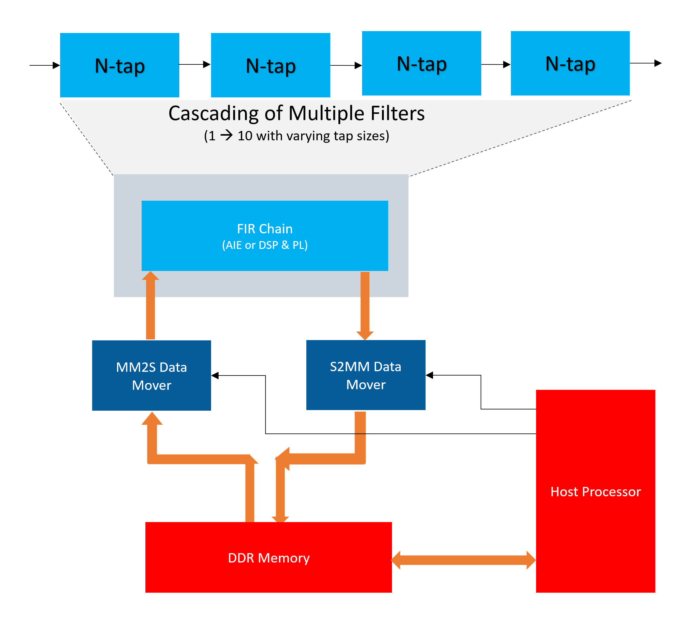
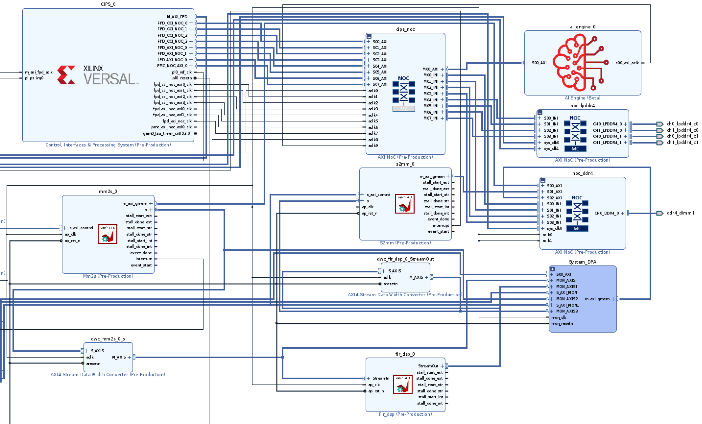

<table class="sphinxhide" width="100%">
 <tr>
   <td align="center"><h1>2022.1 Versal AI Engine/HLS FIR Filter Tutorial (HLS Implementation)</h1>
   </td>
 </tr>
</table>

# Table of Contents
[Building the Design](#building-the-design)

[Hardware Design Details](#hardware-design-details)

[Software Design Details](#software-design-details)

[References](#references)

# Building the Design

<details>
<summary>Design Build</summary>

## Design Build
In this section, you will build and run the FIR filter design using the HLS/DSP implementation. The difference between this implementation and the AI Engine implementation, where users compile the AI Engine design and integrate it into a larger system design (including the programmable logic (PL) kernels and processing system (PS) host application), is that the FIR filter is now implemented in PL using DSP Engines.  

At the end of this section, the design flow will generate a new directory (called `build/`). Underneath are subdirectories named `fir_hls_$(N_FIR_FILTERS)firs_$(N_FIR_TAPS)taps` (for example, `fir_hls_1firs_15taps`) depending on the value of `N_FIR_FILTERS` and `N_FIR_TAPS` chosen in the build. Each subdirectory contains the `hw_emu/` and `hw/` subfolders. The `hw_emu/` subfolder contains the build for hardware emulation. The `hw/` subfolder contains the build for the hardware run on a VCK190 board.   

</details>

<details>
<summary>Make Steps</summary>

## Make Steps
To run the following `make` steps (for example, `make kernels`, `make xsa`, and so on), you must be in the `HLS/` folder. The following options can be specified in the `make` steps. Instructions for how to apply them are provided later in this section.

* TARGET: it can be set to "hw" or "hw_emu" to build the design in hardware or hardware emulation flow. Default is "hw_emu".

* N_FIR_FILTERS: specifies the number of FIR filters in the chain. Default is 1.

* N_FIR_TAPS: specifies the number of FIR filter taps. Default is 15.

* EN_TRACE: Flag to enable trace data to be captured. 0 is disabled and 1 is enabled. Default is 0.

The Makefile uses the following directory references:

```
#Relative FIR filter directory
RELATIVE_PROJECT_DIR := ./

#Absolute FIR filter directory = <user path>/Tutorials/AI_Engine/filter_AIEvsDSP
PROJECT_REPO := $(shell readlink -f $(RELATIVE_PROJECT_DIR))

DESIGN_REPO  := $(PROJECT_REPO)/design
PL_SRC_REPO  := $(DESIGN_REPO)/pl_src
HOST_APP_SRC := $(DESIGN_REPO)/host_app_src
VIVADO_METRICS_SCRIPTS_REPO := $(DESIGN_REPO)/vivado_metrics_scripts

DIRECTIVES_REPO        := $(DESIGN_REPO)/directives
SYSTEM_CONFIGS_REPO    := $(DESIGN_REPO)/system_configs
PROFILING_CONFIGS_REPO := $(DESIGN_REPO)/profiling_configs
EXEC_SCRIPTS_REPO      := $(DESIGN_REPO)/exec_scripts
PYTHON_SCRIPTS_REPO    := $(DESIGN_REPO)/python_scripts

BASE_BLD_DIR := $(PROJECT_REPO)/build
FIR_TAPS_BLD_DIR := $(BASE_BLD_DIR)/fir_$(N_FIR_TAPS)_taps
FIR_FILTERS_DIR  := $(FIR_TAPS_BLD_DIR)/x$(N_FIR_FILTERS)_firs
BUILD_TARGET_DIR := $(FIR_FILTERS_DIR)/$(TARGET)

VIVADO_REPORTS_REPO := $(PROJECT_REPO)/reports_dir
VIVADO_BLD_REPORTS_DIR := $(REPORTS_REPO)/fir_$(N_FIR_TAPS)_taps/x$(N_FIR_FILTERS)_firs

EMBEDDED_PACKAGE_OUT := $(BUILD_TARGET_DIR)/package
EMBEDDED_EXEC_SCRIPT := run_script.sh
```

</details>

<details>
<summary>Build the Entire Design with a Single Command</summary>

## Build the Entire Design with a Single Command
If you are already familiar with the AI Engine and Vitis™ accelerated kernel compilation flows, you can build the entire design with one command:

```bash
make run (default hardware emulation, 1 filter 15 taps, no trace enabled)
```
or
```bash
make run TARGET=hw N_FIR_FILTERS=5 N_FIR_TAPS=15 EN_TRACE=1   (hardware, 5 FIR filters, each with 15 taps, enable tracing)
```

This command will run the `make kernels`,`make xsa`,`make application`,`make package` and `make run_emu` for hardware emulation or to run on hardware (VCK190 board) depending on the `TARGET` you specify. The default `TARGET` without specification is hw_emu. The settings also apply to the following individual make steps.

**Note**

1) The generated files for a particular build are placed under individual directory: build/fir_hls_$(N_FIR_FILTERS)firs_$(N_FIR_TAPS)taps
2) See the specification in each make step for options used and location of input and output files.

</details>

The individual make steps to build the design with the options that applied to them are specified as follows.

<details>
<summary>make kernels: Compile PL Kernels</summary>

## make kernels: Compile PL Kernels
In this step, the Vitis compiler takes any kernels (RTL or HLS C) in the PL region of the target platform (`xilinx_vck190_base_202210_1`) and compiles them into their respective XO files.

The following commands compiles the kernels (default TARGET=hw_emu, N_FIR_FILTERS=1, N_FIR_TAPS=15, EN_TRACE=0):

```
make kernels
```

The expanded command is as follows:
```
mkdir -p ../build/fir_hls_$(N_FIR_FILTERS)firs_$(N_FIR_TAPS)taps/hw_emu

cd ../build/fir_hls_$(N_FIR_FILTERS)firs_$(N_FIR_TAPS)taps/hw_emu

v++ --target hw_emu					\
   --hls.pre_tcl ./directives/hls_pre.tcl		\
	--hls.clock 500000000:fir_hls 			\
	--platform xilinx_vck190_base_202210_1		\
	--include ../../../design/pl_src 		\
	--save-temps 					\
	--temp_dir _x 					\
	--verbose 					\
	-g -c 						\
	-k fir_hls 					\
	../../../design/pl_src/fir_hls.cpp 		\
	-o fir_hls.hw_emu.xo   

v++ --target hw_emu					\
	--hls.clock 250000000:datamover 			\
	--platform xilinx_vck190_base_202210_1		\
	--save-temps 					\
	--temp_dir _x 					\
	--verbose 					\
	-g -c 						\
	-k datamover 					\
	../../../design/pl_src/datamover.cpp 		\
	-o datamover.hw_emu.xo   

 ```
Summary of the switches used:
|Switch|Description|
|  ---  |  ---  |
|--target \| -t [hw\|hw_emu]|Specifies the build target.|
|--hls.clock | Specifies a frequency in Hz at which the listed kernel(s) should be compiled by Vitis HLS. |
|--platform \| -f|Specifies the name of a supported acceleration platform as specified by the $PLATFORM_REPO_PATHS environment variable or the full path to the platform XPFM file.|
|--save-temps \| -s|Directs the Vitis compiler command to save intermediate files/directories created during the compilation and link process. Use the `--temp_dir` option to specify a location to write the intermediate files to.|
|--temp_dir <string>|This allows you to manage the location where the tool writes temporary files created during the build process. The temporary results are written by the Vitis compiler, and then removed, unless the `--save-temps` option is also specified.|
|--verbose|Display verbose/debug information.|
| -g | Generates code for debugging the kernel during software emulation. Using this option adds features to facilitate debugging the kernel as it is compiled. |
|--compile \| -c|Required for compilation to generate XO files from kernel source files.|
|--kernel \<arg\>\|-k \<arg\>|Compile only the specified kernel from the input file. Only one -k option is allowed per Vitis compiler command.|
|--output \| -o|Specifies the name of the output file generated by the V++ command. The compilation process output name must end with the XO file suffix.|

[Detailed Description of All Vitis Compiler Switches](https://docs.xilinx.com/r/en-US/ug1393-vitis-application-acceleration/Vitis-Compiler-Command)

|Input|Description|
|  ---  |  ---  |
|fir_hls.cpp|The FIR filter chain PL kernel source code.|
|datamover.cpp|The data-mover PL kernel source code.|

|Output|Description|
|  ---  |  ---  |
|fir_hls.hw/hw_emu.xo|The FIR filter chain PL kernel object file.|
|datamover.hw/hw_emu.xo|The stream-to-memory-mapped data-mover kernel object file.|

</details>

<details>
<summary>make xsa: Use Vitis Tools to Link HLS Kernels with the Platform</summary>

## make xsa: Use Vitis Tools to Link HLS Kernels with the Platform
After the PL HLS kernels have been compiled, you can use the Vitis compiler to link them with the platform to generate an XSA file.

The Vitis tools allow you to integrate the HLS kernels into an existing extensible platform. This is an automated step from a software developer perspective where the platform chosen is provided by the hardware designer (or you can opt to use one of the many extensible base platforms provided by Xilinx and the Vitis tools build the hardware design and integrate the PL kernels into the design).

To test this feature in this tutorial, use the base VCK190 platform to build the design.

The command to run this step is shown as follows (default TARGET=hw_emu, N_FIR_FILTERS=1, N_FIR_TAPS=15, EN_TRACE=0):
```
make xsa
```

The expanded command is as follows:
```
cd ../build/fir_hls_$(N_FIR_FILTERS)firs_$(N_FIR_TAPS)taps/hw_emu

v++ -l 						\
	--platform xilinx_vck190_base_202210_1 		\
	--include ../../../design/pl_src 		\
	--save-temps 					\
	--temp_dir _x 					\
	--verbose 					\
	-g 						\
	--clock.defaultTolerance 0.001 			\
	--clock.freqHz 250000000:datamover_0 		\
	--clock.freqHz 500000000:fir_hls_0 		\
	--vivado.synth.jobs 16				\
	--vivado.impl.jobs 16				\
	--config $(DESIGN_REPO)/system.cfg 		\
	-t hw_emu 					\
	-o vck190_hls_fir.hw_emu.xsa  		\
	datamover.hw_emu.xo					\
   fir_hls.hw_emu.xo

```

If EN_TRACE is enabled, the following `v++` flags are also set:
```
	--profile.trace_memory DDR			\
	--profile.data datamover:datamover_0:all \
	--profile.data fir_hls:dir_hls_0:all

```
By enabling EN_TRACE=1 timing violation occurs for 10 filters,tolerance of WNS=-0.050 is set:
```
--xp param:compiler.worstNegativeSlack=-0.050
```

This will capture trace data for the ports specified.

Summary of the Switches used:

|Switch|Description|
|  ---  |  ---  |
|--platform \| -f|Specifies the name of a supported acceleration platform as specified by the $PLATFORM_REPO_PATHS environment variable or the full path to the platform XPFM file.|
|--save-temps \| -s|Directs the `v++` command to save intermediate files/directories created during the compilation and link process. Use the `--temp_dir` option to specify a location to write the intermediate files to.|
|--temp_dir <string>|This allows you to manage the location where the tool writes temporary files created during the build process. The temporary results are written by the Vitis compiler, and then removed, unless the `--save-temps` option is also specified.|
|--verbose|Display verbose/debug information.|
| -g | Generates code for debugging the kernel during software emulation. Using this option adds features to facilitate debugging the kernel as it is compiled. |
|--clock.freqHz \<freq_in_Hz\>:\<cu\>\[.\<clk_pin\>\]|Specifies a clock frequency in Hz and assigns it to a list of associated compute units (CUs) and optionally specific clock pins on the CU.|
|--config <config_file>|Specifies a configuration file containing `v++` switches.|
|--target \| -t [hw\|hw_emu]|Specifies the build target.|
|--output \| -o|Specifies the name of the output file generated by the `v++` command. The linking process output file name must end with the .xsa suffix|
|--profile.data [<kernel_name>\|all]:[<cu_name>\|all]:[<interface_name>\|all]\(:[counters\|all]\)|Enables monitoring of data ports through the monitor IPs. This option needs to be specified during linking. [Detailed Profiling Options](https://docs.xilinx.com/search/all?query=--profile+Options&content-lang=en-US) |
|--profile.trace_memory \<FIFO\>:\<size\>\|\<MEMORY\>[\<n\>]|When building the hardware target \(-t=hw\), use this option to specify the type and amount of memory to use for capturing trace data. [Detailed Profiling Options](https://docs.xilinx.com/search/all?query=--profile+Options&content-lang=en-US) |

[Detailed Description of All Vitis Compiler Switches](https://docs.xilinx.com/r/en-US/ug1393-vitis-application-acceleration/Vitis-Compiler-Command)
[Linking the Kernels in Vitis](https://docs.xilinx.com/r/en-US/ug1393-vitis-application-acceleration/Linking-the-Kernels)

|Inputs Sources|Description|
|  ---  |  ---  |
|datamover.hw/hw_emu.xo|The data-mover kernel object file.|
|fir_hls.hw/hw_emu.xo|The FIR filter chain PL kernel object file.|

|Output Objects|Description|
|  ---  |  ---  |
|vck190_hls_fir.hw_emu.xsa|Compiled Platform Binary Container|

</details>

 <details>
<summary>make application: Compile the Host Application</summary>

## make application: Compile the Host Application
You can compile the host application by following the typical cross-compilation flow for the Cortex-A72. To build the application run the following command (default TARGET=hw_emu, N_FIR_FILTERS=1, N_FIR_TAPS=15, EN_TRACE=0):
```
make application
```

The expanded command is as follows:
```
aarch64-linux-gnu-g++ 	-O 					\
			-c -std=c++14 				\
			-D__linux__ 				\
			-DXAIE_DEBUG				\
         -DITER_CNT=8 \
         -DN_FIR_FILTERS=1 \
         -DN_FIR_TAPS=15 \
			-I$(PLATFORM_REPO_PATHS)/sw/versal/xilinx-versal/sysroots/aarch64-xilinx-linux/usr/include/xrt 		\
			-I$(PLATFORM_REPO_PATHS)/sw/versal/xilinx-versal/sysroots/aarch64-xilinx-linux/usr/include		\
			-I$(PLATFORM_REPO_PATHS)/sw/versal/xilinx-versal/sysroots/aarch64-xilinx-linux/usr/lib			\
			-I../../../design/app_src		\
			-I../../../design/pl_src		\
			../../../design/app_src/fir_aie_app.cpp \
			-o ../fir_aie_app.o 			\
			--sysroot=$(PLATFORM_REPO_PATHS)/sw/versal/xilinx-versal/sysroots/aarch64-xilinx-linux 			\
			-L$(PLATFORM_REPO_PATHS)/sw/versal/xilinx-versal/sysroots/aarch64-xilinx-linux/usr/lib 			\
			-lxrt_coreutil

aarch64-linux-gnu-g++ 	../fir_hls_app.o			\
			--sysroot=$(PLATFORM_REPO_PATHS)/sw/versal/xilinx-versal/sysroots/aarch64-xilinx-linux			\
			-L$(PLATFORM_REPO_PATHS)/sw/versal/xilinx-versal/sysroots/aarch64-xilinx-linux/usr/lib 			\
			-lxrt_coreutil 				\
			-o fir_hls_xrt.elf
```
Summary of the Switches used:
|Switch|Description|
|  ---  |  ---  |
|-O \| Optimize| Optimizing compilation takes somewhat more time, and a lot more memory for a large function. With -O, the compiler tries to reduce code size and execution time, without performing any optimizations that can take a great deal of compilation time.|
|-c |Compile or assemble the source files, but do not link.|
|-std=<\standard\>|Set the language standard.|
|-D__linux__| |
|-DXAIE_DEBUG|Enable debug interface capabilities where certain core status, event status, or stack trace can be dumped out.|
|-D\<Pre-processor Macro String\>=\<value\>|Pass Pre-processor Macro definitions to the cross-compiler.|
|-I \<dir\>|Add the directory `dir` to the list of directories to be searched for header files.|
|-o \<file\>|Place output in file `<file>`. This applies regardless of the output being produced, whether it be an executable file, an object file, an assembler file or preprocessed C code.|
|--sysroot=\<dir\>|Use `dir` as the logical root directory for headers and libraries. For example, if the compiler would normally search for headers in `/usr/include` and libraries in `/usr/lib`, it will instead search `dir/usr/include` and `dir/usr/lib`. This is automatically set by the `env_setup.sh` script|
|-l\<library\>|Search the library named `library` when linking. The 2D-FFT tutorial requires `adf_api_xrt` and `xrt_coreutil` libraries.|
|-L \<dir\>|Add directory `<dir>` to the list of directories to be searched for -l.|

[XRT Documentation](https://xilinx.github.io/XRT/2022.1/html/index.html)
[Details of Host Application Programming](https://docs.xilinx.com/r/en-US/ug1076-ai-engine-environment/Host-Programming-for-Bare-metal-Systems)

|Inputs Sources|Description|
|  ---  |  ---  |
|fir_hls_app.cpp|Host processor application source code file that will run on an A72 processor.|

|Intermediate Objects|Description|
|  ---  |  ---  |
|fir_hls_app.o|Compiled host processor application object.|


|Output Objects|Description|
|  ---  |  ---  |
|fir_hls_xrt.elf|The executable that will run on an A72 processor.|

</details>

<details>
<summary>make package: Package the Design</summary>

## make package: Package the Design
With the HLS kernel outputs created, as well as the new platform, you can now generate the programmable device image (PDI) and a package to be used on an SD card. The PDI contains all executables, bitstreams, configurations of the device. The packaged SD card directory contains everything to boot Linux, the generated applications, and `.xclbin`.

The command to run this step is as follows (default TARGET=hw_emu, N_FIR_FILTERS=1, N_FIR_TAPS=15, EN_TRACE=0):
```
make package
```

or
```
cd ../build/fir_hls_$(N_FIR_FILTERS)firs_$(N_FIR_TAPS)taps/hw_emu

v++	-p  							\
	-t hw_emu						\
	--save-temps						\
	--temp_dir ../build/fir_hls_$(N_FIR_FILTERS)firs_$(N_FIR_TAPS)taps/hw_emu/_x						\
	-f xilinx_vck190_base_202210_1												\
	--package.sd_dir $(PLATFORM_REPO_PATHS)/sw/versal/xrt 									\
	--package.rootfs $(PLATFORM_REPO_PATHS)/sw/versal/xilinx-versal/rootfs.ext4 						\
	--package.kernel_image $(PLATFORM_REPO_PATHS)/sw/versal/xilinx-versal/Image 						\
	--package.boot_mode=sd													\
	--package.out_dir ../build/fir_hls_$(N_FIR_FILTERS)firs_$(N_FIR_TAPS)taps/hw_emu/package	        		\
	--package.image_format=ext4												\
	--package.sd_file	../build/fir_hls_$(N_FIR_FILTERS)firs_$(N_FIR_TAPS)taps/hw_emu/fir_hls_xrt.elf     		\
				../build/fir_hls_$(N_FIR_FILTERS)firs_$(N_FIR_TAPS)taps/hw_emu/vck190_hls_fir.hw_emu.xsa 	\
```
If EN_TRACE is enabled, the following `v++` flags are also set:
```
	--package.sd_file ./xrt.ini
```
This will include the XRT ini file which includes tracing parameters.

|Switch|Description|
|  ---  |  ---  |
|--package \| -p|Packages the final product at the end of the Vitis compile and link build process.|
|--target \| -t [hw\|hw_emu]|Specifies the build target.|
|--save-temps \| -s|Directs the V++ command to save intermediate files/directories created during the compilation and link process. Use the `--temp_dir` option to specify a location to write the intermediate files to.|
|--temp_dir <string>|This allows you to manage the location where the tool writes temporary files created during the build process. The temporary results are written by the Vitis compiler, and then removed, unless the `--save-temps` option is also specified.|
|--platform \| -f|Specifies the name of a supported acceleration platform as specified by the $PLATFORM_REPO_PATHS environment variable or the full path to the platform XPFM file.|
|--package.sd_dir \<arg\>|Where <arg> specifies a folder to package into the sd_card directory/image. The contents of the directory are copied to a sub-folder of the sd_card folder.|
|--package.rootfs \<arg\>|Where \<arg\> specifies the absolute or relative path to a processed Linux root file system file. The platform RootFS file is available for download from xilinx.com. Refer to the Vitis Software Platform Installation for more information.|
|--package.kernel_image \<arg\>|Where \<arg\> specifies the absolute or relative path to a Linux kernel image file. Overrides the existing image available in the platform. The platform image file is available for download from xilinx.com. Refer to the Vitis Software Platform Installation for more information.|
|--package.boot_mode \<arg\>|Where \<arg\> specifies <ospi\|qspi\|sd> Boot mode used for running the application in emulation or on hardware.|
|--package.image_format|Where \<arg\> specifies \<ext4\|fat32\> output image file format. `ext4`: Linux file system and `fat32`: Windows file system|
|--package.sd_file|Where \<arg\> specifies an ELF or other data file to package into the `sd_card` directory/image. This option can be used repeatedly to specify multiple files to add to the `sd_card`.|


[Detailed Description of All Vitis Compiler Switches](https://docs.xilinx.com/r/en-US/ug1393-vitis-application-acceleration/Vitis-Compiler-Command)
[Details of Packaging the System](https://docs.xilinx.com/r/en-US/ug1076-ai-engine-environment/Packaging-the-System8)

|Inputs Sources|Description|
|  ---  |  ---  |
|$(PLATFORM_REPO_PATHS)/sw/versal/xrt|The PS Host Application needs the XRT headers in this folder to execute.|
|$(PLATFORM_REPO_PATHS)/sw/versal/xilinx-versal/rootfs.ext4|The Root Filesystem file for Petalinux.|
|$(PLATFORM_REPO_PATHS)/sw/versal/xilinx-versal/Image|The pre-built Petalinux Image the processor boots from.|
|$(BUILD_TARGET_DIR)/fir_hls_xrt.elf|The PS Host Application executables created in the `make application` step.|
|$(BUILD_TARGET_DIR)/vck190_hls_fir.hw_emu.xsa|The XSA file created in the `make xsa` step.|

The output of the V++ Package step is the package directory that contains the contents to run hardware emulation.

|Output Objects|Description|
|  ---  |  ---  |
|$(BUILD_TARGET_DIR)/package|The hardware emulation package that contains the boot file, hardware emulation launch script, the PLM and PMC boot files, the PMC and QEMU command argument specification files, and the Vivado® tools simulation folder.|

</details>

<details>
<summary>make run_emu: Run Hardware Emulation</summary>

## make run_emu: Run Hardware Emulation
After packaging, everything is set to run emulation or hardware.
To run emulation use the following command (default TARGET=hw_emu, N_FIR_FILTERS=1, N_FIR_TAPS=15, EN_TRACE=0):
```
make run_emu
```
or
```
cd ../build/fir_hls_$(N_FIR_FILTERS)firs_$(N_FIR_TAPS)taps/hw_emu/package
./launch_hw_emu.sh
```
When launched, you will see the QEMU simulator load. Wait for the autoboot countdown to go to zero, and after a few minutes, you will see the root Linux prompt come up:
```bash
root@versal-rootfs-common-2022_1:~#
```

In some cases, the following error might come up on the screen:
```
root@versal-rootfs-common-2022_1:~# xinit: giving up
xinit: unable to connect to X server: Connection refused
xinit: server error
Enabling notebook extension jupyter-js-widgets/extension...
      - Validating: OK
[C 13:46:09.233 NotebookApp] Bad config encountered during initialization:
[C 13:46:09.239 NotebookApp] No such notebook dir: ''/usr/share/example-notebooks''
```
The error can be ignored. Press <enter> to return to the root prompt.

After the root prompt comes up, run the following commands to run the design:  
```
mount /dev/mmcblk0p1 /mnt
cd /mnt
export XLC_EMULATION_MODE=hw_emu
export XILINX_XRT=/usr
./fir_hls_xrt.elf a.xclbin
```
The `fir_hls_xrt.elf` should execute, and after a few minutes, you should see the output with *TEST PASSED* on the console. When this is shown, run the following keyboard command to exit the QEMU instance:

```
#To exit QEMU Simulation
Press Ctrl-A, let go of the keyboard, and then press x
```

To run with waveform do the following:
```
cd ../build/fir_hls_$(N_FIR_FILTERS)firs_$(N_FIR_TAPS)taps/hw_emu/package
./launch_hw_emu.sh -graphic -xsim
```
The XSIM Waveform Viewer is launched. Drag and drop the signals into the Viewer and click Play to start the emulation. Go back to the terminal and wait for the Linux prompt to show up.

In the XSIM Waveform Viewer, you will see the signals you added to the waveform adjusting over the execution of the design. Once done, hit the pause button and close the window to end the emulation.

</details>

<details>
<summary>TARGET=hw: Run on Hardware</summary>

## Run on Hardware

To run the design in hardware, re-run the following "make" steps with TARGET=hw and other applicable options (see the make steps above)
```
make kernels     TARGET=hw
make xsa      TARGET=hw
make application TARGET=hw
make package     TARGET=hw
```
this can also be done is a single step as follows:
```
make build TARGET=hw
```

Now follow **Steps 1-9** to run the `fir_hls_xrt.elf` executable on your VCK190 board.

**Step 1.** Ensure your board is powered OFF.

**Step 2.** Use an SD card writer (such as balenaEtcher) to flash the `sd_card.img` file onto an SD card.

**Step 3.** Plug the flashed SD card into the top slot of the VCK190 board.

**Step 4.** Set the switch SW1 Mode\[3:0\]=1110 = OFF OFF OFF ON.

**Step 5.** Connect your computer to the VCK190 board using the included USB cable.

**Step 6.** Open a TeraTerm terminal and select the correct COM port. Set the port settings to the following:
```
Port: <COMMXX>
Speed: 115200
Data: 8 bit
Parity: none
Stop Bits: 1 bit
Flow control: none
Transmit delay: 0 msec/char 0 msec/line
```

**Step 7.** Power ON the board.

**Step 8.** Wait until you see the `root@versal-rootfs-common-2022_1` Linux command prompt. Press enter a few times to get past any `xinit` errors.

**Step 9.** Run the following commands into the TeraTerm terminal:
```
cd /mnt/sd-mmcblk0p1
export XILINX_XRT=/usr
./init.sh
./fir_hls_xrt.elf a.xclbin
```

After execution completes and the testcase passes data integrity check, 'TEST PASSED' should appear on the terminal.

</details>

# Hardware Design Details
<details>
<summary>FIR Filter HLS Implementation Architecture</summary>

## FIR Filter HLS Implementation Architecture

The following figure shows a high level block diagram of the design. The test harness consists of the compute kernel and the data mover kernel. This setup is maintained in the two implementations (using HLS/DSP engines in this section of the tutorial and AI Engine in the other). In this setup, the interface between the data mover kernel and FIR filter kernel is AXI4-Stream. The data width of both the kernels is 128 bits, and they run at 250 MHz, providing a transfer rate of up to 1.2 GSPS.



</details>

<details>
<summary>Design Details</summary>

## Design Details
The design in this tutorial starts with a base platform containing the control interface and processing system (CIPS), NoC, and AI Engine and the interfaces among them. The v++ linker step builds on top of the base platform by adding the PL kernels. To add the various functions in a system level design, PL kernels are added to the base platform depending on the application, that is, the PL kernels present in each design may vary. In the design, the components are added by v++ -l step (make XSA in the tool flow section above) and include the following:
* FIR Filter Chain kernel (`fir_hls.[hw|hw_emu].xo`)
* data mover kernel (`datamover.[hw|hw_emu].xo`)
* connections interfaces defined in system configuration file (system.cfg)

To see a schematic view of the design with the extended platform as shown in the following figure, open in Vivado tools:

`build/fir_hls_$(N_FIR_FILTERS)firs_$(N_FIR_TAPS)taps/[hw|hw_emu]/_x/link/vivado/vpl/prj/prj.xpr`



The actual FIR filter chain itself is implemented in a HLS PL kernel, which connects the specified number of filters together in a chain. For purposes of simplicity in comparing the designs, all the filters in the chain are identical, though it is unlikely such a chain would be used in a practical application.

Notice the system debugging and profiling IP (DPA) is added to the PL region of the device to capture AI Engine run-time trace data if the EN_TRACE option is enabled in the design. The datamover kernel and the AI Engine array interface are both operating at 250 MHz.

</details>

<details>
<summary>HLS PL Kernels</summary>

## HLS PL Kernels
In the HLS implementation of the FIR Filter design, the AI Engine is not used and therefore there are no AI Engine-related kernels and graphs. The compute and datamover functions are implemented as HLS kernels in the PL region.

The PL kernel `fir_hls` implements the FIR filter chain.  It contains a single AXI-stream input port and a single AXI-stream output port.  Since the FIR function requires no initialization, no additional control/status ports are required.

The PL-based data mover consists of DATAMOVER kernels. It moves a data pattern into the AI Engine array using a streaming interface. The final FIR output from the AI Engine array is moved back into the datamover kernel by way of a streaming interface and is checked for errors. The AI Engine array interface with the datamover kernel uses an AXI4-Stream interface.
Some additional details regarding the data mover kernels include:

**DATAMOVER**
* The data width is 128 bits.
* The frequency is 250 MHz.

</details>

# Software Design Details
The software design in the FIR Filter HLS implementation consists of the following sections:

<details>
<summary>PL Kernels</summary>

## PL Kernels
For the HLS implementation of this design, the data mover kernel and the FIR filter chain are all implmented in HLS.

### fir_hls (fir_hls.cpp)
The fir_filter kernel consists of a single AXI-stream input and AXI-stream output.  The kernel makes use of the FIR Compiler IP, the same one that can be instantiated as an IP in Vivado tools. In HLS, it is instantiated as an object in the HLS code, and then cascaded together into a chain by the design.

The following include allows us to utilize the FIR Compiler interface provided in the HLS IP libraries from the Vitis HLS Libraries Reference:
```
#include <hls_fir.h>
```   

This header files provides a parameterization struct (`hls::ip_fir::params_t`) that sets the static parameters of the filter:
```
struct fir_params : hls::ip_fir::params_t {
    static const unsigned num_coeffs    = N_FIR_TAPS;
    static const double   coeff_vec[N_FIR_TAPS];
    static const unsigned coeff_width   = 16;
    static const unsigned input_width   = 16;
    static const unsigned output_width  = 16;
    static const unsigned output_rounding_mode = hls::ip_fir::truncate_lsbs;
    static const unsigned input_length  = WINDOW_LENGTH;
    static const unsigned output_length = WINDOW_LENGTH;
    static const unsigned sample_period = 1;
    static const unsigned coeff_structure = hls::ip_fir::symmetric;
};
```
Here we set key non-default values for the filter, the number of taps, the tap vectors (in `coeff_vec`), data widths, truncation mode, and filter structure.

Note that the FIR filter wrapper has the concept of an input/output length, which is called WINDOW_LENGTH. This is unrelated to FIR_WINDOW_SIZE in the AI Engine version of the design. In AI Engine graph design, data is processed in fixed size batches (windows), and FIR_WINDOW_SIZE specifies the size of these physical buffers. Here the buffer size will directly impact latency.

In the HLS (DSP) implementation, arrays (windows) are a means of passing data to functions, but these data arrays are ultimately translated into AXI-streams. For this implementation, WINDOW_SIZE is made to be 64k.

The following section instantiates arrays of filter objects (one for real values, one for imaginary):
```
static hls::FIR<fir_params> fir_real[N_FIR_FILTERS];
static hls::FIR<fir_params> fir_imag[N_FIR_FILTERS];
```

The `complex_split` function is used to take the incoming array (stream) of 32-bit data, and split each word into two 16-bit word streams:
```
void complex_split (hls::stream<ap_axiu<32, 0, 0, 0> >& StreamIn,
                    DataWindow_t DataRealIn,
                    DataWindow_t DataImagIn
                   )
{
    for (int ix = 0 ; ix < WINDOW_LENGTH; ix++)  {
        #pragma HLS PIPELINE II=1
        ap_axiu<32, 0, 0, 0> StreamWord = StreamIn.read();
        uint32_t word = StreamWord.data;
        DataRealIn[ix] = (word >> 16) & 0xFFFF;
        DataImagIn[ix] =  word        & 0xFFFF;
    }
}
```

The `complex_merge` function is the inverse of complex_split, and used to merge the words from wo incoming 16-bit streams into one 32-bit stream:
```
void complex_merge (DataWindow_t DataRealOut,
                    DataWindow_t DataImagOut,
                    hls::stream<ap_axiu<32, 0, 0, 0> >& StreamOut
                )
{
    for (int ix = 0 ; ix < WINDOW_LENGTH; ix++)  {
        #pragma HLS PIPELINE II=1
        uint32_t word = (((uint32_t) DataRealOut[ix]) << 16) | (DataImagOut[ix] & 0xFFFF);
        ap_axiu<32, 0, 0, 0> StreamWord;
        StreamWord.data = word;
        StreamOut.write(StreamWord);
    }
}
```

The `dsp_run` function takes to two 16-bit streams, and directs them to two FIR filters which are run in parallel:
```
void dsp_run (int N,
              DataWindow_t DataRealIn,
              DataWindow_t DataImagIn,
              DataWindow_t DataRealOut,
              DataWindow_t DataImagOut
             )
{
    #pragma HLS dataflow
    fir_real[N].run(DataRealIn, DataRealOut);
    fir_imag[N].run(DataImagIn, DataImagOut);
}
```
The #pragma HLS dataflow directive instructs the compile to run the two processes to run in parallel, much as would be done in RTL.

The function `fir_wrap` is used to construct the filter chain. It uses a series of #if/#elif preprocessor directives to enable the code, since it was not possible to generate it iteratively using a loop. (The limitation being synthesis of arrays of arrays).
```
void fir_wrap (hls::stream<ap_axiu<32, 0, 0, 0> >& StreamIn,
               hls::stream<ap_axiu<32, 0, 0, 0> >& StreamOut
              )
{
    #pragma HLS dataflow

    DataWindow_t DataRealIn,  DataImagIn;
    DataWindow_t DataRealOut, DataImagOut;
    #pragma HLS stream variable=DataRealIn   depth=16
    #pragma HLS stream variable=DataRealOut  depth=16
    #pragma HLS stream variable=DataImagIn   depth=16
    #pragma HLS stream variable=DataImagOut  depth=16

    complex_split(StreamIn, DataRealIn, DataImagIn);

#if (N_FIR_FILTERS == 1)
    dsp_run(0, DataRealIn,  DataImagIn,  DataRealOut, DataImagOut);
#elif (N_FIR_FILTERS > 1)
    DataWindow_t DataReal_0,  DataImag_0;
    #pragma HLS stream variable=DataReal_0  depth=16
    #pragma HLS stream variable=DataImag_0  depth=16
    dsp_run(0, DataRealIn,  DataImagIn,  DataReal_0, DataImag_0);
#endif

...etc
```

Finally, the `fir_hls` function it a top-level module / kernel available to be linked together to the other HLS kernels.

#### Arguments
The FIR kernel takes the following arguments:
* `hls::stream<ap_axiu<32, 0, 0, 0>>` is a data type defined in `ap_axi_sdata.h`. It is a special data class used for data transfer when using a streaming platform. The parameter `<D>` is the data width of the streaming interface which is set to 32. The remaining three parameters should be set to 0.

The fir_hls kernel also specifies the following pragmas to help optimize the kernel code and adhere to interface protocols:
#### pragma HLS interface ap_ctrl_none port=return
This kernel requires no additional control/status interfaces.

### datamover (datamover.cpp)

The datamover kernel reads and writes data from and to the AI Engine array, through the AXI4-Stream interface.

#### Arguments
The datamover kernel takes the following arguments:
* `ap_int<N>` is an arbitrary precision integer data type defined in `ap_int.h` where `N` is a bit-size from 1-1024. In this design, the bit-size is set to 128.
* `hls::stream<qdma_axis<D,0,0,0>>` is a data type defined in `ap_axi_sdata.h`. It is a special data class used for data transfer when using a streaming platform. The parameter `<D>` is the data width of the streaming interface which is set to 128. The remaining three parameters should be set to 0.

The datamover kernel also specifies the following pragmas to help optimize the kernel code and adhere to interface protocols:

#### pragma HLS INTERFACE s_axilite
The datamover kernels has one `s_axilite` interface (specifying an AXI4-Lite slave I/O protocol) with `bundle=control` associated with all the arguments (`size` and `iterCnt`). This interface is also associated with `return`.

#### pragma HLS INTERFACE axis
The datamover kernel has one `axis` interface (specifying an AXI4-Stream I/O protocol).

#### pragma HLS PIPELINE II=1
The datamover kernel has a `for` loop that is a candidate for burst read because the memory addresses per loop iteration are consecutive (`ARBURST=INCR`). To pipeline this `for` loop, you can use this pragma by setting the initiation interval (`II`) = 1.

</details>

<details>
<summary>PS Host Application</summary>

## PS Host Application
The FIR filter HLS(DSP) tutorial uses the embedded PS as an external controller to control the AI Engine graph and data mover PL kernel. Review [Programming the PS Host Application Section in the AI Engine Documentation](#ai-engine-documentation) to understand the process to create a host application. Note that unlike the AI Engine implementation, there are no AI Engine graphs and associated control code.

Within the PS host application, two classes are defined (datamover_class), which defines methods used to control and monitor the corresponding kernels.

The main sections of the PS host application code is described in the following subsections:

### load_xclbin Function
This function is responsible for loading the XCLBIN file into the device.

### Datamover Class
This class provides the following methods for controlling/monitoring this kernel:
* init(): opens the kernel, and sets the kernel parameters (location of the buffer object, and its length).
* run(): starts execution of the datamover kernel
* waitTo_complete(): waits for the datamover kernel to finish
* close(): closes the input data buffer object and kernel

### Main Function
This is the main PS application code that controls the kernels and runs data through the design. The various steps this code goes through is described in the following subsections.

#### 1. Check Command Line Argument
The beginning of the A72 application is represented by the main function. It takes in one command line argument: an XCLBIN file.

#### 2. Open XCLBIN
The A72 application loads the XCLBIN binary file and creates the data mover kernels to be executed on the device.

#### 3. Create and Initialize Data Mover Kernels
Create the kernel objects and initialize them.

#### 4. Run Data Mover Kernels
Start execution of the datamover kernel.

#### 5. Wait for Data Mover Kernels to Complete
Wait for the datamover kernel to complete.

#### 6. Verify Output Results
Compare data in output with the reference golden data and get the error count from the kernel.

#### 7. Release Allocated Resources
Close the datamover kernel objects.

</details>

# References
The following documents provide supplemental information for this tutorial.

### [AI Engine Documentation](https://docs.xilinx.com/search/all?filters=Document_ID~%2522UG1076%2522_%2522UG1079%2522&content-lang=en-US)
Contains sections on how to develop AI Engine graphs, how to use the AI Engine compiler, AI Engine simulation, and performance analysis.

### [ FIR Compiler v7.2](https://www.xilinx.com/support/documentation/ip_documentation/fir_compiler/v7_2/pg149-fir-compiler.pdf)
Describes the FIR Compiler IP describes all of the parameters and settings and how they control the final filter implementation.


# Support

GitHub issues will be used for tracking requests and bugs. For questions go to [forums.xilinx.com](http://forums.xilinx.com/).

# License

Licensed under the Apache License, Version 2.0 (the "License"); you may not use this file except in compliance with the License.

You may obtain a copy of the License at [http://www.apache.org/licenses/LICENSE-2.0]( http://www.apache.org/licenses/LICENSE-2.0 )


Unless required by applicable law or agreed to in writing, software distributed under the License is distributed on an "AS IS" BASIS, WITHOUT WARRANTIES OR CONDITIONS OF ANY KIND, either express or implied. See the License for the specific language governing permissions and limitations under the License.

<p align="center"><sup>XD061 | &copy; Copyright 2021–2022 Xilinx, Inc.</sup></p>
