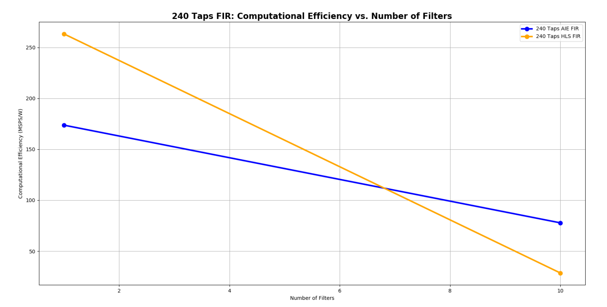

<table class="sphinxhide" width="100%">
 <tr width="100%">
    <td align="center"><h1>Versal® ACAP AI Engine Tutorials</h1>
    <a href="https://www.xilinx.com/products/design-tools/vitis.html">See Vitis™ Development Environment on xilinx.com</br></a>
    <a href="https://www.xilinx.com/products/design-tools/vitis/vitis-ai.html">See Vitis™ AI Development Environment on xilinx.com</a>
    </td>
 </tr>
</table>

# Versal AI Engine/HLS FIR Filter Tutorial

***Version: Vitis 2023.1***

## Table of Contents
[Introduction](#introduction)

[Before You Begin](#before-you-begin)

[Design Implementations](#design-implementations)

[Choosing between AI Engine and HLS Implementations](#Choosing-between-AI-Engine-and-HLS-Implementations)

[AI Engine Specific Design Considerations](#ai-engine-specific-design-considerations)

[Measuring Resources, Throughput, Latency, and Power](#measuring-resources-throughput-latency-and-power)

[Conclusion](#Conclusion)

## Introduction

The AMD Versal™ adaptive SoC is a fully software programmable, heterogeneous compute platform that combines the processor system (PS) (Scalar Engines that include the Arm® processors), programmable logic (PL) (Adaptable Engines that include the programmable logic blocks and memory), and the Intelligent Engines comprising of both the AI and DSP Engines.

This tutorial is one of the several to perform two implementations of a system-level design using AI Engines and HLS with DSP Engines in the Versal device plus PL including LUTs, flip-flops (FFs), and block RAMs. In each implementation, the tutorial takes you through hardware emulation and hardware flow in the context of a complete Versal ACAP system design. A Makefile is provided with each tutorial for additional customisation. 

An important goal and criteria of this tutorial is the use of C++ based kernels for AI Engine and HLS library kernels for DSP Engine and data movers. The use of AMD Vitis™ application acceleration development flow and library kernels is illustrated throughout the tutorial to demonstrate the ease of kernel integration and scalability in a system design. In the Vitis application acceleration development flow, the Vitis HLS tool automates much of the code modifications required to implement and optimize the C/C++ code in PL, including the ease of data mover kernel coding. The inference of required pragmas to produce the right interface for user's function arguments and to pipeline loops and functions is the foundation of the Vitis HLS in the application acceleration flow. Vitis HLS also supports customization of your code to implement different interface standards or specific optimizations to achieve design objectives, enable scaling, and leverage automation.Note: Alternative design methods to Vitis HLS may increase PL based performance. For example, using LogiCORE™ FIR Compiler IP and RTL based data movers could increase raw performance but will increase dynamic power and design time. 

A frequently asked question is whether using AI Engines, HLS or RTL targeting DSPs produces the better implementation. The answer depends on the design objectives, complexity, and characteristics of every individual design. A section in this tutorial is provided which discusses the trade-offs and provides  guidance in helping to determine the best choice for your design.In addition another section discusses AI Engine specific design considerations because AI Engines are a relatively new technology compared to the mature FPGA fabric or PL with DSPs.

<details>
<summary>Objectives</summary>

### Objectives
After completing the tutorial, you should be able to:
* Develop a system level design (FIR filter in this case) by identifying the algorithm and deploying the same algorithm on AI Engine and DSP Engines using Vitis HLS.
* Build a complete system design by going through the various steps in the Vitis unified software platform flow, including creating the AI Engine adaptive data flow (ADF) API graph, compiling the A72 host application, and compiling PL kernels, using the Vitis compiler (`v++`) to link the AI Engine and HLS kernels with the platform, and packaging the design. You will also be able to run the design through the hardware emulation and hardware flow in a mixed System C/RTL cycle-accurate/QEMU-based simulator
* Develop a consistent harness to have the data mover kernels maintain a similar interface with AI Engine/HLS kernels (with AXI4-stream) and DDR memory (memory-mapped AXI4)
* Develop an understanding of graph control APIs to enable run-time updates using the run-time parameter (RTP) interface for the AI Engine implementation and HLS APIs for controlling HLS/PL kernels
* Develop an understanding of the various factors that influence the performance, resources, latency, and power of AI Engine and HLS using DSP implementations, so that an informed choice can be made between the two implementations.

</details>

<details>
<summary>Overview</summary>

### Overview
This tutorial implements a FIR filter chain, one implementation targeted at AI Engines and another targeted at DSP Engines using Vitis HLS.

FIR filters provide a large design space to explore. For the purposes of this tutorial, the following parameters are held fixed/constant:
* Data Type: cint16
* Coefficient type: int16
* Symmetric FIR
* Fixed (that is, non-reloadable) coefficients

The number of filter taps in the filters and the number of cascaded filters in the chain can be specified as parameters in the build process. Each filter in the chain consists of an identical number of taps with identical coefficients. While this is not necessarily a realistic design situation, it provides a simple means for generating, scaling and managing the filter chain. One further simplification is the use of a triangular window for the filter coefficients, allowing the taps to be generated simply through linear interpolation. (See https://www.recordingblogs.com/wiki/triangular-window or https://en.wikipedia.org/wiki/Window_function#Triangular_window)

The same filter chain is deployed in the two implementations using AI and DSP Engines. The design compiles through `v++`, and creates a Petalinux-based platform using a script as well as generate the PDI and host application.

The Makefile based  build process can be directed to build different length chains with a specified number of taps. A similar set of harnesses are developed and maintained between the two implementations to store input/output vectors in DDR memory and use the data mover kernels to move data to and from AI Engine and HLS FIR kernels. In both cases, XRT running A-72 controls data flow in compute and data mover kernels (graph control APIs control AI Engine kernels and HLS APIs control HLS/PL kernels).

</details>

<details>
  <summary>Directory Structure</summary>

### Directory Structure
```
filter_AIEvsHLS
+-- AIE.................................contains AI Engine implementation
|   +-- design .........................contains source and include files
|   |	+-- aie_src ....................AI Engine source code
|   |   +-- exec_files .................contains hw_emu launch script
|   |   +-- host_app_src ...............A72 application source code
|   |	+-- pl_src .....................PL (HLS) source code
|   |   +-- profiling_configs ..........contains xrt.ini file
|   |   +-- python_scripts .............contains script to generate co-efficients
|   |   +-- system_configs..............contains all system configuration files
|   |   +-- vivado_metrics_scripts......contains script for reporting utilisation and power from vivado
|   +-- images .........................contains images of the design
|   +-- Makefile .......................with recipes for each step of the design compilation
|   +-- description.json................required for internal regression 
|   +-- multi_params.json...............required for internal regression 
|   +-- sample_env_setup.sh ............contains all environment variables
+-- HLS.................................contains HLS FIR implementation, targeting DSP Engines
|   +-- design..........................contains source and include files
|   |   +-- directives.................contains directives for various vitis compilation stages like hls.pre_tcl etc
|   |   +-- exec_files .................contains hw_emu launch script
|   |   +-- host_app_src ...............A72 application source code
|   |	+-- pl_src .....................PL (HLS) source code
|   |   +-- profiling_configs ..........contains xrt.ini file
|   |   +-- python_scripts .............contains script to generate co-efficients
|   |   +-- system_configs..............contains all system configuration files
|   |   +-- vivado_metrics_scripts......contains script for reporting utilisation and power from vivado
|   +-- images .........................contains images of the design
|   +-- Makefile .......................with recipes for each step of the design compilation
|   +-- description.json................required for internal regression 
|   +-- multi_params.json...............required for internal regression 
|   +-- sample_env_setup.sh ............contains all environment variables
```

</details>

## Before You Begin

<details>
<summary>Documentation: Explore AI Engine Architecture</summary>

### *Documentation*: Explore AI Engine Architecture

* [AI Engine Development Design Process](https://www.xilinx.com/support/documentation-navigation/design-process/ai-engine-development.html)

* [AM009 AI Engine Architecture Manual](https://docs.xilinx.com/r/en-US/am009-versal-ai-engine/Revision-History)

* [Versal ACAP AI Engines for Dummies](https://forums.xilinx.com/t5/Design-and-Debug-Techniques-Blog/Versal-ACAP-AI-Engines-for-Dummies/ba-p/1132493)

### *Tools Documentation:

* [Versal AI Engines Secure Site](https://www.xilinx.com/member/forms/registration/versal_ai_engines.html#documentation)

* [AI Engine Documentation](https://docs.xilinx.com/search/all?filters=Document_ID~%2522UG1076%2522_%2522UG1079%2522&content-lang=en-US)
</details>

<details>

<summary>Tools: Installing the Tools</summary>

### *Tools*: Installing the Tools

To build and run the FIR filter tutorial (AI Engine and DSP implementations), install the following tools.

* Install the [Vitis Software Platform 2023.1](https://docs.xilinx.com/r/en-US/ug1393-vitis-application-acceleration/Installation)

* Obtain licenses for AI Engine tools

* Follow the instructions in [Installing Xilinx Runtime and Platforms](https://docs.xilinx.com/r/en-US/ug1393-vitis-application-acceleration/Installing-Xilinx-Runtime-and-Platforms) (XRT)

* Download and set up the [VCK190 Vitis Platform for 2023.1](https://www.xilinx.com/support/download/index.html/content/xilinx/en/downloadNav/embedded-platforms.html)

* [DSP Library (DSPLib) Documentation](https://docs.xilinx.com/r/en-US/Vitis_Libraries/dsp/index.html)

* Download the [DSP Library](https://github.com/Xilinx/Vitis_Libraries/tree/master/dsp)

</details>

<details>
<summary>Environment: Setting Up the Shell Environment</summary>

### Environment: Setting Up the Shell Environment
When the elements of the Vitis software platform are installed, update the shell environment script. Set the environment variables to your system specific paths.

Edit `sample_env_setup.sh` script with your file paths:
```bash
export PLATFORM_REPO_PATHS= <YOUR-2023.1-PLATFORM-DIRECTORY>
export XILINX_VITIS = <YOUR-2023.1-VITIS-DIRECTORY>/2023.1
export COMMON_IMAGE_VERSAL=<YOUR-XILINX-VERSAL-COMMON-V2023.1-DIRECTORY>
export DSPLIBS_VITIS=<YOUR-PATH-TO-2023.1-DSP-LIBRARY>

source $COMMON_IMAGE_VERSAL/environment-setup-cortexa72-cortexa53-xilinx-linux
source $XILINX_VITIS/settings64.sh

```
Then source the environment script:
```bash
source sample_env_setup.sh
```  

</details>

<details>
<summary>Validation: Confirming Tool Installation</summary>

### Validation: Confirming Tool Installation
```bash
which vitis
which aiecompiler
```

Confirm that the VCK190 production base platform is available.
```bash
platforminfo --list | grep -m 1 -A 9 vck190_base
```
Output of the previous command should be as follows:
```bash
"baseName": "xilinx_vck190_base_202310_1",
            "version": "1.0",
            "type": "sdsoc",
            "dataCenter": "false",
            "embedded": "true",
            "externalHost": "false",
            "serverManaged": "false",
            "platformState": "pre_synth",
            "usesPR": "false",
```

</details>

## Design Implementations
The Makefile and source files for the AI Engine and HLS implementations are in the respective **AIE** and **HLS** directories. For the documentation of the flow to build the design and details of the hardware and software design, click on each of the following links:

[AI Engines design implementation](AIE)

[HLS with DSP Engines design implementation](HLS)


## Choosing between AI Engine and HLS Implementations
The choice of which engine (AI or DSP) to use for implementing a specific function in your design or application is not always a simple one. This decision should be taken based on specific requirements of your application with respect to performance requirements and resources. There are some high-level guidelines which can help with architecting your design to a Xilinx Versal device with AI Engines. For example, small functions with modest amounts of computation will most likely be more efficient targeting the PL and DSP Engines. However, as the computational FIR_AIE_64_TAPS_xpe_power.PNGneeds start to increase, moving those functions to the AI Engine will provide better efficiency.

It is important not to take that decision in isolation at the function level, but to look at the problem in relation to the complete dataflow path. For instance, an inefficient function implemented in the AI Engine may offer better total efficiency when preceded and followed in the dataflow by large amounts of efficient compute functions. It is likely that it will offer overall better throughput and latency than moving the data to the PL for that specific function and back into the AI Engine array.

For this discussion, computational efficiency is defined as the throughput (samples per second) divided by power (W), and can only be used to compare designs that are identical from a functional standpoint. Given two identical designs with identical throughputs, this tutorial considers the one using less power as a better solution.

Typically, one of the first steps of a design is deciding on an architecture and implementation to meet throughput and latency targets. This architecture/implementation choice generally determines the resources used and power consumed, which may also be required to meet specific targets.

<details>
<summary>Meeting Throughput Requirements</summary>

### Meeting Throughput Requirements

For DSP based design, the designer begins with an estimate of the system clock rate that the PL is capable of, and divides that by the desired filter throughput to determine how many clock cycles can be used to process a sample. By feeding this number into the FIR Compiler, the FIR is constructed with the minimum resources required to implement the design; the higher the clock cycles per sample, the fewer resources used.

For AI Engine based designs, a FIR kernel running on the AI Engine is executing its code at the AI Engine clock rate (which 1 GHz for the platform used). The maximum throughput of various filter configuration has been benchmarked and can be found on the [Vitis DSP Library Benchmark/QoR page](https://docs.xilinx.com/r/en-US/Vitis_Libraries/dsp/user_guide/L2/benchmark.html).

For the filter sizes selected in this tutorial, the following AI Engine throughputs are obtained:

| Taps | Throughput     |
|------|----------------|
|   15 | 1200    MSPS(*)|
|   64 | 329.969 MSPS   |
|  129 | 215.578 MSPS   |
|  240 | 134.48  MSPS   |

***Note***: This result is I/O bound.

The previous table shows the achieved throughput using one AI Engine per FIR. It is possible within the AI Engine array architecture to cascade partial products between neighboring AI Engine tiles and this can help improve overall throughput for a function at the expense of additional resources being used. This is no different to traditional FPGA design in the PL. See [Assigning Multiple AI Engines per Filter](#assigning-multiple-ai-engines-per-filter).

</details>

<details>
<summary>Resource Utilization</summary>

### Resource Utilization

The AI Engine reduces the overall requirement on the PL and DSPs in a design with a lot of vectorizable compute. For example, the following shows the required resources for the same 64-Tap FIR filter implemented in both AI Engine and PL with DSPs:

| Impl | Filters | Taps | Param        | Throughput    | LUTS  | Flops | DSP   | AIE   |
|------|---------|------|--------------|---------------|-------|-------|-------|-------|
| AIE  |     1   |   64 | win=256      | 329.969  MSPS |   191 |   568 |     0 |     1 |
| HLS  |     1   |   64 | ck_per_sam=1 | 497.41   MSPS |  5700 |  1794 |    64 |     0 |
| AIE  |    10   |   64 | win=256      | 329.635  MSPS |   190 |   568 |     0 |    10 |
| HLS  |    10   |   64 | ck_per_sam=1 | 477.772  MSPS | 17089 | 45820 |   640 |     0 |
| AIE  |     1   |  240 | win=256      | 134.48   MSPS |   191 |   568 |     0 |     1 |
| HLS  |     1   |  240 | ck_per_sam=4 | 124.8439 MSPS |  2357 |  7360 |    60 |     0 |
| AIE  |    10   |  240 | win=256      | 134.25   MSPS |   190 |   568 |     0 |    10 |
| HLS  |    10   |  240 | ck_per_sam=4 | 123.48   MSPS | 16687 | 62212 |   600 |     0 |

It is clear that the AI Engine implementation offers significant savings of PL resources, especially as the design size increases.

***Note***: For the 240 tap FIR filter, the DSP version is processing one sample every four clock cycles. This reduces the throughput, but also proportionately reduces the logic and power. If `ck_per_sam` are set to one, the result provides four times the resources, but also utilizes four times the resources and power, leading to an infeasible design from a resources point of view. In any design, targeting any architecture or technology, trade-offs exist and requires understanding to get the most efficient solution for your requirements.

</details>

<details>
<summary>Power Utilization</summary>

### Power Utilization
In general, smaller designs are more power efficient in the PL than in AI Engines, but the advantage switches over to AI Engines as the design becomes larger.
This can be seen in the following dynamic power graph for 240-tap FIR chains with 1 and 10 FIR filters connected sequentially. In the case of the HLS or DSP implementation, the power slope is a straight line. For the AI Engine implementation, a single filter starts off with a much higher dynamic power, but the slope is shallower, so we can see that the power utilization is better for a one DSP implementation of a single FIR filter , but the AI Engine implementation efficiency is better as the number of filters in a chain increases.In ten FIR filters in the chain, the power of the AI Engine implementation is using ~2.602 Watt less than that of the HLS and DSP based FIR filter chain.
Below table shows power utilization of FIR AIE and HLS for 240-taps

| No of Filters | AIE FIR    |   HLS FIR    |
|---------------|------------|--------------|
|      1        |   0.774    |   0.474      |
|      10       |   1.726    |   4.328      |


***Note:*** DSP Refers to the HLS Implementation.

</details>

<details>
<summary>Computational Efficiency</summary>

### Computational Efficiency
Computational efficiency is a very common and important metric for comparing two designs. It is calculated by dividing the throughput by the power consumed (MegaSamples/Watt). For a given design, the one with a higher number is more efficient in its use of power to perform the computations.  In the following graph computational efficiency is plotted for a 240-tap FIR filter chain with 1 and 10 filters. For this graph the slope is not relevant, but whether for a given chain, the efficiency of a design is better or worse than the other implementation. Here we can see that the computation efficiency is better for a one DSP implementation of a single FIR filter , but the AI Engine implementation efficiency is better as the number of filters in a chain increases.
Below table shows computational efficiency of FIR AIE and HLS for 240-taps

| No of Filter  |   AIE FIR  |   HLS FIR    |
|---------------|------------|--------------|
|      1        |   173.746  |   263.3838   |
|      10       |  77.78099  |   28.5305    |




***Note:*** DSP Refers to the HLS Implementation.

</details>

## AI Engine Specific Design Considerations

<details>
<summary>Assigning Multiple AI Engines per Filter</summary>

### Assigning Multiple AI Engines per Filter
For a HLS implementation, specifying the number of clocks per sample establishes the throughput and is the primary factor in determining how many resources are required, and the relationship is quite linear.

For the AI Engine DSPLib FIR filter kernels, the kernels provide a parameter called cascade length (CASC_LEN), which can be used to assign multiple AI Engines to a particular filter kernel. This results in increased throughput, but the relationship is not linear. The following graphs and table shows the results for a single 129 tap FIR filter, with CASC_LENs of 1,2, and 4.

| Cascade length | Throughput (MSPS)       |
|----------------|-------------------------|
|      1         |      215.578            | 
|      2         |      309.599            | 
|      4         |      387.054            | 


| Cascade length | Dynamic power(mW)       |
|----------------|-------------------------|
|      1         |       0.769             |
|      2         |       0.850             |
|      4         |       1.020             |


| CASCADE LENGTH |  Performance(MSPS/W)  |
|----------------|-----------------------|
|      1         |     280.3355          |
|      2         |     364.2341          |
|      4         |      387.054          |


As can be seen, going from CASC_LEN =1 to CASC_LEN=2 produces a significant improvement in performance. Going from CASC_LEN=2 to CASC_LEN=4 increases performance even further, but offers diminishing returns. Given that power increases with increasing AI Engines, the resulting computation efficiency chart shows that adding more AI Engines can potentially decrease computational efficiency as seem in this case.

However, some application may need every bit of throughput performance available and are not power constrained, others may see the two cascade option as optimal as it gives the best performance while maintaining the design within the power constraints. All decisions should be made with the complete application and its requirements in mind.

The following table provides some additional information on data on throughput for various filter sizes implemented on the AI Engines using different cascade lengths:

| Filters | Taps | Throughput (CASC_LEN=1) | Throughput (CASC_LEN=2) | Throughput (CASC_LEN=4) |
|---------|------|-------------------------|-------------------------|-------------------------|
|     1   |   15 | 1200 MSPS(*)            | 1199.707 MSPS           | Too small to cascade    |
|     1   |   64 | 329.969 MSPS            | 419.959  MSPS           | 521.28 MSPS             |
|     1   |  129 | 215.578 MSPS            | 309.599  MSPS           | 387.054 MSPS            |
|     1   |  240 | 134.48 MSPS             | 222.216  MSPS           | 285.0052 MSPS           |

(*)Note: this result is I/O bound.

</details>

<details>
<summary>Window Size</summary>

### Window Size
The AI Engine processes data in bursts and these data bursts are transferred between AI Engines utilizing ping-pong buffers. The data from one engine is written into one of the two buffers and when it is filled, the buffers are swapped and the data read out by the downstream engine. The size of these data bursts is referred to as the window size, and establishing the optimum window size is a balancing act between throughput and latency. Larger window sizes provide higher throughput because there the burst overhead is less of an influence on the performance. However, latency increases proportionately to the window size.

Thus, the window size should be chosen to be just large enough such that the desired throughput target is met.

The following is data for the AI Engine with one 64-tap FIR filter example for various window sizes:

| Impl | Filters | Taps | Window Size | Latency  | Execution Time  | Throughput   |
|------|---------|------|-------------|----------|-----------------|--------------|
| AIE  |     1   |   64 |       64    | 0.3633us | 64.71  us       | 253.19  MSPS |
| AIE  |     1   |   64 |      256    | 1.020 us | 49.65333 us     | 329.969 MSPS |
| AIE  |     1   |   64 |     1024    | 3.783 us | 44.496 us       | 368.21  MSPS |
| AIE  |     1   |   64 |     2048    | 7.453 us | 41.88 us        | 391.21  MSPS |

If, for example, our throughput requirements were 250 MSPS, a window size of 64 would satisfy that performance requirement with the least amount of latency.

</details>

## Measuring Resources, Throughput, Latency, and Power

<details>
<summary>Measuring Resources, Throughput, Latency, and Power</summary>

### Resource and Power Utilization
The power and resource utilization information can be found in the report_dir directory, with the file name: fir_[aie|dsp]_<number_of_fir_filters>firs_<number_of_filter_taps>taps_utilization.txt

Or, if you wish to extract this information from the design yourself, open the project in Vivado tools:

`build/fir_aie_$(N_FIR_FILTERS)firs_$(N_FIR_TAPS)taps/[hw|hw_emu]/_x/link/vivado/vpl/prj/prj.xpr`

Open the implemented design and select **Report Utilization**. For AI Engine utilization and power, use Xilinx Power Estimator (XPE).

The utilization and power observations are shown in the following table.

#### AIE
|Filters|Taps| AI Engine Cores | Vector Load | Number Of Active Memory Banks | Memory R/W Rate | AI Engine Tiles | Interconnect Load | Power   | Performance (MSPS/Watt) |
|-------|----|-----------------|-------------|-------------------------------|-----------------|-----------------|-------------------|---------|-------------------------|
|     1 | 15 |        1        |    7%       |              10               |        2%       |        2        |         6%        | 684 mW  |         1754.38         |
|     1 | 64 |        1        |    30%      |              10               |       11%       |        2        |         6%        | 733 mW  |         450.162         |
|     1 |129 |        1        |    50%      |              10               |       15%       |        2        |         6%        | 769 mW  |        280.3355         |
|     1 |240 |        1        |    53%      |              10               |       16%       |        2        |         6%        | 774 mW  |          173.746        |
|    10 | 15 |       10        |    7%       |              64               |        2%       |       12        |         4%        |1217 mW  |          985.549        |
|    10 | 64 |       10        |    18%      |              64               |        9%       |       12        |         4%        |1453 mW  |          226.865        |
|    10 |129 |       10        |    27%      |              64               |       12%       |       12        |         4%        |1622 mW  |         132.5490        |
|    10 |240 |       10        |    33%      |              64               |       15%       |       12        |         4%        |1726 mW  |         77.78099        |

#### HLS
|Filters|Taps| LUTs  | FF (Regs) | DSPs | Dynamic Power | Performance (MSPS/Watt) |
|-------|----|-------|-----------|------|---------------|-------------------------|
|     1 | 15 |  1157 |    2501   |  16  |     150 mW    |         3324.593        |
|     1 | 64 |  5700 |    1794   |  64  |     392 mW    |         1268.903        |
|     1 |129 |  1806 |    4862   |  34  |     318 mW    |         392.72          |
|     1 |240 |  2357 |    7360   |  60  |     474 mW    |         263.38          |
|    10 | 15 |  4700 |   13600   | 160  |    1088 mW    |         450.15          |
|    10 | 64 | 17089 |   45820   | 640  |    3398 mW    |         140.60          |
|    10 |129 | 10959 |   37174   | 340  |    2205 mW    |          56.19          |
|    10 |240 | 16687 |   62212   | 600  |    4328 mW    |         28.5305         |

#### Power from XPE vs HW

**AIE**
|Filters|Taps| xpe Load(in A) | HW Load(in A) |
|-------|----|----------------|---------------|
|    10 | 64 |      2.834     |    2.93307    |
|    10 |240 |      2.844     |    3.30939    |

**HLS**
|Filters|Taps| xpe Load(in A) | HW Load(in A) |
|-------|----|----------------|---------------|
|    10 | 64 |      4.559     |    3.6611     |
|    10 |240 |      5.73      |   4.64931     |

</details>

<details>
<summary>Throughput and Latency Measurements</summary>

### Throughput and Latency Measurements
To maintain consistency between the AI Engine and DSP implementation, the same flow to measure throughput is used to run the design in hardware and capture trace data in run time. Refer to the [Vitis Unified Software Development Platform documentation](https://docs.xilinx.com/v/u/en-US/ug1416-vitis-documentation) for more information.


To setup the flow to measure throughput, refer to the section **Run on Hardware** in the AI Engine and HLS implementation documentation, and run the application.

After the application has been run, three files are created:
* device_trace_0.csv
* hal_host_trace.csv
* xrt.run_summary
Transfer the .csv and _summary files back to the run_dir directory, for example:
```
scp -r *.csv *_summary <user>@10.10.71.101:<path>
```
Then view the summary file with `vitis_analyzer xrt.run_summary` command and select `Timeline Trace`:

A trace of the AI Engine implementation with N_FIR_FILTERS=1 and N_FIR_TAPS=64 of TARGET=hw is shown in the following figure:


The time reported by trace is with the dat mover kernel running at 156.250MHz. Since the data mover kernel is running at 300MHz, we need to scale the time data.

To measure throughput, the cursors are lined up with the start and end of the read (datamover_0.strmInpFromFIR) stream (cursor times with us resolution can be obtained by zooming in further):
```
	Processing time = (End Timestamp of strmInpFromFIR - Start Timestamp of strmInpFromFIR)
	
	Processing time (with 156.250MHz) = 93.741us
	Processing time (scaled to 300MHz)= (93.741 * (156.25/300)) us
					  = 48.823us

	Throughput = (Input Sample * Iterations) /(Processing time)
          	   = (2048 x 8 ) / 48.823us
         	   =  335 Msamples / sec
```

To measure latency, the measurement is made from the start of the write (datamover_0.strmOutToFIR) stream to the start of the read (datamover_0.strmInpFromFIR) stream:
```
	Latency = (Start Timestamp of strmInpFromFIR - Start Timestamp of strmOutToFIR)

	Latency (with 156.250MHz)  = 2.010us
	Latency (scaled to 300MHz) = (2.010 * (156.25/300)) us
				   = 1.0468 us


```

A trace of the AI Engine implementation with N_FIR_FILTERS=1 and N_FIR_TAPS=64 of TARGET=hw_emu is shown in the following figure:


To measure throughput, the cursors are lined up with the start and end of the read (datamover_0.strmInpFromFIR) stream (cursor times with us resolution can be obtained by zooming in further):
```
	Processing time = (End Timestamp of strmInpFromFIR - Start Timestamp of strmInpFromFIR)
			= 49.6533 us

	Throughput = (Input Sample * Iterations) /(Processing time)
          	   = (2048 x 8 ) / 49.6533 us
     	           = 329.967 Msamples / sec

```
## Latency calculation of 64 Taps, 1 Filter is below.

To measure latency, the measurement is made from the start of the write (datamover_0.strmOutToFIR) stream to the start of the read (datamover_0.strmInpFromFIR) stream:
```
	Latency = (Start Timestamp of strmInpFromFIR - Start Timestamp of strmOutToFIR)
		= 1.020 us
```

</details>

## Conclusion

This tutorial demonstrated how to implement FIR filter chains in both the AI Engine and PL with(DSPs) using HLS using the Vitis kernel based flow.

Also, we explored the AI Engine implementation and how design decisions can affect the overall performance for a FIR filter chain with respect to throughput, resources and performance. Part of this exercise was to show that small FIRs taken in isolation may not be that efficient an implementation when targeting AI Engine but as the FIRs increase in size and the number of instances increase, it becomes apparent that AI Engine becomes the most efficient solution. It can also be seen from the results, how even more compute, beyond this example, and a larger data path will enable greater efficiency of implementation and performance than the traditional FPGA programmable logic and DSP engines, if that is what your application needs.


### Support

GitHub issues will be used for tracking requests and bugs. For questions go to [forums.xilinx.com](http://forums.xilinx.com/).


<p class="sphinxhide" align="center"><sub>Copyright © 2020–2023 Advanced Micro Devices, Inc</sub></p>

<p class="sphinxhide" align="center"><sup><a href="https://www.amd.com/en/corporate/copyright">Terms and Conditions</a></sup></p>

