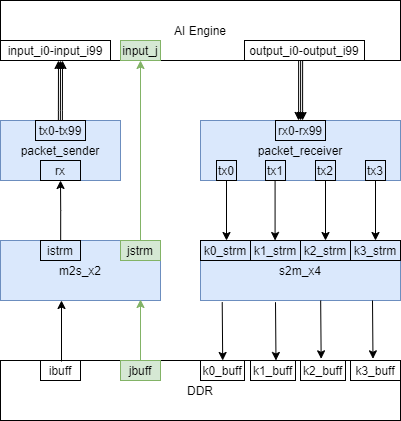

<table class="sphinxhide" width="100%">
 <tr width="100%">
    <td align="center"><h1>AMD Versal™ Adaptive SoC AI Engine Tutorials</h1>
    <a href="https://www.xilinx.com/products/design-tools/vitis.html">See AMD Vitis™ Development Environment on xilinx.com</br></a>
    <a href="https://www.xilinx.com/products/design-tools/vitis/vitis-ai.html">See AMD Vitis™ AI Development Environment on xilinx.com</a>
    </td>
 </tr>
</table>

# Building the Design

*Estimated time: 11 minutes*

```
make all
```
or, follow steps 1-3 as follows:

### Step 1: Set the Vitis Utility Library path
```
XFLIB_DIR_REL_PATH :=$(DSPLIB_VITIS)/utils
XFLIB_DIR := $(shell readlink -f $(XFLIB_DIR_REL_PATH))

```
This path will have the folder `utils` in it along with other libraries. You will be using its L2 Data-Mover generator tool.

### Step 2: Generate m2s_x2.cpp and s2m_x4.cpp Datamover kernels

```
make -f ./ksrc.mk GENKERNEL=$(XFLIB_DIR)/L2/scripts/generate_kernels SPEC=./kernel/spec.json TOOLDIR=./_krnlgen
```
Here you use the L2 Data-Mover generator tool ($(XFLIB_DIR)/L2/scripts/generate_kernels). This tool uses the `kernel/spec.json` specification to write `kernel/m2s_x2.cpp` and `kernel/s2m_x4.cpp` HLS kernel source files.


### Step 3: Compile HLS PL Kernels
Following is an example of how the `m2s_x2` kernel is compiled.
```
v++ -c                                                                 \
    -t hw                                                              \
    --platform xilinx_vck190_base_202310_1                             \
    --save-temps --optimize 2                                          \
    --hls.jobs 8 -I$(XFLIB_DIR)/L1/include                            \
    -I$(XFLIB_DIR)/L1/include/hw                                      \
    -I./kernel                                                         \
    -k m2s_x2                                                          \
    --hls.clock 150000000:m2s_x2                                       \
    --temp_dir ./build/_x_temp.hw.xilinx_vck190_base_202310_1          \
    --report_dir ./build/reports/_x.hw_emu.xilinx_vck190_base_202310_1 \
    -o './build/_x_temp.hw_emu.xilinx_vck190_base_202310_1/m2s_x2.xo'  \
    ./kernel/m2s_x2.cpp                                                 
```
The same compilation options are used to compile the `s2m_x4`, `packet_sender`, and `packet_receiver` kernels.

## HLS PL Kernels

After coming up with 400 tile AI Engine design, the next step is the come up with the way to move data from DDR send it to the AI Engine. We do this by using the the AMD Vitis™ core development kit, to create kernel code in C++ meant to be accelerated on the FPGA. The kernel code is compiled by the Vitis Compiler (`v++ -c`) into kernel objects (XO). The following is a table describing each HLS PL kernel.

|Kernel Name| Description| Fmax|
|---|---| ---|
|`m2s_x2`|Dual-channel data-mover that moves data from DDR to AXI4-Stream.|411 MHz|
|`packet_sender`|Packet switching kernel that packetizes AXI4-Stream data by generating a header packet and appropriately asserting `TLAST`|580 MHz|
|`packet_receiver`|Packet switching kernel that evaluates packet headers from incoming streams and reroutes data to one of 4 AXI4-Streams|499.5 MHz|
|`s2m_x4`|Quad-channel data-mover that moves data from AXI4-Stream to DDR.|411 MHz|

Using Vivado timing closure techniques, you can increase the FMax if needed. To showcase the example, integrate using the 300 MHz clock. There is also a 400 MHz timing-closed design in the [beamforming tutorial](https://github.com/Xilinx/Vitis-Tutorials/tree/master/AI_Engine_Development/Design_Tutorials/03-beamforming).



### m2s_x2

The `m2s_x2` is generated from the `kernel/spec.json` specification. Review this file. Notice the `m2s_x2` kernel implementation is set to `LoadDdrToStream`, meaning this kernel is used to move data from DDR (AXI-MM) to AXI-Stream. It is specified to have two channels. The first channel moves data from a DDR `buffer` called `ibuff` to an AXI-stream called `istrm`. This channel moves the `i` data out of DDR to AXI-Stream. The second channel moves `j` data from DDR buffer `jbuff` to an AXI-Stream `jstrm` and streams the data directly into the AI Engine's `input_j` port.  

### packet_sender

After `m2s_x2` kernel loads `i` data onto an AXI-Stream, the `istrm` is the input to the `packet_sender` kernel. The `packet_sender` kernel takes raw `i` data and packetizes it for the AI Engine. Review the `kernel/packet_sender.cpp` definition. The `packet_sender` does the following:

* generates a header AXI-Stream packet
* reads the `rx` stream
* writes 224 AXI-Stream data packets to one of the 100 `tx` streams
* asserts `TLAST` appropriately on the last data packet

It repeats these actions so all 100 `tx` streams have a packet header and 224 data packets written to it. This is 1 iteration of data the AI Engine is expecting. The 100 `tx` streams are connected to the 100 `input_i` ports on the AI Engine.

### packet_receiver

After the AI Engine's 100 N-Body Subsystems crunch the N-Body equations on the `input_i` and `input_j` data, it outputs four data packets on each of the 100 `output_i` ports. Each output data packet can have a header of 0, 1, 2, or 3, indicating that it is coming from `nbody_kernel[0]`,  `nbody_kernel[1]`, `nbody_kernel[2]`, or `nbody_kernel[3]` in each of the nbody_subsystems. The 100 `output_i` ports are connected to the 100 `rx` streams on the `packet_receiver` kernel. The `packet_receiver` kernel receives four packets from each of the 100 `rx` streams, and depending on the packet header, writes the data to `tx0`, `tx1`, `tx2`, or `tx3` streams.

### s2m_x4

The `s2m_x4` kernel is generated from the `kernel/spec.json` specification. Review this file again. Notice that the `s2m_x4` kernel has an implementation `StoreStreamToMaster` which moves data from AXI-Streams to DDR. The `s2m_x4` kernel has 4 channels: `k0`,`k1`,`k2`, and `k3`. Each stream writes the data coming from the `tx0`-`tx3` streams to a DDR buffer.  

## References

* [Vitis Libraries Github Repo](https://github.com/Xilinx/Vitis_Libraries)

* [Vitis Utilities Library Documentation](https://docs.xilinx.com/r/en-US/Vitis_Libraries/utils/index.html)

* [Generating PL Data-Mover Kernels](https://docs.xilinx.com/r/en-US/Vitis_Libraries/utils/datamover/kernel_gen_guide.html)

* [Vitis Compiler Command](https://docs.xilinx.com/r/en-US/ug1393-vitis-application-acceleration/v-Command)

## Next Steps

After compiling the PL datamover kernels, you are ready to link the entire hardware design together in the next module, [Module 04 - Full System Design](../Module_04_full_system_design).

### Support

GitHub issues will be used for tracking requests and bugs. For questions go to [support.xilinx.com](http://support.xilinx.com/).


<p class="sphinxhide" align="center"><sub>Copyright © 2020–2023 Advanced Micro Devices, Inc</sub></p>

<p class="sphinxhide" align="center"><sup><a href="https://www.amd.com/en/corporate/copyright">Terms and Conditions</a></sup></p>
