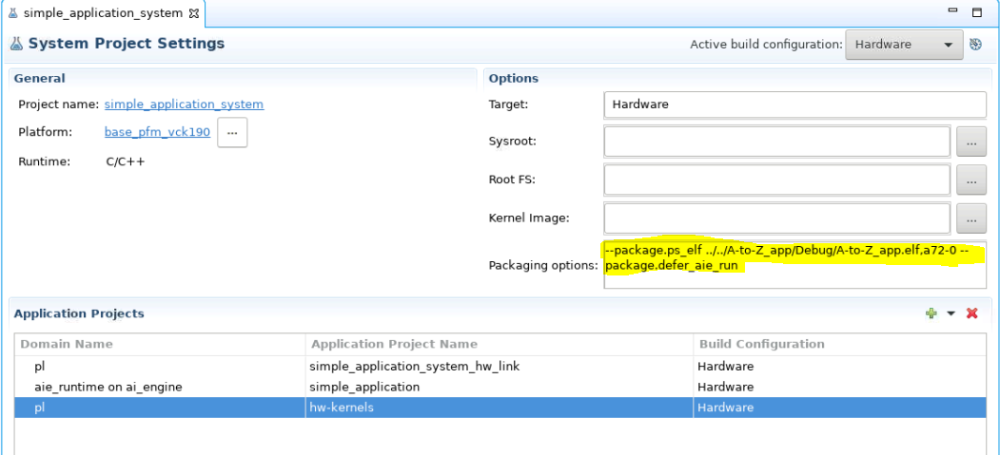
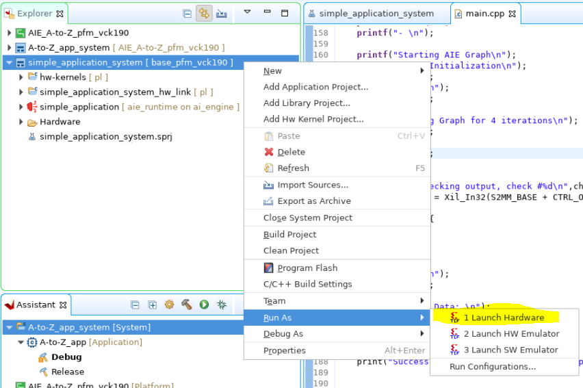
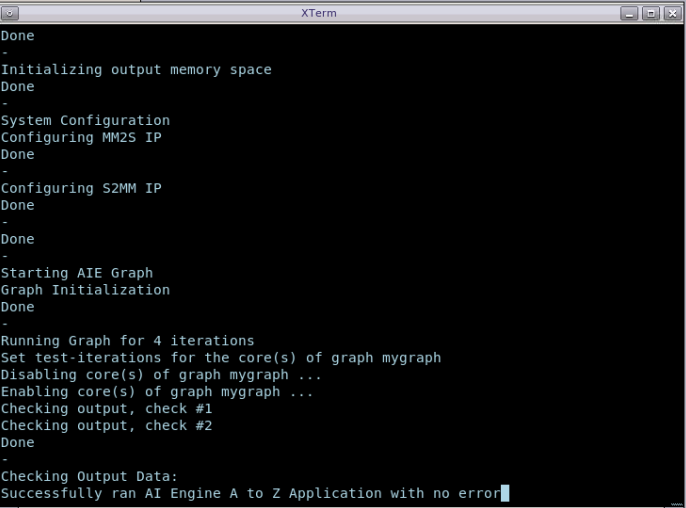

<table class="sphinxhide" width="100%">
 <tr width="100%">
    <td align="center"><h1>AI Engine Development</h1>
    <a href="https://www.xilinx.com/products/design-tools/vitis.html">See Vitis™ Development Environment on xilinx.com</br></a>
    <a href="https://www.xilinx.com/products/design-tools/vitis/vitis-ai.html">See Vitis-AI™ Development Environment on xilinx.com</a>
    </td>
 </tr>
</table>

# Introduction

In this section of the tutorial, you will learn how to build a PS bare-metal application using the XSA created in the previous step and then build, as well as run the complete system.

### Step 1. Create a New Platform in the Bare-metal Domain

1. Open the Vitis software platform 2021.1 in the same workspace directory as the previous step. Click ***File → New →  Platform Project***.

2. Set the Platform Project Name to ***AIE_A-to-Z_pfm_vck190*** and click ***Next***.

3. Use the XSA generated in the previous step that you can find in `workspace/simple_application_system_hw_link/Hardware/binary_container_1.xsa`, set ***standalone*** as ***Operating system*** and ***CIPS_0_pspmc_0_psv_cortexa72_0*** as ***Processor***, and click ***Finish***.

4. Build the platform.

### Step 2. Build the Baremetal AI Engine Control Application

1. Create a new application by clicking on ***New → Application Project***.

2. Select ***AIE_A-to-Z_pfm_vck190*** as the platform.

3. Set the name for the application (example `A-to-Z_app`), select the A72_0 processor domain (`CIPS_0_pspmc_0_psv_cortexa72_0`), and click ***Next***.

4. On the next page, select ***standalone*** for the ***domain***.

5. Finally, select the ***Empty Application (C++)*** template and click ***Finish***.

6. Right-click on the ```src``` folder under the ***A-to-Z_app*** project and click ***Import Sources***.

7. Import the `aie_control.cpp` file from the AI Engine application project (`simple_application/Hardware/Work/ps/c_rts/aie_control.cpp`).

8. Import the following source files from the `src` folder
* `main.cpp`
* `platform.cpp`
* `platform.h`
* `platform_config.h`

    

Go through the `main.cpp` file. You can see that the code is initializing the input data and the memory space for the output data. One thing to note is the use of the `.init()` and `.run()` APIs to control the AI Engine.

```
printf("Starting AIE Graph\n");
printf("Graph Initialization\n");
mygraph.init();
printf("Done \n");
printf("- \n");

printf("Running Graph for 4 iterations\n");
mygraph.run(4);
```

There are two options to enable an AI Engine graph from a system:
* Enable the graph in the PDI. This means that the graph will be started during BOOT and will run forever.
* Enable the AI Engine graph from the PS program using `<graph>.init()` and `<graph>.run()` APIs. This is what we are using in this case.

9. Right-click on A72 PS application (`A-to-Z_app)` and select ***C/C++ Build Settings***.

  
  
10.Modify the Linker Script

  a.In the Project Explorer, expand the A-to-z_app.
  
  b.In the src directory, double-click lscript.ld to open the linker script for this project.
  
  c.In the linker script modify the heap size to 1M.
  
   
  
11. In the directories section under ARM v8 g++ compiler, add the directory for the AI Engine application:

  a. `${env_var:XILINX_VITIS}/aietools/include`

  b. The sources folder for the AI Engine application (`${workspace_loc:/simple_application/src}`)

  

12. Build the A72 PS application (`A-to-Z_app`) .     

### Step 3. Build the Full System

1. Click ***simple_application_system.sprj***. Add the following options in the ***Packaging options*** box:

```
--package.ps_elf ../../A-to-Z_app/Debug/A-to-Z_app.elf,a72-0 --package.defer_aie_run
```

  

>**Note**: The option  `--package.defer_aie_run` is required when running the AI Engine graph from the PS (see the [Versal ACAP AI Engine Programming Environment User Guide (UG1076)](https://www.xilinx.com/cgi-bin/docs/rdoc?t=vitis+doc;v=2020.2;d=yii1603912637443.html)).

2. Build the ***simple_application_system*** project.


### Step 4. Run the System

1. Make sure your VCK190 board is connected to your PC.

2. Right-click on the ***simple_application_system*** and click ***Run As → Launch Hardware***.

      

3. You should see the application running successfully with no error.

      


## Summary

In this tutorial, you have performed an end-to-end flow to create a platform based on the VCK190 board, added an AI Engine kernel and PL kernels into the system, and built a PS bare-metal application to run on it.


<p align="center"><b><a href="./03-pl_application_creation.md">Return to Step 3</a> — <a href="./README.md">Go back to main page</a> — <a href="./05-RPU version[optional].md">Check out the RPU version design (optional)</a></b></p>


Licensed under the Apache License, Version 2.0 (the "License");
you may not use this file except in compliance with the License.
You may obtain a copy of the License at

    http://www.apache.org/licenses/LICENSE-2.0

Unless required by applicable law or agreed to in writing, software
distributed under the License is distributed on an "AS IS" BASIS,
WITHOUT WARRANTIES OR CONDITIONS OF ANY KIND, either express or implied.
See the License for the specific language governing permissions and
limitations under the License.

<p class="sphinxhide" align="center"><sup>Copyright&copy; 2020–2021 Xilinx</sup><br><sup>XD018</sup></br></p>
