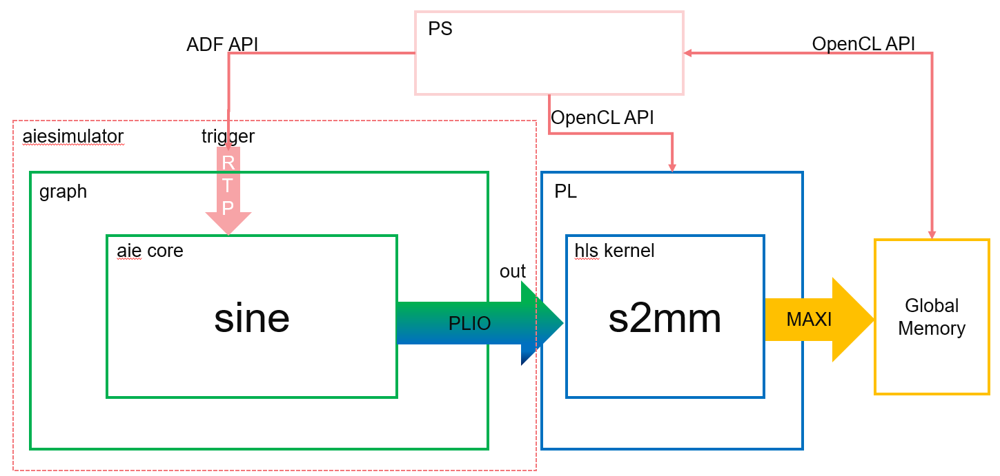

<table class="sphinxhide" width="100%">
 <tr width="100%">
    <td align="center"><h1>AI Engine Development</h1>
    <a href="https://www.xilinx.com/products/design-tools/vitis.html">See Vitis™ Development Environment on xilinx.com</br></a>
    <a href="https://www.xilinx.com/products/design-tools/vitis/vitis-ai.html">See Vitis™ AI Development Environment on xilinx.com</a>
    </td>
 </tr>
</table>

# Synchronous Update of Scalar RTP

Kernel execution depends on the availability of windows of data on their inputs, and the space to write windows of data on their outputs. This example illustrates a complementary method, whereby a kernel will only get triggered to run after a write of data from another processor. This can be an ARM® processor or another AI Engine.

In this example, a write from an Arm processor causes a partial sine wave to be generated using the direct digital synthesis (DDS) kernel on the AI Engine. The Arm processor can control the frequency of the sine wave by writing different values to the `runtime` parameter. In the HW and HW cosim flow, the AI Engine output is streamed to the PL kernels, and the PS controls the running AI Engine and PL. The following figure shows this example. 



__Note:__ The default working directory in this step is "step1", unless specified explicitly otherwise.

### Review Graph Programming Code

1. Examine the header file `aie/dds.h`, of the sine kernel (DDS):

		```
		void sine(const int32 phase_increment,output_window<cint16> * owin);
		```
  
 	Now examine `aie/kernels/dds.cc`, and notice how `phase_increment` is used in the sine function:
		
		```
		phase_in += (phase_increment << 6);
		auto [sin_,cos_] = aie::sincos(phase_in << 14) ; // phase_in + (7i + j + 1) * phase_increment
		cint16 scvalues={cos_,sin_};
		```

  
2. Examine `aie/graph.h` and `aie/graph.cpp`. These are provided as a starting point to specify the data flow graph of this example.

   In `graph.h`, the kernel object `dds`, the graph input port `trigger`, and the graph output port `out` are declared in the `ddsgraph class`. The DDS kernel object is bound to the `sine` function declared in the included `dds.h` header. The DDS kernel output is connected to the graph output. It tells the compiler that the source for the function is in `kernels/dds.cc`. The kernel output is connected to `out.in[0]`, which will be directed to `data/output.txt`.

		```
		out = adf::output_plio::create("Dataout", adf::plio_32_bits, "data/output.txt");
		adf::connect< adf::window<512> >(dds.out[0], out.in[0]);
		```

   In `graph.cpp`, an instance of the `ddsgraph`, `gr`, is instantiated. 

   In the `main()` function, graph `init()`, `run()`, and `end()` are called to initialize, run, and wait to be ended.

		```
		gr.init();
		gr.run(4);
		…
		gr.end();
		```

   The graph `run()` has been called with the parameter `4` to specify the iteration number of the graph. Otherwise, it will run forever.

## Review RTP Update Code

1. Examine `aie/graph.h` again. The following line is to connect the trigger input port of the graph to the first input port of the dds kernel (i.e., the `phase_increment` parameter of the `sine` function).

		```
		adf::connect<adf::parameter>(trigger, dds.in[0]);
		```

   The syntax of this connection is:

 	   ```
		adf::connect<adf::parameter>(input_port&, output_port&);
		```
  
   __Note:__ You need to use the template class argument `adf::parameter` to specialize the connection type to the parameter type (because you are now connecting parameters and not windows of data). The parameter does not need to be sized in the same way as a window, because the compiler can always determine its size.

2. Examine `aie/graph.cpp`. You can see the lines of code to update the RTP. Note that the number of updates matches the number of iterations specified in `gr.run(4)`.

       ```
	   gr.update(gr.trigger,10);
	  
       gr.update(gr.trigger,10);
	  
       gr.update(gr.trigger,100);
	  
       gr.update(gr.trigger,100);
	   ```
  
   The graph update calls update:

     * The trigger input with a value of 10 in the ping buffer
  
     * The trigger input with a value of 10  in the pong buffer
  
     * The trigger input with a value of 100 in the ping buffer
  
     * The trigger input with a value of 100 in the pong buffer
    
   The syntax of the graph update function is:

       ```
	   void adf::graph::update(input_port &portName, int value);
	   ```

   Because the `runtime` parameter in this example is synchronous, the graph execution on the AI Engine will start after the first update call for one iteration, then wait for the next trigger by the next update call. Four consecutive update calls will run the graph for four iterations, where the first two iterations use 10 as the value for the `phase_increment` parameter and the last two iterations use 100.

## Run AI Engine Compiler and AI Engine Simulator 

1. Run the AI Engine compiler and the AI Engine simulator to verify the functional correctness of the design. Note that `graph.cpp` is only used for the AI Engine simulator, which is a SystemC simulation. 

   The `make` command to run the AI Engine compiler to generate the AI Engine design graph (`libadf.a`) is:
	
        ```
		make aie
		```
	
   The corresponding command for aiecompiler is:

       ```
	   aiecompiler -platform=$PLATFORM_REPO_PATHS/xilinx_vck190_es1_base_202210_1/xilinx_vck190_es1_base_202210_1.xpfm -include="./aie" -include="./data" -include="./aie/kernels" -include="./" -workdir=./Work aie/graph.cpp
	   ```
  
   Switches for the AI Engine are as follows:

   * `-platform`: specifies the path to the target platform

   * `-include`: specifies the path to find header and source files

   * `-workdir`: specifies the output directory. By default, the compiler generates all its output into a subdirectory called `Work`.

   * `aie/graph.cpp`: specifies the graph source file

   For more information about AI Engine programming and tools, refer to the *Versal ACAP AI Engine Programming Environment User Guide* (UG1076).

2. After the graph has been compiled, run `aiesimulator` using the following make command:

	   ```
	   make aiesim
	   ```
  
   The corresponding AI Engine simulator command is:

 	   ```
		aiesimulator --pkg-dir=./Work
		```
  
   After simulation completes, you should see the `output.txt` file in `aiesimulator_output/data`. The output file contains output data and timestamps. You can compare the generated `output.txt` file with the golden reference file (`data/golden.txt`) using the following commands in command line:
  
 	   ```
		grep -v T aiesimulator_output/data/output.txt > aiesimulator_output/data/output_data.txt
 	   diff -w aiesimulator_output/data/output_data.txt ./data/golden.txt
		```
  
   The timestamps in `output.txt` are removed in the new output file `output_data.txt`. The new output file should match the data in `golden.txt`. If the files match it is normal to see no output from the diff command.

   If you are using MATLAB or Octave, you can use the following script to visualize the data:

       ```
	   data=load('./aiesimulator_output/data/output_data.txt', '-ascii');
       plot(data(:,1))
	   ```
  
   This plots the first column (real part) of the output complex data.


   In `aie/kernels/dds.cc`, the sine kernel function uses the sincos intrinsic with the phase parameter to generate 32-bit integer concatenating Sine (bits [31:16]) and Cosine (bits [15:0]) in signed Q.15 fixed-point format. The 32-bit integer output samples are cast and stored in a `cint16` window. As a result, the first column (real part) represents a cosine waveform. In the four iterations, the first two iterations use a value of 10 as the `phase_increment` parameter and the last two iterations use 100, so you see the cosine waveform frequency increases in the middle of the plot.
 
3. Use the following line to plot the second column (imaginary part) of the output complex data.

       ```
	   plot(data(:,2))
	   ```

   The following plot shows the sine waveform generated by the `sine` kernel function with the frequency changed in the middle of the simulation iterations.


### Build for Hardware Emulation and Hardware Flow
In the previous step, you generated the AI Engine design graph (`libadf.a`) using the AI Engine compiler. Note that the graph has instantiated a PLIO (`adf::output_plio` in `aie/graph.h`), which will be connected to the PL side. 

 	```
	 out = adf::output_plio::create("Dataout", adf::plio_32_bits, "data/output.txt");
	 ```

Here, `plio_32_bits` indicates the interface to the PL side is 32 bits wide. In the PL side, an HLS kernel `s2mm` will be instantiated. It will receive stream data from the AI Engine graph, and output data to global memory, which will be read by the host code in the PS.

__Note__: In this section, the make commands apply to `hw_emu` mode by default. Taking the `hw_emu` mode as an example, to target `hw` mode, add `TARGET=hw` to the make commands. For detailed commands, change the `-t hw_emu` option to `-t hw`.

To compile the HLS PL kernel, run the following make command:

	```
	make kernels
	```

The corresponding v++ compiler command is as follows:

	```
	v++ -c --platform xilinx_vck190_es1_base_202210_1 -k s2mm s2mm.cpp -o s2mm.xo --verbose --save-temps
	```

Switches for the v++ compiler are as follows:

* `-c`: compiles the kernel source into Xilinx object (`.xo`) files.

* `--platform`: specifies the name of a supported platform as specified by the *`PLATFORM_REPO_PATHS`* environment variable, or the full path to the platform `.xpfm` file.

* `-k`: specifies the kernel name.

The next step is to link the AI Engine graph and PL kernels to generate the hardware platform. The make command for this is as follows:

	make xclbin
	
This make takes 10 minutes or more to complete. The corresponding v++ linker command is as follows:

	```
	v++ -g -l --platform xilinx_vck190_es1_base_202210_1 pl_kernels/s2mm.xo libadf.a -t hw_emu --save-temps --verbose --config system.cfg -o vck190_aie_base_graph_hw_emu.xclbin
	```

Switches for the v++ linker are as follows:

* `-l`: links the PL kernels, AI Engine graph and platform into an FPGA binary file (`xclbin`).

* `-t`: specifies the link target, `hw` for hardware run, `hw_emu` for HW emulation.

* `--config`: specifies the configuration file. The configuration file (`system.cfg`), specifies stream connections between the Graph and PL kernels, and other optional selections.

After generating the hardware platform, compile the host code (`sw/host.cpp`) using the following make command:

	```
	make host
	```
	
The detailed commands for compiling the host code are as follows:

	```
	${CXX} -std=c++14 -I$XILINX_HLS/include/ -I$PLATFORM_REPO_PATHS/sw/versal/xilinx-versal-common-v2022.1/sysroots/aarch64-xilinx-linux//usr/include/xrt/ -O0 -g -Wall -c -fmessage-length=0 --sysroot=$PLATFORM_REPO_PATHS/sw/versal/xilinx-versal-common-v2022.1/sysroots/aarch64-xilinx-linux/ -I$XILINX_VITIS/aietools/include -I../ -I../aie -o aie_control_xrt.o aie_control_xrt.cpp
	${CXX} -std=c++14 -I$XILINX_HLS/include/ -I$PLATFORM_REPO_PATHS/sw/versal/xilinx-versal-common-v2022.1/sysroots/aarch64-xilinx-linux//usr/include/xrt/ -O0 -g -Wall -c -fmessage-length=0 --sysroot=$PLATFORM_REPO_PATHS/sw/versal/xilinx-versal-common-v2022.1/sysroots/aarch64-xilinx-linux/ -I$XILINX_VITIS/aietools/include -I../ -I../aie -o host.o host.cpp
	${CXX} -o ../host.exe aie_control_xrt.o host.o -ladf_api_xrt -lgcc -lc -lxrt_coreutil -lxilinxopencl -lpthread -lrt -ldl -lcrypt -lstdc++ -L$PLATFORM_REPO_PATHS/sw/versal/xilinx-versal-common-v2022.1/sysroots/aarch64-xilinx-linux//usr/lib/ --sysroot=$PLATFORM_REPO_PATHS/sw/versal/xilinx-versal-common-v2022.1/sysroots/aarch64-xilinx-linux/ -L$XILINX_VITIS/aietools/lib/aarch64.o
	```
	
Here, the cross compiler pointed by `CXX` is used to compile the linux host code. `aie_control_xrt.cpp` is copied from the directory `Work/ps/c_rts`.

The host code for HW emulation and HW (`sw/host.cpp`) includes OpenCL APIs to control the executions of PL kernels, and adf APIs `(*init(),update(),run(),wait()*)`. The execution model of the PL kernel is composed of the following steps:

1. Get the OpenCL platform and device:

   a. Prepare OpenCL context and command queue.

   b. Program `xclbin`.

   c. Get kernel objects from the program.

2. Prepare the device buffers for kernels. Transfer data from the host memory to the global memory in the device.
3. The host program sets up the kernel with its input parameters and triggers the execution of the kernel on the FPGA.
4. Wait for kernel completion.
5. Transfer data from the device global memory to host memory.
6. Host code performs post-processing on the host memory.

Following is a code snippet from `sw/host.cpp` to illustrate these concepts:

	```
	#include "adf/adf_api/XRTConfig.h"
	#include "experimental/xrt_kernel.h"
	...
	//1. Get OpenCL platform and device, prepare OpenCL context and command queue. Program xclbin, and get kernel objects from the program. adf::registerXRT() is needed for ADF API.
	cl::Device device;
	std::vector<cl::Platform> platforms;
	cl::Platform::get(&platforms);
	...
	cl::Context context(device);
	cl::CommandQueue q(context, device, CL_QUEUE_PROFILING_ENABLE | CL_QUEUE_OUT_OF_ORDER_EXEC_MODE_ENABLE);
	...
	cl::Program::Binaries bins;
	cl::Program program(context, devices, bins);
	cl::Kernel krnl_s2mm(program,"s2mm"); //get kernel object
	...
	// Create XRT device handle for ADF API
	void *dh;
	device.getInfo(CL_DEVICE_HANDLE, &dh);
	auto dhdl = xrtDeviceOpenFromXcl(dh);
	auto top = reinterpret_cast<const axlf*>(buf);
	adf::registerXRT(dhdl, uuid);
    
	//2. Prepare device buffers for kernels. Transfer data from host memory to global memory in device. 
	std::complex<short> *host_out; //host buffer
	cl::Buffer buffer_out(context, CL_MEM_WRITE_ONLY, output_size_in_bytes);
	host_out=(std::complex<short>*)q.enqueueMapBuffer(buffer_out,true,CL_MAP_READ,0,sizeof(int)*OUTPUT_SIZE,nullptr,nullptr,nullptr);
 
 	//3. The host program sets up the kernel with its input parameters
	krnl_s2mm.setArg(0,buffer_out);
	krnl_s2mm.setArg(2,OUTPUT_SIZE);

	//Launch the Kernel
	q.enqueueTask(krnl_s2mm);

	// ADF API: Initialize, run and update graph parameters (RTP)
	gr.run(4);
	gr.update(gr.trigger,10);
	gr.update(gr.trigger,10);
	gr.update(gr.trigger,100);
	gr.update(gr.trigger,100);
	gr.wait();
	
	//4. Wait for kernel completion. 
	q.finish();//Wait for s2mm to complete    
	
	//5. Transfer data from global memory in device to host memory.
	q.enqueueMigrateMemObjects({buffer_out},CL_MIGRATE_MEM_OBJECT_HOST);	
	q.finish();//Wait for memory transfer to complete

	//6. post-processing on host memory - "host_out"
	```

Head files `adf/adf_api/XRTConfig.h` and `experimental/xrt_kernel.h` are needed by the `adf` API and XRT API. 

__Note__: In this example, graph execution needs to start before `finish()` for the command queue. If `finish()` is invoked first, which is a blocking call, the graph will never start and provide output to s2mm, and hence the application will hang on the blocked point.

The next step is to use v++ with `-p` to generate the package file. The make command is:

	make package
	
The corresponding v++ command is:

	```
	v++ -p -t hw_emu -f $PLATFORM_REPO_PATHS/xilinx_vck190_es1_base_202210_1/xilinx_vck190_es1_base_202210_1.xpfm \
	--package.rootfs $PLATFORM_REPO_PATHS/sw/versal/xilinx-versal-common-v2022.1/rootfs.ext4  \
	--package.kernel_image $PLATFORM_REPO_PATHS/sw/versal/xilinx-versal-common-v2022.1/Image  \
	--package.boot_mode=sd \
	--package.image_format=ext4 \
	--package.defer_aie_run \
	--package.sd_dir data \
	--package.sd_file host.exe vck190_aie_base_graph_hw_emu.xclbin libadf.a
	```

Here `--package.defer_aie_run` specifies that the Versal AI Engine cores will be enabled by the PS. When not specified, the tool will generate CDO commands to enable the AI Engine cores during PDI load instead. 

`--package.sd_dir <arg>` specifies a directory path to package into the *`sd_card* directory/image`, which is helpful for including some golden data into the package.

"`--package.sd_file <arg>`" is used to specify files to package into the *`sd_card* directory/image`.

For more details about `v++ -p (--package)` options, refer to *Application Acceleration Development* (UG1393).

## Deploy for Hardware Emulation and Hardware Flow

The final step is to run HW emulation using the following make command:

	```
	make run_hw_emu
	```

The corresponding script is as follows:

	```
	./launch_hw_emu.sh
	```

__Hint:__ Option `-add-env VITIS_LAUNCH_WAVEFORM_BATCH=1` can be added to `launch_hw_emu.sh` to record the waveform of the platform into waveform file (`*.wdb`).

__Hint:__ Hitting a key accidentally will prevent the system booting automatically. If this happens, type `boot` in the `Versal>` prompt to resume the system booting.

After Linux has booted, run following commands in Linux prompt (this is only for HW cosim):

	```
	mount /dev/mmcblk0p1 /mnt
	cd /mnt
	export XILINX_XRT=/usr
	export XCL_EMULATION_MODE=hw_emu
	./host.exe a.xclbin
	```

To exit QEMU press Ctrl+A, x

Alternatively, to run in hardware, after booting Linux, run following commands in the Linux prompt:
	
	```
	mount /dev/mmcblk0p1 /mnt
	cd /mnt
	export XILINX_XRT=/usr
	./host.exe a.xclbin
	```

The host code is self-checking. It will check the output data against the golden data. If the output data matches the golden data, after the run is completed, it will print:

	```
	TEST PASSED
	```

## Conclusion

In this step, you learned about the following core concepts:

  * Synchronous update of scalar RTP
  * Flows to perform AI Engine simulation
  * HW emulation and HW run

Next, review [Asynchronous Update of Scalar RTP](./step2_async_scalar.md).

# Support

GitHub issues will be used for tracking requests and bugs. For questions go to [forums.xilinx.com](http://forums.xilinx.com/).

# License

Licensed under the Apache License, Version 2.0 (the "License"); you may not use this file except in compliance with the License.

You may obtain a copy of the License at [http://www.apache.org/licenses/LICENSE-2.0]( http://www.apache.org/licenses/LICENSE-2.0 )


Unless required by applicable law or agreed to in writing, software distributed under the License is distributed on an "AS IS" BASIS, WITHOUT WARRANTIES OR CONDITIONS OF ANY KIND, either express or implied. See the License for the specific language governing permissions and limitations under the License.

<p align="center"><sup>XD001 | &copy; Copyright 2020-2022 Xilinx, Inc.</sup></p>

==========
