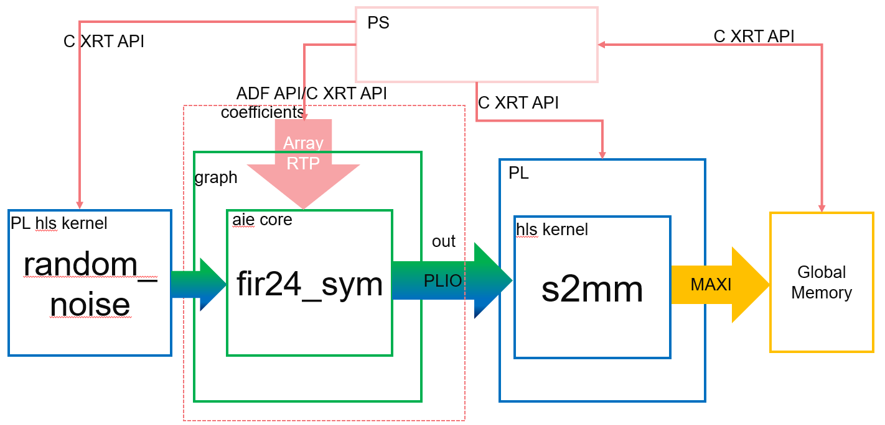

<table class="sphinxhide" width="100%">
 <tr width="100%">
    <td align="center"><h1>AI Engine Development</h1>
    <a href="https://www.xilinx.com/products/design-tools/vitis.html">See Vitis™ Development Environment on xilinx.com</br></a>
    <a href="https://www.xilinx.com/products/design-tools/vitis/vitis-ai.html">See Vitis™ AI Development Environment on xilinx.com</a>
    </td>
 </tr>
</table>

# Asynchronous Update of Array RTP Update for AI Engine Kernel

This section demonstrates the following:

* Array RTP update for AI Engine kernels
* C Xilinx® Runtime (XRT) API to control graph and PL kernels executions

The example is similar to the [Asynchronous Update of Array RTP](./step3_async_array.md), except that the random noise generator is not free-running in this example. The system to be implemented is as follows.



>**Note:** The default working directory for this step is "step4", unless explicitly specified otherwise.

## Review Graph and RTP Code

In the graph definition (`aie/graph.h`), the RTP declaration and connection are added as follows:

```cpp
port<direction::in> coefficients;
connect< parameter >(size, async(fir24.in[1]));
```

In `aie/graph.cpp` (for AI Engine simulator):

```cpp
gr.init();
//run for 16 iterations, update narrow filter coefficients, wait, update wide filter coefficients, run for 16 iterations
gr.update(gr.coefficients, narrow_filter, 12);
gr.run(16); // 16 iterations for AIE kernel
gr.wait();
gr.update(gr.coefficients, wide_filter, 12);
gr.run(16);
gr.end();
```

## Run AI Engine Compiler and AI Engine Simulator

1. Compile the AI Engine graph (`libadf.a`) using the AI Engine compiler:

   ```
   make aie
   ```

   The corresponding AI Engine compiler command is:

   ```
   aiecompiler -platform=xilinx_vck190_base_202310_1.xpfm -include="./aie" -include="./data" -include="./aie/kernels" -include="./" -workdir=./Work aie/graph.cpp
   ```

2. After the AI Engine graph (`libadf.a`) has been generated, verify for correctness using the AI Engine simulator:

   ```
   make aiesim
   ```

## Run Hardware Cosimulation and Hardware Flow

For the PL kernel (`random_noise`) , an additional parameter `size` has been added, which is different from the free-running kernel in [previous step](./step3_async_array.md). A loop is also added in the kernel to iterate `size` times. The code in `pl_kernels/random_noise.cpp` is as follows:

```cpp
extern "C" void random_noise(hls::stream<std::complex<short> > & out, int size) {
    #pragma HLS INTERFACE axis port=out
    #pragma HLS INTERFACE s_axilite port=return bundle=control
    #pragma HLS INTERFACE ap_ctrl_hs port=return
    #pragma HLS interface s_axilite port=size bundle=control
            for(int i=0;i<size;i++){
                    ...
            }
    }
```

Pragma `#pragma HLS INTERFACE s_axilite port=return bundle=control` indicates that the kernel has an AXI4-Lite interface for block control. Other scalar inputs and global memory addresses are also bundled into this AXI4-Lite interface. Here, the scalar input `size` is bundled into the AXI4-Lite interface by `#pragma HLS interface s_axilite port=size bundle=control` for Vitis HLS. Pragma `#pragma HLS INTERFACE ap_ctrl_hs port=return` indicates the control protocol for the kernel is `ap_ctrl_hs`, meaning that the kernel has to be explicitly started and polled for completion. This is normally done by the OpenCL API or the XRT API.

For information about the pragmas and protocols for AMD Vitis™ HLS, refer to the *Vitis High-level Synthesis User Guide* [(UG1399)](https://docs.xilinx.com/access/sources/dita/map?isLatest=true&ft:locale=en-US&url=ug1399-vitis-hls).

The Makefile rule targets introduced in [Synchronous update of Scalar RTP](./step1_sync_scalar.md), [Asynchronous Update of Scalar RTP](./step2_async_scalar.md), and [Asynchronous Update of Array RTP](./step3_async_array.md) still apply here. Details about tool options and host code in [Synchronous Update of Scalar RTP](./step1_sync_scalar.md) are similar.

In Linux mode, the following header files are required for the XRT APIs:

```cpp
#include "xrt/xrt_kernel.h"
#include "xrt/xrt_graph.h"
```

Notice that the XRT API was used to manage the PL kernels (`s2mm` and `random_noise`). The code in `sw/host.cpp` is as follows:

```cpp
// Open xclbin
auto device = xrt::device(0); //device index=0
auto uuid = device.load_xclbin(xclbinFilename);

// s2mm & random_noise kernel handle
auto s2mm = xrt::kernel(device, uuid, "s2mm");
auto random_noise = xrt::kernel(device, uuid, "random_noise");

// output memory
auto out_bo = xrt::bo(device, output_size_in_bytes,s2mm.group_id(0));
auto host_out=out_bo.map<std::complex<short>*>();

//kernel run
auto s2mm_run = s2mm(out_bo, nullptr, OUTPUT_SIZE);//1st run for s2mm has started
auto random_noise_run = random_noise(nullptr, OUTPUT_SIZE);
......

// wait for s2mm done
auto state = s2mm_run.wait();
std::cout << "s2mm completed with status(" << state << ")\n";

out_bo.sync(XCL_BO_SYNC_BO_FROM_DEVICE);
```

The XRT API version to control graph execution is as follows:

```cpp
int narrow_filter[12] = {180, 89, -80, -391, -720, -834, -478, 505, 2063, 3896, 5535, 6504};
int wide_filter[12] = {-21, -249, 319, -78, -511, 977, -610, -844, 2574, -2754, -1066, 18539};
auto ghdl=xrt::graph(device,uuid,"gr");
ghdl.update("gr.fir24.in[1]",narrow_filter);
ghdl.run(16);
ghdl.wait();
std::cout<<"Graph wait done"<<std::endl;

//second run
ghdl.update("gr.fir24.in[1]",wide_filter);
ghdl.run(16);
......
ghdl.end();
```

For more information about XRT APIs on graphs, see the *Versal Adaptive SoC AI Engine Programming Environment User Guide* [(UG1076)](https://docs.xilinx.com/access/sources/dita/map?isLatest=true&ft:locale=en-US&url=ug1076-ai-engine-environment).

To run hardware co-simulation and hardware flow, follow these steps:

1. Run the following `make` command to build the host executable file:

   ```
   make host
   ```

2. Run the following `make` command to build all necessary files and launch HW cosimulation:

   ```
   make run_hw_emu
   ```

3. At the Linux prompt, run following commands:

   ```bash
   ./host.exe a.xclbin
   ```

   To exit QEMU press `Ctrl+A`, and then press `x`.

4. For hw mode, run following `make` command to generate an SD card package:

    ```bash
    make package TARGET=hw
    ```

5. In hardware, after booting Linux from the SD card, run following commands in the Linux prompt:

   ```bash
   mount /dev/mmcblk0p1 /mnt
   cd /mnt
   ./host.exe a.xclbin
    ```

The host code is self-checking. It will check the output data against the golden data. If the output matches the golden data, after the run is complete, it will print the following:

```
TEST PASSED
```

## Conclusion

In this step you learned about:

* Asynchronous array RTP
* Launching AI Engine simulator, HW cosimulation, and HW
  
Next, review [Asynchronous Array RTP Update and Read for AI Engine Kernel](./step5_async_array_update_read.md).

### Support

GitHub issues will be used for tracking requests and bugs. For questions go to [forums](http://forums.xilinx.com/).

<p class="sphinxhide" align="center"><sub>Copyright © 2020–2023 Advanced Micro Devices, Inc</sub></p>

<p class="sphinxhide" align="center"><sup><a href="https://www.amd.com/en/corporate/copyright">Terms and Conditions</a></sup></p>
