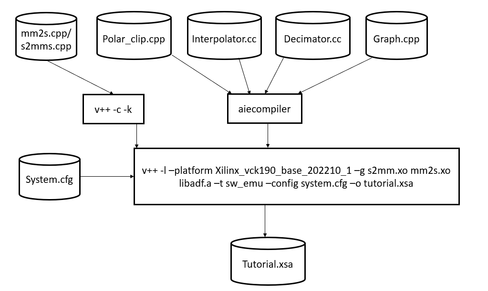

<table>
 <tr>
   <td align="center"><h1>AI Engine Versal Integration for Hardware Emulation and Hardware</h1>
   </td>
 </tr>
 <tr>
 </td>
 </tr>
</table>

# Introduction
The Xilinx Versal ACAP is a fully software-programmable, heterogeneous compute platform that combines the PS (Scalar Engine which includes the Arm processors), PL (Adaptable Engines which includes the FPGA fabric) and AI Engines (AI Engines; Intelligent Engines).

This tutorial demonstrates creating a system design running on the AI Engine, PS, and PL and validating the design running on these heterogeneous domains by running Hardware Emulation.

This tutorial steps through hardware emulation and hardware flow in the context of a complete Versal ACAP system integration. A Makefile is provided, which can be modified to suit your own needs in a different context. By default the Makefile is set for `hw_emu`. If you need to build for `hw`, add `TARGET=hw` to the `make` commands.

**IMPORTANT**: Before beginning the tutorial make sure you have read and followed the *Vitis Software Platform Release Notes* (v2020.2) for setting up software and installing the platform. Also, the variable `PLATFORM_REPO_PATHS` is used to find the platform installation path. Set this variable appropriately. Make sure to run the `environment-setup-aarch64-xilinx-linux` script as to setup the `SDKTARGETSYSROOT` environment variable used to define the `SYSROOT` location.

This tutorial targets the VCK190 ES board (see https://www.xilinx.com/products/boards-and-kits/vck190.html). This board is currently available via early access. If you have already purchased this board, download the necessary files from the lounge and ensure you have the correct licenses installed. If you do not have a board and ES license please contact your Xilinx sales contact.

# Objectives
After completing this tutorial, you should be able to:

* Add input/output ports in an ADF dataflow graph and define their names which will be visible during system integration
* Compile HLS functions for integration in the Programmable Logic (PL)
* Compile ADF graphs
* Create a configuration file that describes system connections and use it during the link stage
* Create a software application that runs on Linux
* Package the design into an easy-to-boot SD card image

# Tutorial Overview
**Section 1**: Compile AI Engine code using the AI Engine compiler and HLS code using `v++`.

**Section 2**: Link the AI Engine kernels, and HLS PL kernels with an extensible platform provided.

**Section 3**: Compile the A72 host code.

**Section 4**: Create the bootable image.

**Section 5**: Run the hardware emulation.

The design that will be used is shown in the following figure:


|Kernel|Type|Comment|
|  ---  |  ---  |  ---  |
|MM2S|HLS|Memory Map to Stream HLS kernel to feed input data from DDR to AI Engine interpolator kernel via the PL DMA|
|WeightSum|AI Engine|Ramp filter [1 2 3 4 5 6 7 8]|
|Average|AI Engine|Just a division by 36|
|Polar_clip|HLS|The polar_clip has a single input stream of complex 16-bit samples, and a single output stream whose underlying samples are also complex 16-bit elements. This equates to 32-bit interfaces on the PL side.|
|Classify|AI Engine|Classify the input samples|
|S2MM|HLS|Stream to Memory Map HLS kernel to feed output result data from AI Engine classifier kernel to DDR via the PL DMA|

## Section 1: Compile PL Kernels and AI Engine Graph
The first step is to take any v++ kernels (HLS C) and your AI Engine kernels and graph and compile them into their respective `.xo` and `.o` files. You can compile the kernels and graph in parallel because they do not rely on each other at this step.

This tutorial design has three AI Engine kernels (`weightsum`, `average`, and `classifier`), one HLS PL kernel (`polar_clip`) and two HLS PL kernels (`s2mm` and `mm2s`):

### Compiling HLS Kernels Using v++

To compile the `mm2s`, `s2mm`, and `polar_clip` PL HLS kernels, use the `v++` compiler command - which takes in an HLS kernel source and produces an `.xo` file.

To compile the kernels, run the following command:

```bash
make kernels
```

Or

```bash
v++ -c --platform $PLATFORM_REPO_PATHS/xilinx_vck190_es1_base_202020_1/xilinx_vck190_es1_base_202020_1.xpfm --save-temps -g -k s2mm s2mm.cpp -o s2mm.xo
v++ -c --platform $PLATFORM_REPO_PATHS/xilinx_vck190_es1_base_202020_1/xilinx_vck190_es1_base_202020_1.xpfm --save-temps -g -k mm2s mm2s.cpp -o mm2s.xo
v++ -c --platform $PLATFORM_REPO_PATHS/xilinx_vck190_es1_base_202020_1/xilinx_vck190_es1_base_202020_1.xpfm --save-temps -g -k polar_clip polar_clip.cpp -o polar_clip.xo
```

Looking at the `v++` command line, you will see several options. The following table describes each option:

|Switch/flag|Description|
|  ---  |  ---  |
|`-c`|Tells v++ to just compile the kernel|
|`--platform/-f`|Specifies the path to an extensible platform|
|`-g`|Required for the hw_emu target to capture waveform data|
|`-k`|The kernel name. This has to match the function name in the corresponding file defining the kernel. (Eg: For kernel `mm2s` needs to make the function name in `mm2s.cpp`|
|`-o`|The output file must always have the suffix of `.xo`|
|`--save-temps/-s`|Saves the generated output process in the `_x` directory|

### Compiling an AI Engine ADF Graph for V++ Flow
An ADF Graph can be connected to an extensible Vitis platform. That is, the graph I/Os can be connected either to platform ports or to ports on Vitis kernels through the `v++` connectivity directives.

* An AI Engine ADF C++ graph contains AI Engine kernels only.
* All interconnections between AI Engine kernels are defined in the C++ graph (`graph.h`).
* All interconnections to external I/Os are fully specified in the C++ simulation testbench (`graph.cpp`) that instantiates the C++ ADF graph object (this is strictly only used in `aiesimulator` which is another tutorial). All platform connections from the graph to the "PLIO" map onto ports on the AI Engine subsystem graph that are connected via v++ connectivity directives. 
* No dangling ports or implicit "connections" are allowed by `v++`.
* Stream connections are specified through the `v++ --sc` option, including employment of PL-based data movers, either in the platform or defined outside the ADF graph as Vitis PL kernels.

To compile the graph type to be used in either HW or HW_EMU, use:

```bash
make graph
```

Or

```bash
aiecompiler --target=hw -include="$XILINX_VITIS/aietools/include" -include="./aie" -include="./data" -include="./aie/kernels" -include="./" --pl-freq=100 -workdir=./Work  aie/graph.cpp
```

| Flag | Description |
| ---- | ----------- |
| --target | Target how the compiler will build the graph. Default is `hw` |
| --include | All the include files needed to build the graph |
| --pl-freq | Sets the frequency (in MHz) to all PL kernels in the graph |
| --workdir | The location of where the Work directory will be created |

The generated output from `aiecompiler` is the `Work` directory, and the `libadf.a` file. This file contains the compiled AI Engine configuration, graph, and Kernel `.elf` files.
## Section 2: Use V++ to Link AI Engine, HLS Kernels with the Platform
After the AI Engine kernels, graph, PL kernel, and HLS kernels have been compiled, you can use `v++` to link them with the platform to generate an `.xclbin`.



`v++` lets you integrate your AI Engine, HLS, and RTL kernels into an existing extensible platform. This step is where the platform chosen is provided by the hardware designer (or you can opt to use one of the many extensible base platforms provide by Xilinx) and `v++` builds the hardware design for you in addition to integrating the AI Engine and PL kernels in the design.

You have a number of kernels at your disposal, but you need to tell the linker how you want to connect them together (from the AI Engine array to PL and vice versa). These connections are described in a configuration file: `system.cfg` in this tutorial.

```ini
[connectivity]
nk=mm2s:1:mm2s
nk=s2mm:1:s2mm
stream_connect=mm2s.s:ai_engine_0.DataIn1
stream_connect=ai_engine_0.DataOut1:s2mm.s
```

| Option/Flag | Description |
| --- | --- |
| `nk` | This specifies the kernel and how many are there be instantiated. As example, the `nk=mm2s:1:mm2s` means that the kernel `mm2s` will instantiate one kernel with the name of `mm2s`.|
| `stream_connect/sc` | This specifies the streaming connections to be made between PL/AIE or PL/PL. In this case, it should always be an output of a kernel to the input of a kernel.|

**NOTE:** The `v++` command-line can get unruly, and using the `system.cfg` file can help contain it.

For `ai_engine_0` the names are provided in the `graph.cpp` when instantiating a `PLIO` object. For this design, as an example, this line `PLIO *in0 = new PLIO("DataIn1", adf::plio_32_bits,"data/input.txt");` has the name **DataIn1** which is the interface name.

Notice that the `polar_clip` kernel is not specified in the `system.cfg` file. This is because the generated graph (`libadf.a`) contains the kernel information and knows how to connect it up to the AI Engine.

You can see the `v++` switches in more detail in the [Vitis Unified Software Platform Documentation](https://www.xilinx.com/support/documentation/sw_manuals/xilinx2020_2/ug1393-vitis-application-acceleration.pdf).

To build the design you can run the follow command:

```bash
make xclbin
```

Or

```bash
v++ -l --platform $PLATFORM_REPO_PATHS/xilinx_vck190_es1_base_202020_1/xilinx_vck190_es1_base_202020_1.xpfm s2mm.xo mm2s.xo polar_clip.xo libadf.a -t hw_emu --save-temps -g --config system.cfg -o tutorial.xclbin 
```

| Flag/Switch | Description |
| --- | --- |
| `--link`/`-l` | Tells v++ that it will be linking a design, so only the `*.xo` and `libadf.a` files are valid inputs |
| `--target`/`-t `| Tells v++ how far of a build it should go, hardware (which will build down to a PDI) or hardware emulation (which will build the emulation models) |
| `--platform` |  Same from the previous two steps |
| `--config` | This allows you to simplify the v++ command-line if it gets too unruly and have items in an `.ini` style file. |

Now you have a generated `.xclbin` that will be used to execute your design on the platform.

## Section 3: Compile the A72 Host Application
After all the new AI Engine outputs are created, you can compile your host application by following the typical cross-compilation flow for the Cortex-A72. As you might notice, the host code is using [XRT](http://www.github.com/Xilinx/XRT) (Xilinx Run Time) as an API to talk to the AI Engine and PL kernels. Notice that in the linker that it is using the the libraries: `-ladf_api_xrt -lxrt_coreutil`. 

1. Open `sw/main.cpp` and familiarize yourself with the contents. Pay close attention to API calls and the comments provided.
   
   Note that [XRT](https://xilinx.github.io/XRT/2020.2/html/index.html) is used in the host application. This API layer is used to communicate with the programmable logic, specifically the PLIO kernels for reading and writing data. To understand how to use this API in an AI Engine application refer to the "Programming the PS Host Application". 

2. Open the `Makefile`, and familiarize yourself with the contents. Take note of the `GCC_FLAGS`, `GCC_INCLUDES`.
   1. `GCC_FLAGS`: Self-explanatory that you will be compiling this code with C++ 14. More explanation will be provided in the packaging step.
   2. `GCC_INCLUDES`: Has the list of all the necessary include files from the SYSROOT as well as the AI Engine tools.
3. Close the Makefile, and run the command:
		
	```bash
	make application
	```

	Or

	```bash
	cd ./sw 
	aarch64-linux-gnu-g++ -Wall -c -std=c++14 -Wno-int-to-pointer-cast --sysroot=$SYSROOT -I$SYSROOT/usr/include/xrt -I$SYSROOT/usr/include -I./ -I../aie -I$XILINX_VITIS/aietools/include -I$XILINX_VITIS/include -o aie_control_xrt.o ../Work/ps/c_rts/aie_control_xrt.cpp
	aarch64-linux-gnu-g++ -Wall -c -std=c++14 -Wno-int-to-pointer-cast --sysroot=$SYSROOT -I$SYSROOT/usr/include/xrt -I$SYSROOT/usr/include -I./ -I../aie -I$XILINX_VITIS/aietools/include -I$XILINX_VITIS/include -o main.o main.cpp
	aarch64-linux-gnu-g++ main.o aie_control_xrt.o -ladf_api_xrt -lxrt_coreutil -L$SYSROOT/usr/lib --sysroot=$SYSROOT -L$XILINX_VITIS/aietools/lib/aarch64.o -o host.exe 
	cd ..
	```

The follow table describes some of the GCC options being used:

| Flag | Description |
| ---- | ----------- |
| `-Wall` | Print out all warnings            |
| `-Wno-int-to-pointer-cast` | Warn about an integer to pointer cast |
| `--sysroot` | Tells the compiler where to find the headers/libs for cross-compile |
| `-std=c++14` | This is required for Linux applications using XRT |


## Section 4: Package the Design
With all the AI Engine outputs and the new platform created, you can now generate the Programmable Device Image (PDI) and a package to be used on an SD card. The PDI contains all executables, bitstreams, and configurations of every element of the device, and the packaged SD card directory contains everything to boot Linux and have your generated application and `.xclbin`.

To package the design, run the following command:

```bash
make package
```

Or

```bash
cd ./sw
v++ --package -t hw_emu \
	-f $PLATFORM_REPO_PATHS/xilinx_vck190_es1_base_202020_1/xilinx_vck190_es1_base_202020_1.xpfm \
	--package.rootfs=$PLATFORM_REPO_PATHS/sw/versal/xilinx-versal-common-v2020.2/rootfs.ext4 \
	--package.image_format=ext4 \
	--package.boot_mode=sd \
	--package.kernel_image=$PLATFORM_REPO_PATHS/sw/versal/xilinx-versal-common-v2020.2/Image \
	--package.defer_aie_run \
	--package.sd_file host.exe ../tutorial.xclbin ../libadf.a
cd ..
```

**NOTE:** By default the `--package` flow will create a `a.xclbin` automatically if the `-o` switch is not set.

The following table describes the packager options:

| Switch/flag | Description |
| --- | --- |
| `rootfs` | Points to the formatted image of the platform |
| `image_format` | Tells packager what the image format is |
| `boot_mode` | Signifies how the design is going to be run |
| `kernel_image` | Points to the Image file created by Petalinux |
| `defer_aie_run` | Tells packager at boot to not start the AI Engine and let the host application control it |
| `sd_file` | Tell the packager what file is to be packaged in the `sd_card` directory. You'll have to specify this multiple times for all the files you want packaged |

## Section 5: Run Hardware Emulation
After packaging, everything is set to run emulation or hardware. 

1. To run emulation use the following command:

```bash
make run_emu
```

Or 

```bash
cd ./sw
./launch_hw_emu.sh
cd ..
```

When launched, use the Linux prompt presented to run the design.

2. Execute the following command when the emulated Linux prompt displays:

	```bash
	cd /mnt/sd-mmcblk0p1
	export XILINX_XRT=/usr
	dmesg -n 4 && echo "Hide DRM messages..."
	```

This will set up the design to run emulation. Run the design using the following command:

```bash
./host.exe a.xclbin
```

You should see an output displaying **TEST PASSED**. When this is shown, run the keyboard command: `Ctrl+A x` to end the QEMU instance.

## Section 6: Build and Run on Hardware
1. To build for hardware run the following command:

	```bash
	make xclbin TARGET=hw
	```

	Or

	```bash
	v++ -l --platform $PLATFORM_REPO_PATHS/xilinx_vck190_es1_base_202020_1/xilinx_vck190_es1_base_202020_1.xpfm s2mm.xo mm2s.xo polar_clip.xo libadf.a -t hw --save-temps -g --config system.cfg -o tutorial.xclbin 
	```

2. Then re-run the packaging step with:

	```bash
	make package TARGET=hw
	```

	Or

	```bash
	cd ./sw
	v++ --package -t hw \
		-f $PLATFORM_REPO_PATHS/xilinx_vck190_es1_base_202020_1/xilinx_vck190_es1_base_202020_1.xpfm \
		--package.rootfs=$PLATFORM_REPO_PATHS/sw/versal/xilinx-versal-common-v2020.2/rootfs.ext4 \
		--package.image_format=ext4 \
		--package.boot_mode=sd \
		--package.kernel_image=$PLATFORM_REPO_PATHS/sw/versal/xilinx-versal-common-v2020.2/Image \
		--package.defer_aie_run \
		--package.sd_file host.exe ../tutorial.xclbin ../libadf.a
	cd ..
	```

When you run on hardware, ensure you have a supported SD card. Format the SD card with the `sw/sd_card.img` file. Then plug the SD card into the board and power it up.

3. When a Linux prompt appears, run the following commands:

	```bash
	dmesg -n 4 && echo "Hide DRM messages..."
	cd /mnt/sd-mmcblk0p1
	export XILINX_XRT=/usr
	./host.exe a.xclbin
	```

You should see **TEST PASSED**. You have successfully run your design on hardware.

**IMPORTANT**: To rerun the application you need to power cycle the board.

## Summary
In this tutorial you learned the following:

* How to compile PLIO and PL Kernels using v++ -c
* How to link the `libadf.a`, PLIO and PL kernels to the `xilinx_vck190_es1_202020_1` platform
* How to package your host code, and the generated `xclbin` and `libadf.a` into an SD card directory
* How to execute the design on the board
* How to execute the design for hardware emulation

To read more about the use of Vitis in the AI Engine flow see: *UG1076: Versal ACAP AI Engine Programming Environment Chapter 13: Integrating the Application Using the Vitis Tool Flow*. 

© Copyright 2020 Xilinx, Inc.

Licensed under the Apache License, Version 2.0 (the "License");
you may not use this file except in compliance with the License.
You may obtain a copy of the License at

    http://www.apache.org/licenses/LICENSE-2.0

Unless required by applicable law or agreed to in writing, software
distributed under the License is distributed on an "AS IS" BASIS,
WITHOUT WARRANTIES OR CONDITIONS OF ANY KIND, either express or implied.
See the License for the specific language governing permissions and
limitations under the License.

<p align="center"><sup>XD002</sup></p>