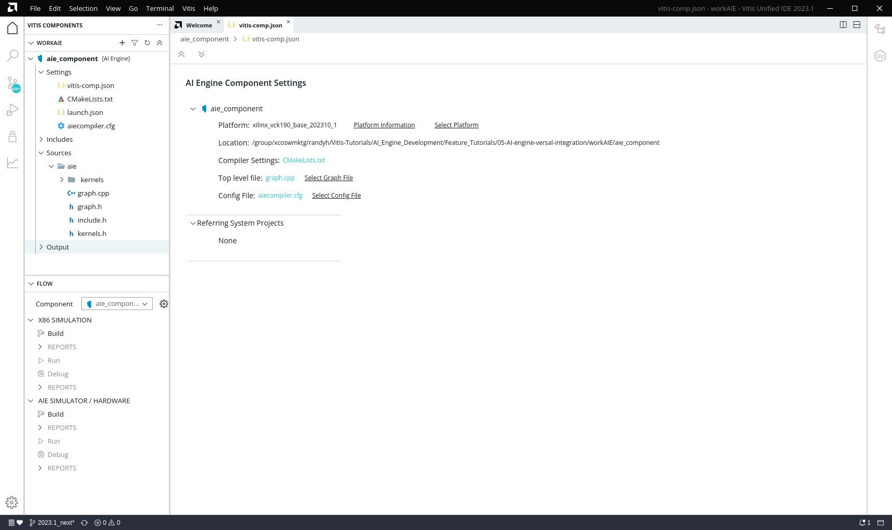
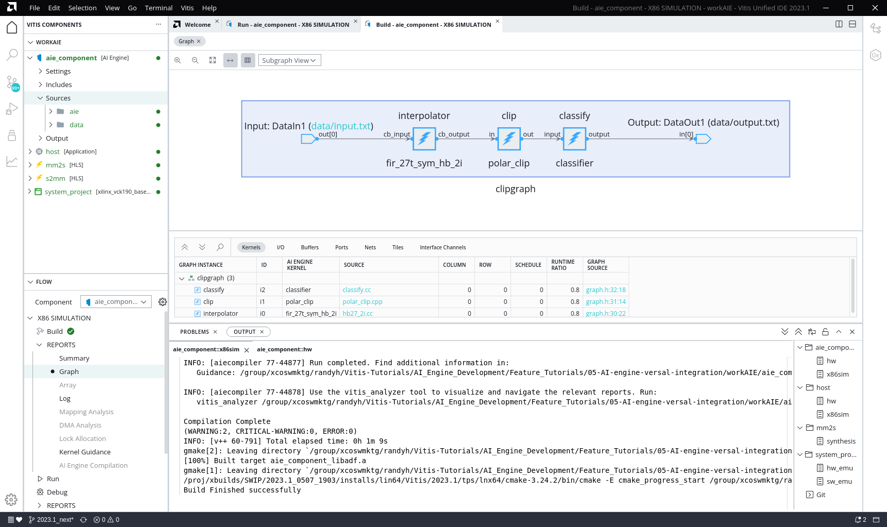
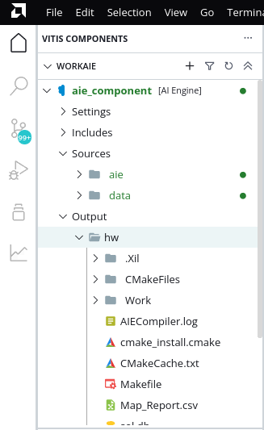
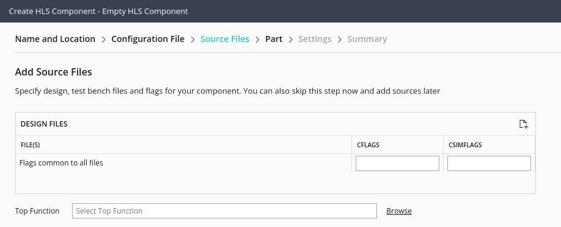
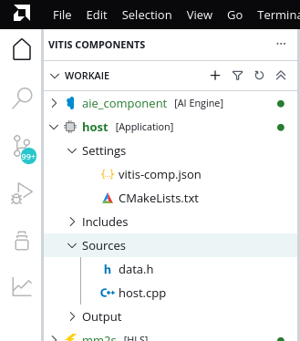
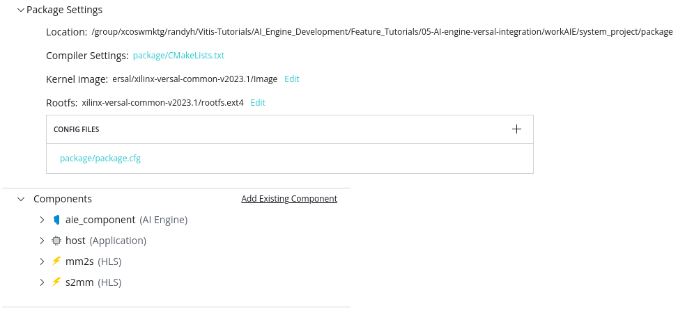
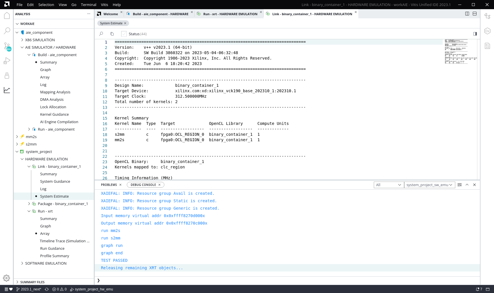

<table class="sphinxhide" width="100%">
 <tr width="100%">
    <td align="center"><h1>AI Engine Development</h1>
    <a href="https://www.xilinx.com/products/design-tools/vitis.html">See Vitis™ Development Environment on xilinx.com</br></a>
    <a href="https://www.xilinx.com/products/design-tools/vitis/vitis-ai.html">See Vitis™ AI Development Environment on xilinx.com</a>
    </td>
 </tr>
</table>

## Objectives

This tutorial demonstrates the steps needed for building an AI Engine system design in the new Vitis unified IDE for use on VCK190 platform and Versal device. After completing this tutorial, you should be able to:

* Launch the Vitis unified IDE on a new workspace
* Create an AIE component with ADF graphs
* Create HLS components for the Programmable Logic region of the device
* Create an Application component to run on the embedded processor
* Create a System Project to link the different components
* Run the system in software and hardware emulation
* Explore the Analysis view in the IDE for viewing summary reports

## Tutorial Overview

The design that will be used is shown in the following figure:


|Kernel|Type|Comment|
|  ---  |  ---  |  ---  |
|MM2S|HLS|Memory Map to Stream HLS kernel to feed input data from DDR to AI Engine interpolator kernel via the PL DMA.|
|Interpolator |AI Engine| Half-band 2x up-sampling FIR filter with 16 coefficients. Its input and output are cint16 window interfaces and the input interface has a 16 sample margin. |
|Polar_clip|AI Engine| Determines the magnitude of the complex input vector and clips the output magnitude if it is greater than a threshold. The polar_clip has a single input stream of complex 16-bit samples, and a single output stream whose underlying samples are also complex 16-bit elements.|
|Classifier |AI Engine| This kernel determines the quadrant of the complex input vector and outputs a single real value depending which quadrant. The input interface is a cint16 stream and the output is a int32 window.  |
|S2MM|HLS|Stream to Memory Map HLS kernel to feed output result data from AI Engine classifier kernel to DDR via the PL DMA.|


## Step 1: Launch Vitis Unified IDE

**IMPORTANT:** The following steps assume you have configured the environment as described in the [*Introduction*](./README.md) of the tutorial. 

To begin the tutorial, you must create a workspace for your design and launch the new Vitis unified IDE. Use the following command sequence to change directory to the current tutorial, make a workspace folder, and launch the IDE: 

```
cd <tutorial_path>/05-AI-engine-versal-integration/
mkdir workAIE
vitis -new -w workAIE
```

## Step 2: Create and Build the AI Engine Component

As shown in the figure above, this tutorial contains three AI Engine kernels: Interpolator, Polar_clip, and Classifier. Start by creating the AIE component that will contain the graph and kernels. Run the following steps:

1.  From the main menu select **File > New Component > AI Engine**

This opens the Create AI Engine Component wizard on the *Name and Location* page. 

2.  Enter the `Component name` as aie_component (default), enter the `Component location` as the workspace (default), and click **Next**. 

This opens the *Add Source Files* page. 

3.  Select `Import Sources > Add Folder` and navigate to `<tutorial_path>/ 05-AI-engine-versal-integration/aie` and click **OK**. 

4. Under `Select top-level file` confirm that `graph.cpp` has been selected and click **Next**. 

The tool automatically selects the top-level graph from imported files. You just need to make sure it has chosen correctly. Clicking **Next** opens the *Select Part* page.  

5.  Select the `xilinx_vck190_base_202310_1` platform and click **Next** to open the *Summary* page. 

6.  Review the *Summary* page and click **Finish** to create the defined AI Engine component. 

This results in the aie_component `vitis-comp.json` file being opened. This is the file associated with the component in the Vitis unified IDE as shown in the following image. The tab at the top will display `vitis-comp.json`, but it is the aie_component you just created. 



Select the `aiecompiler.cfg` link and open the config file. It contains `include` statements for the added `aie` source code folder, and the `[aie]` section that contains configuration commands such as the `xchess` statement. Refer to [*v++ Mode AI Engine*](https://docs.xilinx.com/r/en-US/ug1553-vitis-ide/v-Mode-AI-Engine) for more information on these configuration commands. 

In the Vitis Components explorer, expand the `aie_component` and examine the included sub-folders: Settings, Includes, Sources... Notice the `aie` folder you imported into the Sources folder. 

In the Flow Navigator the aie_component you just created is now the active component. It is currently the only component. 

Select the **Build** command under the X86 Simulation heading. 

The tool compiles the aie_component for use with the `x86simulator` using the following command which is displayed in the `aie_component::x86sim` Output window:
```
v++ -c --mode aie --target x86sim --config ./workAIE/aie_component/aiecompiler.cfg –platform ../base_platforms/xilinx_vck190_base_202310_1/xilinx_vck190_base_202310_1.xpfm --work_dir ./workAIE/aie_component/build/x86sim/./Work ./workAIE/aie_component/aie/graph.cpp
```

| Flag | Description |
| ---- | ----------- |
| --target | Target how the compiler will build the graph and it is set to `x86sim`.  Default is `hw` |
| --config | The configuration file containing commands to apply during the build process. |
| --platform | The platform or device to target the build to. |
| --work_dir | The location where the work directory will be created. |

Examine the Output folder of the aie_component in the Vitis Components Explorer. Notice the addition of the `x86sim` folder with the results of the build. It contains the `Work` folder, the Makefiles, the `aiecompiler.log`, and the `libadf.a` output that contains the compiled AI Engine configuration, graph, and Kernel `.elf` files.

After building the component the Reports view under the X86 Simulation heading displays the Summary report, the Graph report, Logs, and Guidance. The **Summary** view displays compilation runtime,  version of the compiler used, the platform targeted, kernels created, and the command line used for compilation.

The **Graph** view provides an overview of your graph and how the graph is designed in a logical fashion. Clicking on any kernel in the graph diagram highlights the corresponding kernel in the GRAPH INSTANCE column. You can open the source code by clicking the file name in the SOURCE column.



You can click **Log** to view the compilation log for your graph.

### Simulate the AI Engine Graph using the `x86simulator`

After the graph has been compiled, you can simulate your design with the `x86simulator` command. The x86 simulator is an ideal choice for testing, debugging, and verifying behavior because of the speed of iteration and the high level of data visibility it provides the developer. The x86 simulation does not provide timing, resource, or performance information.

However, prior to running simulation you must add the data files needed for the design. You need to add the data folder to the Sources folder in the aie_component using the following steps:

1. In the Vitis Components Explorer right-click the `Sources` folder of the aie_component
2. **Import > Folders** and browse to `<tutorial_path>/05-AI-engine-versal-integration/data`
3. Cick **OK**

After the `data` folder is added to the Sources, select the **Run** command in the Flow Navigator under the X86 SIMULATION heading. The Task window shows the results as "Simulation completed successfully..." 

### Build and Run the AI Engine Graph for Hardware

You can also build and run the graph for the aiesimulator using the **Build** and **Run** commands under the AIE SIMULATOR/HARDWARE heading in the Flow Navigator. This will compile the `libadf.a` for both the aiesimulator tool and for running on the physical device or hardware. 



After the build completes examine the Output folder of the aie_component in the Vitis Components Explorer. Notice the addition of the hw folder with the results of the build. It contains the `Work` folder, the Makefiles, the `aiecompiler.log`, and the `libadf.a` output for the hardware build. 

You can examine the Reports from the Build and the Run commands to see the results. 

## Step 3: Create and Build HLS Components

The AIE graph application you are working on requires two PL kernels to load data onto the device. These are the `mm2s` and `s2mm` kernels. You will create separate HLS components using the following steps: 

1.  From the main menu select **File > New Component > HLS**

This opens the Create HLS Component wizard on the *Name and Location* page. 

2.  Enter the `Component name` as mm2s, enter the `Component location` as the workspace (default), and click **Next**. 

This opens the *Configuration File* page. The configuration file contains commands for building and running the HLS component as described in [*v++ Mode HLS*](https://docs.xilinx.com/r/en-US/ug1553-vitis-ide/v-Mode-HLS). You can specify a new empty file, an existing config file, or generate a config file from an existing HLS project as described in [*Creating an HLS Component*](https://docs.xilinx.com/r/en-US/ug1553-vitis-ide/Creating-an-HLS-Component).

3.  Select `Empty File` and click **Next**. 

This opens the *Source Files* page.  



5.  Select the Add Files icon to open a file browser, navigate to `<tutorial_path>/05-AI-engine-versal-integration/pl_kernels/mm2s.cpp` and select **OK**. 

6.  Under the Top Function browse and select the `mm2s` function and click **Next**. Note that there are no testbenches for these kernels. 

7.  On the *Select Part* page select the `xilinx_vck190_base_202310_1` platform and click **Next** to open the Settings page. 

8.  On the *Settings* page select the `Vitis Kernel Flow` and enable the check box to `Run Additional Packing Step to create .xo output` as you will be using the HLS component in a System project and you will want a PL kernel (`.xo`) to be generated. 

9.  Under the Clock settings specify `8ns` for the Period, and `12%` for the Uncertainty to override the default values. Click **Next** to open the *Summary* page.

10.  Review the *Summary* page and click **Finish** to create the defined HLS component. 
 
Repeat the prior steps to create the `s2mm` HLS component.

In the `vitis-comp.json` for either the `mm2s` or `s2mm` HLS components, select the Config File link to open the `hls_config.cfg` file for the specific component. Examine the contents of the config file. It currently contains the part (defined by the platform), flow target, source cpp file and other options that you defined when creating the HLS component. Notice that most of the options fall under the `[hls]` header. 

In the Flow Navigator, select the `mm2s` and later the `s2mm` Components to make them active, then select the **Run** command under C Synthesis to start the synthesis of the component. Note that you can have two builds occurring in the Vitis IDE at the same time. This obviously depends on the resources available in the system, but the Vitis unified IDE lets you kickoff a build and then continue working as it runs. 

The C Synthesis command is executed by the Vitis unified IDE using the new common command-line as follows: 

```
v++ -c --mode hls --config <tutorial_path>/05-AI-engine-versal-integration/workAIE/mm2s/hls_config.cfg --work_dir mm2s
```

|Switch/flag|Description|
|  ---  |  ---  |
|`-c --mode hls`|Specifies HLS compilation mode (or C synthesis)|
|`--config <filename>`|Specifies the path to a configuration command file|
|`--work_dir`|Specifies the work directory for the HLS component|

After Synthesis is complete you will see the *Synthesis finished successfully* message in the Output window and the Reports will be populated with the `hlscompile_summary` for the component. 

## Step 4: Create and Build the Application Component

The Application component is an application that runs on the processor, Arm or x86, that loads and runs the device binary (`.xclbin`) which you will build later. The Vitis unified IDE automatically detects whether the Application component uses XRT native API or OpenCL and compiles the code as needed. Create the Application component using the following steps: 

1.  From the main menu select **File > New Component > Application**

This opens the Create Application Component wizard on the *Name and Location* page. 

2.  Enter the `Component name` as host, enter the `Component location` as the workspace (default), and click **Next**. 

This opens the *Select Platform* page. 

3.  On the *Select Platform* page select the `xilinx_vck190_base_202310_1` platform and click **Next** to open the *Select Domain* page. 

On the *Select Domain* page you will select from the available processor domains and OS. In this case there is only one choice. 

4.  Select the xrt domain and click **Next** to open the *Sysroot* page. 

On the *Sysroot* page you will provide a path to the sysroot as part of the common images for the selected platform. You can find more information on this at [*Installing Embedded Platforms*](https://docs.xilinx.com/r/en-US/ug1393-vitis-application-acceleration/Installing-Embedded-Platforms?tocId=9o7rpHmLluJkAdxzCI_2yA).

Enter the path to the Sysroot for the selected platform and click **Next** to open the *Summary* page. 

5.  Review the *Summary* page and click **Finish** to create the defined Application component. 
 
The Application component `vitis-comp.json` file is opened in the center editor, and the component is added to the Component Explorer. When creating the Application component you do not specify source files so you must add the required source files after the component is created. 



In the Vitis Components Explorer view expand the `host` component, right-click the `Sources` folder and **Import Source > Files** to import the following source files:

```
<tutorial_path>/05-AI-engine-versal-integration/sw/host.cpp
<tutorial_path>/05-AI-engine-versal-integration/sw/data.h
```

**NOTE:** If your design uses the ADF API to control the AI Engine then you must also import the `aie_control_xrt.cpp` file into your Application component Sources folder. Refer to [*Host Programming on Linux*](https://docs.xilinx.com/r/en-US/ug1076-ai-engine-environment/Host-Programming-on-Linux) for more information. This design uses the XRT native API and so does not require it.

With the files in place, you are now ready to build the Application. 

With the `host` application active in the Flow Navigator, select **Build** under the x86 SIMULATION header. This will build the host application for use in software emulation. Even though the `xilinx_vck190_base_202310_1` is an embedded platform, software emulation is run on the x86 processor as described in [*Embedded Processor Emulation Using PS on x86*](https://docs.xilinx.com/r/en-US/ug1393-vitis-application-acceleration/Embedded-Processor-Emulation-Using-PS-on-x86). The compilation process is reported to the `host::x86sim` Output window. 

After the x86sim build completes you can select **Build** under the HARDWARE heading in the Flow Navigator. The compilation process is reported to the `host::hw` Output window. You have now compiled the host application for both the software emulation flow and the hardware emulation/hardware flows of the System project.

## Step 5: Create the System Project

The System project is where the different components that you have built so far are integrated into a single system as described in [*Creating a System Project for Heterogeneous Computing*](https://docs.xilinx.com/r/en-US/ug1553-vitis-ide/Creating-a-System-Project-for-Heterogeneous-Computing). The AI Engine component, the HLS components, and the Application component are integrated into the system project using the following steps. 

1.  From the main menu select **File > New Component > System Project**

This opens the Create System Project wizard on the *Name and Location* page. 

2.  Enter the `Component name` as system_project (default), enter the `Component location` as the workspace (default), and click **Next**. 

This opens the *Select Platform* page. 

3.  On the Select Part page select the `xilinx_vck190_base_202310_1` platform and click **Next** to open the Embedded Component Paths page. 

The Embedded Component Paths page lets you specify the path to the Sysroot, RootFS, and Image for the embedded processor platform as described at [*Installing Embedded Platforms*](https://docs.xilinx.com/r/en-US/ug1393-vitis-application-acceleration/Installing-Embedded-Platforms?tocId=9o7rpHmLluJkAdxzCI_2yA). Enter the following choices and click **Next** to proceed: 

```
Kernel Image: <path-to-common-files>/Image
Root FS: <path-to-common-files>/rootfs.ext4
Sysroot: <path-to-common-files>/sysroots/cortexa72-cortexa53-xilinx-linux
```
**TIP:** You can enable the `Update Workspace Preference` checkbox to add the settings to any component or project that uses the specified platform as explained in [*Embedded Component Paths*](https://docs.xilinx.com/r/en-US/ug1553-vitis-ide/Embedded-Component-Paths).

6.  Review the Summary page and click **Finish** to create the defined System project. 
 
The System project `vitis-sys.json` file is opened in the center editor, and the project is added to the Vitis Components Explorer.  

After creating the System project, you need to configure it. You must define which of the components in the current workspace should be added to the System. In this case, all the components are to be added. 


Under the Hardware Linker Settings in the open `vitis-sys.json` file, start by selecting the `+` command next to the Binary Containers. This lets you add a binary container when one doesn't exist. Accept the default name `binary_container_1` and select both the HLS components that are displayed: `mm2s` and `s2mm`. This creates the binary container for the System project and lets you add HLS components at the same time. 

Expand the Binary Container and scroll down to the AIE Graphs and select `+` to select and add the `aie_component`. 

Select the `hw_link/binary_container_1-link.cfg` to edit the configuration file containing commands that determine how the hw_link process will run and the how device binary will be generated. The Config File Editor opens and displays the V++ Linker Settings. Look through the settings to see what is available. In the lower half of the Config File Editor is a *Kernels Data* section that lets you specify the number of CUs for each kernels, or the naming convention applied. You can also enable profiling options for when the device is run. 

Select the **Source Editor** command to see the text form of the Config File Editor. 

The design features a number of PL kernels as well as the AI Engine graph. You need to tell the linker how to connect the AI Engine array to PL and vice versa. You will need to replace the current lines in the config file:

```ini
[connectivity]
nk=mm2s:1:mm2s_1
nk=s2mm:1:s2mm_1
```

With the following lines:
```ini
[connectivity]
nk=mm2s:1:mm2s
nk=s2mm:1:s2mm
sc=mm2s.s:ai_engine_0.DataIn1
sc=ai_engine_0.DataOut1:s2mm.s
```

| Option/Flag | Description |
| --- | --- |
| `nk` | Specifies the number of instantiations of the kernel as described in [*Creating Multiple Instances of a Kernel*](https://docs.xilinx.com/r/en-US/ug1393-vitis-application-acceleration/Creating-Multiple-Instances-of-a-Kernel). |
| `stream_connect/sc` | Specifies the connections to be made between streaming outputs and inputs as described in [*Specifying Streaming Connections*](https://docs.xilinx.com/r/en-US/ug1393-vitis-application-acceleration/Specifying-Streaming-Connections).|

**NOTE:** For `ai_engine_0` the streaming input and output names are provided in the `graph.h`, for example:

```in = adf::input_plio::create("DataIn1", adf::plio_32_bits,"data/input.txt");```

Close the Config File Editor and return to the System project. 

Click the link for the Package Settings config file, `package/package.cfg`. The packaging process creates the packaged SD card directory and contains everything needed to boot Linux and run your generated application and device binary.



Examine the file, scroll down to the AI Engine settings. Select the checkbox for **Do Not Enable Cores** to prevent the AI Engine from starting before the Application begins. Switch to the text view of the `package.cfg` file and ensure it has the `defer_aie_run=true` statement in it. 

Close the `package.cfg` file when you are finished. 

Finally, you can add the host application to the System project. Select the **Add Existing Component** link under the Component heading. Select the Application component to add. Add the `host` application. 

The System project is now fully defined. 

## Step 6: Building and Running the System Project

The System project has three different build targets: software emulation, hardware emulation, and hardware. As described in [*Build Targets*](https://docs.xilinx.com/r/en-US/ug1393-vitis-application-acceleration/Build-Targets), each of these targets has a specific use and each requires progressively more time to build. 

* Software emulation is a functional simulation of the system components for evaluation of the behavior of the system. 
* Hardware emulation is an RTL based simulation of the system with more accurate resource and performance estimates. 
* Hardware provides actual performance of the system on the hardware accelerator card or embedded system. 


### Building and Running for Software Emulation

From the Flow Navigator, select the **Build All** command under the Software Emulation header. The tool will alert you that some components have not been built, and would you like to build them. Select **Yes** to proceed. After the build is complete you can review the **Reports** under the Link and Package headings. The reports offer a summary view as well as additional details of the build process. 

**TIP:** In the Vitis unified IDE the Software Emulation build is specifically designed to run on the x86 processor, regardless of the platform selected as described in [*Embedded Processor Emulation Using PS on x86*](https://docs.xilinx.com/r/en-US/ug1393-vitis-application-acceleration/Embedded-Processor-Emulation-Using-PS-on-x86). 

The build process involves both linking and packaging the system design. The linking process uses the following command as described in [*Linking the System*](https://docs.xilinx.com/r/en-US/ug1393-vitis-application-acceleration/Linking-the-System):

The packaging process uses the following command as described in [*Packaging the System*](https://docs.xilinx.com/r/en-US/ug1393-vitis-application-acceleration/Packaging-the-System). 

After linking and packaging you are almost set to run emulation. However, the Vitis unified IDE requires a launch configuration to run the system. You can create a launch configuration in one of a number of ways. In the Vitis Components Explorer expand the System project Settings folder and click to open the `launch.json` file.

Click on the `+ New Launch Configuration` and select `Software Emulation` to create a new launch configuration.  

In the Flow Navigator select **Run** under the Software Emulation heading to run the application. 

Software emulation is the first step to building and testing the system in a functional process. The software emulation runs the PS application as an x86 process. The main advantage of running the PS application on x86 is that it does not require QEMU and Linux to boot up, therefore the software emulation runs faster.

### Building and Running for Hardware Emulation

From the Flow Navigator, select the **Build All** command under the Hardware Emulation header. Again the tool will alert you that some components have not been built, and would you like to build them. Select **Yes** to proceed. After the build is complete you can review the **Reports** under the Link and Package headings. The reports offer a summary view as well as additional details of the build process. 

While the System project runs software emulation for an embedded processor using the *PS on x86* mode, hardware emulation is run under the QEMU environment to fully simulate the embedded processor. When running the hardware emulation build this requires you to first use **Start Emulator** from the Flow Navigator. 

**TIP:** Wait until the QEMU environment prompt shows up before starting the **Run** command. You should see something similar to `versal-rootfs-common-20231:/mnt#` in the Output window before proceeding. 

With the Emulator running, click **Run** under HARDWARE EMULATION header to start the system project running. 

You should see TEST PASSED when the emulation run has completed. At this point you will need to stop the emulator by hovering your mouse over the **Start Emulator** command in the Flow Navigator and clicking the `X`. 

### Building and Running on Hardware

Scrolling down in the Flow Navigator you will see the **Build** and **Run** commands under the HARDWARE heading. The build process for the hardware takes much longer to link and package the design and produce an SD card image that can be used to boot and run the system. 

## Step 7: Using the Analysis View

As you build the different components of the system, or build and run the system, the Vitis unified IDE populates each step with a report of the compilation process, or the linking and packaging process, or the simulation run results. Each of these reports appears in the Flow Navigator for the specific component and step of the flow being run. You can review these reports as they become avialable, or you can review all the reports for the system project and the components of the project using the Analysis view as described [*Working with the Analysis View*](https://docs.xilinx.com/r/en-US/ug1553-vitis-ide/Working-with-the-Analysis-View-Vitis-Analyzer). 

Select the Analysis view from the toolbar menu at the left of the Vitis unified IDE. You should see the view as displayed in the figure below. 



You can use the Analysis view to review and compare the various reports generated during the System project build and run processes. 

#### Support

GitHub issues will be used for tracking requests and bugs. For questions go to [support.xilinx.com](https://support.xilinx.com/).

<p class="sphinxhide" align="center"><sub>Copyright © 2020–2023 Advanced Micro Devices, Inc</sub></p>

<p class="sphinxhide" align="center"><sup><a href="https://www.amd.com/en/corporate/copyright">Terms and Conditions</a></sup></p>