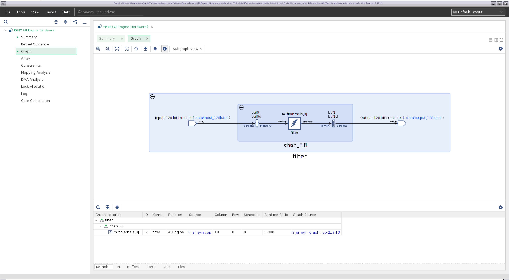
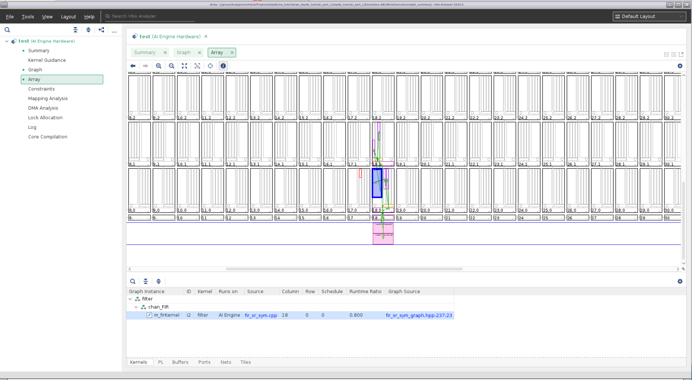
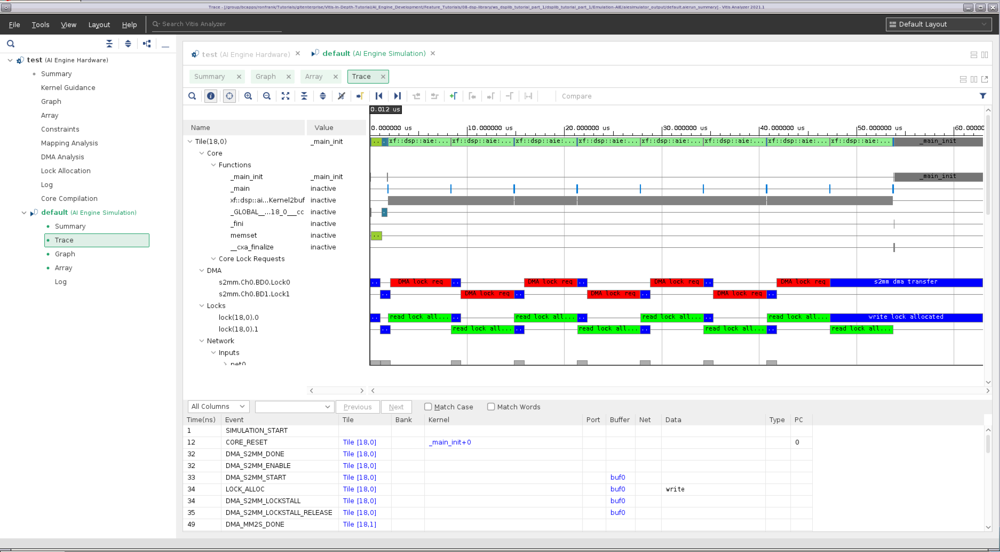
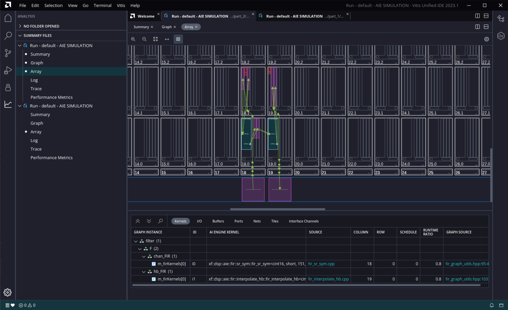
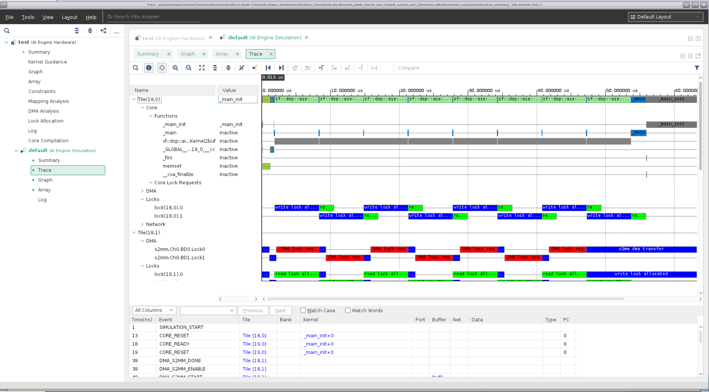
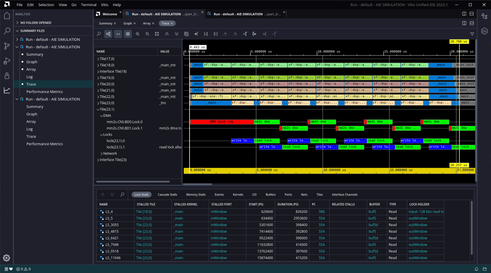

<table>
 <tr>
   <td align="center"><h1>2020.2 Versal™ AI Engine</h1>
   </td>
 </tr>
 <tr>
 <td align="center"><h1>DSP Library Tutorial</h1>
 </td>
 </tr>
</table>

# Table of Contents
* [Introduction](#introduction)

* [Before You Begin](#before-you-begin)

* [Part 1: Creating a Single Kernel Graph](#part-1-creating-a-single-kernel-graph)

* [Part 2: Creating a Multi Kernel Graph](#part-2-creating-a-multi-kernel-graph)

* [Part 3: Optimizing Filter Performance](#part-3-optimizing-filter-performance)

* [References](#references)


# Introduction
The Xilinx® Versal™ adaptive compute acceleration platform (ACAP) is a fully software-programmable, heterogeneous compute platform that combines the processing system (PS) (Scalar Engines that include Arm® processors), Programmable Logic (PL) (Adaptable Engines that include the programmable logic), and AI Engines which belong in the Intelligent Engine category.

This tutorial demonstrates how to use kernels provided by the DSP Library for a filtering application, how to analyze the design results, and how to use filter parameters to optimize the design's performance using simulation. It does not take the design to a hardware implementation, however.

## Objectives 
After completing the tutorial, you should be able to:
* Build signal processing datapath using the Vitis™ application acceleration development flow
* Evaluate the performance and resource utilization metrics of a design
* Adjust filter parameters to meet system performance requirements

## Tutorial Overview 

This tutorial shows how to construct a simple two-stage decimation filter. This filter is not targeted at a specific real-life application, but is used to show how to use the DSP Library to construct filter chains.

* Part 1 shows how to use create an AI Engine project and instantiate a parameterized FIR filter from DSPLib
* Part 2 shows how to cascade filters together into a chain
* Part 3 shows how to optimize performance of the filter chain by tuning individual filters


## Directory Structure

```
dsplib_tutorial_install
├───images     images for this README
├───part_1
│   ├───data
│   └───src
├───part_2
│   ├───data
│   └───src
└───part_3
    ├───data
    └───src
```

# Before You Begin


## *Documentation*: Explore AI Engine Architecture

* [Versal ACAP AI Engines for Dummies](https://forums.xilinx.com/t5/Design-and-Debug-Techniques-Blog/Versal-ACAP-AI-Engines-for-Dummies/ba-p/1132493)

* [AM009 AI Engine Architecture Manual](https://www.xilinx.com/support/documentation/architecture-manuals/am009-versal-ai-engine.pdf)


## *Tools*: Installing the Tools

Tools Documentation: 

* [AI Engine Tools lounge](https://www.xilinx.com/member/versal_ai_tools_ea.html)

* [UG1076 Versal ACAP AI Engine Programming Environment](https://www.xilinx.com/member/versal_ai_core_docs_ea.html)

* [UG1295 Digital Signal Processing Library for AI Engine](https://www.xilinx.com/member/versal_ai_engines.html#documentation)

To run through this tutorial, you will need to download and install the following tools:

* Install the [Vitis Software Platform 2020.2](https://www.xilinx.com/support/download/index.html/content/xilinx/en/downloadNav/vitis.html) 

* Obtain licenses for the AI Engine tools

* Download and setup the [Xilinx DSP Library (DSPLib) 2020.2](https://www.xilinx.com/member/versal_ai_tools_ea.html#platforms)

* Download and setup the [VCK190 Vitis Platform for 2020.2](https://www.xilinx.com/member/versal_ai_tools_ea.html#platforms)

## *Environment*: Setting Up Your Target Platform Environment
When the elements of the Vitis software platform are installed, update the target platform environment script. 

Create a script file named `env_setup_2020.sh` in your favourite text editor. Replace the placeholders with the appropriate paths: 

```bash
export DSPLIB_ROOT=<YOUR-DSPLIB-DIRECTORY>
export PLATFORM_REPO_PATHS=<YOUR-PLATFORM-DIRECTORY> 

source <XILINX-INSTALL-LOCATION>/Vitis/2020.2/settings64.sh
```
Then source the environment script: 
```bash
source env_setup_2020.sh
```  

## *Validation*: Confirming Tool Installation
Ensure that you are using the 2020.2 version of Xilinx tools. 
```bash
which vitis
which aiecompiler
```

## *Other Tutorials*: Learn Basic Vitis Compiler and AI Engine Concepts
For novice users, following link provides tutorials to understand the basic Vitis compiler concepts and building simple AI Engine designs: 

* https://github.com/Xilinx/Vitis-Tutorials

# Part 1: Creating a Single Kernel Graph

Part 1 of this tutorial will:
* demonstrate how to create a Vitis project
* link in the DSPLib functions
* create a simple graph containing a parameterized DSPLib FIR filter.
* compile and simulate the design
* evaluate the results.

## Creating the Project

1. To begin this tutorial, create a new workspace directory, and start the Vitis environment:

    ```bash
    mkdir ws_dsplib_tutorial_part_1
    vitis
    ```
2. You will see the *Select a directory as workspace* window. Navigate to the **ws_dsplib_tutorial_part_1** directory, select it, and click **Launch**. The Vitis application window will appear. Begin by creating a new application.

3. Click **Create Application Project**. The Create a New Application Project window will appear, which explains the basic concepts of a Vitis project. Click **Next** when ready.

4. The Platform window will appear. Select **xilinx_vck190_base_202020_1** and click **Next**.

5. The Application Project Details window appears next. Give the application the name **displib_tutorial_part_1**. For the target processor, select **ai_engine**,  and click **Next**.

6. The Domain window will appear. The default domain, *aiengine*, is the desired domain. Click **Next**.

7. The Templates window will appear next. Select **Empty Application** and click **Finish**. Next, import the source and data files.

8. In the project tree shown in the Explorer pane, right-click on the **dsplib_tutorial_part_1** project, and select **Import Sources...**.

9. Navigate to **<dsplib_tutorial_install>/part_1** and click **Open**. In the right pane, click on **part_1** to expand it, then click on the **src** and **data** folders. For the "into folder", enter **dsplib_tutorial_part_1**, and click **Finish**. 

10. With the files imported, you now need to specify which file is the top level. In the project tree shown in the Explorer pane, double-click on **dsplib_tutorial_part_1.prj**.

11. The Application Project Settings should appear in the main pane. Click on **Click to select Top-Level File**, and a File Selection window should appear. Expand the entries to select **dsplib_tutorial_part_1/src/test.cpp**, and click **OK**.

12. For this project to make use of the DSPLib functions, you need to tell the compiler where to find them. 
Right-click on **dsplib_tutorial_part_1**, and click on **C/C++ Build Settings**.

13. Under the Tools Settings tab, **AIE C Compiler**/**Input Spec** should be highlighted (if it is not highlighted, select it). In the **Include Paths** pane, click the **+** sign, and add the directory for each of the following:
* ${env_var:DSPLIB_ROOT}/L1/src/hw
* ${env_var:DSPLIB_ROOT}/L1/include/hw
* ${env_var:DSPLIB_ROOT}/L2/include/hw

14. Click **Apply and Close**, then respond **Yes** when asked if you want the index rebuilt.


## Understanding the Source Files

The `system_settings.h` files is a standard header file that defines the constants used in this project. It includes the header file "<adf.h>". This is the Adaptive Data Flow (ADF) header file, which provides the classes used for specifying graphs. It also includes the FIR Filter kernel's header file, `fir_sr_sym_graph.hpp`.

The design itself it implemented in `fir_graph.h`. A graph is used to define elements and the connections between them that make up the design. We will go over some of the key aspects of this file.  

```
using namespace adf
namespace dsplib = xf::dsp::aie;
```

This simplifies accessing the ADF and DSPLib classes.

The FIR filter taps are declared as a vector, and initialized:
```
	std::vector<int16> chan_taps = std::vector<int16>{
		 -17,      -65,      -35,       34,      -13,       -6,       18,      -22,
         .... };
		 
```

The following line instantiates the DSPLib FIR filter kernel, named chan_FIR (channel filter):
```
	dsplib::fir::sr_sym::fir_sr_sym_graph<DATA_TYPE, COEFF_TYPE, FIR_LEN_CHAN, SHIFT_CHAN, ROUND_MODE_CHAN, WINDOW_SIZE, AIES_CHAN> chan_FIR;
```

The filter's template parameters and their meanings can be found in UG1295.

```
	port<input> in;
	port<output> out;
```
Specifies the input and output ports for this graph, which are connected to in the higher level file `test.cpp`.

```
		connect<>(in, chan_FIR.in);
		connect<>(chan_FIR.out, out);
```
These statements connect our graph's input and outputs to the FIR filter's input and outputs, respectively.

```
		location<kernel>(chan_FIR.m_firKernel) = tile(18,0);
```
This statement specifies a location attribute for the filter kernel. It specifies the X/Y location of the AI Engine tile within the AI Engine array in which to place the kernel. The results of this statement will be seen later when viewing the compilation results.

The third file, `test.cpp`, can be considered the testbench component. It is not intended for hardware implementation, but rather to drive the simulation.

The following statements instantiate programmable logic input/output (PLIO) elements, and binds them to a file. PLIO elements are points at which data can be moved onto and off of the AI Engine array.
```
adf::PLIO *pl128_in  = new adf::PLIO("128 bits read in",  adf::plio_128_bits,"data/input_128b.txt", 250);
adf::PLIO *pl128_out = new adf::PLIO("128 bits read out", adf::plio_128_bits,"data/output_128b_part_1.txt",250);
```

The next pair of statements instantiate the platform, while also binding the previously described PLIO ports to it, and the following line instantiates the filter graph as defined in `fir_graph.h`:
```
simulation::platform<1,1> platform(pl128_in, pl128_out);
FirGraph filter;
```

The next pair of lines connect the platform's ports to the filter graph's ports:
```
connect<> net0(platform.src[0], filter.in);
connect<> net1(filter.out, platform.sink[0]);
```

and finally, the main function is specified, which runs the simulation.
```
int main(void) {
    filter.init() ;
    filter.run(NUM_ITER) ;
    filter.end() ;
    return 0 ;
}
```

## Build AI Engine Emulation

After the design files are complete, the next step is to choose a target by selecting a build configuration.

There are three build configurations:
* Emulation-SW - Compiles to the x86 Simulator. Provides the quickest compiles and fastest validation cycles, but does not provide any implementation details.
* Emulation-AIE - Compiles to the AI Engine Simulator. A slower compile, but targets the AI Engine hardware, and provides implementation details.
* Hardware - Compiles to physical hardware. This is the most time-consuming build, and should be done once the design is verified and ready to be tested on hardware.


In this tutorial, you will be targeting Emulation of the AI Engine. There are two ways to select the build configuration:

1. From the Explorer pane, double-click on the application project file to open it, in this case, **dsplib_tutorial_part_1.prj**. After it  opens, you can select the build configuration on the upper right hand corner and select **Emulation-AIE**.
2. Click on the arrow symbol besides the hammer to select the active build configuration and select **Emulation-AIE**. This selects the AI Engine emulation and also starts the compilation process.

After the build configuration is selected, you only need to click on the hammer symbol to (re)compile the project.

Building the project invokes the AI Engine compiler, which compiles the design, and maps it to the AI Engine tiles.

## Using Vitis Analyzer to look at the Compilation Results

From the Assistant pane, expand the application (displib_tutorial_part_1), then expand the **Emulation-AIE** section, and double-click **Compile Summary**. Vitis Analyzer will now open.  After it opens, it will display the Summary page, which provides a brief summary of the project.


Selecting **Graph** on the navigation bar shows a diagram of the filter implementation. It illustrates the data connectivity points into and out of the graph (128-bit interfaces), and the symmetrical FIR filter kernel being implemented on a single tile with ping-pong buffers on either side of it. 



Selecting **Array** on the navigation bar shows the physical implementation of the design on the AI Engine array. Here you can see the PLIO interfaces in pink, the AI Engine tile that implements the kernel in blue, and the ping pong buffers in purple. Note the kernel is located in tile (18,0), which was specified in `fir_filter.h`. Clicking on the components on the diagram will take you to the appropriate tab below which provides a description of the element. Conversely you can select the various element tabs (Kernels / PL / Buffers / Ports / Nets / Tiles) and click on a component to see where it is located on the array.



You can select the other entries on the navigation bar to see additional implementation details.

When you are done examining the design, click **File -> Exit**

## Running the Design through Simulation

1. In the Explorer pane, right-click on the application project **dsplib_tutorial_part_1**, and select **Run As -> Run Configurations...**.

2. The Create, manage and run configurations window will appear. Click the **Launch new configuration** icon (the document with the plus sign).

3. Give the configuration a name, **AI Engine Emulation Config**.

4. Select the **Main** tab, check the **Generate Trace** checkbox, and select **VCD**. Click **Run**. The simulation log appears on the console pane below.

## Using Vitis Analyzer to look at the Simulation Results

From the Assistant pane, expand the application **displib_tutorial_part_1**, then expand the **Emulation-AIE** section, and double-click **Run Summary**. Vitis Analyzer will now open. After it opens, it will display the Summary page, which provides a brief summary of the simulation.

Selecting **Trace** on the navigation bar shows the simulation trace. Here you can see kernel activity, the DMA transfer activity, locks for the ping-pong buffers, etc.




# Part 2: Creating a Multi Kernel Graph

Part 2 of this tutorial will:
* demonstrate how to connect together filters to create a filter chain.
* show how to identify areas for optimization within the chain


## Creating the Project

For this part, you can create a new workspace and import the source files for part 2 as you did for part 1, or you can save some time and import the existing ZIP of the project provided.  For Part 2, we will demonstrate the latter option.

1. Select **File -> Switch Workspace -> Other...**, click **Browse...**, then select the new folder icon, and give the new folder a name **dsplib_tutorial_part_2**.  Click **Open** and then **Launch**.

2. Select **File -> Import...**

3. Select **Vitis project exported zip file** and click **Next**.

4. Navigate to **<dsplib_tutorial_install>/part_2**, select **dsplib_tutorial_part_2.ide.zip**, click **Open**, and then click **Finish**. The reconstituted project should then appear in the Explorer pane.

## Changes to the Filter Graph from Part 1

For Part 2, we have cascaded a halfband filter after the FIR filter that was in the design in part 1.

In the `system_settings.h` file, constants for the halfband filter have been added, as well as the kernel's header file, `fir_interpolate_hb_graph.hpp`.

In the file `fir_graph.h`, the notable changes are the following:

The constants for the second filter have been added:
```
    std::vector<int16> hb_taps = std::vector<int16>{
          23,      -63,      143,     -281,      503,     -845,     1364,    -2173,
        3557,    -6568,    20729,    32767};

```

The second (halfband) filter has been instantiated:
```
	dsplib::fir::interpolate_hb::fir_interpolate_hb_graph<DATA_TYPE, COEFF_TYPE, FIR_LEN_HB, SHIFT_HB, ROUND_MODE_HB, WINDOW_SIZE> hb_FIR;
```

Also, the output of the channel FIR filter is now cascaded into the halfband filter, whose output is now connected to the graph's output:
```
		connect<>(chan_FIR.out, hb_FIR.in);
		connect<>(hb_FIR.out, out);
```

The testbench file, `test.cpp`, is unchanged.

## Build AI Engine Emulation

Building the AI Engine emulation for part 2 is identical to part 1, as described previously.

If the build was successful, you can continue straight on through to simulation.

## Running the Design through Simulation

Running part 2 through simulation is identical to part 1, as described previously.

## Using Vitis Analyzer to look at the Compilation and Simulation Results

From the Assistant pane, expand the application **displib_tutorial_part_2**, then expand the **Emulation-AIE** section, and double-click **Run Summary**. Vitis Analyzer will now open. After it opens, it will display the Summary page, which provides a brief summary of the simulation.

Selecting the **Array** option on the navigation bar shows the physical implementation of the design on the AI Engine array. You can see the two kernels are located in the tiles specified by the location constraints.



Selecting the **Trace** option on the navigation bar shows the tile (18,0) (the chan_FIR kernel) spending most of its time running kernel code, while tile (19,0) (hb_FIR) spends significant time being idle in _main. chan_FIR is the bottleneck in this datapath, which is not surprising because it has many more taps to compute.  



In part 3, we are going to use filter parameters to attempt to increase the performance of the chan_FIR filter, to increase overall performance of the chain.

# Part 3: Optimizing Filter Performance

Part 3 of this tutorial will:
* demonstrate how to use the CASC_LEN parameter to increase filter performance.

## Creating the Project

Creating part 3 of this project is identical to part 2, as described previously.

## Changes to the Filter Graph from Part 1

For Part 3, we are going to increase the performance of the design by adjusting the TP_CASC_LEN parameter on the chan_FIR filter.

In `system_settings.h`, the following parameter has been changed:
```
#define AIES_CHAN         5
```
informing the library element to allocate 5 AI Engines to the FIR filter kernel.

In `fir_graph.h`, the only change here is using a for loop to lock the location constraints of the chan_FIR AI Engine tiles.
```
        for (int i=0; i < AIES_CHAN; i++)
                location<kernel>(chan_FIR.m_firKernels[i]) = tile(18+i, 0);
		location<kernel>(hb_FIR.m_firKernel) = tile(23,0);
```

The testbench file, `test.cpp`, is unchanged.

## Build AI Engine Emulation

Building the AI Engine emulation for part 3 is identical to part 1, as described previously.

If the build was successful, you can continue straight on through to simulation.

## Running the Design through Simulation

Running part 3 through simulation is identical to part 1, as described previously.

## Using Vitis Analyzer to look at the Compilation and Simulation Results

From the Assistant pane, expand the application **displib_tutorial_part_3**, then expand the **Emulation-AIE** section, and double-click **Run Summary**. Vitis Analyzer will now open. After it opens, it will display the Summary page, which provides a brief summary of the simulation.

Selecting **Graph** on the navigation bar shows a diagram of the filter implementation. It illustrates the data connectivity points into and out of the graph (128-bit interfaces), and the symmetrical FIR filter kernel being implemented on five tiles, followed by a single tile implementing the halfband filter.


Selecting the **Array** option on the navigation bar shows the physical implementation of the design on the AI Engine array; with the tile's locations being determined by the location constraints.


Selecting the **Trace** option on the navigation bar now shows the channel filter tiles ((18,0) through (22,0)) almost fully occupied with processing the data; the computational load between the channel filter's constituent engines now matching that of the halfband filter (23,0). The design now completes in 8 iterations in 24 microseconds, compared to 57.



This concludes this tutorial.

# References
The following documents provide supplemental material useful with this tutorial. 

### [UG1076 Versal ACAP AI Engine Programming Environment](https://www.xilinx.com/member/versal_ai_core_docs_ea.html)
Contains chapters on how to develop AI Engine graphs, how to use the Ai Engine compiler, and AI Engine simulation, and performance analysis.

### [UG1295 Digital Signal Processing Library for AI Engine](https://www.xilinx.com/member/versal_ai_engines.html#documentation)
Contains information regarding the DSPLib example kernels used by this tutorial.

### [Vitis Unified Software Development Platform 2020.2 Documentation](https://www.xilinx.com/html_docs/xilinx2020_2/vitis_doc/index.html)
Following links point to Vitis software platform related documents referred in this tutorial:

* [Vitis Application Acceleration Development Flow Documentation](https://www.xilinx.com/html_docs/xilinx2020_2/vitis_doc/kme1569523964461.html)

* [Vitis Application Acceleration Development Flow Tutorials](https://github.com/Xilinx/Vitis-Tutorials)


# License

Licensed under the Apache License, Version 2.0 (the "License");

you may not use this file except in compliance with the License.

You may obtain a copy of the License at


    http://www.apache.org/licenses/LICENSE-2.0


Unless required by applicable law or agreed to in writing, software

distributed under the License is distributed on an "AS IS" BASIS,

WITHOUT WARRANTIES OR CONDITIONS OF ANY KIND, either express or implied.

See the License for the specific language governing permissions and

limitations under the License.


<p align="center"><sup>XD022 | &copy; Copyright 2021 Xilinx, Inc.</sup></p>
