<table class="sphinxhide" width="100%">
 <tr width="100%">
    <td align="center"><h1>AI Engine Development</h1>
    <a href="https://www.xilinx.com/products/design-tools/vitis.html">See Vitis™ Development Environment on xilinx.com</br></a>
    <a href="https://www.xilinx.com/products/design-tools/vitis/vitis-ai.html">See Vitis™ AI Development Environment on xilinx.com</a>
    </td>
 </tr>
</table>

# AIE Simulation Debug Walkthrough

## Introduction

The AI Engine simulator (aiesimulator) models the timing and resources of the AI Engine array, while using transaction-level SystemC models for the NoC, DDR memory. This allows for faster performance analysis of your AI Engine applications and accurate estimation of the AI Engine resource use, with cycle-approximate timing information. This takes into account the hardware constraints such as heap/stack sizes and proram memory size for verifying the design and keeping track of those detailed timing information makes the simulation slow and resource intensive.

AI Engine Simulator allows stepping through the AI Engine compiler generated assembly code which aids in code optimization, however, source level visibility could be limited due to compiler optimization. This section discusses about some important features(listed below) that ease the debugging of the design at AIE Simulation level.  

Before starting this tutorial, 

* It is expected that you have run the steps to set the environment variables as described in [Introduction](../README.md#Introduction)
* Create a system project manually using the steps mentioned in [Port command line project to Vitis IDE system project](../CreateIDESystemProj.md) or download the Vitis exported project as instructed in [Download Vitis IDE project](../README.md#Download-Vitis-IDE-project)
* Open the Vitis IDE tool by typing `vitis` in the console and set the workspace and the IDE opens. Click on `File->Import` and select the `Vitis exported project zip file` and browse to the above zip file and click `Next`. Enable the check box `System Projects` and click `Finish`.

## Features

<table style="width:100%">

<tr>
<td>
 <a href="./README.md#Build-and-simulate-in-Vitis-IDE">Build and simulate in Vitis IDE</a>
</td>
<td>
Demonstrates how to use Vitis IDE to build and simulate AI Engine design
</td>
</tr>
	
<tr>
<td>
<a href="./README.md#Debug-using-printf">Debug using printf</a>
</td>
<td>
Explains how to add printf statement and view the output in console
</td>
</tr>

<tr>
<td>
<a href="./README.md#Debug-using-Vitis-IDE-debugger">Debug using Vitis IDE debugger</a>
</td>
<td>
Explores different debugging techniques that uses Vitis IDE debugger
</td>
</tr>

<tr>
<td>
<a href="./README.md#Enabling-profile-and-trace-options">Enabling profile and trace options</a>
</td>
<td>
Explains how to enable profile and trace options in Vitis IDE. Explores different event trace dump options like VCD and WDB 
</td>
</tr>

<tr>
<td>
<a href="./README.md#Deadlock-detection">Deadlock detection</a>
</td>
<td>
Shows a practical deadlock scenario and some simulator options to identify the deadlock
</td>
</tr>

<tr>
<td>
<a href="./README.md#Visualizing-deadlock-in-Vitis-Analyzer">Visualizing deadlock in Vitis Analyzer</a>
</td>
<td>
Explains how to visualize deadlock using trace information in Vitis Analyzer and identify the root cause. 
</td>
</tr>

<tr>
<td>
<a href="./README.md#Debugging-memory-access-violations">Debugging memory access violations</a>
</td>
<td>
Introduces an Out of Bound read access and explains how to identify the violations using AI Engine simulator options.
</td>
</tr>

<tr>
<td>
<a href="./README.md#Single-kernel-debug">Single kernel debug</a>
</td>
<td>
Explains how to debug a single kernel design usign a pipeline view in Vitis IDE
</td>
</tr>

<tr>
<td>
<a href="./README.md#Design-performance-debug">Design performance debug</a>
</td>
<td>
Shows how to calculate kernel latency and throughput using profile information
</td>
</tr>

</table>

### Section - 1 
## Build and simulate in Vitis IDE

a) In the Vitis IDE -> tool bar, click on the arrow, next to manage configurations button and select the 'Emulation-AIE' as shown below. This sets the build target for AI Engine simulation.
>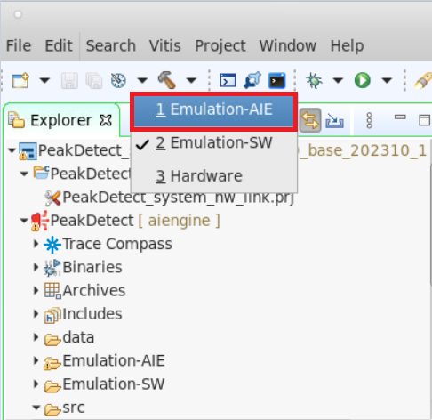                                                      

b) Right-click on the *[aiengine]* domain project and select the **C/C++ Build Settings** , choose **Compiler** and add `-O0` to the Pre Processor Options. This improves the debug visibility.
>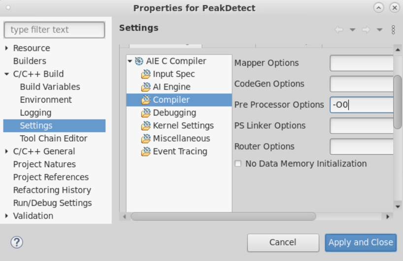 

c) Now right-click on the *[aiengine]* domain project and select **Build** option. Once the build completes, you see the **Compilation Complete** and **Build Finished** messages in console.<br />

d) Right-click on the *[aiengine]* domain project and select **Run As → Launch AIE Emulator** option to start simulation for aiesimulation target. When the simulation completes you see the below output in the console.<br />
>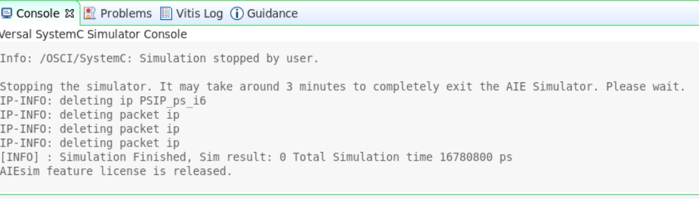     

e) aiesimulator output files from design are located at `${PROJECT}/Emulation-AIE/aiesimulator_output/data`. Verify the output files `${PROJECT}/Emulation-AIE/aiesimulator_output/data/output_upscale.txt` and `${PROJECT}/Emulation-AIE/aiesimulator_output/data/output_data_shuffle.txt` against golden files `${PROJECT}/data/golden_upscale.txt` and `${PROJECT}/data/output_data_shuffle.txt` to ensure that the design's I/O functionalities are correct. Vitis IDE supports compare with feature to compare two files, highlight the files to be compared, then right-click one of highlighted files, and select **compare with** > **each other with transformation** > Click on **Predefined filters** icon(as shown below) > Enable **Remove timestamp** checkmark and click **OK** twice. Selecting **each other with transformation** is required because AI Engine simulation inserts a timestamp for each output data.. For example, Compare `${PROJECT}/data/golden_upscale.txt` and `${PROJECT}/Emulation-AIE/data/output_upscale.txt`.

>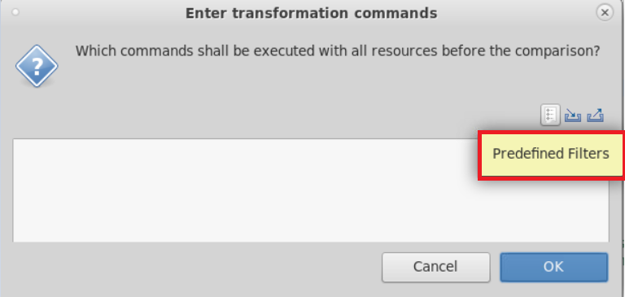

### Section-2
## Debug using printf

The simplest form of tracing is to use a formatted printf() statement in the code for printing debug messages. Visual inspection of intermediate values and addresses can help you understand the progress of program execution. No additional include files are necessary for using printf() other than standard C/C++ includes (stdio.h). You can add printf() statements to your code to be processed during aiesimulation, or hardware emulation, and remove them or comment them out for hardware builds.
 
a) Open the source file `src/kernels/upscale.cc`. Add below lines after `int_t = *IniIter++;`.<br />
```
float * print_ptr = (float*)&in_t;
for(int pp=0;pp<16;pp++)
    printf("Iteration-%d -> Vector-%d -> value = %f\n",i,pp,print_ptr[pp]);
```
**Note** : Adding `printf()` statements to your AI Engine kernel code will increase the compiled size of the AI Engine program. Be careful that the compiled size of your kernel code does not exceed the per-AI Engine processor memory limit of 16 KB. 

b) Re-build the *[aiengine]* project. <br />
c) To enable `printf()` function, it is required to specify `--profile` in run configuration.<br />
>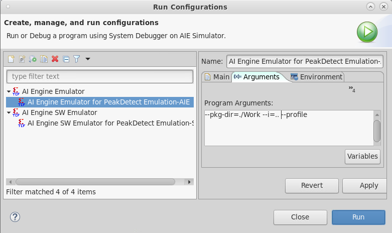 
d) Click **Apply** and **Run**. <br />
e) Observe the `print` statements in the console as shown below.<br />

```
Configuring PL-Interface for graph mygraph...
Set iterations for the core(s) of graph mygraph
Enabling core(s) of graph mygraph 
Waiting for core(s) of graph mygraph to finish execution ...
Iteration-0 -> Vector-0 -> value = 0.000000
Iteration-0 -> Vector-1 -> value = 0.000000
...
...
Iteration-0 -> Vector-13 -> value = 0.000000
Iteration-0 -> Vector-14 -> value = 0.000000
Iteration-0 -> Vector-15 -> value = 0.000000 
Iteration-1 -> Vector-0 -> value = 0.000000
Iteration-1 -> Vector-1 -> value = 3.141500
Iteration-1 -> Vector-2 -> value = 6.283000
```
f) Revert the changes in the source file, to exercise other debug features

### Section-3
## Debug using Vitis IDE debugger
This section walks you through a debug methodology that uses Vitis IDE debugger. You can learn how to invoke the debugger, add breakpoints, view intermediate values e.t.c.
a) After the design is built for aiesimulation target, right-click on the *[aiengine]* domain project and select **Debug As** → **Launch AIE Emulator**. <br />
b) This gets you to the debug mode in Vitis IDE and waits in io_buffer_main.h waiting to acquire the lock to read the input data.<br />
c) Open the source file peak_detect.cc and place the breakpoint at Line-33 by double-clicking on the blue space beside the line number in source editor.<br />

Note : 
1) You should see the stack trace corresponding to the all the kernel functions mapped to a particular tile. For example, in this case the kernel `peak_detect` mapped to the tile [25,0]. So, when you select the `core[25,0]` in the `Debug` window then only the break point you set in the `peak_detect.cc` appears to be active. If not, it appears as red cross sign. Similarly for other tiles and kernel function break points.<br />
2) Some times you may see the yellow warning symbol at the break point you placed. That indicates that the break-point is planted at some other line in the same source code. This is because, the compiler optimized the particular operation and the break-points can only be placed at lines that are not optimized by the compiler.<br />

>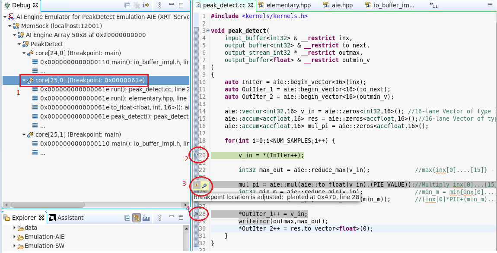

`1` -> Selecting the core[25,0] in the debug window. <br />
`2` -> Indicates the current location of the pointer during the debug (explained more in later steps).<br />
`3` -> Break-point placed at a line that is optimized by compiler.<br />
`4` -> Break point placed correctly which can be used to debug. Note a small blue tick mark.<br />

d) Notice the `resume`,`pause`,`terminate`,`disconnect`,`step-in`,`step-over`,`step-return` options in the task bar after entering the debug mode.<br />
e) You should be able to view variables, breakpoints, registers and set expressions to analyze the design at each iteration during debug session.<br />

>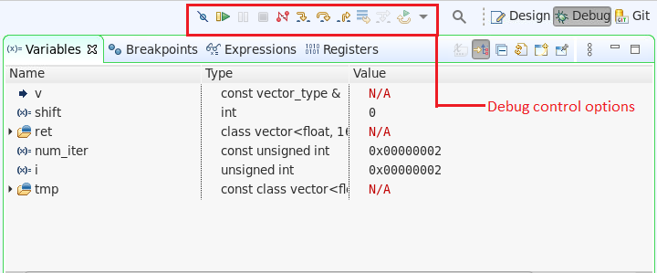

f) After placing the break-point in `peak_detect.cc`, click on `Resume` button. You can see the debugger stops at that particular line. Hovering your mouse on any particular variable, gives you the value at that particular instance of run. For example, the address value of the `InIter` is `0x38000`. <br />

>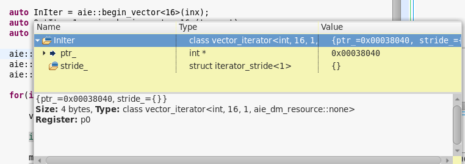

g) Now, use the **Memory** monitor window to get the values at the address location `0x38000`. Click on `+` button and add the address `0x38000` to the memory monitor. You should see the values equal to input values in `data/inx.txt`. Also, based on the location of break-point you should be able to see the similar values in the **variable** view. If that variable is not visible in a particular iteration(due to compiler optimizations) you should still be able to track the value by adding in **Expressions**.<br />

h) Click on the **Expressions** and **Add new expression** -> type **vin**. You should see the initial zeros which matches with the values you see in memory inspector. In each iteration 16 values of 4-bytes(int32) are sent as an input in one iteration.<br />

i) Now, click the resume button again and you should see the next set of 16 values in the `vin` as shown below. <br />

>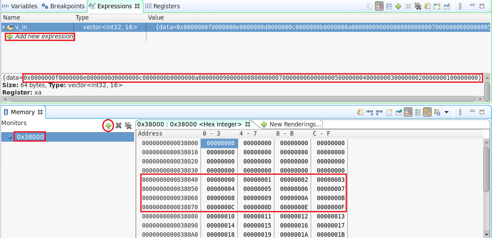

j) Now, hover you mouse on `OutIter_1` and get the memory address and validate the values. As, the `OutIter_1` is just a pass through operation from input to the output, you should see the same values as in `InIter`.

**Exercise step**

1) Click on the **Instructor stepping mode** icon(click twice, bug in Vitis IDE) in the **Debug** window and observe the disassembly view of the kernel code. You should be able to place break-points in this and use `step-into` control to view the intermediate values. <br />
2) Look at the **Register** view and observe the changes in the register values, especially the program counte(PC) at each step.<br /> 

>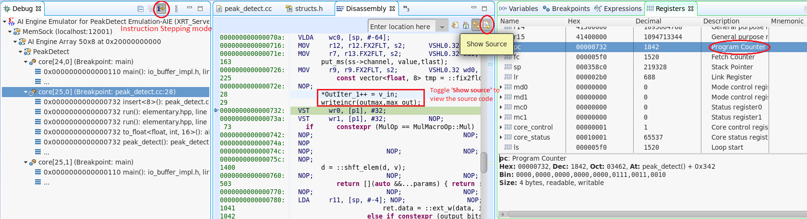

k) Once you are done with the debugging, remove the break point by double-clicking on breakpoint itself and select the Top-level project (PeakDetect in this case) and resume button. You can see all cores goes into `Disabled` state and also the `core(s) are done executing` message in the console. <br />
l) Click on the **Disconnect** button and navigate to the **Design** mode from top right corner.

Note : During the debug process, if any of the kernel status in stack trace is shown as `Lock stall` or `Memory stall`, you may need to consider selecting the other core and click `Resume` manually. This is becuase, in the debug mode it is expected to run each individual core manually.

**Limitations**

1) There are maximum four breakpoints available for each tile. Program under debug is stopped at first line of main(). This does not impact those available breakpoints.<br />
2) Expect a non-sequential execution when stepping through source code.
3) Due to compiler optimization, some variable values are stored in registers. `N/A` is shown in **variables** view for those optimized variables values.

### Section-4
## Enabling profile and trace options
This section walks you through a flow to enable profiling and trace in Vitis IDE. Using this, you should be able to get performance metrics and generate trace data which can be visualized in Vitis Analyzer.

a) Right-click on the *[aiengine]* domain project and select **Run As** → **Run Configurations**.<br />
b) Under **Main** tab, select **AI Engine Emulator** and click on **AI Engine Emulator for PeakDetect Emulation-AIE**.<br />
c) Enable the check box **Generate Trace** and leave the default options **VCD** with file name *foo*.<br />
d) Enable the check box **Generate Profile** and leave the other default options under that.<br />

**Note** : You can also try enablling profile generation for selected tiles.
>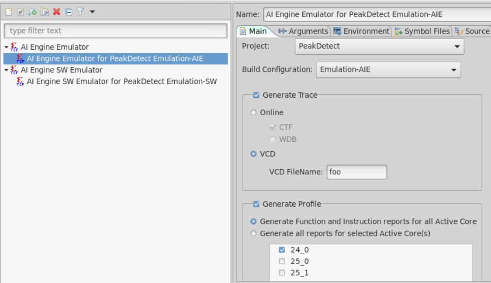

e) Launch the aiesimulation by selecting **Run As → Launch AIE Emulator**.<br />
f) Once the Run completes, right-click on `${PROJECT}/Emulation-AIE/aiesimulator_output/default.aierun_summary` and select **Open with** -> **Vitis Analyzer Report**. This opens the Vitis Analyzer window as shown below.<br />

>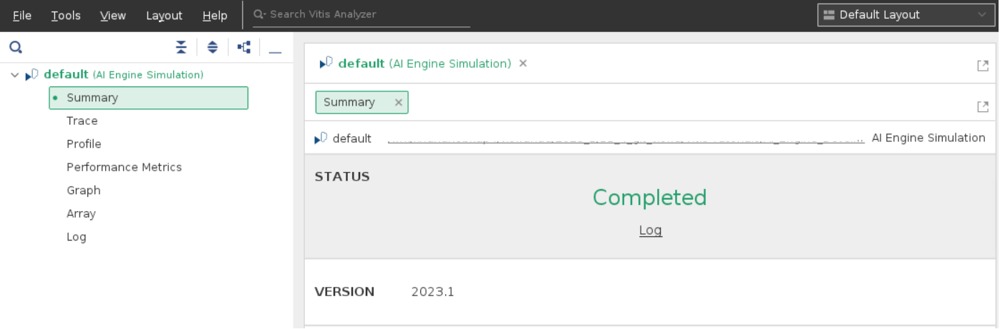

g) Click on the **Profile** -> select the **Summary** and **Profile Details** corresponding to all the tiles ([24,0],[25,0],[25,1]) and observe the cycle count, instruction count and program memory size. More information about the profile details is explained in [Design performance debug](./README.md#Design-performance-debug) section. <br />

h) Click on the **Trace** and observe the trace events corresponding to all the tiles. For example, select the core `[25,0]` corresponding to the kernel `peak_detect`. Expand the kernel function and zoom-in to check the input and output values.<br />
 
>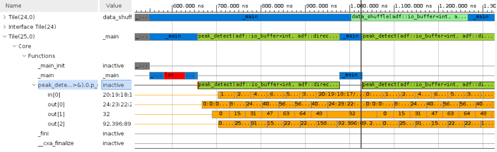
 
**Note** : If the VCD file generated during AI Engine simulation is too large, it takes too much time for Vitis Analyzer to analyze the VCD and open the trace view. Alternatively you can do an online analysis of the VCD when running the AI Engine simulator using the WDB and CTF files. To generate this, you need to choose **Online** option instead of **VCD** in step-(c).<br /> 

 **Exercise step**
 
You should be able to add arguments `--dump-vcd=foo`, `--online -wdb` in the **Run As** -> **Run configurations** -> **Arguments** tab and open the event trace in Vitis Analyzer using the `default.aierun_summary` file. You can open the `.wdb` file directly from **File** -> **%Fill%** in Vitis Analyzer.<br />

 >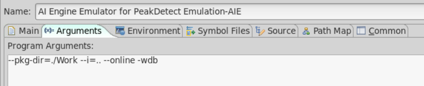
 
### Section-5
## Deadlock detection
 
AI Engine designs can run into simulator hangs. A common cause is insufficient input data for the requested number of graph iterations, mismatch between production and consumption of stream data, cyclic dependency with stream, cascade stream or asynchronous buffers, or wrong order of blocking protocol calls (acquisition of async buffers, read/write from streams).
 
This topic walks you through the practical scenario of deadlock during aiesimulation and different simulator options that helps debugging. 
 
a) Open the `src/kernels/data_shuffle.cc` and comment out the line-24.<br />
b) Compile the design by re-building the *[aiengine]* domain project.<br />
c) Run aiesimulation by right-clicking on the *[aiengine]* domain project and **Run As** → **Launch AIE Emulator**.<br /> and observe the hang.<br />
d) You can wait for few seconds to confirm the hang and click on the icon located in bottom-right corner that shows background operations in progress view, and the kill the simulation process. <br />
>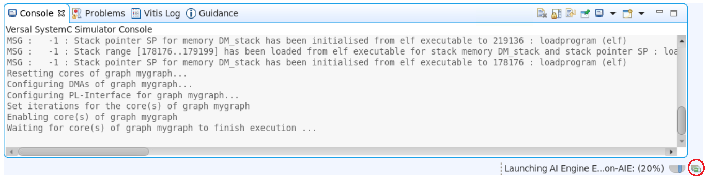
e) AI Engine simulator provides an option to exit the simulation if all active cores in stalled state after the time period(in ns). <br />
f) For example, add `--hang-detect-time=60` in the **Run configurations** -> **Arguments** and re-run the aiesimulation. You can observe the simulation exits smoothly with below information in the console.

```
Enabling core(s) of graph mygraph
[WARNING]: T=580800 ps All Cores in Hang State 
Waiting for core(s) of graph mygraph to finish execution ...
[WARNING]: T=653600 ps All Cores in Hang State 
[WARNING]: T=1846400 ps All Cores in Hang State 
[WARNING]: T=1906400 ps All Cores in Hang State for 60ns
|---------------- Core Stall Status ----------------|
 (24,1) -> Stream stall ->  SS0  at T=1702400 ps
 (25,1) -> Lock stall ->  Lock_West  at T=1748800 ps
 (25,2) -> Lock stall ->  Lock_East  at T=1846400 ps
|---------------------------------------------------|
[CRITICAL WARNING]: Closing Simulator 
Exiting!
 
```
g) Revert the changes in the source file, to exercise other debug features

More information about how to visualize the deadlock using the stream stalls and lock stalls in Vitis Analyzer is explained in [Visualizing deadlock in Vitis Analyzer](./README.md#Visualizing-deadlock-in-Vitis-Analyzer)

 **Note** : 
 1) The hang detect time should be selected approximately based on the complexity of kernels, graph and also on number of iterations the graph is running.
 2) If the simulator option `--simulation-cycle-timeout=cycles` is also specified, care should be taken that the `--hang-detect-time` should be less than the the timeout. Also note that the timeout is in cycles.
 3) To convert the cycles to the `ns` you need to consider the AI Engine clock frequency.
 
### Section-6
## Visualizing deadlock in Vitis Analyzer
 
This topic is continuation of [Deadlock detection](./README.md#Deadlock-detection) section and walks you through the visualization of the deadlock(Lock stall and stream stall) in Vitis Analyzer.
 
a) After simulating with `--hang-detect-time=60` option, open the `default.aierun_summary` file in Vitis Analyzer.<br />
b) Click on the **Trace** and expand `data_shuffle` kernel function. It ran for only 2 iterations and went into stream stall as shown below.<br />
>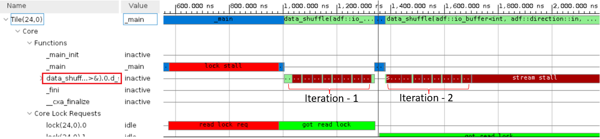 
c) Now, expand the `peak_detect` kernel function and observe the lock stall after 3 iterations as shown below.<br /> 
>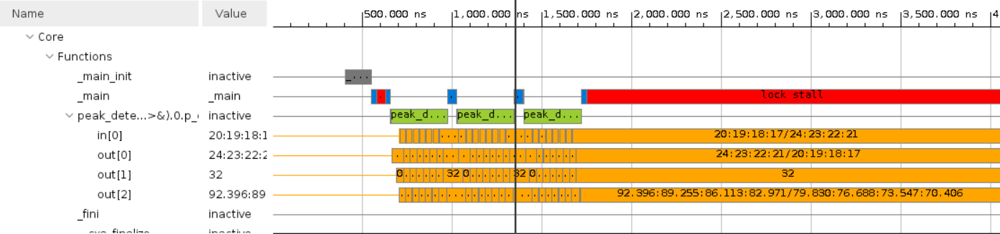 
The kernel `data_shuffle` expects more stream data from the kernel `peak_detect` which it cannot provide. So, the stream port in the `data_shuffle` went into the stream stall and the kernel hangs. It cannot accept more inputs from buffer port which causes the back pressure on `peak_detect` kernel leading to lock stall, which is the potential root-cause for the deadlock.<br />

 
### Section-7
## Debugging memory access violations

Memory access violations occur when a kernel is reading or writing out of bounds of an object or reading uninitialized memory. This can manifest itself in multiple ways like a simulator crash or hang. This debug feature helps to find out of range memory access from each tile during AI Engine emulation run time, however, this option impacts run time performance negatively. The 'out of range' memory access indicates valid address assignment within each section. There could be certain addresses that are not assigned between sections.

The aiesimulator option `--enable-memory-check` helps to find out these out of range memory accesses.

Besides using the simulator option, it is necessary to first identify an invalid address from the design. To do this,

a) In linux terminal where a valid Vitis installation/setup is done, issue the command shown below, to list a specific tile's valid memory addresses and sizes assigned by AI Engine compiler.

For example, to get valid memory addresses of `peak_detect` kernel, 

```
# For Vitis IDE project
cd ${PROJECT_PATH}/Emulation-AIE/Work/aie/25_0/Release
readelf -S 25_0

```

b) The output of the `readelf` command is as shown below. <br />

```
readelf -S 25_0
There are 33 section headers, starting at offset 0x47484:

Section Headers:
  [Nr] Name              Type            Addr     Off    Size   ES Flg Lk Inf Al
  [ 0]                   NULL            00000000 000000 000000 00      0   0  0
  [ 1] .shstrtab         STRTAB          00000000 00268f 00016c 00      0   0  1
  [ 2] .strtab           STRTAB          00000000 0027fb 000872 00      0   0  0
  [ 3] .symtab           SYMTAB          00000000 00306d 000410 10      2  41  0
  [ 4] .bss.DMb.16       NOBITS          00029e00 000294 000200 00  WA  0   0  1
  [ 5] .bss.DMb.16       NOBITS          0002c000 000294 000200 00  WA  0   0  1
  [ 6] .bss.DMb.16       NOBITS          00031e00 000294 000200 00  WA  0   0  1
  [ 7] .data.DMb.4       PROGBITS        000357e0 000294 000020 00  WA  0   0  1
  [ 8] .data.DM_bankA.4  PROGBITS        00035c00 0002b4 000024 00  WA  0   0  1
  [ 9] .bss.DMb.16       NOBITS          00038000 0002d8 000200 00  WA  0   0  1
  [10] .bss.DMb.16       NOBITS          0003a000 0002d8 000200 00  WA  0   0  1
  [11] .bss.DMb.16       NOBITS          0003c000 0002d8 000200 00  WA  0   0  1
  [12] .text             PROGBITS        00000000 0002d8 000102 00  AX  0   0  1
  [13] .text             PROGBITS        00000110 0003da 0002d8 00  AX  0   0  1
  [14] .text             PROGBITS        000003f0 0006b2 0003de 00  AX  0   0  1
  [15] .text             PROGBITS        000007d0 000a90 0000be 00  AX  0   0  1
  [16] .text             PROGBITS        00000890 000b4e 000094 00  AX  0   0  1
  [17] .debug_line       PROGBITS        00000000 00347d 00169b 00      0   0  0
  [18] .debug_info       PROGBITS        00000000 004b18 00a78c 00      0   0  0
  [19] .debug_abbrev     PROGBITS        00000000 00f2a4 000755 00      0   0  0
  [20] .debug_loc        PROGBITS        00000000 00f9f9 005581 00      0   0  0
  [21] .debug_frame      PROGBITS        00000000 014f7a 000d54 00      0   0  0
  [22] .debug_ranges     PROGBITS        00000000 015cce 0017b8 00      0   0  0
  [23] .debug_str        STRTAB          00000000 017486 023195 00      0   0  0
  [24] .debug_pubnames   PROGBITS        00000000 03a61b 00ad75 00      0   0  0
  [25] .debug_pubtypes   PROGBITS        00000000 045390 00208c 00      0   0  0
  [26] .tctmemstrtab     STRTAB          00000000 000be2 000a78 00      0   0  0
  [27] .tctmemtab        LOPROC+0x123456 00000000 04741c 000068 08     26   0  0
  [28] .tctmemtab        LOPROC+0x123467 00000000 00165a 000068 08     26   0  0
  [29] .stackinfo        LOPROC+0x123458 00000000 0016c2 000010 10      0   0  0
  [30] .rtstab           LOPROC+0x123469 00000000 0016d2 0000a9 0d      0   0  0
  [31] .eoltab           LOPROC+0x123470 00000000 00177b 0008f4 0c      0   0  0
  [32] .chesstypean[...] LOPROC+0x123468 00000000 00206f 000620 10      0   0  0
Key to Flags:
  W (write), A (alloc), X (execute), M (merge), S (strings), I (info),
  L (link order), O (extra OS processing required), G (group), T (TLS),
  C (compressed), x (unknown), o (OS specific), E (exclude),
  D (mbind), p (processor specific)
```
Here, Flags `WA` and `AX` indicates, this section will be loaded into tile memory.<br />

c) Add memory read violation to the kernel code by opening `src/kernels/peak_detect.cc` and change the line-26 to `v_in = *(InIter+8500000500)`<br />
e) Build the *[aiengine]* domain project, add `--enable-memory-check` option to the **Run Configurations** and run the aiesimulation.<br />
f) Observe the below messages in console. <br />

```
Waiting for core(s) of graph mygraph to finish execution ...
660 ns [ERROR] tl.aie_logical.aie_xtlm.math_engine.array.tile_25_1.cm.proc: dme_lda_n_out access out of boundary! address = 0x000013d20 prog_cntr = 0x0462
660 ns [ERROR] tl.aie_logical.aie_xtlm.math_engine.array.tile_25_1.cm.proc: dme_ldb_n_out access out of boundary! address = 0x000013d00 prog_cntr = 0x0462

Warning: (W545) sc_stop has already been called
In file: sc_simcontext.cpp:1051
In process: tl.aie_logical.aie_xtlm.math_engine.array.tile_25_1.cm.proc.dm_access_adr_check @ 660 ns
660 ns [ERROR] tl.aie_logical.aie_xtlm.math_engine.array.tile_25_1.cm.proc: dmo_lda_n_out access out of boundary! address = 0x000013d30 prog_cntr = 0x0462
660 ns [ERROR] tl.aie_logical.aie_xtlm.math_engine.array.tile_25_1.cm.proc: dmo_ldb_n_out access out of boundary! address = 0x000013d10 prog_cntr = 0x0462
```

The address `0x000013d30` is out of range from the valid addresses you see from `readelf` command.<br />
g) AI Engine simulation generates `${PROJECT_PATH}/Emulation-AIE/AIESim_Guidance.json` file which can be viewed, when the `${PROJECT_PATH}/Emulation-AIE/aiesimulator_output/default.aierun_summary` file is opened in Vitis Analyzer.<br />

>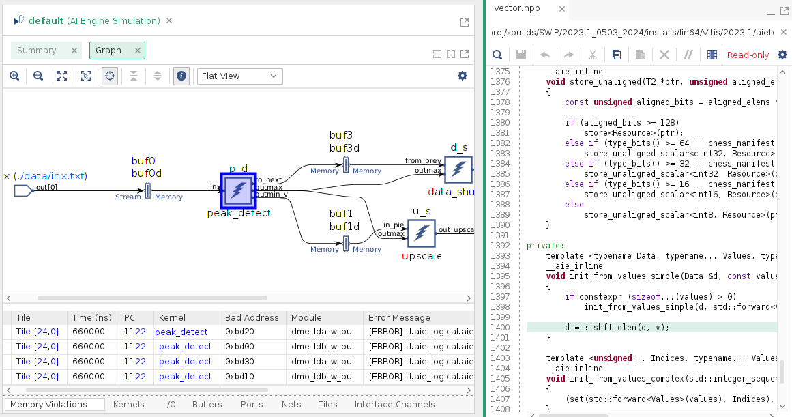 

h) The **PC** column in the **Memory Violations** tab helps redirecting to the kernel function that has memory violation. <br />

**Note** - Currently, if the violation impacts the API e.g. `aie::mul` in this case, clicking on the `PC` may not re-direct user to the exact kernel function. General recommendation in these kind of cases where memory violations cannot be identified is, to use the `x86simulator` with `valgrind` option as explained in [Memory access violation and valgrind support for x86simulator](../X86_Simulation/README.md#memory-access-violation-and-valgrind-support)

i) Revert the changes in source code to exercise other debug features.<br />
 
### Section-8
## Single kernel debug

The AI Engine Pipeline view in the Vitis IDE allows you to correlate instructions executed in a specific clock cycle with the labels in the Disassembly view. The underlying AI Engine pipeline is exposed in debug mode using the pipeline view. The Vitis IDE only supports pipeline view for graphs containing single kernels.

i.e, pipeline view is supported when your graph has AI Engine kernels targeted to single AI Engine tile. There can only be only one single kernel in a graph or multiple kernels mapped to a single tile for the pipeline view to be enabled. So, to get the pipleline view let us do some source code changes to the Peakdetector design as instructed below.

a) Clone the git repository and copy and replace all files from `{GIT_TUTORIAL_PATH}/AIE_Simulation/src/kernels/` with the files in `${PROJECT_PATH}/src/kernels/`. It is recommended to make a copy of the original files before replacing.<br />
**Note**: These source changes are done to accommodate the kernels in a single tile. As the original sources contains stream connections in between two kernels and two stream connections to PLIO, they cannot fit in a single AI Engine tile.

b) Also, replace the `{GIT_TUTORIAL_PATH}/AIE_Simulation/src/graph.h` with the `${PROJECT_PATH}/src/graph.h`.<br />

c) Observe the run-time ratios in the `graph.h`. This change from the original design makes all the kernels to be placed in a single AI Engine tile.<br />

d) Re-build the design and observe the graph view in Vitis Analyzer. Observe the single buffer between two kernels instead of ping-pong buffers. This is because, now two kernels are mapped to a single AI Engine core and ping-pong buffers are not required.<br />

e) To enable the Pipeline view on graphs with a single kernel, select Generate Profile from the Debug configurations. <br />

f) Enter the debug as explained in the [Debug using Vitis IDE debugger](./README.md#Debug-using-Vitis-IDE-debugger) section observe only single core in the **Debug** window. The  **Pipeline View** automatically comes up as soon as IDE enters the debug mode.<br />

>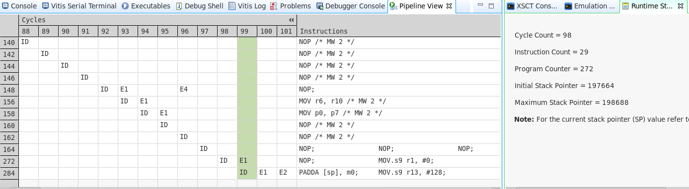 

g) Now, hit the **Step Over** button and observe the changes in pipeline view as well as the **Cycle Count**,**Program Counter** in Runtime statistics.The main advantage of the pipeline view is when you want to observe how many cycles a particular instruction takes. <br />

h) Once debug is done, hit the **Resume** button to complete the simulation or **Terminate** button to exit the debugger smoothly.<br />

i) Revert all the source changes to exercise other debug features.<br />
 
### Section - 9
## Design performance debug

To estimate the design performance during the AI Engine simulation, it is necessary to analyze the profile results carefully. This section walks you through some topics that are most commonly used to assess how your kernel is performing overall.

Refer to the section-4 - [Enabling the profile and trace options](./README.md#Enabling-the-profile-and-trace-options) to understand how to enable profiling in Vitis IDE.

a) After running the AI Engine Simulation, open the `default.aierun_summary` file in Vitis Analyzer and click on the **Profile**.<br />
b) You can click on **Summary** corresponding to each tile in the landing page and observe the cycle count, instruction count and program memory.<br />
c) Now, under the **Function Reports**, click on the **Total Function Time** observe the table at the bottom as shown below for `data_shuffle` kernel function.<br />

>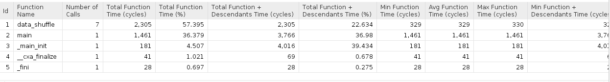

* The `data_shuffle` kernel function took 2,305 cycles for 7 iterations. i.e ~329 cycles for 1 iteration which is the **Avg Function Time**. 
* The `main` function is added by the compiler and different from main() function in the graph.cpp file. This function took 1,461 cycles in total which includes the time to transfer control back and forth between each graph iteration, lock stalls e.t.c.
* The `_main_init` runs once for all graph iterations and it took 181 cycles.
* The `_cxa_finalize` function took 41 cycles to call destructors of global c++ objects.
* The `_fini` function executes the program terminating instructions and it took 28 cycles.

d) If you click on the AI Engine Simulation **Summary**, you can notice the AI Engine Frequency as `1250 MHz` i.e `0.8ns`. i.e `1` cycle = `0.8ns`
Now, the data_shuffle function took `329` cycles for `1` iteration. i.e `329 * 0.8 ~= 264ns`.

e) Let us try to match these values with the trace information. Click on the **Trace** and zoom in to the period of one iteration(between two `main()` function calls as shown below) and add a marker and drag it till end of the kernel function. 
>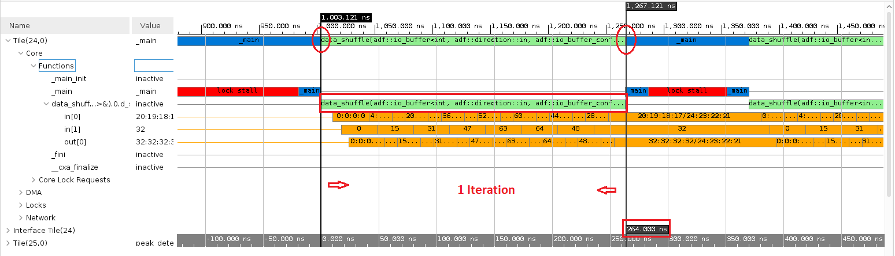

The difference between the starting time & end time of the kernel function for one iteration matches with the 264ns that we see in profiling results.

#### Calculating Graph throughput using Graph output

f) From the trace information in the run_summary in Vitis Analyzer, navigate to the output port for which you want to calculate the througput(`upscale` kernel in this case). Add a marker at the starting of the first output sample as highlighted below. Then click on the `Go to last time` icon and observe the cursor moves to the end of the last iteration. Now, click on the `previous transition` icon to go the starting of the last iteration. Add one more marker at the end and observe the time difference as `2273.600 ns`.

>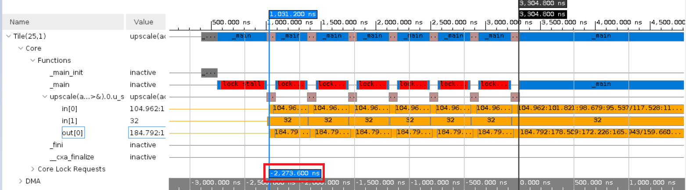

g) No.of bytes transferred is, `128 samples * 4 Bytes * 7 iterations` = `3584` bytes.<br />
h) Throughput = 3584/2273 * e-9 ~= 1.5GBPS.

Theoratically, AI Engine can transfer 4 Bytes per cycle(0.8ns in this case). So, to transfer `3584` bytes of data, it requires 896 cycles(896 * 0.8 = 716ns). So, the theoratical througput is 5GBPS. 


## Support

GitHub issues will be used for tracking requests and bugs. For questions go to [support.xilinx.com](https://support.xilinx.com/).


<p class="sphinxhide" align="center"><sub>Copyright © 2020–2023 Advanced Micro Devices, Inc</sub></p>

<p class="sphinxhide" align="center"><sup><a href="https://www.amd.com/en/corporate/copyright">Terms and Conditions</a></sup></p>
