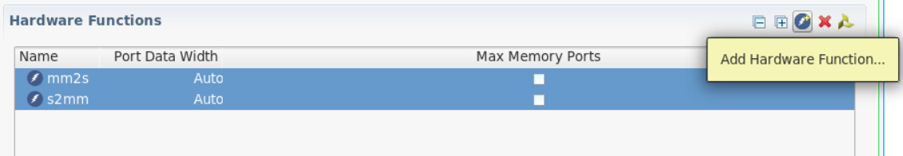

<table class="sphinxhide" width="100%">
 <tr width="100%">
    <td align="center"><h1>AI Engine Development</h1>
    <a href="https://www.xilinx.com/products/design-tools/vitis.html">See Vitis™ Development Environment on xilinx.com</br></a>
    <a href="https://www.xilinx.com/products/design-tools/vitis/vitis-ai.html">See Vitis™ AI Development Environment on xilinx.com</a>
    </td>
 </tr>
</table>

# Porting command-line project to Vitis IDE project

This section walks you through the flow of porting your command-line project to the Vitis IDE project. One advantage of porting the design from command-line to the IDE project is to use the debug capabilities of the GUI based project both at AI Engine level as well as at system level.

* Before beginning this section of tutorial, iIt is expected that you have run the steps to set the environment variables as described in [Introduction](./README.md#Introduction). <br />
* Clone the GIT repository and navigate to the `09-debug-walkthrough` tutorial directory. <br />

## Creating the application project

1. Open the Vitis IDE tool by typing `vitis` in the console and set the workspace and the IDE opens with `Welcome` page.<br />
2. Select the **Create Application Project** and click **Next**.<br />
3. Select the `xilinx_vck190_base_20xxx0_1` platform from the list of platforms and click **Next**.<br />
4. Enter the Application project as `PeakDetect` and click **Next**.<br />
5. Leave the domain as `aiengine` and click **Next**.<br />
6. Select the **Empty Application** and **Finish**. <br />
7. The Application project gets created as shown below.<br />

>

## Preparing AI Engine domain project

8. Expand the `PeakDetect` AI Engine domain project and right-click on `src` directory and choose **Import Source**.<br />
9. Browse to the `cmd_src/aie/` directory and tick the `/aie` on left side, that enables `graph.h`,`graph.cpp` files along with the kernel sources in `kernels/ directory.<br />
>
10. Click **Finish** and observe the sources added to the `PeakDetect` AI Engine domain project.<br />
11. Now add input stimulus. Right-click on the `data/` directory -> **Import sources** -> browse to `cmd_src/data` directory and choose the `inx.txt`.<br />
12. Right-click on the AI Engine domain project and select the **C++ Build settings**. Navigate to the **Input Spec** and add `../src/kernels` in the include paths.<br />
>
13. You can click on `No` in the dialog box that opens. Double-click on the **PeakDetect.prj** file under the AI Engine domain project and click on `Click to select Top-level File`. Expand the `PeakDetect/src/` and select the `graph.cpp` file. Click **Ok**.<br />

The AI Enigne domain project is ready to build.<br />


**Note** : When you change the build target from `Emulation-AIE`(default) to `Emulation-SW` make sure to repeat the step-12.

## Adding PL kernels

In this step, you will add the PL kernels `s2mm` and `mm2s`.<br />

14) To add the PL kernels, right-click on the **PeakDetect_system** project and select **Add Hw kernel Project**.<br />
15) Name the **Hw kernel project name** as **PeakDetect_PL** click **Finish**.<br />
16) Observe the **PeakDetect_PL** gets added to the system project. <br />
17) Right-click on the **PeakDetect_PL** -> **src** and select **Import sources**. Browse to `cmd_src/pl_kernels/` and select **Open**.<br />
18) Select both `mm2s.cpp` and `s2mm.cpp`. Hit **Finish** button.<br />
19) Double click on the **PeakDetect_PL** -> **PeakDetect_PL.prj** and in the project settings, select the **Add Hardware Function**. <br />
20) Choose **mm2s** and **s2mm** functions and click **OK**. Observe the hardware function gets added as shown below.<br />
>

## Prepare the Hw-link project

21) Double click on the **PeakDetect_system_hw_link** -> **PeakDetect_system_hw_link.prj** and change the number of compute units for `s2mm` as `2` by double-clicking and editing the value. This is because, for the design, there is 1 input PLIO port and 2 output PLIO ports.<br />
>
22) Next step is to specify the `system.cfg` file that contains the connections between PL and AI Engine kernels. To do this, right-click on the `binary_container_1` and select **Edit V++ Options** as shown below.

>

Add the v++ command line option `--config ../system.cfg` as shown below and click **Apply and Close**.

>

23) right-click on the **PeakDetect_system_hw_link** and select **Import sources**.
24) Browse to `cmd_src` directory and choose `system.cfg` file. In the **Into folder** field, browse to hw_link project. 
25) Click **Finish**.

25) While creating a HW-link project, Vitis IDE tool by default creates binary_container_1-link.cfg file under `{$PROJECT}/{BUILD_TARGET}/` that contains the connectivity as shown below.

```
[connectivity]
nk=mm2s:1:mm2s_1
nk=s2mm:2:s2mm_1.s2mm_2
```
To port a command line project to a Vitis IDE environment, please make sure to remove above connectivity statements that starts with `nk` in your `system.cfg` file.
Also make sure the compute unit names in `system.cfg` file matches with the names mentioned in `connectivity`. To do this follow below steps.

26) Double-click on the `system.cfg` file, modify the `sc=mm2s.s:ai_engine_0.inx` to `sc=mm2s_1.s:ai_engine_0.inx`.

## Host Application project

27) To add the host application project, right-click on the **PeakDetect_system** project and select **Add Application Project**.<br />
28) Enter the **Application project name** as **PeakDetect_host** and leave the target processor selected as `psv-cortexa72 SMP`.<br />
29) In the **Application settings** add `sysroot path`,`Root FS` and `Kernel Image` by clicking on **Browse** in each section and click **Next**.<br />
30) Select **Empty Application** in the Template selection window and click **Finish**.<br />
31) Now import sources by right-clicking on the **PeakDetect_host** -> **src** and browse to the `cmd_src/sw/` directory and choose files `host.cpp`,`data.h`.<br />
32) Click **Finish**.<br />
33) Now, right-click on the **PeakDetect_host** and select **C++ build settings** and add linker option as shown below.<br />

>
34) Click **Apply and Close**.<br />

**Note** : When you change the build target from `Emulation-SW`(default) to `Emulation-HW` or `Hardware`, make sure to repeat the step-33.

## System Project settings

35) Double-click on **PeakDetect_system** -> **PeakDetect_system.sprj** and set the `sysroot`,`Root FS` and `Kernel Image`  as shown below. Also set the package options.

>

As the AI Engine graph is being loaded by the host PS application, we can defer the running of the graph after the graph has been loaded using the `xrt::graph` API. By default, the AMD platform management controller (PMC) loads and runs the graph. However the v++ `--package.defer_aie_run` option will let you defer the graph run until after the graph has been loaded using the `xrt::graph` API.

**Note** : When you change the build target from `Emulation-SW`(default) to `Emulation-HW` or `Hardware`, make sure to repeat the step-35.

This creates the system project which can be used to build and run for all the targets.

## Support

GitHub issues will be used for tracking requests and bugs. For questions go to [support.xilinx.com](https://support.xilinx.com/).


<p class="sphinxhide" align="center"><sub>Copyright © 2020–2023 Advanced Micro Devices, Inc</sub></p>

<p class="sphinxhide" align="center"><sup><a href="https://www.amd.com/en/corporate/copyright">Terms and Conditions</a></sup></p>
