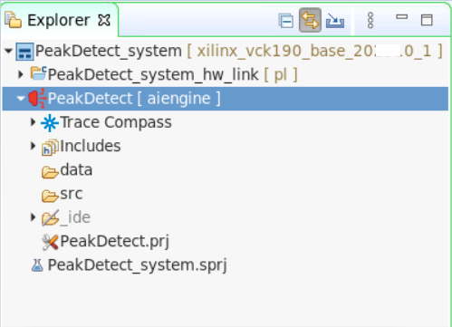
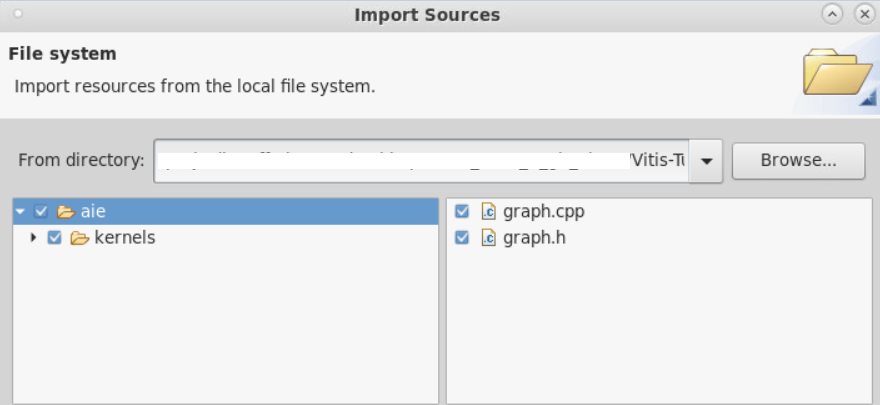
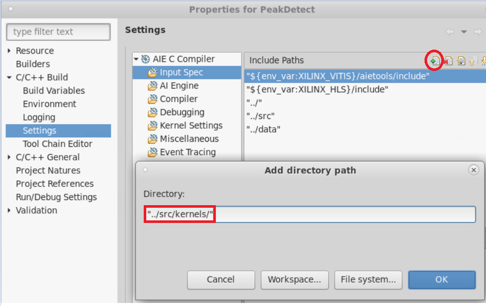
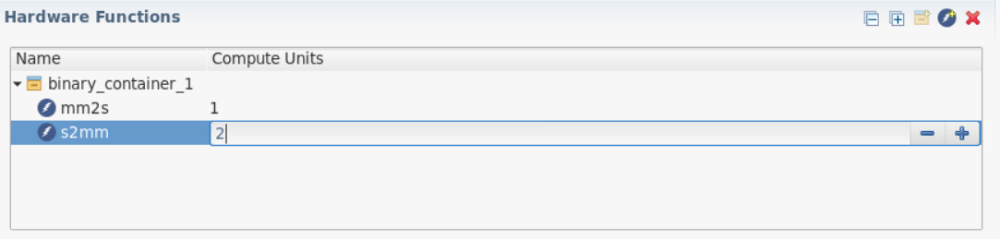
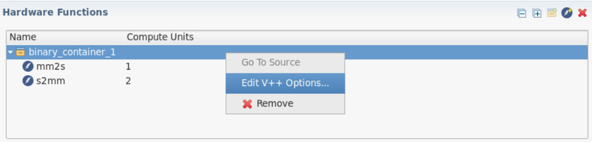
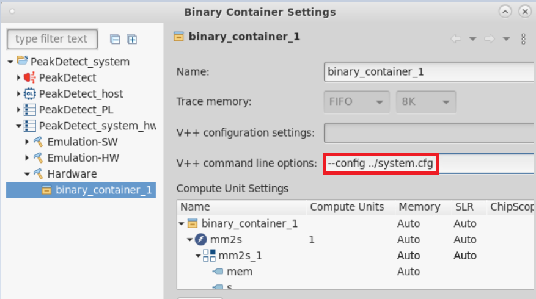
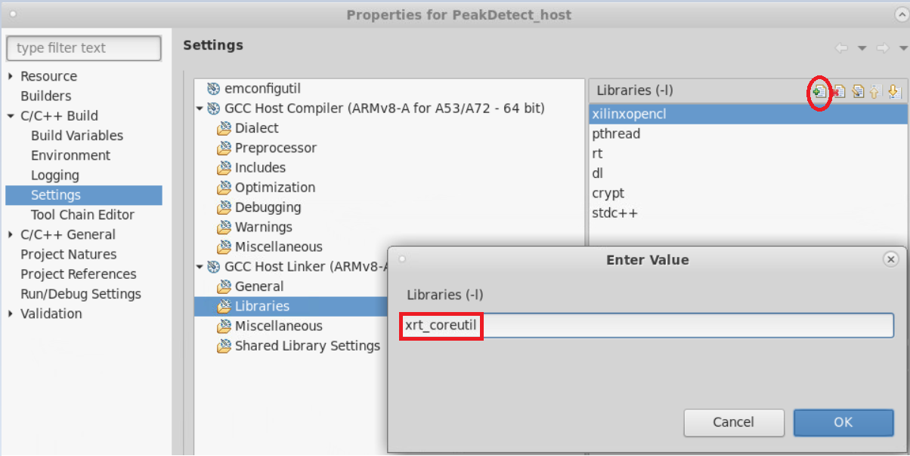
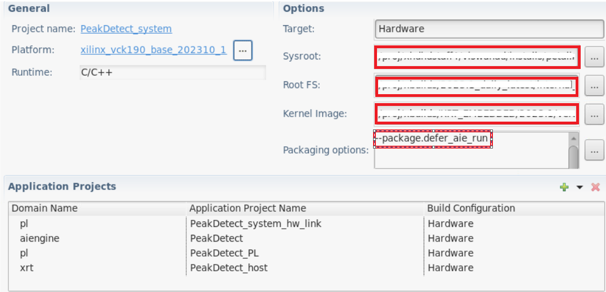

<table class="sphinxhide" width="100%">
 <tr width="100%">
    <td align="center"><h1>AI Engine Development</h1>
    <a href="https://www.xilinx.com/products/design-tools/vitis.html">See Vitis™ Development Environment on xilinx.com</br></a>
    <a href="https://www.xilinx.com/products/design-tools/vitis/vitis-ai.html">See Vitis™ AI Development Environment on xilinx.com</a>
    </td>
 </tr>
</table>

# Porting a Command Line Project to the Vitis IDE Project

This section walks you through the flow of porting your command line project to the Vitis IDE project. One advantage of porting the design from command line to the IDE project is to use the debug capabilities of the GUI-based project both at an AI Engine level and at a system level.

* Before beginning this section of tutorial, it is expected that you have run the steps to set the environment variables as described in [Introduction](./README.md#Introduction).
* Clone the GIT repository, and navigate to the `09-debug-walkthrough` tutorial directory.

## Creating the Application Project

1. Open the Vitis IDE tool by typing `vitis` in the console, set the workspace, and the IDE opens with `Welcome` page.
2. Select the **Create Application Project** and click **Next**.
3. Select the `xilinx_vck190_base_20xxx0_1` platform from the list of platforms, and click **Next**.
4. Enter the Application project as `PeakDetect`, and click **Next**.
5. Leave the domain as `aiengine`, and click **Next**.
6. Select the **Empty Application** and **Finish**. 
7. The Application project gets created as follows.

   

## Preparing the AI Engine Domain Project

1. Expand the `PeakDetect` AI Engine domain project, right-click the `src` directory, and choose **Import Source**.
2. Browse to the `cmd_src/aie/` directory, and tick the `/aie` on left side, that enables `graph.h`,`graph.cpp` files along with the kernel sources in `kernels/` directory.

3. Click **Finish**, and observe the sources added to the `PeakDetect` AI Engine domain project.
4. Now add the input stimulus. Right-click the `data/` directory -> **Import sources** -> browse to `cmd_src/data` directory, and choose the `inx.txt` file.
5. Right-click the AI Engine domain project, and select the **C++ Build settings**. Navigate to the **Input Spec**, and add `../src/kernels` in the include paths.
>
6. You can click **No** in the dialog box that opens. Double-click the **PeakDetect.prj** file under the AI Engine domain project, and click `Click to select Top-level File`. Expand the `PeakDetect/src/`, and select the `graph.cpp` file. Click **OK**.

The AI Engine domain project is ready to build.

>**NOTE:** When you change the build target from `Emulation-AIE`(default) to `Emulation-SW`, make sure to repeat the step 5.

## Adding PL Kernels

In this step, you will add the PL kernels, `s2mm` and `mm2s`.

1. To add the PL kernels, right-click the **PeakDetect_system** project, and select **Add Hw kernel Project**.
2. Name the **Hw kernel project name** as **PeakDetect_PL**, and click **Finish**.
3. Observe the **PeakDetect_PL** gets added to the system project.
4. Right-click the **PeakDetect_PL** -> **src**, and select **Import sources**. Browse to `cmd_src/pl_kernels/`, and select **Open**.
5. Select both `mm2s.cpp` and `s2mm.cpp`. Click the **Finish** button.
6. Double click the **PeakDetect_PL** -> **PeakDetect_PL.prj**, and in the project settings, select the **Add Hardware Function**.
7. Choose the **mm2s** and **s2mm** functions, and click **OK**. Observe the hardware function gets added as follows.


## Prepare the HW-Link Project

1. Double click the **PeakDetect_system_hw_link** -> **PeakDetect_system_hw_link.prj**, and change the number of compute units for `s2mm` as `2` by double-clicking and editing the value. This is because for the design, there is one input PLIO port and two output PLIO ports.

2. Specify the `system.cfg` file that contains the connections between the PL and AI Engine kernels. To do this, right-click the `binary_container_1`, and select **Edit V++ Options**.

   

   Add the v++ command line option `--config ../system.cfg` as shown below and click **Apply and Close**.

   

3. Right-click the **PeakDetect_system_hw_link**, and select **Import sources**.
4. Browse to the `cmd_src` directory, and choose the `system.cfg` file. In the **Into folder** field, browse to the hw_link project.
5. Click **Finish**.
6. While creating a HW-link project, by default, the Vitis IDE tool creates the `binary_container_1-link.cfg` file under `{$PROJECT}/{BUILD_TARGET}/` that contains the connectivity.

   ```
   [connectivity]
   nk=mm2s:1:mm2s_1
   nk=s2mm:2:s2mm_1.s2mm_2
   ```

   To port a command line project to a Vitis IDE environment, make sure to remove the above connectivity statements that starts with `nk` in your `system.cfg` file.
 Also make sure the compute unit names in `system.cfg` file matches with the names mentioned in `connectivity`. To do this, use the following steps.

7. Double-click the `system.cfg` file, and modify the `sc=mm2s.s:ai_engine_0.inx` to `sc=mm2s_1.s:ai_engine_0.inx`.

## Host Application Project

1. To add the host application project, right-click the **PeakDetect_system** project, and select **Add Application Project**.
2. Enter the **Application project name** as **PeakDetect_host**, and leave the target processor selected as `psv-cortexa72 SMP`.
3. In the **Application settings**, add `sysroot path`,`Root FS` and `Kernel Image` by clicking  **Browse** in each section, and click **Next**.
4. Select **Empty Application** in the Template selection window, and click **Finish**.
5. Now import sources by right-clicking the **PeakDetect_host** -> **src**, browse to the `cmd_src/sw/` directory, and choose the files `host.cpp` and `data.h`.
6. Click **Finish**.
7. Now, right-click the **PeakDetect_host**, select **C++ build settings**, and add linker option

8. Click **Apply and Close**.

   >**NOTE:** When you change the build target from `Emulation-SW`(default) to `Emulation-HW` or `Hardware`, make sure to repeat step 7.

## System Project Settings

1. Double-click **PeakDetect_system** -> **PeakDetect_system.sprj**, and set the `sysroot`,`Root FS`, and `Kernel Image`. Also set the package options.

   

   As the AI Engine graph is being loaded by the host PS application, we can defer the running of the graph after the graph has been loaded using the `xrt::graph` API. By default, the AMD platform management controller (PMC) loads and runs the graph. However the v++ `--package.defer_aie_run` option will let you defer the graph run until after the graph has been loaded using the `xrt::graph` API.

   >**NOTE:** When you change the build target from `Emulation-SW`(default) to `Emulation-HW` or `Hardware`, make sure to repeat the step-35.

   This creates the system project which can be used to build and run for all the targets.

## Support

GitHub issues will be used for tracking requests and bugs. For questions, go to [support.xilinx.com](https://support.xilinx.com/).

<p class="sphinxhide" align="center"><sub>Copyright © 2020–2023 Advanced Micro Devices, Inc</sub></p>

<p class="sphinxhide" align="center"><sup><a href="https://www.amd.com/en/corporate/copyright">Terms and Conditions</a></sup></p>
