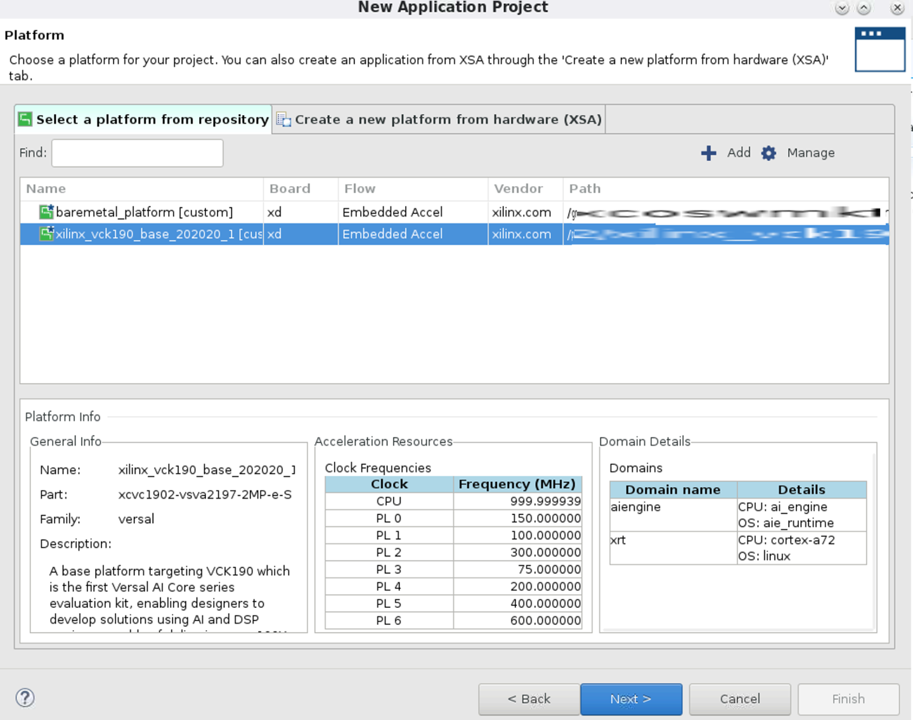
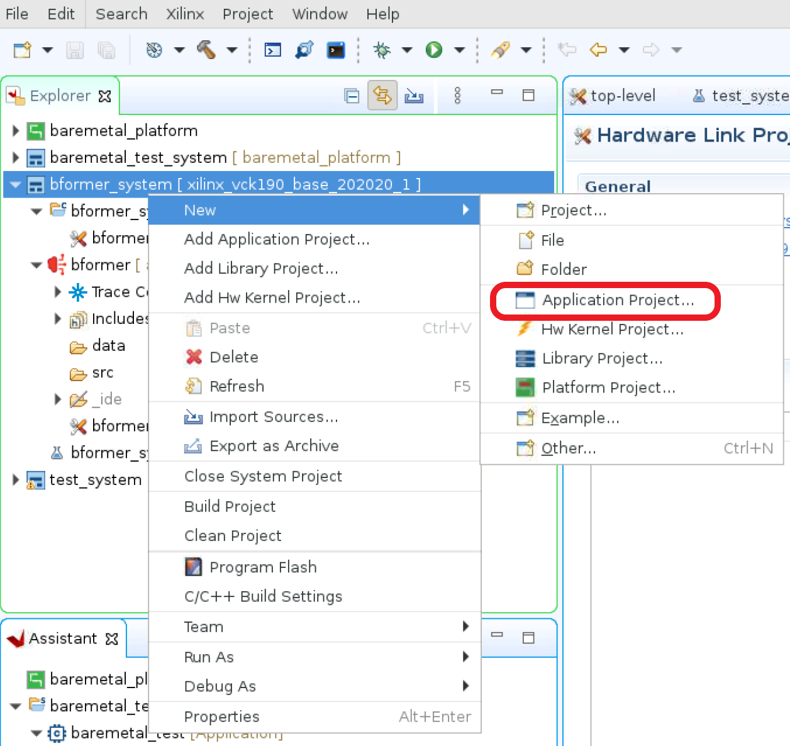
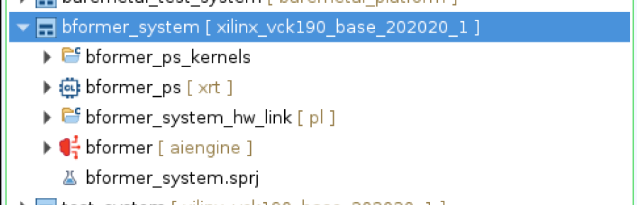

<table class="sphinxhide" width="100%">
 <tr>
   <td align="center"><h1>AI Engine Debug Walkthrough Tutorial - From Simulation to Hardware</h1>
   </td>
 </tr>
 <tr>
 <td align="center"><h2>Migrate Command-Line Based Projects to Vitis IDE</h1>
 </td>
 </tr>
</table>

This section documents the necessary steps to migrate command-line based projects to Vitis™ IDE.

[Step 1 Create project](#Step-1-Create-project)

[Step 2 Import project source code](#Step-2-Import-project-source-code)

[Step 3 Configure project](#Step-3-Configure-project)

[Step 4 Configure system project in packaging options](#Step-4-Configure-system-project-in-packaging-options)

## Step 1: Create project
1. Launch Vitis IDE by issuing the command, `vitis`.
2. Create a project as illustrated by the following images.

3. After the previously listed steps are completed, the created system project is expected to have AI Engine and hardware link sub-projects, as illustrated in the following image.

4. Then you need to create PS and PL sub-projects under the system project.

5. Fill in sysroot path, root FS, and kernel image information for PS application.

6. Select **Empty Application** under Acceleration templates with PL and AIE accelerators" for PS sub-project.

After the previously listed steps are completed, you should have AI Engine, PS, PL and hardware link sub-projects under system project.

## Step 2: Import project source code
1. Import the source code for AI Engine sub-projects.

2. Continue to import data for the AI Engine sub-project, source code for PS, PL, and hardware link sub-projects.

**Note:** If the PS sub-project requires the `defer-aie-run` option in packaging, you must import `aie_control_xrt.cpp` in the PS sub-project.

## Step 3: Configure project

### Step 3.1: Configure AI Engine sub-project
1. Configure top level graph.

### Step 3.2: Configure hardware link
1. Configure the hardware link with the `v++` option
 `nk=kernel:1:kernel_n` line from the `system.cfg` file. This is because the Vitis IDE relies on the previous step to determine the number of instances for each PL kernel. Redundant configurations of the number of kernels in `system.cfg` results in compilation errors.

3. Configure the PS application link libraries.

## Step 4: Configure system project in packaging options

` is required, invoke `graph.run()` and `graph.end()` from PS, then use the `--package.defer_aie_run` option. 

2. If data files need to be packaged to the sd_card, then use the `--package.sd_dir ${PROJECT_PATH}/data` option.

# Support

GitHub issues will be used for tracking requests and bugs. For questions go to [support.xilinx.com](https://support.xilinx.com/).

# License

Licensed under the Apache License, Version 2.0 (the "License");
you may not use this file except in compliance with the License.
You may obtain a copy of the License at

    http://www.apache.org/licenses/LICENSE-2.0

Unless required by applicable law or agreed to in writing, software
distributed under the License is distributed on an "AS IS" BASIS,
WITHOUT WARRANTIES OR CONDITIONS OF ANY KIND, either express or implied.
See the License for the specific language governing permissions and
limitations under the License.

XD005 | &copy; Copyright 2021-2022 Xilinx, Inc.

