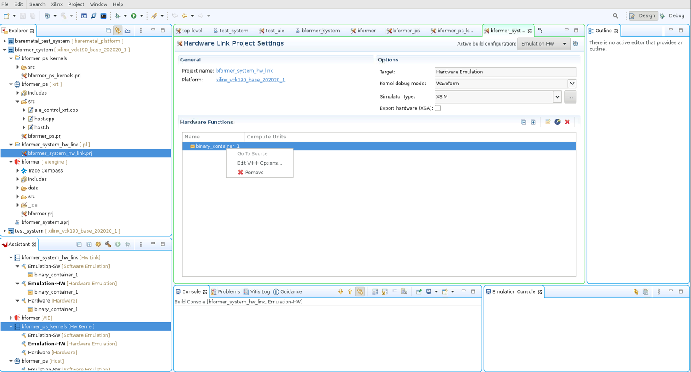
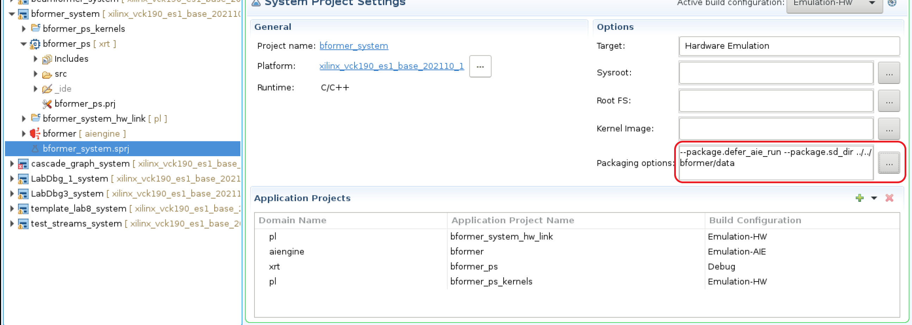

<table class="sphinxhide" width="100%">
 <tr>
   <td align="center"><h1>AI Engine Debug Walkthrough Tutorial - From Simulation to Hardware</h1>
   </td>
 </tr>
 <tr>
 <td align="center"><h2>Migrate Command-Line Based Projects to Vitis IDE</h1>
 </td>
 </tr>
</table>

This section documents the necessary steps to migrate command-line based projects to Vitis™ IDE.

[Step 1 Create the Project](#step-1-create-the-project)

[Step 2 Import the Project Source Code](#step-2-import-the-project-source-code)

[Step 3 Configure the Project](#step-3-configure-the-project)

[Step 4 Configure the System Project in Packaging Options](#step-4-configure-the-system-project-in-packaging-options)

## Step 1: Create the Project

1. Launch the Vitis IDE by issuing the command, `vitis`.
2. Create a project as illustrated by the following images.

3. After the previously listed steps are completed, the created system project is expected to have the AI Engine and hardware link sub-projects, as illustrated in the following image.

    

4. Then you need to create the PS and PL sub-projects under the system project.
    
    

5. Fill in sysroot path, root FS, and kernel image information for the PS application.

    

6. Select **Empty Application** under Acceleration templates with PL and AIE accelerators for the PS sub-project.

    After the previously listed steps are completed, you should have AI Engine, PS, PL, and hardware link sub-projects under system project.

    

## Step 2: Import the Project Source Code

1. Import the source code for the AI Engine sub-projects.

2. Continue to import data for the AI Engine sub-project, source code for PS, PL, and hardware link sub-projects.

>**NOTE:** If the PS sub-project requires the `defer-aie-run` option in packaging, you must import the `aie_control_xrt.cpp` in the PS sub-project.

## Step 3: Configure the Project

### Step 3.1: Configure the AI Engine Sub-project

1. Configure the top-level graph.

2. Configure the include paths.

### Step 3.2: Configure hardware link

1. Configure the hardware link with the `v++` option.

2. Import the `system.cfg` file to the correct project/location.

### Step 3.3: Configure the Hardware Kernels

1. Add hardware functions to project.

2. Configure the number of instances for each PL kernel.

3. Update (comment out) the `nk=kernel:1:kernel_n` line from the `system.cfg` file. This is because the Vitis IDE relies on the previous step to determine the number of instances for each PL kernel. Redundant configurations of the number of kernels in `system.cfg` results in compilation errors.

### Step 3.4: Configure PS Sub-project

1. Right-click the PS sub-project.

2. Configure the PS application to include paths.

3. Configure the PS application link libraries.

## Step 4: Configure the System Project in Packaging Options

>**NOTE:** This configuration is optional and depends on the design.

1. If `graph.init()` is required, invoke `graph.run()` and `graph.end()` from the PS, then use the `--package.defer_aie_run` option.

2. If the data files need to be packaged to the SD card, then use the `--package.sd_dir ${PROJECT_PATH}/data` option.

# Support

GitHub issues will be used for tracking requests and bugs. For questions, go to [support.xilinx.com](https://support.xilinx.com/).

Copyright © 2020–2023 Advanced Micro Devices, Inc

<a href="https://www.amd.com/en/corporate/copyright">Terms and Conditions</a>

