
<table class="sphinxhide" width="100%">
 <tr>
   <td align="center"><h1>AI Engine Debug Walkthrough Tutorial - From Simulation to Hardware</h1>
   </td>
 </tr>
 <tr>
 <td align="center"><h2>AI Engine Debug with Software Emulator</h2>
 </td>
 </tr>
</table>

Software emulation supports fast emulation execution and `printf()` to help verify the kernel's functionalities. You can check the output by examining the esign output files in the `${PROJECT}/Emulation-SW/data` directory.

Hardware constraints, such as heap/stack sizes and program memory size, are not verified in the software emulator.

The following steps outline the procedure:

[1. Prepare Software Emulation Project in Vitis IDE](#1-prepare-software-emulation-project-in-vitis-ide)

[2. Run and Verify Software Emulation in Vitis IDE](#2-run-and-verify-software-emulation-in-vitis-ide)

[3. Launch Debugger to Debug Design](#3-launch-debugger-to-debug-design)

[4. Command Line Project Build and Run with Software Emulator](#4-command-line-project-build-and-run-with-software-emulator)

## 1: Prepare Software Emulation Project in Vitis IDE

### Step 1.1: Select Software Emulation Configuration


### Step 1.2: Build AI Engine Domain Project


The above step is required to generated the `aie_control_xrt.cpp` that works with software emulation.

>**IMPORTANT:** For software emulation to work properly, it is mandatory having the tool-generated `${PROJECT_PATH}/Work/ps/c_rts/aie_control_xrt.cpp` from the software emulation target and import to the PS domain application. For hardware and hardware emulation targets, it is also mandatory to build AI Engine domain project for hardware/hardware emulation target, then import the generated `${PROJECT_PATH}/Work/ps/c_rts/aie_control_xrt.cpp` to the PS domain project to build the system project. The tool-generated `${PROJECT_PATH}/Work/ps/c_rts/aie_control_xrt.cpp` cannot be mix used for different targets.

### Step 1.3: Import the aie_control_xrt.cpp to PS Domain

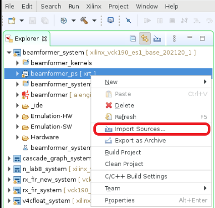
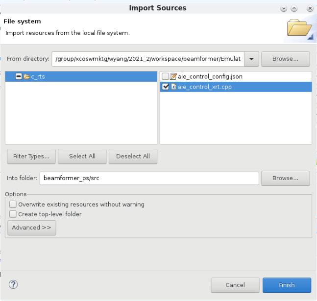

### Step 1.4: Import the host.cpp to the PS Domain

Because the software emulation requires the PS application to synchronize the AIE data to and from the host memory, `xrtBOSync()` calls are required to synchronize them. An updated `host.cpp` is provided from this tutorial. Import from the tutorial's `sw/host.cpp.sw_emu` to `${WORKSPACE}/beamformer_ps/src/host.cpp`.

The updated `host.cpp` contains mandatory changes to make software emulation work.

```bash
...
195     #if defined(__SYNCBO_ENABLE__)
196     xrtBOSync(cin_bohdl[0], XCL_BO_SYNC_BO_TO_DEVICE, cin_size_in_bytes, 0);
197     xrtBOSync(cin_bohdl[1], XCL_BO_SYNC_BO_TO_DEVICE, cin_size_in_bytes, 0);
198     xrtBOSync(cin_bohdl[2], XCL_BO_SYNC_BO_TO_DEVICE, cin_size_in_bytes, 0);
199     xrtBOSync(cin_bohdl[3], XCL_BO_SYNC_BO_TO_DEVICE, cin_size_in_bytes, 0);
200     xrtBOSync(cin_bohdl[4], XCL_BO_SYNC_BO_TO_DEVICE, cin_size_in_bytes, 0);
201     xrtBOSync(cin_bohdl[5], XCL_BO_SYNC_BO_TO_DEVICE, cin_size_in_bytes, 0);
202     xrtBOSync(cin_bohdl[6], XCL_BO_SYNC_BO_TO_DEVICE, cin_size_in_bytes, 0);
203     xrtBOSync(cin_bohdl[7], XCL_BO_SYNC_BO_TO_DEVICE, cin_size_in_bytes, 0);
204
205     xrtBOSync(din_bohdl[0], XCL_BO_SYNC_BO_TO_DEVICE, dlbf_din_size_in_bytes, 0);
206     xrtBOSync(din_bohdl[1], XCL_BO_SYNC_BO_TO_DEVICE, ulbf_din_size_in_bytes, 0);
207     #endif
...
274     #if defined(__SYNCBO_ENABLE__)
275     xrtBOSync(out_bohdl[0], XCL_BO_SYNC_BO_FROM_DEVICE, out_size_in_bytes, 0);
276     xrtBOSync(out_bohdl[1], XCL_BO_SYNC_BO_FROM_DEVICE, out_size_in_bytes, 0);
277     xrtBOSync(out_bohdl[2], XCL_BO_SYNC_BO_FROM_DEVICE, out_size_in_bytes, 0);
278     #endif
...
```

The IDE needs to add the `__SYNCBO_ENABLE__` flag in the build.


### Step 1.5: Build the System Project


## 2: Run and Verify Software Emulation in Vitis IDE

### Step 2.1: Configure the Environment Variables

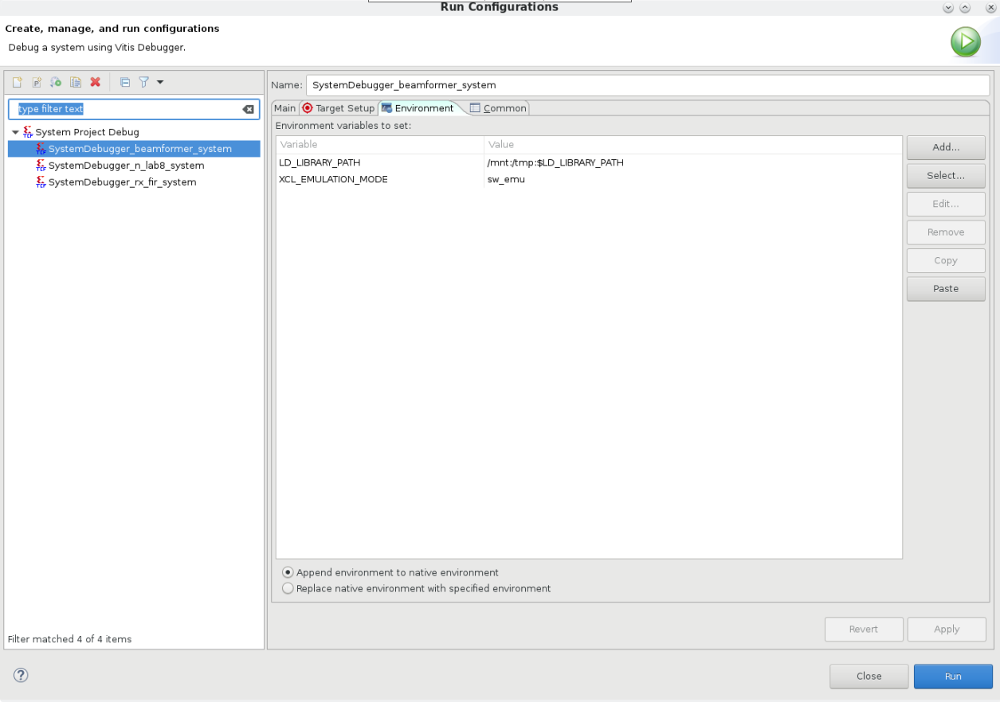
Add environment variables to software emulation run configuration and debug configuration.

```bash
export LD_LIBRARY_PATH=/mnt:/tmp:$LD_LIBRARY_PATH
export XCL_EMULATION_MODE=sw_emu
```

### Step 2.2: Run with Software Emulator

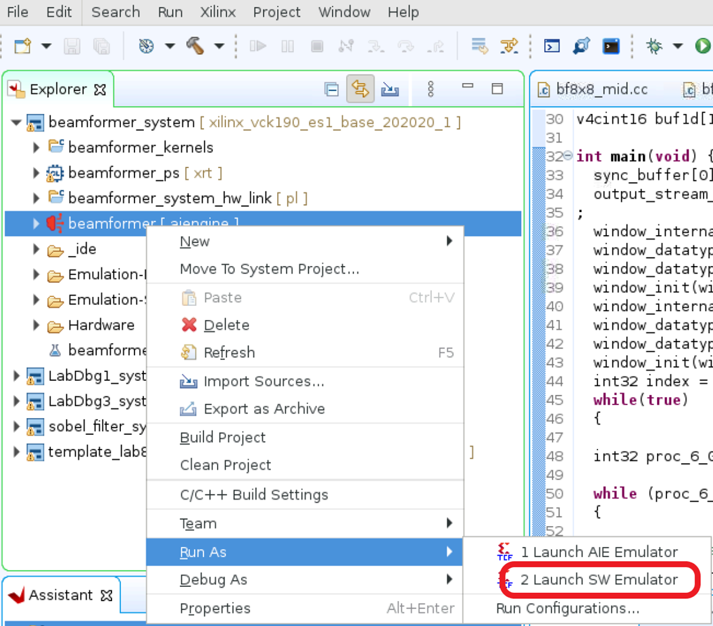

### Step 2.3: Verify the Run Result

The software emulator output files from the design are located at `${PROJECT}/Emulation-SW/data`. Verify the output files `${PROJECT}/Emulation-SW/data/dlbf_out[0-7].txt` and `${PROJECT}/Emulation-SW/data/ulbf_out[0-3].txt` against the golden files `${PROJECT}/data/dlbf_gold[0-7].txt` and `${PROJECT}/data/ulbf_gold[0-3].txt` to ensure that the design's I/O functionalities are correct. Vitis IDE supports the `compare with` feature to compare two files; highlight two files to be compared, then right-click one of the highlighted files, and select `compare with` then `each other`. For example, compare `${PROJECT}/data/ulbf_gold3.txt` and `${PROJECT}/Emulation-SW/data/ulbf_out3.txt`

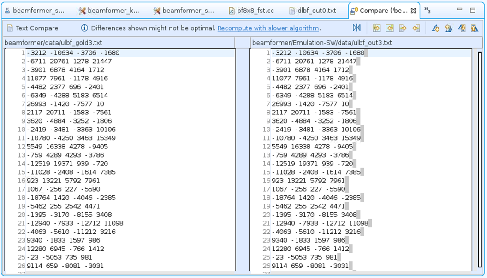

## 3. Launch the Debugger to Debug the Design

### Step 3.1: Launch Software Emulation Debugger

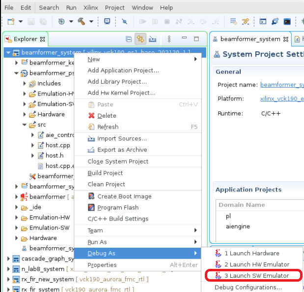

### Step 3.2: Debug with Software Emulator

Click ***Start Emulator and Debug*** to allow the software emulator and debugger to run.
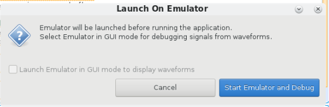

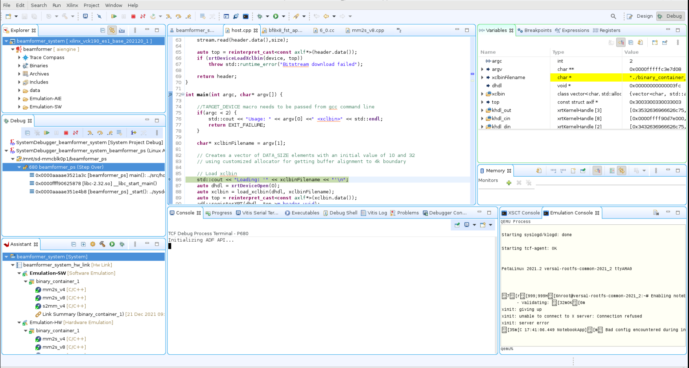

Example of debugging `mm2s_v8.cpp`:
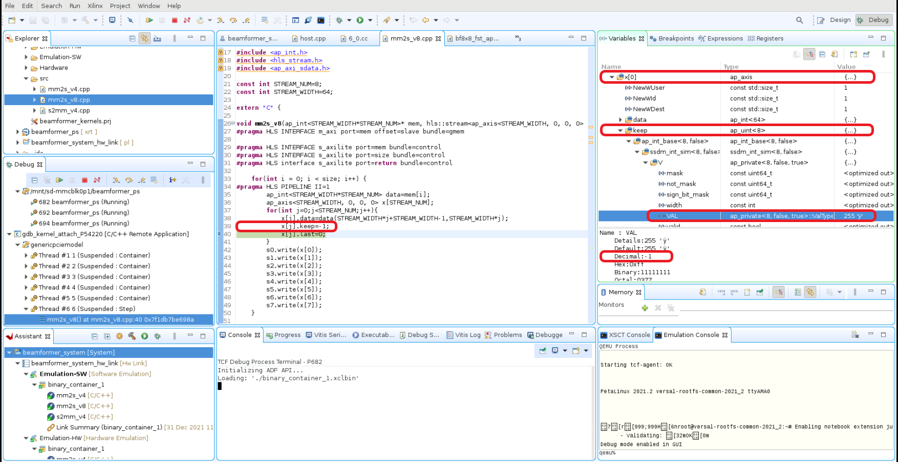

>**NOTE:** Accessing vector variables values from the software emulator are not fully supported.It is recommended you use the `x86simulator` to inspect the vector variables values.
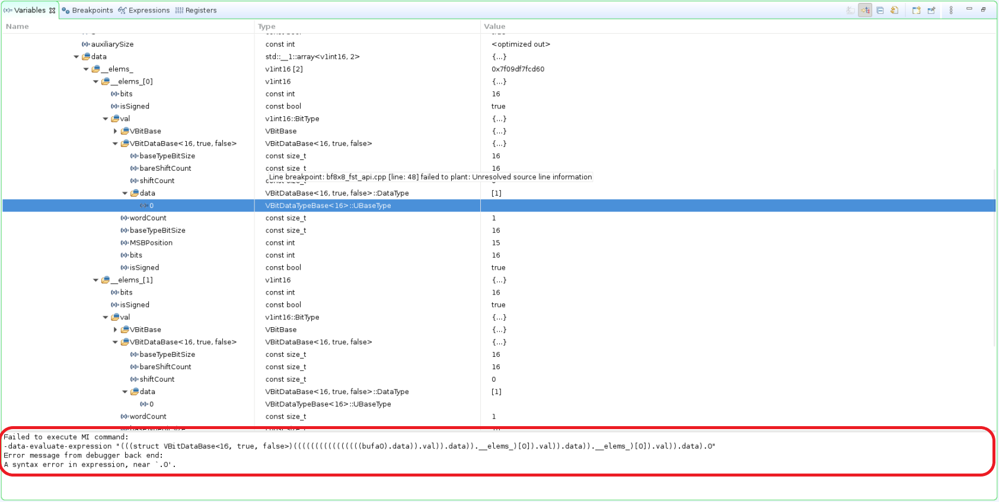

## 4: Command Line Project Build and Run with the Software Emulator

### Step 4.1: Download the Project

Clone the project source from git repository, and unzip the downloaded zip file.

### Step 4.2: Prepare the Makefiles and Source Code

1. Use this tutorial's `Makefile.sw_emu` that configures the right target to build.

    ```bash
    cd ${DOWNLOAD_PATH}/AI_Engine_Development/Feature_Tutorials/09-debug-walkthrough
    cp Makefile.sw_emu Makefile
    ```

2. Use this tutorial's `sw_emu` files `Makefile.sw_emu`, `host.cpp.sw_emu`, and `aie_control_xrt` the cpp `.sw_emu` at the sw directory that has the software emulator-related updates.

    ```bash
    cd sw
    cp Makefile.sw_emu Makefile
    cp host.cpp.sw_emu host.cpp
    cp aie_control_xrt.cpp.sw_emu aie_control_xrt.cpp
    ```

### Step 4.3: Build the Project

```bash
cd ${DOWNLOAD_PATH}/AI_Engine_Development/Feature_Tutorials/09-debug-walkthrough
make
```

### Step 4.4: Run the Project

Execute the generated shell script, `./launch_sw_emu.sh`.

### Step 4.5: Petalinux Boot

Expect to see te Petalinux boots up with Linux prompt to accept Linux commands, and run the PS application.

### Step 4.6: Set Up the Environment Variables

```bash
export LD_LIBRARY_PATH=/mnt:/tmp:$LD_LIBRARY_PATH
export XCL_EMULATION_MODE=sw_emu
```

>**IMPORTANT:** These environment variables are mandatory, or the application run with errors.

### Step 4.7: Run the Application

```bash
cd /run/media/mmcblk0p1
./host.exe a.xclbin
```

Expect to see `TEST PASSED` from theterminal.

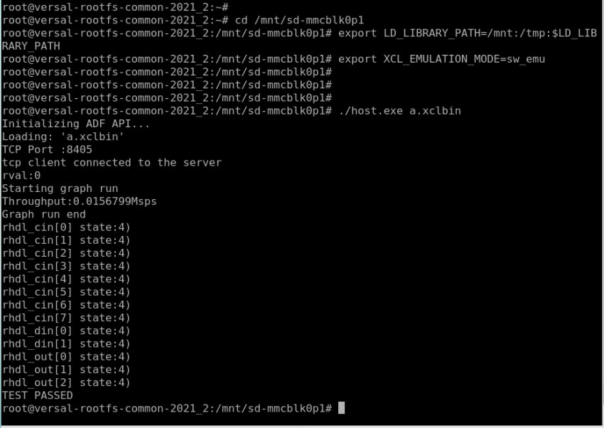

## Limitations

Limitations from `x86simulator` are applicable in the software emulator.

# Support

GitHub issues will be used for tracking requests and bugs. For questions, go to [support.xilinx.com](https://support.xilinx.com/).

<p class="sphinxhide" align="center"><sub>Copyright © 2020–2023 Advanced Micro Devices, Inc</sub></p>

<p class="sphinxhide" align="center"><sup><a href="https://www.amd.com/en/corporate/copyright">Terms and Conditions</a></sup></p>
