<table>
 <tr>
   <td align="center"><h1>AI Engine Debug Walkthrough Tutorial - From Simulation to Hardware</h1>
   </td>
 </tr>
 <tr>
 <td align="center"><h2>AI Engine Debug with AI Engine Emulator</h2>
 </td>
 </tr>
</table>

AI Engine emulator provides the following features:
* Cycle approximate simulation.
* Hardware constraints check such as AI Engine heap/stack/program memory size.
* Functional verification of kernel code via `printf()` and value change dump (VCD) file generation.
* Performance verification of kernel code using VCD file generation and generating profile reports.
* Out of bound memory access checks of kernel code.

The following steps showcase AI Engine Emulator features:

[1. AI Engine Emulator Source Code Debug](#1-AI-Engine-emulator-source-code-debug)
* [AI Engine Emulator Source Code Debug Limitations](#AI-Engine-emulator-source-code-debug-limitations)

[2. AI Engine Emulator Trace and Profile Data Generation](#2-AI-Engine-emulator-trace-and-profile-data-generation)

[3. AI Engine Emulator printf support](#3-AI-Engine-emulator-printf-support)
* [printf Limitations](#printf-limitations)

[4. AI Engine Emulator --enable-memory-check option](#4-AI-Engine-emulator---enable-memory-check-option)

[5. Command-Line Project Source Code Debug with AI Engine emulator](#5-Command-line-project-source-code-debug-with-AI-Engine-emulator)


## 1. AI Engine Emulator Source Code Debug
### Step 1. Select AI Engine Configuration
From the top menu, select **Emulation-AIE** as the current active configuration.


### Step 2. Build with AI Engine Emulator
Right-click on AI Engine project and select **Build Project** to build.

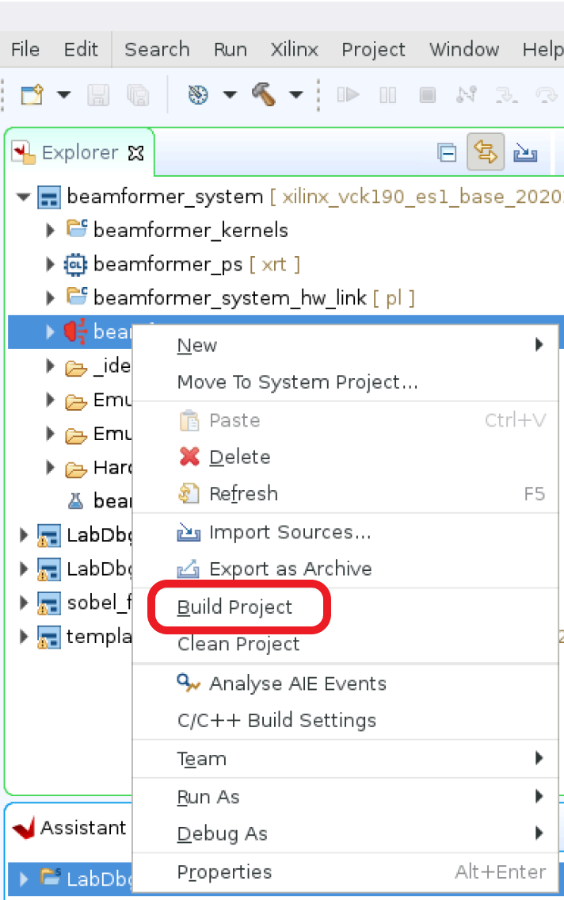

### Step 3. Debug with AI Engine Emulator
Right-click on AI Engine project, select **Debug As** and **Launch AIE Emulator** to debug AI Engine project.

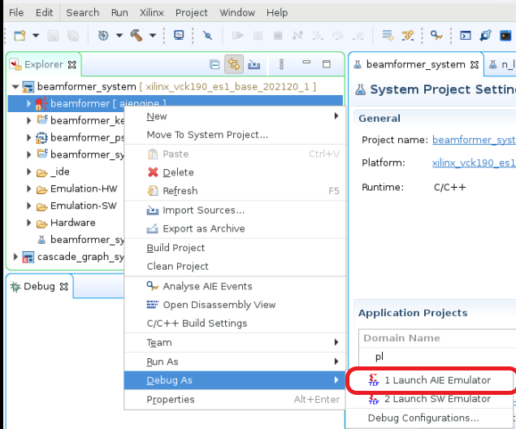

### Step 4. Source Code Debug with AI Engine Emulator
After debugger is launched, the resume, disconnect, step into, step over, and step return buttons can be used to examine source code execution flow. Placing the cursor on each available button pops up information about that button's functionality.


From the source code view, double-click on line number to setup breakpoint. Breakpoint view will show the newly added breakpoint.

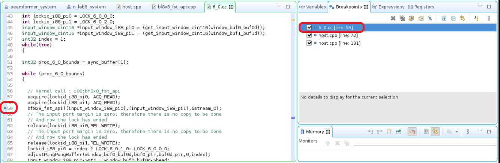

During debug, highlighted areas indicate changes in values since the last step.
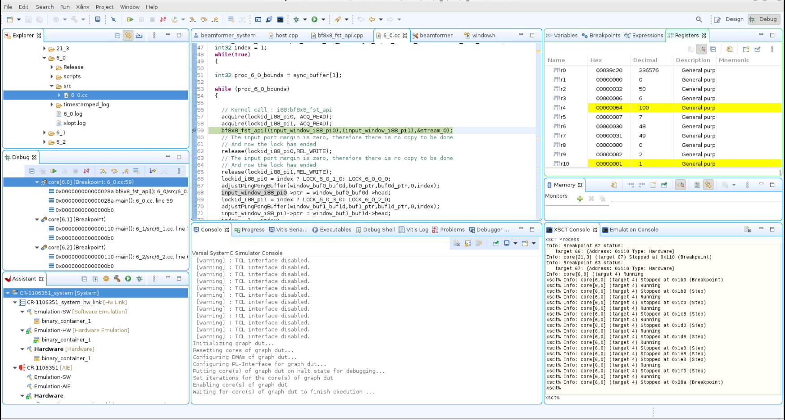

### Step 5. Verify Result
AI Engine emulator output files from the design are located at `${PROJECT}/Emulation-AIE/aiesimulator_output/data`. Verify the output files `${PROJECT}/Emulation-AIE/aiesimulation_output/data/dlbf_out[0-7].txt` and `${PROJECT}/Emulation-AIE/aiesimulation_output/data/ulbf_out[0-3].txt` against golden files `${PROJECT}/data/dlbf_gold[0-7].txt` and `${PROJECT}/data/ulbf_gold[0-3].txt` to ensure that the design's I/O functionalities are correct. Vitis IDE supports the compare with feature to compare two files, highlight the files to be compared, then right-click one of highlighted files, and select `compare with` > `each other with transformation` > `Predefined filters` > `Remove timestamp`.
Selecting `each other with transformation` is required because AI Engine emulation inserts a timestamp for each output data.


## AI Engine emulator source code debug limitations
1. There are maximum four breakpoints available for each tile. Program under debug is stopped at first line of `main()`. This does not impact those available breakpoints.
2. Because the compiler `-O0` option is not supported, non-sequential execution when stepping through source code is expected.
3. If an individual kernel is highlighted, select the resume button to continue execution until next breakpoint or blocked to wait for I/O. If highlight the beamformer design, select resume button to resume all kernels execution until meet each kernel's breakpoint or blocked  waiting for each kernel's I/O operation.
4. Due to compiler optimization, some variables' values are stored in registers. "N/A" is shown in variables view for those optimized variables' values.


## 2. AI Engine Emulator Trace and Profile Data Generation
### Step 1: Configuration Before Launching AI Engine Simulator
Highlight beamformer sub-project, right-click to select **Run As** > **Run configurations...** to enter into a configuration that allows trace and profile selection.


**Note:** Enable VCD generation for event trace and enable profile generation for selected/all tiles.


**Note:** The `--simulation-cycle-timeout` shown in the previous image is OPTIONAL. In case of long run time, this option helps to control execution period so that trace and profile can be generated properly. Clear this option for other tests especially for source code debug to avoid shorter run time.

### Step 2: Launch AI Engine Emulator
After run configuration is completed, right-click on beamformer sub-project to select **Run As** and **Launch AIE Emulator**.
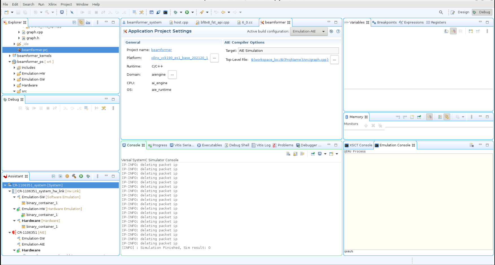
Vitis™ IDE console displays `[Warning] : Sim result: 0` indicates this simulation run is completed.

### Step 3: Launch Vitis Analyzer
Double-click on **${AIE_PROJECT}/Emulation-AIE/aiesimulator_output/default.aierun_summary** to launch Vitis_analyzer for event trace and profile information.
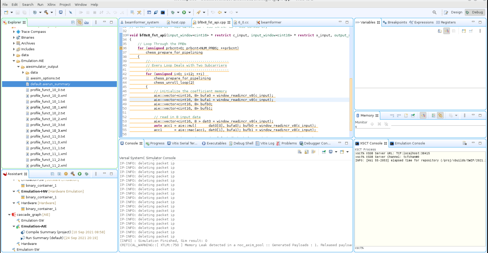

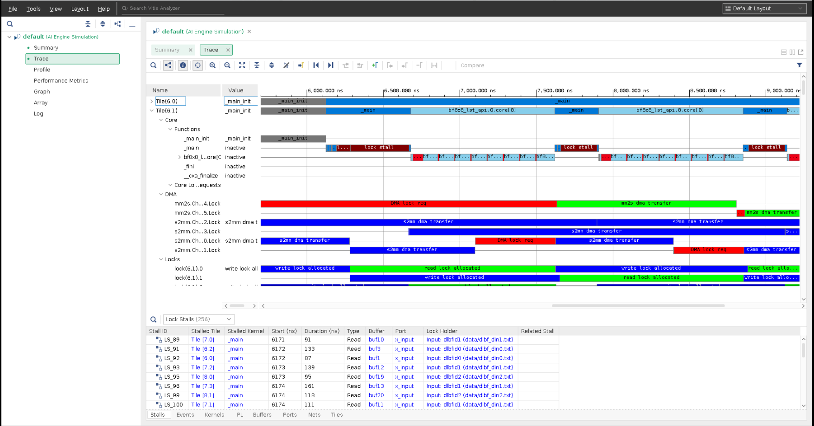
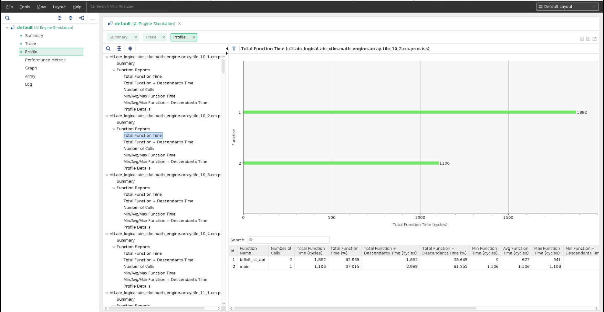

**Note:**
1. Click on **Trace** for generated event trace info. Click on **Profile** for selected AI Engine tiles' profile report files. These events are timing approximately accurate and can be a good reference for how the design runs.
2. The trace view supports data visualization feature that displays input/output data along with time line to help visualize I/O data of a kernel at given time.


## 3. AI Engine Emulator `printf` Support
The simplest form of tracing is to use a formatted `printf()` statement in the code for printing debug messages. Visual inspection of intermediate values and addresses can help you understand the progress of program execution. No additional include files are necessary for using `printf()` other than standard C/C++ includes (`stdio.h`). You can add `printf()` statements to your code to be processed during simulation, or hardware emulation, and remove them or comment them out for hardware builds.


### Step 1. Add `printf` statement in source code
Select `bf8x8_fst_api.cpp` file in Vitis IDE to be edited. Add `printf("prbcnt=%d\n", prbcnt);` statement at line 42 of `bf8x8_fst_api.cpp` file.

**Note:** Adding `printf()` statements to your AI Engine kernel code will increase the compiled size of the AI Engine program. Be careful that the compiled size of your kernel code does not exceed the per-AI Engine processor memory limit of 16 KB.

### Step 2. Build the Project
Highlight the beamformer sub-project, right-click to enable pull-down menu, and select **Build Project** to build the beamformer project.

### Step 3. Enable `printf` in Run Configuration
To enable `printf()` function, it is required to specify `--profile` in run configuration.


### Step 4. Run the Project
Highlight the beamformer sub-project, right-click to enable pull-down menu, and select **Run As** and **Launch AIE Emulator** to run the project in Vitis IDE.

### Step 5. Expected result
Output of `printf()` statements displays on console window.
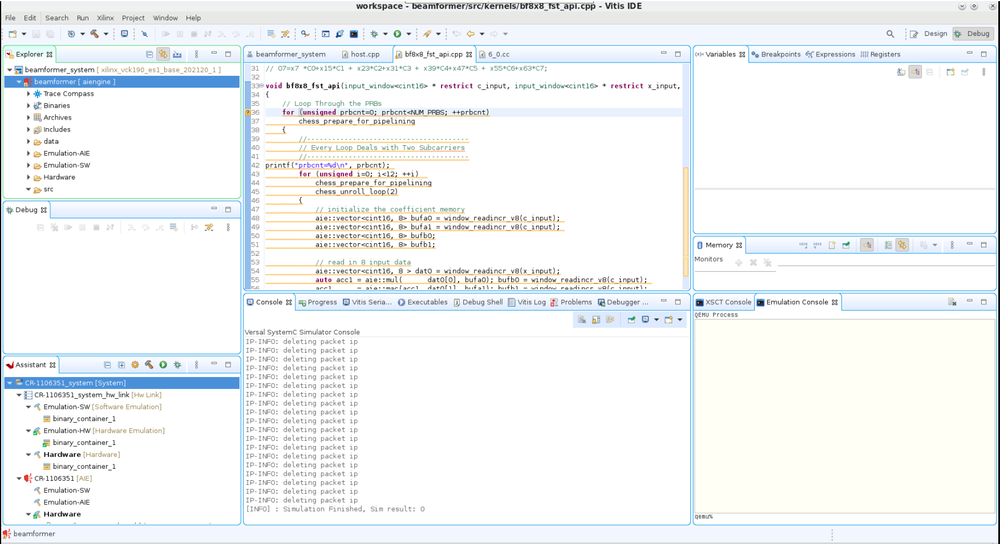

### `printf` Limitations
Adding `printf()` statements increases program memory size. Make sure not to exceed program memory size when using `printf()` statements to debug.


## 4. AI Engine Emulator `--enable-memory-check` Option
This option helps to find out of range memory access from each tile during AI Engine emulation run time, however, this option impacts run time performance negatively.
The 'out of range' memory access indicates valid address assignment within each section. There could be certain addresses that are not assigned between sections. Hence this option is useful to debug the design.

### Step 1. Identify an Invalid Address from Design
From a Linux terminal that points to a valid Vitis IDE installation/setup, issue this command to list a specific tile's valid memory addresses and sizes assigned by AI Engine compiler. Flag "A" indicates this section will be loaded into tile memory.

```bash
# For Vitis IDE project
cd ${PROJECT_PATH}/Emulation-AIE/Work/aie/6_0/Release
# For command line project
cd ${PROJECT_PATH}/Work/aie/6_0/Release
readelf -S 6_0
```
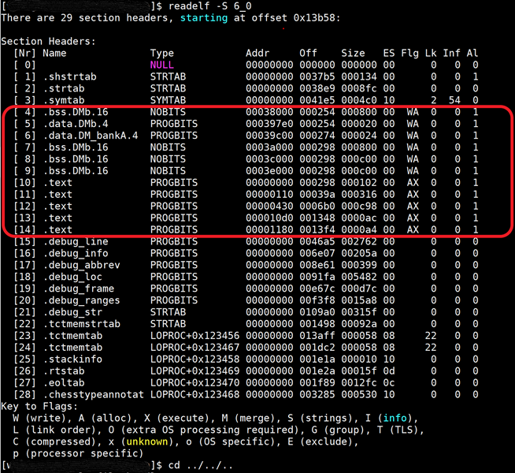

### Step 2. Add access to an invalid memory address
Add these 7 lines at line 35 of **bf8x8_fst_api.cpp** file to access invalid memory address access, for example 0x00039900.
```bash
#if 1
    // demo
//  volatile int *loc = (volatile int *)0xdeadbeef;
    volatile int *loc = (volatile int *)0x00039900;
    int test = *loc;
#endif
```

### Step 3. Build the application
Highlight the beamformer sub-project, right-click to enable pull-down menu, select **Build Project** to build the project.


### Step 4. Add `--enable-memory-check` option in build configuration
Highlight beamformer sub-project, right-click to select **Run As** > **Run configurations...**. Add **--enable-memory-check** option to run configuration.

### Step 5. Run the application
Highlight the beamformer sub-project, right-click to enable pull-down menu, select **Run As** > **Launch AIE Emulator** to run the project in Vitis IDE.

### Step 6. Expected result
Access location at address 0x00039900 that is between sections and is not allowed to access. This triggers the memory check error(s) and displays at Vitis IDE console.

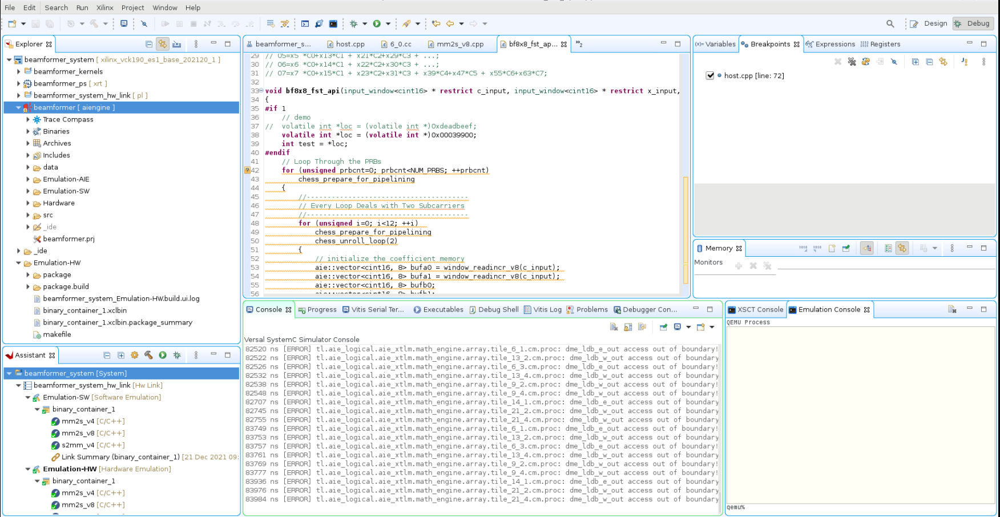
**Note:** The error messages may be rolled out of visible area, scroll up from console window to inspect the expected error messages.

### Step 7. Additional test
For invalid memory access that is out of kernel program memory range, for example 0xdeadbeef, a segfault error will be thrown regardless of whether the `--enable-memory-check` option is enabled/disabled.
Comment out line 38 and uncomment line 37 from the previous source code update. Repeat step 3 and 4 to build and run the updated code.
Expect to see the segfault error from Vitis IDE console.
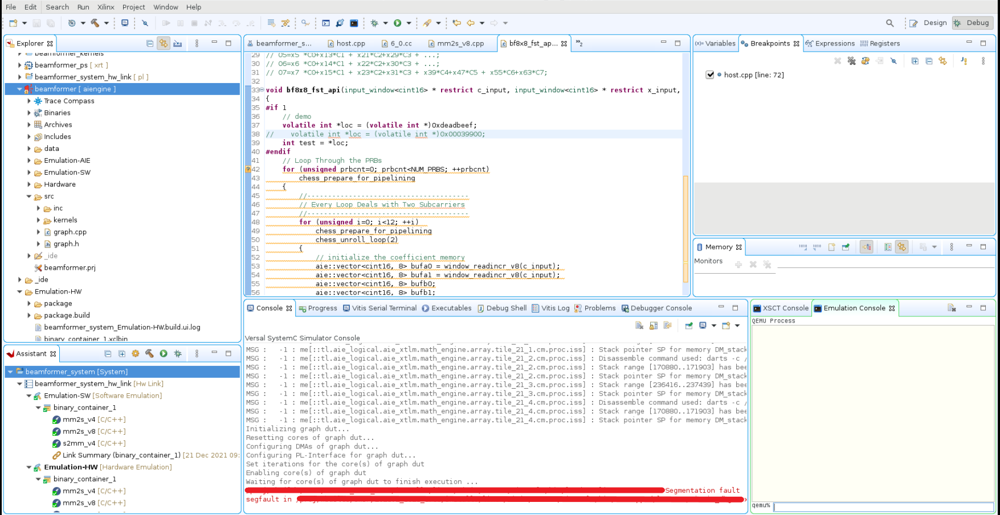

### Step 8. Clean up
Remove those added 7 lines of **bf8x8_fst_api.cpp** file from step 2 to maintain source code sanity.


## 5. Command line project source code debug with AI Engine emulator
Use cases that involve using Vitis IDE functionalities without migrating to Vitis IDE are permitted.

### Step 1. Download the project
Clone the project source from git repository and unzip the zip file.

### Step 2. Build the Command-Line Project with Debug Capabilities
Use this tutorial's `Makefile.emu`  that has the `--package.enable_aie_debug`  option in the packaging step. This option inserts configuration data object (CDO) that generates stop requests for the AI Engine cores, so that they stop at the reset vector. This option is required to add debug capabilities. Issue command `make package_dbg` with this tutorial's `Makefile.emu` to package binaries that can be debugged.

```bash
cp Makefile.emu Makefile
make
make package_dbg
```

**Note:**
1. The packaged binaries that have debug capabilities require to run with the debugger. Run without the debugger will see the execution hang due to the wait for debugger invocation. Issue command `make package` to package binaries back without debugging capabilities.
2. Beamformer design takes about 60 minutes or more to build. It depends on the build computer's spec.

### Step 3. Launch Hardware Emulator and Boot Petalinux
There are two Linux terminals required. Both terminals are required to point to a valid Vitis IDE installation/setup area to use Vitis software platform.
From terminal 1, setup tool path properly and issue this command to launch hardware emulator and boot up Petalinux.
```bash
./launch_hw_emu.sh -add-env ENABLE_RDWR_DEBUG=true -add-env RDWR_DEBUG_PORT=10100 -pid-file emulation.pid -no-reboot -forward-port 1440 1534
```
Command option explanation:
1. `-add-env RDWR_DEBUG_PORT=${aie_mem_sock_port}` defines the port for communicating with the AI Engine domain. In the previous example, it is 10100.
2. `-forward-port ${linux_tcf_agent_port}` 1534 defines the port for the Linux TCF agent. In the previous example, it is 1440, which is the default.

Note:
1. `launch_hw_emu.sh` is generated properly when the project under debug is built and packaged with the hardware emulator correctly. Update the repository's Makefile line 3 from `TARGET = hw` to `TARGET = hw_emu`.
2. This command takes a few minutes to run because both hardware emulator and Petalinux are required to boot up properly.
3. Wait until both hardware server and Petalinux boot up before moving to the next step.

### Step 4. Run Host Application from Emulation Console
After the emulator and Petalinux boot up, issue these commands from the emulator console (terminal 1 from step 3).
```bash
cd /run/media/mmcblk0p1
./host.exe a.xclbin
```
Note: This step is required to initialize and debug AI Engine tiles because this design has the `--package.defer_aie_run` option.

### Step 5. Launch Vitis IDE and XRT Server
From terminal 2, setup the tool path properly and issue this command to launch the XRT server and Vitis IDE.
```bash
vitis -debug -flow embedded -os baremetal -port 4352 -launch-script ${PROJECT_PATH}/aie_app_debug_em.tcl
xrt_server -I30000 -S -s tcp::4352
```
Command options:
1. `vitis -debug`: Launches the Vitis IDE in standalone debug mode.
2. `-flow embedded`: Specifies the embedded processor flow for the AI Engine processor.
3. `-os baremetal`: For baremetal OS of the AI Engine domain.
4. `-port 4352`: Specifies the xrt_server port as discussed in Step 3.
5. `-launch_script ${aie_project}/aie_app_debug_em.tcl`: Specifies the Tcl script which sets up the AI Engine debug environment.
6. `-I30000`: Defines an idle timeout in seconds, in which the server will quit if there is no response.
7. `-S`: Specifies print server properties in JSON format to stdout.
8. `-s tcp::${xrt_server_port}`: Defines the agent listening protocol and port. It is 4352 in example, but can be any free port.

**Note:** Debugger could be blocked from PS execution initially. Run PS application from simulator shell so debugger stops at first line of main function (default) from AI Engine tiles.

### Step 6. Expected Vitis IDE


### Step 7. Clean up Launched Processes
```bash
killall -9 pllauncher; killall -9 qemu-system-aarch64; killall -9 xrt_server
```
# Support

GitHub issues will be used for tracking requests and bugs. For questions go to [support.xilinx.com](https://support.xilinx.com/).

# License

Licensed under the Apache License, Version 2.0 (the "License");
you may not use this file except in compliance with the License.
You may obtain a copy of the License at

    http://www.apache.org/licenses/LICENSE-2.0


Unless required by applicable law or agreed to in writing, software
distributed under the License is distributed on an "AS IS" BASIS,
WITHOUT WARRANTIES OR CONDITIONS OF ANY KIND, either express or implied.
See the License for the specific language governing permissions and
limitations under the License.

<p align="center"><sup>XD005 | &copy; Copyright 2021 Xilinx, Inc.</sup></p>
